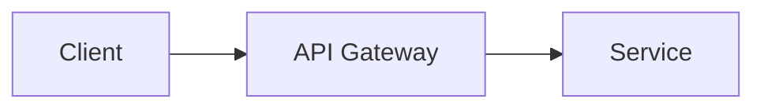

# 블로그 스타일 가이드

## 톤 & 말투
- **~다 체** 사용 ("구현했다", "적용했다", "해결했다")
- 이모지 사용 금지
- 간결하고 명확한 기술 문서 톤
- 실전 경험 기반, 1인칭 서술 ("이 프로젝트에서는", "당시 상황은")

## 구조
1. **개요** — 프로젝트 배경, 문제 정의
2. **아키텍처/설계** — 전체 구조, 기술 선택 이유 (다이어그램 포함)
3. **핵심 구현** — 주요 기능별 상세 설명 + 코드 (적당히)
4. **트러블슈팅** — 겪었던 문제와 해결 과정
5. **결과 및 회고** — 성과, 배운 점, 개선 방향

## 글 길이
- **10,000자 이상** 목표 (길게 작성)
- 깊이 있는 기술 설명 포함

## 코드 블록
- 적당히 사용 (핵심 로직 위주)
- 전체 코드 나열 금지, 중요한 부분만 발췌
- 언어 태그 필수 (```python, ```rust, ```typescript 등)

## 다이어그램
- Mermaid 다이어그램 적극 활용
- 아키텍처, 시퀀스, 플로우차트 등
- 예시:


## MkDocs Material 메타데이터
```yaml
---
title: "제목"
description: "설명"
date: YYYY-MM-DD
tags:
  - tag1
  - tag2
---
```

## 금지 사항
- 이모지 사용 금지
- 마크다운 테이블 남용 금지
- 뻔한 서론/결론 금지 ("이번 포스트에서는~", "감사합니다")
- AI가 쓴 티 나는 표현 금지 ("살펴보겠습니다", "알아보겠습니다")
