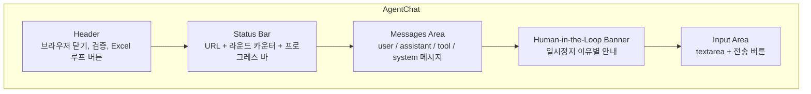
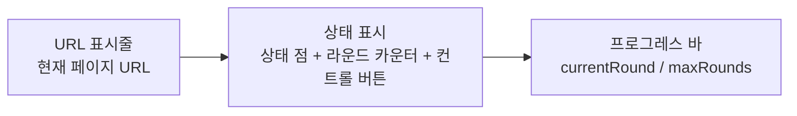
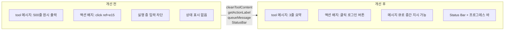

# Agent 채팅 UI: 도구 메시지 정리와 액션 배지 디자인

## 개요

XGEN 2.0의 AI Agent는 Playwright MCP를 통해 브라우저를 자동으로 조작한다. Agent가 웹 페이지를 클릭하고, 텍스트를 입력하고, 스크린샷을 찍을 때마다 MCP 도구의 응답이 채팅 UI에 표시된다. 문제는 이 응답이 사람이 읽기에 적합하지 않다는 것이었다.

`[snapshot]` 도구는 접근성 트리 전체를 반환한다. 수백 줄의 텍스트가 한 번에 채팅창에 쏟아지면, 사용자는 Agent가 뭘 하고 있는지 파악하기 어렵다. `[click]` 응답에는 `[ref=e15]` 같은 내부 참조 번호, `| Current page: https://...` 메타데이터, `(2 popup tab open)` 같은 부가 정보가 섞여 있었다. 액션 배지도 `click [ref=e15]` 같은 원시 데이터를 그대로 표시했다.

이 글에서는 `cleanToolContent` 함수로 도구 메시지를 한 줄 요약으로 정리하고, `getActionLabel` 함수로 액션 배지를 한글 라벨로 변환하며, Status Bar와 메시지 큐로 협업형 UX를 구현한 과정을 다룬다.

## AgentChat 컴포넌트 구조

### 전체 레이아웃

AgentChat은 Agent와 사용자 간의 채팅 인터페이스다. 브라우저 시작, 메시지 전송, 액션 실행, Human-in-the-Loop 배너, Excel 매핑까지 다양한 기능이 하나의 컴포넌트에 통합되어 있다.



`useAgentScenarioBuilder` 훅이 메시지 관리, 브라우저 제어, 액션 기록, 상태 관리를 담당한다. AgentChat은 이 훅의 상태를 렌더링하는 프레젠테이션 레이어다.

```typescript
const {
    messages,
    actions,
    isProcessing,
    isValidating,
    isBrowserOpen,
    currentUrl,
    isWaitingForHuman,
    humanWaitReason,
    currentRound,
    maxRounds,
    stopStatus,
    excelMapping,
    sendMessage,
    queueMessage,
    startBrowser,
    closeBrowser,
    clearChat,
    validateActions,
    resumeFromHuman,
    stopProcessing,
    pauseProcessing,
    // Excel 관련...
} = useAgentScenarioBuilder({ workflowId });
```

```
# 커밋: feat: add AgentChat component and useAgentScenarioBuilder hook for AI scenario builder
# 날짜: 2026-02-08 06:41
```

### 메시지 타입

채팅 메시지는 4가지 역할로 구분된다.

| 역할 | 스타일 | 내용 |
|------|--------|------|
| `user` | 파란 배경, 우측 정렬 | 사용자가 입력한 지시 |
| `assistant` | 흰 배경, 좌측 정렬 | Agent의 텍스트 응답 + 액션 배지 |
| `tool` | 연파란 배경, 모노스페이스 | MCP 도구 실행 결과 |
| `system` | 회색 배경, 가운데 정렬 | 시스템 알림 (Excel 매핑 적용 등) |

## 도구 메시지 정리: cleanToolContent

### 문제: MCP 도구 출력의 과다한 정보

Playwright MCP의 `[snapshot]` 도구는 페이지의 접근성 트리 전체를 텍스트로 반환한다. 일반적인 웹 페이지에서 이 출력은 200~500줄에 달한다.

```
[snapshot] Page snapshot
### Page: 대한항공
- navigation "글로벌 내비게이션"
  - link "대한항공 로고"
  - list
    - listitem
      - link "항공권"
    - listitem
      - link "예약 관리"
    - listitem
      - link "스카이패스"
  ... (수백 줄 계속)
[Open tabs]
- [e1] https://www.koreanair.com/kr/ko
[Current page]
- URL: https://www.koreanair.com/kr/ko
```

`[click]` 도구도 필요 이상의 메타데이터를 포함한다.

```
[click] Clicked [ref=e15] | Current page: https://www.koreanair.com/kr/ko (2 popup tab open)
```

이런 출력이 매 라운드마다 채팅창에 쌓이면, 사용자는 실제로 중요한 정보를 찾기 어렵다. 스크롤해도 대부분이 snapshot 덤프다.

### 해결: cleanToolContent 함수

`cleanToolContent`는 MCP 도구 출력을 도구별로 한 줄 요약으로 변환한다.

```typescript
const cleanToolContent = (content: string): string => {
    const lines = content.split('\n');
    const summaries: string[] = [];
    let skipUntilNextTool = false;

    for (const line of lines) {
        const trimmed = line.trim();
        if (!trimmed) continue;

        const toolMatch = trimmed.match(/^\[(\w+)\]\s*(.*)/);
        if (toolMatch) {
            const [, tool, rest] = toolMatch;
            skipUntilNextTool = false;

            if (tool === 'snapshot') {
                summaries.push('snapshot: 페이지 구조 확인 완료');
                skipUntilNextTool = true;
                continue;
            }
            if (tool === 'screenshot') {
                summaries.push('screenshot: 화면 캡처 완료');
                continue;
            }

            const clean = rest
                .replace(/\s*\[ref=\w+\]/g, '')
                .replace(/\s*\|\s*Current page:.*$/g, '')
                .replace(/\s*\(\d+ popup tab.*?\)/g, '')
                .trim();
            if (clean) summaries.push(`${tool}: ${clean}`);
            continue;
        }

        if (skipUntilNextTool) continue;
        if (trimmed.startsWith('###') || trimmed.startsWith('[Open tabs]') ||
            trimmed.startsWith('[Current page]')) continue;
    }

    return summaries.join('\n') || content.substring(0, 200);
};
```

```
# 커밋: fix: improve agent chat UI - clean tool messages, descriptive action badges
# 날짜: 2026-02-08 10:22
```

### 정리 규칙

함수의 핵심 로직은 줄 단위로 MCP 출력을 순회하면서, `[toolName]` 패턴을 기준으로 도구별 처리를 분기한다.

| 도구 | 원본 | 정리 후 |
|------|------|---------|
| `snapshot` | 접근성 트리 200줄 | `snapshot: 페이지 구조 확인 완료` |
| `screenshot` | Base64 이미지 데이터 | `screenshot: 화면 캡처 완료` |
| `click` | `Clicked [ref=e15] \| Current page: ...` | `click: Clicked` |
| `type` | `Typed "hello" [ref=e20] \| Current page: ...` | `type: Typed "hello"` |
| `navigate` | `Navigated to https://... \| Current page: ...` | `navigate: Navigated to https://...` |

정규식 3개가 메타데이터를 제거한다.

- `/\s*\[ref=\w+\]/g`: 내부 참조 번호 (`[ref=e15]`)
- `/\s*\|\s*Current page:.*$/g`: 현재 페이지 URL 메타데이터
- `/\s*\(\d+ popup tab.*?\)/g`: 팝업 탭 정보

`snapshot` 도구의 경우 `skipUntilNextTool` 플래그로 이후 모든 줄을 건너뛴다. 접근성 트리는 `[snapshot]` 다음 줄부터 다음 도구 출력까지 이어지기 때문이다.

폴백으로, 정리 결과가 비면 원본 200자를 잘라서 반환한다. 예상치 못한 형식의 도구 출력에도 최소한의 정보를 표시한다.

### 변환 전후 비교

**변환 전** (채팅창에 표시되는 내용):
```
[snapshot] Page snapshot
### Page: 쿠팡
- navigation "글로벌 내비게이션"
  - link "쿠팡 로고" [ref=e1]
  - list
    - listitem
      - link "로켓배송" [ref=e2]
    ... (300줄)
[click] Clicked [ref=e15] | Current page: https://www.coupang.com (1 popup tab open)
[snapshot] Page snapshot
### Page: 검색 결과
  ... (200줄)
```

**변환 후**:
```
snapshot: 페이지 구조 확인 완료
click: Clicked
snapshot: 페이지 구조 확인 완료
```

500줄이 3줄로 줄었다. 사용자는 Agent가 "페이지 구조를 확인하고 → 클릭하고 → 다시 구조를 확인했다"는 흐름을 즉시 파악할 수 있다.

## 액션 배지: getActionLabel

### 문제: 원시 데이터 표시

초기 AgentChat에서 액션 배지는 다음과 같이 표시되었다.

```
click [ref=e15]   type [ref=e20]   navigate https://www.example.com/very/long/path/to/page
```

`[ref=e15]`가 무엇인지 사용자가 알 수 없다. 셀렉터가 길면 배지가 한 줄을 넘기기도 했다.

### 해결: getActionLabel 함수

`getActionLabel`은 액션 타입별로 한글 라벨을 생성하고, 셀렉터와 값을 사람이 읽을 수 있는 길이로 잘라낸다.

```typescript
const getActionLabel = (a: Partial<RecordedAction>): string => {
    const target = (a.selector || '').substring(0, 25);
    const val = a.value || '';
    switch (a.type) {
        case 'click': return `클릭: ${target || val}`.trim();
        case 'type': return `입력: "${val.substring(0, 15)}"`;
        case 'select': return `선택: "${val.substring(0, 15)}"`;
        case 'hover': return `호버: ${target || val}`.trim();
        case 'navigate': return `이동: ${(a.url || val).substring(0, 25)}`;
        case 'press_key': return `키: ${val}`;
        case 'wait': return `대기: ${val}ms`;
        default: return a.type || '';
    }
};
```

### 셀렉터 개선: ref에서 elementDesc로

`getActionLabel`이 유의미한 라벨을 만들려면, `selector` 필드에 사람이 읽을 수 있는 텍스트가 들어와야 한다. 같은 커밋에서 `useAgentScenarioBuilder`의 액션 기록 로직도 함께 수정했다.

```typescript
// 개선 전:
recordedAction = {
    type: 'click',
    selector: `[ref=${ref}]`,    // 내부 ref 번호
    value: elementDesc,
};

// 개선 후:
recordedAction = {
    type: 'click',
    selector: elementDesc,        // 사람이 읽을 수 있는 설명
    value: elementDesc,
};
```

`elementDesc`는 MCP 도구 응답에서 추출한 요소 설명이다. 예를 들어 "로그인 버튼", "검색어 입력란", "장바구니 링크" 같은 텍스트다. 이 값이 `selector` 필드에 들어가면 `getActionLabel`의 `target`이 자연스러운 한글 텍스트가 된다.

```
# 커밋: fix: improve agent chat UI - clean tool messages, descriptive action badges
# 날짜: 2026-02-08 19:24
```

### 배지 표시 예시

| 원시 데이터 | 변환 후 배지 |
|-------------|-------------|
| `click [ref=e15]` | `클릭: 로그인 버튼` |
| `type "sonsj97" [ref=e20]` | `입력: "sonsj97"` |
| `navigate https://example.com/dashboard` | `이동: https://example.com/da...` |
| `press_key Enter` | `키: Enter` |
| `wait 2000` | `대기: 2000ms` |

## 메시지 렌더링: renderMessage

### 역할별 분기

`renderMessage` 함수는 메시지 역할에 따라 다른 렌더링을 적용한다.

```typescript
const renderMessage = (msg: ChatMessage) => {
    if (msg.isLoading) {
        return (
            <div key={msg.id} className={`${styles.message} ${styles.assistant}`}>
                <div className={styles.loading}>
                    <span /><span /><span />
                </div>
            </div>
        );
    }

    const roleClass = styles[msg.role] || '';

    if (msg.role === 'tool') {
        return (
            <div key={msg.id} className={`${styles.message} ${styles.tool}`}>
                {cleanToolContent(msg.content)}
            </div>
        );
    }

    const showContent = msg.content && msg.content !== '(액션 실행 중...)';

    return (
        <div key={msg.id} className={`${styles.message} ${roleClass}`}>
            {showContent && <div>{msg.content}</div>}
            {msg.actions && msg.actions.length > 0 && (
                <div className={styles.actionBadges}>
                    {msg.actions.map((a, i) => (
                        <span key={i} className={styles.actionBadge}>
                            {getActionLabel(a)}
                        </span>
                    ))}
                </div>
            )}
        </div>
    );
};
```

핵심 포인트:

- **tool 메시지**: `cleanToolContent`로 정리한 텍스트를 모노스페이스 폰트의 컴팩트 박스에 표시
- **assistant 메시지**: `(액션 실행 중...)` 플레이스홀더는 숨기고, 실제 텍스트와 액션 배지만 표시
- **로딩 상태**: bounce 애니메이션 3개 점으로 LLM 응답 대기 표시

### CSS 설계

도구 메시지와 액션 배지의 스타일은 정보 계층 구조를 명확히 한다.

```scss
.message {
    max-width: 85%;
    padding: $spacing-sm $spacing-md;
    border-radius: $radius-lg;
    font-size: $font-size-sm;
    line-height: 1.6;
    white-space: pre-wrap;
    word-break: break-word;
    flex-shrink: 0;

    &.tool {
        align-self: flex-start;
        background: $blue-50;
        color: $gray-600;
        font-size: $font-size-xs;
        font-family: 'SF Mono', 'Consolas', monospace;
        border: 1px solid $blue-200;
        border-radius: $radius-md;
        max-height: 150px;
        overflow-y: auto;
    }
}

.actionBadges {
    display: flex;
    flex-wrap: wrap;
    gap: 4px;
    margin-top: $spacing-xs;
}

.actionBadge {
    display: inline-flex;
    align-items: center;
    gap: 4px;
    font-size: 10px;
    padding: 2px 6px;
    background: rgba($primary-blue, 0.1);
    color: $primary-blue;
    border-radius: $radius-sm;
    font-weight: 500;
}
```

`.tool` 메시지의 `max-height: 150px`과 `overflow-y: auto`가 핵심이다. `cleanToolContent`가 도구 출력을 축약하지만, 여러 도구가 한 번에 실행되면 여전히 길어질 수 있다. 높이 제한과 내부 스크롤로 채팅 공간을 보호한다.

`.actionBadge`는 `flex-wrap`으로 한 라운드에 여러 액션이 있으면 자연스럽게 줄바꿈된다. `font-size: 10px`로 작게, 투명 파란 배경으로 시각적 비중을 낮추면서도 눈에 띄게 했다.

## 트러블슈팅

### Flex 레이아웃에서 메시지 압축

초기 구현에서 메시지가 많아지면 위쪽 메시지들이 사라지는 현상이 있었다. `flex` 컨테이너 안의 자식 요소가 기본적으로 `flex-shrink: 1`이라, 공간이 부족하면 각 메시지가 압축되어 높이가 0에 수렴했다.

```scss
.message {
    flex-shrink: 0;  // 메시지가 압축되지 않도록
}
```

```
# 커밋: fix: add flex-shrink:0 to prevent message compression in flex layout
# 날짜: 2026-02-08 11:18
```

### 메시지 영역 스크롤

메시지 컨테이너 자체의 스크롤도 문제였다. 부모가 `flex`이고 자식에 `overflow-y: auto`를 설정해도, `min-height`가 지정되지 않으면 컨테이너가 내용에 맞춰 무한히 늘어난다.

```scss
.messages {
    flex: 1;
    min-height: 0;     // flex 자식의 스크롤 활성화
    overflow-y: auto;
    padding: $spacing-md;
    display: flex;
    flex-direction: column;
    gap: $spacing-sm;
}
```

`min-height: 0`이 없으면 `flex: 1` 자식은 최소 높이가 `auto`(내용 높이)가 되어, overflow가 발생하지 않고 부모를 밀어낸다. `min-height: 0`으로 이를 무력화해야 스크롤이 제대로 동작한다.

```
# 커밋: fix: add min-height:0 for flex scroll in agent chat
# 날짜: 2026-02-08 10:31
```

### textarea 자동 높이 조절

여러 줄 입력을 지원하면서도 기본 상태에서는 한 줄만 차지하도록, textarea의 높이를 내용에 따라 동적으로 조절했다.

```typescript
const handleTextareaInput = (e: React.ChangeEvent<HTMLTextAreaElement>) => {
    setInputValue(e.target.value);
    // 높이 자동 조절
    e.target.style.height = 'auto';
    e.target.style.height = `${Math.min(e.target.scrollHeight, 120)}px`;
};
```

`max-height: 120px`으로 제한하여, 긴 텍스트를 붙여넣어도 입력 영역이 채팅창을 과도하게 차지하지 않는다.

```
# 커밋: fix: auto-resize textarea + increase max-height for agent chat input
# 날짜: 2026-02-08 19:34
```

## Status Bar: 실시간 진행 표시

### 3단 구성

Status Bar는 Agent가 실행 중일 때 현재 상태를 한눈에 보여준다.



```typescript
<div className={styles.statusBar}>
    <div className={styles.statusRow}>
        <span className={styles.statusUrl} title={currentUrl}>
            {currentUrl}
        </span>
    </div>
    <div className={styles.statusRow}>
        <span className={`${styles.statusDot} ${statusClass}`} />
        <span className={styles.statusMeta}>
            {statusLabel}
            {currentRound > 0 && <> · Round {currentRound}/{maxRounds}</>}
            {actions.length > 0 && <> · Actions: {actions.length}</>}
        </span>
        {isProcessing && !isWaitingForHuman && (
            <div className={styles.statusControls}>
                <button className={`${styles.statusControlBtn} ${styles.pauseControl}`}
                    onClick={pauseProcessing}
                    disabled={stopStatus !== 'none'}>
                    {stopStatus === 'pausing'
                        ? <><FiRefreshCw className={styles.spinning} /> 정지 중...</>
                        : <><FiPause /> 일시정지</>}
                </button>
                <button className={`${styles.statusControlBtn} ${styles.stopControl}`}
                    onClick={stopProcessing}
                    disabled={stopStatus !== 'none'}>
                    {stopStatus === 'stopping'
                        ? <><FiRefreshCw className={styles.spinning} /> 중지 중...</>
                        : <><FiSquare /> 중지</>}
                </button>
            </div>
        )}
    </div>
    {isProcessing && currentRound > 0 && (
        <div className={styles.progressBar}>
            <div className={styles.progressFill}
                style={{ width: `${Math.min((currentRound / maxRounds) * 100, 100)}%` }} />
        </div>
    )}
</div>
```

```
# 커밋: feat: add live status bar and message queue for agent chat
# 날짜: 2026-02-09 15:58
```

### 상태 점(Status Dot)

3가지 색상으로 Agent 상태를 직관적으로 표시한다.

| 상태 | 색상 | 조건 |
|------|------|------|
| 실행 중 | 녹색 (+ 발광 효과) | `isProcessing && !isWaitingForHuman` |
| 대기/일시정지 | 황색 (+ 발광 효과) | `isWaitingForHuman` |
| 유휴 | 회색 | 그 외 |

```scss
.statusDot {
    display: inline-block;
    width: 6px;
    height: 6px;
    border-radius: 50%;

    &.active {
        background: $green-600;
        box-shadow: 0 0 4px rgba($green-600, 0.4);
    }
    &.paused {
        background: #f59e0b;
        box-shadow: 0 0 4px rgba(245, 158, 11, 0.4);
    }
    &.idle {
        background: $gray-400;
    }
}
```

### 즉각 피드백: stopStatus 3상태

중지/일시정지 버튼을 클릭하면 실제 중지는 현재 LLM 라운드가 완료된 후에 반영된다. LLM 응답을 중간에 끊을 수 없기 때문이다. 하지만 사용자에게는 즉시 피드백이 필요하다.

`stopStatus`를 3상태로 관리하여, 버튼 클릭 즉시 스피너 + "중지 중..." 텍스트를 표시하고, 동시에 버튼을 비활성화한다.

```
none → stopping (중지 클릭)
none → pausing (일시정지 클릭)
stopping/pausing → none (실제 중지 완료)
```

```
# 커밋: fix: add instant feedback for stop/pause buttons in agent status bar
# 날짜: 2026-02-09 16:30
```

## 실행 중 메시지 큐

### 기존 문제

Agent가 실행 중일 때 `isProcessing`이 `true`면 입력이 완전히 차단되었다. 사용자가 "아, 그거 말고 이렇게 해줘"라고 방향을 수정하고 싶어도, Agent가 현재 라운드를 완료할 때까지 기다려야 했다.

### queueMessage 메커니즘

```typescript
const queuedMessageRef = useRef<string | null>(null);

const queueMessage = useCallback((msg: string) => {
    queuedMessageRef.current = msg;
}, []);
```

UI에서는 `isProcessing` 상태여도 textarea를 활성화한다. 전송 시 `queueMessage`로 ref에 저장하고, "다음 라운드에 반영됩니다" 피드백을 2초간 표시한다.

```typescript
const handleSend = async () => {
    const msg = inputValue.trim();
    if (!msg) return;

    if (isProcessing && !isWaitingForHuman) {
        queueMessage(msg);
        setInputValue('');
        setShowQueuedFeedback(true);
        setTimeout(() => setShowQueuedFeedback(false), 2000);
        return;
    }
    // ...
};
```

Agent 루프 내부에서는 매 라운드 시작 시 큐를 확인하고, 대기 중인 메시지가 있으면 대화에 주입한다.

```typescript
for (let round = 0; round < MAX_ROUNDS; round++, totalRounds++) {
    setCurrentRound(totalRounds + 1);

    if (queuedMessageRef.current) {
        const injectedMsg: ChatMessage = {
            id: `msg_${Date.now()}_inject`,
            role: 'user',
            content: queuedMessageRef.current,
            timestamp: new Date(),
        };
        conversationRef.current = [...conversationRef.current, injectedMsg];
        setMessages([...conversationRef.current]);
        queuedMessageRef.current = null;
    }
    // LLM 호출 → 주입된 메시지가 컨텍스트에 반영됨
}
```

```
# 커밋: feat: Status Bar + 실행 중 메시지 전송 (협업 UX Phase 1)
# 날짜: 2026-02-09 11:23
```

이 메커니즘 덕분에 Agent가 돌고 있는 동안에도 사용자가 방향을 수정할 수 있다. 메시지는 다음 LLM 호출의 대화 컨텍스트에 포함되므로, Agent는 사용자의 추가 지시를 자연스럽게 반영한다.

## 결과 및 회고

### UI 개선 전후



### 진화 타임라인

| 날짜 | 커밋 | 변경 내용 |
|------|------|-----------|
| 02-08 06:41 | `4c221cc8` | AgentChat 최초 생성, 원시 메시지 표시 |
| 02-08 10:22 | `8a123caf` | cleanToolContent + getActionLabel 도입 |
| 02-08 10:31 | `a68a0b6e` | flex 스크롤 수정 (min-height: 0) |
| 02-08 11:18 | `6835f340` | flex-shrink: 0으로 메시지 압축 방지 |
| 02-08 19:24 | `c1f55de4` | selector를 elementDesc로 변경 |
| 02-08 19:34 | `05e184cd` | textarea 자동 높이 조절 |
| 02-09 15:58 | `b8c56e27` | Status Bar + 프로그레스 바 + 메시지 큐 |
| 02-09 16:30 | `84a5f152` | stopStatus 3상태 즉각 피드백 |

### 설계 원칙

**"도구 출력은 사용자를 위한 것이 아니다"**: MCP 도구의 응답은 LLM이 다음 행동을 결정하기 위한 입력이다. 사용자에게는 "뭘 했고 결과가 뭔지"만 보여주면 된다. `cleanToolContent`는 이 간극을 메우는 번역 레이어다.

**"원시 식별자를 사용자에게 노출하지 마라"**: `[ref=e15]`는 Playwright 접근성 트리의 내부 참조 번호다. 개발자도 의미를 알 수 없다. `elementDesc`로 변환하여 "로그인 버튼"이라는 자연어를 표시하는 것이 기본이다.

**"실행 중에도 사용자를 차단하지 마라"**: Agent가 자율적으로 동작하더라도, 사용자가 언제든 개입할 수 있어야 한다. 메시지 큐는 이 원칙의 최소한의 구현이다. Human-in-the-Loop 일시정지가 "완전한 개입"이라면, 메시지 큐는 "가벼운 조언"이다.
