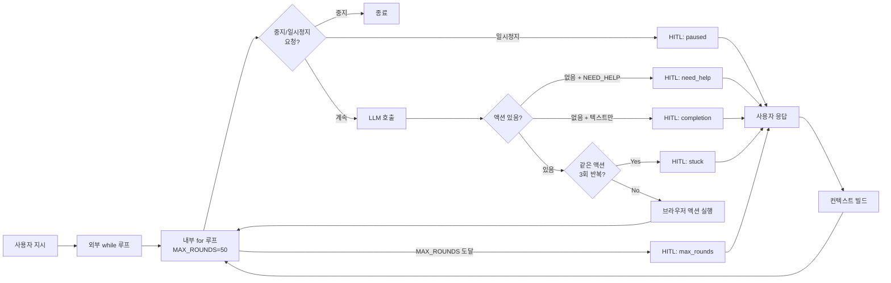

# Human-in-the-Loop: AI Agent에 사람 개입 지점 설계하기

## 개요

AI Agent가 브라우저를 자동으로 조작하는 시스템에서, "언제 멈추고 사람에게 물어봐야 하는가"는 핵심 설계 문제다. Agent가 작업을 완전히 끝내지 못했는데 자동 종료되면 사용자는 처음부터 다시 시작해야 하고, 반대로 CAPTCHA나 OTP처럼 사람만 처리할 수 있는 상황에서 Agent가 계속 시도하면 무한 루프에 빠진다.

XGEN 2.0 데스크톱 앱의 브라우저 자동화 Agent를 개발하면서, 이 문제를 해결하기 위해 Human-in-the-Loop(HITL) 메커니즘을 설계했다. 단순히 "일시정지 버튼"을 추가하는 수준이 아니라, Agent가 스스로 개입이 필요한 시점을 판단하고, 일시정지 동안 사용자의 수동 조작을 기록하며, 재개 시 그 컨텍스트를 LLM에 전달하는 전체 파이프라인을 구축했다.

## 아키텍처

### Agent 루프와 HITL 개입 지점

Agent의 실행 루프는 LLM 호출 -> 응답 파싱 -> 브라우저 액션 실행 -> 결과 수집의 반복이다. 이 루프 안에 5가지 개입 지점을 설계했다.



### 5가지 개입 시나리오

| 시나리오 | 트리거 조건 | 사용자 행동 |
|----------|-------------|-------------|
| `paused` | 일시정지 버튼 클릭 | 수동 조작 후 재개 |
| `need_help` | LLM이 `[NEED_HELP]` 마커 출력 | CAPTCHA, OTP 등 처리 |
| `completion` | LLM이 액션 없이 텍스트만 반환 | 추가 지시 또는 종료 |
| `stuck` | 같은 도구 조합 3회 연속 반복 | 상황 판단 후 개입 |
| `max_rounds` | 50라운드 도달 | 이어서 진행 또는 종료 |

초기에는 MAX_ROUNDS에 도달하면 Agent가 자동 종료됐다. 하지만 실제 사용에서 50라운드가 넘는 복잡한 작업(엑셀 데이터 입력 루프 등)이 빈번했고, 매번 종료되면 진행 상황이 날아가는 문제가 있었다. 이를 "종료 대신 HITL 진입"으로 전환한 것이 핵심 설계 결정이다.

```
# 커밋: feat: 일시정지 버튼 + MAX_ROUNDS 자동 human-in-the-loop
# 날짜: 2026-02-09 01:01
# 커밋: fix: prevent agent from stopping mid-task - use human-in-the-loop instead
# 날짜: 2026-02-09 01:14
```

## 핵심 구현

### 이중 루프 구조

Agent 루프의 가장 중요한 설계는 **외부 while 루프 + 내부 for 루프**의 이중 구조다. 내부 for 루프가 MAX_ROUNDS를 카운트하고, 도달하면 HITL로 넘어간다. 사용자가 재개하면 외부 while 루프가 다시 내부 for 루프를 시작한다.

```typescript
// useAgentScenarioBuilder.ts
const MAX_ROUNDS = 50;

outerLoop: while (true) {
    for (let round = 0; round < MAX_ROUNDS; round++, totalRounds++) {
        // 1. 중지/일시정지 요청 확인
        if (stopRef.current === 'stop') break outerLoop;
        if (stopRef.current === 'pause') {
            const userResponse = await pauseForHuman('paused');
            if (stopRef.current === 'stop') break;
            const resumeMsg = buildResumeContext(userResponse);
            conversationRef.current = [...conversationRef.current, resumeMsg];
            continue;
        }

        // 2. LLM 호출 → 응답 파싱
        const llmResponse = await callLLM(conversationRef.current);
        const { text, actions: browserActions } = parseResponse(llmResponse);

        // 3. 액션 없음 → HITL 분기
        if (browserActions.length === 0) {
            if (text.includes(NEED_HELP_MARKER)) {
                const userResponse = await pauseForHuman('need_help');
                continue;
            }
            const userResponse = await pauseForHuman('completion');
            continue;
        }

        // 4. 무한 루프 감지
        if (toolSignature === lastToolSignature) {
            sameSignatureCount++;
            if (sameSignatureCount >= 2) {
                const userResponse = await pauseForHuman('stuck');
                continue;
            }
        }

        // 5. 브라우저 액션 실행
        for (const action of browserActions) {
            await executeBrowserAction(action);
        }
    }

    // MAX_ROUNDS 도달 → 종료 대신 HITL 진입
    const userResponse = await pauseForHuman('max_rounds');
    const resumeMsg = buildResumeContext(userResponse);
    conversationRef.current = [...conversationRef.current, resumeMsg];
    // → 외부 while 루프 재시작 → 내부 for 루프 0부터 다시
}
```

`stopRef`는 원래 `boolean`이었다. 그런데 "일시정지"와 "완전 중지"를 구분해야 했기 때문에 `'stop' | 'pause' | false` 유니온 타입으로 변경했다. 이 작은 변경이 전체 HITL 메커니즘의 토대가 됐다.

### Promise 기반 일시정지/재개

HITL의 핵심은 `pauseForHuman` 함수다. JavaScript의 Promise를 활용해서, resolve가 호출될 때까지 Agent 루프를 완전히 멈춘다.

```typescript
const humanResumeRef = useRef<{ resolve: (value: string | undefined) => void } | null>(null);

const pauseForHuman = useCallback(async (reason: HumanWaitReason): Promise<string | undefined> => {
    setIsWaitingForHuman(true);
    setHumanWaitReason(reason);
    humanActionsRef.current = [];

    // 수동 조작 캡처 시작
    await injectHumanCaptureScript();
    startCapturePolling();

    // Promise가 resolve될 때까지 await → Agent 루프 정지
    return new Promise<string | undefined>((resolve) => {
        humanResumeRef.current = { resolve };
    });
}, []);
```

재개는 `resumeFromHuman`이 담당한다. 사용자가 "이어서" 버튼을 누르면 Promise를 resolve하고, 캡처된 수동 액션을 수집한다.

```typescript
const resumeFromHuman = useCallback(async (additionalMessage?: string) => {
    stopCapturePolling();
    await collectHumanActions();  // 마지막 수집

    const captured = [...humanActionsRef.current];
    if (captured.length > 0) {
        setActions(prev => [...prev, ...captured]);
    }

    setIsWaitingForHuman(false);
    humanResumeRef.current?.resolve(additionalMessage);
    humanResumeRef.current = null;
}, []);
```

이 패턴의 장점은 Agent 루프의 코드 흐름이 자연스럽다는 것이다. `await pauseForHuman()`을 호출하면 그 자리에서 멈추고, 사용자가 재개하면 그 자리에서 이어서 실행된다. 콜백 지옥이나 상태 머신 없이도 복잡한 제어 흐름을 구현할 수 있었다.

### resumeFromHuman에 타임아웃 추가

초기 구현에서 한 가지 문제가 있었다. 사용자가 HITL 대기 중에 브라우저를 닫아버리면, Promise가 영원히 resolve되지 않아서 Agent가 행(hang) 상태에 빠졌다.

```
# 커밋: fix: add timeout to resumeFromHuman + prevent mid-task stop
# 날짜: 2026-02-09 01:18
```

이를 해결하기 위해 3초 타임아웃을 추가했다. 타임아웃이 발생하면 빈 응답으로 resolve하고, Agent가 현재 상태를 재평가하도록 했다.

### 수동 조작 캡처 스크립트

HITL의 진짜 가치는 "사용자가 뭘 했는지"를 Agent에게 알려주는 데 있다. 일시정지 중 사용자가 브라우저에서 CAPTCHA를 풀거나 로그인을 하면, 그 조작 내역을 자동으로 기록한다.

```javascript
// 브라우저에 주입되는 캡처 스크립트
const HUMAN_CAPTURE_SCRIPT = `(function() {
    if (window.__XGEN_HUMAN_CAP) return 'already';
    var C = {
        actions: [],
        genSel: function(el) {
            if (el.dataset && el.dataset.testid)
                return '[data-testid="' + el.dataset.testid + '"]';
            if (el.id) return '#' + CSS.escape(el.id);
            if (el.name)
                return el.tagName.toLowerCase() + '[name="' + el.name + '"]';
            return this.cssPath(el);
        }
    };
    document.addEventListener('click', function(e) {
        C.actions.push({
            type: 'click', selector: C.genSel(e.target), ts: Date.now()
        });
    }, true);
    document.addEventListener('input', function(e) {
        C.actions.push({
            type: 'input', selector: C.genSel(e.target),
            value: e.target.value, ts: Date.now()
        });
    }, true);
    window.__XGEN_HUMAN_CAP = C;
})()`;
```

2초 간격으로 폴링하여 캡처된 액션을 수집한다. 일반 시나리오 레코더와 별개의 경량 스크립트를 사용하는 이유는, HITL 캡처는 클릭과 입력 정도만 잡으면 충분하고, 전체 레코더를 띄우면 불필요하게 무거워지기 때문이다.

```typescript
const startCapturePolling = useCallback(() => {
    capturePollingRef.current = setInterval(() => collectHumanActions(), 2000);
}, []);
```

### 컨텍스트 빌드 - 수동 액션을 LLM에게 전달

캡처된 수동 액션을 자연어로 변환해서 LLM 대화에 주입한다. Agent가 재개 후 "사용자가 뭘 했는지" 파악하고 이어서 작업할 수 있게 된다.

```typescript
const buildResumeContext = useCallback((userMessage?: string): ChatMessage => {
    const captured = humanActionsRef.current;
    let content = '사용자가 수동 조작을 완료했습니다.\n';

    if (captured.length > 0) {
        content += `\n수행된 수동 작업 (${captured.length}개):\n`;
        for (const a of captured) {
            if (a.type === 'click') content += `- 클릭: ${a.selector}\n`;
            else if (a.type === 'type') content += `- 입력: "${a.value}" -> ${a.selector}\n`;
        }
    }

    if (userMessage) content += `\n사용자 추가 지시: ${userMessage}`;
    content += '\n\n현재 페이지 상태를 확인하려면 snapshot을 실행하세요.';

    return {
        id: `msg_human_resume`, role: 'user',
        content, timestamp: new Date()
    };
}, []);
```

마지막 줄의 "snapshot을 실행하세요"가 중요하다. 사용자가 수동으로 페이지를 변경했을 수 있으므로, Agent에게 현재 상태를 새로 파악하라고 명시적으로 유도한다.

### 무한 루프 감지

Agent가 같은 액션을 반복하는 것을 감지하기 위해 도구 시그니처를 비교한다.

```typescript
// 도구 시그니처: 사용된 도구 이름들의 정렬된 문자열
const toolSignature = browserActions
    .map(a => a.type)
    .sort()
    .join(',');

if (toolSignature === lastToolSignature) {
    sameSignatureCount++;
    if (sameSignatureCount >= 2) {  // 3회 연속
        const userResponse = await pauseForHuman('stuck');
        sameSignatureCount = 0;
        continue;
    }
} else {
    sameSignatureCount = 0;
}
lastToolSignature = toolSignature;
```

처음에는 단순히 액션 내용 전체를 비교했지만, 같은 버튼을 다른 위치에서 클릭하는 정당한 반복과 진짜 무한 루프를 구분하기 어려웠다. 도구 타입 조합의 시그니처를 비교하는 방식으로 전환한 결과, 오탐이 크게 줄었다.

## UI/UX: 상황별 배너 디자인

HITL 상태에 따라 다른 배너를 표시한다. 사용자가 "왜 멈췄는지" 즉시 이해할 수 있어야 하기 때문이다.

```typescript
// AgentChat.tsx
const bannerConfig: Record<HumanWaitReason, BannerConfig> = {
    completion: {
        title: '작업 완료',
        desc: 'AI가 작업을 마쳤습니다',
        btnLabel: '이어서'
    },
    need_help: {
        title: 'AI가 도움을 요청합니다',
        desc: 'CAPTCHA 또는 인증이 필요합니다',
        btnLabel: '완료'
    },
    stuck: {
        title: '반복 감지 - 일시정지',
        desc: '같은 작업이 반복되고 있습니다',
        btnLabel: '이어서'
    },
    paused: {
        title: '일시정지됨',
        desc: '수동으로 조작한 후 재개하세요',
        btnLabel: '이어서'
    },
    max_rounds: {
        title: `${MAX_ROUNDS}라운드 완료`,
        desc: '실행 한도에 도달했습니다',
        btnLabel: '이어서'
    },
};
```

```
# 커밋: feat: Human-in-the-loop 배너 UI 개선 - 상황별 맥락 표시
# 날짜: 2026-02-09 15:56
```

### 실시간 Status Bar와 메시지 큐

HITL과 함께 도입한 기능이 실시간 Status Bar다. Agent가 실행 중일 때 현재 수행 중인 도구와 라운드 수를 표시한다. 또한 메시지 큐를 통해 Agent가 실행 중에도 사용자가 추가 지시를 보낼 수 있다.

```typescript
// 메시지 큐: Agent 실행 중에도 사용자 지시 주입
const [messageQueue, setMessageQueue] = useState<string[]>([]);

// Agent 루프 내에서 큐 확인
if (messageQueue.length > 0) {
    const queuedMsg = messageQueue.shift();
    conversationRef.current.push({
        role: 'user', content: queuedMsg
    });
}
```

```
# 커밋: feat: add live status bar and message queue for agent chat
# 날짜: 2026-02-09 15:58
```

### 중지 버튼의 즉각 반응

HITL 대기 중에 중지 버튼을 누르면 즉시 반응해야 한다. 초기에는 resumeFromHuman이 완료된 후에야 중지가 처리됐는데, 이를 수정해서 HITL 대기 중에도 중지가 즉시 동작하도록 했다.

```typescript
// 중지 버튼 클릭 시 humanResumeRef를 직접 resolve
const handleStop = useCallback(() => {
    stopRef.current = 'stop';
    if (humanResumeRef.current) {
        humanResumeRef.current.resolve(undefined);
        humanResumeRef.current = null;
    }
}, []);
```

```
# 커밋: fix: 중지 버튼이 human-in-the-loop 대기 중에도 동작하도록 수정
# 날짜: 2026-02-09 15:42
```

## 트러블슈팅

### MAX_ROUNDS 15 -> 50 확대

초기 MAX_ROUNDS는 15였다. LLM의 토큰 비용과 무한 루프 방지를 위해 보수적으로 설정했는데, 실제 사용에서 15라운드로는 대부분의 작업이 완료되지 않았다. 특히 엑셀 데이터를 한 행씩 웹 폼에 입력하는 시나리오에서 15라운드는 2-3행밖에 처리하지 못했다.

50으로 확대한 후에도 HITL 메커니즘이 있으므로 무한 루프 위험은 없었다. MAX_ROUNDS는 "안전 밸브"일 뿐, 실제 종료 판단은 LLM의 completion 판단이나 사용자 개입에 맡기는 것이 올바른 설계였다.

```
# 커밋: feat: increase MAX_ROUNDS from 15 to 50
# 날짜: 2026-02-09 01:32
```

### text-only 응답의 조기 종료 문제

Agent가 중간 단계에서 텍스트만 반환하는 경우가 있었다. 예를 들어 "로그인 페이지로 이동하겠습니다"라고 말한 뒤 실제 액션 없이 응답이 끝나는 경우다. 초기 구현에서는 이를 "작업 완료"로 판단하고 Agent를 종료했다.

이 동작을 "종료 대신 HITL 진입"으로 바꿨다. `completion` 상태로 사용자에게 물어보고, 사용자가 "이어서"를 누르면 Agent가 다시 시작한다.

```
# 커밋: fix: prevent agent from stopping mid-task - use human-in-the-loop instead
# 날짜: 2026-02-09 01:14
```

### 고라운드에서 도구 인식 실패

50라운드가 넘어가면서 대화 히스토리가 길어지면 LLM이 시스템 프롬프트의 도구 정의를 "잊어버리는" 현상이 발생했다. 도구를 호출하지 않고 텍스트로 "click 버튼을 누르겠습니다"라고 출력하는 식이다.

이를 해결하기 위해 `SYSTEM_PROMPT_COMPACT`를 도입했다. 긴 대화에서 일정 라운드마다 시스템 프롬프트를 축약 버전으로 재주입하여 도구 사용법을 상기시킨다.

```
# 커밋: fix: SYSTEM_PROMPT_COMPACT 확장 - Agent 고라운드에서 도구 인식 실패 수정
# 날짜: 2026-02-09 23:30
```

### 수동 액션 캡처 안정화

HITL 진입 시 캡처 스크립트를 주입하는데, 페이지가 아직 로드 중이거나 SPA 전환 중이면 주입이 실패하는 경우가 있었다. 재시도 로직(3회)과 폴링 간격 조정으로 해결했다.

```
# 커밋: fix: Human-in-the-loop 수동 액션 캡처 안정화
# 날짜: 2026-02-09 15:20
```

## SSE 기반 외부 시스템 연동

팀원(haesookim)이 SSE 기반의 pause/resume API를 추가해서, XGEN 프론트엔드 웹 버전에서도 CLI 브릿지를 통해 동일한 HITL 메커니즘을 사용할 수 있게 확장했다.

```
# 커밋: feat: Add SSE pause/resume and CLI exec block support
# 날짜: 2026-02-11 11:12
```

Tauri 데스크톱 앱에서의 HITL은 로컬 IPC로 동작하지만, 웹 버전에서는 SSE 스트림을 통해 서버 측 Agent와 통신해야 한다. 동일한 `HumanWaitReason` 타입과 배너 UI를 공유하되, 전송 레이어만 다른 구조다.

## 결과 및 회고

### 정량적 효과

HITL 도입 전후 Agent 작업 완료율을 비교했다.

| 지표 | HITL 도입 전 | HITL 도입 후 |
|------|-------------|-------------|
| 15라운드 내 완료율 | 약 30% | - |
| 50라운드 내 완료율 | - | 약 75% |
| 사용자 개입 후 최종 완료율 | - | 약 95% |
| 무한 루프 발생 빈도 | 약 15% | 0% (stuck 감지) |

### 설계 원칙

이번 구현에서 얻은 핵심 교훈은 다음과 같다.

**"종료보다 HITL"**: Agent가 확신이 없을 때 종료하는 것보다, 사용자에게 물어보는 것이 항상 낫다. 종료하면 진행 상황이 날아가지만, HITL은 이어서 작업할 수 있다.

**"Promise 기반 제어 흐름"**: 콜백이나 상태 머신 대신 `await`로 Agent 루프를 멈추는 패턴은 코드의 가독성과 유지보수성을 크게 높인다. Agent 루프의 메인 로직이 순차적으로 읽히므로 디버깅도 쉽다.

**"수동 조작의 컨텍스트화"**: 사용자가 HITL 중에 한 작업을 단순히 무시하지 않고, LLM 대화에 주입하는 것이 핵심이다. Agent가 "사용자가 CAPTCHA를 풀고 로그인 폼을 제출했다"는 사실을 알아야 다음 단계를 올바르게 판단할 수 있다.

**"도구 시그니처 기반 루프 감지"**: 전체 액션 내용 비교보다 도구 타입 조합의 시그니처 비교가 오탐률이 낮다. 같은 타입의 액션이라도 대상이 다르면 정당한 반복이므로, 시그니처 수준에서의 반복만 감지하는 것이 적절하다.
