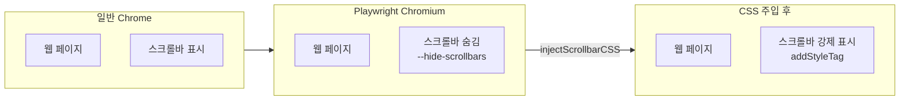

# Playwright 스크롤바 강제 표시: headless 환경의 UI 트릭

## 개요

XGEN 2.0의 브라우저 자동화 Agent를 테스트하다가 이상한 점을 발견했다. Playwright로 열린 브라우저에서 스크롤바가 보이지 않는 것이다. 페이지 내용이 뷰포트보다 길어도 스크롤바가 없었다. 일반 Chrome 브라우저에서는 정상적으로 보이는데, Playwright Chromium에서만 사라졌다.

원인은 Playwright가 Chromium을 실행할 때 기본으로 전달하는 `--hide-scrollbars` 플래그였다. headless 테스트 환경에서 스크린샷의 일관성을 위해 스크롤바를 숨기는 것인데, XGEN처럼 사용자가 직접 브라우저를 보면서 Agent와 협업하는 시나리오에서는 문제가 된다. 스크롤바가 없으면 페이지가 스크롤 가능한지, 현재 위치가 어디인지 파악할 수 없다.

이 문제를 `injectScrollbarCSS()` 함수로 해결했다. `page.addStyleTag()`로 `::-webkit-scrollbar` CSS를 주입하여 스크롤바를 강제로 표시하고, 페이지 네비게이션마다 자동으로 재주입하는 메커니즘이다.

## 문제 분석

### --hide-scrollbars 플래그

Playwright는 Chromium을 실행할 때 여러 플래그를 자동으로 전달한다. 그 중 `--hide-scrollbars`는 CSS의 `::-webkit-scrollbar` 의사 요소에 `display: none`을 적용하는 효과를 가진다.



이 플래그는 Playwright의 Chromium 바이너리에 하드코딩되어 있어서, 실행 옵션으로 끌 수 없다. Playwright의 설계 의도는 headless 테스트에서 스크린샷 픽셀 비교의 일관성을 유지하는 것이다. 하지만 XGEN에서는 headed 모드로 실행하면서 사용자가 실시간으로 브라우저를 보는 구조이므로, 스크롤바가 필수다.

### 영향 범위

스크롤바가 없으면 다음과 같은 문제가 발생한다.

| 상황 | 문제 |
|------|------|
| 사용자가 직접 브라우저 조작 | 스크롤 가능 여부 알 수 없음 |
| Agent의 스크린샷/스냅샷 | 스크롤 위치 파악 불가 |
| HITL 중 수동 조작 | "아래에 더 있다"는 시각적 힌트 없음 |
| 시나리오 녹화 | 스크롤 액션 녹화 시 혼란 |

## 핵심 구현

### injectScrollbarCSS 함수

`page.addStyleTag()`를 사용하여 `<style>` 태그를 DOM에 직접 삽입한다. `::-webkit-scrollbar` 의사 요소를 `!important`로 오버라이드하여, `--hide-scrollbars` 플래그의 효과를 무력화한다.

```typescript
// useAgentScenarioBuilder.ts
async function injectScrollbarCSS(): Promise<void> {
    try {
        await browserManager.runCode(`async (page) => {
            await page.addStyleTag({ content: \`
                html {
                    overflow: auto !important;
                }
                ::-webkit-scrollbar {
                    display: block !important;
                    width: 12px !important;
                    height: 12px !important;
                }
                ::-webkit-scrollbar-thumb {
                    background: #888 !important;
                    border-radius: 6px !important;
                }
                ::-webkit-scrollbar-track {
                    background: #f1f1f1 !important;
                }
            \`});
        }`);
    } catch (e) {
        console.warn('[AgentBuilder] Failed to inject scrollbar CSS:', e);
    }
}
```

CSS 속성별 역할은 다음과 같다.

- `html { overflow: auto !important; }`: 일부 사이트가 `overflow: hidden`으로 스크롤 자체를 비활성화하는 경우에 대응
- `::-webkit-scrollbar { display: block !important; width: 12px; }`: 스크롤바를 강제 표시하고 적절한 너비 설정
- `::-webkit-scrollbar-thumb { background: #888; border-radius: 6px; }`: 스크롤 핸들에 시각적 구분을 부여
- `::-webkit-scrollbar-track { background: #f1f1f1; }`: 트랙 배경색으로 스크롤바 영역 식별

`!important`를 모든 속성에 사용하는 이유는, `--hide-scrollbars` 플래그가 user-agent 스타일시트 레벨에서 적용되기 때문이다. 일반 CSS로는 이를 오버라이드할 수 없고, `!important`가 필요하다.

```
# 커밋: feat: Playwright 스크롤바 강제 표시 (injectScrollbarCSS)
# 날짜: 2026-02-09 13:26
```

### 재주입 타이밍

`addStyleTag`로 삽입된 `<style>` 태그는 현재 페이지의 DOM에만 존재한다. 페이지가 전환되면 DOM이 통째로 교체되므로, 스크롤바 CSS도 사라진다. 2곳에서 재주입을 수행한다.

**1. 브라우저 최초 시작 시**

```typescript
const startBrowser = useCallback(async (url: string) => {
    await browserManager.navigate(url);
    setCurrentUrl(url);
    await browserManager.waitForLoadState('load', 10000);

    // Playwright Chromium --hide-scrollbars 대응
    await injectScrollbarCSS();
}, []);
```

**2. navigate 액션 실행 후**

Agent가 `browser_navigate` 도구를 호출할 때마다 재주입한다.

```typescript
case 'navigate': {
    result = await browserManager.navigate(action.args.url);
    if (result.success) {
        setCurrentUrl(action.args.url);
        await browserManager.waitForLoadState('load', 8000);
        lastSnapshotRef.current = '';
        // 페이지 새로 로드 → 스크롤바 CSS 재주입
        await injectScrollbarCSS();
    }
    break;
}
```

`waitForLoadState('load')` 이후에 주입하는 것이 중요하다. 페이지가 아직 로드 중일 때 `addStyleTag`를 호출하면, 후속 리소스 로드가 스타일을 덮어쓸 수 있다.

### addInitScript를 통한 자동 재주입

navigate 액션 외에도, 링크 클릭이나 form submit으로 페이지가 전환되는 경우가 있다. 이 경우 Agent의 도구 실행 흐름을 통하지 않으므로, navigate 후처리에서 재주입할 수 없다.

Playwright의 `addInitScript`를 사용하면, 모든 페이지 로드 시 자동으로 스크립트가 실행된다. 캡처 스크립트의 persistent injection과 같은 메커니즘이다.

```typescript
const installPersistentScrollbar = useCallback(async () => {
    const scrollbarCSS = `
        html { overflow: auto !important; }
        ::-webkit-scrollbar { display: block !important; width: 12px !important; height: 12px !important; }
        ::-webkit-scrollbar-thumb { background: #888 !important; border-radius: 6px !important; }
        ::-webkit-scrollbar-track { background: #f1f1f1 !important; }
    `;
    const code = `async (page) => {
        await page.addInitScript(() => {
            const style = document.createElement('style');
            style.textContent = \`${scrollbarCSS}\`;
            (document.head || document.documentElement).appendChild(style);
        });
        return 'scrollbar-persistent-ok';
    }`;
    await browserManager.runCode(code);
}, []);
```

```
# 커밋: feat: Add Playwright init script and improve MCP startup
# 날짜: 2026-02-09 19:13
```

`addInitScript`는 DOMContentLoaded 이전에 실행되므로, 페이지 로드 초기부터 스크롤바가 표시된다. `addStyleTag`는 DOM이 준비된 후에만 호출할 수 있어서 잠깐 스크롤바가 없는 순간이 있었는데, `addInitScript` 방식으로 이를 해결했다.

## 대안 검토

### 왜 Chromium 플래그로 해결하지 않았나

이론적으로 `--show-scrollbars` 같은 반대 플래그가 있으면 가장 깔끔하다. 하지만 Chromium에 그런 플래그는 없다. `--hide-scrollbars`를 제거하려면 Playwright의 Chromium 바이너리를 커스텀 빌드해야 하는데, 유지보수 비용이 너무 크다.

### 왜 overlay scrollbar가 아닌 classic scrollbar인가

macOS의 기본 스크롤바는 overlay 방식(스크롤할 때만 나타남)이다. Windows는 classic 방식(항상 표시)이다. XGEN은 Windows 환경이 주 타깃이므로 항상 표시되는 classic 방식을 선택했다. `width: 12px`도 Windows의 기본 스크롤바 너비에 맞춘 것이다.

### CSS 변수를 사용하지 않은 이유

사이트별로 스크롤바 스타일을 커스터마이징할 수 있도록 CSS 변수를 사용하는 방안도 고려했다. 하지만 이 CSS는 "보이기만 하면 되는" 유틸리티 스타일이므로, 커스터마이징 가능성보다 단순함을 우선했다.

## 트러블슈팅

### AgentChat의 스크롤 문제

브라우저 스크롤바와 별개로, Agent 채팅 UI 자체의 스크롤도 문제가 있었다. 메시지가 많아지면 채팅 영역이 넘치는데, `overflow-y: auto`가 제대로 동작하지 않았다.

```
# 커밋: fix: update AgentChat.module.scss with scroll and textarea fixes
# 날짜: 2026-02-08 10:39
```

### SPA 내부 라우팅에서의 재주입

SPA(Single Page Application)에서는 페이지 전환이 JavaScript 라우팅으로 이루어지므로, `addInitScript`가 트리거되지 않는다. 하지만 SPA 내부 전환에서는 DOM이 교체되지 않으므로 `<style>` 태그도 유지된다. 따라서 SPA에서는 재주입이 불필요하다.

문제가 되는 것은 SPA -> MPA 전환(외부 링크 클릭 등)인데, 이 경우 `addInitScript`가 정상적으로 트리거되어 스크롤바가 유지된다.

## 결과 및 회고

### 적용 범위

| 네비게이션 유형 | 재주입 방식 |
|----------------|-------------|
| 최초 페이지 로드 | `startBrowser` 내 `injectScrollbarCSS()` |
| Agent navigate 도구 | 도구 실행 후 `injectScrollbarCSS()` |
| 링크 클릭 / form submit | `addInitScript` 자동 실행 |
| SPA 내부 라우팅 | 재주입 불필요 (DOM 유지) |
| 새 탭 열림 | `checkAndSwitchToNewTab` 후 `injectScrollbarCSS()` |

### 설계 원칙

**"프레임워크의 기본값은 항상 의심하라"**: Playwright의 `--hide-scrollbars`는 headless 테스트에 최적화된 기본값이다. 하지만 사용 맥락이 다르면 기본값이 문제가 된다. 플래그를 끌 수 없으면 효과를 CSS로 덮어쓰는 것이 현실적이다.

**"DOM 주입은 네비게이션마다 갱신하라"**: `addStyleTag`나 `evaluate`로 주입한 모든 것은 전체 페이지 네비게이션 시 소멸한다. `addInitScript`로 persistent 주입을 설정하되, 보험으로 수동 재주입도 병행하는 것이 가장 안전하다.

**"작은 문제도 UX에 큰 영향을 준다"**: 스크롤바는 사소한 UI 요소처럼 보이지만, 없으면 사용자가 "아래에 더 있다"는 사실을 모른다. 특히 Agent가 스크롤해서 접근하는 요소를 사용자가 확인할 때, 스크롤바가 없으면 혼란이 크다.
