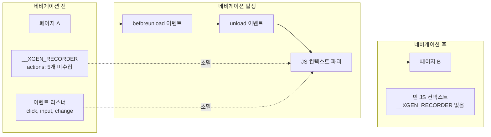
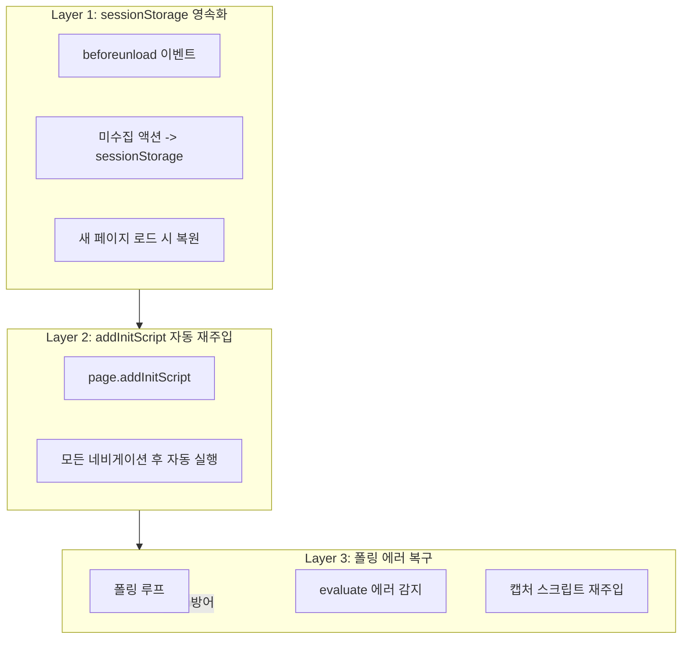

# 브라우저 자동화 시 페이지 네비게이션 생존 전략

## 개요

브라우저 자동화에서 가장 까다로운 문제 중 하나가 페이지 네비게이션이다. 링크를 클릭하거나 폼을 제출하면 브라우저가 새 페이지로 전환되면서, 기존 페이지에 주입된 JavaScript 코드가 통째로 소멸한다. 이벤트 리스너, 전역 변수, 메모리에 저장된 데이터 모두 사라진다.

XGEN 2.0의 시나리오 레코더는 브라우저에 캡처 스크립트(`window.__XGEN_RECORDER`)를 주입해서 사용자 행동을 녹화한다. 페이지가 바뀌면 이 스크립트와 함께 아직 수집되지 않은 이벤트 데이터도 날아간다. SPA(Single Page Application)에서는 JavaScript 라우팅이므로 문제가 없지만, MPA(Multi Page Application)나 외부 링크로의 이동에서는 치명적이다.

이 문제를 3개 레이어의 방어 전략으로 해결했다. sessionStorage 기반 이벤트 영속화, addInitScript를 통한 자동 재주입, 그리고 폴링 루프의 에러 복구 로직이다.

## 문제 분석

### 네비게이션 시 일어나는 일



네비게이션 유형별로 상황이 다르다.

| 유형 | 예시 | JS 컨텍스트 | 대응 필요 |
|------|------|-------------|-----------|
| SPA 라우팅 | React Router, Vue Router | 유지 | 불필요 |
| 같은 도메인 MPA | `<a href="/page2">` | 파괴 + 재생성 | 필요 |
| 크로스 오리진 | `<a href="https://other.com">` | 파괴 + 재생성 | 필요 |
| form submit | `<form action="/submit">` | 파괴 + 재생성 | 필요 |
| window.location | `location.href = '/new'` | 파괴 + 재생성 | 필요 |

SPA에서는 `history.pushState`를 오버라이드하여 네비게이션을 감지할 수 있다. 하지만 나머지 4가지 경우에는 `beforeunload` → `unload` → JS 컨텍스트 파괴가 일어나므로 별도의 생존 전략이 필요하다.

## 아키텍처: 3중 방어



## 핵심 구현

### Layer 1: sessionStorage 기반 이벤트 영속화

`sessionStorage`는 같은 탭 내에서 페이지가 바뀌어도 유지되는 저장소다. `localStorage`와 달리 탭을 닫으면 사라지므로, 녹화 세션의 임시 데이터를 저장하기에 적합하다.

캡처 스크립트 내부에 저장/복원 로직을 넣었다.

```javascript
// CAPTURE_SCRIPT_BODY 내부
var XGEN_RECORDER = {
    STORAGE_KEY: '__XGEN_RECORDER_PENDING',
    actions: [],
    lastCollectedIndex: 0,

    init: function() {
        this.restoreFromStorage();      // 1. 이전 페이지에서 저장된 액션 복원
        this.attachEventListeners();    // 2. 이벤트 리스너 등록
    },

    restoreFromStorage: function() {
        try {
            var saved = sessionStorage.getItem(this.STORAGE_KEY);
            if (saved) {
                sessionStorage.removeItem(this.STORAGE_KEY);
                var pending = JSON.parse(saved);
                if (Array.isArray(pending) && pending.length > 0) {
                    // 복원된 액션을 앞에 추가 (시간순 보장)
                    this.actions = pending.concat(this.actions);
                }
            }
        } catch(e) { /* 크로스 오리진 등에서 실패 가능 */ }
    },

    saveToStorage: function() {
        try {
            var uncollected = this.actions.slice(this.lastCollectedIndex);
            if (uncollected.length > 0) {
                sessionStorage.setItem(
                    this.STORAGE_KEY,
                    JSON.stringify(uncollected)
                );
            }
        } catch(e) { /* 저장 실패 시 무시 */ }
    },
};

// beforeunload에 연결
window.addEventListener('beforeunload', function() {
    XGEN_RECORDER.saveToStorage();
});
```

```
# 커밋: fix: persist recorder events across page navigation
# 날짜: 2026-02-08 06:07
```

이 방식의 핵심은 `lastCollectedIndex`다. 이미 폴링을 통해 수집된 액션은 저장하지 않고, 아직 수집되지 않은 액션만 sessionStorage에 저장한다. 중복 방지가 자연스럽게 이루어진다.

**한계**: 크로스 오리진 네비게이션에서는 sessionStorage가 다른 origin이므로 복원이 불가능하다. 이 경우는 Layer 2와 Layer 3이 커버한다.

### Layer 2: addInitScript로 자동 재주입

Playwright의 `addInitScript`는 페이지가 로드될 때마다 자동으로 실행되는 스크립트를 등록하는 API다. 네비게이션이 발생해도 새 페이지에서 캡처 스크립트가 자동으로 주입된다.

```typescript
// useTauriMCPRecording.ts
const installPersistentInjection = useCallback(async () => {
    const code = `async (page) => {
        await page.addInitScript(() => { ${CAPTURE_SCRIPT_IIFE} });
        return 'persistent-ok';
    }`;
    await browserManager.runCode(code);
}, []);
```

`CAPTURE_SCRIPT_IIFE`는 캡처 스크립트 본문을 IIFE(Immediately Invoked Function Expression)로 감싼 버전이다. `addInitScript`에 전달되면 모든 네비게이션 후 자동 실행된다.

이 방식이 강력한 이유는, 개발자가 네비게이션 이벤트를 일일이 감지할 필요 없이 Playwright가 알아서 처리해준다는 점이다. `window.location` 변경, form submit, 서버 리다이렉트 등 모든 종류의 네비게이션에 대응한다.

**한계**: `addInitScript`는 DOMContentLoaded 이전에 실행되므로, 일부 동적으로 생성되는 요소의 이벤트를 놓칠 수 있다. 또한 크로스 오리진에서는 Content Security Policy에 의해 차단될 수 있다.

### Layer 3: 폴링 에러 복구

Layer 1과 2가 실패하는 극단적인 경우를 위한 최후 방어선이다. 폴링 루프에서 `evaluate` 호출이 에러를 반환하면, 이를 "네비게이션 진행 중"으로 해석하고 재주입을 시도한다.

```typescript
// startPolling 내부
const loop = async () => {
    let consecutiveErrors = 0;

    while (active) {
        const result = await collectActions();

        if ((result as any).error) {
            consecutiveErrors++;

            if (consecutiveErrors >= 15) {
                // 15회 연속 에러 → 브라우저가 닫힌 것으로 판단
                active = false;
                break;
            }

            // 네비게이션 중일 수 있음 → 1초 대기 후 재주입
            await new Promise(r => setTimeout(r, 1000));
            await injectCaptureScript();
            continue;
        }

        // 에러 복구 성공
        consecutiveErrors = 0;

        // URL 변경 감지
        if (url && url !== lastUrlRef.current) {
            if (!isDuplicate) {
                onAction?.({ type: 'navigate', url: cleanUrl });
            }
            lastUrlRef.current = cleanUrl;
            await injectCaptureScript();  // 명시적 재주입
        }

        await sleep(500);
    }
};
```

```
# 커밋: fix: survive full-page navigation, merge type actions, capture change events
# 날짜: 2026-02-08 14:17
```

연속 에러 카운터의 임계값 15는 실험적으로 결정했다. 일반적인 페이지 전환은 1~3초면 완료되므로 500ms 폴링 기준 3~6회 에러가 발생한다. 네트워크가 느린 환경까지 고려해서 15회(약 7.5초)로 설정했다. 이보다 오래 걸리면 브라우저가 닫혔거나 크래시된 것으로 간주한다.

### URL 변경 감지와 navigate 액션 자동 삽입

폴링 루프에서 URL 변경을 감지하면, 시나리오에 navigate 액션을 자동으로 삽입한다. 이 액션이 없으면 재생 시 "어떤 페이지로 이동했는지"를 모른다.

```typescript
// URL 변경 감지 로직
if (url && url !== lastUrlRef.current) {
    // 중복 navigate 방지: 같은 URL로의 연속 이동 무시
    const cleanUrl = url.split('#')[0].split('?')[0];  // 해시/쿼리 제거
    const lastClean = lastUrlRef.current?.split('#')[0].split('?')[0];

    const isDuplicate = cleanUrl === lastClean;

    if (!isDuplicate) {
        onAction?.({
            type: 'navigate',
            url: cleanUrl,
            timestamp: Date.now()
        });
    }

    lastUrlRef.current = cleanUrl;
    await injectCaptureScript();  // 새 페이지에 캡처 스크립트 재주입
}
```

해시 변경(`#section`)이나 쿼리 파라미터 변경(`?page=2`)은 실제 페이지 전환이 아닌 경우가 많다. SPA에서 라우팅에 해시를 사용하는 경우를 제외하면, 대부분 같은 페이지 내의 스크롤이나 필터 변경이다. 해시와 쿼리를 제거한 후 비교하여 불필요한 navigate 액션 생성을 방지했다.

## 트러블슈팅

### Agent의 검색엔진 이동 차단

Agent 모드에서 예상치 못한 문제가 발생했다. LLM이 "Google에서 검색해보겠습니다"라고 판단하고 `navigate`를 호출해서 검색엔진으로 이동해버리는 것이다. 사용자가 의도한 대상 사이트를 벗어나는 행위이며, 검색엔진에서 추가 네비게이션이 발생하면 원래 사이트로 돌아오기 어렵다.

이를 방지하기 위해 Agent의 시스템 프롬프트에 명시적 제약을 추가했다.

```
# 커밋: fix: prevent agent from navigating to search engines - use current page
# 날짜: 2026-02-08 17:53
```

시스템 프롬프트에 다음과 같은 지침을 포함시켰다.

> "검색엔진(Google, Bing 등)으로 이동하지 마세요. 현재 페이지에서 작업을 수행하세요. 필요한 정보는 현재 페이지의 네비게이션이나 메뉴를 활용하세요."

추가로 navigate 도구 호출 시 URL을 검증하는 가드도 넣었다.

```typescript
const BLOCKED_DOMAINS = [
    'google.com', 'bing.com', 'yahoo.com',
    'duckduckgo.com', 'naver.com'
];

const isBlockedNavigation = (url: string): boolean => {
    try {
        const hostname = new URL(url).hostname;
        return BLOCKED_DOMAINS.some(d => hostname.includes(d));
    } catch {
        return false;
    }
};
```

### SPA vs MPA 혼합 사이트

실제 웹사이트는 SPA와 MPA가 혼합된 경우가 많다. 예를 들어 로그인 페이지는 MPA(서버 리다이렉트), 로그인 후 대시보드는 SPA(React Router) 방식인 경우다. 이 경우 `history.pushState` 오버라이드만으로는 모든 네비게이션을 감지할 수 없다.

3중 방어 전략이 이 문제를 해결한다. SPA 구간에서는 `pushState` 오버라이드가, MPA 구간에서는 `beforeunload` + sessionStorage + addInitScript가 각각 담당한다. 폴링 루프의 URL 비교가 최종 안전망 역할을 한다.

### change 이벤트 누락

초기에는 `click`과 `input` 이벤트만 캡처했는데, `<select>` 드롭다운이나 `<input type="checkbox">`의 상태 변경이 기록되지 않았다. 이 요소들은 `input` 이벤트 대신 `change` 이벤트를 발생시키기 때문이다.

```javascript
// change 이벤트 리스너 추가
document.addEventListener('change', function(e) {
    var target = e.target;
    var tagName = target.tagName.toLowerCase();

    if (tagName === 'select') {
        XGEN_RECORDER.actions.push({
            type: 'action',
            action: {
                type: 'select',
                selector: XGEN_RECORDER.generateSelector(target),
                value: target.value
            }
        });
    } else if (target.type === 'checkbox' || target.type === 'radio') {
        XGEN_RECORDER.actions.push({
            type: 'action',
            action: {
                type: 'check',
                selector: XGEN_RECORDER.generateSelector(target),
                checked: target.checked
            }
        });
    }
}, true);
```

```
# 커밋: fix: survive full-page navigation, merge type actions, capture change events
# 날짜: 2026-02-08 14:17
```

이 커밋이 네비게이션 생존 + type 액션 merge + change 이벤트를 한 번에 수정한 것이다. 세 가지가 동시에 발견된 이유는, 실제 사이트에서 통합 테스트를 돌리면서 한꺼번에 드러났기 때문이다.

### type 액션의 폴링 간 병합

같은 입력 필드에 대한 `type` 액션이 서로 다른 폴링 사이클에서 수집되면, 캡처 스크립트 내부의 1차 병합으로는 합쳐지지 않는다. 프론트엔드 측 2차 병합에서 이를 처리한다.

```typescript
// collectActions 내 폴링 간 병합
for (const event of events) {
    const prev = merged[merged.length - 1];

    // 이전 폴링에서 수집된 input과 현재 폴링의 input이
    // 같은 셀렉터를 대상으로 함 → 값만 교체
    if (event.action.type === 'input'
        && prev?.action?.type === 'input'
        && prev.action.selector === event.action.selector) {
        prev.action.value = event.action.value;
        continue;
    }

    merged.push(event);
}
```

### 새 탭 자동 전환과 캡처 스크립트 주입

`target="_blank"` 링크로 새 탭이 열리면, 기존 탭의 폴링은 빈 결과만 받는다. 빈 폴링이 10회 연속되면 새 탭 감지를 시도한다.

```typescript
const checkAndSwitchToNewTab = useCallback(async (): Promise<boolean> => {
    const code = `async (page) => {
        const context = page.context();
        const pages = context.pages();
        if (pages.length > 1) {
            const newPage = pages[pages.length - 1];
            await newPage.bringToFront();
            return JSON.stringify({
                switched: true,
                url: newPage.url(),
                tabCount: pages.length
            });
        }
        return JSON.stringify({ switched: false });
    }`;

    const result = await browserManager.runCode(code);
    if (parsed?.switched) {
        // 새 탭에 캡처 스크립트 주입
        await injectCaptureScript();
        lastUrlRef.current = parsed.url;
        onAction?.({ type: 'navigate', url: parsed.url });
        return true;
    }
    return false;
}, []);
```

새 탭으로 전환된 후에도 반드시 캡처 스크립트를 주입해야 한다. `addInitScript`가 등록된 것은 원래 탭의 context이므로, 새 탭에는 자동 주입이 되지 않을 수 있다.

### Playwright init script과 MCP 시작 개선

팀원이 Playwright init script을 개선하여 MCP 서버 시작 시 캡처 스크립트가 자동으로 모든 페이지에 등록되도록 했다.

```
# 커밋: feat: Add Playwright init script and improve MCP startup
# 날짜: 2026-02-09 19:13
```

### WebSocket 재연결 로직

웹 버전에서 LocalCLIBridge를 통해 브라우저를 제어할 때, WebSocket 연결이 끊기면 재연결을 시도하는 로직도 추가됐다. 네비게이션과 직접 관련은 없지만, "연결 끊김으로 인한 녹화 데이터 유실" 방지라는 같은 맥락의 문제다.

```
# 커밋: feat: Add LocalCLIBridge - WebSocket reconnect logic
# 날짜: 2026-02-11 10:31
```

## 결과 및 회고

### 3중 방어의 커버리지

| 방어 레이어 | 커버하는 시나리오 | 실패 조건 |
|-------------|------------------|-----------|
| sessionStorage | 같은 도메인 MPA 네비게이션 | 크로스 오리진 이동 |
| addInitScript | 모든 네비게이션 (자동 재주입) | CSP 차단, 새 탭 |
| 폴링 에러 복구 | 모든 상황 (최후 안전망) | 15회 이상 연속 에러 |

세 레이어가 각각의 실패 조건을 서로 보완한다. sessionStorage가 실패하는 크로스 오리진에서는 addInitScript가, addInitScript가 실패하는 CSP 환경에서는 폴링 에러 복구가 동작한다.

### 설계 원칙

**"데이터는 두 곳 이상에 저장하라"**: 메모리에만 있는 데이터는 네비게이션 한 번에 소멸한다. sessionStorage라는 2차 저장소를 두는 것만으로 데이터 유실률이 대폭 감소했다.

**"에러는 상태 전이의 신호다"**: evaluate 에러를 단순한 실패로 처리하지 않고, "네비게이션이 진행 중"이라는 상태 정보로 해석했다. 에러 자체가 유용한 정보인 셈이다.

**"재주입은 멱등해야 한다"**: 캡처 스크립트를 여러 번 주입해도 문제가 없어야 한다. `if (window.__XGEN_RECORDER) return 'already';` 가드 덕분에 중복 주입이 안전하다. 재주입을 적극적으로 수행할 수 있는 이유다.

**"임계값은 실험으로 결정하라"**: 연속 에러 15회, 빈 폴링 10회 같은 숫자는 이론이 아니라 실제 사이트에서의 측정 결과다. 네트워크 지연, 서버 응답 시간, 브라우저 렌더링 시간을 종합하여 결정했다.
