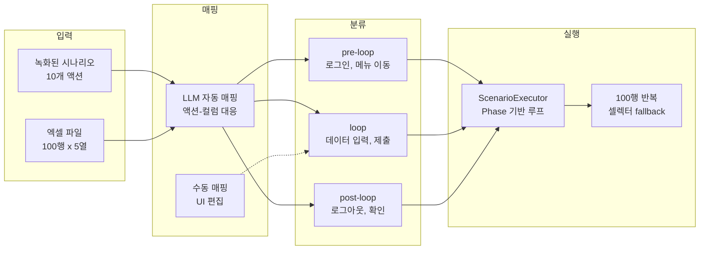
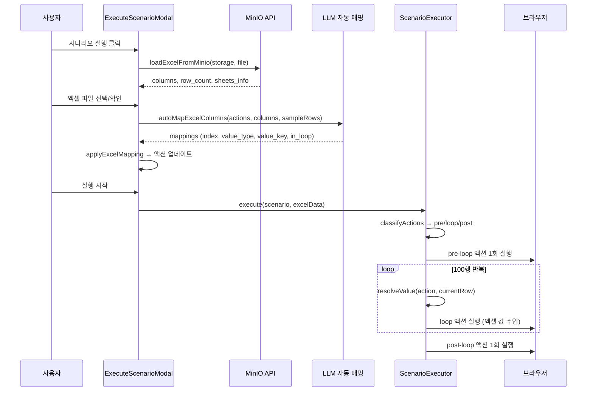

# 엑셀 루프 자동화: Agent + 스토리지 연동으로 반복 작업 처리

## 개요

시나리오 레코더로 "상품 1개를 웹 폼에 입력하는 과정"을 녹화했다면, 이를 엑셀에 있는 100개 상품에 대해 반복 실행하고 싶은 것이 당연한 요구사항이다. 하지만 단순 반복이 아니다. 어떤 입력 필드가 엑셀 컬럼과 대응되는지, 어떤 액션이 반복 대상이고 어떤 것이 초기 설정(로그인 등)인지를 판단해야 한다.

XGEN 2.0에서는 이 문제를 3단계로 해결했다. 첫째, LLM이 시나리오 액션과 엑셀 컬럼을 분석해서 자동으로 매핑한다. 둘째, MinIO 오브젝트 스토리지에서 엑셀 파일을 관리하고 멀티시트/조인을 지원한다. 셋째, ScenarioExecutor가 pre-loop/loop/post-loop Phase를 구분하여 효율적으로 반복 실행한다.

## 아키텍처

### 엑셀 루프 전체 흐름



### 데이터 흐름



## 핵심 구현

### 타입 정의

```typescript
// types/index.ts
export type ValueType = 'literal' | 'excel_column' | 'credential' | 'fixed';

export interface RecordedAction {
    type: string;
    selector?: string;
    value?: string;
    value_type: ValueType;    // 값의 소스
    value_key?: string;       // excel_column일 때 컬럼명
    in_loop: boolean;         // 반복 대상 여부
    selector_alternatives: SelectorCandidate[];
}

export interface ExcelFileConfig {
    alias: string;              // 파일 참조명 (예: "employees")
    required_columns: string[]; // 필수 컬럼
    sheets?: string[];          // 사용할 시트
    minio_storage?: string;     // MinIO 스토리지 경로
    minio_filename?: string;    // 파일명
}

export interface JoinConfig {
    name: string;           // 조인명
    left_source: string;    // "fileA.Sheet1"
    right_source: string;   // "fileA.Sheet2"
    join_key: string;       // 조인 기준 컬럼
    join_type: string;      // inner, left, right, outer
    loop_column?: string;   // 반복 기준 컬럼
}

export interface ScenarioPhase {
    loop: boolean;
    loop_source?: string;   // "excel_data" | "excel:alias" | "joined:name"
    actions: RecordedAction[];
}
```

### LLM 자동 매핑 - autoMapExcelColumns

Agent의 LLM에게 시나리오 액션 목록과 엑셀 컬럼/샘플 데이터를 전달하면, 어떤 액션이 어떤 컬럼과 대응되는지 자동으로 분석한다.

```typescript
// useAgentScenarioBuilder.ts
const autoMapExcelColumns = useCallback(async () => {
    const mapPrompt = `아래 시나리오 액션 목록과 엑셀 컬럼 정보를 보고,
어떤 액션이 엑셀 데이터로 치환되어야 하는지 매핑해주세요.

## 시나리오 액션
${actions.map((a, i) => `${i + 1}. [${a.type}] selector="${a.selector}" value="${a.value || ''}"`).join('\n')}

## 엑셀 컬럼
${excelMapping.columns.join(', ')}

## 샘플 데이터 (첫 3행)
${excelMapping.sampleRows.map(row => JSON.stringify(row)).join('\n')}

## 응답 형식 (JSON만)
{
  "mappings": [
    {"index": 1, "value_type": "literal", "in_loop": false, "reason": "사이트 이동"},
    {"index": 4, "value_type": "excel_column", "value_key": "자재코드", "in_loop": true, "reason": "상품코드 입력"}
  ],
  "summary": "자재코드, 수량을 엑셀에서 가져와 반복 입력합니다."
}`;

    const response = await callLLM(mapConversation);
    const parsed = JSON.parse(extractJSON(response));

    // 매핑 적용
    const mappings = parsed.mappings.map((m: any) => ({
        index: (m.index || 1) - 1,  // 1-based → 0-based
        value_type: m.value_type || 'literal',
        value_key: m.value_key,
        in_loop: !!m.in_loop,
    }));

    return mappings;
}, [actions, excelMapping, callLLM]);
```

LLM은 액션의 selector(필드명이 보이는 경우)와 기존 value를 보고, 엑셀 컬럼과의 대응 관계를 추론한다. 예를 들어 `input[name="product_code"]`에 입력하는 액션이 있고 엑셀에 "자재코드" 컬럼이 있으면, LLM이 이를 매핑한다.

```
# 커밋: feat: Agent Excel Controller - 엑셀 루프 자동 매핑 + 스토리지 연동
# 날짜: 2026-02-09 13:05
```

### 매핑 적용 - applyExcelMapping

LLM의 매핑 결과를 시나리오 액션에 적용한다.

```typescript
const applyExcelMapping = useCallback(() => {
    const mappingMap = new Map(
        excelMapping.mappings.map(m => [m.index, m])
    );

    setActions(prev => prev.map((action, idx) => {
        const mapping = mappingMap.get(idx);
        if (!mapping) return action;
        return {
            ...action,
            value_type: mapping.value_type,
            ...(mapping.value_key ? { value_key: mapping.value_key } : {}),
            in_loop: mapping.in_loop,
        };
    }));
}, [excelMapping]);
```

`in_loop: true`로 마킹된 액션은 엑셀 행 수만큼 반복 실행되고, `in_loop: false`인 액션은 1회만 실행된다.

### MinIO 스토리지 API

엑셀 파일은 MinIO 오브젝트 스토리지에 저장된다. 사용자별 스토리지 폴더를 제공하고, 파일 업로드/다운로드/목록 조회를 API로 지원한다.

```typescript
// scenarioRecorderAPI.ts

// 스토리지 목록 조회
export async function listStorages(): Promise<{
    success: boolean;
    storages: Array<{ name: string; path: string }>;
}> {
    return fetchAPI('/storage/list');
}

// 스토리지 내 파일 목록
export async function listStorageFiles(storageName: string): Promise<{
    success: boolean;
    files: Array<{ filename: string; size?: number; last_modified?: string }>;
}> {
    return fetchAPI(`/storage/${encodeURIComponent(storageName)}/files`);
}

// MinIO에서 엑셀 로드 (멀티시트 지원)
export async function loadExcelFromMinio(
    storageName: string, filename: string
): Promise<{
    success: boolean;
    file_id: string;
    columns: string[];
    row_count: number;
    sheet_names: string[];
    sheets_info: Record<string, { columns: string[]; row_count: number }>;
}> {
    return fetchAPI('/storage/load-excel', {
        method: 'POST',
        body: JSON.stringify({ storage_name: storageName, filename }),
    });
}
```

```
# 커밋: fix: Excel Loop 스토리지 탭 - MinIO API로 변경
# 날짜: 2026-02-09 16:15
```

초기에는 RAG API의 파일 업로드 기능을 재활용했는데, 엑셀 전용 기능(시트 분리, 컬럼 조회, 행 수 확인)이 필요해지면서 시나리오 레코더 전용 MinIO API로 분리했다.

### 멀티시트 자동 분리

하나의 엑셀 파일에 여러 시트가 있고, 시나리오의 엑셀 설정에서 정의한 alias와 시트명이 일치하면 자동으로 매핑한다.

```typescript
// ExecuteScenarioModal.tsx
const tryAutoSplitBySheetAlias = (
    fileId: string, sheets: SheetInfo[]
): ExcelFileEntry[] | null => {
    if (!scenario?.excel_files || sheets.length <= 1) return null;

    const scenarioAliases = scenario.excel_files.map(f => f.alias);
    const matchingSheets = sheets.filter(
        s => scenarioAliases.includes(s.sheet_name)
    );

    if (matchingSheets.length === 0) return null;

    return matchingSheets.map(sheet => {
        const config = scenario.excel_files!.find(
            f => f.alias === sheet.sheet_name
        );
        const requiredCols = config?.required_columns || [];
        const sheetCols = new Set(sheet.columns);
        const matched = requiredCols.filter(c => sheetCols.has(c));
        const missing = requiredCols.filter(c => !sheetCols.has(c));

        return {
            alias: sheet.sheet_name,
            fileId,
            validation: {
                matched,
                missing,
                valid: missing.length === 0,
            },
        };
    });
};
```

예를 들어 시나리오가 `employees`와 `departments` 두 개의 엑셀 alias를 정의했고, 업로드한 엑셀 파일에 "employees", "departments" 시트가 있으면 자동으로 매핑된다. 필수 컬럼 검증도 수행하여, 누락된 컬럼이 있으면 사용자에게 알린다.

### 조인(Join) 설정

서로 다른 시트/파일의 데이터를 조인해서 사용할 수 있다. SQL의 JOIN과 같은 개념이다.

```typescript
// Join 미리보기 API
export async function previewJoin(
    fileIds: Record<string, string>,
    joinConfig: JoinConfig,
    primarySheets?: Record<string, string>
): Promise<{
    success: boolean;
    columns: string[];
    row_count: number;
    sample_data: Record<string, any>[];
}> {
    return fetchAPI('/excel/join-preview', {
        method: 'POST',
        body: JSON.stringify({
            file_ids: fileIds,
            join_config: joinConfig,
            primary_sheets: primarySheets,
        }),
    });
}
```

```
# 커밋: feat: Add join configuration support and multi-sheet Excel handling
# 날짜: 2026-02-09 17:14
```

### Phase 분류 - pre-loop / loop / post-loop

ScenarioExecutor가 시나리오 액션을 3개 구간으로 분류한다.

```typescript
// ScenarioExecutor.ts
private classifyActions(actions: RecordedAction[]): {
    preLoop: RecordedAction[];
    loop: RecordedAction[];
    postLoop: RecordedAction[];
} {
    const firstLoopIdx = actions.findIndex(a => a.in_loop);
    const lastLoopIdx = actions.length - 1 -
        [...actions].reverse().findIndex(a => a.in_loop);

    if (firstLoopIdx === -1) {
        // in_loop이 하나도 없으면 전체를 1회 실행
        return { preLoop: actions, loop: [], postLoop: [] };
    }

    return {
        preLoop: actions.slice(0, firstLoopIdx),
        loop: actions.slice(firstLoopIdx, lastLoopIdx + 1),
        postLoop: actions.slice(lastLoopIdx + 1),
    };
}
```

`in_loop: true`인 액션의 첫 번째와 마지막 인덱스를 기준으로 세 구간을 나눈다. pre-loop(로그인, 메뉴 이동 등)과 post-loop(로그아웃, 확인 등)은 1회만 실행되고, loop 구간은 엑셀 행 수만큼 반복된다.

### 루프 실행과 값 해석

```typescript
// ScenarioExecutor.ts
private async executePhaseWithLoop(
    phase: ScenarioPhase, excelData: any[]
): Promise<void> {
    const { preLoop, loop, postLoop } = this.classifyActions(phase.actions);

    // pre-loop: 1회 실행
    for (const action of preLoop) {
        await this.executeSingleAction(action, action.selector, action.value);
    }

    // loop: 엑셀 행 수만큼 반복
    for (let rowIdx = 0; rowIdx < excelData.length; rowIdx++) {
        this.currentRowData = excelData[rowIdx];
        this.currentRowIndex = rowIdx;

        for (const action of loop) {
            const resolvedValue = this.resolveValue(action);
            await this.executeSingleAction(action, action.selector, resolvedValue);
        }
    }

    // post-loop: 1회 실행
    for (const action of postLoop) {
        await this.executeSingleAction(action, action.selector, action.value);
    }
}
```

`resolveValue`가 액션의 `value_type`에 따라 값을 해석한다.

```typescript
private resolveValue(action: RecordedAction): string | undefined {
    switch (action.value_type) {
        case 'literal':
            return action.value;  // 녹화 시 입력한 값 그대로

        case 'excel_column':
            // 1-depth: "컬럼명" → currentRowData[컬럼명]
            // 2-depth: "alias.컬럼명" → 특정 파일의 컬럼
            // 3-depth: "alias.시트명.컬럼명" → 특정 파일의 특정 시트 컬럼
            const parts = (action.value_key || '').split('.');
            if (parts.length === 1) {
                return this.currentRowData[parts[0]];
            } else if (parts.length === 2) {
                return this.variables[`current_row_${parts[0]}`]?.[parts[1]];
            } else {
                // 3-depth: cross-reference
                return this.resolveThreeDepth(parts);
            }

        case 'credential':
            return this.credentials[action.value_key || ''];

        case 'fixed':
            return action.value;  // 고정값 (루프 내에서도 변경 안 됨)
    }
}
```

### loop_source 형식

Phase의 `loop_source`로 어떤 데이터를 기준으로 반복할지 지정한다.

```typescript
private getExcelDataForPhaseAuto(phase: ScenarioPhase): any[] | null {
    const source = phase.loop_source || 'excel_data';

    if (source.startsWith('joined:')) {
        // "joined:main_join" → 조인된 결과 데이터
        const joinName = source.substring(7);
        return this.joinedData[joinName] || null;
    }

    if (source.startsWith('excel:')) {
        const rest = source.substring(6);
        if (rest.includes('.')) {
            // "excel:employees.Sheet2" → 특정 파일의 특정 시트
            const [alias, sheet] = rest.split('.');
            return this.sheetData[alias]?.[sheet] || null;
        }
        // "excel:employees" → 특정 파일의 기본 시트
        return this.excelFiles[rest] || null;
    }

    // "excel_data" → 기본 엑셀 (하위 호환)
    return this.excelFiles['default'] || Object.values(this.excelFiles)[0] || null;
}
```

## 트러블슈팅

### Loop Phase에서 첫 행 navigate 스킵

루프 시작 시 base_url로 navigate하는 액션이 있으면, 매 행마다 페이지를 새로고침하게 된다. 이미 해당 페이지에 있는 상태인데 불필요한 로딩이 발생했다.

첫 번째 행에서만 navigate를 실행하고, 이후 행에서는 스킵하도록 했다.

```
# 커밋: fix: Playback 중복 navigate 방지 - Loop phase 첫 행 navigate skip
# 날짜: 2026-02-10 00:01
```

### 엑셀 루프 변환 (convertToExcelLoop)

기존 시나리오를 엑셀 루프용으로 변환하는 함수를 추가했다. 워크플로우에 연결된 엑셀 파일에서 컬럼 정보를 자동으로 가져오고, LLM이 반복 대상 액션을 식별하여 `in_loop`/`value_type`/`value_key`를 설정한다.

```
# 커밋: feat: 엑셀 루프 변환 + 시나리오 검증 강화
# 날짜: 2026-02-09 08:30
```

### 실행 모달 UI 통합 - 병합 충돌

팀원(haesookim)과 동시에 실행 모달을 개발하면서 코드 충돌이 발생했다. 엑셀 미리보기, 조인 설정, credential 입력 등의 기능이 서로 다른 브랜치에서 구현됐고, merge 과정에서 원본 로직이 깨지는 일이 반복됐다.

여러 차례의 원복과 재통합 커밋이 남아 있다.

```
# 커밋: fix: ExecuteScenarioModal - 해수프로 storageAPI 원본 로직 복구
# 날짜: 2026-02-10 01:01
# 커밋: fix: 시나리오 실행 모달 해수프로 최신 버전(7aea882f) 원복
# 날짜: 2026-02-10 10:31
```

최종적으로 해수프로의 다중 엑셀/조인 UI와, 손성준의 Agent 매핑/루프 엔진을 통합하는 데 성공했다.

### in_loop 필드 기본값

초기에 `in_loop` 필드가 없는 액션이 백엔드 Pydantic 유효성 검사에 걸렸다. 모든 액션에 `in_loop: false` 기본값을 부여하는 sanitize 함수를 추가했다.

```
# 커밋: fix: add missing in_loop field and sanitize actions for backend pydantic validation
# 날짜: 2026-02-08 12:31
```

## 결과 및 회고

### 동작 요약

1. 사용자가 웹 폼 입력을 1회 녹화한다 (10개 액션)
2. 엑셀 파일(100행)을 MinIO에서 선택한다
3. LLM이 "4번 액션의 값 = 엑셀 '자재코드' 컬럼, 6번 액션 = '수량' 컬럼"을 자동 매핑한다
4. ScenarioExecutor가 pre-loop(로그인, 메뉴 이동) 1회 -> loop(데이터 입력) 100회 -> post-loop(확인) 1회를 실행한다

### 설계 원칙

**"LLM에게 매핑을 맡겨라"**: 사용자가 수동으로 액션-컬럼 매핑을 하는 것은 번거롭다. LLM은 필드명과 컬럼명의 의미적 유사성을 잘 파악한다. `product_code` 필드와 "자재코드" 컬럼의 대응을 사람이 설정하는 것보다 LLM이 더 빠르다.

**"Phase 분류로 효율성 확보"**: 로그인을 100번 반복하는 것은 무의미하다. pre-loop/loop/post-loop 분류로 필요한 부분만 반복한다.

**"loop_source 다중 형식"**: `excel_data`, `excel:alias`, `excel:alias.sheet`, `joined:name` 등 다양한 데이터 소스를 지원해서, 단일 파일부터 멀티시트 조인까지 유연하게 대응한다.
