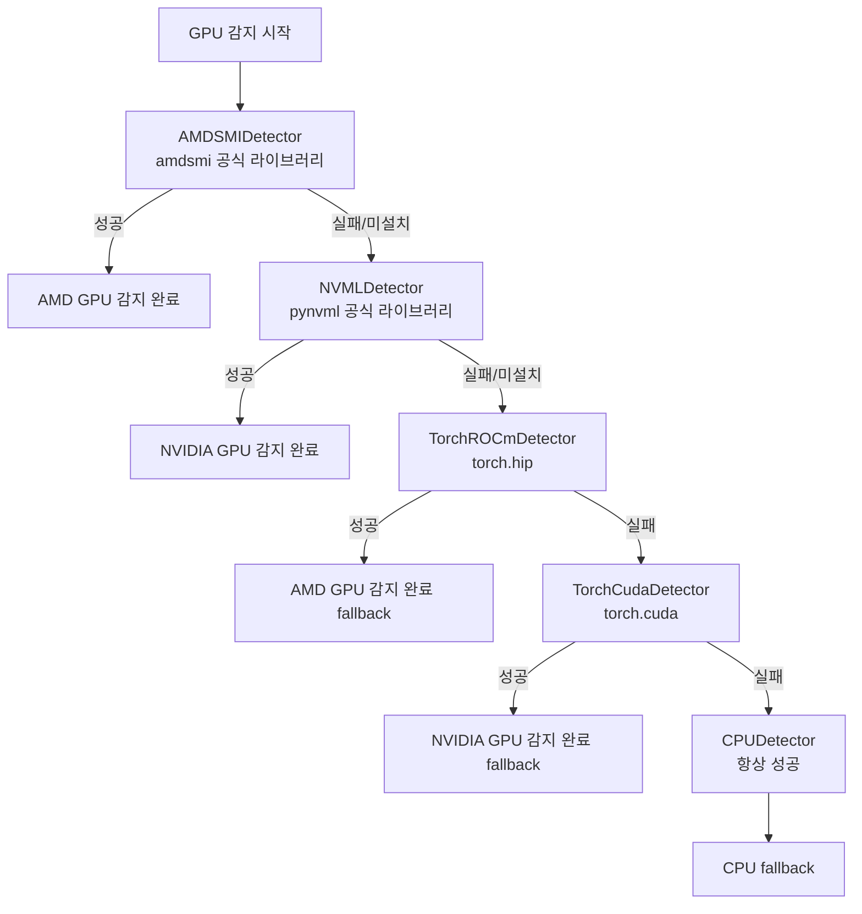
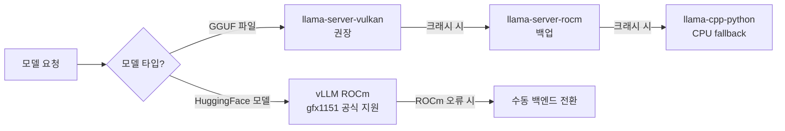

# AMD GPU에서 LLM 돌리기: Vulkan vs ROCm 비교

AMD GPU로 LLM을 서빙하는 건 NVIDIA에 비해 선택지가 복잡하다. ROCm을 쓸 수도 있고, Vulkan을 쓸 수도 있다. 이 둘은 접근 방식이 근본적으로 다르고, 실제로 어떤 상황에서 어떤 게 낫지도 꽤 다르다. XGEN 모델 서버를 AMD GPU(Strix Halo, gfx1151)에서 운영하면서 겪은 실전 경험을 정리한다.

## 배경

XGEN 2.0의 모델 서빙 계층은 여러 백엔드를 추상화해서 지원한다. vLLM(HuggingFace 모델), llama-server-vulkan(GGUF 모델 권장), llama-server-rocm(GGUF 모델 백업), llama-cpp-python(CPU fallback) 이렇게 4개다. AMD GPU 환경에서 GGUF 모델을 서빙할 때 Vulkan이냐 ROCm이냐를 선택해야 했고, 그 과정에서 상당한 삽질이 있었다.

하드웨어는 Ryzen AI MAX+ 395(Strix Halo, gfx1151)로, iGPU 형태로 CPU와 메모리를 공유하는 구조다. 이 특성이 백엔드 선택에 큰 영향을 준다.

## Vulkan vs ROCm: 근본적인 차이

### ROCm: AMD의 CUDA 대항마

ROCm(Radeon Open Compute)은 AMD가 만든 GPU 컴퓨팅 플랫폼이다. NVIDIA의 CUDA와 유사한 개념으로, HIP(Heterogeneous-computing Interface for Portability)라는 API를 제공한다. CUDA 코드를 HIP로 포팅하는 것도 비교적 쉽다.

llama.cpp를 ROCm으로 빌드하면 `GGML_HIP=ON` 플래그를 사용한다.

```bash
cmake -B build \
    -DGGML_HIP=ON \
    -DAMDGPU_TARGETS="gfx1151" \
    -DGGML_CUDA=OFF \
    -DGGML_METAL=OFF \
    -DGGML_VULKAN=OFF \
    -DCMAKE_BUILD_TYPE=Release \
    -DCMAKE_C_COMPILER=/opt/rocm/bin/hipcc \
    -DCMAKE_CXX_COMPILER=/opt/rocm/bin/hipcc
```

`AMDGPU_TARGETS`에 타겟 GPU의 gfx 버전을 명시해야 한다. 이게 중요한 포인트다. 빌드 시점에 타겟이 고정되기 때문에, gfx1151용으로 빌드한 바이너리는 다른 AMD GPU에서 동작하지 않을 수 있다.

### Vulkan: 범용 그래픽/컴퓨트 API

Vulkan은 AMD, NVIDIA, Intel 등 벤더에 무관한 저수준 GPU API다. 원래 그래픽 API지만 컴퓨트 셰이더를 통해 GPGPU 계산도 지원한다. llama.cpp가 Vulkan 백엔드를 구현했는데, 이게 생각보다 성숙했다.

```bash
cmake -B build \
    -DGGML_VULKAN=ON \
    -DGGML_HIP=OFF \
    -DGGML_CUDA=OFF \
    -DGGML_METAL=OFF \
    -DCMAKE_BUILD_TYPE=Release
```

Vulkan 빌드는 특정 GPU 타겟을 명시하지 않는다. 런타임에 시스템의 Vulkan ICD(Installable Client Driver)를 통해 GPU와 통신한다.

## 실전 비교 결과

### 안정성: Vulkan 압도적 우위

ROCm 백엔드에서 겪은 문제가 꽤 많았다. 가장 치명적인 건 GPU page fault였다. 특히 임베딩 모델을 ROCm으로 돌릴 때 간헐적으로 크래시가 발생했다.

```
# 커밋: fix: Embedding은 CPU 전용 (AMD ROCm GPU page fault 회피)
# 날짜: 2026-01-31 12:55
```

결국 임베딩 모델은 ROCm을 포기하고 CPU로 전환했다. LLM도 ROCm에서는 `--fit` 옵션으로 인한 메모리 fitting 크래시가 있었다.

```
# 커밋: llama-server: --fit off 옵션 추가 (ROCm 메모리 fitting 크래시 해결)
# 날짜: 2026-01-31 14:07
```

Vulkan은 이런 크래시가 없었다. 동일한 모델을 Vulkan으로 돌렸을 때 훨씬 안정적이었다.

### 설정: Vulkan이 더 단순

ROCm은 환경변수 설정이 복잡하다.

```python
# vllm_rocm.py: ROCm 환경변수 설정
env["ROCM_PATH"] = env.get("ROCM_PATH", "/opt/rocm")
env["HIP_PATH"] = env.get("HIP_PATH", "/opt/rocm")
env["VLLM_ATTENTION_BACKEND"] = "ROCM_FLASH"
env["HIP_VISIBLE_DEVICES"] = "0"
env["ROCR_VISIBLE_DEVICES"] = "0"
```

Vulkan은 ICD 파일 경로만 지정하면 된다.

```dockerfile
ENV VK_ICD_FILENAMES=/usr/share/vulkan/icd.d/radeon_icd.x86_64.json
```

### 성능: 케이스별로 다름

Strix Halo(gfx1151) 환경에서의 체감 결과:

- **GGUF LLM 추론**: Vulkan이 ROCm과 비슷하거나 약간 빠름
- **Embedding**: ROCm에서 page fault로 아예 동작 안 함 → CPU로 처리
- **메모리 효율**: Vulkan + mlock 조합이 더 예측 가능한 메모리 사용량

공식적으로 측정한 수치는 없지만, Vulkan이 안정적으로 추론을 처리한 반면 ROCm은 불안정했다.

## llama-server 핵심 설정

### mlock: 모델을 RAM에 고정

iGPU 환경에서 가장 중요한 설정 중 하나다. Strix Halo는 CPU와 GPU가 메모리를 공유하기 때문에, 모델이 swap으로 밀려나면 추론 속도가 폭락한다.

```python
# base.py: ModelLoadRequest 기본값
mlock: bool = Field(
    default=True,
    description="모델을 RAM에 고정 (swap 방지)"
)
```

`mlock=True`로 설정하면 llama-server는 `--mlock` 플래그로 실행된다. 이게 없으면 대화 사이에 모델이 swap으로 밀렸다가 다시 로드되는 현상이 생긴다.

### n_gpu_layers: 레이어 오프로딩 제어

```python
n_gpu_layers: int = Field(
    default=-1,
    description="GPU에 로드할 레이어 수 (-1: 모두)"
)
```

`-1`은 모든 레이어를 GPU에 올린다는 의미다. Vulkan 백엔드에서는 `--n-gpu-layers 99`로 설정했다.

```
# 커밋: llama-server: Vulkan 최적화 (mlock, n_gpu_layers=99)
# 날짜: 2026-01-31 15:05
```

ROCm에서는 LLM의 경우 20레이어만 GPU에 올리고 나머지는 CPU로 offload하는 실험도 했다.

```
# 커밋: fix: LLM은 GPU 20레이어만 사용 (CPU offload), Embedding은 전체 GPU
# 날짜: 2026-01-31 12:48
```

### Flash Attention: AMD에서는 off 권장

```python
flash_attn: str = Field(
    default="off",
    description="Flash attention: off | on (Vulkan AMD는 off 권장)"
)
```

Vulkan 백엔드에서 Flash Attention을 켜면 불안정하다. ROCm도 마찬가지로 off를 권장한다.

```
# 커밋: llama-server: Flash Attention off, pooling 모델 기본값 사용 (ROCm 안정성)
# 날짜: 2026-01-31 14:20
```

### fit_memory: off가 안정적

llama-server의 `--fit` 옵션은 사용 가능한 메모리에 맞게 모델 파라미터를 자동 조정하는 기능이다. 이게 ROCm에서 크래시를 유발했다.

```python
fit_memory: bool = Field(
    default=False,
    description="메모리 자동 조정 (off가 안정적)"
)
```

`fit_memory=False`면 `--fit off`로 실행된다.

## 명령어 생성 로직

`_build_command` 메서드가 이 모든 설정을 llama-server 실행 명령어로 조합한다.

```python
def _build_command(self, request: ModelLoadRequest) -> list[str]:
    cmd = [
        self._binary_path,
        "--model", request.model_path,
        "--port", str(self._port),
        "--ctx-size", str(request.n_ctx),
        "--batch-size", str(request.n_batch),
        "--ubatch-size", str(request.n_ubatch),
        "--n-gpu-layers", str(request.n_gpu_layers),
    ]

    # Flash attention
    cmd.extend(["--flash-attn", request.flash_attn])

    # Memory optimization
    if not request.fit_memory:
        cmd.extend(["--fit", "off"])

    if request.mlock:
        cmd.append("--mlock")

    # LLM vs Embedding 모드 분기
    if request.server_type == "llm":
        if request.jinja:
            cmd.append("--jinja")  # Tool calling 지원
        if request.cont_batching:
            cmd.append("--cont-batching")
    elif request.server_type == "embedding":
        cmd.append("--embedding")
        if request.pooling:
            cmd.extend(["--pooling", request.pooling])

    return cmd
```

바이너리 이름(`llama-server-vulkan`, `llama-server-rocm`)만 바꾸면 백엔드 전환이 된다. 나머지 설정은 동일하다.

## GPU 감지: Fallback Chain 패턴

어떤 백엔드를 쓸지 결정하려면 먼저 어떤 GPU가 있는지 알아야 한다. 이를 위해 `UnifiedGPUDetector`라는 fallback chain 구조를 만들었다.



```python
class UnifiedGPUDetector:
    def __init__(self):
        self.detectors = [
            AMDSMIDetector(),     # AMD 공식 (최우선)
            NVMLDetector(),       # NVIDIA 공식
            TorchROCmDetector(),  # AMD fallback
            TorchCudaDetector(),  # NVIDIA fallback
            CPUDetector(),        # 항상 마지막
        ]

    def detect(self) -> GPUDetectionResult:
        for detector in self.detectors:
            result = detector.detect()
            if result is not None:
                if result.available:
                    return result
                else:
                    return result  # CPUDetector
```

AMD GPU에서는 `amdsmi`가 가장 정확한 정보를 준다. gfx 버전(`gfx1151` 같은)을 통해 RDNA vs CDNA를 구분하고, 이 정보로 vLLM ROCm 공식 지원 여부를 판단한다.

```python
# AMDSMIDetector: gfx 버전으로 GPU 타입 구분
if gfx_version.startswith('gfx90a') or gfx_version.startswith('gfx94'):
    gpu_type = GPUType.AMD_CDNA  # MI200/MI300 데이터센터용
else:
    gpu_type = GPUType.AMD_RDNA  # 일반 GPU (RX 시리즈, Strix Halo)
```

## 백엔드 선택 전략

최종적으로 정착한 전략은 이렇다.



- **HuggingFace 모델**: vLLM ROCm (gfx1151은 vLLM 0.16+에서 공식 지원)
- **GGUF 모델**: llama-server-vulkan 우선, ROCm은 백업
- **Embedding 모델**: CPU (ROCm page fault 문제로 포기)

Dockerfile에도 이 전략이 반영되어 있다. 기본 `llama-server` symlink가 Vulkan 바이너리를 가리킨다.

```dockerfile
# Default llama-server symlink (Vulkan preferred)
RUN ln -s /usr/local/bin/llama-server-vulkan /usr/local/bin/llama-server
```

## GGUF vs HuggingFace 포맷 선택

백엔드 선택과 별개로, 모델 포맷도 중요하다.

**GGUF (llama-server):**
- quantization이 빌드된 형태로 제공 (Q4_K_M, Q8_0 등)
- 메모리 효율이 좋음
- Vulkan 백엔드로 AMD GPU 지원이 안정적
- 커뮤니티에서 배포되는 모델이 많음

**HuggingFace 포맷 (vLLM):**
- BF16 또는 FP16 전체 정밀도
- PagedAttention으로 높은 처리량
- AMD에서 공식 지원이 제한적 (특정 gfx 버전만)

Strix Halo 환경에서는 메모리가 충분하지 않아서 GGUF + Vulkan 조합을 주로 사용했다.

## 실제 운영 설정값

최종적으로 안정화된 Vulkan 설정:

```python
# LLM 서버 설정 (Vulkan)
ModelLoadRequest(
    model_path="/app/models/Qwen3-8B.Q4_K_M.gguf",
    server_type="llm",
    n_ctx=8192,
    n_batch=2048,
    n_ubatch=2048,
    n_gpu_layers=99,       # 전체 GPU 오프로딩
    flash_attn="off",      # AMD Vulkan에서 off
    fit_memory=False,      # --fit off
    mlock=True,            # RAM 고정
    cont_batching=True,    # 연속 배치 처리
    jinja=True,            # Tool calling 지원
    reasoning_format="deepseek",
)
```

ROCm 백엔드는 `binary_path="llama-server-rocm"`으로만 바꾸면 된다. 나머지 설정은 동일하게 유지한다.

## 회고

AMD GPU로 LLM을 서빙하는 건 2026년 초 기준으로도 아직 조심스러운 영역이다. NVIDIA에 비해 생태계가 좁고, 특히 GGUF 모델의 경우 Vulkan이 ROCm보다 훨씬 범용적이고 안정적이었다.

ROCm은 vLLM과 함께 쓸 때 빛난다. HuggingFace 모델을 높은 처리량으로 서빙해야 할 때, 특히 지원되는 gfx 버전(gfx1151, gfx1100, gfx90a 등)이라면 vLLM ROCm이 맞는 선택이다.

반면 GGUF 모델을 조용히 서빙하는 용도라면 Vulkan이 압도적으로 낫다. 설정이 단순하고, 크래시가 없고, 어떤 AMD GPU에서든 동작한다.

Embedding은 결국 CPU로 처리했다. 임베딩 모델 특성상 GPU가 주는 이점이 크지 않고, ROCm에서의 불안정성이 너무 컸다. 이 선택이 오히려 안정적인 서비스 운영에 도움이 됐다.
