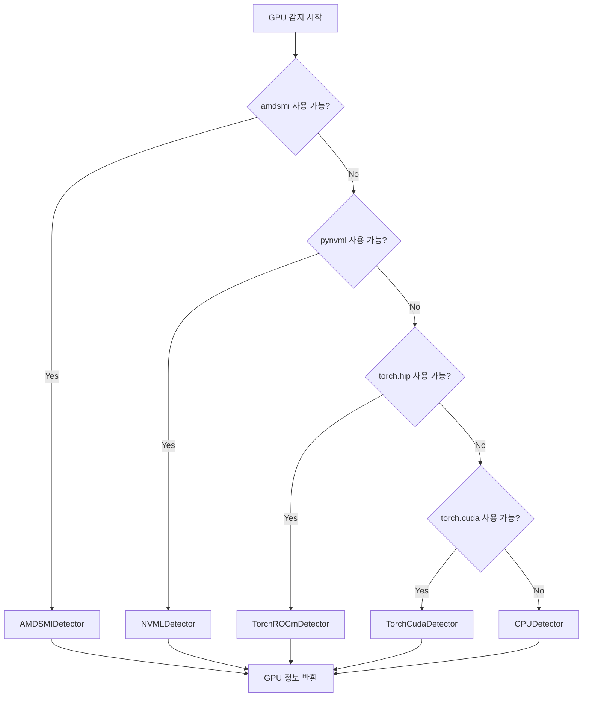

## 배경

XGEN 2.0은 개발 서버(AMD GPU)와 롯데홈쇼핑 서버(NVIDIA GPU)에 동시에 배포됐다. 같은 코드가 두 환경에서 동작해야 했는데, AMD와 NVIDIA는 GPU 정보를 가져오는 API가 다르다.

초기에는 `n_gpu_layers`를 코드에 하드코딩했다. 개발 서버 설정으로 고정됐으니 NVIDIA 환경에서는 최적화가 전혀 안 됐다. UI에서 GPU 선택과 레이어 수를 직접 설정할 수 있게 만들고, 백엔드는 GPU 환경을 자동으로 감지해서 최적 백엔드를 선택하도록 개편했다.

```
# 2026-01-31 커밋: GPU 목록 조회 API 및 모델 로드 시 GPU 설정 지원
# 2026-01-31 커밋: GPU 선택 및 멀티 GPU 지원 추가
# 2026-02-02 커밋: 임베딩 모델도 UI 설정대로 GPU 사용하도록 변경
# 2026-02-02 커밋: GPU 설정이 UI에서 전달되도록 수정 (n_gpu_layers 하드코딩 제거)
```

## GPU 감지 Fallback Chain



각 감지기를 순서대로 시도해서 첫 번째로 성공한 결과를 사용한다. 어떤 환경에서든 반드시 정보를 반환하도록 CPU 감지기가 마지막 폴백이다.

```python
# backend/hardware/gpu_detector.py

class UnifiedGPUDetector:
    """환경에 맞는 GPU 감지기를 자동으로 선택"""

    DETECTOR_CHAIN = [
        AMDSMIDetector,      # AMD 공식 API (가장 정확)
        NVMLDetector,        # NVIDIA 공식 API
        TorchROCmDetector,   # PyTorch ROCm (AMD 대체)
        TorchCudaDetector,   # PyTorch CUDA (NVIDIA 대체)
        CPUDetector,         # 폴백 (항상 성공)
    ]

    def __init__(self):
        self._detector = self._select_detector()

    def _select_detector(self) -> BaseGPUDetector:
        for DetectorClass in self.DETECTOR_CHAIN:
            try:
                detector = DetectorClass()
                if detector.is_available():
                    logger.info(
                        "GPU detector: %s",
                        DetectorClass.__name__
                    )
                    return detector
            except Exception as e:
                logger.debug(
                    "%s not available: %s",
                    DetectorClass.__name__, e
                )
        # 여기까지 오면 안 되지만 안전망
        return CPUDetector()

    def get_gpu_list(self) -> list[dict]:
        return self._detector.get_gpu_list()

    def get_gpu_info(self, gpu_index: int = 0) -> dict:
        return self._detector.get_gpu_info(gpu_index)
```

### AMD GPU 감지기 (amdsmi)

```python
class AMDSMIDetector(BaseGPUDetector):
    def is_available(self) -> bool:
        try:
            import amdsmi
            amdsmi.amdsmi_init()
            return True
        except Exception:
            return False

    def get_gpu_list(self) -> list[dict]:
        import amdsmi
        devices = amdsmi.amdsmi_get_processor_handles()
        result = []

        for i, device in enumerate(devices):
            try:
                memory_info = amdsmi.amdsmi_get_gpu_memory_total(
                    device, amdsmi.AmdSmiMemoryType.VRAM
                )
                used_info = amdsmi.amdsmi_get_gpu_memory_usage(
                    device, amdsmi.AmdSmiMemoryType.VRAM
                )
                gpu_info = amdsmi.amdsmi_get_gpu_asic_info(device)
                util = amdsmi.amdsmi_get_gpu_activity(device)

                result.append({
                    "index": i,
                    "name": gpu_info.get("market_name", f"AMD GPU {i}"),
                    "gpu_type": "amd",
                    "total_memory_mb": memory_info // (1024 * 1024),
                    "used_memory_mb": used_info // (1024 * 1024),
                    "free_memory_mb": (memory_info - used_info) // (1024 * 1024),
                    "utilization_percent": util.get("gfx_activity", 0),
                })
            except Exception as e:
                logger.warning("Failed to get AMD GPU %d info: %s", i, e)

        return result
```

### NVIDIA GPU 감지기 (pynvml)

```python
class NVMLDetector(BaseGPUDetector):
    def is_available(self) -> bool:
        try:
            import pynvml
            pynvml.nvmlInit()
            return True
        except Exception:
            return False

    def get_gpu_list(self) -> list[dict]:
        import pynvml
        count = pynvml.nvmlDeviceGetCount()
        result = []

        for i in range(count):
            handle = pynvml.nvmlDeviceGetHandleByIndex(i)
            name = pynvml.nvmlDeviceGetName(handle)
            memory = pynvml.nvmlDeviceGetMemoryInfo(handle)
            util = pynvml.nvmlDeviceGetUtilizationRates(handle)

            result.append({
                "index": i,
                "name": name if isinstance(name, str) else name.decode(),
                "gpu_type": "nvidia",
                "total_memory_mb": memory.total // (1024 * 1024),
                "used_memory_mb": memory.used // (1024 * 1024),
                "free_memory_mb": memory.free // (1024 * 1024),
                "utilization_percent": util.gpu,
            })

        return result
```

### PyTorch 폴백 감지기

amdsmi, pynvml 모두 없는 환경에서 PyTorch가 있으면 활용한다.

```python
class TorchROCmDetector(BaseGPUDetector):
    def is_available(self) -> bool:
        try:
            import torch
            return hasattr(torch, 'hip') and torch.hip.is_available()
        except Exception:
            return False

    def get_gpu_list(self) -> list[dict]:
        import torch
        count = torch.hip.device_count()
        result = []
        for i in range(count):
            props = torch.hip.get_device_properties(i)
            total = torch.hip.get_device_properties(i).total_memory
            reserved = torch.hip.memory_reserved(i)
            result.append({
                "index": i,
                "name": props.name,
                "gpu_type": "amd",
                "total_memory_mb": total // (1024 * 1024),
                "used_memory_mb": reserved // (1024 * 1024),
                "free_memory_mb": (total - reserved) // (1024 * 1024),
                "utilization_percent": None,  # torch에서는 제공 안 함
            })
        return result
```

PyTorch 폴백은 `utilization_percent`를 제공하지 못한다. API 응답에서 이 값이 `None`이면 UI에서 "측정 불가"로 표시한다.

## GPU 목록 조회 API

```python
# src/app/api/management.py

@router.get("/api/management/gpus")
async def list_gpus():
    detector = UnifiedGPUDetector()
    gpu_list = detector.get_gpu_list()

    return {
        "gpus": gpu_list,
        "total": len(gpu_list),
        "detector": detector._detector.__class__.__name__,
    }
```

응답 예시 (AMD 환경):

```json
{
  "gpus": [
    {
      "index": 0,
      "name": "AMD Radeon RX 7900 XTX",
      "gpu_type": "amd",
      "total_memory_mb": 24576,
      "used_memory_mb": 8192,
      "free_memory_mb": 16384,
      "utilization_percent": 43
    }
  ],
  "total": 1,
  "detector": "AMDSMIDetector"
}
```

## UI에서 GPU 설정 전달

```javascript
// src/app/_common/api/modelAPI.js

export const loadModel = async (modelConfig) => {
  const response = await fetch('/api/inference/load', {
    method: 'POST',
    headers: { 'Content-Type': 'application/json' },
    body: JSON.stringify({
      model_path: modelConfig.modelPath,
      server_type: modelConfig.serverType,  // "llm" or "embedding"
      gpu_index: modelConfig.selectedGpuIndex,
      n_gpu_layers: modelConfig.nGpuLayers,  // -1 = 전체, 0 = CPU
      n_ctx: modelConfig.contextLength,
      // ...
    }),
  });
  return response.json();
};

export const getGpuStatus = async () => {
  const response = await fetch('/api/management/gpus');
  return response.json();
};
```

UI에서 GPU 드롭다운으로 사용할 GPU를 선택하고, 슬라이더로 `n_gpu_layers`를 조정한다. 이 값이 그대로 백엔드 서버 실행 명령에 반영된다.

이전에는 코드에 `n_gpu_layers = 33`이 하드코딩됐었다. 개발 서버 기준으로 맞춰놓은 값이라 롯데 서버(다른 모델, 다른 GPU)에서는 최적이 아니었다.

## 모델 로딩 상태 API

```python
@router.get("/api/inference/loading-status")
async def get_loading_status():
    statuses = []
    for model_id, process in process_manager.processes.items():
        backend = process.backend_type   # "vllm" or "llama"
        config = process.config

        statuses.append({
            "model_id": model_id,
            "status": process.status,    # "loading", "running", "failed"
            "backend": backend,
            "port": process.port,
            "gpu_index": config.get("gpu_index"),
            "n_gpu_layers": config.get("n_gpu_layers"),
            "context_length": config.get("n_ctx"),
            "server_type": config.get("server_type"),
        })

    return {"models": statuses}
```

```
# 2026-02-01 커밋: loading_status API에 llamacpp/vLLM 배포 설정 정보 추가
```

UI에서 현재 어떤 설정으로 모델이 올라가 있는지 확인할 수 있다. 배포 후 실제로 원하는 GPU와 레이어 수가 적용됐는지 검증하는 데 사용한다.

## ProcessManager: 포트 자동 할당

여러 모델을 동시에 서빙하면 각각 다른 포트가 필요하다.

```python
# backend/process_manager.py

class ProcessManager:
    PORT_RANGE = range(8001, 8021)  # 8001~8020, 최대 20개 모델

    def _allocate_port(self) -> int:
        used_ports = {p.port for p in self.processes.values()}
        for port in self.PORT_RANGE:
            if port not in used_ports:
                return port
        raise RuntimeError("No available ports (max 20 models reached)")

    async def load_model(self, request: ModelLoadRequest) -> dict:
        port = self._allocate_port()
        gpu_info = self.gpu_detector.get_gpu_info(
            request.gpu_index if hasattr(request, 'gpu_index') else 0
        )

        # GPU 타입에 따라 백엔드 결정
        backend = self._decide_backend(request, gpu_info)

        if backend == "vllm":
            adapter = VLLMAdapter(port=port)
        else:
            adapter = LlamaServerAdapter(port=port)

        process = await adapter.start(request)
        self.processes[request.model_id] = process

        return {
            "model_id": request.model_id,
            "port": port,
            "backend": backend,
        }
```

## 운영 중 발견한 패턴

**임베딩 모델도 GPU 설정을 따른다**: 초기에는 LLM만 UI 설정을 받고 임베딩 모델은 하드코딩됐었다. 임베딩 서버도 같은 GPU를 쓰는데 레이어 수가 고정됐으니 GPU 메모리를 제대로 활용하지 못했다. `2026-02-02 커밋`에서 임베딩도 UI 설정을 그대로 받도록 통일했다.

**utilization 모니터링 주기**: UI에서 GPU 상태를 1초마다 폴링했다가 AMD GPU에서 amdsmi 호출 빈도가 너무 높아져 경고가 나왔다. 5초 간격으로 늘리고 웹소켓 대신 SSE로 전환했다.

## 결과

- AMD/NVIDIA/CPU를 모두 커버하는 5단계 Fallback Chain
- UI에서 GPU 선택 + 레이어 수 직접 설정 → 코드 수정 없이 환경별 최적화
- 포트 자동 할당으로 20개까지 동시 모델 서빙
- loading-status API로 배포된 모델의 실제 설정 확인 가능

GPU 모니터링은 운영 관점에서 가장 중요한 기능이었다. 어떤 서버에 어떤 GPU가 있고, 지금 얼마나 쓰이고 있는지 보이지 않으면 모델 배포가 블랙박스가 된다.
