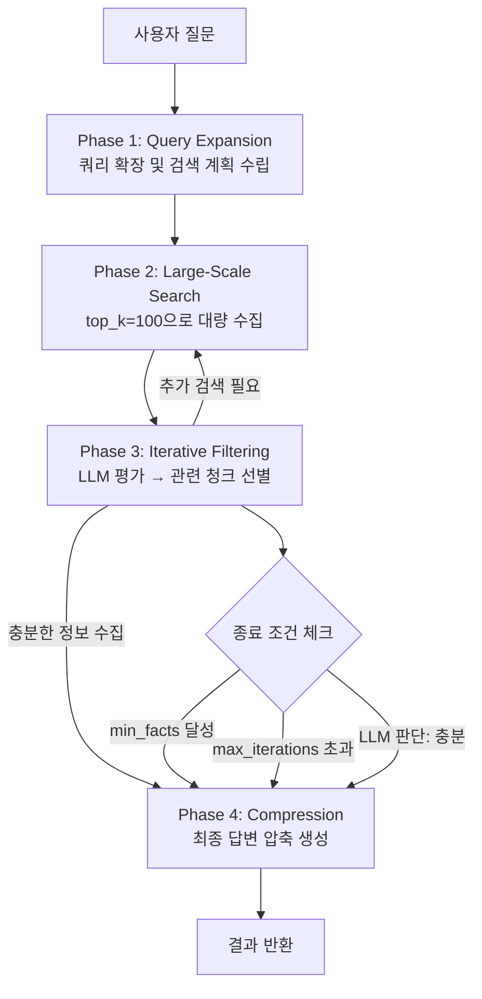

# Iterative RAG: 반복 검색으로 복잡한 질문 답변하기

단순 RAG는 질문 하나에 검색 한 번, 결과 반환이 전부다. 이게 잘 동작하는 경우가 많지만 복잡한 질문에는 한계가 있다. "작년 4분기 매출 하락 원인을 분석하고, 경쟁사 대비 우리 제품의 강점을 근거로 개선 방향을 제시해줘" 같은 질문은 여러 문서에서 다른 맥락의 정보를 끌어와야 한다. xgen-workflow에서 이를 해결하기 위해 Iterative RAG 파이프라인을 구현한 과정을 정리한다.

## 왜 Iterative가 필요한가

단순 RAG의 문제는 검색이 한 번으로 끝난다는 것이다. "top-k 문서를 가져와서 LLM에 넣기" 방식은 다음 상황에서 실패한다.

- 질문에 여러 하위 질문이 포함된 경우 (multi-hop)
- 정보가 여러 문서에 분산된 경우
- 첫 검색에서 부족한 정보를 발견했을 때 추가 검색이 필요한 경우
- 검색 결과의 관련성이 낮아 더 좁은 쿼리가 필요한 경우

Iterative RAG는 검색 → LLM 평가 → 재검색 루프를 반복하면서 필요한 정보를 점진적으로 수집한다.

## 아키텍처



```
# 커밋: feat: Introduce vectordb_retrieval_core for Iterative RAG search pipeline
# 날짜: 2025-12-31 01:49

# 커밋: fix: Enhance keyword matching and result filtering in IterativeSearchEngine
# 날짜: 2026-01-02
```

핵심 구현은 `editor/nodes/xgen/document_loader/vectordb_retrieval_core.py`에 있다.

## Phase 1: Query Expansion

첫 번째 단계는 원본 질문을 여러 검색 쿼리로 확장하고 전략을 수립하는 것이다.

```python
class SearchPlan:
    """LLM이 생성한 검색 전략"""
    primary_query: str          # 기본 검색 쿼리
    sub_queries: List[str]      # 하위 쿼리 목록 (분해된 질문)
    search_keywords: List[str]  # 키워드 검색용 추가 단어
    expected_info_types: List[str]  # 예상 정보 유형 (통계, 정의, 사례 등)

async def _expand_query(self, query: str) -> SearchPlan:
    """LLM으로 쿼리를 분해하고 검색 전략 수립"""
    prompt = f"""질문을 분석하여 검색 전략을 수립하세요.

질문: {query}

다음 형식의 JSON으로 반환:
{{
  "primary_query": "핵심 검색 쿼리",
  "sub_queries": ["하위 질문1", "하위 질문2"],
  "search_keywords": ["키워드1", "키워드2"],
  "expected_info_types": ["통계", "정의", "사례"]
}}"""

    response = await self.llm.achat(prompt)
    return SearchPlan(**json.loads(response))
```

질문을 LLM이 분석해서 여러 하위 쿼리로 나눈다. "매출 하락 원인 + 경쟁사 비교 + 개선 방향"이라면 세 가지 독립적인 검색 쿼리가 생성된다.

## Phase 2: Large-Scale Search

확장된 쿼리로 벡터DB에서 대량의 청크를 수집한다.

```python
@dataclass
class SearchConfig:
    search_top_k: int = 100     # 대량 수집 (기본 top-k의 10배)
    batch_size: int = 20        # 배치 필터링 크기
    max_iterations: int = 5     # 최대 반복 횟수
    max_output_tokens: int = 4000
    min_facts_to_stop: int = 5  # 조기 종료 조건

async def _large_scale_search(
    self,
    query: str,
    search_plan: SearchPlan,
) -> List[SearchChunk]:
    """대량 검색으로 후보 풀 구성"""
    all_chunks = []
    seen_ids = set()

    # 주 쿼리 검색
    results = await self.rag_client.search(
        collection=self.collection,
        query=search_plan.primary_query,
        top_k=self.config.search_top_k,
    )

    # 하위 쿼리 추가 검색
    for sub_query in search_plan.sub_queries:
        sub_results = await self.rag_client.search(
            collection=self.collection,
            query=sub_query,
            top_k=self.config.search_top_k // 2,
        )
        results.extend(sub_results)

    # 중복 제거 (document_id + chunk_index 기준)
    for chunk in results:
        chunk_id = f"{chunk.document_id}:{chunk.chunk_index}"
        if chunk_id not in seen_ids:
            seen_ids.add(chunk_id)
            all_chunks.append(chunk)

    return all_chunks
```

top_k=100으로 넉넉하게 수집한다. 단순 RAG처럼 상위 10개만 가져가는 게 아니라, 관련 가능성 있는 청크를 대량으로 모아두고 다음 단계에서 선별한다.

## Phase 3: Iterative Filtering (핵심)

수집된 청크를 배치 단위로 LLM이 평가하면서 관련 정보를 필터링하는 핵심 루프다.

```python
async def _iterative_filtering(
    self,
    query: str,
    search_plan: SearchPlan,
    all_chunks: List[SearchChunk],
) -> Tuple[List[SearchChunk], List[str]]:
    """반복 배치 필터링"""

    relevant_chunks: List[SearchChunk] = []
    extracted_facts: List[str] = []
    remaining_chunks = all_chunks.copy()

    # 검색 컨텍스트 - 반복 간 상태 공유
    search_context = {
        "found_topics": [],      # 이미 발견한 주제
        "promising_files": [],   # 유망한 파일 목록
        "promising_pages": [],   # 유망한 페이지 번호
        "keywords": search_plan.search_keywords.copy(),
    }

    for iteration in range(self.config.max_iterations):
        if not remaining_chunks:
            break

        # 다음 배치 선택 (컨텍스트 기반 동적 선택)
        batch = self._select_next_batch(
            remaining_chunks,
            search_context,
            batch_size=self.config.batch_size,
        )

        # LLM 배치 평가
        filter_result = await self._filter_batch_with_context(
            query=query,
            batch=batch,
            search_context=search_context,
            iteration=iteration,
        )

        # 관련 청크와 사실 누적
        for chunk_idx in filter_result.relevant_chunk_indices:
            relevant_chunks.append(batch[chunk_idx])
        extracted_facts.extend(filter_result.extracted_facts)

        # 검색 컨텍스트 업데이트
        search_context["found_topics"].extend(filter_result.found_topics)
        search_context["promising_files"].extend(filter_result.promising_files)

        # 조기 종료 조건 체크
        if len(extracted_facts) >= self.config.min_facts_to_stop:
            break
        if filter_result.is_sufficient:
            break

        # 저관련성 연속 3회 → 새 방향으로 전환
        if filter_result.relevance_score < 0.3:
            low_relevance_count += 1
            if low_relevance_count >= 3 and filter_result.suggested_query:
                # 새 쿼리로 추가 검색
                new_chunks = await self.rag_client.search(
                    collection=self.collection,
                    query=filter_result.suggested_query,
                    top_k=50,
                )
                remaining_chunks.extend(new_chunks)
                low_relevance_count = 0

        # 처리한 배치 제거
        batch_set = {id(c) for c in batch}
        remaining_chunks = [c for c in remaining_chunks if id(c) not in batch_set]

    return relevant_chunks, extracted_facts
```

### 배치 선택 전략

단순히 순서대로 배치를 나누지 않는다. `_select_next_batch`는 컨텍스트를 기반으로 더 유망한 청크를 먼저 처리한다.

```python
def _select_next_batch(
    self,
    chunks: List[SearchChunk],
    context: Dict,
    batch_size: int,
) -> List[SearchChunk]:
    """컨텍스트 기반 우선순위로 다음 배치 선택"""

    def priority_score(chunk: SearchChunk) -> float:
        score = chunk.similarity_score  # 기본 유사도

        # 유망 파일 보너스
        if chunk.file_name in context["promising_files"]:
            score += 0.3

        # 유망 페이지 보너스
        if chunk.page_number in context["promising_pages"]:
            score += 0.2

        # 키워드 매칭 보너스
        chunk_text_lower = chunk.chunk_text.lower()
        keyword_matches = sum(
            1 for kw in context["keywords"]
            if kw.lower() in chunk_text_lower
        )
        score += keyword_matches * 0.1

        return score

    scored = sorted(chunks, key=priority_score, reverse=True)
    return scored[:batch_size]
```

이전 배치에서 "유망한 파일"로 표시된 파일의 다른 청크가 다음 배치에서 우선적으로 선택된다. 컨텍스트가 쌓일수록 더 정확한 선택이 가능해진다.

### FilterResult: LLM 평가 결과

```python
@dataclass
class FilterResult:
    relevant_chunk_indices: List[int]  # 관련된 청크 인덱스
    extracted_facts: List[str]         # 발견한 사실들
    found_topics: List[str]            # 발견한 주제들
    promising_files: List[str]         # 유망한 파일명 (추가 탐색 추천)
    promising_pages: List[int]         # 유망한 페이지 번호
    is_sufficient: bool                # 충분한 정보를 수집했는가
    relevance_score: float             # 배치 전체 관련성 (0~1)
    suggested_query: str | None        # 저관련성 시 새 쿼리 제안
```

LLM은 단순히 "관련/비관련"을 판단하는 것 이상을 한다. 어떤 정보를 찾았는지, 어디를 더 봐야 하는지를 구조화된 형식으로 반환한다. 이 결과가 다음 반복의 검색 방향을 결정한다.

## Phase 4: Compression

반복 검색으로 수집한 청크와 사실들을 압축해서 최종 답변을 생성한다.

```python
async def _compress_results(
    self,
    query: str,
    relevant_chunks: List[SearchChunk],
    extracted_facts: List[str],
) -> str:
    """수집된 정보를 압축하여 최종 답변 생성"""

    # 토큰 예산 내에서 처리
    MAX_COMPRESSION_TOKENS = 20000
    MAX_CHUNKS = 15
    MAX_FACTS = 10
    MAX_CHARS_PER_CHUNK = 500

    # 청크 텍스트 요약
    chunk_summaries = []
    for chunk in relevant_chunks[:MAX_CHUNKS]:
        key_info = chunk.chunk_text[:MAX_CHARS_PER_CHUNK]
        chunk_summaries.append({
            "source": f"{chunk.file_name} (p.{chunk.page_number})",
            "content": key_info,
        })

    context = {
        "chunks": chunk_summaries,
        "facts": extracted_facts[:MAX_FACTS],
    }

    prompt = f"""다음 검색 결과를 바탕으로 질문에 답하세요.

질문: {query}

검색된 정보:
{json.dumps(context, ensure_ascii=False, indent=2)}

구체적인 근거를 들어 답변하세요."""

    response = await self.llm.achat(prompt, max_tokens=self.config.max_output_tokens)
    return response
```

## 검색 도구 진화 과정

xgen-workflow에서 검색 도구는 단계적으로 발전했다.

| 버전 | 파일명 | 특징 |
|------|--------|------|
| V1 | `vectordb_retrieval_tool.py` | 단순 벡터 검색, 한 번의 쿼리 |
| V4 | `vectordb_retrieval_tool_v4.py` | Iterative RAG + 토큰 관리 |
| V5 | `vectordb_retrieval_tool_v5.py` | Monte Carlo Tree Search 기반 최적화 |
| Graph | `graph_enhanced_retrieval_tool.py` | 그래프 네트워크 확장 검색 |
| Core | `vectordb_retrieval_core.py` | V4 로직 통합, 현재 운용 중 |

```
# 커밋: fix: Improve search result handling and keyword matching logic
# 날짜: 2026-01-02
```

V4에서 키워드 매칭 로직에 버그가 있었다. 한글 키워드 비교에서 대소문자 정규화가 제대로 되지 않아 일부 매칭이 누락됐다. `fix: Enhance keyword matching and result filtering` 커밋에서 수정했다.

## 조기 종료 조건

max_iterations=5까지 모두 돌리는 건 비효율적이다. 다음 조건 중 하나를 만족하면 조기 종료한다.

```python
# 1. 충분한 사실 수집
if len(extracted_facts) >= config.min_facts_to_stop:  # 기본 5개
    break

# 2. LLM 판단: 충분한 정보
if filter_result.is_sufficient:
    break

# 3. 청크 소진
if not remaining_chunks:
    break

# 4. 최대 반복 횟수
if iteration >= config.max_iterations:
    break
```

실제 테스트에서 대부분의 질문은 2~3회 반복으로 충분한 정보를 수집했다. 5회 전체를 도는 경우는 드물었다.

## 회고

Iterative RAG의 핵심 아이디어는 단순하다. 검색 결과를 보면서 "더 필요한 게 있나?"를 판단하고 있으면 더 찾는 것이다. 사람이 논문을 읽으며 참고문헌을 따라가는 방식과 같다.

구현하면서 어려웠던 부분은 토큰 관리였다. 검색 결과가 많아질수록 LLM 컨텍스트가 부족해지고, 이를 관리하지 않으면 배치 필터링 자체가 실패한다. 다음 글에서 토큰 관리 전략을 더 자세히 다룬다.

`min_facts_to_stop=5`는 경험적으로 정한 값이다. 너무 낮으면 불충분한 상태로 종료되고, 너무 높으면 불필요하게 반복한다. 실제 사용 케이스에 맞게 조정이 필요하다.
