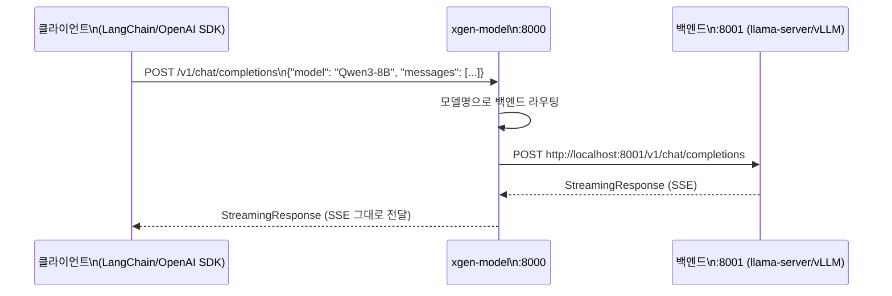

# OpenAI 호환 API 서버 직접 만들기

LLM 서빙 서버를 직접 만들면서 가장 잘한 결정 중 하나는 OpenAI API 포맷을 그대로 따른 것이다. `/v1/chat/completions`, `/v1/embeddings`, `/v1/models` — 이 세 가지 엔드포인트만 맞추면 LangChain, OpenAI 클라이언트, 웬만한 AI 도구들이 전부 연동된다. XGEN 모델 서버가 이 호환 레이어를 어떻게 구현했는지 정리한다.

## 배경: 왜 직접 만드나

llama-server와 vLLM은 둘 다 OpenAI 호환 API를 이미 제공한다. 그런데 xgen-model이 프록시 레이어를 따로 두는 이유가 있다.

1. **단일 진입점**: 클라이언트가 백엔드마다 다른 포트를 알 필요 없음 (8001, 8002 등)
2. **라우팅**: 어떤 모델 요청이냐에 따라 적절한 백엔드로 전달
3. **인증/미들웨어**: 게이트웨이 통합, 헤더 검증
4. **상태 관리**: 모델 로드 상태, 헬스 체크

```
# 커밋: OpenAI 호환 API 엔드포인트 추가 (/api/vllm/v1/chat/completions, /v1/completions, /v1/models)
# 날짜: 2026-01-25 20:32
```

## 아키텍처: 프록시 패턴



클라이언트는 항상 포트 8000으로 요청한다. 내부에서 어떤 백엔드가 돌고 있는지는 알 필요 없다.

## FastAPI 앱 구조

```python
# src/main.py
@asynccontextmanager
async def lifespan(app: FastAPI):
    pm = ProcessManager(
        binary_paths=settings.binary_paths,
        port_range=(settings.PORT_RANGE_START, settings.PORT_RANGE_END),
    )
    async with pm:
        app.state.process_manager = pm
        yield

app = FastAPI(
    title="xgen-model",
    version="2.0.0",
    lifespan=lifespan,
)
app.include_router(management_router)  # /api/management/*
app.include_router(download_router)    # /api/download/*
```

`lifespan` 컨텍스트 매니저가 ProcessManager의 생명주기를 관리한다. GPU 감지와 백엔드 초기화는 서버 시작 시 한 번만 실행된다.

## 모델 엔드포인트 API

클라이언트가 추론 요청을 보낼 백엔드 URL을 알려주는 엔드포인트다.

```python
@router.get("/endpoint/{model_name}")
async def get_endpoint(request: Request, model_name: str):
    """모델 엔드포인트 조회"""
    pm = request.app.state.process_manager
    endpoint = pm.get_endpoint(model_name)
    if endpoint is None:
        raise HTTPException(
            status_code=404,
            detail=f"Model '{model_name}' not loaded or not running"
        )
    return {"model": model_name, "endpoint": endpoint}
```

응답 예시:
```json
{
  "model": "Qwen3-8B",
  "endpoint": "http://localhost:8001/v1"
}
```

클라이언트(xgen-workflow 등)는 이 엔드포인트를 받아서 직접 추론 요청을 보낸다. 프록시를 거치지 않고 백엔드로 직접 통신한다.

## stream_generate: 스트리밍 처리

초기에는 llama-server의 `/completion` API를 직접 호출하는 코드가 있었다.

```
# 커밋: OpenAI 호환 API 수정: stream_chat 대신 stream_generate 사용, messages를 dict로 변환
# 날짜: 2026-01-25 20:52
```

llama-server는 두 가지 API를 제공한다.
- `/completion`: raw completion (프롬프트 → 텍스트)
- `/v1/chat/completions`: OpenAI 호환 (messages 배열 → 텍스트)

초기에 `stream_chat`을 썼다가 `stream_generate`로 교체했다. `stream_chat`이 messages 형식을 다르게 처리하는 문제가 있었기 때문이다.

```python
# messages를 llama-server가 이해하는 형식으로 변환
messages_as_dicts = [
    {"role": msg.role, "content": msg.content}
    for msg in request.messages
]
```

vLLM과 llama-server는 둘 다 `/v1/chat/completions`를 지원하므로, 최종적으로는 이 엔드포인트로 통일했다.

## 로드 API: load_model

```python
@router.post("/load")
async def load_model(request: Request, payload: ModelLoadRequest):
    """
    Returns:
        {
            "status": "success",
            "model": "Qwen3-8B",
            "backend": "llama-server-vulkan",
            "port": 8001,
            "endpoint": "http://localhost:8001/v1"
        }
    """
    pm = request.app.state.process_manager
    try:
        result = await pm.load_model(payload)
        return result
    except ValueError as e:
        raise HTTPException(status_code=400, detail=str(e))
    except RuntimeError as e:
        raise HTTPException(status_code=500, detail=str(e))
```

클라이언트는 이 API로 모델을 올리고, 응답의 `endpoint`를 저장한다. 이후 모든 추론은 그 `endpoint`로 직접 요청한다.

## 헬스 체크

```python
@app.get("/health")
async def health(request: Request):
    pm = request.app.state.process_manager
    health = await pm.health_check()
    all_healthy = all(info["healthy"] for info in health.values()) if health else True
    status = "healthy" if all_healthy else "degraded"
    return JSONResponse(
        status_code=200 if status == "healthy" else 503,
        content={"status": status, "checks": {"models": health}}
    )
```

로드된 모델이 없으면 `health`가 빈 딕셔너리이고 `all_healthy=True`로 처리된다. 503을 리턴하지 않는다.

## accessible 필드: 게이트웨이 호환

```
# 커밋: health_check에 accessible 필드 추가 (frontend 호환성)
# 날짜: 2026-01-25 09:50
```

xgen-frontend가 모델 서버의 health_check 응답에서 `accessible` 필드를 기대했다. 기존 응답에 없어서 추가했다.

```python
async def health_check(self) -> dict[str, Any]:
    """백엔드 상태 확인"""
    if not self.is_running:
        return False

    try:
        response = await self._http_client.get(f"{self.base_url}/health")
        is_healthy = response.status_code == 200
        return {
            "healthy": is_healthy,
            "accessible": is_healthy,  # frontend 호환성
        }
    except Exception:
        return {"healthy": False, "accessible": False}
```

## API Prefix 정착 과정

API 경로가 세 번 바뀌었다.

```
# 커밋: API prefix 제거 (backend-gateway 통합용)
# 날짜: 2026-01-20 05:47

# 커밋: API prefix에 /api 추가 (gateway 라우팅 통합)
# 날짜: 2026-01-25 14:25

# 커밋: API prefix 변경: /api/vllm -> /api/inference
# 날짜: 2026-01-26 14:29
```

xgen-backend-gateway(Rust로 만든 API 게이트웨이)가 `/api/management/*` 경로를 xgen-model로 라우팅한다. 게이트웨이 설정과 모델 서버 prefix가 맞아야 해서 여러 번 조정됐다.

최종적으로:
- 관리 API: `/api/management/*`
- 다운로드 API: `/api/download/*`
- 추론 API: 클라이언트가 직접 백엔드 포트로 (프록시 없음)

## loading_status 로드 상태 API

```
# 커밋: loading_status API에 llamacpp/vLLM 배포 설정 정보 추가 (n_ctx, n_gpu_layers, device 등)
# 날짜: 2026-02-01 02:26
```

모델이 로딩 중일 때 클라이언트가 진행상황을 폴링할 수 있는 API다.

```python
@router.get("/status")
async def get_status(request: Request):
    pm = request.app.state.process_manager
    return await pm.get_status()
```

응답에 모델 상태(LOADING, LOADED, ERROR), 백엔드 타입, 포트, 엔드포인트, 그리고 배포 설정 정보(n_ctx, n_gpu_layers, device)가 포함된다. 프론트엔드가 이 정보를 받아 로딩 진행 UI를 표시한다.

## 실제 클라이언트 연동

```python
# xgen-workflow에서 LLM 호출
from langchain_openai import ChatOpenAI

# 모델 엔드포인트 조회
resp = requests.get(
    "http://xgen-model:8000/api/management/endpoint/Qwen3-8B"
)
endpoint = resp.json()["endpoint"]  # "http://localhost:8001/v1"

# OpenAI 호환 클라이언트로 직접 연결
llm = ChatOpenAI(
    base_url=endpoint,
    model="Qwen3-8B",
    api_key="none",
    streaming=True,
)
```

백엔드가 llama-server든 vLLM이든 `base_url`만 바꾸면 된다. LangChain은 OpenAI 포맷으로 통신하므로 둘 다 동작한다.

## 회고

OpenAI 호환 API를 지키는 것의 가치는 생태계 호환성이다. 새 모델을 올릴 때, 백엔드를 바꿀 때, 다른 팀이 연동할 때마다 이 표준이 빛났다. 별도로 문서를 만들거나 SDK를 제공할 필요가 없다.

반면 아쉬운 점은 llama-server의 `/completion` API(OpenAI 비호환)를 처음에 직접 쓴 것이다. 뒤늦게 `/v1/chat/completions`로 통일하면서 리팩토링 비용이 생겼다. 처음부터 OpenAI 호환 엔드포인트만 쓰는 게 옳았다.
