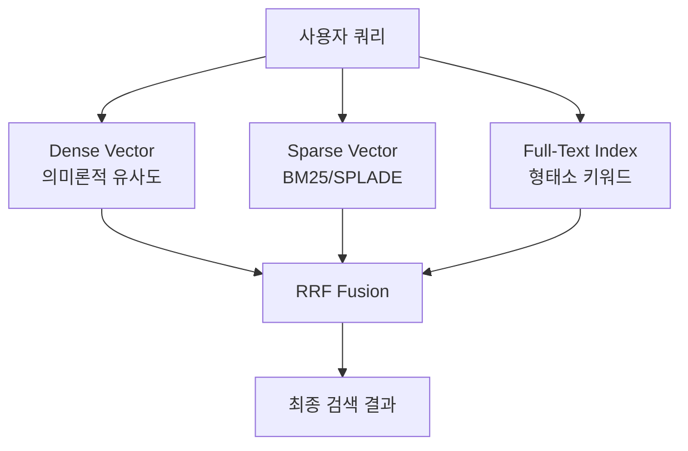

## 배경

XGEN RAG 시스템의 초기 검색은 Dense 벡터만 사용했다. 임베딩 모델이 의미론적 유사도를 계산하는 방식이다. 이 방법은 "개념적으로 비슷한" 문서를 잘 찾지만 정확한 키워드가 포함된 문서를 찾는 데는 약점이 있다.

예를 들어 "AWS S3 버킷 정책 설정"을 검색하면 Dense 검색은 클라우드 스토리지 관련 문서를 광범위하게 찾아오지만, "S3"나 "버킷"이라는 단어가 정확히 포함된 문서를 우선하지 않는다.

Sparse Vector와 Full-Text Index를 추가해서 키워드 기반 검색 능력을 보강하고, Dense + Sparse를 RRF(Reciprocal Rank Fusion)로 결합한 하이브리드 검색을 구현했다.

```
# 2025-12-29 커밋: feat: Implement sparse vector and full-text index support in retrieval system
```

## 검색 방식 비교



| 방식 | 장점 | 단점 |
|------|------|------|
| Dense | 의미 유사도, 동의어 처리 | 정확한 키워드 검색 약함 |
| Sparse | 키워드 정확도, 해석 가능 | 의미 파악 불가 |
| Full-Text | 형태소 분석, 빠름 | 단순 매칭 |

## Qdrant 컬렉션 설정

### Sparse Vector 파라미터 추가

```python
# src/service/vector_db/vector_manager.py

from qdrant_client.models import (
    VectorParams, Distance,
    SparseVectorParams, SparseIndexParams,
    TextIndexParams, TextIndexType, TokenizerType,
)

async def create_collection(
    self,
    collection_name: str,
    vector_size: int,
    enable_sparse: bool = True,
    enable_full_text: bool = True,
) -> bool:
    # Dense 벡터 설정
    vectors_config = {
        "dense": VectorParams(
            size=vector_size,
            distance=Distance.COSINE,
        )
    }

    # Sparse 벡터 설정
    sparse_vectors_config = {}
    if enable_sparse:
        sparse_vectors_config["sparse"] = SparseVectorParams(
            index=SparseIndexParams(
                on_disk=False,   # 메모리에 유지 (속도 우선)
            )
        )

    await self.qdrant_client.create_collection(
        collection_name=collection_name,
        vectors_config=vectors_config,
        sparse_vectors_config=sparse_vectors_config,
    )

    # Full-Text Index 생성
    if enable_full_text:
        await self._create_full_text_index(collection_name)

    return True
```

### Full-Text Index 생성

```python
async def _create_full_text_index(self, collection_name: str) -> None:
    await self.qdrant_client.create_payload_index(
        collection_name=collection_name,
        field_name="content",
        field_schema=TextIndexParams(
            type=TextIndexType.TEXT,
            tokenizer=TokenizerType.MULTILINGUAL,  # 한글/영문 모두 지원
            min_token_len=2,
            max_token_len=15,
            lowercase=True,
        ),
    )
```

`TokenizerType.MULTILINGUAL`을 선택한 이유는 한글 형태소 분석 지원 때문이다. `WORD` 타입은 공백 기준으로만 분리해서 한글 검색 품질이 낮다.

## BM25 Sparse Vector 구현

SPLADE 모델이 있으면 고품질 Sparse Vector를 생성할 수 있지만, 추가 모델 로딩 비용이 크다. SPLADE가 없는 환경에서는 BM25로 Sparse Vector를 직접 계산한다.

```python
# src/service/embedding/bm25_sparse_client.py

import math
import re
from collections import Counter

class BM25SparseClient:
    """BM25 기반 Sparse Vector 생성기"""

    def __init__(self, k1: float = 1.5, b: float = 0.75):
        self.k1 = k1    # 단어 빈도 포화 파라미터
        self.b = b      # 문서 길이 정규화 파라미터
        self.avg_doc_len = 100.0  # 평균 문서 길이 초기값
        self.doc_count = 0
        self.df: dict[str, int] = {}  # 단어별 문서 빈도

    def tokenize(self, text: str) -> list[str]:
        """한글/영문/숫자 토큰화"""
        # 한글 2글자 이상, 영문 2글자 이상, 숫자
        tokens = re.findall(r'[가-힣]{2,}|[a-zA-Z]{2,}|\d+', text.lower())
        return tokens

    def text_to_sparse_vector(
        self,
        text: str,
        vocab: dict[str, int],
    ) -> tuple[list[int], list[float]]:
        """텍스트를 Sparse Vector (indices, values) 로 변환"""
        tokens = self.tokenize(text)
        doc_len = len(tokens)
        tf = Counter(tokens)

        indices = []
        values = []

        for token, count in tf.items():
            if token not in vocab:
                continue
            token_id = vocab[token]

            # BM25 스코어 계산
            idf = math.log(
                (self.doc_count - self.df.get(token, 0) + 0.5) /
                (self.df.get(token, 0) + 0.5) + 1
            )
            tf_norm = (count * (self.k1 + 1)) / (
                count + self.k1 * (1 - self.b + self.b * doc_len / self.avg_doc_len)
            )
            score = idf * tf_norm

            if score > 0:
                indices.append(token_id)
                values.append(float(score))

        return indices, values
```

k1=1.5, b=0.75는 BM25의 전형적인 기본값이다. k1은 단어 빈도 포화 속도를 제어하고, b는 긴 문서에 대한 페널티 강도를 제어한다.

## 포인트 삽입 (Dense + Sparse)

```python
async def insert_points_hybrid(
    self,
    collection_name: str,
    points: list[dict],
) -> None:
    from qdrant_client.models import PointStruct, SparseVector

    qdrant_points = []

    for point in points:
        dense_vector = point["dense_embedding"]
        sparse_indices = point.get("sparse_indices", [])
        sparse_values = point.get("sparse_values", [])

        vectors = {"dense": dense_vector}

        # sparse 데이터가 있으면 추가
        if sparse_indices and sparse_values:
            vectors["sparse"] = SparseVector(
                indices=sparse_indices,
                values=sparse_values,
            )

        qdrant_points.append(
            PointStruct(
                id=point["id"],
                vector=vectors,
                payload=point["payload"],
            )
        )

    await self.qdrant_client.upsert(
        collection_name=collection_name,
        points=qdrant_points,
    )
```

## 하이브리드 검색: RRF Fusion

```python
from qdrant_client.models import (
    Prefetch, FusionQuery, Fusion,
    NamedVector, NamedSparseVector,
    SparseVector, Filter,
)

async def search_hybrid(
    self,
    collection_name: str,
    query_dense: list[float],
    query_sparse_indices: list[int],
    query_sparse_values: list[float],
    top_k: int = 10,
    score_threshold: float = 0.0,
    collection_filter: Filter | None = None,
) -> list[dict]:

    # 컬렉션이 sparse 지원하는지 확인
    collection_info = await self.qdrant_client.get_collection(collection_name)
    has_sparse = "sparse" in (collection_info.config.params.sparse_vectors or {})

    prefetch = [
        # Dense 검색 (의미론적 유사도)
        Prefetch(
            query=NamedVector(name="dense", vector=query_dense),
            limit=top_k * 3,    # 최종보다 3배 많이 가져와서 fusion
            filter=collection_filter,
        ),
    ]

    if has_sparse and query_sparse_indices:
        prefetch.append(
            # Sparse 검색 (키워드 기반)
            Prefetch(
                query=NamedSparseVector(
                    name="sparse",
                    vector=SparseVector(
                        indices=query_sparse_indices,
                        values=query_sparse_values,
                    ),
                ),
                limit=top_k * 3,
                filter=collection_filter,
            )
        )

    # RRF로 결합
    results = await self.qdrant_client.query_points(
        collection_name=collection_name,
        prefetch=prefetch,
        query=FusionQuery(fusion=Fusion.RRF),
        limit=top_k,
        score_threshold=score_threshold,
        with_payload=True,
        with_vectors=False,
    )

    return [
        {
            "id": str(point.id),
            "score": point.score,
            "payload": point.payload,
        }
        for point in results.points
    ]
```

### RRF (Reciprocal Rank Fusion) 동작 원리

RRF는 여러 랭킹 결과를 순위 기반으로 합산한다. 점수 값 자체가 아닌 순위만 사용하기 때문에 서로 다른 스코어 척도를 가진 검색 결과를 자연스럽게 결합할 수 있다.

```
RRF(d) = Σ 1 / (k + rank_i(d))    (k=60 기본값)
```

Dense에서 3위, Sparse에서 1위인 문서는 두 결과 모두에 나타난 문서이므로 높은 점수를 받는다. 어느 한쪽에만 나타나는 문서는 상대적으로 낮은 점수를 받는다.

## Sparse가 없는 컬렉션 폴백

기존에 Dense만으로 생성된 컬렉션도 있다. 이런 컬렉션에서 하이브리드 검색을 요청하면 자동으로 Dense 전용으로 폴백한다.

```python
async def search(
    self,
    collection_name: str,
    query_dense: list[float],
    query_sparse_indices: list[int] | None = None,
    query_sparse_values: list[float] | None = None,
    **kwargs,
) -> list[dict]:
    collection_info = await self.qdrant_client.get_collection(collection_name)
    has_sparse = "sparse" in (collection_info.config.params.sparse_vectors or {})

    if has_sparse and query_sparse_indices:
        return await self.search_hybrid(
            collection_name=collection_name,
            query_dense=query_dense,
            query_sparse_indices=query_sparse_indices,
            query_sparse_values=query_sparse_values,
            **kwargs,
        )
    else:
        # Dense 전용 검색으로 폴백
        return await self.search_dense_only(
            collection_name=collection_name,
            query_dense=query_dense,
            **kwargs,
        )
```

## 임베딩 파이프라인 통합

문서 삽입 시 Dense와 Sparse를 동시에 생성한다.

```python
# src/service/retrieval/rag_service.py

async def embed_and_insert(
    self,
    collection_name: str,
    chunks: list[dict],
) -> None:
    # 1. Dense 임베딩
    texts = [c["content"] for c in chunks]
    dense_embeddings = await self.embedding_client.embed(texts)

    # 2. Sparse 임베딩 (BM25 또는 SPLADE)
    sparse_data = await self.sparse_client.embed(texts)

    # 3. 포인트 구성
    points = []
    for i, chunk in enumerate(chunks):
        sparse_indices, sparse_values = sparse_data[i]
        points.append({
            "id": chunk["id"],
            "dense_embedding": dense_embeddings[i],
            "sparse_indices": sparse_indices,
            "sparse_values": sparse_values,
            "payload": chunk["payload"],
        })

    await self.vector_manager.insert_points_hybrid(collection_name, points)
```

## 결과

- Dense + Sparse + Full-Text 세 가지 방식을 Qdrant 단일 인스턴스에서 처리
- BM25 직접 구현으로 SPLADE 모델 없이도 Sparse Vector 생성 가능
- RRF Fusion으로 두 검색 결과를 점수 정규화 없이 자연스럽게 결합
- 기존 Dense 전용 컬렉션은 자동으로 Dense 검색으로 폴백

키워드 기반 질의("S3 버킷 정책", "GPT-4 API 키 설정" 같은 고유명사 포함 쿼리)에서 Sparse 추가 후 검색 품질이 눈에 띄게 개선됐다. Dense만 있을 때는 주제적으로 관련된 문서가 올라왔다면, Sparse 추가 후에는 해당 키워드가 실제로 포함된 문서가 상위에 랭크됐다.
