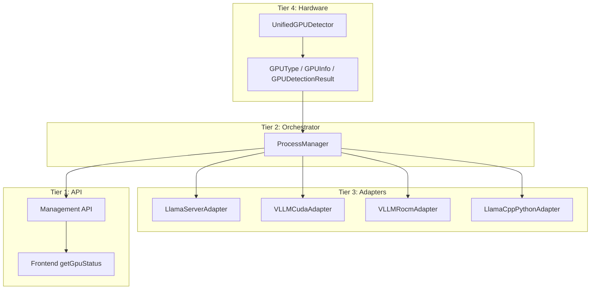
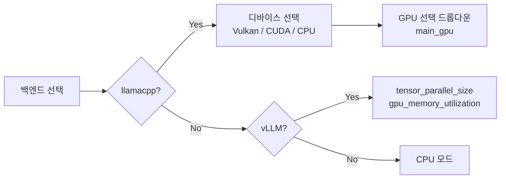
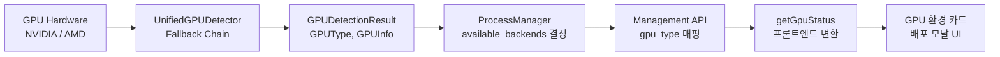

# XGEN GPU 벤더 추상화 — Vulkan 의존 제거와 멀티 벤더 Dockerfile 전략

## 개요

XGEN 모델 서버(xgen-model)는 NVIDIA와 AMD GPU를 모두 지원하는 멀티 벤더 LLM 서빙 시스템이다. llama-server(GGUF 모델)와 vLLM(HuggingFace 모델)을 백엔드로 사용하며, GPU 종류에 따라 적절한 백엔드를 자동 선택한다.

문제는 초기 설계에서 GPU 감지와 UI 표시가 **Vulkan에 종속**되어 있었다는 점이다. 프론트엔드는 `/api/management/gpus` 응답에서 `type === 'vulkan'`인 GPU만 "실제 GPU"로 인식했고, 권장 백엔드도 Vulkan GPU 유무만으로 결정했다. 이 구조에서 두 가지 문제가 발생했다.

첫째, **NVIDIA 서버에서 GPU가 "CPU Only"로 표시**되었다. NVIDIA 환경에는 Vulkan 드라이버가 기본 설치되지 않는 경우가 많다. CUDA로 GPU를 정상 사용하고 있음에도 프론트엔드는 Vulkan GPU를 찾지 못해 "CPU Only"로 표시했다.

둘째, **AMD ROCm 환경에서도 동일한 문제**가 발생했다. ROCm으로 vLLM을 돌리고 있는데, 프론트엔드가 Vulkan 타입 GPU만 체크하니 GPU 환경 카드에 아무 정보도 표시되지 않았다.

이 글에서는 Vulkan 종속 구조를 걷어내고 벤더 중립적인 GPU 관리 파이프라인을 구축한 과정을 다룬다. Hardware 계층의 타입 시스템 설계부터 Management API 응답 형식 재설계, 프론트엔드 변환 로직, 그리고 NVIDIA/AMD 각각의 Dockerfile 전략까지 전체 파이프라인을 정리한다.

기존 블로그 글에서 다룬 GPU 감지 Fallback Chain의 구현 상세나 llama-server 어댑터의 프로세스 관리, 백엔드 스위칭 아키텍처 진화 과정은 생략하고, 이번 리팩토링에서 새로 설계한 부분에 집중한다.


## 아키텍처: 4-Tier GPU 관리 파이프라인

v2 리팩토링의 핵심은 GPU 관련 로직을 명확한 계층으로 분리한 것이다. 기존에는 GPU 감지, 백엔드 선택, 프로세스 관리, API 응답 변환이 한 파일에 뒤섞여 있었다. v2에서는 4개 계층으로 분리했다.



각 계층의 역할은 다음과 같다.

| 계층 | 역할 | 핵심 파일 |
|------|------|-----------|
| Tier 4: Hardware | GPU 감지, 타입 분류 | `backend/hardware/gpu_detector.py`, `types.py` |
| Tier 3: Adapters | 백엔드별 프로세스 관리 | `backend/adapters/llama_server.py`, `vllm_cuda.py` 등 |
| Tier 2: Orchestrator | 백엔드 선택, 포트 할당, 모델 라이프사이클 | `backend/process_manager.py` |
| Tier 1: API | HTTP 엔드포인트, 프론트엔드 호환 응답 | `src/app/api/management.py` |

이 구조에서 GPU 벤더 종속성은 Tier 4에만 존재한다. Tier 3 이상은 `GPUType` enum과 `GPUDetectionResult` 모델만 사용하므로, 새 벤더(예: Apple MPS)를 추가해도 감지기 하나만 추가하면 된다.


## Hardware 계층: 타입 시스템 설계

### GPUType enum — 벤더 분류의 기준

GPU 종류를 구분하는 enum을 먼저 정의했다. 단순히 "NVIDIA vs AMD"가 아니라, AMD 내에서도 RDNA(소비자용)와 CDNA(데이터센터용)를 구분해야 했다. vLLM ROCm이 지원하는 GPU가 gfx 버전에 따라 다르기 때문이다.

```python
class GPUType(str, Enum):
    NVIDIA = "nvidia"
    AMD_RDNA = "amd_rdna"    # RX 7900, Strix Halo 등
    AMD_CDNA = "amd_cdna"    # MI200, MI300 등 데이터센터용
    APPLE_MPS = "apple_mps"  # Apple Silicon
    CPU = "cpu"
    UNKNOWN = "unknown"
```

`str`을 상속한 이유는 JSON 직렬화 시 자동으로 문자열 값이 사용되게 하기 위해서다. `GPUType.NVIDIA`는 `"nvidia"`로 직렬화된다.

AMD를 RDNA/CDNA로 나눈 것이 실제로 의미가 있었다. vLLM ROCm은 CDNA(MI200/MI300)에서는 안정적이지만, RDNA(RX 7900 등)에서는 gfx 버전에 따라 지원이 달라진다. ProcessManager의 백엔드 결정 로직에서 이 구분을 활용한다.

### GPUInfo 모델 — 벤더별 메타데이터 통합

개별 GPU 정보를 담는 Pydantic 모델이다. NVIDIA와 AMD는 제공하는 메타데이터가 다르므로, 공통 필드와 벤더 전용 필드를 함께 정의했다.

```python
class GPUInfo(BaseModel):
    model_config = ConfigDict(frozen=True)  # 불변 객체

    gpu_type: GPUType
    device_name: str                          # 공통: "NVIDIA RTX 4090", "AMD Radeon RX 7900 XTX"
    compute_capability: str | None = None     # NVIDIA 전용: "8.9"
    memory_total_gb: float | None = None      # 공통: VRAM (GB)
    gfx_version: str | None = None            # AMD 전용: "gfx1151", "gfx90a"
    pci_bus_id: str | None = None             # 공통: 멀티 GPU 식별용
```

`frozen=True`로 설정한 것이 중요하다. GPU 정보는 서버 시작 시 한 번 감지되면 런타임에 변하지 않으므로 불변 객체로 만들었다. 이렇게 하면 실수로 GPU 정보를 수정하는 버그를 컴파일 타임에 잡을 수 있다.

`compute_capability`는 NVIDIA 전용이고, `gfx_version`은 AMD 전용이다. 각 벤더의 고유 식별자를 별도 필드로 분리한 것이 핵심인데, 이 값들이 백엔드 결정 로직에서 직접 사용되기 때문이다.

### GPUDetectionResult — Fallback Chain의 최종 결과

```python
class GPUDetectionResult(BaseModel):
    available: bool                    # GPU 사용 가능 여부
    gpus: list[GPUInfo]               # 감지된 모든 GPU
    primary_gpu: GPUInfo | None       # 주 GPU
    detection_method: str             # "amdsmi" | "pynvml" | "torch.cuda" | "cpu_fallback"
```

`detection_method` 필드가 디버깅에 큰 도움이 되었다. 운영 환경에서 GPU가 감지되지 않을 때, 이 값을 보면 어느 감지기까지 시도하다 실패했는지 바로 알 수 있다. "cpu_fallback"이면 모든 감지기가 실패한 것이고, "torch.cuda"면 pynvml이 없어서 PyTorch fallback으로 감지한 것이다.


## ProcessManager: 벤더 중립적 백엔드 결정

ProcessManager는 Hardware 계층이 제공하는 `GPUDetectionResult`를 받아서 사용 가능한 백엔드 목록을 결정한다. 이 로직이 벤더 추상화의 핵심이다.

### 백엔드 결정 로직

```python
def _determine_available_backends(self):
    gpu_type = self._gpu_info["gpu_type"]
    gfx_version = self._gpu_info.get("details", {}).get("gfx_version", "")

    backends = []

    match gpu_type:
        case "nvidia":
            backends.append("vllm-cuda")
            backends.append("llama-server-cuda")

        case "amd_rdna" | "amd_cdna":
            if self._is_vllm_rocm_supported(gfx_version):
                backends.append("vllm-rocm")
            backends.append("llama-server-vulkan")
            backends.append("llama-server-rocm")

        case "cpu":
            pass

    # CPU fallback은 모든 환경에서 사용 가능
    backends.append("llama-cpp-python")

    self._available_backends = backends
```

Python 3.10의 `match/case`를 사용한 것이 가독성 면에서 좋았다. `amd_rdna | amd_cdna`로 AMD 계열을 한 번에 처리하면서도, gfx 버전별 vLLM 지원 여부를 세밀하게 체크한다.

vLLM ROCm이 지원하는 gfx 버전 목록은 생성자에서 설정할 수 있게 했다. 기본값은 실제로 테스트를 거친 버전만 포함한다.

```python
self._vllm_rocm_supported_gfx = set(vllm_rocm_supported_gfx or [
    "gfx1151", "gfx1100", "gfx1101", "gfx1102",  # RDNA 3/3.5
    "gfx90a", "gfx942",                            # CDNA 2/3
])
```

### 모델 형식 기반 자동 백엔드 선택

GPU 타입으로 "사용 가능한" 백엔드를 결정하고, 모델 형식으로 "최적의" 백엔드를 선택한다. 이 2단계 결정이 v2의 설계 포인트다.

```python
def _select_backend(self, model_path: str, server_type: str = "llm") -> str:
    path = Path(model_path)

    # GGUF 모델 -> llama-server (Vulkan > CUDA > ROCm 순으로 탐색)
    if path.suffix.lower() == ".gguf" or "gguf" in model_path.lower():
        for backend in [
            "llama-server-vulkan",
            "llama-server-cuda",
            "llama-server-rocm",
            "llama-cpp-python",
        ]:
            if backend in self._available_backends:
                return backend

    # HuggingFace 모델 (org/model 형식) -> vLLM
    if "/" in model_path and not path.exists():
        for backend in ["vllm-cuda", "vllm-rocm"]:
            if backend in self._available_backends:
                return backend
```

GGUF 모델의 경우 Vulkan을 CUDA보다 우선한 것은 의도적이다. AMD 환경에서 GGUF 모델은 ROCm보다 Vulkan이 안정적이라는 경험에 기반한 결정이다. NVIDIA 환경에서는 `_available_backends`에 Vulkan이 없으므로 자연스럽게 CUDA가 선택된다.

### Adapter 팩토리 — On-demand Import

Adapter 생성 시 `match/case`와 lazy import를 조합했다. NVIDIA 환경에서 ROCm 관련 import가 실패하는 것을 방지하기 위해서다.

```python
def _create_adapter(self, backend_type: str, port: int) -> Any:
    match backend_type:
        case "vllm-cuda":
            from backend.adapters.vllm_cuda import VLLMCudaAdapter
            return VLLMCudaAdapter(port=port)

        case "vllm-rocm":
            from backend.adapters.vllm_rocm import VLLMRocmAdapter
            return VLLMRocmAdapter(port=port)

        case "llama-server-vulkan":
            from backend.adapters.llama_server import LlamaServerAdapter
            binary = self._binary_paths.get(
                "llama-server-vulkan", "/app/bin/llama-server-vulkan"
            )
            return LlamaServerAdapter(binary_path=binary, port=port)
```

`vllm_cuda.py`와 `vllm_rocm.py`를 분리한 이유도 여기에 있다. vLLM CUDA 빌드와 ROCm 빌드는 서로 다른 PyTorch 바이너리를 사용하며, 한 환경에서 다른 환경의 Adapter를 import하면 호환되지 않는 라이브러리가 로드될 수 있다.

### Protocol 기반 Structural Typing

모든 Adapter가 따라야 하는 인터페이스를 `Protocol`로 정의했다. 추상 클래스(ABC)가 아닌 Protocol을 선택한 이유는 structural typing 때문이다.

```python
class BackendProtocol(Protocol):
    async def __aenter__(self) -> "BackendProtocol": ...
    async def __aexit__(self, exc_type, exc_val, exc_tb) -> None: ...
    async def load_model(self, request: ModelLoadRequest) -> dict[str, Any]: ...
    async def health_check(self) -> bool: ...
    async def get_status(self) -> dict[str, Any]: ...

    @property
    def backend_type(self) -> str: ...
    @property
    def is_model_loaded(self) -> bool: ...
```

Protocol을 사용하면 Adapter가 `BackendProtocol`을 명시적으로 상속하지 않아도 된다. 메서드 시그니처만 일치하면 타입 체커가 호환성을 인정한다. 이게 중요한 이유는 각 Adapter가 서로 다른 베이스 클래스를 가질 수 있기 때문이다. `LlamaServerAdapter`는 외부 프로세스를 관리하고, `LlamaCppPythonAdapter`는 in-process로 동작하는데, 공통 베이스 클래스로 묶기 어려운 구조다.

Async context manager 패턴(`__aenter__`, `__aexit__`)을 인터페이스에 포함한 것도 의도적이다. Adapter의 리소스 정리가 보장되어야 하기 때문이다. `ProcessManager.__aexit__`에서 모든 Adapter를 `TaskGroup`으로 병렬 종료한다.


## Management API: 벤더 중립 응답 형식

### /api/management/gpus 재설계

기존 API는 GPU 정보를 단순히 반환했다. 리팩토링에서는 프론트엔드가 필요한 추가 메타데이터를 함께 제공하도록 변경했다.

```python
@router.get("/gpus")
async def list_gpus(request: Request):
    pm = request.app.state.process_manager
    gpu_info = pm.gpu_info
    details = gpu_info.get("details", {})

    # GPU 타입 매핑: nvidia -> cuda, amd -> rocm (프론트엔드 호환)
    gpu_type_map = {"nvidia": "cuda", "amd": "rocm"}
    gpu_type = gpu_type_map.get(gpu_info["gpu_type"], gpu_info["gpu_type"])

    gpus = []
    if gpu_info["available"] and gpu_info["gpu_type"] != "cpu":
        gpus.append({
            "id": 0,
            "name": details.get("device_name", "Unknown GPU"),
            "type": gpu_type,          # "cuda" | "rocm"
            "available": True,
            "memory_gb": details.get("memory_total_gb", 0),
            "memory": f"{memory_gb:.0f}GB" if memory_gb else None,
        })

    # 권장 백엔드: 실제 사용 가능한 백엔드 기반
    backends = pm.available_backends
    if any("vllm" in b for b in backends):
        recommended = "vllm"
    elif any("llama-server" in b for b in backends):
        recommended = "llama-server"
    else:
        recommended = "cpu"

    return {
        "success": True,
        "gpus": gpus,
        "gpu_type": gpu_type,                    # 새로 추가
        "recommended_backend": recommended,      # 새로 추가
        "available_backends": backends,           # 새로 추가
        "detection_method": gpu_info["detection_method"],
    }
```

핵심 변경은 3개 필드의 추가다.

| 필드 | 설명 | 이전 |
|------|------|------|
| `gpu_type` | `"cuda"` / `"rocm"` / `"cpu"` | 없음 (프론트엔드가 Vulkan 여부로 추론) |
| `recommended_backend` | 서버가 결정한 권장 백엔드 | 없음 (프론트엔드가 하드코딩) |
| `available_backends` | 사용 가능한 전체 백엔드 목록 | 없음 |

`gpu_type`에서 내부 타입(`nvidia`, `amd_rdna`)을 프론트엔드 호환 타입(`cuda`, `rocm`)으로 매핑하는 것이 API 레이어의 역할이다. Hardware 계층의 상세한 타입 분류(RDNA vs CDNA)는 API를 통과하면서 프론트엔드가 이해할 수 있는 수준으로 단순화된다.


## 프론트엔드: Vulkan 탈피

### 변경 전 — Vulkan 종속 로직

기존 프론트엔드의 `getGpuStatus()` 함수는 이랬다.

```javascript
// 변경 전: Vulkan GPU만 "진짜 GPU"로 인식
const vulkanGpus = gpus.filter(g => g.type === 'vulkan');
const realGpu = vulkanGpus.find(g => !g.name.includes('llvmpipe')) || vulkanGpus[0];

return {
    device_name: realGpu?.name || null,
    device_count: vulkanGpus.filter(g => !g.name.includes('llvmpipe')).length,
    recommended_backend: vulkanGpus.length > 0 ? 'llamacpp' : 'cpu',
    environment: vulkanGpus.length > 0 ? 'Vulkan GPU detected' : 'CPU only'
};
```

모든 판단이 `type === 'vulkan'` 필터에 의존한다. NVIDIA CUDA GPU가 있어도, AMD ROCm GPU가 있어도, Vulkan 타입이 아니면 "CPU only"로 표시되었다.

### 변경 후 — 백엔드 응답 기반

```javascript
// 변경 후: GPU 타입에 무관하게, 백엔드가 제공하는 메타데이터 활용
const realGpus = gpus.filter(g => !g.name?.includes('llvmpipe') && g.type !== 'cpu');
const primaryGpu = realGpus[0];
const gpuType = data.gpu_type || primaryGpu?.type || 'cpu';
const hasGpu = realGpus.length > 0;

const envLabel = gpuType === 'cuda' ? 'CUDA GPU'
    : gpuType === 'rocm' ? 'ROCm GPU'
    : hasGpu ? 'GPU' : 'CPU only';

// 권장 백엔드: 서버가 결정한 값 우선, fallback으로 타입 기반 추론
const recommended = data.recommended_backend
    || (cudaGpus.length > 0 ? 'vllm' : rocmGpus.length > 0 ? 'llamacpp' : 'cpu');
```

변경의 핵심은 **판단 주체의 이동**이다. "어떤 GPU인가?"와 "어떤 백엔드를 쓸까?"를 프론트엔드가 결정하는 대신, 백엔드가 제공하는 `gpu_type`, `recommended_backend`, `available_backends`를 그대로 사용한다. 프론트엔드는 이 값을 UI에 표시하는 역할만 한다.

### GPU 환경 카드 렌더링

변경 전후의 UI 렌더링 로직 비교다.

| 항목 | 변경 전 | 변경 후 |
|------|---------|---------|
| GPU 감지 판단 | `cuda_available \|\| vulkan_available` | `cuda_available \|\| rocm_available \|\| device_count > 0` |
| 환경 뱃지 텍스트 | `'Vulkan GPU detected'` 또는 `'CPU only'` | `'CUDA GPU'` / `'ROCm GPU'` / `'GPU'` / `'CPU only'` |
| 권장 백엔드 | 프론트엔드 하드코딩 | 서버의 `recommended_backend` 필드 |
| GPU 메모리 | 미표시 | `primaryGpu?.memory_gb` |
| 사용 가능 백엔드 | 없음 | `available_backends` 배열 |
| 기본 디바이스 | `'vulkan'` | `'cuda'` |
| GPUInfo.type 타입 | `'vulkan' \| 'cuda' \| 'rocm' \| 'cpu'` | `'cuda' \| 'rocm' \| 'cpu'` |

### 배포 모달의 GPU 선택 UX

모델 배포 모달에서 GPU 선택은 백엔드에 따라 다른 옵션을 표시한다.



llamacpp 백엔드를 선택하면 디바이스(Vulkan/CUDA/CPU)와 GPU 인덱스를 선택할 수 있다. vLLM은 텐서 병렬화 크기와 GPU 메모리 사용률을 설정한다.

GPU 목록은 배포 모달이 열릴 때 `/api/management/gpus`를 호출해서 가져온다. 각 GPU의 이름, 타입, VRAM을 드롭다운에 표시한다.

```javascript
{gpuList.map((gpu) => (
    <option key={gpu.id} value={gpu.id}>
        [{gpu.id}] {gpu.name} ({gpu.type}{gpu.memory ? `, ${gpu.memory}` : ''})
    </option>
))}
// 렌더링 예: [0] AMD Radeon RX 7900 XTX (rocm, 24GB)
```


## 전체 데이터 흐름

GPU 정보가 하드웨어에서 감지되어 사용자 화면까지 도달하는 전체 흐름을 정리한다.



각 단계에서 데이터 형식이 어떻게 변환되는지 예시로 보면 다음과 같다.

**1단계 — Hardware 감지** (amdsmi):
```
device_name: "AMD Radeon PRO Strix Halo"
gpu_type: GPUType.AMD_RDNA
gfx_version: "gfx1151"
memory_total_gb: 96.0
detection_method: "amdsmi"
```

**2단계 — ProcessManager 처리**:
```
gpu_type: "amd_rdna"
available_backends: ["vllm-rocm", "llama-server-vulkan", "llama-server-rocm", "llama-cpp-python"]
```

**3단계 — API 응답** (`/api/management/gpus`):
```json
{
    "gpus": [{"id": 0, "name": "AMD Radeon PRO Strix Halo", "type": "rocm", "memory": "96GB"}],
    "gpu_type": "rocm",
    "recommended_backend": "vllm",
    "available_backends": ["vllm-rocm", "llama-server-vulkan", "llama-server-rocm", "llama-cpp-python"]
}
```

**4단계 — 프론트엔드 표시**:
```
환경 뱃지: "ROCm GPU"
GPU 이름: AMD Radeon PRO Strix Halo
VRAM: 96 GB
권장 백엔드: vllm
GPU 수: 1개
```

`amd_rdna` → `rocm` 매핑이 API 레이어에서 일어나는 것에 주목하자. Hardware 계층은 GPU 아키텍처(RDNA vs CDNA)를 정확히 구분하지만, API를 통과하면서 프론트엔드가 이해할 수 있는 런타임 타입(cuda/rocm/cpu)으로 단순화된다.


## Dockerfile 벤더 분리 전략

### 왜 통합 Dockerfile이 실패했는가

초기에는 하나의 Dockerfile로 NVIDIA와 AMD를 모두 지원하려 했다. 실패한 이유는 크게 세 가지다.

1. **베이스 이미지가 다르다.** NVIDIA는 `nvidia/cuda:12.8.0-devel-ubuntu22.04`, AMD는 `rocm/dev-ubuntu-24.04:6.3-complete`. 이 둘을 합칠 방법이 없다.
2. **PyTorch 빌드가 다르다.** CUDA용 PyTorch와 ROCm용 PyTorch는 같은 Python 패키지명(`torch`)이지만 완전히 다른 바이너리다.
3. **llama.cpp 빌드 옵션이 다르다.** CUDA는 `-DGGML_CUDA=ON`, AMD Vulkan은 `-DGGML_VULKAN=ON`, ROCm은 `-DGGML_HIP=ON`으로 각각 빌드해야 한다.

결국 `Dockerfile.nvidia`와 `Dockerfile.amd` 두 개로 분리했다.

### Dockerfile.nvidia — CUDA 단일 백엔드

NVIDIA Dockerfile의 구조는 상대적으로 단순하다.

```dockerfile
FROM nvidia/cuda:12.8.0-devel-ubuntu22.04

# PyTorch + CUDA 12.8
RUN pip install torch==2.9.1 --index-url https://download.pytorch.org/whl/cu128

# Backend 1: vLLM (Primary)
RUN pip install vllm==0.15.1

# Backend 2: llama-server (CUDA)
RUN cd /tmp && \
    git clone --depth 1 https://github.com/ggerganov/llama.cpp && \
    cd llama.cpp && \
    cmake -B build -DGGML_CUDA=ON -DCMAKE_CUDA_ARCHITECTURES=86 && \
    cmake --build build --target llama-server -j$(nproc) && \
    cp build/bin/llama-server /usr/local/bin/
```

NVIDIA 환경에서는 vLLM과 CUDA용 llama-server 두 개만 빌드한다. `-DCMAKE_CUDA_ARCHITECTURES=86`은 RTX 3090/A100 등 Ampere 아키텍처를 대상으로 한다. 고객사 GPU에 맞춰 이 값을 조정해야 한다.

llama-server 빌드 전에 CUDA stubs 링크를 만드는 부분이 있다.

```dockerfile
RUN ln -s /usr/local/cuda/lib64/stubs/libcuda.so /usr/local/cuda/lib64/stubs/libcuda.so.1 && \
    echo "/usr/local/cuda/lib64/stubs" >> /etc/ld.so.conf.d/cuda-stubs.conf && \
    ldconfig
```

Docker 빌드 환경에는 실제 CUDA 드라이버(`libcuda.so`)가 없다. 드라이버는 호스트에서 `nvidia-container-toolkit`을 통해 런타임에 마운트된다. 빌드 시점에는 stubs 라이브러리로 링크를 우회해야 cmake 빌드가 성공한다. 빌드 완료 후 stubs 링크를 제거하는 것도 잊지 말아야 한다.

### Dockerfile.amd — 멀티 백엔드 통합

AMD Dockerfile은 복잡하다. 하나의 이미지에 **4개 백엔드**를 빌드한다.

```dockerfile
FROM rocm/dev-ubuntu-24.04:6.3-complete

# Backend 1: vLLM ROCm (HuggingFace 모델용)
RUN pip install torch==2.4.0 --index-url https://download.pytorch.org/whl/rocm6.3

# CRITICAL: amdsmi를 vLLM보다 먼저 설치
RUN pip install /opt/rocm/share/amd_smi || pip install amdsmi
RUN pip install vllm==0.16.0

# Backend 2: llama-server Vulkan (GGUF 모델 권장)
RUN cmake -B build -DGGML_VULKAN=ON -DGGML_HIP=OFF && \
    cp build/bin/llama-server /usr/local/bin/llama-server-vulkan

# Backend 3: llama-server ROCm/HIPBlas (GGUF 백업)
RUN cmake -B build -DGGML_HIP=ON -DAMDGPU_TARGETS="gfx1151" && \
    cp build/bin/llama-server /usr/local/bin/llama-server-rocm

# Backend 4: llama-cpp-python (CPU fallback)
RUN pip install llama-cpp-python==0.3.16

# 기본 llama-server: Vulkan 우선
RUN ln -s /usr/local/bin/llama-server-vulkan /usr/local/bin/llama-server
```

AMD에 4개 백엔드를 넣은 이유가 있다.

**vLLM ROCm**: HuggingFace 모델(safetensors)용. ROCm이 공식 지원하는 gfx 버전에서만 동작한다.

**llama-server Vulkan**: GGUF 모델의 기본 백엔드. AMD GPU에서 가장 안정적이다. ROCm에서 발생하는 GPU page fault 문제가 Vulkan에서는 발생하지 않는다.

**llama-server ROCm**: Vulkan보다 성능이 좋을 수 있지만 안정성이 낮다. 백업용으로 포함했다. `AMDGPU_TARGETS="gfx1151"`로 특정 GPU만 빌드하여 빌드 시간을 단축했다.

**llama-cpp-python**: 모든 GPU 백엔드가 실패할 때의 CPU fallback.

llama-server를 `llama-server-vulkan`과 `llama-server-rocm`으로 분리 저장하고, 기본 심볼릭 링크는 Vulkan으로 설정한 것이 운영 편의성을 높였다. ProcessManager가 백엔드 타입에 따라 적절한 바이너리 경로를 선택한다.


## 트러블슈팅

### amdsmi 설치 순서 트랩

AMD Dockerfile에서 가장 큰 삽질은 amdsmi 설치 순서였다.

```
# 이렇게 하면 실패한다
RUN pip install vllm==0.16.0
RUN pip install amdsmi  # 이미 늦음
```

vLLM은 초기화 시 GPU 플랫폼을 감지한다. amdsmi가 없으면 AMD GPU를 인식하지 못하고 `UnspecifiedPlatform` 에러를 발생시킨다. 이 감지가 `pip install vllm` 시점이 아니라 `import vllm` 시점에 일어나므로, 빌드는 성공하지만 런타임에 터진다.

해결은 간단하다. amdsmi를 vLLM보다 먼저 설치하면 된다.

```dockerfile
# CRITICAL: amdsmi를 반드시 vLLM 이전에 설치
RUN pip install /opt/rocm/share/amd_smi || pip install amdsmi
RUN pip install vllm==0.16.0
```

ROCm 베이스 이미지에는 `/opt/rocm/share/amd_smi`에 amdsmi 패키지가 포함되어 있다. 이게 없는 환경을 위해 `|| pip install amdsmi` fallback도 추가했다.

### Dockerfile.nvidia CUDA/PyTorch 버전 호환성

NVIDIA Dockerfile에서 PyTorch와 CUDA 버전 불일치로 두 번 빌드가 실패했다.

첫 번째 실패는 PyTorch CUDA 버전 미스매치였다. vLLM 0.15.1이 `torch==2.9.1`을 요구하는데, 이 버전은 CUDA 12.8 인덱스에서만 제공된다. `--index-url` 없이 설치하면 CPU 버전이 설치되어 런타임에 CUDA를 사용할 수 없었다.

```dockerfile
# 실패: CPU 버전 torch가 설치됨
RUN pip install torch==2.9.1

# 성공: CUDA 12.8 바이너리 명시
RUN pip install torch==2.9.1 --index-url https://download.pytorch.org/whl/cu128
```

두 번째 실패는 cmake CUDA 아키텍처 설정이었다. `-DCMAKE_CUDA_ARCHITECTURES` 없이 빌드하면 cmake가 호스트의 GPU를 감지하려 하는데, Docker 빌드 환경에는 GPU가 없어서 실패했다. 대상 GPU의 compute capability를 명시적으로 지정해야 한다.

### llvmpipe 가상 GPU 필터링

Vulkan이 설치된 환경에서 `vulkaninfo`를 실행하면, 실제 GPU 외에 `llvmpipe`라는 소프트웨어 렌더러가 목록에 포함된다. 이것은 Mesa 3D의 CPU 기반 Vulkan 구현체로, 실제 GPU가 아니다.

기존 프론트엔드 코드에서 llvmpipe 필터링이 불완전했다.

```javascript
// 변경 전: Vulkan GPU에서만 llvmpipe 필터링
const vulkanGpus = gpus.filter(g => g.type === 'vulkan');
const realGpu = vulkanGpus.find(g => !g.name.includes('llvmpipe'));

// 변경 후: 모든 GPU에서 llvmpipe + CPU 타입 필터링
const realGpus = gpus.filter(g => !g.name?.includes('llvmpipe') && g.type !== 'cpu');
```

`g.name?.includes` 옵셔널 체이닝을 추가한 것은 `name` 필드가 없는 GPU 응답에 대한 방어다. amdsmi가 부분 실패하면 `device_name`만 있고 `name`이 없는 GPU 정보가 반환될 수 있다.

### GPU 응답에서 vulkan 타입 hack

리팩토링 중간에 일시적으로 `vulkan` 타입을 API 응답에 넣었다가 제거하는 삽질이 있었다. 프론트엔드가 `type === 'vulkan'`을 체크하는 코드가 남아있어서, 백엔드에서 `"type": "vulkan"`로 응답하는 hack을 넣었다. 당연히 올바른 해결이 아니었다.

```python
# 나쁜 예: 프론트엔드 호환을 위한 hack
gpus.append({"type": "vulkan", "name": device_name})  # GPU 타입을 거짓으로 보고

# 좋은 예: 프론트엔드와 백엔드를 함께 수정
gpus.append({"type": gpu_type, "name": device_name})   # 실제 타입 반환
```

결국 프론트엔드의 Vulkan 의존 로직을 전부 걷어내고, 백엔드도 실제 GPU 타입을 반환하도록 양쪽을 동시에 수정했다. 커밋 히스토리에 `fix: GPU 목록에 vulkan 타입 추가` → `refactor: GPU 응답에서 vulkan 타입 hack 제거`가 같은 날 연달아 있는 이유다.


## 결과 및 회고

### 변경 효과

Vulkan 종속 제거 후 다음과 같은 개선이 있었다.

**NVIDIA 환경**: GPU가 "CPU Only" 대신 "CUDA GPU"로 정상 표시된다. pynvml을 통해 GPU 모델명, VRAM, compute capability까지 정확히 표시된다.

**AMD ROCm 환경**: amdsmi가 설치된 환경에서 "ROCm GPU"로 표시되며, gfx 버전과 VRAM 정보가 노출된다.

**프론트엔드 관리 부담 감소**: GPU 판단 로직이 백엔드로 이동하면서, 새 GPU 벤더 지원 시 프론트엔드 수정이 불필요해졌다. 서버의 `gpu_type`과 `recommended_backend`만 올바르게 반환하면 프론트엔드는 그대로 동작한다.

### 설계 결정에 대한 회고

**타입 시스템에 투자하는 것은 가치가 있었다.** `GPUType` enum과 `GPUInfo` Pydantic 모델을 먼저 정의하고 시작한 것이 이후 작업을 순탄하게 만들었다. 특히 `frozen=True`로 GPU 정보를 불변 객체로 만든 것이 런타임 버그를 예방했다.

**Protocol > ABC.** Structural typing 덕분에 각 Adapter가 독립적으로 발전할 수 있었다. LlamaServerAdapter와 VLLMCudaAdapter는 완전히 다른 프로세스 관리 방식을 사용하지만, 같은 Protocol을 따르기만 하면 ProcessManager가 동일하게 다룬다.

**벤더별 Dockerfile 분리는 불가피했다.** 통합 Dockerfile을 시도하고 실패한 경험이 있어서 확신을 갖고 분리할 수 있었다. 다만 Dockerfile 두 개를 관리하는 부담이 있다. CI에서 빌드 매트릭스를 사용해 두 이미지를 병렬 빌드하는 것으로 관리 비용을 줄였다.

**API 레이어에서의 타입 매핑이 핵심이었다.** `amd_rdna` → `rocm` 매핑처럼, 내부 표현과 외부 인터페이스를 분리하는 것이 양쪽의 독립적인 발전을 가능하게 했다. Hardware 계층은 RDNA/CDNA 구분이 필요하고, 프론트엔드는 cuda/rocm/cpu만 알면 충분하다.

아직 해결하지 못한 과제도 있다. 멀티 GPU 환경에서 GPU별 모델 할당 정책, GPU 장애 시 자동 복구, 그리고 Apple MPS 지원이 남아 있다. `GPUType` enum에 `APPLE_MPS`를 미리 정의해둔 것은 향후 macOS 환경 지원을 위한 포석이다.
