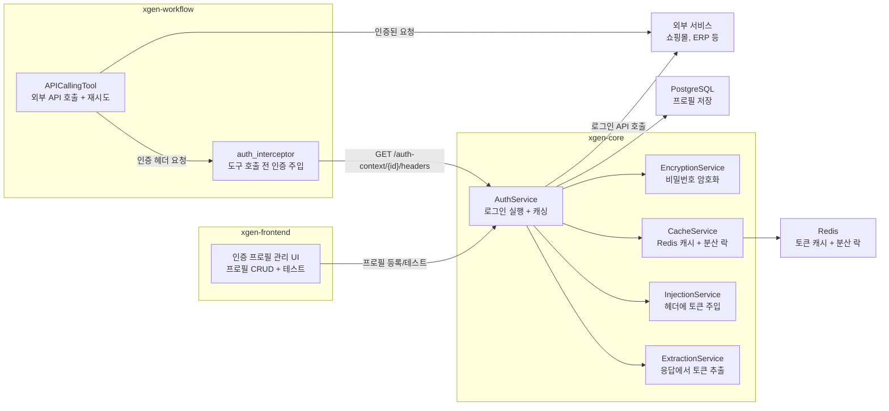
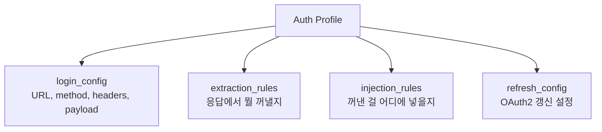
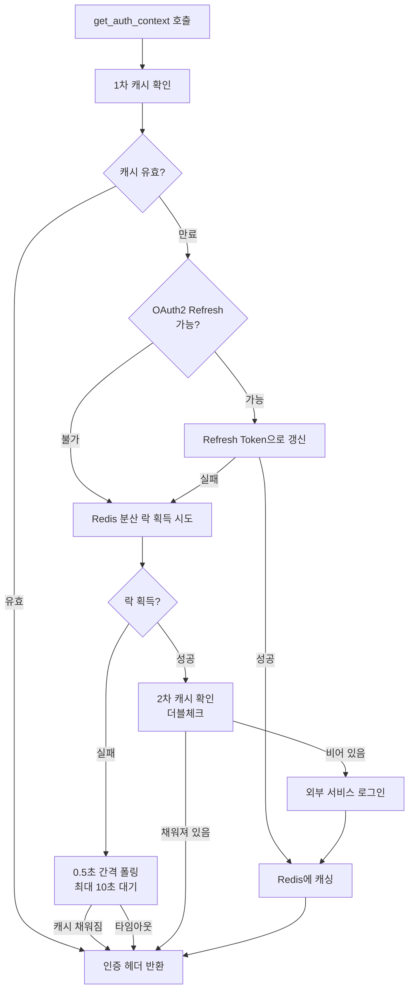

# XGEN 인증 프로필 시스템 — AI Agent가 로그인 사이트를 자동으로 다루는 방법

## 개요

XGEN은 AI Agent가 브라우저를 조작하거나 외부 API를 호출하여 업무를 자동화하는 플랫폼이다. 그런데 현실의 업무 시스템은 대부분 로그인이 필요하다. 쇼핑몰 관리자 페이지, ERP 시스템, 사내 API 서버 — 어디든 인증 없이는 접근할 수 없다.

Agent가 외부 API 도구를 호출할 때마다 사용자가 직접 토큰을 복사해서 붙여넣는 건 자동화의 의미가 없다. 토큰이 만료되면 또다시 수동 갱신해야 하고, 여러 워크플로우가 동시에 같은 서비스에 접근하면 세션이 충돌하기도 한다.

이 문제를 해결하기 위해 **인증 프로필(Auth Profile)** 시스템을 설계했다. 한 번 로그인 설정을 등록해두면, Agent가 도구를 호출할 때 자동으로 로그인하고, 토큰을 캐싱하고, 만료 시 갱신하고, 401 에러가 나면 재시도까지 처리한다.

이 글에서는 3개 마이크로서비스(xgen-core, xgen-workflow, xgen-frontend)에 걸친 인증 자동화 아키텍처의 설계와 구현 과정을 정리한다.

---

## 아키텍처

### 전체 흐름

인증 프로필 시스템은 3개 서비스가 역할을 분담한다.



핵심 아이디어는 **관심사 분리**다. xgen-workflow는 인증 로직을 전혀 모른다. "이 프로필의 인증 헤더를 달라"는 API 호출 하나만 할 뿐이다. 로그인, 토큰 추출, 캐싱, 갱신, 암호화는 전부 xgen-core의 Session Station 모듈이 처리한다.

### 데이터 모델

인증 프로필은 크게 4가지 정보로 구성된다.



예를 들어 쇼핑몰 관리자 API에 대한 인증 프로필은 이렇게 구성된다.

```json
{
    "service_id": "bo-mall-admin",
    "name": "쇼핑몰 관리자 API",
    "auth_type": "bearer",
    "login_config": {
        "url": "https://api.mall.com/auth/login",
        "method": "POST",
        "headers": { "Content-Type": "application/json" },
        "payload": {
            "email": "admin@mall.com",
            "password": "ENC(gAAAAABl...)"
        },
        "timeout": 10
    },
    "extraction_rules": [
        {
            "name": "access_token",
            "source": "body",
            "key_path": "data.accessToken"
        },
        {
            "name": "session_id",
            "source": "cookie",
            "key_path": "JSESSIONID"
        }
    ],
    "injection_rules": [
        {
            "source_field": "access_token",
            "target": "header",
            "key": "Authorization",
            "value_template": "Bearer {access_token}"
        },
        {
            "source_field": "session_id",
            "target": "header",
            "key": "Cookie",
            "value_template": "JSESSIONID={session_id}"
        }
    ],
    "ttl": 3600
}
```

`login_config`는 어디에 어떻게 로그인할지, `extraction_rules`는 응답에서 뭘 꺼낼지, `injection_rules`는 꺼낸 값을 실제 API 호출 시 어디에 넣을지를 정의한다. 이 3단계가 인증 프로필의 핵심이다.

---

## 핵심 구현

### 1. 추출 엔진 (ExtractionService)

로그인 API 응답에서 필요한 값을 꺼내는 엔진이다. 4가지 소스를 지원한다.

| source | 설명 | key_path 예시 |
|--------|------|---------------|
| `body` | JSON 응답 본문에서 점(.) 경로로 추출 | `data.accessToken` |
| `header` | 응답 헤더에서 추출 | `X-Auth-Token` |
| `cookie` | Set-Cookie에서 추출 | `JSESSIONID` |
| `fixed` | 고정값 (환경별 상수) | — |

```python
class ExtractionService:
    def extract_all(self, response: httpx.Response,
                    extraction_rules: List[Dict]) -> Dict[str, Any]:
        context = {}
        for rule in extraction_rules:
            name = rule["name"]
            source = rule["source"]
            key_path = rule.get("key_path")
            fixed_value = rule.get("value")

            value = None
            if source == "fixed":
                value = fixed_value or key_path
            elif source == "body":
                value = self.extract_from_body(response.json(), key_path)
            elif source == "header":
                value = response.headers.get(key_path)
            elif source == "cookie":
                value = response.cookies.get(key_path)

            if value is not None:
                context[name] = value
        return context

    @staticmethod
    def extract_from_body(body: dict, key_path: str) -> Optional[Any]:
        keys = key_path.split('.')
        current = body
        for key in keys:
            if isinstance(current, dict):
                current = current.get(key)
            else:
                return None
        return current
```

`body` 소스의 경우 `data.token.access_token` 같은 중첩 JSON 경로를 지원한다. `split('.')`으로 키를 쪼개서 한 단계씩 탐색하는 단순한 구현이지만, 실제 로그인 API 응답 구조는 대부분 2~3단계 이내여서 충분하다.

### 2. 주입 엔진 (InjectionService)

추출된 값을 실제 HTTP 요청에 넣어주는 엔진이다.

```python
class InjectionService:
    @staticmethod
    def build_injection_instructions(context: Dict,
                                     injection_rules: List[Dict]) -> List[Dict]:
        instructions = []
        for rule in injection_rules:
            source_field = rule["source_field"]
            source_value = context.get(source_field)
            if not source_value:
                continue
            value = rule["value_template"].format(
                **{source_field: source_value}
            )
            instructions.append({
                "target": rule["target"],
                "key": rule["key"],
                "value": value,
                "required": rule.get("required", False)
            })
        return instructions
```

`value_template`에서 `{access_token}` 같은 플레이스홀더를 Python의 `str.format()`으로 치환한다. 예를 들어 `Bearer {access_token}` 템플릿에 `access_token=eyJhbGci...` 값이 들어가면 `Bearer eyJhbGci...`가 된다.

최종적으로 이 instruction 목록을 HTTP 헤더 딕셔너리로 변환한다.

```python
@staticmethod
def build_headers_from_instructions(instructions: List[Dict]) -> Dict[str, str]:
    headers = {}
    for inst in instructions:
        if inst["target"] != "header":
            continue
        key = inst["key"]
        value = inst["value"]
        if key in headers:
            headers[key] = headers[key] + "; " + value
        else:
            headers[key] = value
    return headers
```

같은 헤더 키에 여러 값이 들어갈 수 있다. 대표적인 경우가 `Cookie` 헤더다. JSESSIONID와 다른 세션 쿠키를 함께 전달해야 할 때 `Cookie: JSESSIONID=abc; _xm_webid_1_=xyz` 형태로 병합된다. 이 부분은 나중에 트러블슈팅 섹션에서 다시 다룬다.

### 3. Redis 기반 캐싱과 분산 락

인증 프로필 시스템의 핵심은 **캐싱**이다. 도구를 호출할 때마다 외부 서비스에 로그인하면 느릴 뿐 아니라, 일부 서비스는 짧은 시간에 반복 로그인하면 계정을 잠그기도 한다.

#### 캐싱 전략



#### 분산 락이 필요한 이유

동일한 사용자가 같은 서비스에 대해 여러 워크플로우 노드를 동시에 실행하면, `get_auth_context()`가 동시에 여러 번 호출된다. 캐시가 비어 있으면 전부 외부 로그인 API를 호출하게 되는데, 문제는 일부 서비스가 **동시 로그인 시 이전 세션을 무효화**한다는 점이다.

예를 들어:
1. 노드 A가 로그인 → 세션 S1 획득 → 캐시에 S1 저장
2. 노드 B가 거의 동시에 로그인 → 세션 S2 획득 → S1 무효화 → 캐시에 S2 저장
3. 노드 A가 S1으로 API 호출 → **401 에러** (S1은 이미 죽었다)

이 문제를 Redis `SET NX EX`로 해결했다.

```python
class CacheService:
    def acquire_login_lock(self, user_id: int, service_id: str,
                           timeout: int = 30) -> bool:
        lock_key = f"auth_login_lock:{user_id}:{service_id}"
        try:
            return bool(
                self.redis.redis_client.set(lock_key, "1", nx=True, ex=timeout)
            )
        except Exception as e:
            logger.error(f"Lock acquire failed: {e}")
            return True  # Redis 장애 시 로그인 허용

    def release_login_lock(self, user_id: int, service_id: str) -> None:
        lock_key = f"auth_login_lock:{user_id}:{service_id}"
        try:
            self.redis.redis_client.delete(lock_key)
        except Exception as e:
            logger.error(f"Lock release failed: {e}")
```

설계 포인트:

- **키 패턴** `auth_login_lock:{user_id}:{service_id}`: 사용자+서비스 단위로 격리한다. 다른 사용자의 로그인은 서로 간섭하지 않는다.
- **SET NX EX**: Redis의 원자적 "없으면 생성 + TTL 설정" 명령이다. 분산 환경에서도 정확히 하나의 요청만 락을 잡는다.
- **TTL 30초**: 로그인 프로세스가 비정상 종료되어도 30초 후 자동 해제된다. 데드락 방지 장치다.
- **안전 폴백**: Redis 장애 시 `return True`로 로그인을 허용한다. 중복 로그인이 발생할 수 있지만, 서비스 자체가 멈추지는 않는다.

#### 더블체크 패턴

락을 획득한 후 바로 로그인하지 않고, 한 번 더 캐시를 확인한다.

```python
lock_acquired = self.cache.acquire_login_lock(user_id, service_id, timeout=30)

if not lock_acquired:
    # 다른 요청이 로그인 중 → 최대 10초 대기
    for _ in range(20):
        time.sleep(0.5)
        cached = self._check_cache(user_id, service_id, profile_dict)
        if cached:
            return self._build_response(profile_dict, cached, from_cache=True)
    # 타임아웃 → fallback
    return {"success": False, "message": "Login in progress, timed out"}

try:
    # 락 획득 성공 → 2차 캐시 확인 (더블체크)
    if not force_refresh:
        cached = self._check_cache(user_id, service_id, profile_dict)
        if cached:
            return self._build_response(profile_dict, cached, from_cache=True)

    # 진짜 로그인 실행
    context = self._perform_login(profile, profile_dict)
    return self._build_response(profile_dict, context)
finally:
    self.cache.release_login_lock(user_id, service_id)
```

락 대기 중에 다른 요청이 로그인을 완료하고 캐시에 결과를 저장했을 수 있다. 불필요한 중복 로그인을 방지하기 위해 락 획득 직후에도 캐시를 다시 확인한다. 이것은 Java의 DCL(Double-Checked Locking) 패턴과 같은 원리다.

### 4. 인증 인터셉터 (xgen-workflow)

xgen-workflow에서 인증 프로필을 실제로 사용하는 부분이다. `middleware/auth_interceptor.py`에 단일 함수로 구현되어 있다.

```python
CORE_SERVICE_BASE_URL = os.environ.get(
    "CORE_SERVICE_BASE_URL", "http://xgen-core:8000"
)

def inject_auth_headers(
    existing_headers: Dict[str, str],
    auth_profile_id: Optional[str] = None,
    user_id: Optional[int] = None,
    force_refresh: bool = False
) -> Dict[str, str]:
    if not auth_profile_id:
        return existing_headers

    url = (f"{CORE_SERVICE_BASE_URL}"
           f"/api/session-station/v1/auth-context"
           f"/{auth_profile_id}/headers")
    headers = {"X-User-ID": str(user_id)}
    params = {}
    if force_refresh:
        params["force_refresh"] = "true"

    response = httpx.get(url, headers=headers, params=params, timeout=30)
    auth_headers = response.json()

    # 인증 헤더를 기존 헤더에 병합 (인증 헤더 우선)
    merged = {**existing_headers, **auth_headers}
    return merged
```

이 함수는 xgen-core의 Session Station API를 호출해서 인증 헤더를 받아온다. 내부에서 로그인, 캐싱, 추출, 주입이 모두 처리되고, workflow 쪽에서는 결과 헤더만 받아서 쓰면 된다.

### 5. 401 자동 갱신과 재시도

워크플로우에서 도구를 실행하는 `APICallingTool` 노드에는 인증 에러 시 자동으로 토큰을 갱신하고 재시도하는 로직이 있다.

```python
max_retries = 3
auth_error_codes = {401, 403}
retry_status_codes = {408, 429, 500, 502, 503, 504}

for attempt in range(max_retries):
    # 인증 에러 재시도: force_refresh=True로 토큰 강제 갱신
    if (attempt > 0
        and last_status_code in auth_error_codes
        and auth_profile_id and tool_user_id):
        api_headers = inject_auth_headers(
            api_headers, auth_profile_id,
            user_id=int(tool_user_id),
            force_refresh=True  # 캐시 무시, 새 토큰 발급
        )

    response = httpx.request(method, url, headers=api_headers, ...)

    if response.status_code in auth_error_codes:
        last_status_code = response.status_code
        continue  # 즉시 재시도
    elif response.status_code in retry_status_codes:
        time.sleep(1)
        continue
    else:
        break  # 성공 또는 다른 에러
```

동작 시나리오:

1. 첫 번째 시도: 캐시된 토큰으로 API 호출
2. **401 응답**: 토큰이 만료된 것이다. `force_refresh=True`로 Session Station에 새 토큰을 요청한다. Session Station은 캐시를 무시하고 외부 서비스에 다시 로그인한다.
3. 두 번째 시도: 새 토큰으로 재시도
4. 여전히 401이면 세 번째까지 시도 후 에러 반환

이 로직 덕분에 TTL이 만료된 토큰을 사용하더라도 사용자가 수동으로 개입할 필요 없이 자동으로 복구된다.

### 6. 비밀번호 암호화 (EncryptionService)

인증 프로필에는 로그인 비밀번호, API 키 같은 민감 정보가 포함된다. DB에 평문으로 저장하면 안 되므로 Fernet 대칭 암호화를 적용했다.

```python
class EncryptionService:
    def encrypt_value(self, value: str) -> str:
        encrypted = self.fernet.encrypt(value.encode())
        return f"ENC({encrypted.decode()})"

    def decrypt_value(self, encrypted_value: str) -> str:
        if not encrypted_value.startswith("ENC("):
            return encrypted_value  # 비암호화 값은 그대로
        encrypted_str = encrypted_value[4:-1]
        return self.fernet.decrypt(encrypted_str.encode()).decode()

    def encrypt_login_config(self, login_config: dict) -> dict:
        sensitive_keys = ["password", "client_secret", "api_key",
                          "secret", "token"]
        if "payload" in login_config:
            for key in sensitive_keys:
                if key in login_config["payload"]:
                    val = login_config["payload"][key]
                    if not val.startswith("ENC("):
                        login_config["payload"][key] = self.encrypt_value(val)
        return login_config
```

`ENC(...)` 접두사로 이미 암호화된 값을 구분한다. 프로필을 수정할 때 비밀번호를 바꾸지 않았으면 이미 `ENC(...)` 형태이므로 중복 암호화하지 않는다.

### 7. 프론트엔드 UI

프론트엔드는 3탭 구조로 인증 프로필을 설정한다.

**기본 설정 탭**: 프로필 이름, 인증 방식(Bearer / Cookie / API Key / OAuth2), TTL 설정

**인증 API 탭**: 로그인 URL, HTTP 메서드, 요청 헤더와 페이로드를 JSON 에디터로 입력

**추출/주입 규칙 탭**: 동적 폼으로 규칙을 추가/삭제. 추출 규칙은 `이름 | 소스(select) | Key Path` 3열, 주입 규칙은 `소스 필드 | 대상(select) | 키 | 값 템플릿` 4열 그리드로 구성된다.

프로필을 저장한 후 "테스트" 버튼을 누르면 실제 로그인을 시도하고, 결과를 상세 모달로 보여준다. 모달에는 성공/실패 배지, HTTP 상태 코드, 응답 헤더, 응답 바디, 추출된 값(`extracted_context`)이 전부 표시되어 추출 규칙 디버깅이 쉽다.

```
테스트 결과 모달
+-------------------------------------------+
| SUCCESS  HTTP 200 OK (234ms)              |
+-------------------------------------------+
| Extracted Context:                        |
| {                                         |
|   "access_token": "eyJhbGciOiJ...",       |
|   "session_id": "A1B2C3D4E5F6"           |
| }                                         |
+-------------------------------------------+
| Response Headers:                         |
| Set-Cookie: JSESSIONID=A1B2C3D4E5F6;...  |
| Content-Type: application/json            |
+-------------------------------------------+
| Response Body:                            |
| { "data": { "accessToken": "eyJ..." } }  |
+-------------------------------------------+
```

프로필 스토어 기능도 있다. 잘 만든 프로필을 스토어에 업로드하면 다른 사용자가 다운로드해서 자기 credential만 채워넣으면 바로 쓸 수 있다. 업로드 시 payload(비밀번호 등)는 자동으로 제거된다.

---

## 트러블슈팅

### Cookie 헤더 다중 값 병합 버그

**증상**: 쇼핑몰 관리자 API에서 로그인은 성공하는데, 이후 API 호출이 계속 401로 실패했다.

**원인**: 로그인 응답에서 `JSESSIONID`와 `_xm_webid_1_` 두 개의 쿠키를 추출해야 했다. 주입 규칙을 이렇게 설정했다.

```json
[
    { "source_field": "jsessionid", "target": "header",
      "key": "Cookie", "value_template": "JSESSIONID={jsessionid}" },
    { "source_field": "webid", "target": "header",
      "key": "Cookie", "value_template": "_xm_webid_1_={webid}" }
]
```

문제는 `build_headers_from_instructions` 구현이 dict comprehension이었다는 것이다.

```python
# 버그 코드
headers = {inst["key"]: inst["value"] for inst in instructions}
# 결과: {"Cookie": "_xm_webid_1_=xyz"}  ← JSESSIONID가 사라진다
```

Python dict comprehension에서 같은 키가 여러 번 나오면 마지막 값만 남는다. `Cookie` 키에 두 번째 값이 덮어쓰면서 JSESSIONID가 사라졌다.

**해결**: 같은 키는 `"; "`로 연결하도록 루프로 변경했다.

```python
headers = {}
for inst in instructions:
    key = inst["key"]
    value = inst["value"]
    if key in headers:
        headers[key] = headers[key] + "; " + value
    else:
        headers[key] = value
# 결과: {"Cookie": "JSESSIONID=abc; _xm_webid_1_=xyz"}
```

### 동시 로그인으로 인한 세션 충돌

**증상**: 워크플로우에서 3개의 API 도구 노드가 병렬로 실행될 때, 첫 번째 노드는 성공하지만 나머지 두 노드가 간헐적으로 401 에러를 반환했다.

**원인**: 3개 노드가 거의 동시에 `get_auth_context()`를 호출했다. 캐시가 비어 있어서 세 요청 모두 외부 서비스에 로그인했고, 외부 서비스가 세 번째 로그인 시 첫 번째와 두 번째 세션을 무효화했다. 첫 번째 노드가 캐시에 저장한 토큰은 이미 죽은 상태였다.

**해결**: Redis `SET NX EX` 기반 분산 락을 도입했다. 같은 user+service 조합에 대해 한 번에 하나의 로그인만 실행되도록 보장한다. 락을 잡지 못한 요청은 0.5초 간격으로 캐시를 폴링하며 대기한다.

### fixed 소스의 value 필드 누락

**증상**: 추출 규칙에서 소스를 `fixed`로 선택하고 고정값을 입력한 뒤 저장하면, 다시 열었을 때 값이 사라져 있었다.

**원인**: 프론트엔드 UI에서 입력 필드가 항상 `key_path`에 바인딩되어 있었다. `fixed` 소스는 `value` 필드를 사용해야 하는데, UI가 `key_path`에 값을 저장하고 백엔드는 `value`에서 찾으려 해서 불일치가 발생했다.

**해결**: 프론트엔드와 백엔드 양쪽을 수정했다. 프론트엔드는 소스 전환 시 `key_path`와 `value` 간에 값을 마이그레이션하도록 했고, 백엔드는 `value = fixed_value or key_path`로 fallback을 추가해서 어느 쪽에 값이 들어있든 동작하도록 했다.

```python
# 백엔드 fallback
if source == "fixed":
    value = fixed_value or key_path  # value가 없으면 key_path에서 읽기
```

```typescript
// 프론트엔드 소스 전환 시 값 마이그레이션
const updateExtractionRule = (idx: number, field: string, val: string) => {
    const updated = [...extractionRules];
    if (field === 'source' && val === 'fixed') {
        // body/header/cookie → fixed: key_path 값을 value로 이동
        updated[idx] = {
            ...updated[idx],
            source: val,
            value: updated[idx].key_path || '',
            key_path: ''
        };
    } else if (field === 'source' && updated[idx].source === 'fixed') {
        // fixed → 다른 소스: value 값을 key_path로 이동
        updated[idx] = {
            ...updated[idx],
            source: val,
            key_path: updated[idx].value || '',
            value: null
        };
    } else {
        updated[idx] = { ...updated[idx], [field]: val };
    }
    setExtractionRules(updated);
};
```

### extraction_rules가 문자열로 반환되는 문제

**증상**: 프로필 목록 페이지에서 `Z.map is not a function` 에러가 발생하며 화면이 깨졌다.

**원인**: 백엔드가 `extraction_rules`를 JSON 배열이 아닌 JSON **문자열**(`"[{...}]"`)로 반환하는 경우가 있었다. DB에 JSON 타입이 아닌 TEXT 타입으로 저장되어 있어서, 역직렬화 없이 문자열 그대로 내려오는 것이었다.

**해결**: 프론트엔드에서 방어적으로 처리했다.

```typescript
const [extractionRules, setExtractionRules] = useState<any[]>(() => {
    const raw = editingProfile?.extraction_rules;
    if (Array.isArray(raw)) return raw;
    if (typeof raw === 'string') {
        try {
            const parsed = JSON.parse(raw);
            return Array.isArray(parsed) ? parsed : [];
        } catch { return []; }
    }
    return [];
});
```

프로필 목록, 스토어 목록, 상세 모달 등 5곳에 `Array.isArray()` 가드를 추가했다.

### 도구 테스트 시 인증 미주입

**증상**: 도구 관리 페이지에서 "테스트" 버튼을 눌렀을 때, 워크플로우에서는 정상 동작하는 도구가 401 에러를 반환했다.

**원인**: `test_tool` 엔드포인트에 `inject_auth_headers()` 호출이 빠져 있었다. 워크플로우 실행 경로(`APICallingTool`)에는 인증 인터셉터가 있었지만, 도구 테스트 경로에는 없었다.

**해결**: `test_tool` 함수에 인증 주입 로직을 추가했다.

```python
auth_profile_id = tool.get("auth_profile_id")
if auth_profile_id and user_id:
    if not api_headers:
        api_headers = {}
    api_headers = inject_auth_headers(
        api_headers, auth_profile_id, user_id=int(user_id)
    )
```

---

## 마이크로서비스 통합: session-station에서 xgen-core로

인증 프로필 시스템은 처음에 `xgen-session-station`이라는 별도 마이크로서비스로 개발했다. 그런데 운영하면서 몇 가지 문제가 생겼다.

- 서비스 하나가 늘어날 때마다 K8s Deployment, Service, ConfigMap, HPA가 추가된다. 리소스 오버헤드가 크다.
- Session Station은 DB와 Redis를 사용하는데, xgen-core도 같은 DB와 Redis를 사용한다. 연결이 중복된다.
- 워크플로우에서 인증 헤더를 요청할 때 네트워크 홉이 하나 추가된다. `workflow → session-station → external` 대신 `workflow → core → external`이면 한 홉 줄어든다.

결국 `xgen-session-station`의 모든 코드를 `xgen-core/controller/session_station/`으로 이동하고, API 경로(`/api/session-station/v1/*`)는 그대로 유지했다. 클라이언트(xgen-workflow) 쪽은 환경변수 `CORE_SERVICE_BASE_URL`만 바꾸면 됐다. API 경로를 유지한 덕분에 프론트엔드와 게이트웨이의 라우팅 설정은 변경할 필요가 없었다.

---

## 결과 및 회고

인증 프로필 시스템 도입 후 달라진 점을 정리하면:

**자동화 범위 확장**: 이전에는 인증이 필요 없는 공개 API만 도구로 등록할 수 있었다. 이제 로그인이 필요한 사내 시스템, 관리자 페이지 API도 도구로 등록하고 Agent가 자동으로 호출할 수 있다.

**운영 부담 감소**: 토큰 만료 시 자동 갱신, 401 시 자동 재시도 덕분에 "토큰 갱신해주세요" 같은 수동 개입이 없어졌다.

**프로필 재사용**: 스토어를 통해 한 사람이 만든 인증 프로필을 팀 전체가 공유할 수 있다. 쇼핑몰 관리자 API 프로필을 한 번 만들어두면 다른 사용자는 credential만 바꿔서 쓰면 된다.

설계에서 가장 신경 쓴 부분은 **추출/주입 규칙 엔진의 범용성**이다. 하드코딩 없이 규칙만으로 다양한 인증 방식(Bearer 토큰, 세션 쿠키, API 키, OAuth2)에 대응할 수 있다. 새로운 인증 방식이 나타나도 코드 변경 없이 규칙 설정만으로 처리 가능하다.

반면, 개선이 필요한 부분도 있다. 현재 `extract_from_body`는 단순 점(.) 경로만 지원하는데, 배열 인덱싱(`data.tokens[0].value`)이나 JSONPath 같은 고급 경로가 필요한 경우가 있다. 또한 OAuth2 Refresh Token 흐름은 기본 구현만 되어 있어서, PKCE나 Authorization Code Flow 같은 복잡한 흐름은 아직 지원하지 않는다.
