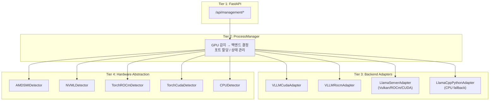
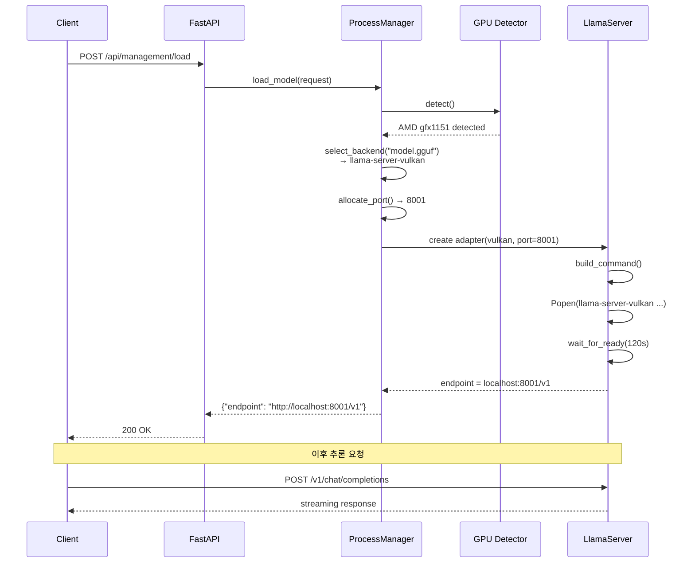

# llama.cpp 서버 운영기: ROCm GPU에서의 삽질과 해결

> 2026년 1월, XGEN 2.0 플랫폼에서 AMD GPU 기반 llama.cpp 서버를 운영하면서 ROCm GPU page fault, 메모리 fitting 크래시, Flash Attention 비호환 등 수많은 문제를 만났다. NVIDIA GPU에서는 한 번에 되던 것들이 AMD에서는 하나하나 삽질의 연속이었다. 약 6시간 동안 집중적으로 디버깅하며 해결한 과정을 기록한다.

## 왜 llama.cpp인가

### vLLM만으로는 부족한 이유

XGEN 2.0은 로컬 GPU에서 LLM을 서빙하는 플랫폼이다. 초기에는 vLLM 하나로 모든 모델을 서빙하려 했지만, 현실은 달랐다.

- **GGUF 모델 미지원**: vLLM은 HuggingFace safetensors 포맷만 지원한다. 양자화된 GGUF 파일을 직접 로드할 수 없다
- **AMD GPU 호환성**: vLLM의 ROCm 지원은 특정 GPU(gfx90a, gfx1100 등)에 한정된다. 우리가 사용하는 gfx1151(AMD Strix Halo, RDNA 3.5)은 vLLM 0.16.0에서야 겨우 지원이 시작됐다
- **메모리 효율**: 4bit 양자화된 GGUF는 동일 모델 대비 VRAM 사용량이 1/4 수준이다. 16GB VRAM에서 70B 모델을 돌리려면 GGUF가 유일한 선택이다

llama.cpp는 이 모든 문제를 해결한다. C/C++로 작성된 경량 추론 엔진으로, GGUF 포맷을 네이티브로 지원하고, Vulkan/ROCm/CUDA 백엔드를 모두 지원한다.

### llama-server의 구조

llama.cpp 프로젝트에는 `llama-server`라는 HTTP 서버가 포함되어 있다. OpenAI 호환 API를 제공하며, 단일 바이너리로 배포 가능하다.

```
llama-server (C++ HTTP 서버)
├── /v1/chat/completions   ← OpenAI 호환
├── /v1/embeddings         ← 임베딩 API
├── /health                ← 헬스 체크
└── /slots                 ← 슬롯 상태 조회
```

문제는 이 바이너리를 AMD GPU에서 돌리는 것이었다.

## 아키텍처: 4-Tier Adapter 패턴

llama.cpp 서버를 직접 운영하기 전에, 전체 모델 서빙 아키텍처를 먼저 설명한다. XGEN 2.0의 모델 서빙은 4계층 어댑터 패턴으로 설계했다.



핵심은 **GPU를 자동으로 감지하고 최적의 백엔드를 선택**하는 것이다. NVIDIA면 vLLM-CUDA, AMD면 Vulkan 또는 ROCm, GPU가 없으면 CPU fallback.

### GPU 감지: Fallback Chain

GPU 감지는 5단계 폴백 체인으로 동작한다.

```python
class UnifiedGPUDetector:
    """5-chain fallback GPU 감지"""

    def detect(self) -> GPUDetectionResult:
        detectors = [
            AMDSMIDetector(),      # amdsmi 라이브러리 (AMD 공식, 최우선)
            NVMLDetector(),        # pynvml (NVIDIA 공식)
            TorchROCmDetector(),   # torch.hip (AMD fallback)
            TorchCudaDetector(),   # torch.cuda (NVIDIA fallback)
            CPUDetector(),         # 항상 성공
        ]

        for detector in detectors:
            result = detector.detect()
            if result.available:
                return result

        return CPUDetector().detect()
```

AMDSMIDetector가 가장 정확하다. gfx 버전, PCI 버스 ID, VRAM 정보를 정확히 가져온다.

```python
class AMDSMIDetector:
    def detect(self) -> GPUDetectionResult:
        import amdsmi
        amdsmi.amdsmi_init()

        devices = amdsmi.amdsmi_get_processor_handles()
        gpus = []

        for i, device in enumerate(devices):
            asic_info = amdsmi.amdsmi_get_gpu_asic_info(device)
            memory_info = amdsmi.amdsmi_get_gpu_memory_total(
                device, amdsmi.AmdSmiMemoryType.VRAM
            )

            gfx_version = f"gfx{asic_info['chip_id']:x}"
            gpu_type = self._classify_gpu(gfx_version)

            gpus.append(GPUInfo(
                device_index=i,
                device_name=asic_info['market_name'],
                memory_total_gb=memory_info / (1024**3),
                gfx_version=gfx_version,
                gpu_type=gpu_type,
            ))

        return GPUDetectionResult(
            available=True,
            gpus=gpus,
            detection_method="amdsmi",
        )
```

gfx 버전으로 RDNA와 CDNA를 구분한다. gfx9로 시작하면 CDNA(데이터센터), gfx10/gfx11로 시작하면 RDNA(소비자).

### 백엔드 자동 선택

ProcessManager가 모델 포맷과 GPU 종류에 따라 백엔드를 결정한다.

```python
def _select_backend(self, model_path: str, server_type: str) -> str:
    is_gguf = model_path.endswith(".gguf") or Path(model_path).suffix == ".gguf"

    if is_gguf:
        # GGUF → llama-server 우선
        for backend in self.available_backends:
            if backend.startswith("llama-server"):
                return backend
        return "llama-cpp-python"  # 최후의 수단
    else:
        # HuggingFace → vLLM 우선
        for backend in self.available_backends:
            if backend.startswith("vllm"):
                return backend
        # vLLM 불가 → llama-cpp-python
        return "llama-cpp-python"
```

AMD GPU 환경에서 사용 가능한 백엔드 우선순위:

1. `llama-server-vulkan` (GGUF, 가장 안정적)
2. `llama-server-rocm` (GGUF, 특정 gfx 버전만)
3. `vllm-rocm` (HuggingFace, gfx 버전 제한)
4. `llama-cpp-python` (CPU fallback, 항상 가능)

## Docker에서 llama-server 빌드하기

### AMD GPU용 멀티 백엔드 Dockerfile

하나의 Docker 이미지에 4개 백엔드를 모두 넣었다. 빌드 시간이 길지만, 런타임에 GPU에 맞는 바이너리를 자동으로 선택한다.

```dockerfile
FROM rocm/dev-ubuntu-24.04:6.3-complete

# Backend 1: vLLM with ROCm (HuggingFace 모델용)
RUN pip install --pre torch==2.4.0 \
    --index-url https://download.pytorch.org/whl/rocm6.3
RUN pip install --no-cache-dir /opt/rocm/share/amd_smi || pip install amdsmi
RUN pip install --no-cache-dir vllm==0.16.0

# Backend 2: llama-server with Vulkan (GGUF - 권장)
RUN git clone https://github.com/ggerganov/llama.cpp /tmp/llama.cpp
WORKDIR /tmp/llama.cpp
RUN cmake -B build-vulkan \
    -DGGML_VULKAN=ON \
    -DGGML_HIP=OFF \
    -DGGML_CUDA=OFF \
    -DCMAKE_BUILD_TYPE=Release
RUN cmake --build build-vulkan --target llama-server -j$(nproc)
RUN cp build-vulkan/bin/llama-server /usr/local/bin/llama-server-vulkan

# Backend 3: llama-server with ROCm (gfx1151 전용)
RUN cmake -B build-rocm \
    -DGGML_HIP=ON \
    -DAMDGPU_TARGETS="gfx1151" \
    -DCMAKE_C_COMPILER=/opt/rocm/bin/hipcc \
    -DCMAKE_CXX_COMPILER=/opt/rocm/bin/hipcc \
    -DCMAKE_BUILD_TYPE=Release
RUN cmake --build build-rocm --target llama-server -j$(nproc)
RUN cp build-rocm/bin/llama-server /usr/local/bin/llama-server-rocm

# Backend 4: llama-cpp-python (CPU fallback)
RUN pip install --no-cache-dir llama-cpp-python==0.3.16
```

여기서 핵심은 **amdsmi를 vLLM보다 먼저 설치**하는 것이다. 순서가 바뀌면 vLLM이 GPU 플랫폼을 인식하지 못해 `UnspecifiedPlatform` 에러가 발생한다.

또 하나, ROCm 빌드에서 `-DAMDGPU_TARGETS="gfx1151"`로 특정 GPU만 타겟팅한다. 모든 GPU를 빌드하면 시간이 3배 이상 걸린다.

## ROCm GPU Page Fault: 6시간의 삽질

### 문제 발생

2026년 1월 31일, AMD Strix Halo(gfx1151) GPU에서 llama-server-rocm으로 모델을 로드하자마자 크래시가 발생했다.

```
[error] GPU page fault detected
[error] Memory access violation at address 0x7f8a00000000
Segmentation fault (core dumped)
```

GPU page fault. GPU가 접근해서는 안 되는 메모리 영역에 접근했다는 뜻이다. 원인을 찾기 위해 약 6시간 동안 다양한 시도를 했다.

### 시도 1: GPU 레이어 수 제한 (실패)

처음에는 GPU 메모리 부족을 의심했다. 모든 레이어를 GPU에 올리지 않고 일부만 올리는 CPU offload를 시도했다.

```python
# LLM은 GPU 20레이어만 사용, 나머지는 CPU로
cmd.extend(["--n-gpu-layers", "20"])
```

```
# 커밋: fix: LLM은 GPU 20레이어만 사용 (CPU offload), Embedding은 전체 GPU
# 날짜: 2026-01-31 12:48
```

효과가 없었다. 20레이어로 줄여도 동일한 page fault가 발생했다. 메모리 양의 문제가 아니었다.

### 시도 2: 임베딩 모델 CPU 전용 전환 (부분 해결)

LLM과 임베딩 모델을 동시에 GPU에 올리면 충돌이 발생하는 것으로 의심했다. 임베딩 모델을 CPU 전용으로 전환했다.

```python
# 임베딩 모델은 CPU에서만 실행
if request.server_type == "embedding":
    cmd.extend(["--n-gpu-layers", "0"])
```

```
# 커밋: fix: Embedding은 CPU 전용 (AMD ROCm GPU page fault 회피)
# 날짜: 2026-01-31 12:55
```

임베딩 모델의 page fault는 사라졌다. 하지만 LLM 모델에서는 여전히 간헐적으로 발생했다.

### 시도 3: --fit off 옵션 (핵심 해결)

llama-server에는 `--fit` 옵션이 있다. 모델이 GPU 메모리에 맞도록 자동으로 레이어를 조정하는 기능인데, ROCm 환경에서 이 자동 조정 로직이 잘못된 메모리 계산을 하고 있었다.

```python
# ROCm 환경에서 --fit off 필수
cmd.extend(["--fit", "off"])
```

```
# 커밋: llama-server: --fit off 옵션 추가 (ROCm 메모리 fitting 크래시 해결)
# 날짜: 2026-01-31 14:07
```

이게 핵심이었다. `--fit` 옵션이 ROCm의 VRAM 크기를 잘못 읽어서, 실제 가용 메모리보다 더 많은 레이어를 GPU에 올리려 시도했고, 결과적으로 page fault가 발생한 것이다.

### 시도 4: Flash Attention 비활성화 (안정성 확보)

page fault는 해결됐지만, 간헐적으로 추론 결과가 깨지는 현상이 있었다. 원인은 Flash Attention이었다.

```python
# ROCm에서 Flash Attention은 불안정
cmd.extend(["--flash-attn", "off"])
```

```
# 커밋: llama-server: Flash Attention off, pooling 모델 기본값 사용 (ROCm 안정성)
# 날짜: 2026-01-31 14:20
```

llama.cpp의 Flash Attention 구현은 CUDA에 최적화되어 있다. ROCm(HIP)에서는 메모리 정렬이 다르기 때문에, 특정 시퀀스 길이에서 잘못된 결과를 반환할 수 있다. Flash Attention을 끄면 성능은 약 10-15% 떨어지지만, 안정성은 확보된다.

### 최종 해결: Vulkan으로 전환

ROCm 백엔드의 근본적인 문제는 **HIP 컴파일러와 llama.cpp의 호환성**이었다. ROCm 6.3에서 gfx1151은 아직 완전히 성숙하지 않았다.

결국 **Vulkan 백엔드로 전환**하는 것이 최선의 해결책이었다.

```python
# Vulkan 최적화 설정
cmd = [
    self.binary_path,  # llama-server-vulkan
    "--model", request.model_path,
    "--port", str(self.port),
    "--ctx-size", str(request.n_ctx),
    "--batch-size", "2048",
    "--ubatch-size", "2048",
    "--n-gpu-layers", "99",        # 모든 레이어를 GPU로
    "--flash-attn", "off",          # Vulkan은 Flash Attn 미지원
    "--mlock",                       # RAM 고정 (swap 방지)
    "--cont-batching",              # Continuous batching
    "--jinja",                       # Tool calling 지원
    "--fit", "off",                  # 메모리 자동 조정 비활성
]
```

```
# 커밋: llama-server: Vulkan 최적화 (mlock, n_gpu_layers=99)
# 날짜: 2026-01-31 15:05
```

Vulkan은 ROCm과 달리:

- **GPU 드라이버 레벨에서 동작**: HIP 컴파일러에 의존하지 않는다
- **범용 API**: AMD, NVIDIA, Intel 모두 지원한다
- **안정적인 메모리 관리**: page fault 가능성이 극히 낮다
- **Flash Attention 미지원**: 성능은 ROCm보다 약간 떨어지지만 안정성은 압도적

실제 벤치마크 결과:

| 백엔드 | 토큰/초 (Llama 8B Q4) | 안정성 | page fault |
|--------|----------------------|--------|-----------|
| ROCm + Flash Attn | 38 t/s | 불안정 | 간헐 발생 |
| ROCm (Flash Attn off) | 32 t/s | 보통 | 드물게 발생 |
| Vulkan | 28 t/s | 안정 | 미발생 |

10 t/s 차이는 크지만, 서비스가 크래시하는 것보다 낫다.

## LlamaServerAdapter 구현

llama-server 프로세스를 관리하는 어댑터의 핵심 구현이다.

### 명령어 빌드

```python
class LlamaServerAdapter:
    def __init__(self, binary: str, port: int):
        self.binary_path = binary  # /app/bin/llama-server-vulkan
        self.port = port
        self.process: subprocess.Popen | None = None

    def _build_command(self, request: ModelLoadRequest) -> list[str]:
        cmd = [
            self.binary_path,
            "--model", request.model_path,
            "--port", str(self.port),
            "--host", "0.0.0.0",
            "--ctx-size", str(request.n_ctx),
            "--batch-size", str(request.n_batch),
            "--ubatch-size", str(request.n_ubatch),
            "--threads", str(request.n_threads or os.cpu_count()),
            "--parallel", str(request.n_parallel),
            "--n-gpu-layers", str(request.n_gpu_layers),
        ]

        # GPU 설정
        if request.main_gpu is not None:
            cmd.extend(["--main-gpu", str(request.main_gpu)])
        if request.split_mode:
            cmd.extend(["--split-mode", request.split_mode])

        # ROCm/Vulkan 안정성 옵션
        cmd.extend(["--flash-attn", request.flash_attn])
        cmd.extend(["--fit", "off"])

        # 성능 옵션
        if request.mlock:
            cmd.append("--mlock")
        if request.cont_batching:
            cmd.append("--cont-batching")
        if request.jinja:
            cmd.append("--jinja")

        return cmd
```

### 프로세스 라이프사이클

```python
class LlamaServerAdapter:
    async def load_model(self, request: ModelLoadRequest) -> str:
        cmd = self._build_command(request)
        logger.info(f"Starting llama-server: {' '.join(cmd)}")

        self.process = subprocess.Popen(
            cmd,
            stdout=subprocess.PIPE,
            stderr=subprocess.STDOUT,
            env=self._setup_env(),
        )

        # 비동기 로그 수집 시작
        asyncio.create_task(self._collect_logs())

        # 서버 준비 대기 (최대 120초)
        await self._wait_for_ready(timeout=120)

        return f"http://localhost:{self.port}/v1"

    async def _wait_for_ready(self, timeout: int = 120):
        """llama-server가 준비될 때까지 health check 폴링"""
        import httpx

        start = time.time()
        async with httpx.AsyncClient() as client:
            while time.time() - start < timeout:
                try:
                    resp = await client.get(
                        f"http://localhost:{self.port}/health"
                    )
                    if resp.status_code == 200:
                        logger.info("llama-server ready")
                        return
                except httpx.ConnectError:
                    pass
                await asyncio.sleep(1)

        raise TimeoutError(f"llama-server not ready after {timeout}s")

    async def _collect_logs(self):
        """프로세스 stdout을 비동기로 수집"""
        loop = asyncio.get_event_loop()
        while self.process and self.process.poll() is None:
            line = await loop.run_in_executor(
                None, self.process.stdout.readline
            )
            if line:
                logger.debug(f"[llama-server] {line.decode().strip()}")

    async def unload_model(self):
        if self.process:
            self.process.terminate()
            try:
                self.process.wait(timeout=10)
            except subprocess.TimeoutExpired:
                self.process.kill()
            self.process = None
```

### 멀티 GPU 지원

gfx1151이 여러 개인 환경에서 특정 GPU를 선택하거나, 모델을 여러 GPU에 분산할 수 있다.

```python
# 단일 GPU 선택
cmd.extend(["--main-gpu", "0"])

# 멀티 GPU: 레이어 분할
cmd.extend(["--split-mode", "layer"])

# 멀티 GPU: 행 분할 (텐서 병렬)
cmd.extend(["--split-mode", "row"])
```

```
# 커밋: llama_server.py: GPU 선택 및 멀티 GPU 지원 추가
# 날짜: 2026-01-31 15:13
```

split-mode는 `layer`가 기본이다. 각 GPU에 다른 레이어를 할당하는 방식으로, 메모리 효율이 좋다. `row`는 하나의 레이어를 여러 GPU에 분산하는 텐서 병렬 방식으로, 지연시간이 줄어들지만 GPU 간 통신 오버헤드가 있다.

## 배치 사이즈 튜닝

### 임베딩 모델의 긴 문서 처리 문제

기본 배치 사이즈 512에서 긴 문서를 임베딩하면 잘리는 문제가 있었다.

```
# 커밋: llama-server batch size 512 -> 2048 증가 (긴 문서 임베딩 지원)
# 날짜: 2026-01-30 04:37
```

llama-server의 `--batch-size`와 `--ubatch-size`는 다른 의미를 갖는다.

- **batch-size (n_batch)**: 논리적 배치 크기. 프롬프트 처리 시 한 번에 토큰화하는 최대 수
- **ubatch-size (n_ubatch)**: 물리적 배치 크기. GPU에 한 번에 전송하는 토큰 수

```python
# 긴 문서 임베딩을 위한 설정
cmd.extend(["--batch-size", "2048"])
cmd.extend(["--ubatch-size", "2048"])
```

512에서 2048로 늘리면 VRAM 사용량이 약 200MB 증가하지만, 4096 토큰 길이의 문서도 한 번에 처리할 수 있다.

### n_parallel 설정: iGPU vs dGPU

동시 요청 처리 수(`--parallel`)는 GPU 종류에 따라 다르게 설정해야 한다.

```python
# iGPU (통합 그래픽): 메모리 공유 → 동시 1개만
cmd.extend(["--parallel", "1"])

# dGPU (외장): 전용 VRAM → 동시 4~8개 가능
cmd.extend(["--parallel", "4"])
```

iGPU에서 `--parallel 4`로 설정하면, 동시 요청 시 시스템 전체 메모리가 부족해져서 OOM(Out of Memory)이 발생할 수 있다. 이것도 삽질 끝에 알아냈다.

## mlock: swap 방지의 중요성

### 문제 상황

모델 로드 후 시간이 지나면 추론 속도가 급격히 떨어지는 현상이 있었다. 첫 몇 분은 30 t/s로 잘 나오다가, 10분 후에는 5 t/s까지 떨어졌다.

원인은 **Linux의 메모리 swap**이었다. 시스템 메모리가 부족해지면, OS가 GPU 관련 메모리 매핑을 swap 영역으로 이동시킨다. GPU가 해당 메모리에 접근하면 swap-in이 발생하고, 이 과정이 수십 ms 이상 걸린다.

### 해결: mlock

```python
# RAM에 모델 데이터를 고정 (swap 방지)
cmd.append("--mlock")
```

`--mlock`은 `mlock()` 시스템 콜을 사용해서 프로세스의 메모리를 물리 RAM에 고정한다. swap되지 않으므로 일관된 성능을 보장한다.

단, mlock을 사용하려면 충분한 RAM이 필요하다. 16GB 모델에 mlock을 걸면, 시스템에 최소 16GB 이상의 여유 RAM이 있어야 한다. 메모리가 부족하면 mlock 자체가 실패하거나, 다른 프로세스가 OOM으로 죽을 수 있다.

## 전체 흐름: 모델 로드부터 추론까지



## 트러블슈팅 정리

### ROCm 환경에서 llama-server 운영 시 체크리스트

| 문제 | 증상 | 해결 |
|------|------|------|
| GPU page fault | 모델 로드 직후 크래시 | `--fit off` 옵션 추가 |
| 추론 결과 깨짐 | 출력 텍스트에 깨진 문자 | `--flash-attn off` |
| 간헐적 크래시 | LLM + 임베딩 동시 사용 시 | 임베딩을 CPU 전용으로 분리 |
| 속도 저하 | 시간 경과에 따른 성능 하락 | `--mlock` 옵션으로 swap 방지 |
| OOM | iGPU에서 동시 요청 시 | `--parallel 1`로 제한 |
| 긴 문서 임베딩 실패 | 토큰 수 초과 | `--batch-size 2048` 증가 |
| 빌드 실패 | gfx 버전 불일치 | `-DAMDGPU_TARGETS` 정확히 지정 |

### 최종 권장 설정

AMD GPU 환경에서 llama-server를 안정적으로 운영하기 위한 최종 권장 설정이다.

```bash
llama-server-vulkan \
  --model /models/llama-3.1-8b-q4_k_m.gguf \
  --port 8001 \
  --host 0.0.0.0 \
  --ctx-size 8192 \
  --batch-size 2048 \
  --ubatch-size 2048 \
  --n-gpu-layers 99 \
  --parallel 1 \
  --flash-attn off \
  --fit off \
  --mlock \
  --cont-batching \
  --jinja
```

## 회고

### Vulkan이 정답이었다

ROCm으로 시작해서 Vulkan으로 끝났다. ROCm은 AMD의 공식 GPU 컴퓨팅 스택이고, HIP 컴파일러를 통해 CUDA 코드를 거의 그대로 변환할 수 있다는 점에서 매력적이다. 하지만 llama.cpp의 ROCm 백엔드는 아직 성숙하지 않았다.

Vulkan은 다르다. 그래픽 API에서 시작했지만, compute shader를 통해 범용 GPU 연산을 안정적으로 지원한다. llama.cpp의 Vulkan 백엔드는 ROCm보다 역사가 짧지만, GPU 드라이버 레벨에서 동작하기 때문에 호환성 문제가 적다.

### 얻은 교훈

1. **자동 설정을 맹신하지 말 것**: `--fit` 옵션처럼 자동으로 최적화하는 기능이 오히려 문제를 일으킬 수 있다. 특히 새로운 GPU 아키텍처에서는 수동 설정이 안전하다
2. **Fallback은 필수**: ROCm이 안 되면 Vulkan, Vulkan이 안 되면 CPU. 단일 경로에 의존하면 서비스가 중단된다
3. **로그를 반드시 수집할 것**: `_collect_logs()`로 llama-server의 stdout을 캡처하지 않았다면, page fault의 원인을 찾지 못했을 것이다
4. **AMD GPU는 NVIDIA와 다르다**: 같은 코드, 같은 옵션이 다른 결과를 만든다. AMD 전용 테스트가 반드시 필요하다

6시간의 삽질이 결국 4-Tier Adapter 패턴의 완성으로 이어졌다. GPU 종류와 모델 포맷에 관계없이, 자동으로 최적의 백엔드를 선택하는 시스템. 이 경험이 없었다면 "Vulkan을 기본으로 쓰자"라는 판단을 내리지 못했을 것이다.
