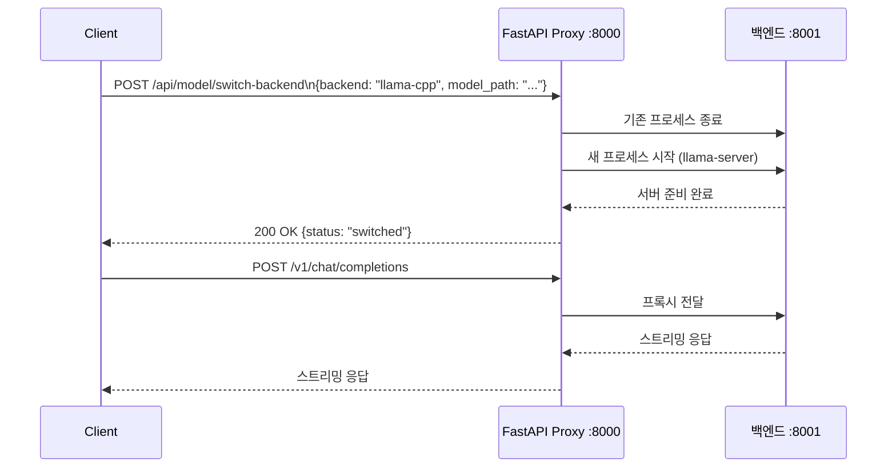
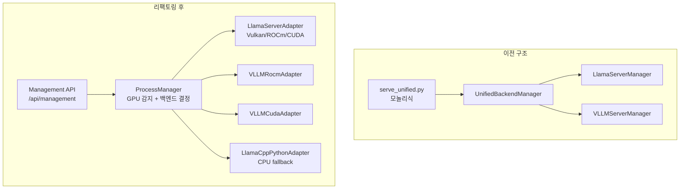

# vLLM vs llama.cpp: 백엔드 스위칭 아키텍처 설계

LLM 서빙 서버를 운영하다 보면 한 가지 백엔드로는 부족한 상황이 생긴다. GGUF 모델은 llama.cpp가 유리하고, HuggingFace 모델은 vLLM이 낫다. 임베딩 모델과 LLM을 동시에 서빙해야 할 때는 아예 다른 서버가 필요하다. XGEN 모델 서버가 이 문제를 어떻게 풀었는지, 그리고 그 과정에서 아키텍처가 어떻게 진화했는지를 기록한다.

## 처음 구조: 단일 백엔드

초기 xgen-model은 단순했다. llama.cpp 하나만 쓰고, FastAPI로 감싸는 구조였다. `llama-cpp-python`을 인-프로세스로 로드해서 추론하고, 결과를 OpenAI 포맷으로 변환해 내보내는 방식이다.

이게 잘 동작하는 동안은 문제없었다. 문제는 모델 종류가 늘어나면서 생겼다.

- 운영 팀에서 HuggingFace BF16 모델을 요구
- 임베딩 서버를 LLM 서버와 분리 요청
- AMD GPU(Strix Halo)에서 ROCm 크래시로 Vulkan 전환 필요

한 서버에서 이 모든 걸 처리해야 했다.

## 중간 진화: UnifiedBackendManager

첫 번째 해법은 `UnifiedBackendManager`였다. 런타임에 백엔드를 전환하는 단일 서버다.

```
# 커밋: llama-server와 vLLM 백엔드 런타임 전환 지원
# 날짜: 2026-01-22 00:24
```



핵심 아이디어는 포트 8000의 FastAPI가 프록시 역할을 하고, 실제 추론은 포트 8001의 백엔드(llama-server 또는 vllm)가 담당하는 것이다. 백엔드 전환은 8001 포트의 프로세스를 죽이고 다른 프로세스를 올리는 방식이다.

### SwitchBackendRequest

```python
class SwitchBackendRequest(BaseModel):
    """백엔드 전환 요청"""
    backend: str = Field(..., description="llama-cpp 또는 vllm")
    model_name: str = Field(..., description="모델 이름 (HF ID 또는 표시용)")
    model_path: Optional[str] = Field(None, description="GGUF 파일 경로")

    # llama-cpp 옵션
    n_gpu_layers: int = Field(-1, description="GPU 레이어 수 (-1: 전체)")
    n_ctx: int = Field(8192, description="Context 크기")
    n_batch: int = Field(512, description="배치 크기")

    # vLLM 옵션
    gpu_memory_utilization: float = Field(0.9, description="GPU 메모리 사용률")
    max_model_len: Optional[int] = Field(None, description="최대 컨텍스트 길이")
    tensor_parallel_size: int = Field(1, description="텐서 병렬화 크기")

    # 모델 타입 (나중에 추가)
    model_type: str = Field("llm", description="llm 또는 embedding")
```

`model_type` 필드는 나중에 추가됐다. 처음엔 LLM만 상정했다가, 임베딩 모드가 필요해지면서 확장됐다.

```
# 커밋: xgen-model: switch-backend에 model_type 파라미터 추가 (embedding 모드 지원)
# 날짜: 2026-01-30 05:56
```

```python
# switch_backend 핸들러에서 model_type 처리
if request.backend == "llama-cpp":
    await manager.switch_to_llamacpp(
        model_path=request.model_path,
        n_gpu_layers=request.n_gpu_layers,
        embedding=(request.model_type == "embedding"),  # 추가된 부분
    )
elif request.backend == "vllm":
    await manager.switch_to_vllm(
        model_name=request.model_name,
        gpu_memory_utilization=request.gpu_memory_utilization,
    )
```

### Dockerfile.unified: 멀티 GPU 빌드

UnifiedBackendManager와 함께 단일 Dockerfile로 NVIDIA/AMD/CPU를 모두 지원하는 시도도 있었다.

```dockerfile
ARG GPU_TYPE=nvidia

FROM nvidia/cuda:12.1.0-devel-ubuntu22.04 AS base-nvidia
FROM rocm/dev-ubuntu-24.04:6.3-complete AS base-amd
FROM python:3.11-slim AS base-cpu

# ARG로 베이스 이미지 선택
FROM base-${GPU_TYPE} AS base
```

빌드 시 `--build-arg GPU_TYPE=amd` 식으로 지정하면 해당 환경용 이미지가 만들어지는 구조다. 하지만 이 접근은 유지보수 문제로 결국 `Dockerfile.amd`, `Dockerfile.nvidia`로 분리됐다.

```
# 커밋: Dockerfile.unified 삭제 - GPU별 이미지 분리 유지
# 날짜: 2026-01-22 01:02
```

유니파이드 Dockerfile은 복잡한 multi-stage build를 요구하고, 각 GPU 환경별 설정이 달라서 하나의 파일로 관리하기 어려웠다. 분리하는 게 오히려 명확했다.

## entrypoint의 GPU 자동 감지

런타임에 어떤 백엔드를 기본으로 쓸지 결정하는 로직은 entrypoint 셸 스크립트에도 있었다.

```bash
# GPU Detection
GPU_TYPE="cpu"

# NVIDIA 확인
if command -v nvidia-smi &> /dev/null; then
    if nvidia-smi &> /dev/null; then
        GPU_TYPE="nvidia"
        echo "NVIDIA GPU detected"
    fi
fi

# AMD 확인
if command -v rocm-smi &> /dev/null; then
    if rocm-smi &> /dev/null; then
        GPU_TYPE="amd"
        echo "AMD GPU detected"
    fi
fi
```

Python의 `UnifiedGPUDetector`와 비슷한 역할을 셸에서도 했다. 이 중복이 나중에 정리 대상이 됐다.

## 최종 구조: ProcessManager + Adapter 패턴

리팩토링 이후 아키텍처는 완전히 달라졌다.

```
# 커밋: 프로젝트 구조 리팩토링 - backend 패키지로 정리
# 날짜: 2026-01-22 01:40
```



핵심 변화는 세 가지다.

**1. 어댑터 패턴으로 백엔드 추상화**

각 백엔드가 `BackendProtocol`을 따르는 독립 어댑터가 됐다. `LlamaServerAdapter`는 Vulkan/ROCm/CUDA 바이너리를 모두 처리하고, `VLLMRocmAdapter`와 `VLLMCudaAdapter`는 공통 `VLLMBaseAdapter`를 상속받는다.

```python
class BackendProtocol(Protocol):
    async def load_model(self, request: ModelLoadRequest) -> dict: ...
    async def health_check(self) -> bool: ...
    async def get_status(self) -> dict: ...
    @property
    def backend_type(self) -> str: ...
    @property
    def is_model_loaded(self) -> bool: ...
```

**2. 런타임 백엔드 선택이 ProcessManager로 집중**

```python
def _select_backend(self, model_path: str, server_type: str = "llm") -> str:
    path = Path(model_path)

    # 파일 확장자 기반 자동 선택
    if path.suffix.lower() == ".gguf":
        for backend in ["llama-server-vulkan", "llama-server-cuda",
                         "llama-server-rocm", "llama-cpp-python"]:
            if backend in self._available_backends:
                return backend

    # HuggingFace 모델 ID (org/model 형식)
    if "/" in model_path and not path.exists():
        for backend in ["vllm-cuda", "vllm-rocm"]:
            if backend in self._available_backends:
                return backend

    return self._available_backends[0]
```

`switch-backend` API가 없어지고 `load_model` API 하나로 통합됐다. 클라이언트가 모델 경로만 넘기면 서버가 알아서 백엔드를 선택한다.

**3. 멀티 모델 동시 서빙**

이전 구조는 단일 포트(8001)에 한 번에 하나의 백엔드만 올릴 수 있었다. 리팩토링 후는 포트 범위(8001~8020)에서 여러 모델을 동시에 서빙한다.

```python
# LLM: localhost:8001/v1
# 임베딩: localhost:8002/v1
# 다른 LLM: localhost:8003/v1
```

## vLLM vs llama-server 선택 기준 정리

두 백엔드를 모두 운영하면서 정리된 선택 기준이다.

| 기준 | vLLM | llama-server |
|------|------|-------------|
| 모델 포맷 | HuggingFace (safetensors, BF16) | GGUF (양자화) |
| AMD GPU | ROCm, gfx1151+ 공식 지원 | Vulkan (모든 AMD GPU) |
| NVIDIA GPU | CUDA, 안정적 | CUDA 빌드 필요 |
| 처리량 | PagedAttention으로 높음 | Continuous batching |
| 메모리 | 전체 모델 메모리 필요 | 양자화로 메모리 절약 |
| Tool calling | enable_auto_tool_choice 필요 | --jinja 플래그 |
| 임베딩 | 별도 서버 구성 복잡 | --embedding 플래그 |

llama-server의 `--embedding` 플래그는 같은 바이너리로 임베딩 모드를 켤 수 있어서 편리하다.

```python
# LLM 모드
elif request.server_type == "embedding":
    cmd.append("--embedding")
    if request.pooling:
        cmd.extend(["--pooling", request.pooling])
```

실제로 Qwen3-Embedding을 GGUF로 변환해서 llama-server로 서빙했는데, 설정 하나만 바꾸면 됐다.

## OpenAI 호환 API 레이어

두 백엔드 모두 `/v1/chat/completions`, `/v1/completions`, `/v1/embeddings` 엔드포인트를 OpenAI 포맷으로 제공한다. 이게 핵심 설계 결정이었다.

```
# 커밋: OpenAI 호환 API 엔드포인트 추가 (/api/vllm/v1/chat/completions, /v1/completions, /v1/models)
# 날짜: 2026-01-25 20:32
```

클라이언트(xgen-workflow, xgen-core)는 백엔드가 뭔지 신경 쓸 필요 없이 `base_url`만 바꾸면 된다.

```python
# xgen-workflow에서 LLM 호출
from langchain_openai import ChatOpenAI

llm = ChatOpenAI(
    base_url="http://xgen-model:8000/v1",  # 백엔드 무관
    model="Qwen3-8B",
    api_key="none",
)
```

`load_model()` 응답의 `endpoint`가 곧 `base_url`이다. 어떤 백엔드가 뒤에 있든 동일한 API 인터페이스를 노출한다.

## 싱글턴 문제와 해결

리팩토링 과정에서 ModelFactory 싱글턴 문제가 있었다.

```
# 커밋: lifecycle: ModelFactory 싱글톤 문제 해결 (직접 backend 인스턴스 생성)
# 날짜: 2026-01-26 00:53
```

처음엔 `ModelFactory.create(backend_type)` 식의 팩토리 클래스를 만들었는데, 싱글턴으로 구현된 탓에 테스트에서 상태가 공유되는 문제가 생겼다. ProcessManager에서 직접 어댑터 인스턴스를 생성하는 방식으로 바꿨다.

```python
# 변경 전: 싱글턴 팩토리 (문제)
adapter = ModelFactory.get_instance().create(backend_type, port)

# 변경 후: 직접 생성 (정상)
def _create_adapter(self, backend_type: str, port: int) -> Any:
    match backend_type:
        case "vllm-rocm":
            from backend.adapters.vllm_rocm import VLLMRocmAdapter
            return VLLMRocmAdapter(port=port)
        case "llama-server-vulkan":
            from backend.adapters.llama_server import LlamaServerAdapter
            return LlamaServerAdapter(binary_path=binary, port=port)
```

지연 임포트(`from backend.adapters.xxx import Xxx`)를 쓴 이유도 있다. vLLM이 설치 안 된 환경에서 `import vllm`이 실패하면 서버 자체가 뜨지 않는다. 실제로 어댑터를 생성하는 시점에만 임포트하면 선택적 의존성을 처리할 수 있다.

## API prefix 변경 이력

API 경로도 여러 번 바뀌었다.

```
# 커밋: API prefix 변경: /api/vllm -> /api/inference
# 날짜: 2026-01-26 14:29

# 커밋: API prefix 제거 (backend-gateway 통합용)
# 날짜: 2026-01-20 05:47

# 커밋: API prefix에 /api 추가 (gateway 라우팅 통합)
# 날짜: 2026-01-25 14:25
```

xgen-backend-gateway가 `/api/model/*` 경로로 모델 서버로 라우팅하는데, 이 경로가 여러 번 바뀌면서 모델 서버 API prefix도 함께 바뀌었다. 게이트웨이와 모델 서버가 강하게 결합되어 있다는 증거였다.

최종 구조에서는 게이트웨이가 `/api/management/*`로 management API에, `/v1/*`로 추론 API에 직접 접근하는 형태로 정착했다.

## 회고

switch-backend에서 ProcessManager + Adapter로의 진화는 필요한 과정이었다. 단일 백엔드에서 멀티 백엔드로, 단일 모델에서 멀티 모델 동시 서빙으로 요구사항이 변했고, 그때마다 구조가 따라갔다.

가장 좋은 결정은 OpenAI 호환 API를 고수한 것이었다. 백엔드가 바뀌어도, vLLM에서 llama-server로 전환해도, 클라이언트 코드는 전혀 바꿀 필요가 없었다. `/v1/chat/completions`라는 인터페이스 하나가 모든 변화를 흡수했다.

반면 아쉬운 점은 초기에 어댑터 패턴을 설계하지 않고 직접 프로세스 관리 코드를 여러 곳에 뒀던 것이다. 리팩토링 비용이 적지 않았다. 처음부터 `BackendProtocol`과 어댑터 구조를 잡았으면 훨씬 빨리 안정화됐을 것이다.
