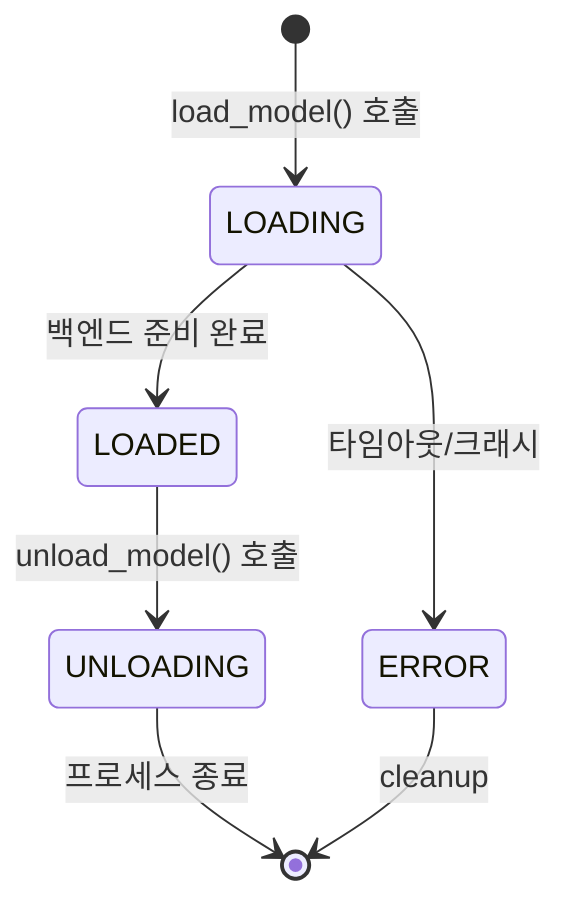

# 로컬 LLM 모델 관리 시스템: 로드/언로드/활성화 라이프사이클

LLM 서빙 서버에서 모델 관리는 단순히 올리고 내리는 게 전부가 아니다. 모델이 로딩 중인지, 로드됐는지, 에러가 났는지를 클라이언트가 알 수 있어야 한다. 여러 모델이 동시에 올라가면 어느 것이 활성 상태인지도 관리해야 한다. XGEN 모델 서버의 모델 라이프사이클 구현을 정리한다.

## 모델 상태 정의

```python
class ModelState(StrEnum):
    """모델 런타임 상태"""
    LOADING = "loading"    # 로드 중
    LOADED = "loaded"      # 로드 완료, 서빙 가능
    ERROR = "error"        # 로드 실패
    UNLOADING = "unloading"  # 언로드 중
```

상태 전이:



## ModelInfo: 모델 런타임 정보

```python
@dataclass(slots=True)
class ModelInfo:
    """로드된 모델 정보"""
    adapter: Any          # BackendProtocol 구현체
    model_name: str
    model_path: str
    backend_type: str
    port: int
    server_type: str = "llm"
    started_at: float = field(default_factory=time.time)
    state: ModelState = ModelState.LOADING
    error_message: str | None = None

    @property
    def endpoint(self) -> str:
        return f"http://localhost:{self.port}/v1"

    @property
    def is_running(self) -> bool:
        return self.adapter.is_model_loaded
```

`dataclass(slots=True)`를 써서 속성 접근을 최적화했다. 모델 정보는 `_models: dict[str, ModelInfo]`로 이름 기반으로 관리된다.

## 로드 흐름

```python
async def load_model(self, request: ModelLoadRequest, backend_type=None):
    model_name = request.model_name or request.model_path.split("/")[-1]

    # 1. 이미 로드된 모델 확인
    if model_name in self._models:
        info = self._models[model_name]
        if info.is_running:
            return {"status": "already_loaded", "endpoint": info.endpoint}
        else:
            # 어댑터가 죽어있으면 재로드
            await self._close_adapter(model_name)

    # 2. 백엔드 결정 & 포트 할당
    backend_type = backend_type or self._select_backend(request.model_path)
    port = self._get_available_port()

    # 3. 어댑터 생성 & 초기화
    adapter = self._create_adapter(backend_type, port)
    await adapter.__aenter__()

    # 4. LOADING 상태로 등록
    info = ModelInfo(
        adapter=adapter,
        model_name=model_name,
        model_path=request.model_path,
        backend_type=backend_type,
        port=port,
        state=ModelState.LOADING,
    )
    self._models[model_name] = info

    try:
        # 5. 실제 모델 로드 (블로킹, 최대 120초)
        await adapter.load_model(request)
        info.state = ModelState.LOADED  # → LOADED
        return {"status": "success", "endpoint": info.endpoint}
    except Exception as e:
        info.state = ModelState.ERROR
        info.error_message = str(e)
        await adapter.__aexit__(...)
        del self._models[model_name]
        raise
```

`await adapter.load_model(request)` 한 줄이 실제로는 외부 프로세스(llama-server/vLLM)를 띄우고 HTTP health check가 통과할 때까지 기다리는 블로킹 작업이다. llama-server는 최대 120초, vLLM은 300초 타임아웃을 적용했다.

## 자동 활성화

```
# 커밋: lifecycle: 모델 로드 시 자동 활성화 기능 추가
# 날짜: 2026-01-26 15:53

# 커밋: main.py: 모델 로드 후 자동 활성화 기능 추가
# 날짜: 2026-01-26 15:26
```

초기에는 모델을 로드한 후 별도로 "활성화" API를 호출해야 했다. 사용자 불편이 있어서 로드 완료 시 자동 활성화하도록 바꿨다.

```python
# lifecycle.py: 모델 로드 완료 후 자동 활성화
async def on_model_loaded(model_name: str, endpoint: str):
    """모델 로드 완료 시 자동으로 활성 모델로 설정"""
    await set_active_model(model_name, endpoint)
    logger.info(f"Auto-activated model: {model_name} at {endpoint}")
```

배경 태스크로 처리하는 방식도 고려했다가, 로드 완료 즉시 동기적으로 활성화하는 게 더 예측 가능해서 택했다.

```
# 커밋: main.py: 백그라운드 태스크 제거 (lifecycle에서 자동 활성화 처리)
# 날짜: 2026-01-26 15:53
```

## switch_active_model: 활성 모델 전환

```
# 커밋: switch_active_model이 LOADED 또는 ACTIVE 상태 모두 허용하도록 수정
# 날짜: 2026-01-25 21:05
```

여러 모델이 동시에 로드돼 있을 때, 어떤 모델이 기본 `/v1/chat/completions` 요청을 받을지 선택하는 기능이다.

```python
async def switch_active_model(model_name: str):
    """활성 모델 전환

    LOADED 또는 ACTIVE 상태 모두 허용.
    """
    if model_name not in self._models:
        raise ValueError(f"Model '{model_name}' not loaded")

    info = self._models[model_name]
    # LOADED 상태도 허용 (초기에는 ACTIVE만 허용해서 에러 발생)
    if info.state not in (ModelState.LOADED, ModelState.ACTIVE):
        raise ValueError(f"Model '{model_name}' is not ready: {info.state}")

    self._active_model = model_name
    logger.info(f"Active model switched to: {model_name}")
```

처음에는 `ACTIVE` 상태인 모델만 전환 가능했는데, `LOADED` 상태에서도 허용하도록 완화했다. 자동 활성화 로직이 아직 안 붙었을 때 모델이 영원히 `LOADED`에 머무르는 문제가 있었기 때문이다.

## loading_status API

```
# 커밋: loading_status API에 backend 정보 추가
# 날짜: 2026-01-25 21:51

# 커밋: loading_status API에 model_id 추가
# 날짜: 2026-01-25 21:48

# 커밋: loading_status API에 llamacpp/vLLM 배포 설정 정보 추가 (n_ctx, n_gpu_layers, device 등)
# 날짜: 2026-02-01 02:26
```

프론트엔드가 모델 로딩 진행상황을 폴링하는 API다.

```json
GET /api/management/status

{
  "status": "ready",
  "gpu_info": {"gpu_type": "amd_rdna", "count": 1},
  "available_backends": ["llama-server-vulkan", "llama-server-rocm"],
  "loaded_models": {
    "Qwen3-8B": {
      "model_path": "/app/models/Qwen3-8B.Q4_K_M.gguf",
      "backend_type": "llama-server-vulkan",
      "port": 8001,
      "endpoint": "http://localhost:8001/v1",
      "state": "loaded",
      "started_at": 1738310400.0,
      "config": {
        "n_ctx": 8192,
        "n_gpu_layers": 99,
        "device": "vulkan"
      }
    }
  }
}
```

`state` 필드가 `loading`이면 프론트엔드는 "로딩 중" UI를 표시하고, `loaded`가 되면 "사용 가능" 상태로 바꾼다.

## 언로드 흐름

```python
async def unload_model(self, model_name: str):
    if model_name not in self._models:
        raise ValueError(f"Model '{model_name}' not loaded")

    info = self._models[model_name]
    info.state = ModelState.UNLOADING  # → UNLOADING

    # 어댑터 종료 (프로세스 kill)
    await self._close_adapter(model_name)
    # _close_adapter에서 self._models에서 제거됨
```

어댑터 종료는 `terminate()` → 30초 대기 → `kill()` 순서다. 정상 종료가 실패하면 강제 종료한다.

## 병렬 정리: TaskGroup

서버가 종료될 때 모든 모델을 한 번에 언로드한다.

```python
async def __aexit__(self, exc_type, exc_val, exc_tb):
    model_names = list(self._models.keys())
    if model_names:
        async with asyncio.TaskGroup() as tg:
            for model_name in model_names:
                tg.create_task(self._close_adapter(model_name))
```

`asyncio.TaskGroup`(Python 3.11+)으로 모든 어댑터를 병렬로 종료한다. 모델이 여러 개 올라가 있어도 동시에 정리되므로 서버 종료 시간이 단축된다.

## GGUF 파일명 자동 감지

```
# 커밋: GGUF 파일명 자동 감지 기능 추가
# 날짜: 2026-01-25 23:50
```

모델 폴더에 GGUF 파일이 여러 개 있을 때(예: Q4, Q8, BF16 양자화 파일이 혼재), 자동으로 찾아주는 기능이다.

```python
def _find_gguf_file(self, model_dir: str) -> str | None:
    """모델 디렉토리에서 GGUF 파일 자동 탐색"""
    model_path = Path(model_dir)
    if model_path.is_file() and model_path.suffix == ".gguf":
        return str(model_path)

    if model_path.is_dir():
        gguf_files = list(model_path.glob("*.gguf"))
        if gguf_files:
            # 알파벳순으로 첫 번째 (보통 Q4_K_M 같은 표준 양자화)
            return str(sorted(gguf_files)[0])

    return None
```

## 회고

모델 라이프사이클 관리에서 가장 중요한 것은 상태를 명확하게 정의하는 것이었다. `LOADING → LOADED → UNLOADING` 전이가 명확해야 클라이언트가 신뢰할 수 있는 폴링을 할 수 있고, 에러 상황에서도 깔끔하게 정리된다.

초기에 상태 관리 없이 `is_running` bool 하나로 처리했더니 "로딩 중인지, 실패했는지, 완료됐는지"를 클라이언트가 구분할 수 없었다. `ModelState` enum 도입 후 이 문제가 해결됐다.
