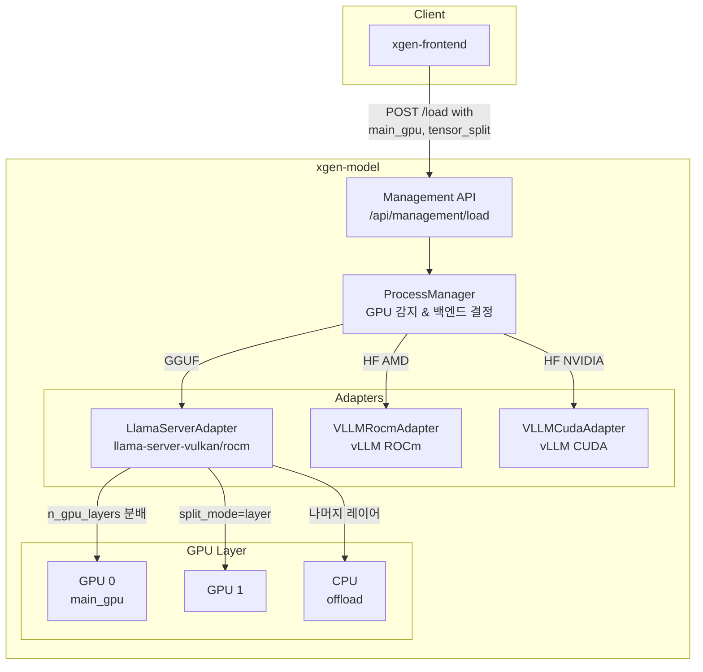

# 멀티 GPU LLM 배포: GPU 선택 및 레이어 오프로딩 전략

로컬에서 LLM을 서빙할 때 GPU가 하나인 경우는 간단하다. 문제는 GPU가 여러 개이거나, 모델이 GPU 메모리보다 클 때다. XGEN 모델 서버는 AMD/NVIDIA GPU 모두에서 멀티 GPU 배포를 지원하도록 설계됐다. 이 글은 그 구현 내부를 들여다본다.

## 배경: 왜 멀티 GPU가 필요한가

Strix Halo(gfx1151) 환경에서 처음 맞닥뜨린 문제는 단일 GPU 메모리 한계였다. iGPU이기 때문에 메인 메모리를 공유해서 쓰는데, 시스템 RAM 전체가 GPU VRAM으로 잡히지 않는다. 큰 모델(70B 이상)을 올리려면 CPU offload가 필수다.

데이터센터 환경에서는 다른 이유로 멀티 GPU가 필요하다. A100 80GB 2장에 70B 모델을 올리거나, H100 8장에 405B 모델을 분산 배포하는 식이다. 두 상황 모두 같은 메커니즘을 활용한다.

```
# 커밋: managementController.py: GPU 목록 조회 API 및 모델 로드 시 GPU 설정 지원
# 날짜: 2026-01-31 15:13

# 커밋: llama_server.py: GPU 선택 및 멀티 GPU 지원 추가
# 날짜: 2026-01-31 15:13
```

## 아키텍처 개요



## ModelLoadRequest: 멀티 GPU 파라미터

멀티 GPU 관련 설정은 `ModelLoadRequest`에 집중되어 있다.

```python
class ModelLoadRequest(BaseModel):
    # llama-server 전용: GPU 선택
    main_gpu: int = Field(
        default=0,
        description="메인 GPU 인덱스 (멀티 GPU용)"
    )
    split_mode: str = Field(
        default="layer",
        description="멀티 GPU 분할 모드: none | layer | row"
    )
    tensor_split: list[float] = Field(
        default_factory=list,
        description="GPU별 메모리 분배 비율 (멀티 GPU용)"
    )
    n_gpu_layers: int = Field(
        default=-1,
        description="GPU에 로드할 레이어 수 (-1: 모두)"
    )

    # vLLM 전용: 병렬 처리
    tensor_parallel_size: int = Field(
        default=1,
        ge=1,
        description="텐서 병렬 처리 크기 (멀티 GPU용)"
    )
    pipeline_parallel_size: int = Field(
        default=1,
        ge=1,
        description="파이프라인 병렬 처리 크기"
    )
```

llama-server와 vLLM의 멀티 GPU 접근 방식이 다르다. llama-server는 레이어 단위 분배고, vLLM은 텐서 병렬화다.

## llama-server: 레이어 오프로딩

### n_gpu_layers: 핵심 파라미터

`n_gpu_layers`는 모델의 트랜스포머 레이어 중 GPU에 올릴 개수다.

- `-1` (기본값): 모든 레이어를 GPU에 올림
- `0`: GPU 사용 안 함, 전부 CPU
- `20`: 앞 20개 레이어는 GPU, 나머지는 CPU

Strix Halo 환경에서 큰 모델을 돌릴 때 이 값을 조정해서 GPU/CPU 분배를 결정했다.

```
# 커밋: fix: LLM은 GPU 20레이어만 사용 (CPU offload), Embedding은 전체 GPU
# 날짜: 2026-01-31 12:48
```

당시 실험 당시 LLM에 GPU 레이어를 너무 많이 할당하면 임베딩 모델이 GPU 메모리 부족으로 실패했다. 20레이어만 GPU에 올리고 나머지를 CPU로 처리하면서 안정화했다(이후 임베딩은 아예 CPU 전용으로 전환).

### split_mode: 멀티 GPU 분배 방식

GPU가 2개 이상일 때 레이어를 어떻게 나눌지 결정한다.

| 모드 | 설명 | 적합한 상황 |
|------|------|-------------|
| `none` | 멀티 GPU 비활성화 | 단일 GPU |
| `layer` | 레이어 단위 분배 | 기본값, 대부분의 경우 |
| `row` | 행 단위 분배 | 특수한 경우 |

`layer` 모드가 기본값이다. GPU 0에 레이어 0~N을, GPU 1에 레이어 N+1~M을 할당한다.

### tensor_split: GPU별 메모리 비율

```python
tensor_split: list[float] = Field(
    default_factory=list,
    description="GPU별 메모리 분배 비율 (멀티 GPU용)"
)
```

GPU들의 메모리 용량이 다를 때 이 값으로 비율을 지정한다. `[3.0, 1.0]`이면 GPU 0에 75%, GPU 1에 25%를 할당한다. 빈 리스트면 llama-server가 GPU 메모리 용량 기반으로 자동 분배한다.

### main_gpu: 기준 GPU 설정

```python
main_gpu: int = Field(
    default=0,
    description="메인 GPU 인덱스 (멀티 GPU용)"
)
```

KV 캐시와 임시 텐서의 기준이 되는 GPU다. 보통 메모리가 큰 GPU를 main_gpu로 지정한다.

### 명령어 조합 예시

```python
def _build_command(self, request: ModelLoadRequest) -> list[str]:
    cmd = [
        self._binary_path,
        "--model", request.model_path,
        "--n-gpu-layers", str(request.n_gpu_layers),
    ]

    # 메인 GPU 지정
    if request.main_gpu >= 0:
        cmd.extend(["--main-gpu", str(request.main_gpu)])

    # 멀티 GPU 분할 모드
    if request.split_mode and request.split_mode != "none":
        cmd.extend(["--split-mode", request.split_mode])

    # GPU별 메모리 비율
    if request.tensor_split:
        tensor_split_str = ",".join(str(t) for t in request.tensor_split)
        cmd.extend(["--tensor-split", tensor_split_str])

    return cmd
```

실제 실행 명령어 예시:

```bash
# 단일 GPU, 전체 레이어 GPU 오프로딩
llama-server-vulkan \
  --model /app/models/Qwen3-8B.Q4_K_M.gguf \
  --n-gpu-layers 99 \
  --main-gpu 0

# 멀티 GPU, 레이어 분배
llama-server-vulkan \
  --model /app/models/llama-70b.Q4_K_M.gguf \
  --n-gpu-layers 80 \
  --main-gpu 0 \
  --split-mode layer \
  --tensor-split 3.0,1.0

# CPU 오프로딩 (GPU 메모리 부족 시)
llama-server-vulkan \
  --model /app/models/llama-70b.Q4_K_M.gguf \
  --n-gpu-layers 20 \
  --main-gpu 0 \
  --mlock
```

## vLLM: 텐서 병렬화

vLLM은 llama-server와 달리 텐서 병렬화(Tensor Parallelism)를 사용한다.

```python
def _build_command(self, request: ModelLoadRequest) -> list[str]:
    cmd = [
        "vllm", "serve",
        request.model_path,
        "--tensor-parallel-size", str(request.tensor_parallel_size),
        "--pipeline-parallel-size", str(request.pipeline_parallel_size),
        "--gpu-memory-utilization", str(request.gpu_memory_utilization),
    ]
    return cmd
```

- **tensor_parallel_size**: 각 레이어의 가중치를 N개 GPU에 나눠서 올림. 추론 시 GPU 간 통신 발생
- **pipeline_parallel_size**: 레이어를 그룹으로 나눠 GPU별로 할당. 레이어 단위 분배

4 GPU 환경에서 70B 모델을 배포하는 경우:

```python
ModelLoadRequest(
    model_path="meta-llama/Llama-3.3-70B-Instruct",
    tensor_parallel_size=4,      # 4 GPU에 텐서 분산
    gpu_memory_utilization=0.9,
    max_model_len=32768,
)
```

```bash
# 실제 실행 명령어
vllm serve meta-llama/Llama-3.3-70B-Instruct \
  --tensor-parallel-size 4 \
  --gpu-memory-utilization 0.9 \
  --max-model-len 32768 \
  --trust-remote-code
```

## ProcessManager: 자동 백엔드 선택

멀티 GPU 설정을 넘기기 전에, 어떤 백엔드에 넘길지 결정하는 로직이 있다.

```python
def _select_backend(self, model_path: str, server_type: str = "llm") -> str:
    path = Path(model_path)

    # GGUF 모델 → llama-server (Vulkan > CUDA > ROCm)
    if path.suffix.lower() == ".gguf" or "gguf" in model_path.lower():
        for backend in [
            "llama-server-vulkan",
            "llama-server-cuda",
            "llama-server-rocm",
            "llama-cpp-python",
        ]:
            if backend in self._available_backends:
                return backend

    # HuggingFace 모델 (org/model 형식) → vLLM
    if "/" in model_path and not path.exists():
        for backend in ["vllm-cuda", "vllm-rocm"]:
            if backend in self._available_backends:
                return backend

    # Fallback
    if self._available_backends:
        return self._available_backends[0]
```

경로가 `.gguf`면 llama-server로, `org/model` 형식이면 vLLM으로 간다. 이 결정이 내려진 후 `ModelLoadRequest` 전체가 해당 백엔드 어댑터로 전달된다.

## GPU 감지와 백엔드 결정 연동

`ProcessManager.__aenter__`에서 GPU 감지를 수행하고, 그 결과로 사용 가능한 백엔드 목록을 결정한다.

```python
def _determine_available_backends(self):
    gpu_type = self._gpu_info["gpu_type"]
    gfx_version = self._gpu_info.get("details", {}).get("gfx_version", "")

    backends = []

    match gpu_type:
        case "nvidia":
            backends.append("vllm-cuda")
            backends.append("llama-server-cuda")

        case "amd_rdna" | "amd_cdna":
            if self._is_vllm_rocm_supported(gfx_version):
                backends.append("vllm-rocm")
            backends.append("llama-server-vulkan")
            backends.append("llama-server-rocm")

        case "cpu":
            pass

    # CPU fallback은 항상 포함
    backends.append("llama-cpp-python")
    self._available_backends = backends
```

AMD GPU인데 gfx 버전이 vLLM 지원 목록에 없으면 vllm-rocm을 제외하고 Vulkan만 쓴다. 예를 들어 RX 6800(gfx1030)이라면 `vllm-rocm`은 빠지고 `llama-server-vulkan`부터 시작한다.

vLLM이 지원하는 AMD gfx 버전은 코드에 명시되어 있다.

```python
self._vllm_rocm_supported_gfx = set(vllm_rocm_supported_gfx or [
    "gfx1151", "gfx1100", "gfx1101", "gfx1102",
    "gfx90a", "gfx942",
])
```

## 포트 관리: 멀티 모델 동시 서빙

멀티 GPU를 활용하면 여러 모델을 동시에 올릴 수도 있다. ProcessManager는 포트 범위(8001~8020)에서 사용 가능한 포트를 자동 할당한다.

```python
_PORT_RANGE_START = 8001
_PORT_RANGE_END = 8020

def _get_available_port(self) -> int:
    used_ports = {info.port for info in self._models.values()}
    for port in range(self._port_range[0], self._port_range[1] + 1):
        if port not in used_ports:
            return port
    raise RuntimeError("No available ports in range")
```

LLM 하나는 8001, 임베딩 서버는 8002, 또 다른 LLM은 8003 이런 식으로 각각 독립 포트를 가진다. 클라이언트는 `load_model()` 응답의 `endpoint` 값으로 직접 추론 요청을 보낸다.

```python
# load_model 응답
{
    "status": "success",
    "model": "Qwen3-8B",
    "backend": "llama-server-vulkan",
    "port": 8001,
    "endpoint": "http://localhost:8001/v1"
}
```

## 실전에서 배운 것

### iGPU 환경의 레이어 오프로딩

Strix Halo는 iGPU라 GPU VRAM이 시스템 RAM에서 동적으로 할당된다. 이 환경에서 n_gpu_layers 설정이 생각보다 중요했다.

- 너무 많이 GPU에 올리면: 다른 프로세스가 쓸 메모리 부족
- 너무 적게 올리면: CPU 연산이 병목이 돼 추론 속도 급락

70B 모델 Q4_K_M 기준으로 약 40GB가 필요하고, 80개 레이어 중 40개만 GPU에 올리면 GPU/CPU 메모리를 균형있게 쓸 수 있었다. 정확한 수치는 모델과 quantization에 따라 다르므로 직접 실험해야 한다.

### 멀티 GPU에서 split_mode 선택

`layer` 모드가 기본값이고 대부분의 경우 잘 동작한다. `row` 모드는 일부 특수한 모델 아키텍처에서 쓴다고 문서화되어 있지만 실제로 써본 적은 없다. `layer`로 시작해서 문제가 생기면 바꾸는 게 낫다.

### vLLM tensor_parallel_size 제약

`tensor_parallel_size`는 모델의 attention head 수와 맞아야 한다. Llama 3.1 70B는 64개 attention head를 가지므로 tensor_parallel_size를 1, 2, 4, 8 중 하나로 설정해야 한다. 맞지 않으면 vLLM이 시작 시 에러를 낸다.

### 백엔드 교체는 바이너리 이름만 변경

llama-server-vulkan, llama-server-rocm, llama-server-cuda는 모두 같은 `LlamaServerAdapter`를 사용한다. 바이너리 경로만 다르다. 덕분에 GPU 환경이 바뀌어도 코드 변경 없이 `binary_path`만 수정하면 된다.

```python
case "llama-server-vulkan":
    from backend.adapters.llama_server import LlamaServerAdapter
    binary = self._binary_paths.get(
        "llama-server-vulkan", "/app/bin/llama-server-vulkan"
    )
    return LlamaServerAdapter(binary_path=binary, port=port)

case "llama-server-rocm":
    from backend.adapters.llama_server import LlamaServerAdapter
    binary = self._binary_paths.get(
        "llama-server-rocm", "/app/bin/llama-server-rocm"
    )
    return LlamaServerAdapter(binary_path=binary, port=port)
```

어댑터 팩토리 패턴으로 백엔드 전환 비용을 최소화했다.
