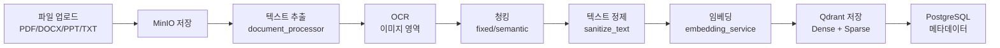

# 문서 임베딩 파이프라인: 청킹 옵션과 전처리 전략

RAG 시스템에서 검색 품질의 80%는 문서 처리 파이프라인에 달려 있다. 어떻게 청킹하느냐, 메타데이터를 어떻게 추출하느냐, 텍스트를 어떻게 정제하느냐가 결국 검색 결과를 결정한다. xgen-retrieval의 문서 처리 파이프라인을 정리한다.

## 파이프라인 개요



## 청킹 옵션

```
# 커밋: feat: Enhance document processing with advanced chunking options
# 날짜: 2025-12-29 45fa1df6

# 커밋: feat: Add force_chunking option for document upload and processing
# 날짜: 2025-12-23 da3b2caa
```

두 가지 청킹 모드를 지원한다.

**force_chunking**: 텍스트를 무조건 고정 크기로 나눈다.

```python
async def chunk_document(
    self,
    text: str,
    chunk_size: int = 512,
    overlap: int = 50,
    force_chunking: bool = False,
):
    if force_chunking:
        # 고정 크기 청킹 (의미 경계 무시)
        chunks = []
        for i in range(0, len(text), chunk_size - overlap):
            chunk = text[i:i + chunk_size]
            if chunk.strip():
                chunks.append(chunk)
        return chunks
    else:
        # 의미 기반 청킹 (문단, 문장 경계 존중)
        return await self._semantic_chunk(text, chunk_size)
```

**advanced chunking**: 문장 경계, 문단 경계, 마크다운 헤더 등을 인식해서 의미 단위로 나눈다. 처리 시간이 더 걸리지만 청크 품질이 좋다.

## 텍스트 정제: sanitize_text

임베딩 전에 텍스트를 정제한다. PostgreSQL과 Qdrant에서 문제가 되는 문자들을 제거한다.

```python
def sanitize_text(text: str) -> str:
    if not text:
        return text

    # 1. NUL 문자 제거 (PostgreSQL이 허용하지 않음)
    sanitized = text.replace('\x00', '')

    # 2. 제어 문자 제거 (개행/탭은 보존)
    sanitized = re.sub(r'[\x01-\x08\x0B-\x0C\x0E-\x1F]', '', sanitized)

    # 3. 잘못된 서로게이트 페어 제거
    sanitized = re.sub(r'[\ud800-\udfff]', '', sanitized)

    # 4. BOM 제거
    sanitized = sanitized.replace('\ufeff', '').replace('\ufffe', '')

    # 5. 비문자 코드 포인트 제거
    sanitized = re.sub(r'[\ufdd0-\ufdef\ufffe\uffff]', '', sanitized)

    # 6. 과도한 반복 정규화
    sanitized = re.sub(r'\n{10,}', '\n\n\n', sanitized)
    sanitized = re.sub(r'(.)\1{49,}', lambda m: m.group(1) * 10, sanitized)

    return sanitized
```

PDF에서 추출한 텍스트에는 생각보다 많은 이상 문자가 있다. NUL 문자는 PostgreSQL에 저장하면 에러가 나고, 서로게이트 페어는 일부 임베딩 모델에서 오류를 유발한다.

## 파일명 추출 우선순위

```python
def extract_file_name(
    file_path=None,
    minio_object_name=None,
    metadata=None,
    fallback="unknown_file"
) -> str:
    # 1. file_path에서 추출
    if file_path:
        return Path(file_path).name

    # 2. minio_object_name에서 추출 (collection/filename 형식)
    if minio_object_name:
        parts = minio_object_name.split('/')
        if len(parts) >= 2:
            return parts[-1]

    # 3. metadata에서 추출
    if metadata:
        for key in ['original_filename', 'file_name', 'filename']:
            if key in metadata and metadata[key]:
                return str(metadata[key])

    return fallback
```

MinIO에 저장된 파일명, 원본 업로드 파일명, 메타데이터 등 여러 소스에서 파일명을 추출한다. 우선순위 체인으로 안전하게 처리한다.

## OCR 처리

```
# 커밋: feat: Improve OCR processing with accurate image tag tracking and SSE event handling
# 날짜: 2025-12-23 cf862605

# 커밋: feat: Optimize OCR processing by performing it on full text before chunking
# 날짜: 2025-12-16 2b2459a8
```

PDF의 이미지 영역은 OCR로 텍스트를 추출한다. 처음에는 청킹 후 각 청크에 이미지가 있으면 OCR을 돌렸는데, 이미지가 청크 경계에 걸리면 누락되는 문제가 있었다. 청킹 전에 전체 문서 OCR을 먼저 수행하도록 변경했다.

```python
async def process_document_sse(self, file_path: str, session_id: str):
    """SSE 이벤트를 발행하면서 문서 처리"""

    # 1. 텍스트 추출
    await self.emit_event(session_id, "TEXT_EXTRACTION", "텍스트 추출 중...")
    raw_text = await self.extract_text(file_path)

    # 2. OCR (청킹 전에 전체 처리)
    await self.emit_event(session_id, "OCR", "이미지 OCR 처리 중...")
    text_with_ocr = await self.process_ocr(raw_text)

    # 3. 청킹
    await self.emit_event(session_id, "CHUNKING", "문서 청킹 중...")
    chunks = await self.chunk_document(text_with_ocr, force_chunking=False)

    # 4. 임베딩 (배치)
    await self.emit_event(session_id, "EMBEDDING", f"임베딩 생성 중... ({len(chunks)}개 청크)")
    embeddings = await self.embedding_client.embed_batch(chunks)

    # 5. 벡터DB 저장
    await self.emit_event(session_id, "VECTOR_STORAGE", "벡터DB 저장 중...")
    await self.store_to_qdrant(chunks, embeddings)
```

## PPT→PDF 변환

```
# 커밋: feat: Add PPT to PDF conversion on document upload and MinIO metadata support
# 날짜: 2025-12-19 846a587c
```

PowerPoint 파일은 직접 텍스트 추출이 불완전하다. LibreOffice로 PDF로 변환한 뒤 PDF 파이프라인을 통과시킨다.

```python
async def convert_ppt_to_pdf(self, ppt_path: str) -> str:
    """LibreOffice로 PPT → PDF 변환"""
    output_dir = Path(ppt_path).parent
    cmd = [
        "libreoffice", "--headless", "--convert-to", "pdf",
        "--outdir", str(output_dir), ppt_path
    ]
    process = await asyncio.create_subprocess_exec(
        *cmd,
        stdout=asyncio.subprocess.PIPE,
        stderr=asyncio.subprocess.PIPE,
    )
    await process.wait()
    pdf_path = str(output_dir / Path(ppt_path).stem) + ".pdf"
    return pdf_path
```

## extract_default_metadata

```
# 커밋: feat: Add extract_default_metadata option for document processing
# 날짜: 2025-12-18 6fca4a2e
```

LLM을 사용해서 문서의 제목, 요약, 키워드를 자동 추출하는 옵션이다.

```python
async def extract_metadata_with_llm(self, text: str) -> dict:
    """LLM으로 문서 메타데이터 자동 추출"""
    prompt = f"""다음 문서에서 메타데이터를 추출하세요.

문서:
{text[:2000]}

JSON 형식으로 반환:
{{
  "title": "문서 제목",
  "summary": "3문장 이내 요약",
  "keywords": ["키워드1", "키워드2", ...],
  "document_type": "보고서|논문|매뉴얼|계약서|기타"
}}"""

    response = await self.llm_client.chat(prompt)
    return json.loads(response)
```

이 옵션은 처리 시간이 길어지므로 기본값은 `False`다. 중요 문서에 한해 활성화한다.

## 임베딩 재시도 로직

```
# 커밋: feat: Enhance embedding generation with chunk retry logic and error handling
# 날짜: 2025-12-30 ff1229b1
```

임베딩 서버 과부하나 타임아웃 시 청크 단위로 재시도한다.

```python
async def embed_with_retry(self, chunks: List[str], max_retries: int = 3):
    embeddings = []
    failed_indices = []

    # 1차 배치 시도
    try:
        batch_result = await self.embedding_client.embed_batch(chunks)
        return batch_result
    except Exception:
        failed_indices = list(range(len(chunks)))

    # 실패한 청크 개별 재시도
    for idx in failed_indices:
        for attempt in range(max_retries):
            try:
                result = await self.embedding_client.embed_one(chunks[idx])
                embeddings[idx] = result
                break
            except Exception:
                if attempt == max_retries - 1:
                    embeddings[idx] = [0.0] * self.embedding_dim  # 零벡터
                await asyncio.sleep(2 ** attempt)

    return embeddings
```

배치 실패 시 개별 청크로 fallback하고, 그래도 실패하면 零벡터(zero vector)로 채운다. 검색에서 零벡터는 낮은 점수를 받으므로 큰 영향은 없다.

## 회고

문서 처리 파이프라인은 edge case가 많다. 깨진 PDF, 이미지만 있는 스캔 문서, 특수 문자가 가득한 기술 문서 등 예상 못한 형식이 계속 나왔다. `sanitize_text`의 규칙이 커밋마다 조금씩 추가된 것도 그 흔적이다.

가장 효과적이었던 최적화는 OCR을 청킹 전으로 옮긴 것이다. 청킹 후 OCR은 이미지가 청크 경계에 걸리는 문제가 있었고, 이미지 태그 검증 로직도 복잡해졌다. 청킹 전에 전체 문서 OCR을 처리하니 이 문제가 깔끔하게 해결됐다.
