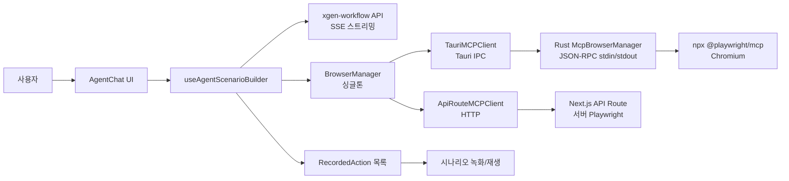
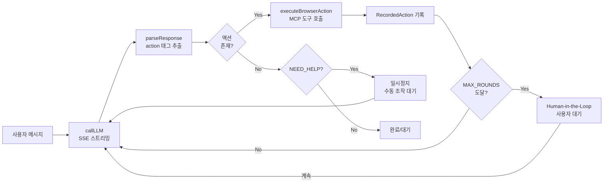

# AI Agent 기반 브라우저 자동화 시스템 구축기

## 배경과 문제 정의

사내 이커머스 플랫폼에서는 Nexacro, SAP 기반의 동적 ERP 시스템을 사용한다. 상품 등록, 주문 처리, 재고 관리 같은 반복 작업을 매일 수행하는데, 이런 작업을 자동화하려면 단순한 매크로로는 불가능하다. 동적 UI, 팝업, iframe, 검색 필드 등 복잡한 상호작용이 필요하기 때문이다.

기존 접근법의 한계는 명확했다:

- **Selenium/Puppeteer 스크립트**: UI가 바뀔 때마다 스크립트 전체를 수정해야 한다
- **RPA 도구**: 라이선스 비용이 크고, 복잡한 조건 분기 처리가 어렵다
- **단순 매크로**: 동적 렌더링, 비동기 로딩, 팝업 처리를 못 한다

해결 방향은 LLM이 사람처럼 화면을 "보고" 판단하며 조작하는 AI Agent였다. Playwright MCP(Model Context Protocol)가 브라우저의 접근성 트리를 텍스트로 노출해주므로, LLM이 스크린샷 없이도 페이지 구조를 이해하고 조작할 수 있다.

## 전체 아키텍처



시스템은 4개의 주요 계층으로 구성된다:

1. **Rust 백엔드** (Tauri): Playwright MCP 서브프로세스를 관리하고 JSON-RPC로 통신
2. **MCP 브라우저 추상화** (TypeScript): 환경에 따라 Tauri IPC 또는 HTTP API로 자동 전환
3. **Agent 시나리오 빌더** (React Hook): LLM과 대화하며 브라우저를 제어하는 에이전트 루프
4. **Agent 도구 생태계**: exec(1개), fs(6개), browser(9개) = 16개 도구를 보안 정책과 함께 제공

## Rust McpBrowserManager: JSON-RPC 통신 계층

Tauri 데스크톱 앱에서 Playwright MCP 서버를 서브프로세스로 스폰하고, stdin/stdout을 통한 JSON-RPC 2.0 프로토콜로 통신한다.

```rust
// src-tauri/src/services/mcp_browser_manager.rs
async fn send_tool_call(
    stdin: &mut tokio::process::ChildStdin,
    request_id_counter: &AtomicU64,
    pending: &Arc<Mutex<HashMap<u64, PendingRequest>>>,
    tool_name: &str,
    args: serde_json::Value,
) -> Result<serde_json::Value, String> {
    let request_id = request_id_counter.fetch_add(1, Ordering::SeqCst) + 1;
    let (tx, rx) = oneshot::channel();
    { pending.lock().await.insert(request_id, PendingRequest { sender: tx }); }

    let rpc_request = serde_json::json!({
        "jsonrpc": "2.0",
        "id": request_id,
        "method": "tools/call",
        "params": { "name": tool_name, "arguments": args }
    });

    let request_bytes = format!("{}\n", serde_json::to_string(&rpc_request).unwrap());
    stdin.write_all(request_bytes.as_bytes()).await
        .map_err(|e| format!("Failed to write: {}", e))?;
    stdin.flush().await.map_err(|e| format!("Flush failed: {}", e))?;

    // 60초 타임아웃으로 응답 대기
    match tokio::time::timeout(Duration::from_secs(60), rx).await {
        Ok(Ok(response)) => Ok(response),
        Ok(Err(_)) => Err("Channel closed".to_string()),
        Err(_) => Err("Timeout after 60s".to_string()),
    }
}
```

핵심 설계 포인트:

- **AtomicU64 request_id**: 동시 요청 시 응답을 올바르게 매칭하기 위한 단조 증가 ID
- **oneshot::channel**: 각 요청마다 전용 응답 채널을 생성하여 비동기 매칭
- **JSON-RPC 핸드셰이크**: 서브프로세스 시작 시 `initialize` 메서드로 capabilities 교환 후 `tools/call`로 도구 호출

### macOS 번들 앱의 npx 경로 문제

macOS GUI 앱은 shell 환경의 PATH를 상속받지 않는다. 터미널에서는 `npx`가 잘 동작하지만, Tauri 앱에서는 `npx: command not found`가 발생한다.

```rust
// 커밋: feat: Agent 데이터 자동화 + macOS 빌드 안정성 개선
// 날짜: 2026-02-11 08:30
fn resolve_npx_path() -> String {
    let candidates = vec![
        "/opt/homebrew/bin/npx",          // Homebrew (Apple Silicon)
        "/usr/local/bin/npx",             // Homebrew (Intel)
        // nvm: ~/.nvm/versions/node/*/bin/npx
        // fnm: ~/.local/share/fnm/node-versions/*/installation/bin/npx
        // Volta: ~/.volta/bin/npx
        // asdf: ~/.asdf/shims/npx
    ];
    for candidate in &candidates {
        if std::path::Path::new(candidate).exists() {
            return candidate.to_string();
        }
    }
    "npx".to_string() // fallback
}

fn build_enriched_path() -> String {
    // 기존 PATH에 주요 Node.js 매니저 경로를 추가
    let extra_paths = vec![
        "/opt/homebrew/bin", "/usr/local/bin",
        &format!("{}/.nvm/versions/node", home_dir),
        &format!("{}/.volta/bin", home_dir),
    ];
    format!("{}:{}", extra_paths.join(":"), current_path)
}
```

이 문제를 해결하지 않으면 macOS에서 빌드한 앱이 브라우저를 시작조차 못 한다. `resolve_npx_path`는 Homebrew, nvm, fnm, Volta, asdf 등 주요 Node.js 패키지 매니저의 설치 경로를 순차적으로 탐색한다.

## BrowserManager: 환경 자동 감지 싱글톤

브라우저 매니저는 실행 환경에 따라 적절한 MCP 클라이언트를 자동으로 선택하는 싱글톤이다.

```typescript
// patches/mcp/BrowserManager.ts
class BrowserManager {
    private client: IMCPClient | null = null;

    private async initClient(): Promise<IMCPClient> {
        if (isTauri()) {
            // Tauri 데스크톱 앱 → Rust 서브프로세스 통신
            const { TauriMCPClient } = await import('./clients/TauriMCPClient');
            return new TauriMCPClient();
        } else {
            // 웹 브라우저 → Next.js API Route 경유
            const { ApiRouteMCPClient } = await import('./clients/ApiRouteMCPClient');
            return new ApiRouteMCPClient();
        }
    }
}
```

이중 API를 제공한다:

- **Ref 기반 API** (Agent 모드): `browser_click`, `browser_type` 등 접근성 트리의 ref 번호로 요소 조작
- **CSS 셀렉터 기반 API** (녹화/재생 모드): `browser_run_code`로 Playwright 코드를 직접 실행

Playwright MCP의 `evaluate` 응답에는 `### Result`와 `### Ran Playwright code` 같은 메타데이터가 붙는데, 이를 자동으로 제거하는 파싱 로직이 포함되어 있다.

## IMCPClient 인터페이스: 17개 MCP 도구 정의

```typescript
// patches/mcp/interfaces/IMCPClient.ts
export interface IMCPClient {
    start(options?: MCPStartOptions): Promise<{success: boolean; error?: string}>;
    stop(): Promise<{success: boolean; error?: string}>;
    callTool(toolName: string, args: Record<string, any>): Promise<MCPToolResult>;
    getStatus(): Promise<BrowserState>;
    onStateChange(callback: (state: BrowserState) => void): () => void;
    isConnected(): Promise<boolean>;
}

export type MCPToolName =
    | 'browser_navigate' | 'browser_click' | 'browser_fill'
    | 'browser_type' | 'browser_select_option' | 'browser_press_key'
    | 'browser_hover' | 'browser_scroll' | 'browser_wait'
    | 'browser_take_screenshot' | 'browser_evaluate' | 'browser_run_code'
    | 'browser_snapshot' | 'browser_close' | 'browser_tabs'
    | 'browser_pdf_save' | 'browser_resize';
```

`MCPStartOptions`에는 headless 모드, viewport 크기, CDP 연결 모드(기존 브라우저에 연결) 등을 설정할 수 있다.

## Agent 도구 생태계

Agent는 브라우저 조작 외에도 파일 시스템과 셸 명령을 실행할 수 있다. 16개 도구를 3개 카테고리로 분류한다.

```typescript
// patches/agent/tools/ToolRegistry.ts
export const TOOL_DEFINITIONS: ToolDefinition[] = [
    // exec: 셸 명령 실행 (타임아웃 30초)
    { name: 'exec', category: 'exec', ... },

    // fs: 파일 시스템 CRUD
    { name: 'fs_read', category: 'fs', ... },
    { name: 'fs_write', category: 'fs', ... },
    { name: 'fs_list', category: 'fs', ... },
    { name: 'fs_exists', category: 'fs', ... },
    { name: 'fs_mkdir', category: 'fs', ... },
    { name: 'fs_delete', category: 'fs', ... },

    // browser: 브라우저 제어
    { name: 'browser_navigate', category: 'browser', ... },
    { name: 'browser_screenshot', category: 'browser', ... },
    { name: 'browser_click', category: 'browser', ... },
    { name: 'browser_type', category: 'browser', ... },
    { name: 'browser_evaluate', category: 'browser', ... },
    { name: 'browser_get_content', category: 'browser', ... },
    // ... 총 9개 브라우저 도구
];
```

### 보안 정책

Agent가 위험한 명령을 실행하지 못하도록 다중 보안 레이어를 적용했다.

```typescript
// patches/agent/tools/SecurityPolicy.ts
const BLOCKED_COMMAND_PATTERNS: RegExp[] = [
    /rm\s+(-[a-zA-Z]*f[a-zA-Z]*\s+)?\/($|\s)/,  // rm -rf /
    /mkfs/,
    /dd\s+if=.*of=\/dev\//,
    /:\(\)\{.*\|.*:\s*;\s*\}/,  // fork bomb
    /shutdown/, /reboot/,
];

const RESTRICTED_PATHS = [
    '/etc', '/usr', '/bin', '/sbin', '/boot',
    '/proc', '/sys', '/dev',
];

const BLOCKED_URL_SCHEMES = ['file://', 'chrome://', 'about:'];
```

셸 명령 차단(fork bomb, rm -rf 등), 파일 시스템 경로 제한(시스템 디렉토리 접근 차단), URL 스킴 제한(file:// 등)으로 3중 보안을 확보한다.

## Agent 시나리오 빌더: 핵심 에이전트 루프

2,200줄 규모의 `useAgentScenarioBuilder` 훅이 전체 에이전트 루프를 관리한다.



### LLM 호출과 응답 파싱

LLM에게 브라우저 상태를 전달하고, `<action>` 태그로 도구 호출 지시를 받는다.

```typescript
// patches/scenario-recorder/hooks/useAgentScenarioBuilder.ts
for (let round = 0; round < MAX_ROUNDS; round++, totalRounds++) {
    setCurrentRound(totalRounds + 1);

    // 1. LLM 호출 (xgen-workflow SSE 스트리밍)
    const llmResponse = await callLLM(conversationRef.current);

    // 2. <action> 태그 파싱
    const { text, actions: browserActions, parseErrors } = parseResponse(llmResponse);

    // 3. 액션 없이 텍스트만 → 완료 감지 또는 human-in-the-loop
    if (browserActions.length === 0) {
        if (text.includes(NEED_HELP_MARKER)) {
            const userResponse = await pauseForHuman('need_help');
            continue;
        }
        // 완료 보고 감지: "완료", "종료", "끝" 등
        const completionKeywords = /완료|종료|끝났|마무리|성공적으로/;
        if (completionKeywords.test(text)) break;
        continue;
    }

    // 4. 무한 루프 감지
    const toolSignature = browserActions.map(a =>
        `${a.tool}:${JSON.stringify(a.args)}`
    ).join('|');
    if (toolSignature === lastToolSignature && ++sameSignatureCount >= 2) {
        await pauseForHuman('stuck');
        continue;
    }

    // 5. 브라우저 액션 실행 → RecordedAction 기록
    for (const action of browserActions) {
        const result = await executeBrowserAction(action);
        if (result.recordedAction) {
            setActions(prev => [...prev, result.recordedAction]);
        }
    }
}
```

MAX_ROUNDS는 초기 8에서 15, 최종 50으로 증가시켰다. 복잡한 사이트에서는 단일 작업에도 수십 번의 상호작용이 필요하다.

### Ref에서 CSS 셀렉터로 자동 변환

Agent는 접근성 트리의 ref 번호로 요소를 조작하지만, 녹화된 시나리오를 재생하려면 CSS 셀렉터가 필요하다. 클릭/호버 액션 실행 전에 `browser_evaluate`로 DOM에서 실제 셀렉터를 추출한다.

```typescript
// 커밋: fix: Agent 모드 시나리오 셀렉터를 실제 CSS 셀렉터로 기록
// 날짜: 2026-02-09 01:57
const getCssSelectorByRef = async (ref: string, elementDesc: string) => {
    const result = await browserManager.callTool('browser_evaluate', {
        ref, element: elementDesc,
        function: `(el) => {
            // 우선순위: data-testid > id > aria-label > name > CSS path
            if (el.dataset.testid) return '[data-testid="' + el.dataset.testid + '"]';
            if (el.id) return '#' + CSS.escape(el.id);
            if (el.getAttribute('aria-label'))
                return '[aria-label="' + el.getAttribute('aria-label') + '"]';
            if (el.name) return '[name="' + el.name + '"]';
            // ... CSS path fallback
        }`
    });
    return { selector, alternatives };
};
```

클릭/호버는 액션 실행 전에 셀렉터를 추출한다. 페이지 이동 시 ref가 소실되기 때문이다.

## 시스템 프롬프트 설계

Agent의 행동을 제어하는 시스템 프롬프트는 Playwright MCP의 특성에 최적화했다.

```
당신은 브라우저 자동화 에이전트입니다. 반드시 <action> 태그로 브라우저를 직접 조작하세요.

## 작업 방식: Snapshot -> Ref -> 실행
1. snapshot으로 접근성 트리 확인 -> 각 요소에 ref 번호 부여됨 (예: [ref=e5])
2. ref 번호로 click, type 등 실행. CSS 셀렉터 직접 만들지 마세요.
3. 한 응답에 여러 <action> 가능 (순서대로 실행됨).

## 도구 목록
<action>{"tool": "snapshot"}</action> -- 전체 접근성 트리
<action>{"tool": "click", "ref": "e5"}</action> -- 클릭
<action>{"tool": "type", "ref": "e5", "text": "값"}</action> -- 입력
...
```

핵심 규칙:

- **snapshot 먼저**: 모든 작업의 시작은 접근성 트리 확인
- **ref 번호 사용**: CSS 셀렉터를 직접 만들지 않고 snapshot의 ref 번호만 사용
- **검색엔진 이동 금지**: 현재 페이지에서 바로 작업 시작
- **동적 UI 처리**: Nexacro/SAP의 iframe, 팝업, 트리 메뉴 대응 규칙

## 트러블슈팅 타임라인

### Playwright MCP evaluate 파라미터 변경

```
# 커밋: fix: browser_evaluate parameter (expression -> function)
# 날짜: 2026-02-08 04:01
```

Playwright MCP 0.0.64+ 버전에서 `expression` 파라미터가 `function`으로 변경되었다. 이전 코드가 모두 동작하지 않아 즉시 대응했다.

### evaluate 응답 메타데이터 문제

```
# 커밋: fix: strip Playwright MCP evaluate result prefix
# 날짜: 2026-02-08 04:11
```

`browser_evaluate` 호출 결과에 `### Result\n값\n### Ran Playwright code` 형태의 메타데이터가 붙어온다. 이를 파싱하지 않으면 JSON 파싱이 실패한다. BrowserManager에서 응답을 strip하는 로직을 추가했다.

### runCode vs evaluate 컨텍스트 불일치

```
# 커밋: fix: evaluate 단일 호출로 캡처 스크립트 주입 (runCode 컨텍스트 불일치 해결)
# 날짜: 2026-02-08 05:40
```

`browser_run_code`로 주입한 스크립트와 `browser_evaluate`로 읽는 데이터가 서로 다른 컨텍스트에서 실행되는 문제가 있었다. `evaluate` 단일 호출로 통일하여 해결했다.

### 페이지 네비게이션 생존

```
# 커밋: fix: survive full-page navigation, merge type actions, capture change events
# 날짜: 2026-02-08 14:17
```

전체 페이지 이동 시 주입한 캡처 스크립트가 사라지는 문제. 이벤트 폴링 방식으로 전환하여 네비게이션 후 자동으로 스크립트를 재주입한다.

### Agent의 검색엔진 탈출

```
# 커밋: fix: prevent agent from navigating to search engines - use current page
# 날짜: 2026-02-08 17:53
```

Agent가 지시받은 사이트 대신 Google로 이동해서 검색하는 문제가 빈번하게 발생했다. 시스템 프롬프트에 "현재 페이지에서 작업"이라는 명시적 규칙을 추가하고, 브라우저 상태 컨텍스트에 "검색 엔진으로 이동하지 마세요"라는 지시를 포함시켰다.

### CSS 셀렉터 기반 click의 ref 전용 전환

```
# 커밋: fix: click() uses run_code instead of browser_click, strip metadata in runCode
# 날짜: 2026-02-08 14:47
```

Playwright MCP의 `browser_click`이 ref 전용으로 변경되면서, CSS 셀렉터 기반 클릭은 `browser_run_code`로 Playwright 코드를 직접 실행하는 방식으로 전환했다. 녹화/재생 모드에서만 CSS 셀렉터를 사용하고, Agent 모드는 항상 ref를 사용한다.

## AppState와 Tauri 앱 구조

Rust 백엔드의 전체 상태는 `AppState` 구조체로 관리한다.

```rust
// src-tauri/src/state/app_state.rs
pub struct AppState {
    pub system_info: Arc<RwLock<Option<SystemInfo>>>,
    pub model_manager: Arc<RwLock<ModelManager>>,
    pub inference_engine: Arc<RwLock<InferenceEngine>>,    // mistral.rs
    pub mcp_config: Arc<RwLock<McpConfigManager>>,
    pub sidecar_manager: Arc<RwLock<SidecarManager>>,
    pub mcp_browser: Arc<RwLock<McpBrowserManager>>,       // Playwright MCP
    pub app_mode: Arc<RwLock<AppMode>>,
    pub gateway_url: Arc<RwLock<Option<String>>>,
}
```

앱 시작 시 자동으로 수행되는 작업:

1. `.env` 로딩: 실행 파일 → Resources → CWD 순서 탐색 (macOS 번들 대응)
2. 시스템 트레이 아이콘 생성 (닫기 시 트레이로 최소화)
3. 사이드카 자동 시작 (xgen-workflow 등)
4. 앱 모드 자동 초기화 (Standalone / Connected)
5. Local LLM 터널 자동 시작

## 결과

4일간의 집중 개발(2/7~2/11)로 49개 커밋을 거쳐 완성한 시스템의 핵심 성과:

- **Tauri + Playwright MCP**: Rust와 TypeScript의 장점을 결합한 크로스플랫폼 데스크톱 앱
- **JSON-RPC 통신**: 서브프로세스 기반의 안정적인 프로세스 간 통신
- **환경 자동 감지**: Tauri(데스크톱) / Web(브라우저) 양쪽에서 동작
- **Agent 루프**: LLM → parse → execute → record의 반복으로 사람처럼 브라우저 조작
- **16개 도구 + 보안 정책**: 파일/셸/브라우저를 안전하게 제어

다음 글에서는 이 시스템의 정확도를 Claude Code 수준으로 끌어올린 12가지 개선사항을 다룬다.
