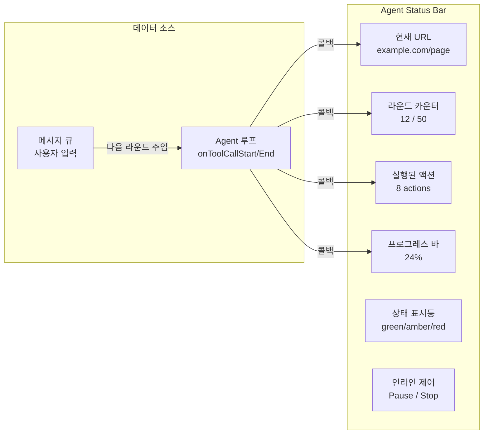
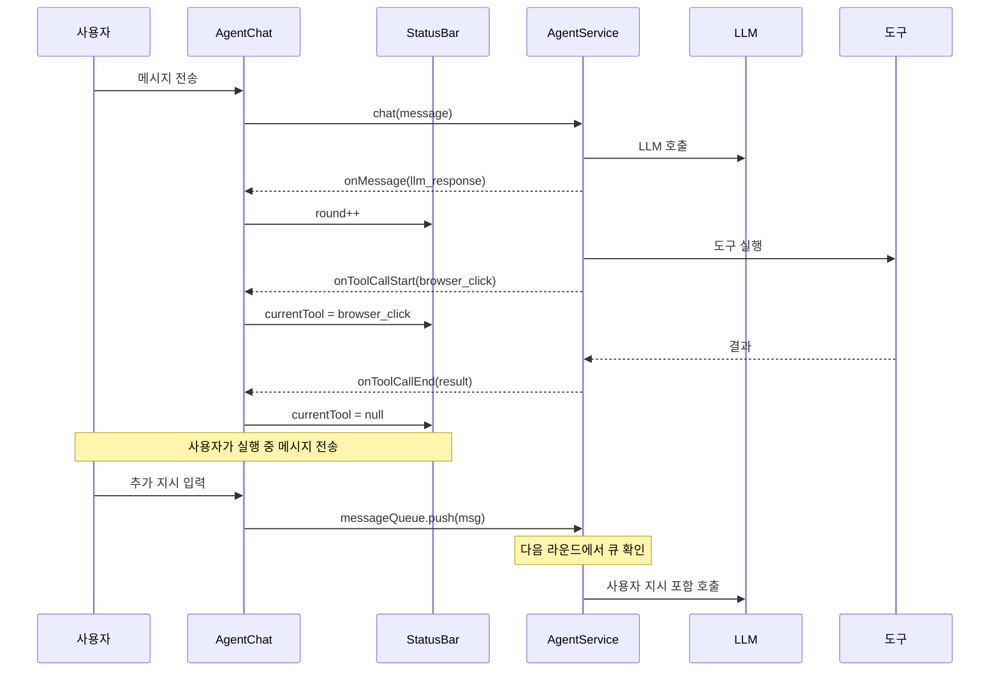

# Agent 실시간 상태 바: 메시지 큐와 즉각 피드백 UX

## 개요

AI Agent가 브라우저를 자동으로 조작하는 동안, 사용자는 "지금 뭘 하고 있는지" 알 수 없다. 화면이 움직이는 것은 보이지만, 50라운드 중 몇 번째인지, 어떤 도구를 호출했는지, 에러가 발생했는지 파악할 수 없다. 더 중요한 문제는, Agent가 실행 중일 때 사용자가 추가 지시를 보낼 방법이 없다는 것이다. "그 필드 말고 다른 필드에 입력해"라고 말하려면 Agent를 완전히 멈추고 다시 시작해야 했다.

XGEN 2.0 Agent에 실시간 Status Bar와 메시지 큐를 구현했다. Status Bar는 현재 URL, 라운드 카운터, 활성 도구, 프로그레스 바를 표시한다. 메시지 큐는 Agent가 실행 중에도 사용자가 텍스트를 보내면, 다음 LLM 호출에 자동으로 주입되는 시스템이다.

## 아키텍처

### Status Bar 구성 요소



### 콜백 기반 실시간 피드백



## 핵심 구현

### AgentService의 콜백 구조

AgentService는 Agent 루프의 각 단계에서 콜백을 호출하여 UI에 실시간 피드백을 제공한다.

```typescript
// AgentService.ts
export class AgentService {
    private options: AgentOptions;

    constructor(options: AgentOptions = {}) {
        this.options = options;
        // onMessage: 메시지 추가 시 즉시 콜백
        // onToolCallStart: 도구 호출 시작
        // onToolCallEnd: 도구 호출 완료
        // onError: 에러 발생
    }

    async chat(userMessage: string): Promise<AgentMessage[]> {
        for (let round = 0; round < maxToolRounds; round++) {
            // 1. LLM 호출
            const llmResponse = await this.callLLM();
            this.options.onMessage?.(llmResponse);

            // 2. 도구 호출 파싱
            const { text, toolCalls } = this.parseResponse(llmResponse);

            // 3. 도구 실행 (각 도구마다 start/end 콜백)
            for (const call of toolCalls) {
                this.options.onToolCallStart?.(call);
                const result = await this.executeTool(call);
                this.options.onToolCallEnd?.(call, result);

                // 결과를 대화에 추가
                const toolMsg = { role: 'tool', content: result };
                this.options.onMessage?.(toolMsg);
            }

            // 4. 메시지 큐 확인
            if (this.messageQueue.length > 0) {
                const queuedMsg = this.messageQueue.shift();
                this.conversation.push({
                    role: 'user', content: queuedMsg
                });
            }
        }
    }
}
```

핵심은 `onToolCallStart`와 `onToolCallEnd` 콜백이다. 도구 실행이 시작되면 Status Bar에 현재 도구명을 표시하고, 완료되면 지운다. LLM이 "생각 중"인 동안에는 "Thinking..." 상태를 표시한다.

### AgentChat의 상태 연결

```typescript
// AgentChat.tsx
export function AgentChat() {
    const [isProcessing, setIsProcessing] = useState(false);
    const [currentTool, setCurrentTool] = useState<string | null>(null);
    const [round, setRound] = useState(0);
    const [messages, setMessages] = useState<AgentMessage[]>([]);

    useEffect(() => {
        agentRef.current = new AgentService({
            onMessage: (msg) => {
                setMessages(prev => {
                    // 중복 방지: 같은 id의 메시지가 이미 있으면 스킵
                    if (prev.some(m => m.id === msg.id)) return prev;
                    return [...prev, msg];
                });
            },
            onToolCallStart: (call: ToolCall) => {
                setCurrentTool(call.tool);
                setRound(r => r + 1);
            },
            onToolCallEnd: () => {
                setCurrentTool(null);
            },
        });
    }, []);

    return (
        <div className={styles.agentChat}>
            <div className={styles.messageList}>
                {messages.map(msg => (
                    <MessageBubble key={msg.id} message={msg} />
                ))}
            </div>

            <ToolStatusBar
                isProcessing={isProcessing}
                currentTool={currentTool}
                round={round}
                maxRounds={50}
            />

            <ChatInput
                onSend={handleSend}
                disabled={false}  // 실행 중에도 입력 가능
            />
        </div>
    );
}
```

`disabled={false}`가 중요하다. 기존에는 Agent 실행 중에 입력창을 비활성화했는데, 메시지 큐 도입으로 실행 중에도 입력을 받을 수 있게 변경했다.

### ToolStatusBar 컴포넌트

```typescript
// ToolStatusBar.tsx
export function ToolStatusBar({
    isProcessing, currentTool, round, maxRounds
}: ToolStatusBarProps) {
    const progress = maxRounds ? (round / maxRounds) * 100 : 0;

    return (
        <div className={styles.statusBar}>
            {/* 도구 상태 표시등 */}
            <div className={styles.statusTools}>
                <span className={`${styles.statusDot} ${
                    isProcessing ? styles.statusActive : ''
                }`} />
                <FiGlobe />
                <span>browser</span>
            </div>

            {/* 현재 상태 정보 */}
            <div className={styles.statusInfo}>
                {isProcessing ? (
                    <>
                        <FiLoader className={styles.spinning} />
                        <span>
                            {currentTool
                                ? `Executing: ${currentTool}`
                                : 'Thinking...'}
                        </span>
                        {round != null && maxRounds != null && (
                            <span className={styles.roundCounter}>
                                Round {round}/{maxRounds}
                            </span>
                        )}
                    </>
                ) : (
                    <span className={styles.statusReady}>Ready</span>
                )}
            </div>

            {/* 프로그레스 바 */}
            <div className={styles.progressBar}>
                <div
                    className={styles.progressFill}
                    style={{ width: `${progress}%` }}
                />
            </div>
        </div>
    );
}
```

```
# 커밋: feat: add live status bar and message queue for agent chat
# 날짜: 2026-02-09 15:58
```

### 메시지 큐 - 실행 중 사용자 지시 주입

Agent가 실행 중일 때 사용자가 보낸 메시지는 큐에 저장되고, 다음 LLM 호출 전에 대화 히스토리에 주입된다.

```typescript
// useAgentScenarioBuilder.ts
const [messageQueue, setMessageQueue] = useState<string[]>([]);

// Agent 루프 내에서 매 라운드 시작 전 큐 확인
for (let round = 0; round < MAX_ROUNDS; round++) {
    // 큐에 메시지가 있으면 대화에 추가
    if (messageQueue.length > 0) {
        const queuedMsg = messageQueue.shift();
        conversationRef.current.push({
            id: `msg_queue_${Date.now()}`,
            role: 'user',
            content: queuedMsg,
            timestamp: new Date(),
        });
    }

    // LLM 호출 → 큐에서 온 메시지도 컨텍스트에 포함
    const llmResponse = await callLLM(conversationRef.current);
    // ...
}

// 사용자가 실행 중 메시지 보내기
const handleSendDuringExecution = (msg: string) => {
    setMessageQueue(prev => [...prev, msg]);
};
```

이 패턴의 장점은 Agent 루프를 중단하지 않고도 사용자의 의도를 반영할 수 있다는 것이다. "다음 필드부터 영문으로 입력해"라고 보내면, 다음 라운드의 LLM 호출에서 이 지시가 반영된다.

### 액션 뱃지 - 도구 메시지 정리

Agent의 채팅 UI에서 도구 호출 메시지를 사람이 읽기 쉬운 형태로 변환한다. Playwright MCP의 원시 도구 결과에는 JSON, base64 스크린샷 등이 포함되어 있어서 그대로 보여주면 가독성이 나쁘다.

```typescript
// 도구 메시지를 사람이 읽을 수 있는 뱃지로 변환
const getActionLabel = (toolName: string, args: any): string => {
    switch (toolName) {
        case 'browser_click':
            return `클릭: ${args.element || args.ref || '요소'}`;
        case 'browser_type':
            return `입력: "${args.text?.substring(0, 20)}..."`;
        case 'browser_navigate':
            return `이동: ${new URL(args.url).hostname}`;
        case 'browser_snapshot':
            return '페이지 스냅샷';
        case 'browser_press_key':
            return `키 입력: ${args.key}`;
        default:
            return toolName;
    }
};

// 도구 결과에서 불필요한 메타데이터 제거
const cleanToolContent = (content: string): string => {
    // Playwright의 accessibility snapshot 메타데이터 제거
    return content
        .replace(/\[ref=\d+\]/g, '')      // ref 번호 제거
        .replace(/aria-[a-z]+="[^"]*"/g, '') // aria 속성 제거
        .substring(0, 500);               // 최대 500자
};
```

```
# 커밋: fix: improve agent chat UI - clean tool messages, descriptive action badges
# 날짜: 2026-02-08 10:22
```

### ToolCallCard - 도구 호출 카드

각 도구 호출을 카드 형태로 표시한다. 실행 중/성공/실패 상태를 시각적으로 구분한다.

```typescript
// ToolCallCard.tsx
export function ToolCallCard({
    call, result, isExecuting
}: ToolCallCardProps) {
    const icon = TOOL_ICONS[call.tool] || <FiTerminal />;

    const statusClass = isExecuting ? styles.toolExecuting
        : result?.success ? styles.toolSuccess
        : result ? styles.toolFailed : '';

    return (
        <div className={`${styles.toolCard} ${statusClass}`}>
            <span className={styles.toolIcon}>{icon}</span>
            <span className={styles.toolName}>
                {getActionLabel(call.tool, call.args)}
            </span>
            <span className={styles.toolStatus}>
                {isExecuting && <FiClock className={styles.spinning} />}
                {result?.success && <FiCheck />}
                {result && !result.success && <FiX />}
            </span>
            {result?.duration && (
                <span className={styles.toolDuration}>
                    {result.duration}ms
                </span>
            )}
        </div>
    );
}
```

실행 중에는 spinning 아이콘, 성공 시 체크 아이콘, 실패 시 X 아이콘이 표시된다. 소요 시간도 함께 보여서 어떤 도구가 병목인지 파악할 수 있다.

### 즉각 피드백 - Pause/Stop 버튼 반응성

Pause나 Stop 버튼을 누르면 즉시 시각적 피드백을 제공한다. 실제 Agent 루프가 멈추기까지는 현재 도구 실행이 끝나야 하므로, 버튼 클릭과 실제 정지 사이에 지연이 있다. 이 지연 동안 사용자가 "버튼이 안 먹힌다"고 느끼지 않도록 즉각 피드백을 추가했다.

```typescript
// 즉각 피드백 상태
const [pendingAction, setPendingAction] = useState<'stopping' | 'pausing' | null>(null);

const handlePause = () => {
    setPendingAction('pausing');        // 즉시 UI 변경
    stopRef.current = 'pause';          // Agent 루프에 신호
};

const handleStop = () => {
    setPendingAction('stopping');        // 즉시 UI 변경
    stopRef.current = 'stop';           // Agent 루프에 신호
    // HITL 대기 중이면 Promise resolve
    if (humanResumeRef.current) {
        humanResumeRef.current.resolve(undefined);
    }
};

// Status Bar의 버튼 렌더링
{pendingAction === 'stopping' ? (
    <span className={styles.pendingAction}>
        <FiLoader className={styles.spinning} /> 중지 중...
    </span>
) : pendingAction === 'pausing' ? (
    <span className={styles.pendingAction}>
        <FiLoader className={styles.spinning} /> 일시정지 중...
    </span>
) : (
    <>
        <button onClick={handlePause}>Pause</button>
        <button onClick={handleStop}>Stop</button>
    </>
)}
```

```
# 커밋: fix: add instant feedback for stop/pause buttons in agent status bar
# 날짜: 2026-02-09 16:30
```

### 시나리오 실행 상태 패널

시나리오 배치 실행(엑셀 루프) 시에는 별도의 ExecutionStatusPanel이 동작한다. 1초 간격 폴링으로 서버의 실행 상태를 조회한다.

```typescript
// ExecutionStatusPanel.tsx
useEffect(() => {
    const fetchStatus = async () => {
        const statusResponse = await getExecutionStatus(executionId);
        setStatus(statusResponse);

        const resultsResponse = await getExecutionResults(executionId);
        setResults(resultsResponse.results);

        // 완료/실패/취소 시 폴링 중지
        if (['completed', 'failed', 'cancelled'].includes(statusResponse.status)) {
            clearInterval(pollingRef.current);
        }
    };

    pollingRef.current = setInterval(fetchStatus, 1000);
    return () => clearInterval(pollingRef.current);
}, [executionId]);
```

Row별 진행률, 성공/실패 카운트, 스크린샷 프리뷰, 실행 로그를 표시한다.

## CLI 브릿지 확장

팀원이 CLI 브릿지(LocalCLIBridge)를 통한 원격 실행 상태 표시를 추가했다. 웹 버전에서 로컬 CLI와 WebSocket으로 연결하여 Agent 상태를 실시간으로 동기화한다.

```
# 커밋: feat: Add execution status bar and tool badges with CLI bridge status
# 날짜: 2026-02-11 11:17
# 커밋: feat: Connect local CLI bridge with API base URL and user ID
# 날짜: 2026-02-11 11:55
```

## 트러블슈팅

### 메시지 중복 방지

`onMessage` 콜백이 React의 StrictMode에서 2번 호출되는 경우가 있었다. `msg.id` 기반 중복 검사로 해결했다.

```typescript
setMessages(prev => {
    if (prev.some(m => m.id === msg.id)) return prev;
    return [...prev, msg];
});
```

### 녹화 타이머와 상태 피드백

시나리오 녹화 중에도 상태 피드백이 필요했다. 캡처 스크립트 주입 상태(Initializing/Recording/Failed), 녹화 시간, 캡처된 액션 수를 실시간으로 표시한다.

```
# 커밋: feat: improve scenario recorder UX - status feedback, stop banner, navigate dedup
# 날짜: 2026-02-08 11:28
```

### textarea 자동 크기 조절

실행 중 메시지를 입력하는 텍스트 영역이 한 줄짜리로 고정되어 있었다. 긴 지시를 입력하기 불편해서, 내용에 따라 자동으로 높이가 조절되도록 개선했다.

```
# 커밋: fix: auto-resize textarea + increase max-height for agent chat input
# 날짜: 2026-02-08 19:34
```

## 결과 및 회고

### UX 개선 효과

| 기능 | 도입 전 | 도입 후 |
|------|---------|---------|
| 현재 상태 파악 | 화면 움직임만 관찰 | URL, 라운드, 도구명 실시간 표시 |
| 추가 지시 | Agent 중지 -> 재시작 | 실행 중 메시지 전송 -> 다음 라운드 반영 |
| Pause/Stop 반응 | 버튼 클릭 후 무반응 구간 | 즉시 스피너 + 상태 텍스트 |
| 도구 호출 이해 | 원시 JSON | 액션 뱃지 (클릭/입력/이동) |

### 설계 원칙

**"콜백으로 관심사를 분리하라"**: AgentService는 Agent 루프 로직에만 집중하고, UI 업데이트는 콜백을 통해 컴포넌트에 위임한다. 테스트할 때 콜백을 mock으로 대체하면 UI 없이도 Agent 로직을 검증할 수 있다.

**"메시지 큐는 비동기 협업의 핵심이다"**: Agent와 사용자가 동시에 동작하는 환경에서, 메시지 큐는 동기화 없이 통신할 수 있는 가장 간단한 패턴이다. 큐에 넣으면 "다음 적절한 시점"에 처리된다.

**"즉각 피드백은 인지된 성능이다"**: 실제 정지까지 2-3초 걸리더라도, 버튼을 누른 순간 스피너가 표시되면 사용자는 "작동하고 있다"고 인지한다. 피드백 없이 2-3초가 지나면 "버튼이 고장났다"고 느낀다.
