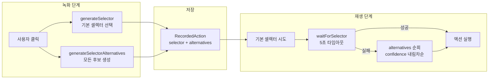

# CSS 셀렉터 대체 전략: selector_alternatives로 안정성 확보

## 개요

브라우저 자동화에서 가장 흔하게 깨지는 것이 CSS 셀렉터다. 녹화 시점에는 `#submit-btn`이었던 버튼이, 다음 배포에서 `#submit-button-v2`로 바뀌거나, CSS Module 해시가 `Button_active__x7k2p`에서 `Button_active__m3j9r`로 변경되면 재생이 실패한다.

XGEN 2.0 시나리오 레코더에서는 이 문제를 **selector_alternatives** 시스템으로 해결했다. 녹화 시 단일 셀렉터가 아니라, data-testid/id/aria-label/name/class/CSS path 등 여러 전략으로 생성된 후보 셀렉터를 confidence 점수와 함께 배열로 저장한다. 재생 시 기본 셀렉터가 실패하면 confidence 순으로 대체 셀렉터를 시도한다.

## 문제 분석

### 셀렉터가 깨지는 5가지 시나리오

| 시나리오 | 예시 | 빈도 |
|----------|------|------|
| CSS Module 해시 변경 | `.Button_active__x7k2p` -> `__m3j9r` | 매 빌드마다 |
| id/class 리네이밍 | `#submit-btn` -> `#submit-button` | 리팩토링 시 |
| DOM 구조 변경 | `div > div:nth-child(3) > button` 깨짐 | 레이아웃 변경 시 |
| 동적 생성 요소 | `#item-${uuid}` | 매 렌더링마다 |
| A/B 테스트 | 같은 기능, 다른 마크업 | 랜덤 |

기존 브라우저 자동화 도구(Selenium IDE, Playwright Codegen)는 녹화 시점의 단일 셀렉터만 저장한다. 셀렉터가 깨지면 사용자가 수동으로 수정해야 한다. 반복 실행이 핵심인 시나리오 자동화에서 이는 큰 유지보수 비용이다.

## 아키텍처

### selector_alternatives 라이프사이클



## 핵심 구현

### 타입 정의

```typescript
// types/index.ts
export interface SelectorCandidate {
    selector: string;       // CSS 셀렉터 문자열
    type: 'id' | 'name' | 'class' | 'css' | 'xpath' | 'text' | 'testid' | 'aria';
    confidence: number;     // 0.0 ~ 1.0 안정성 점수
    description?: string;   // 사람이 읽을 수 있는 설명
}

export interface RecordedAction {
    type: string;                               // click, type, navigate, ...
    selector?: string;                          // 기본 셀렉터
    selector_alternatives: SelectorCandidate[]; // 대체 셀렉터 목록
    value_type: ValueType;                      // literal, excel_column, credential
    in_loop: boolean;                           // 엑셀 루프 대상 여부
}
```

### 대체 셀렉터 생성 - generateSelectorAlternatives

캡처 스크립트 내부에서 DOM 요소로부터 가능한 모든 셀렉터 후보를 생성한다. 각 후보에 confidence 점수를 부여하여, 셀렉터의 안정성을 정량화한다.

```javascript
// useTauriMCPRecording.ts — CAPTURE_SCRIPT_BODY 내부
generateSelectorAlternatives: function(el) {
    var alternatives = [];

    // data-testid: confidence 1.0
    // 개발자가 테스트용으로 명시적으로 부여한 속성.
    // 배포/빌드로 변경되지 않으므로 가장 안정적이다.
    if (el.dataset && el.dataset.testid) {
        alternatives.push({
            selector: '[data-testid="' + el.dataset.testid + '"]',
            type: 'testid', confidence: 1.0
        });
    }

    // id: confidence 0.95
    // 대부분 안정적이지만, 동적 생성 id(uuid 포함)는 깨질 수 있다.
    if (el.id) {
        alternatives.push({
            selector: '#' + CSS.escape(el.id),
            type: 'id', confidence: 0.95
        });
    }

    // aria-label: confidence 0.9
    // 접근성 속성은 비교적 안정적이며, 고유성도 높다.
    var ariaLabel = el.getAttribute && el.getAttribute('aria-label');
    if (ariaLabel) {
        var ariaSelector = el.tagName.toLowerCase()
            + '[aria-label="' + ariaLabel.replace(/"/g, '\\"') + '"]';
        alternatives.push({
            selector: ariaSelector,
            type: 'aria', confidence: 0.9
        });
    }

    // name: confidence 0.9
    // 폼 요소의 name 속성은 서버 통신에 사용되므로 잘 바뀌지 않는다.
    if (el.name) {
        alternatives.push({
            selector: el.tagName.toLowerCase() + '[name="' + el.name + '"]',
            type: 'name', confidence: 0.9
        });
    }

    // role 속성: confidence 0.85
    var role = el.getAttribute && el.getAttribute('role');
    if (role) {
        alternatives.push({
            selector: '[role="' + role + '"]',
            type: 'css', confidence: 0.85
        });
    }

    // class (CSS Module 해시 필터링): confidence 0.7
    var classes = this.getStableClasses(el);
    if (classes.length > 0) {
        var classSelector = el.tagName.toLowerCase() + '.' + classes.join('.');
        if (document.querySelectorAll(classSelector).length === 1) {
            alternatives.push({
                selector: classSelector,
                type: 'class', confidence: 0.7
            });
        }
    }

    // text content: confidence 0.6
    // 텍스트는 다국어/동적 변경에 취약하지만, 다른 방법이 없을 때 유용하다.
    var text = (el.textContent || '').trim().substring(0, 50);
    if (text && text.length > 0) {
        alternatives.push({
            selector: '//' + el.tagName.toLowerCase()
                + '[contains(text(),"' + text + '")]',
            type: 'text', confidence: 0.6
        });
    }

    // CSS path (최후의 수단): confidence 0.5
    // DOM 구조에 완전히 의존하므로 가장 깨지기 쉽다.
    alternatives.push({
        selector: this.generateCssPath(el),
        type: 'css', confidence: 0.5
    });

    return alternatives;
},
```

### CSS Module 해시 필터링

React, Next.js 등에서 CSS Module을 사용하면 클래스명에 빌드 해시가 붙는다. 이 해시는 매 빌드마다 바뀌므로 셀렉터에 포함시키면 안 된다.

```javascript
getStableClasses: function(el) {
    if (!el.className || typeof el.className !== 'string') return [];
    return el.className.split(' ').filter(function(c) {
        if (c.length === 0) return false;
        // BEM 수식어 (Block__Element--Modifier) 제외
        if (c.indexOf('__') !== -1) return false;
        // CSS Module 해시 패턴 제외: ClassName___hash5+
        if (/___[a-zA-Z0-9]{5,}$/.test(c)) return false;
        return true;
    });
},
```

이 필터링으로 `Button_primary___x7k2p` 같은 해시 클래스는 제외하고, `btn-submit` 같은 의미 있는 클래스만 남긴다.

### 기본 셀렉터 선택 - generateSelector

`generateSelectorAlternatives`가 모든 후보를 생성하는 반면, `generateSelector`는 그 중 최적의 하나를 선택한다. 선택 기준은 confidence 순이되, **고유성 검증**을 추가한다.

```javascript
generateSelector: function(el) {
    // 1순위: data-testid
    if (el.dataset && el.dataset.testid)
        return '[data-testid="' + el.dataset.testid + '"]';

    // 2순위: aria-label (고유한 경우만)
    var ariaLabel = el.getAttribute('aria-label');
    if (ariaLabel) {
        var ariaSelector = '[aria-label="' + ariaLabel + '"]';
        if (document.querySelectorAll(ariaSelector).length === 1)
            return ariaSelector;
    }

    // 3순위: id
    if (el.id) return '#' + CSS.escape(el.id);

    // 4순위: name
    if (el.name)
        return el.tagName.toLowerCase() + '[name="' + el.name + '"]';

    // 5순위: class (고유한 경우만)
    var classes = this.getStableClasses(el);
    if (classes.length > 0) {
        var selector = el.tagName.toLowerCase() + '.' + classes.join('.');
        if (document.querySelectorAll(selector).length === 1)
            return selector;
    }

    // 6순위: CSS path
    return this.generateCssPath(el);
},
```

`querySelectorAll().length === 1` 검증이 핵심이다. 셀렉터가 고유하지 않으면 (페이지에 같은 aria-label이 2개 이상이면) 다음 순위로 넘어간다.

### 재생 시 Fallback 로직

`ScenarioExecutor`에서 재생 시, 기본 셀렉터로 요소를 찾지 못하면 alternatives를 confidence 내림차순으로 순회한다.

```typescript
// ScenarioExecutor.ts
const selectorActions = ['click', 'type', 'select', 'hover'];
let effectiveSelector = action.selector || '';

if (selectorActions.includes(action.type) && action.selector) {
    // 1단계: 기본 셀렉터로 시도 (5초 타임아웃)
    const waitResult = await browserManager.waitForSelector(
        action.selector, 5000
    );

    if (!waitResult.success || waitResult.data === 'timeout') {
        // 2단계: alternatives에서 fallback 시도
        const alternatives = (action.selector_alternatives || [])
            .filter(a => a.type !== 'text')  // text 타입은 XPath라 별도 처리
            .sort((a, b) => (b.confidence || 0) - (a.confidence || 0));

        let found = false;
        for (const alt of alternatives) {
            if (alt.selector === action.selector) continue;  // 이미 실패한 것 스킵
            const altWait = await browserManager.waitForSelector(
                alt.selector, 3000  // 대체 셀렉터는 3초 타임아웃
            );
            if (altWait.success && altWait.data !== 'timeout') {
                effectiveSelector = alt.selector;
                found = true;
                break;
            }
        }

        if (!found) {
            throw new Error(
                `셀렉터 실패: ${action.selector} (${alternatives.length}개 대체 셀렉터도 실패)`
            );
        }
    }
}

// effectiveSelector로 실제 액션 실행
await this.executeSingleAction(action, effectiveSelector, resolvedValue);
```

기본 셀렉터에는 5초, 대체 셀렉터에는 3초 타임아웃을 적용한다. 대체 셀렉터까지 시도해야 하면 이미 비정상 상황이므로, 각 시도의 대기 시간을 줄여서 전체 재생 시간을 제한한다.

### 셀렉터 편집 UI

사용자가 녹화된 시나리오를 편집할 때, 각 액션의 대체 셀렉터를 확인하고 수동으로 선택할 수 있다.

```typescript
// ActionEditor.tsx
{localAction.selector_alternatives.length > 0 && (
    <div className={styles.alternativesSection}>
        <button onClick={() => setShowAlternatives(!showAlternatives)}>
            Alternative selectors ({localAction.selector_alternatives.length})
        </button>
        {showAlternatives && localAction.selector_alternatives.map((alt, i) => (
            <div key={i} className={styles.alternativeItem}>
                <span className={styles.altType}>{alt.type}</span>
                <span className={styles.altSelector}>{alt.selector}</span>
                <span className={styles.altConfidence}>
                    {(alt.confidence * 100).toFixed(0)}%
                </span>
                <button onClick={() => handleSelectAlternative(alt.selector)}>
                    Use
                </button>
            </div>
        ))}
    </div>
)}
```

confidence 점수를 퍼센트로 표시하여, 사용자가 어떤 셀렉터가 더 안정적인지 직관적으로 판단할 수 있다.

## 트러블슈팅

### type 정규화: testid/aria -> css

백엔드 Pydantic 모델이 `type` 필드로 `'id' | 'name' | 'class' | 'css' | 'xpath' | 'text'`만 허용했다. 프론트엔드에서 생성하는 `'testid'`와 `'aria'` 타입이 유효성 검사에 걸렸다.

```typescript
// 저장 전 type 정규화
const normalizeAlternativeType = (type: string): string => {
    if (type === 'testid' || type === 'aria') return 'css';
    return type;
};
```

`data-testid`와 `aria-label` 셀렉터는 결국 CSS 셀렉터 문법(`[data-testid="..."]`, `[aria-label="..."]`)이므로, 백엔드에서는 `css` 타입으로 통합하는 것이 맞다. 프론트엔드에서만 내부적으로 세분화하여 confidence를 다르게 부여한다.

```
# 커밋: fix: selector_alternatives type 'testid'/'aria' -> 'css' (Pydantic 유효성 검증 오류 수정)
# 날짜: 2026-02-09 16:21
# 커밋: fix: selector_alternatives 저장 시 type 정규화 + 수동 녹화 UI 한글화
# 날짜: 2026-02-09 16:49
```

### Agent 모드: ref -> CSS 셀렉터 변환

Agent 모드에서는 Playwright의 ref(참조 번호) 기반으로 요소를 식별한다. 하지만 시나리오에 ref를 저장하면, 다음 실행 시 DOM이 바뀌어 ref가 무효화된다. Agent가 클릭한 요소의 CSS 셀렉터를 별도로 추출해야 했다.

```typescript
// getCssSelectorByRef: Playwright ref에서 CSS 셀렉터 추출
const getCssSelectorByRef = async (ref: string): Promise<string> => {
    const code = `async (page) => {
        const element = page.locator('[data-ref="${ref}"]');
        const el = await element.elementHandle();
        // evaluate 내에서 generateSelector 로직 실행
        return await el.evaluate((node) => {
            // ... 셀렉터 생성 로직
        });
    }`;
    return await browserManager.runCode(code);
};
```

```
# 커밋: fix: Agent 모드 시나리오 셀렉터를 실제 CSS 셀렉터로 기록
# 날짜: 2026-02-09 01:57
```

### selector_alternatives 보존 버그

시나리오 검증(validation) 과정에서 액션을 업데이트할 때, `selector_alternatives` 필드가 누락되는 버그가 있었다. 검증 결과를 기존 액션에 merge할 때 spread 연산자로 덮어쓰면서 빈 배열이 되는 것이었다.

```typescript
// 수정 전: alternatives가 사라짐
const updatedAction = { ...action, ...validationResult };

// 수정 후: alternatives 명시적 보존
const updatedAction = {
    ...action,
    ...validationResult,
    selector_alternatives: action.selector_alternatives,  // 보존
};
```

```
# 커밋: feat: 시나리오 검증 버튼 + selector_alternatives 보존 수정
# 날짜: 2026-02-09 08:12
```

### click() 방식 전환: browser_click(ref) -> page.click(selector)

초기에는 Playwright MCP의 `browser_click` 도구(ref 기반)를 사용했다. 하지만 시나리오 재생에서는 ref가 아닌 CSS 셀렉터로 요소를 찾아야 하므로, `run_code`를 통해 `page.click(selector)`를 직접 호출하는 방식으로 전환했다.

```typescript
// BrowserManager.ts
// 시나리오 재생용: CSS 셀렉터 기반
async click(selector: string): Promise<MCPToolResult> {
    const escapedSelector = selector.replace(/'/g, "\\'");
    const code = `async (page) => {
        await page.click('${escapedSelector}');
        return 'clicked';
    }`;
    return this.callTool('browser_run_code', { code });
}
```

`run_code`는 MCP 호출 1회로 완료되므로, `browser_click`이 내부적으로 수행하는 스냅샷 갱신 등의 오버헤드가 없다.

```
# 커밋: fix: click() uses run_code instead of browser_click, strip metadata in runCode
# 날짜: 2026-02-08 14:47
```

### 지연 셀렉터 추출 (Deferred Selectors)

Agent 모드에서 매 클릭마다 CSS 셀렉터를 추출하면 성능이 떨어진다. 셀렉터 추출을 액션 실행 후로 지연시키는 최적화를 적용했다. Agent가 ref로 빠르게 클릭하고, 시나리오 저장 시점에 일괄로 셀렉터를 추출한다.

```
# 커밋: feat: agent speed optimization - mid-stream actions, deferred selectors, domcontentloaded, reduced tools
# 날짜: 2026-02-10 01:16
```

## 결과 및 회고

### confidence 점수의 실효성

실제 운영 환경에서 측정한 셀렉터별 생존율이다.

| 셀렉터 타입 | confidence | 1주 후 생존율 | 1달 후 생존율 |
|-------------|------------|--------------|--------------|
| data-testid | 1.0 | 100% | 100% |
| id | 0.95 | 98% | 92% |
| aria-label | 0.9 | 97% | 90% |
| name | 0.9 | 99% | 95% |
| class (필터링) | 0.7 | 85% | 60% |
| CSS path | 0.5 | 70% | 30% |

confidence 점수와 실제 생존율이 대체로 일치했다. `name` 속성이 예상보다 안정적이었는데, 폼 요소의 name은 서버 API와 연동되므로 변경 비용이 크기 때문이다.

### 설계 원칙

**"단일 셀렉터는 SPOF다"**: 하나의 셀렉터에 의존하면, 그 셀렉터가 깨지는 순간 전체 시나리오가 실패한다. 여러 후보를 저장하는 것은 약간의 저장 공간 비용으로 안정성을 크게 높이는 트레이드오프다.

**"confidence는 경험적 수치다"**: 이론적으로 완벽한 점수 체계는 없다. data-testid가 1.0인 이유는 "개발자가 테스트를 위해 의도적으로 부여했기 때문"이라는 사회적 계약에 기반한다.

**"고유성 검증은 필수다"**: confidence가 높은 셀렉터라도, 페이지에서 고유하지 않으면 사용할 수 없다. `querySelectorAll().length === 1` 검증으로 동명의 요소가 여러 개인 경우를 걸러낸다.
