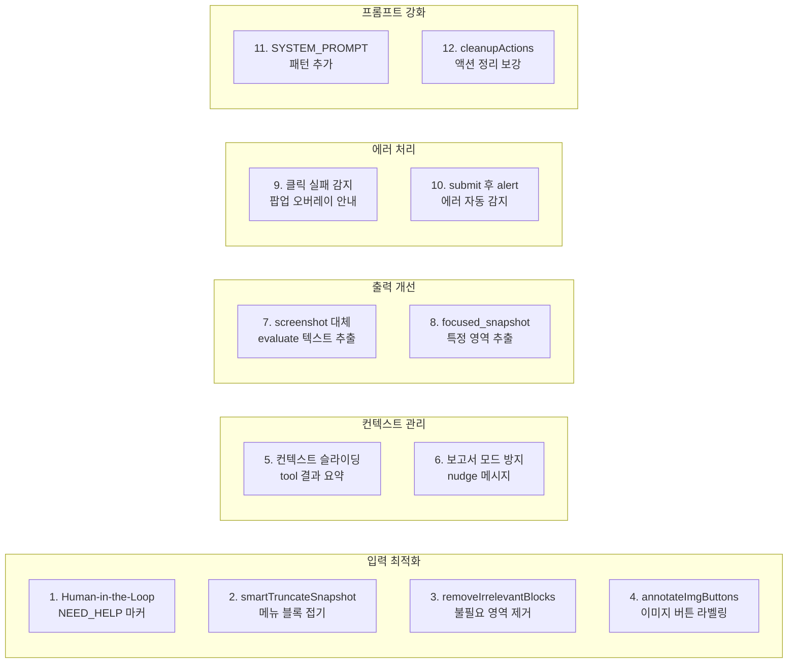

# Claude Code 수준의 Agent 정확도 달성하기: 12대 개선사항

## 문제 인식

Agent 시스템의 기본 아키텍처를 구축한 후 실사이트 테스트에 들어갔다. Nexacro 기반 이커머스 관리자 페이지에서 "상품 등록" 같은 작업을 시도하자 다양한 문제가 쏟아졌다:

- Agent가 클릭해야 할 요소를 못 찾는다
- 팝업이 뜨면 멈춘다
- 텍스트만 보고하고 실제 액션을 안 한다
- 같은 동작을 무한 반복한다
- 메뉴 트리가 snapshot을 가득 채워 정작 중요한 폼 요소를 못 본다

이 문제들을 2026년 2월 8일 하루 동안 12가지 개선사항으로 일괄 해결했다.

```
# 커밋: feat: Agent 대폭 개선 -- 실사이트 테스트 기반 12대 개선사항
# 날짜: 2026-02-08 21:40
```

## 12대 개선사항 전체 목록



## 개선사항 1: Human-in-the-Loop (`[NEED_HELP]` 마커)

Agent가 스스로 해결할 수 없는 상황(CAPTCHA, 2FA, 파일 선택 다이얼로그 등)을 만나면 `[NEED_HELP]` 마커로 사용자에게 수동 조작을 요청한다.

```typescript
// Agent가 도움이 필요한 상황을 감지하면
if (text.includes(NEED_HELP_MARKER)) {
    const helpText = text.replace(NEED_HELP_MARKER, '').trim();
    const helpMsg: ChatMessage = {
        id: `msg_${Date.now()}_help_${round}`,
        role: 'assistant',
        content: helpText || '도움이 필요합니다. 브라우저에서 직접 작업해주세요.',
        timestamp: new Date(),
    };
    conversationRef.current = [...conversationRef.current, helpMsg];

    // 사용자 수동 조작 대기
    const userResponse = await pauseForHuman('need_help');
    if (stopRef.current === 'stop') break;

    // 재개: 사용자가 한 작업을 캡처 스크립트로 수집
    const resumeMsg = buildResumeContext(userResponse);
    conversationRef.current = [...conversationRef.current, resumeMsg];
    continue;
}
```

사용자가 수동으로 조작하는 동안 캡처 스크립트가 click, input, change, Enter 이벤트를 감지하여 기록한다. 재개 시 이 정보를 LLM에게 전달하여 작업 맥락을 유지한다.

## 개선사항 2: smartTruncateSnapshot (메뉴 블록 접기)

Nexacro 사이트의 접근성 트리에는 좌측 메뉴 트리가 수천 줄을 차지한다. 정작 중요한 폼 요소가 밀려나서 LLM이 보지 못한다.

`smartTruncateSnapshot`은 반복되는 메뉴 블록을 접고, 폼 요소(`input`, `select`, `button`, `textarea`)를 보충하는 `FORM_ELEMENTS_SCRIPT`를 추가한다.

단, 이 접근법은 나중에 근본적으로 다른 해결책으로 대체되었다. snapshot 원본 전달 방식으로 전환하면서 이 코드는 삭제되었다 (개선사항 13 참조).

## 개선사항 3: removeIrrelevantBlocks (불필요 영역 자동 제거)

로그인 폼, 공지사항 배너, 푸터 영역 등 작업과 무관한 영역을 자동으로 식별하여 제거한다. 실사이트 테스트에서 이것만으로 약 8,000자를 절약했다.

## 개선사항 4: annotateImgButtons (이미지 버튼 라벨링)

이커머스 관리자 페이지에서 흔한 패턴: 검색 필드 옆에 `btn_popup*` 이미지 버튼이 있고, 이 버튼을 클릭해야 검색 팝업이 열린다. 접근성 트리에서는 이미지 버튼의 용도를 알 수 없으므로, 옆에 있는 textbox의 라벨을 자동으로 연결해서 표시한다.

## 개선사항 5: LLM 컨텍스트 슬라이딩 윈도우

Agent가 오래 실행되면 대화 히스토리가 계속 쌓인다. snapshot 하나가 수천 줄이므로 금방 토큰 한도에 도달한다.

```typescript
// 대화 컨텍스트 슬라이딩 윈도우
const KEEP_FULL_TOOL_RESULTS = 2;
const toolMsgIndices: number[] = [];
for (let i = 0; i < conversation.length; i++) {
    if (conversation[i].role === 'tool') toolMsgIndices.push(i);
}
const oldToolIndices = new Set(toolMsgIndices.slice(0, -KEEP_FULL_TOOL_RESULTS));

for (let i = 0; i < conversation.length; i++) {
    const msg = conversation[i];
    if (msg.role === 'tool' && oldToolIndices.has(i)) {
        // 오래된 tool 결과는 3줄 요약으로 축약
        const summary = extractToolSummary(msg.content);
        parts.push(`[도구 결과 요약] ${summary}`);
    } else {
        parts.push(msg.content);
    }
}
```

최근 2개의 tool 결과만 전체를 유지하고(이전 snapshot의 ref 번호를 참조할 수 있도록), 나머지는 3줄 요약으로 축약한다.

## 개선사항 6: 보고서 모드 방지 (nudge 메시지)

LLM이 `<action>` 태그 없이 텍스트로만 "이제 이걸 해야 합니다"라고 보고만 하는 문제. Agent인데 보고서를 쓰고 있으면 안 된다.

```typescript
if (browserActions.length === 0 && round > 0 && textOnlyRetries < 1) {
    textOnlyRetries++;
    const nudgeMsg: ChatMessage = {
        id: `msg_${Date.now()}_nudge`,
        role: 'user',
        content: '작업이 아직 남아있다면 <action> 태그로 다음 작업을 실행하세요. '
               + '모든 작업이 완료되었다면 간단히 완료 보고만 하세요.',
        timestamp: new Date(),
    };
    conversationRef.current = [...conversationRef.current, partialMsg, nudgeMsg];
    continue;
}
```

텍스트만 응답이 오면 1~2번 "넛지" 메시지를 보내 액션을 유도한다. 그래도 텍스트만 오면 human-in-the-loop로 전환한다.

## 개선사항 7: screenshot을 evaluate 기반 텍스트 추출로 대체

LLM은 이미지를 볼 수 없다(text-only 모드). Agent가 `screenshot`을 찍어도 활용하지 못한다. `browser_evaluate`로 페이지 정보를 텍스트로 추출하는 방식으로 교체했다.

## 개선사항 8: focused_snapshot (특정 영역 폼 요소 추출)

전체 접근성 트리가 너무 길면 특정 CSS 선택자 영역만 추출하는 `focused_snapshot` 도구를 추가했다.

```
<action>{"tool": "focused_snapshot", "selector": "#form-container"}</action>
```

Nexacro의 복잡한 페이지에서 iframe 내부나 특정 폼 영역만 볼 때 유용하다. 전체 snapshot이 12,000자를 넘어갈 때 이 도구로 핵심 영역만 집중한다.

## 개선사항 9: 클릭 실패 시 팝업 오버레이 감지

클릭이 실패하면 팝업이나 오버레이가 가로막고 있을 가능성이 높다. 실패 시 자동으로 오버레이를 감지하고, 닫기 버튼의 위치를 안내한다.

## 개선사항 10: submit 후 alert/에러 메시지 자동 감지

폼을 제출한 후 발생하는 alert 다이얼로그나 에러 메시지를 자동으로 감지하여 LLM에게 피드백한다. 이를 통해 Agent가 에러를 인식하고 다른 접근법을 시도할 수 있다.

## 개선사항 11: SYSTEM_PROMPT 패턴 추가

실사이트 테스트에서 발견한 구체적인 UI 패턴을 시스템 프롬프트에 추가했다:

- **검색 선택 필드**: 돋보기 버튼(`img "btn_popup*"`) 클릭 → 팝업에서 선택. `type + Enter`는 동작하지 않는다
- **팝업/오버레이 처리**: `press_key Escape` → 안 되면 `snapshot`으로 닫기 버튼 찾기
- **동적 UI**: Nexacro/SAP에서 좌측 메뉴가 트리를 차지하면 `focused_snapshot` 사용
- **iframe**: `focused_snapshot("iframe")`으로 iframe 내부 추출

## 개선사항 12: cleanupActions 보강

시나리오 녹화 후 불필요한 액션을 자동으로 정리한다.

```typescript
const cleanupActions = useCallback(() => {
    setActions(prev => {
        const cleaned: Partial<RecordedAction>[] = [];
        for (let i = 0; i < prev.length; i++) {
            const action = prev[i];

            // 탐색 전용 액션 제거 (시나리오 재생에 불필요)
            const exploratoryTypes = [
                'snapshot', 'screenshot', 'focused_snapshot', 'tab_list', 'hover'
            ];
            if (exploratoryTypes.includes(action.type as string)) continue;

            // 짧은 wait 제거 (1초 이하)
            if (action.type === 'wait' && parseInt(action.value) <= 1000) continue;

            // 연속 중복 navigate/click 제거
            if (action.type === 'navigate' && prev[i + 1]?.type === 'navigate') continue;
            if (action.type === 'click' && prev[i + 1]?.type === 'click'
                && action.selector === prev[i + 1].selector) continue;

            // 같은 필드에 연속 type → 마지막 값만 유지
            if (action.type === 'type' && prev[i + 1]?.type === 'type'
                && action.selector === prev[i + 1].selector) continue;

            // press_key "Escape" 제거
            if (action.type === 'press_key' && action.value === 'Escape') continue;

            cleaned.push(action);
        }
        return cleaned;
    });
}, []);
```

## 결정적 전환점: snapshot 원본 전달

12대 개선사항을 적용한 후에도 정확도가 만족스럽지 않았다. 근본 원인은 **snapshot 가공 과정에서 ref 번호가 손실**되는 것이었다.

```
# 커밋: refactor: snapshot 원본 전달 방식으로 전환 -- Claude Code와 동일한 정확도 달성
# 날짜: 2026-02-08 23:56
```

smartTruncateSnapshot, removeIrrelevantBlocks, annotateImgButtons, collapseRepeatingBlocks, FORM_ELEMENTS_SCRIPT -- 이 모든 가공 로직이 snapshot의 구조를 변형하면서 ref 번호 매핑이 깨졌다.

해결책은 놀랍도록 단순했다: **Playwright snapshot 원본을 그대로 LLM에 전달**한다.

```typescript
// 이전: 가공된 snapshot (ref 번호 손실 위험)
const processed = smartTruncateSnapshot(snapshot, 12000);

// 이후: 원본 그대로 전달 (ref 번호 100% 보존)
lastSnapshotRef.current = snapshot;
```

이 전환으로 **393줄의 가공 코드를 삭제**했다. 대신 컨텍스트 관리를 강화했다:

- callLLM: 최근 1개(후에 2개) tool 결과만 전체 유지, 나머지 3줄 요약
- assistant 메시지: 최근 2개만 전체, 나머지 3000자 초과 시 1500자로 축약
- input_data 80000자 초과 시 공격적 축약 (최근 6개 메시지만 유지)
- 네트워크 에러(Load failed) 시 2초 후 1회 재시도

snapshot을 가공하는 대신 **컨텍스트 관리**로 토큰 문제를 해결한 것이 핵심이다. Claude Code도 같은 원리로 동작한다: 도구 결과를 그대로 전달하되, 오래된 것은 요약한다.

## Human-in-the-Loop 확장: 일시정지와 MAX_ROUNDS

정확도가 올라가면서 Agent가 더 오래 자율적으로 실행되었다. 이를 지원하기 위한 제어 메커니즘을 추가했다.

```
# 커밋: feat: 일시정지 버튼 + MAX_ROUNDS 자동 human-in-the-loop
# 날짜: 2026-02-09 01:01
```

```typescript
// stopRef: boolean → 'stop' | 'pause' | false 유니온 타입
const stopRef = useRef<'stop' | 'pause' | false>(false);

// 일시정지: 현재 라운드 완료 후 human-in-the-loop 진입
if (stopRef.current === 'pause') {
    stopRef.current = false;
    const pauseMsg: ChatMessage = {
        role: 'assistant',
        content: '일시정지되었습니다. 브라우저에서 직접 작업한 후 계속 버튼을 눌러주세요.',
    };
    const userResponse = await pauseForHuman('paused');
    continue;
}

// MAX_ROUNDS 도달 시 완전 종료 대신 human-in-the-loop
const maxRoundMsg: ChatMessage = {
    role: 'assistant',
    content: `${MAX_ROUNDS}라운드가 완료되었습니다. 추가 작업이 필요하면 계속 버튼을 누르세요.`,
};
const userResponse = await pauseForHuman('max_rounds');
```

MAX_ROUNDS는 8 → 15 → 50으로 증가시켰다. 50라운드에 도달하면 자동 종료가 아닌 human-in-the-loop로 전환하여 사용자가 계속 진행할지 결정한다.

### Text-only 응답도 human-in-the-loop로

```
# 커밋: fix: prevent agent from stopping mid-task - use human-in-the-loop instead
# 날짜: 2026-02-09 01:14
```

Agent가 텍스트만 응답하면 이전에는 루프를 종료했다. 하지만 실제로는 Agent가 "중간 보고"를 하는 경우가 많았다. 종료 대신 human-in-the-loop로 전환하여 사용자가 "계속해"를 눌러 작업을 이어갈 수 있게 했다.

## 시나리오 검증과 엑셀 루프 변환

```
# 커밋: feat: 엑셀 루프 변환 + 시나리오 검증 강화
# 날짜: 2026-02-09 08:30
```

Agent가 생성한 시나리오의 품질을 LLM으로 검증하는 기능도 추가했다.

```typescript
const validateActions = useCallback(async () => {
    // LLM에게 시나리오와 원래 요청을 비교 분석 요청
    const validatePrompt = `
사용자 원래 요청: "${originalRequest}"
기록된 시나리오: ${JSON.stringify(actions)}

다음을 분석하세요:
1. changes: 실패/불필요한 액션 제거
2. missing_steps: 누락된 단계
3. summary: 전체 평가
    `;
    const response = await callLLM(validateConversation);
    // JSON 파싱 → 실패 액션 자동 제거, 누락 단계 안내
}, []);
```

검증 결과에 따라:
- 실패/재시도 기록이 있는 액션 자동 제거
- 탐색/시행착오 액션 정리
- 누락된 단계를 사용자에게 안내

## 실행 중 메시지 전송 (Status Bar)

```
# 커밋: feat: Status Bar + 실행 중 메시지 전송 (협업 UX Phase 1)
# 날짜: 2026-02-09 11:23
```

Agent가 실행되는 동안에도 사용자가 추가 지시를 전송할 수 있다. 메시지 큐에 넣으면 다음 라운드에 자동으로 주입된다.

```typescript
const queueMessage = useCallback((msg: string) => {
    queuedMessageRef.current = msg;
}, []);

// 각 라운드 시작 시 큐 확인
if (queuedMessageRef.current) {
    const injectedMsg: ChatMessage = {
        role: 'user',
        content: queuedMessageRef.current,
        timestamp: new Date(),
    };
    conversationRef.current = [...conversationRef.current, injectedMsg];
    queuedMessageRef.current = null;
}
```

Status Bar에는 현재 URL, 라운드(n/50), 기록된 액션 수, 진행 바, 상태 표시가 실시간으로 업데이트된다.

## 개선 전후 비교

| 항목 | 개선 전 | 개선 후 |
|------|---------|---------|
| snapshot 처리 | 가공(접기, 제거, 라벨링) | 원본 그대로 전달 |
| ref 정확도 | 가공 시 손실 가능 | 100% 보존 |
| 가공 코드 | 393줄 | 0줄 (삭제) |
| 컨텍스트 관리 | 없음 | 슬라이딩 윈도우 + 요약 |
| 텍스트 응답 처리 | 루프 종료 | human-in-the-loop |
| MAX_ROUNDS | 8 (고정 종료) | 50 (human-in-the-loop) |
| 무한 루프 감지 | 없음 | 동일 시그니처 3회 → 일시정지 |
| 시나리오 정리 | 수동 | cleanupActions 자동 |

## 개선 타임라인

전체 개선은 약 20시간 동안 이루어졌다:

- **2/8 03:54** -- Agent Tool Ecosystem 초기 구축 (+5,391줄)
- **2/8 04:01~06:16** -- Playwright MCP 통합 안정화 (evaluate 파라미터, 메타데이터 strip, 컨텍스트 불일치)
- **2/8 11:28~15:34** -- 시나리오 레코더 안정화 (네비게이션 생존, 탭 감지, 셀렉터 fallback)
- **2/8 17:53** -- 검색엔진 탈출 방지
- **2/8 19:20** -- Agent 대폭 개선 v1 (+317줄)
- **2/8 21:40** -- **12대 개선사항** (+1,247줄)
- **2/8 23:56** -- **snapshot 원본 전달 전환** (-393줄, 정확도 대폭 향상)
- **2/9 01:01~01:57** -- Human-in-the-loop 확장, MAX_ROUNDS 증가, CSS 셀렉터 기록
- **2/9 08:30** -- 시나리오 검증 + 엑셀 루프 변환

핵심 교훈은 "가공보다 원본이 낫다"는 것이다. snapshot을 가공해서 토큰을 아끼려 했지만, 정확도 손실이 더 컸다. 원본을 전달하고 컨텍스트 관리로 토큰 문제를 해결하는 것이 정답이었다.
