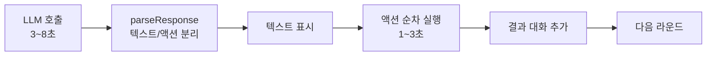
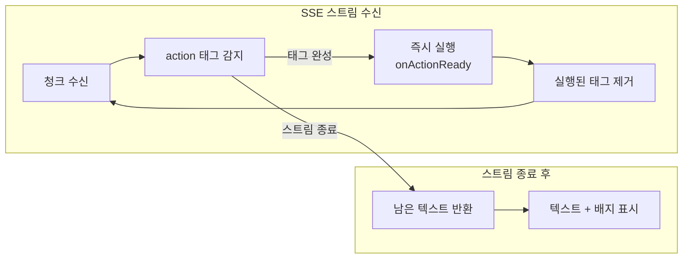
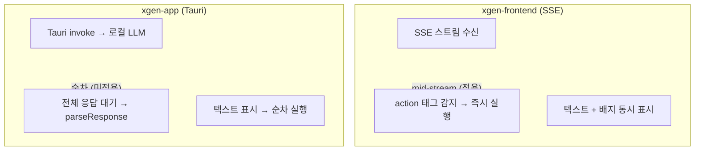

# LLM 텍스트 우선 표시: Agent UX에서의 응답 순서 최적화

## 개요

XGEN 2.0의 AI Agent는 LLM에게 현재 페이지 상태를 보여주고, LLM이 다음 브라우저 액션을 결정한다. 이 과정이 라운드마다 반복된다. 문제는 한 라운드의 처리 시간이 길다는 것이었다.

기존 흐름은 이렇다: LLM 응답 완료 대기(3~8초) → `parseResponse`로 텍스트와 액션 분리 → 텍스트를 UI에 표시 → 액션을 순차 실행(1~3초) → 결과를 대화에 추가. 총 4~11초 동안 사용자는 아무것도 보지 못한다. 로딩 점 3개만 깜빡인다.

핵심 통찰은 이것이다: LLM의 응답은 SSE 스트리밍으로 점진적으로 도착한다. `<action>` 태그가 완성되는 즉시 브라우저 액션을 실행하면, LLM이 텍스트를 계속 생성하는 동안 브라우저 조작이 병렬로 진행된다. 응답 완료를 기다릴 필요가 없다.

이 "mid-stream action extraction" 패턴으로 체감 속도를 30~50% 개선했다. 추가로 deferred CSS selector extraction, domcontentloaded 전환, 도구 수 축소까지 4가지 Tier-1 최적화를 적용했다.

## 문제 분석

### 기존 응답 처리 흐름



각 단계가 직렬로 연결되어 있다. LLM 응답이 완전히 끝나야 `parseResponse`를 호출하고, 파싱이 끝나야 액션을 실행한다. 하지만 LLM의 SSE 스트림에서 `<action>` 태그는 응답 초반에 나오는 경우가 많다. LLM은 먼저 액션을 출력하고, 그 다음 설명 텍스트를 생성하는 패턴이다.

```
<action>{"tool": "click", "ref": "e15"}</action>
<action>{"tool": "type", "ref": "e20", "text": "hello"}</action>

위 검색어 입력란에 "hello"를 입력했습니다. 다음으로...
```

기존 방식에서는 "hello"를 입력하라는 지시가 스트림 초반에 도착해도, LLM이 설명 텍스트를 모두 생성할 때까지 기다렸다가 입력을 실행했다.

### 사용자 체감

| 구간 | 시간 | 사용자 경험 |
|------|------|------------|
| LLM 응답 대기 | 3~8초 | 로딩 점만 보임 |
| 파싱 + 실행 | 1~3초 | 갑자기 브라우저가 움직임 |
| 합계 | 4~11초 | 매 라운드마다 반복 |

10라운드면 40~110초다. 사용자는 Agent가 느리다고 느낀다.

## 핵심 구현: Mid-stream Action Extraction

### callLLM의 onActionReady 콜백

`callLLM` 함수에 `onActionReady` 콜백 파라미터를 추가했다. SSE 스트림에서 완전한 `<action>` 태그가 감지되면 즉시 이 콜백을 호출한다.

```typescript
const callLLM = useCallback(async (
    conversation: ChatMessage[],
    onActionReady?: (action: BrowserAction) => Promise<void>,
): Promise<{ text: string; streamedActionCount: number }> => {

    const decoder = new TextDecoder();
    let accumulated = '';
    let buffer = '';
    let streamedActionCount = 0;

    while (true) {
        const { done, value } = await reader.read();
        if (done) break;

        buffer += decoder.decode(value, { stream: true });
        const lines = buffer.split('\n');
        buffer = lines.pop() || '';

        for (const line of lines) {
            if (!line.startsWith('data: ')) continue;
            const jsonStr = line.slice(6).trim();
            if (!jsonStr) continue;

            try {
                const event = JSON.parse(jsonStr);
                if (event.type === 'data' && event.content) {
                    accumulated += event.content;

                    // 실시간 액션 추출
                    if (onActionReady) {
                        const streamRegex =
                            /<action>([\s\S]*?)<\/action>/g;
                        let streamMatch;
                        const executedTags: string[] = [];

                        while ((streamMatch =
                            streamRegex.exec(accumulated)) !== null) {
                            try {
                                const parsed =
                                    JSON.parse(streamMatch[1].trim());
                                if (parsed.tool) {
                                    const action: BrowserAction = {
                                        tool: parsed.tool,
                                        args: { ...parsed },
                                    };
                                    delete action.args.tool;
                                    await onActionReady(action);
                                    executedTags.push(streamMatch[0]);
                                    streamedActionCount++;
                                }
                            } catch {
                                // JSON 미완성 — 다음 청크에서 재시도
                            }
                        }
                        // 실행 완료된 태그만 제거
                        for (const tag of executedTags) {
                            accumulated = accumulated.replace(tag, '');
                        }
                    }
                } else if (event.type === 'end') {
                    const text = accumulated
                        .replace(ACTION_REGEX, '').trim();
                    return { text, streamedActionCount };
                }
            } catch (e) {
                if (e instanceof SyntaxError) continue;
                throw e;
            }
        }
    }

    const text = accumulated.replace(ACTION_REGEX, '').trim();
    return { text, streamedActionCount };
}, [resolvedWorkflowId]);
```

```
# 커밋: feat: agent speed optimization -- mid-stream actions, deferred selectors, domcontentloaded, reduced tools
# 날짜: 2026-02-10 01:16
```

### 개선된 응답 처리 흐름



핵심 포인트:

- **완전한 태그만 실행**: `<action>` 여는 태그가 있지만 `</action>`이 아직 안 온 경우, `JSON.parse`가 실패하므로 자연스럽게 건너뛴다. 다음 청크가 도착하면 다시 시도한다.
- **실행된 태그 제거**: `accumulated`에서 실행 완료된 `<action>...</action>` 태그를 제거한다. 스트림이 끝나면 `accumulated`에는 텍스트만 남는다.
- **병렬 실행**: LLM이 텍스트를 계속 생성하는 동안 `onActionReady`가 `await executeBrowserAction`을 호출한다. 브라우저 조작과 LLM 텍스트 생성이 동시에 진행된다.

### 에이전트 루프에서의 사용

```typescript
const handleStreamAction = async (action: BrowserAction) => {
    streamedActions.push(action);

    // ref 반복 감지 (무한 루프 방지)
    if (['click', 'type', 'select'].includes(action.tool) &&
        action.args.ref) {
        const key = `${action.tool}:${action.args.ref}`;
        refActionCounts[key] = (refActionCounts[key] || 0) + 1;
        if (refActionCounts[key] >= 3) {
            toolOutputs.push(
                `[WARNING] ${action.tool} ref=${action.args.ref}를 ` +
                `${refActionCounts[key]}회 반복.`
            );
        }
    }

    const result = await executeBrowserAction(action);
    toolOutputs.push(`[${action.tool}] ${result.output}`);

    if (result.recordedAction) {
        const recorded: Partial<RecordedAction> = {
            ...result.recordedAction,
            action_id: `action_${Date.now()}_${Math.random()
                .toString(36).substr(2, 9)}`,
            selector_alternatives:
                result.recordedAction.selector_alternatives || [],
            wait_after: 0,
            in_loop: false,
        };
        roundActions.push(recorded);
        setActions(prev => [...prev, recorded]);
    }
};

const { text, streamedActionCount } = await callLLM(
    conversationRef.current,
    handleStreamAction,
);
```

`handleStreamAction` 콜백은 액션 실행, 결과 수집, 기록까지 한 번에 처리한다. `refActionCounts`로 같은 ref에 3번 이상 반복되는 액션을 감지하여 경고를 추가한다. Agent가 잘못된 요소에 계속 클릭하는 무한 루프를 방지하는 안전장치다.

## parseResponse: 태그 파싱

### xgen-frontend의 `<action>` 태그

```typescript
const ACTION_REGEX = /<action>([\s\S]*?)<\/action>/g;

const parseResponse = useCallback((response: string): ParsedResponse => {
    const browserActions: BrowserAction[] = [];
    const parseErrors: string[] = [];
    let text = response;

    let match;
    while ((match = ACTION_REGEX.exec(response)) !== null) {
        try {
            const parsed = JSON.parse(match[1].trim());
            if (parsed.tool) {
                browserActions.push({
                    tool: parsed.tool,
                    args: { ...parsed },
                });
                delete browserActions[
                    browserActions.length - 1
                ].args.tool;
            }
        } catch {
            const snippet = match[1].trim().substring(0, 80);
            parseErrors.push(
                `[PARSE_ERROR] <action> JSON 파싱 실패. 원문: "${snippet}"`
            );
        }
    }

    text = response.replace(ACTION_REGEX, '').trim();
    ACTION_REGEX.lastIndex = 0;
    return { text, actions: browserActions, parseErrors };
}, []);
```

`parseResponse`는 mid-stream 이후 남은 액션 처리, 또는 `onActionReady`가 없는 단순 호출에서 사용된다. LLM 응답에서 모든 `<action>` 태그를 추출하고, 순수 텍스트만 남긴다.

`ACTION_REGEX.lastIndex = 0`이 중요하다. 전역 정규식(`/g` 플래그)은 `lastIndex`를 유지하므로, 다음 호출에서 이전 위치부터 검색을 시작하는 버그를 방지한다.

### xgen-app의 `<tool_call>` 태그

Tauri 데스크톱 앱(xgen-app)은 다른 태그 형식을 사용한다.

```typescript
const TOOL_CALL_REGEX = /<tool_call>([\s\S]*?)<\/tool_call>/g;

private parseResponse(response: string):
    { text: string; toolCalls: ToolCall[] } {
    const toolCalls: ToolCall[] = [];
    let text = response;

    let match;
    while ((match = TOOL_CALL_REGEX.exec(response)) !== null) {
        try {
            const parsed = JSON.parse(match[1].trim());
            if (parsed.tool) {
                toolCalls.push({
                    id: generateToolCallId(),
                    tool: parsed.tool,
                    args: parsed.args || {},
                });
            }
        } catch {
            console.warn('[AgentService] Failed to parse tool call:',
                match[1]);
        }
    }

    text = response.replace(TOOL_CALL_REGEX, '').trim();
    TOOL_CALL_REGEX.lastIndex = 0;
    return { text, toolCalls };
}
```

두 프로젝트의 차이:

| | xgen-frontend | xgen-app |
|---|---|---|
| 태그 형식 | `<action>` | `<tool_call>` |
| args 위치 | 최상위 (`{tool, ref, text}`) | 중첩 (`{tool, args: {ref, text}}`) |
| LLM 호출 | SSE 워크플로우 API | Tauri invoke → 로컬 LLM |
| mid-stream | 지원 (onActionReady) | 미적용 (전체 응답 후 순차) |

xgen-frontend에서 mid-stream이 먼저 구현되었고, xgen-app은 추후 적용 예정이다.

## 추가 최적화: Deferred CSS Selector

### 문제: 라운드마다 MCP 호출 추가

Agent가 click, type, select 액션을 실행할 때마다, 시나리오 재생을 위해 해당 요소의 CSS 셀렉터를 추출해야 했다. 이를 위해 매 액션마다 `getCssSelectorByRef` MCP 호출이 발생했다. 라운드에 2~3개 액션이 있으면 MCP 호출이 6~9번 추가되는 셈이다.

### 해결: batchExtractSelectors

Agent 실행 중에는 Playwright ref 기반으로만 동작하고, CSS 셀렉터 추출은 시나리오 완료 후 한 번에 수행한다.

```typescript
const batchExtractSelectors = useCallback(async () => {
    return new Promise<void>((resolve) => {
        setActions(prev => {
            if (prev.length === 0) { resolve(); return prev; }

            (async () => {
                const updated = [...prev];
                let extracted = 0;

                for (const action of updated) {
                    const ref = (action as any)?._ref;
                    if (!ref) continue;
                    try {
                        const sel = await getCssSelectorByRef(
                            ref,
                            action.value || action.selector || ''
                        );
                        action.selector = sel.selector;
                        action.selector_alternatives =
                            sel.selector_alternatives as any;
                        action.element_tag = sel.element_tag;
                        action.element_text = sel.element_text;
                        delete (action as any)._ref;
                        extracted++;
                    } catch {
                        // ref 만료 — elementDesc를 selector로 유지
                    }
                }

                if (extracted > 0) {
                    setActions([...updated]);
                }
                resolve();
            })();

            return prev;
        });
    });
}, [getCssSelectorByRef]);
```

실행 중에는 `_ref` 필드에 Playwright ref 번호를 임시 저장하고, `selector`에는 `elementDesc`(사람이 읽을 수 있는 설명)를 넣는다. 완료 후 `batchExtractSelectors`가 `_ref`로 실제 CSS 셀렉터를 추출하여 `selector`를 교체한다.

ref가 만료된 경우(페이지가 변경되어 DOM이 바뀐 경우)에는 `elementDesc`를 그대로 유지한다. 이 경우 시나리오 재생 시 `selector_alternatives`의 다른 후보로 fallback한다.

## UI 렌더링: 텍스트 우선 패턴

### MessageBubble 컴포넌트

xgen-app의 `MessageBubble`은 텍스트를 먼저, 도구 호출을 아래에 표시하는 구조다.

```typescript
export function MessageBubble({ message }: MessageBubbleProps) {
    if (message.role === 'tool') {
        return (
            <div className={styles.toolResultGroup}>
                {message.toolResults?.map((result, idx) => (
                    <ToolCallCard key={result.id || idx}
                        call={{ id: result.id, tool: result.tool, args: {} }}
                        result={result} />
                ))}
            </div>
        );
    }

    return (
        <div className={`${styles.messageBubble} ${roleClass}`}>
            <div className={styles.messageAvatar}>
                {isUser ? <FiUser /> : <FiCpu />}
            </div>
            <div className={styles.messageContent}>
                {/* 텍스트를 먼저 렌더링 */}
                {message.content && (
                    <div className={styles.messageText}>
                        {message.content.split('\n').map((line, i) => (
                            <React.Fragment key={i}>
                                {line}
                                {i < message.content.split('\n').length - 1
                                    && <br />}
                            </React.Fragment>
                        ))}
                    </div>
                )}
                {/* 도구 호출은 텍스트 아래에 표시 */}
                {message.toolCalls && message.toolCalls.length > 0 && (
                    <div className={styles.inlineToolCalls}>
                        {message.toolCalls.map((call, idx) => (
                            <ToolCallCard key={call.id || idx}
                                call={call} isExecuting={true} />
                        ))}
                    </div>
                )}
            </div>
        </div>
    );
}
```

```
# 커밋: feat: Agent 대폭 개선 -- 실사이트 테스트 기반 12대 개선사항
# 날짜: 2026-02-08 21:40
```

### AgentChat의 renderMessage

xgen-frontend에서도 동일한 원칙이 적용된다.

```typescript
const renderMessage = (msg: ChatMessage) => {
    // Tool 메시지: 정리된 텍스트
    if (msg.role === 'tool') {
        return (
            <div key={msg.id}
                className={`${styles.message} ${styles.tool}`}>
                {cleanToolContent(msg.content)}
            </div>
        );
    }

    // Assistant 메시지: 텍스트 먼저, 액션 배지 아래
    const showContent = msg.content &&
        msg.content !== '(액션 실행 중...)';

    return (
        <div key={msg.id}
            className={`${styles.message} ${roleClass}`}>
            {showContent && <div>{msg.content}</div>}
            {msg.actions && msg.actions.length > 0 && (
                <div className={styles.actionBadges}>
                    {msg.actions.map((a, i) => (
                        <span key={i} className={styles.actionBadge}>
                            {getActionLabel(a)}
                        </span>
                    ))}
                </div>
            )}
        </div>
    );
};
```

텍스트 우선 표시의 의미는 두 가지다.

1. **코드 레벨**: `msg.content`를 먼저 렌더링하고, `msg.actions`를 그 아래에 배치한다.
2. **타이밍 레벨**: mid-stream에서 액션은 이미 실행이 완료된 상태다. 스트림이 끝나면 텍스트와 함께 "이미 완료된 액션"의 배지가 동시에 표시된다. 사용자가 텍스트를 읽는 동안 브라우저는 이미 다음 상태로 넘어가 있다.

## 추가 최적화

### domcontentloaded 전환

페이지 네비게이션 후 `waitForLoadState('load', 8000)`에서 `waitForLoadState('domcontentloaded', 5000)`으로 변경했다.

| 이벤트 | 의미 | 타이밍 |
|--------|------|--------|
| `domcontentloaded` | HTML 파싱 완료, DOM 접근 가능 | 빠름 |
| `load` | 이미지, CSS, 폰트 등 모든 리소스 로드 완료 | 느림 |

Agent가 필요한 것은 DOM 요소에 접근하는 것이지, 이미지가 로드되는 것이 아니다. `domcontentloaded`로 충분하다. 특히 이미지가 많은 이커머스 페이지에서 차이가 크다.

### 도구 수 축소

시스템 프롬프트에서 7개 핵심 도구만 상세하게 나열하고, 나머지는 한 줄 압축 형태로 변경했다.

```
## 핵심 도구 (상세)
- snapshot: 페이지 구조 확인
- click: 요소 클릭
- type: 텍스트 입력
- navigate: URL 이동
- screenshot: 화면 캡처
- select: 드롭다운 선택
- press_key: 키보드 입력

## 보조 도구 (필요시만)
hover, wait, scroll_down, scroll_up, tab_list, ...
```

LLM의 의사결정 공간이 줄어들면서 응답 토큰 수가 감소한다. 도구 설명이 짧아지면 입력 토큰도 줄어든다. 두 가지 모두 응답 속도 향상에 기여한다.

```
# 커밋: feat: agent speed optimization -- mid-stream actions, deferred selectors, domcontentloaded, reduced tools
# 날짜: 2026-02-10 01:16
```

## 트러블슈팅

### SYSTEM_PROMPT_COMPACT 도구 인식 실패

도구 수를 줄인 축약 프롬프트(`SYSTEM_PROMPT_COMPACT`)를 사용하면, 고라운드(10라운드 이상)에서 Agent가 도구를 인식하지 못하는 문제가 발생했다. 대화 컨텍스트가 길어지면 시스템 프롬프트의 도구 정보가 희석되는 것이다.

축약 프롬프트에서도 핵심 도구 7개는 상세 설명을 유지하도록 수정했다.

```
# 커밋: fix: SYSTEM_PROMPT_COMPACT 확장 -- Agent 고라운드에서 도구 인식 실패 수정
# 날짜: 2026-02-09 23:30
```

### 완료 보고 반복

Agent가 작업 완료 후 같은 완료 메시지를 반복하는 현상이 있었다. LLM이 "작업이 완료되었습니다"라고 응답하면 그것이 다시 대화 컨텍스트에 포함되고, 다음 라운드에서 또 "완료되었습니다"를 반복했다.

완료 키워드(`[DONE]`, `완료`)를 감지하면 즉시 루프를 종료하도록 처리했다.

```
# 커밋: fix: 완료 보고 시 같은 말 반복 방지
# 날짜: 2026-02-09 15:46
```

## 결과 및 회고

### 최적화 효과

| 최적화 | 절감 시간 | 원리 |
|--------|-----------|------|
| Mid-stream action extraction | 1~5초/라운드 | LLM 텍스트 생성과 브라우저 조작 병렬화 |
| Deferred CSS selector | 0.5~1초/액션 | MCP 호출 제거 (완료 후 일괄) |
| domcontentloaded | 1~3초/네비게이션 | 이미지/폰트 로딩 대기 제거 |
| Reduced tool count | 0.3~1초/라운드 | 응답 토큰 수 감소 |

10라운드 시나리오 기준으로 체감 속도가 약 30~50% 개선되었다. 특히 mid-stream action extraction은 "대기 시간"을 "작업 시간"으로 전환하는 효과가 있어, 사용자 체감 개선이 가장 크다.

### 두 프로젝트의 아키텍처 비교



xgen-frontend에서는 SSE 기반 스트리밍이 이미 인프라에 있었기 때문에 mid-stream 패턴을 자연스럽게 도입할 수 있었다. xgen-app은 Tauri invoke가 비동기이지만 스트리밍이 아니라, mid-stream 적용을 위해서는 로컬 LLM 호출을 SSE 방식으로 변경해야 한다.

### 설계 원칙

**"LLM 응답을 파이프라인으로 처리하라"**: LLM의 SSE 스트리밍은 자연스러운 파이프라인이다. 청크가 도착할 때마다 처리하면, 전체 응답을 기다리는 것보다 항상 빠르다. `<action>` 태그의 열기/닫기를 감지하여 완전한 단위만 처리하면, 파싱 에러 없이 스트리밍 처리가 가능하다.

**"실행 중 상태를 즉시 반영하라"**: mid-stream으로 액션을 실행하면, 스트림이 끝났을 때 "이미 실행 완료된" 상태다. 텍스트와 액션 배지가 동시에 표시되면서 사용자는 "Agent가 설명하면서 동시에 실행했다"고 인식한다. 실제로는 순차적이지만, 대기 시간이 제거되어 동시에 느껴지는 것이다.

**"최적화는 직렬 의존성을 깨는 것이다"**: 기존 흐름의 "LLM 응답 완료 → 파싱 → 텍스트 표시 → 액션 실행"은 모든 단계가 이전 단계에 의존한다. mid-stream은 "LLM 텍스트 생성"과 "브라우저 조작"의 직렬 의존성을 깨서 병렬로 전환한다. Deferred selector는 "액션 실행"과 "CSS 셀렉터 추출"의 의존성을 깨서 나중에 일괄 처리한다.
