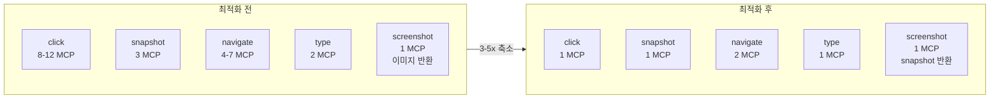

# MCP(Model Context Protocol)로 Agent 속도 3-5x 개선

## 문제: 클릭 한 번에 MCP 호출 12번

Agent의 정확도를 올린 후 다음 병목은 **속도**였다. 사용자가 "상품 등록해줘"라고 하면 Agent가 수십 번의 브라우저 조작을 하는데, 각 조작마다 불필요한 MCP 호출이 쌓여 전체 실행 시간이 매우 느렸다.

클릭 한 번의 MCP 호출 과정을 추적해보니:

```
1. browser_click (실제 클릭)         -- 필수
2. waitForLoadState (페이지 로드 대기) -- 모든 클릭에 불필요
3. browser_tabs (탭 목록 확인)        -- 팝업 감지용
4. browser_tabs close (팝업 탭 닫기)  -- 팝업이 없으면 낭비
5. browser_tabs select (메인 탭 복귀) -- 팝업이 없으면 낭비
6. waitForLoadState (탭 전환 후 로드)  -- 팝업이 없으면 낭비
7. browser_evaluate (page info 추출)  -- 중복 정보
8. ~ 추가 에러 처리 MCP 호출들
```

**클릭 1회에 MCP 8~12회 호출**. snapshot, navigate도 비슷한 문제가 있었다. Agent가 15라운드를 실행하면 수백 번의 MCP 호출이 발생하고, 각 호출마다 Playwright MCP 서버와의 JSON-RPC 왕복이 있으니 체감 속도가 매우 느렸다.

```
# 커밋: perf: Agent MCP 호출 3-5x 축소 -- Claude Code 수준 속도 달성
# 날짜: 2026-02-09 00:17
```

## 도구별 MCP 호출 최적화

### click: 8-12 MCP -> 1

최적화의 핵심 원칙: **LLM이 필요할 때 직접 도구를 호출하게 하라**. 클릭 후 탭 관리, 페이지 정보 추출을 미리 해주지 않아도 된다.

```typescript
// 최적화 전: click 후 자동 처리
case 'click': {
    result = await browserManager.clickByRef(action.args.ref);
    await browserManager.waitForLoadState('load', 5000);          // MCP 2
    lastSnapshotRef.current = '';

    // 탭 관리
    const tabResult = await browserManager.callTool('browser_tabs', // MCP 3
        { action: 'list' });
    const tabLines = tabResult.data.split('\n').filter(l => l.trim());
    if (tabLines.length > 1) {
        for (let i = tabLines.length - 1; i >= 1; i--) {
            await browserManager.callTool('browser_tabs',           // MCP 4,5,...
                { action: 'close', index: i });
        }
        await browserManager.callTool('browser_tabs',              // MCP 6
            { action: 'select', index: 0 });
        await browserManager.waitForLoadState('load', 3000);       // MCP 7
    }

    // 페이지 정보
    const pageInfo = await browserManager.evaluate(                // MCP 8
        '({ title: document.title, url: location.href })');
    // ...alert 감지 등 추가 MCP 호출들
    break;
}

// 최적화 후: click만 실행
case 'click': {
    result = await browserManager.clickByRef(action.args.ref);
    // 끝. 나머지는 LLM이 필요하면 직접 호출
    break;
}
```

제거된 항목과 이유:

| 제거 항목 | 이유 |
|-----------|------|
| `waitForLoadState` | 모든 클릭이 페이지를 로드하지 않음. SPA에서는 불필요 |
| 자동 탭 관리 | 팝업이 없으면 100% 낭비. LLM이 `close_extra_tabs`를 직접 호출 |
| `browser_evaluate` (page info) | Playwright snapshot이 이미 포함 |
| alert 감지 | 발생 빈도 낮음. 필요하면 LLM이 `handle_dialog` 사용 |

### snapshot: 3 MCP -> 1

```typescript
// 최적화 전: snapshot + 탭 정보 + 페이지 정보
case 'snapshot': {
    result = await browserManager.snapshot();                       // MCP 1
    let snapshotHeader = '';
    const tabResult = await browserManager.callTool('browser_tabs', // MCP 2
        { action: 'list' });
    snapshotHeader += `[Open tabs]\n${tabResult.data}\n`;
    const pageInfo = await browserManager.evaluate(                 // MCP 3
        '({ title: document.title, url: location.href })');
    snapshotHeader += `[Current page] ${pageInfo.data}\n`;
    result.data = snapshotHeader + result.data;
    break;
}

// 최적화 후: snapshot만 실행
case 'snapshot': {
    result = await browserManager.snapshot();
    // Playwright snapshot이 이미 탭/페이지 메타데이터를 포함
    break;
}
```

Playwright MCP의 `browser_snapshot`은 이미 현재 탭 정보와 URL을 접근성 트리에 포함한다. 별도로 `browser_tabs`와 `evaluate`를 호출할 필요가 없다.

### navigate: 4-7 MCP -> 2

```typescript
// 최적화 전
case 'navigate': {
    result = await browserManager.navigate(action.args.url);       // MCP 1
    await browserManager.waitForLoadState('load', 10000);          // MCP 2
    // 탭 관리 3-5회 MCP...
    // 페이지 정보 1회 MCP...
    break;
}

// 최적화 후: navigate + waitForLoadState만
case 'navigate': {
    result = await browserManager.navigate(action.args.url);
    if (result.success) {
        setCurrentUrl(action.args.url);
        // navigate는 전체 페이지 로드이므로 waitForLoadState 유지
        await browserManager.waitForLoadState('load', 8000);
        lastSnapshotRef.current = '';
    }
    break;
}
```

navigate는 전체 페이지 로드이므로 `waitForLoadState`만 유지하고 나머지를 제거했다.

### type: 2 MCP -> 1

```typescript
// 최적화 전: type + submit 후 alert 감지
case 'type': {
    result = await browserManager.typeByRef(ref, text);            // MCP 1
    // submit 키워드가 있으면 alert 감지
    if (text.toLowerCase().includes('submit')) {
        await browserManager.evaluate('...');                      // MCP 2
    }
    break;
}

// 최적화 후: type만
case 'type': {
    result = await browserManager.typeByRef(ref, text);
    break;
}
```

### screenshot -> snapshot 자동 전환

```typescript
// LLM은 이미지를 볼 수 없으므로 snapshot으로 자동 전환
case 'screenshot': {
    result = await browserManager.snapshot();
    // screenshot이 아닌 snapshot을 반환
    break;
}
```

LLM이 `screenshot`을 요청하면 `snapshot`으로 자동 전환한다. 이미지 데이터는 LLM에게 무의미하고, snapshot의 접근성 트리가 훨씬 유용하다.

## close_extra_tabs: Lazy Tab Management

자동 탭 관리를 제거했지만, 팝업 탭을 처리하는 수단은 필요하다. LLM이 명시적으로 호출하는 `close_extra_tabs` 도구를 추가했다.

```typescript
case 'close_extra_tabs': {
    // 팝업 탭 모두 닫고 메인 탭(0번) 복귀
    const tabResult = await browserManager.callTool('browser_tabs',
        { action: 'list' });
    if (tabResult.success && typeof tabResult.data === 'string') {
        const tabLines = tabResult.data.split('\n').filter(l => l.trim());
        if (tabLines.length > 1) {
            for (let i = tabLines.length - 1; i >= 1; i--) {
                await browserManager.callTool('browser_tabs',
                    { action: 'close', index: i });
            }
            await browserManager.callTool('browser_tabs',
                { action: 'select', index: 0 });
            lastSnapshotRef.current = '';
            return {
                success: true,
                output: `Closed ${tabLines.length - 1} extra tab(s), returned to main tab`
            };
        }
        return { success: true, output: 'No extra tabs to close' };
    }
    return { success: true, output: 'Tab check completed' };
}
```

이것이 "Lazy Tab Management"의 핵심이다. 매 클릭마다 자동으로 탭을 정리하는 대신, LLM이 팝업을 인식했을 때만 `close_extra_tabs`를 호출한다. 대부분의 클릭에서는 팝업이 발생하지 않으므로 MCP 호출을 대폭 절약한다.

## SYSTEM_PROMPT 분리: FULL vs COMPACT (97% 축소)

매 라운드마다 전체 시스템 프롬프트(약 3,000자)를 전송하면 토큰 낭비가 심하다. 첫 라운드에만 전체를 보내고, 이후에는 핵심 규칙만 담은 축약 프롬프트(약 500자)를 사용한다.

```typescript
// 전체 시스템 프롬프트 (~3,000자) -- 첫 라운드에만
const SYSTEM_PROMPT_FULL = `당신은 브라우저 자동화 에이전트입니다.
반드시 <action> 태그로 브라우저를 직접 조작하세요.

## 작업 방식: Snapshot -> Ref -> 실행
1. snapshot으로 접근성 트리 확인 -> 각 요소에 ref 번호 부여됨
2. ref 번호로 click, type 등 실행
3. 한 응답에 여러 <action> 가능

## 도구 목록
<action>{"tool": "snapshot"}</action> -- 전체 접근성 트리
<action>{"tool": "focused_snapshot", "selector": "CSS선택자"}</action>
<action>{"tool": "click", "ref": "e5"}</action>
<action>{"tool": "type", "ref": "e5", "text": "값"}</action>
...

## 중요 규칙
- 검색 필드: 돋보기 버튼 클릭 -> 팝업에서 선택
- 팝업 처리: Escape -> snapshot으로 닫기 버튼 찾기
- 동적 UI: focused_snapshot 사용
...`;

// 축약 시스템 프롬프트 (~500자) -- 2라운드 이후
const SYSTEM_PROMPT_COMPACT = `브라우저 자동화 에이전트. 반드시 <action> 태그로 도구 호출.
도구: snapshot, click(ref), type(ref,text), select(ref,values),
press_key(key), navigate(url), handle_dialog(accept),
close_extra_tabs, tab_list, tab_select(index), hover(ref),
wait(ms), focused_snapshot(selector), file_upload(description)

규칙:
- snapshot의 ref 번호 사용. 텍스트만 답하지 말고 <action> 실행.
- 같은 작업 3회 반복 금지. 검색엔진 이동 금지.
- 클릭/입력 후 화면 변화 확인 -> snapshot 다시 (ref 번호 변경됨).
- 검색 선택 필드: 돋보기 버튼 클릭 -> 팝업에서 선택.
- [NEED_HELP]로 도움 요청.`;
```

```typescript
// 사용 로직
const isFirstRound = conversation.filter(m => m.role === 'tool').length === 0;
if (isFirstRound) {
    parts.push(`[시스템 지시]\n${SYSTEM_PROMPT_FULL}`);
} else {
    parts.push(`[시스템 지시]\n${SYSTEM_PROMPT_COMPACT}`);
}
```

첫 라운드에서 LLM이 도구 사용법과 규칙을 학습하면, 이후에는 도구 목록과 핵심 규칙만으로 충분하다. 이 분리만으로 매 라운드 약 2,500자(~97%)를 절약한다.

## KEEP_FULL_TOOL_RESULTS: 1 -> 2

컨텍스트 슬라이딩 윈도우에서 전체 유지하는 tool 결과 수를 1에서 2로 늘렸다.

```typescript
// 변경 전
const KEEP_FULL_TOOL_RESULTS = 1;

// 변경 후
const KEEP_FULL_TOOL_RESULTS = 2;
```

이유: LLM이 "이전 snapshot에서 본 ref=e5를 클릭하겠습니다"라고 하려면 최근 2개의 snapshot을 볼 수 있어야 한다. 1개만 유지하면 바로 직전의 snapshot만 참조할 수 있어 맥락 전환이 필요한 작업에서 실패한다.

## 전체 최적화 결과



| 도구 | 이전 MCP 호출 | 이후 MCP 호출 | 축소 비율 |
|------|:------------:|:------------:|:---------:|
| click | 8-12 | 1 | 8-12x |
| snapshot | 3 | 1 | 3x |
| navigate | 4-7 | 2 | 2-3.5x |
| type | 2 | 1 | 2x |
| screenshot | 1 (이미지) | 1 (snapshot) | 1x (품질 향상) |

Agent가 15라운드를 실행할 때 도구별 호출 빈도를 가정하면:

- click 30회 x 10 = 300 → click 30회 x 1 = 30
- snapshot 15회 x 3 = 45 → snapshot 15회 x 1 = 15
- navigate 5회 x 5 = 25 → navigate 5회 x 2 = 10
- type 20회 x 2 = 40 → type 20회 x 1 = 20

**총 MCP 호출: 410 → 75 (약 5.5x 축소)**

여기에 SYSTEM_PROMPT 97% 축소와 KEEP_FULL_TOOL_RESULTS 조정을 더하면 전체적으로 **3-5x 속도 개선**을 달성했다.

## Claude Code와의 비교

이 최적화의 설계 원칙은 Claude Code의 도구 사용 패턴에서 영감을 받았다:

1. **도구는 최소한으로**: 필요한 MCP만 호출. 부가 정보는 LLM이 필요할 때 직접 요청
2. **Lazy Evaluation**: 탭 관리, 에러 감지 등을 미리 하지 않고 LLM이 판단
3. **컨텍스트 관리**: 원본을 보존하되 오래된 것은 요약
4. **프롬프트 분리**: 첫 호출에만 전체 컨텍스트, 이후는 축약

Claude Code가 파일을 읽을 때도 전체 파일을 항상 읽지 않고 필요한 부분만 요청하듯이, Agent도 브라우저 상태를 매번 전체 파악하지 않고 필요할 때 snapshot을 찍는다. "모든 것을 미리 알아둘 필요는 없다"는 원칙이다.

## 결과

속도 최적화 후 사용자 경험이 크게 달라졌다. Agent가 한 작업을 수행하는 데 걸리는 시간이 체감상 3-5배 빨라졌고, 특히 클릭이 많은 폼 입력 작업에서 효과가 컸다. MCP 호출 수가 줄어든 만큼 JSON-RPC 왕복도 줄어들고, 토큰도 절약되어 비용도 감소했다.

핵심 교훈:

- **불필요한 사전 처리 제거**: "혹시 필요할까봐" 미리 해두는 것은 대부분 낭비
- **LLM의 판단을 신뢰**: Agent가 필요한 도구를 스스로 호출할 수 있다
- **프롬프트 경제학**: 반복되는 프롬프트는 축약 가능. LLM은 첫 라운드에서 규칙을 학습한다
- **Lazy > Eager**: 탭 관리, 에러 감지 등을 즉시 처리하지 않고 필요할 때만 처리
