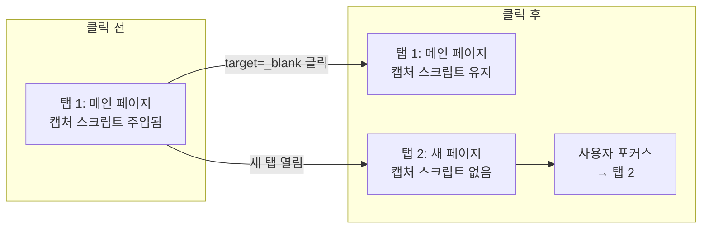
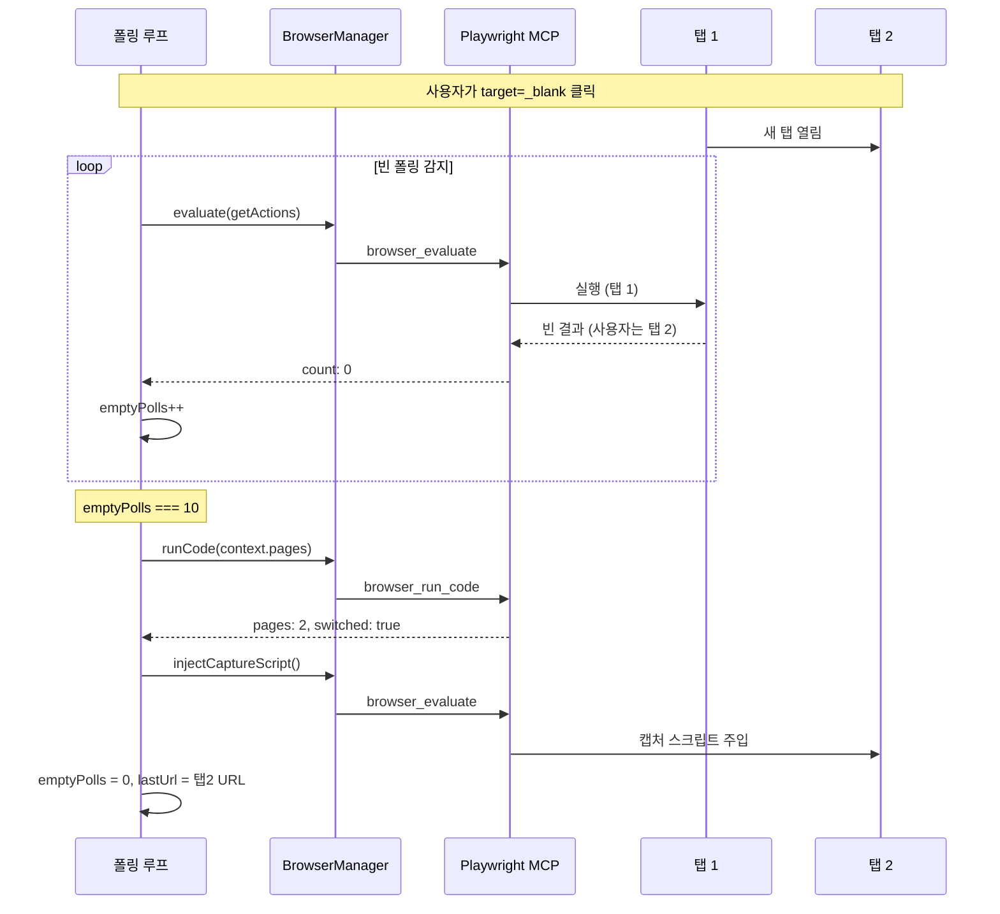

# 새 탭 감지 및 자동 전환: 브라우저 자동화의 까다로운 문제

## 개요

브라우저 자동화에서 "새 탭"은 예상보다 까다로운 문제를 만든다. 사용자가 `target="_blank"` 링크를 클릭하면 새 탭이 열리는데, Playwright의 기본 컨텍스트는 여전히 원래 탭을 가리킨다. 캡처 스크립트도 원래 탭에만 주입되어 있으므로, 새 탭에서의 사용자 조작은 아무것도 기록되지 않는다.

문제는 새 탭이 열리는 시점을 직접 감지할 방법이 제한적이라는 점이다. Playwright MCP를 통한 간접 제어 환경에서는 `page.on('popup')` 같은 이벤트 리스너를 실시간으로 수신할 수 없다. MCP 호출은 요청-응답 방식이므로, "방금 새 탭이 열렸습니다" 같은 push 알림을 받을 수 없다.

XGEN 2.0에서는 이 문제를 "빈 폴링 휴리스틱"으로 해결했다. 캡처 스크립트의 폴링이 연속으로 빈 결과를 반환하면, 사용자가 새 탭으로 이동했을 가능성을 추론하고, `context.pages()`로 확인 후 자동 전환한다.

## 문제 분석

### 새 탭이 만드는 문제들



새 탭이 열리면 3가지 문제가 동시에 발생한다.

| 문제 | 원인 | 영향 |
|------|------|------|
| 캡처 스크립트 미주입 | 새 탭은 별도의 page 객체 | 새 탭에서의 조작 미기록 |
| 폴링 대상 불일치 | evaluate가 원래 탭에서 실행 | 빈 결과만 반환 |
| URL 추적 불일치 | currentUrl이 원래 탭 URL | 네비게이션 기록 오류 |

### 이벤트 기반 감지가 불가능한 이유

일반적인 Playwright 코드에서는 `page.on('popup')` 이벤트로 새 탭을 즉시 감지할 수 있다. 하지만 XGEN의 구조에서는 이 방식이 작동하지 않는다.

MCP(Model Context Protocol)는 요청-응답 기반이다. 프론트엔드가 `browser_evaluate`를 호출하면 결과를 받고, 다음 호출을 보내는 구조다. MCP 서버 측에서 "새 탭이 열렸다"는 이벤트를 클라이언트에 push할 수 있는 채널이 없다. JSON-RPC over stdin/stdout 통신이므로, 서버 → 클라이언트 방향의 비동기 알림이 지원되지 않는다.

따라서 폴링 기반의 간접 감지가 유일한 방법이다.

## 아키텍처

### 감지 → 전환 → 재주입 흐름



## 핵심 구현

### checkAndSwitchToNewTab 함수

Playwright의 `context.pages()`로 열린 탭 목록을 조회하고, 2개 이상이면 마지막 탭으로 전환한다.

```typescript
// useTauriMCPRecording.ts
const checkAndSwitchToNewTab = useCallback(async (): Promise<boolean> => {
    try {
        const code = `async (page) => {
            const context = page.context();
            const pages = context.pages();
            if (pages.length > 1) {
                const newPage = pages[pages.length - 1];
                await newPage.bringToFront();
                return JSON.stringify({
                    switched: true,
                    url: newPage.url(),
                    tabCount: pages.length
                });
            }
            return JSON.stringify({
                switched: false,
                tabCount: pages.length
            });
        }`;

        const result = await browserManager.runCode(code);
        const parsed = parseTabResult(result);

        if (parsed?.switched) {
            lastUrlRef.current = parsed.url;
            setCurrentUrl(parsed.url);
            // 새 탭에 캡처 스크립트 주입
            await injectCaptureScript();
            return true;
        }
    } catch (err) {
        console.warn('[TauriMCPRecording] Tab check error:', err);
    }
    return false;
}, [injectCaptureScript]);
```

`pages[pages.length - 1]`로 마지막에 열린 탭을 선택하는 이유는, `target="_blank"`로 열린 탭이 항상 pages 배열의 끝에 추가되기 때문이다.

`bringToFront()`는 해당 탭을 활성 탭으로 만드는 Playwright API다. 이후 MCP의 도구 호출(evaluate, click 등)이 이 탭을 대상으로 실행된다.

```
# 커밋: feat: detect and switch to new browser tabs during recording
# 날짜: 2026-02-08 14:25
```

### 빈 폴링 휴리스틱

폴링 루프에서 캡처 스크립트의 `getActions()` 호출이 연속으로 빈 결과를 반환하면, 새 탭이 열렸을 가능성을 의심한다.

```typescript
let emptyPolls = 0;
const EMPTY_POLLS_BEFORE_TAB_CHECK = 10;

while (active) {
    const result = await collectActions();

    if (result.count === 0) {
        emptyPolls++;
        if (emptyPolls === EMPTY_POLLS_BEFORE_TAB_CHECK) {
            const switched = await checkAndSwitchToNewTab();
            if (switched) {
                emptyPolls = 0;
                continue;
            }
        }
    } else {
        emptyPolls = 0;
    }

    await sleep(500);
}
```

임계값 10은 500ms 폴링 기준으로 약 5초에 해당한다. 이 시간은 다음을 고려해서 결정했다.

- **너무 짧으면**: 사용자가 잠시 멈춘 것(화면 읽기, 생각 중)을 새 탭으로 오인
- **너무 길면**: 새 탭에서의 조작이 오래 기록되지 않음
- **5초**: 사용자가 새 탭을 열고 첫 조작을 시작하기까지의 평균 시간

### JSON 이중 이스케이프 파싱

`browser_run_code`의 반환값이 MCP 레이어를 거치면서 이중 또는 삼중으로 JSON 이스케이프되는 경우가 있었다. 이를 처리하기 위해 3단계 파싱 전략을 사용한다.

```typescript
const parseTabResult = (rawResult: any): TabCheckResult | null => {
    let dataStr = typeof rawResult === 'string'
        ? rawResult
        : rawResult?.data || rawResult?.content || '';

    // 1단계: 외부 따옴표 제거
    if (dataStr.startsWith('"') && dataStr.endsWith('"')) {
        try { dataStr = JSON.parse(dataStr); } catch (_) {}
    }

    // 2단계: 일반 JSON 파싱
    try { return JSON.parse(dataStr); } catch (_) {}

    // 3단계: 이스케이프 문자 정리 후 재시도
    if (typeof dataStr === 'string' && dataStr.startsWith('{')) {
        try {
            return JSON.parse(dataStr.replace(/\\"/g, '"'));
        } catch (_) {}
    }

    // 4단계: regex로 직접 추출 (최후 수단)
    const switchedMatch = dataStr.match(/switched["\s:]+(\w+)/);
    const urlMatch = dataStr.match(/url["\s:]+["']([^"']+)["']/);
    const tabCountMatch = dataStr.match(/tabCount["\s:]+(\d+)/);

    if (switchedMatch) {
        return {
            switched: switchedMatch[1] === 'true',
            url: urlMatch?.[1] || '',
            tabCount: parseInt(tabCountMatch?.[1] || '1'),
        };
    }

    return null;
};
```

```
# 커밋: fix: robust JSON parsing for new tab detection + use mappedType for check/radio
# 날짜: 2026-02-08 14:34
```

이 4단계 파싱이 필요했던 이유는 MCP 응답 형식이 도구마다 다르기 때문이다. `browser_evaluate`는 JavaScript 값을 직접 반환하지만, `browser_run_code`는 문자열로 직렬화된 결과를 반환한다. Rust IPC 레이어를 한 번 더 거치면서 추가 이스케이프가 발생하는 경우도 있었다.

### Agent 모드에서의 탭 관리

시나리오 녹화 모드와 별개로, Agent 모드에서도 탭 관리가 필요했다. Agent가 클릭한 링크가 새 탭을 여는 경우, Agent의 후속 액션이 원래 탭에서 실행되면서 의도한 요소를 찾지 못하는 문제가 발생했다.

```typescript
// Agent 모드: 클릭/navigate 후 팝업 탭 감지
case 'click': {
    result = await browserManager.clickByRef(action.args.ref);

    // 클릭 후 새 탭이 열렸는지 확인
    const tabCheck = await checkAndSwitchToNewTab();
    if (tabCheck) {
        // 새 탭으로 전환 완료 → 스크롤바 CSS 재주입
        await injectScrollbarCSS();
    }
    break;
}
```

```
# 커밋: feat: Agent 모드 성능 대폭 개선 - 클릭/navigate 후 팝업 탭 자동 감지
# 날짜: 2026-02-08 19:20
```

### 팝업 탭 자동 닫기

일부 사이트에서는 팝업 형태로 새 탭이 열리고, 작업 완료 후 자동으로 닫히지 않는다. 이런 경우 탭이 계속 누적되어 `context.pages()`의 결과가 혼란스러워진다.

Agent 모드에서는 "0번 탭(메인 탭) 유지" 전략을 적용했다. 새 탭에서 작업이 완료되면 해당 탭을 닫고 메인 탭으로 돌아온다.

```typescript
// 팝업 탭 닫기 + 메인 탭 복귀
const closePopupTab = async (): Promise<void> => {
    const code = `async (page) => {
        const context = page.context();
        const pages = context.pages();
        if (pages.length > 1) {
            // 현재 탭(마지막 탭) 닫기
            await pages[pages.length - 1].close();
            // 메인 탭(0번)으로 포커스
            await pages[0].bringToFront();
            return JSON.stringify({ closed: true, remaining: pages.length - 1 });
        }
        return JSON.stringify({ closed: false, remaining: pages.length });
    }`;
    await browserManager.runCode(code);
};
```

### Lazy Tab Management

MCP 호출을 줄이기 위해, 매 클릭마다 탭을 확인하는 대신, 후속 액션이 실패했을 때만 탭 전환을 시도하는 lazy 전략도 도입했다.

```
# 커밋: perf: Agent MCP 호출 3-5x 축소 - Claude Code 수준 속도 달성
# 날짜: 2026-02-09 00:17
```

이전에는 모든 클릭 후에 `checkAndSwitchToNewTab`을 호출했는데, 대부분의 클릭은 새 탭을 열지 않으므로 불필요한 MCP 호출이었다. 후속 snapshot이나 click이 "요소를 찾을 수 없음" 에러를 반환했을 때만 탭 전환을 시도하는 것이 더 효율적이다.

## 트러블슈팅

### Agent의 검색엔진 이동

Agent가 "Google에서 검색해보겠습니다"라고 판단하고 검색엔진으로 navigate하는 문제가 있었다. 이건 새 탭 문제는 아니지만, 불필요한 네비게이션이라는 점에서 관련이 있다.

시스템 프롬프트에 "검색엔진 이동 금지" 규칙을 추가하고, navigate 도구에 URL 블랙리스트 가드를 넣어서 해결했다.

```
# 커밋: fix: prevent agent from navigating to search engines - use current page
# 날짜: 2026-02-08 17:53 (xgen-app)
```

### 탭 전환 후 캡처 스크립트 주입 실패

새 탭으로 전환한 직후에 `injectCaptureScript()`를 호출하면, 페이지가 아직 로드 중이어서 주입이 실패하는 경우가 있었다.

`waitForLoadState('domcontentloaded')` 호출 후 주입하도록 순서를 조정했다.

```typescript
if (parsed?.switched) {
    // 새 탭 페이지 로드 대기
    await browserManager.waitForLoadState('domcontentloaded', 5000);
    // 캡처 스크립트 주입
    await injectCaptureScript();
}
```

### addInitScript의 탭 간 공유 한계

`addInitScript`로 등록한 스크립트는 해당 `BrowserContext`의 모든 페이지에 적용된다고 Playwright 문서에 나와 있다. 하지만 실제로는 `target="_blank"`로 열린 새 탭에 항상 적용되지는 않았다. 특히 크로스 오리진 탭에서 적용되지 않는 경우가 있었다.

이 때문에 `addInitScript`에만 의존하지 않고, 탭 전환 시 수동으로 캡처 스크립트를 주입하는 방식을 병행한다.

### macOS 빌드에서의 탭 관리

macOS에서 Tauri 빌드 시 Playwright Chromium의 탭 동작이 Windows/Linux와 약간 달랐다. `bringToFront()`가 macOS에서는 창 포커스까지 변경해서, Tauri 앱 자체의 포커스가 빠져나가는 문제가 있었다.

```
# 커밋: feat: Agent 데이터 자동화 + macOS 빌드 안정성 개선
# 날짜: 2026-02-11 08:30
```

## 결과 및 회고

### 탭 관리 시나리오별 대응

| 시나리오 | 감지 방식 | 대응 |
|----------|-----------|------|
| `target="_blank"` 클릭 | 빈 폴링 10회 | 자동 전환 + 스크립트 주입 |
| `window.open()` | 빈 폴링 10회 | 자동 전환 + 스크립트 주입 |
| 팝업 후 자동 닫힘 | pages.length 감소 | 메인 탭으로 복귀 |
| Agent 클릭 → 새 탭 | 후속 액션 실패 시 | lazy 감지 + 전환 |

### 설계 원칙

**"push가 없으면 poll로 해결하라"**: MCP의 요청-응답 구조에서 이벤트 push가 불가능하다면, 폴링으로 상태 변화를 감지하는 것이 현실적이다. 폴링 간격과 임계값을 적절히 조정하면 실시간에 가까운 반응 속도를 달성할 수 있다.

**"휴리스틱은 명시적이어야 한다"**: "빈 폴링 10회 = 새 탭 가능성"이라는 휴리스틱을 코드에 상수로 명시하고, 왜 그 값인지 주석으로 설명했다. 매직 넘버를 숨기지 않고 드러내면 나중에 튜닝할 때 쉽다.

**"파싱은 방어적으로"**: MCP 레이어를 거치면서 JSON이 이중/삼중 이스케이프될 수 있다. 4단계 파싱(직접 → 언이스케이프 → replace → regex)으로 모든 경우를 커버한다. 가장 바깥 레이어부터 벗기는 순서가 중요하다.

**"lazy가 eager보다 낫다"**: 매 클릭 후 탭을 확인하는 대신, 후속 액션이 실패했을 때만 확인하는 lazy 전략이 MCP 호출을 크게 줄인다. 대부분의 클릭은 새 탭을 열지 않기 때문이다.
