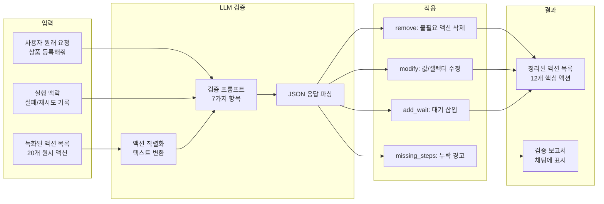
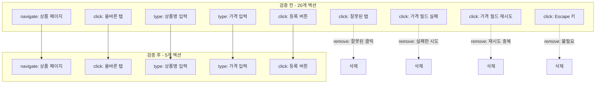

# 시나리오 검증(Validation) 자동화: 녹화 -> 실행 -> 검증 파이프라인

## 개요

AI Agent가 브라우저를 자동 조작하면서 시나리오를 녹화하면, 녹화된 액션 목록에는 불필요한 노이즈가 섞여 있다. Agent가 틀린 버튼을 클릭한 후 올바른 버튼을 다시 클릭하면 두 클릭 모두 기록된다. 같은 요소를 연속으로 클릭하는 중복, 탐색 과정에서의 시행착오 클릭, 실패 후 재시도 패턴 등이 그대로 남는다.

사람이 수동으로 정리하면 시간이 걸리고 실수하기 쉽다. XGEN 2.0에서는 LLM에게 녹화된 액션 목록을 전달하여 자동으로 검증하고 정리하는 `validateActions` 기능을 구현했다. LLM은 원래 사용자 요청과 실행 맥락을 함께 분석하여, 성공한 최소 시퀀스만 남기고, 누락된 단계를 경고하며, 필요한 대기(wait)를 자동 삽입한다.

## 아키텍처

### 검증 파이프라인 흐름



### 검증 전후 비교 예시



## 핵심 구현

### 1단계: 액션 직렬화

녹화된 액션 배열을 LLM이 이해할 수 있는 텍스트 형식으로 변환한다.

```typescript
// useAgentScenarioBuilder.ts — validateActions 내부
const actionsSummary = actions.map((a, i) => {
    const parts = [`${i + 1}. [${a.type}]`];
    if (a.selector) parts.push(`selector="${a.selector}"`);
    if (a.url) parts.push(`url="${a.url}"`);
    if (a.value) parts.push(`value="${a.value}"`);
    if (a.element_tag) parts.push(`tag=${a.element_tag}`);
    if (a.element_text) parts.push(`text="${a.element_text}"`);
    return parts.join(' ');
}).join('\n');
```

이렇게 변환하면 LLM이 각 액션의 타입, 대상 요소, 입력값을 한눈에 파악할 수 있다. `element_tag`과 `element_text`까지 포함하는 이유는, 셀렉터만으로는 어떤 요소인지 알 수 없기 때문이다. `#btn-1`보다 `tag=button text="등록"`이 LLM에게 더 유의미하다.

### 2단계: 맥락 수집

검증은 액션 목록만으로는 불충분하다. 사용자의 원래 요청과, Agent 실행 중 발생한 에러를 함께 전달해야 정확한 판단이 가능하다.

```typescript
// 사용자의 원래 요청 (첫 5개 user 메시지)
const userRequests = conversationRef.current
    .filter(m => m.role === 'user')
    .map(m => m.content)
    .slice(0, 5)
    .join('\n---\n');

// 실행 중 실패/에러 기록 수집
const chatContext = conversationRef.current
    .filter(m => m.role === 'assistant' || m.role === 'tool')
    .map(m => {
        if (m.role === 'tool') {
            const lines = m.content.split('\n');
            const failures = lines.filter(l =>
                l.includes('Failed') || l.includes('Error') || l.includes('실패')
            );
            if (failures.length > 0) return `[실패] ${failures.join('; ')}`;
            return null;
        }
        // assistant 메시지는 200자로 요약
        if (m.content.length > 200)
            return m.content.substring(0, 200) + '...';
        return m.content;
    })
    .filter(Boolean)
    .slice(-30)  // 최근 30개만
    .join('\n');
```

실패 기록을 수집하는 이유는 "실패 후 재시도" 패턴을 감지하기 위해서다. 도구 결과에 `Failed`가 포함된 메시지가 있으면, 그 직전의 액션이 실패한 시도이고, 직후의 같은 타입 액션이 재시도일 가능성이 높다.

### 3단계: LLM 검증 프롬프트

7가지 검증 항목을 정의하고, JSON 형식으로 변경 사항을 요청한다.

```typescript
const validatePrompt = `아래는 AI 에이전트가 브라우저를 조작하며 기록한 시나리오입니다.
이 시나리오를 검증하고 정리해주세요.

## 사용자 원래 요청
${userRequests}

## 실행 맥락 (에러/실패 기록)
${chatContext}

## 액션 목록
${actionsSummary}

## 검증 및 정리 항목 (중요도 순)
1. **사용자 요청 부합 여부**: 요청된 작업 중 누락된 단계가 있으면 summary에 경고
2. **실패 후 재시도 패턴**: 같은 요소에 대한 실패→재시도가 있으면 성공한 마지막 시도만 남기기
3. **탐색/시행착오 액션**: 올바른 요소를 찾기 위한 여러 시도 중 최종 성공만 남기기
4. **중복 액션**: 같은 요소에 대한 연속 클릭, 같은 값의 연속 입력 등
5. **불필요한 액션**: Escape 키 입력, 빈 값 입력, 의미 없는 hover 등
6. **셀렉터 문제**: selector가 비어있거나 접근성 트리 설명인 경우 경고
7. **누락된 대기**: 페이지 전환 후 로드 대기가 필요한 곳

## 응답 형식 (JSON만, 설명 없이)
{
  "changes": [
    {"action": "remove", "index": 5, "reason": "실패한 클릭 시도"},
    {"action": "modify", "index": 3, "field": "value", "newValue": "수정값", "reason": "오타 수정"},
    {"action": "add_wait", "after_index": 4, "ms": 2000, "reason": "페이지 로드 대기"}
  ],
  "missing_steps": ["저장 버튼 클릭이 누락되었습니다"],
  "summary": "5개 액션 삭제, 1개 수정, 1개 대기 추가"
}`;
```

프롬프트에서 "중요도 순"으로 정렬한 이유가 있다. LLM이 토큰 한도에 도달하면 뒤쪽 항목을 생략할 수 있으므로, 가장 중요한 "누락 단계 감지"와 "재시도 정리"를 앞에 배치했다.

### 4단계: 변경 사항 적용

LLM의 응답을 파싱하여 3가지 유형의 변경을 적용한다.

```typescript
setActions(prev => {
    let updated = [...prev];
    const removeIndices = new Set<number>();
    const addWaits: { afterIndex: number; ms: number }[] = [];

    for (const change of parsed.changes) {
        const idx = (change.index ?? change.after_index ?? 0) - 1;

        if (change.action === 'remove') {
            removeIndices.add(idx);
        } else if (change.action === 'modify') {
            if (updated[idx]) {
                (updated[idx] as any)[change.field] = change.newValue;
            }
        } else if (change.action === 'add_wait') {
            addWaits.push({
                afterIndex: idx,
                ms: change.ms || 2000
            });
        }
    }

    // 삭제 적용 (인덱스 역순으로 처리하지 않아도 Set 기반이라 안전)
    updated = updated.filter((_, i) => !removeIndices.has(i));

    // wait 삽입 (역순으로 삽입하여 인덱스 밀림 방지)
    addWaits.sort((a, b) => b.afterIndex - a.afterIndex);
    for (const w of addWaits) {
        const insertAt = Math.min(w.afterIndex + 1, updated.length);
        updated.splice(insertAt, 0, {
            action_id: `action_${Date.now()}_wait_${insertAt}`,
            type: 'wait',
            value: String(w.ms),
            selector: '',
            selector_alternatives: [],
            value_type: 'literal',
            in_loop: false,
        });
    }

    return updated;
});
```

wait 삽입 시 **역순** 처리가 핵심이다. 앞쪽에 먼저 삽입하면 뒤쪽 인덱스가 밀려서 잘못된 위치에 삽입된다. `afterIndex` 내림차순으로 정렬하면 뒤에서부터 삽입하므로 앞쪽 인덱스에 영향을 주지 않는다.

### JSON 파싱 실패 대응

LLM이 항상 완벽한 JSON을 반환하지는 않는다. 마크다운 코드 블록으로 감싸거나, 앞뒤에 설명 텍스트를 추가하는 경우가 있다.

```typescript
// JSON 추출 함수
const extractJSON = (text: string): string => {
    // 코드 블록 내부 JSON 추출
    const codeBlockMatch = text.match(/```(?:json)?\s*\n?([\s\S]*?)\n?```/);
    if (codeBlockMatch) return codeBlockMatch[1].trim();

    // { ... } 직접 추출
    const jsonMatch = text.match(/\{[\s\S]*\}/);
    if (jsonMatch) return jsonMatch[0];

    return text;
};

let parsed;
try {
    parsed = JSON.parse(extractJSON(response));
} catch (e) {
    // 최종 fallback: regex로 changes 배열 추출
    const changesMatch = response.match(/"changes"\s*:\s*\[([\s\S]*?)\]/);
    if (changesMatch) {
        try {
            parsed = { changes: JSON.parse(`[${changesMatch[1]}]`), summary: '' };
        } catch (_) {
            // 파싱 완전 실패 → 검증 건너뛰기
            return;
        }
    }
}
```

### 검증 결과 표시

검증 결과를 Agent 채팅 UI에 메시지로 표시한다. 사용자가 어떤 변경이 이루어졌는지 확인할 수 있다.

```typescript
// 검증 완료 메시지
const validationMsg = {
    role: 'assistant',
    content: `시나리오 검증 완료:\n${parsed.summary}\n\n`
        + (parsed.missing_steps?.length > 0
            ? `누락된 단계:\n${parsed.missing_steps.map(s => `- ${s}`).join('\n')}`
            : '누락된 단계 없음'),
};
setMessages(prev => [...prev, validationMsg]);
```

`missing_steps`가 있으면 사용자에게 경고한다. 예를 들어 "상품 등록"을 요청했는데 "저장 버튼 클릭"이 누락되어 있으면, LLM이 이를 감지하여 알려준다.

## 트러블슈팅

### Pydantic 유효성 검증 오류

검증 파이프라인 이전에, 녹화된 액션을 백엔드에 저장하는 과정에서 Pydantic 유효성 검사가 실패하는 문제가 빈번했다.

**selector_alternatives의 type 필드 불일치**

프론트엔드에서 `'testid'`와 `'aria'` 타입을 생성하는데, 백엔드 Pydantic 모델은 `'id' | 'name' | 'class' | 'css' | 'xpath' | 'text'`만 허용했다.

```typescript
// type 정규화
const normalizeType = (type: string): string => {
    if (type === 'testid' || type === 'aria') return 'css';
    return type;
};
```

```
# 커밋: fix: filter unsupported selector_alternatives types (aria, testid) for backend pydantic validation
# 날짜: 2026-02-08 06:47
# 커밋: fix: selector_alternatives type 'testid'/'aria' -> 'css' (Pydantic 유효성 검증 오류 수정)
# 날짜: 2026-02-09 16:21
```

**in_loop 필드 누락**

엑셀 루프 기능 추가 시 `in_loop` 필드가 필수로 바뀌었는데, 기존 녹화 데이터에는 이 필드가 없었다.

```
# 커밋: fix: add missing in_loop field and sanitize actions for backend pydantic validation
# 날짜: 2026-02-08 12:31
```

### 검증 버튼 + selector_alternatives 보존 버그

검증 결과를 적용할 때 `selector_alternatives`가 누락되는 버그가 있었다. `modify` 액션에서 spread 연산자로 덮어쓰면서 기존 필드가 사라진 것이다.

```
# 커밋: feat: 시나리오 검증 버튼 + selector_alternatives 보존 수정
# 날짜: 2026-02-09 08:12
```

### pause/stop/validate 통합

검증 버튼을 AgentChat UI에 통합할 때, 기존의 pause/stop 버튼과 레이아웃이 충돌했다. 검증은 Agent가 정지 상태일 때만 사용할 수 있으므로, 상태에 따라 버튼 노출을 분기했다.

```
# 커밋: feat: update AgentChat.tsx - pause/stop/validate, overflow fix
# 날짜: 2026-02-08 23:20
```

### 시나리오 검증 강화

초기 검증은 단순 중복 제거 수준이었다. 이후 엑셀 루프 변환과 함께 검증 로직을 강화하여, 루프 대상 액션의 정합성까지 확인하도록 개선했다.

```
# 커밋: feat: 엑셀 루프 변환 + 시나리오 검증 강화
# 날짜: 2026-02-09 08:30
```

## 결과 및 회고

### 검증 효과

실제 운영 환경에서 측정한 결과다.

| 지표 | 검증 전 | 검증 후 |
|------|---------|---------|
| 평균 액션 수 | 20~30개 | 8~15개 |
| 재생 성공률 | 약 60% | 약 85% |
| 불필요 액션 비율 | 30~40% | 5% 이하 |
| 누락 단계 발견율 | - | 약 70% |

### 설계 원칙

**"LLM은 코드 리뷰어처럼 사용하라"**: 사람이 녹화된 시나리오를 리뷰하듯, LLM에게 원래 요청과 실행 맥락을 함께 주면 "이건 실패한 시도다", "이건 중복이다"를 판단할 수 있다. 규칙 기반 정리(연속 중복 제거 등)로는 잡을 수 없는 "의미적 중복"을 LLM이 잡아낸다.

**"맥락이 핵심이다"**: 액션 목록만으로는 어떤 클릭이 실패한 시도이고 어떤 것이 정상인지 구분할 수 없다. 실행 중 에러 기록(`[실패]` 태그)을 함께 전달해야 정확한 판단이 가능하다.

**"3가지 변경 유형이면 충분하다"**: remove, modify, add_wait 3가지로 거의 모든 검증 결과를 표현할 수 있다. 더 복잡한 변경(순서 변경, 분할 등)은 오히려 LLM의 응답 품질을 떨어뜨렸다.

**"역순 삽입은 인덱스 안정성의 기본이다"**: 배열에 여러 요소를 삽입할 때, 앞에서부터 삽입하면 뒤쪽 인덱스가 밀린다. 뒤에서부터 삽입하면 앞쪽에 영향을 주지 않는다. 이 패턴은 코드 에디터의 다중 편집이나 AST 변환에서도 동일하게 적용된다.
