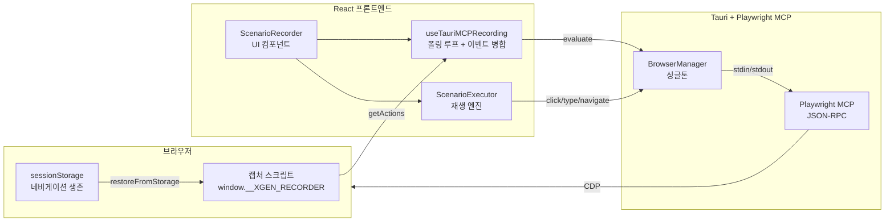
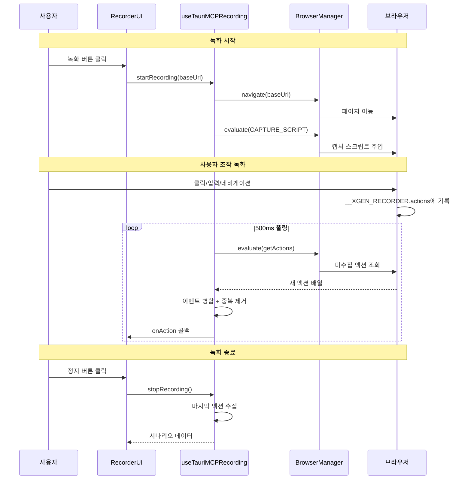

# 시나리오 레코더: 사용자 행동 녹화 및 재생 엔진

## 개요

AI Agent가 브라우저를 자동으로 조작할 수 있다면, 사용자의 브라우저 조작을 녹화해서 나중에 재생할 수도 있어야 한다. XGEN 2.0 데스크톱 앱에 시나리오 레코더를 구현했다. 사용자가 웹사이트에서 클릭, 입력, 네비게이션 등을 수행하면 이를 실시간으로 기록하고, 기록된 시나리오를 자동 재생하거나 Agent 모드에서 활용할 수 있는 시스템이다.

브라우저 녹화 도구는 많지만, 이 프로젝트에서 해결해야 했던 고유한 문제들이 있었다. Playwright MCP를 통한 간접 브라우저 제어 환경에서의 이벤트 캡처, 페이지 네비게이션 시 스크립트 소멸과 이벤트 유실, SPA와 MPA를 모두 지원하는 셀렉터 전략, 그리고 연속 입력 이벤트의 효율적 병합이 그것이다.

## 아키텍처

### 전체 구조

시나리오 레코더는 크게 3개 레이어로 구성된다.



### 녹화-재생 흐름



## 핵심 구현

### 캡처 스크립트 - window.__XGEN_RECORDER

브라우저에 주입되는 캡처 스크립트의 핵심은 전역 객체 `__XGEN_RECORDER`다. 모든 사용자 인터랙션을 capture phase에서 가로채서 배열에 저장한다.

```javascript
var XGEN_RECORDER = {
    paused: false,
    actions: [],
    lastCollectedIndex: 0,
    STORAGE_KEY: '__XGEN_RECORDER_PENDING',

    init: function() {
        this.restoreFromStorage();
        this.attachEventListeners();
    },

    attachEventListeners: function() {
        // capture: true — 이벤트 버블링 전에 잡음
        document.addEventListener('click', function(e) {
            if (!XGEN_RECORDER.paused) XGEN_RECORDER.captureClick(e);
        }, true);
        document.addEventListener('input', function(e) {
            if (!XGEN_RECORDER.paused) XGEN_RECORDER.captureInput(e);
        }, true);
        document.addEventListener('change', function(e) {
            if (!XGEN_RECORDER.paused) XGEN_RECORDER.captureChange(e);
        }, true);
        document.addEventListener('keydown', function(e) {
            if (e.key === 'Enter') {
                XGEN_RECORDER.captureKeypress(e);
            }
        }, true);

        // SPA 네비게이션 감지: pushState/replaceState 오버라이드
        var origPush = history.pushState;
        history.pushState = function() {
            origPush.apply(this, arguments);
            XGEN_RECORDER.captureNavigate(location.href);
        };

        // 페이지 이탈 전 미수집 액션 저장
        window.addEventListener('beforeunload', function() {
            XGEN_RECORDER.saveToStorage();
        });
    },
};
```

`capture: true`를 사용하는 이유가 중요하다. 일반 이벤트 리스너는 bubbling phase에서 실행되는데, React나 Vue 같은 프레임워크가 `stopPropagation()`을 호출하면 리스너까지 이벤트가 도달하지 않는다. Capture phase에서 등록하면 프레임워크의 이벤트 처리보다 먼저 실행되므로 모든 이벤트를 잡을 수 있다.

### 셀렉터 생성 전략

녹화된 액션이 재생 시에도 정확히 같은 요소를 찾으려면, 안정적인 CSS 셀렉터가 필수다. 6단계 우선순위로 셀렉터를 생성한다.

```javascript
generateSelector: function(el) {
    // 1순위: data-testid (가장 안정적, 개발자가 명시적으로 부여)
    if (el.dataset && el.dataset.testid)
        return '[data-testid="' + el.dataset.testid + '"]';

    // 2순위: aria-label (고유한 경우)
    var ariaLabel = el.getAttribute('aria-label');
    if (ariaLabel) {
        var ariaSelector = '[aria-label="' + ariaLabel + '"]';
        if (document.querySelectorAll(ariaSelector).length === 1)
            return ariaSelector;
    }

    // 3순위: id
    if (el.id) return '#' + CSS.escape(el.id);

    // 4순위: name 속성
    if (el.name)
        return el.tagName.toLowerCase() + '[name="' + el.name + '"]';

    // 5순위: 클래스 (CSS module 해시 필터링)
    var classes = Array.from(el.classList)
        .filter(function(c) { return !/^[a-zA-Z][\w]*__[\w]+--[\w]+/.test(c); });
    if (classes.length > 0) {
        var selector = el.tagName.toLowerCase() + '.' + classes.join('.');
        if (document.querySelectorAll(selector).length === 1)
            return selector;
    }

    // 6순위: CSS path (최후의 수단)
    return this.generateCssPath(el);
},
```

5순위에서 CSS Module의 해시 클래스를 필터링하는 부분이 있다. `Button_active__x7k2p` 같은 해시 기반 클래스명은 빌드할 때마다 바뀌므로, 이런 클래스를 셀렉터에 포함하면 다음 배포 후 재생이 깨진다.

추가로 `generateSelectorAlternatives` 함수가 모든 후보를 confidence 점수와 함께 배열로 반환한다. 재생 시 1순위 셀렉터가 실패하면 차순위로 fallback한다.

```javascript
generateSelectorAlternatives: function(el) {
    var alternatives = [];
    if (el.dataset && el.dataset.testid)
        alternatives.push({
            selector: '[data-testid="' + el.dataset.testid + '"]',
            confidence: 0.95
        });
    if (el.id)
        alternatives.push({ selector: '#' + CSS.escape(el.id), confidence: 0.9 });
    // ... 나머지 후보들
    return alternatives;
},
```

### 연속 입력 이벤트 병합

사용자가 텍스트 필드에 "hello"를 입력하면, `input` 이벤트가 5번 발생한다 (h, he, hel, hell, hello). 이를 그대로 기록하면 시나리오가 불필요하게 길어진다.

캡처 스크립트 내부에서 1차 병합을 수행한다.

```javascript
captureInput: function(e) {
    var selector = this.generateSelector(e.target);
    var last = this.actions[this.actions.length - 1];

    // 같은 필드의 연속 input → 마지막 항목의 value만 교체
    if (last && last.action.type === 'input'
        && last.action.selector === selector) {
        last.action.value = e.target.value;
        return;
    }

    this.actions.push({
        type: 'action',
        action: { type: 'input', selector: selector, value: e.target.value }
    });
},
```

폴링 시 2차 병합도 수행한다.

```javascript
getActions: function() {
    var last = this.actions[this.actions.length - 1];
    var endIndex = this.actions.length;

    // 마지막 항목이 input이고 500ms 미경과 → 보류 (타이핑 중)
    if (last && last.action && last.action.type === 'input'
        && Date.now() - last.action.timestamp < 500) {
        endIndex = endIndex - 1;
    }

    var newActions = this.actions.slice(this.lastCollectedIndex, endIndex);
    this.lastCollectedIndex = endIndex;
    return JSON.stringify({ events: newActions, url: window.location.href });
},
```

500ms 지연 판단이 핵심이다. 사용자가 아직 타이핑 중이면 마지막 input 이벤트를 보류하고, 타이핑이 멈춘 후에 최종 값을 수집한다.

React 프론트엔드 측에서도 3차 병합을 수행한다.

```typescript
// collectActions 내부
for (const event of events) {
    const prev = merged[merged.length - 1];

    // 같은 필드의 연속 input → 마지막 값으로 교체
    if (event.action.type === 'input' && prev?.action?.type === 'input'
        && prev.action.selector === event.action.selector) {
        prev.action.value = event.action.value;
        continue;
    }

    // Enter 직후 같은 필드의 input → 중복 제거
    if (prev?.action?.type === 'keypress' && prev.action.value === 'Enter'
        && prev.action.selector === event.action.selector) {
        continue;
    }

    // 연속 navigate → 마지막 URL로 교체
    if (event.type === 'navigate' && prev?.type === 'navigate') {
        prev.url = event.url;
        continue;
    }

    merged.push(event);
}
```

3단계 병합이 필요한 이유는, 각 단계에서 볼 수 있는 컨텍스트가 다르기 때문이다. 캡처 스크립트는 같은 폴링 사이클 내의 이벤트만 보고, 프론트엔드 측은 여러 폴링 사이클에 걸친 이벤트를 비교할 수 있다.

```
# 커밋: fix: remove duplicate captureInput call in keydown handler and improve merge logic
# 날짜: 2026-02-08 13:01
# 커밋: fix: merge consecutive input events on same selector
# 날짜: 2026-02-08 06:16
```

### 연속 폴링 루프

캡처 스크립트에서 이벤트를 수집하는 방식은 WebSocket이나 이벤트 리스너가 아니라 폴링이다. Playwright MCP가 `browser_evaluate` 도구를 통해 브라우저의 JavaScript를 실행하는 방식이므로, 브라우저에서 프론트엔드로 직접 이벤트를 push할 수 없다.

```typescript
const startPolling = useCallback(async () => {
    let active = true;
    let consecutiveErrors = 0;
    let emptyPolls = 0;

    const loop = async () => {
        while (active) {
            if (isPausedRef.current) {
                await sleep(300);
                continue;
            }

            const result = await collectActions();

            if ((result as any).error) {
                consecutiveErrors++;
                if (consecutiveErrors >= 15) {
                    active = false;  // 브라우저 닫힘
                    break;
                }
                await sleep(1000);
                await injectCaptureScript();  // 재주입 시도
                continue;
            }
            consecutiveErrors = 0;

            // 빈 결과 10회 연속 → 새 탭 감지
            if (count === 0) {
                emptyPolls++;
                if (emptyPolls === 10) {
                    await checkAndSwitchToNewTab();
                    emptyPolls = 0;
                }
            } else {
                emptyPolls = 0;
            }

            // URL 변경 감지 → navigate 액션 삽입 + 스크립트 재주입
            if (url && url !== lastUrlRef.current) {
                onAction?.({ type: 'navigate', url: cleanUrl });
                lastUrlRef.current = cleanUrl;
                await injectCaptureScript();
            }

            await sleep(500);  // 500ms 폴링 간격
        }
    };

    loop();
}, []);
```

초기에는 `setInterval`을 사용했지만, evaluate 호출이 이전 폴링이 끝나기 전에 겹치는 문제가 있었다. `while` 루프 + `await`로 전환해서, 이전 수집이 완료된 후 다음 수집을 시작하도록 변경했다.

```
# 커밋: perf: optimize polling - single evaluate call + continuous loop
# 날짜: 2026-02-08 06:10
```

### 새 탭 감지 및 자동 전환

`target="_blank"` 링크를 클릭하면 새 탭이 열리는데, 캡처 스크립트는 원래 탭에만 주입되어 있다. 빈 폴링이 10회 연속되면 새 탭이 열렸을 가능성을 확인한다.

```typescript
const checkAndSwitchToNewTab = useCallback(async (): Promise<boolean> => {
    const code = `async (page) => {
        const context = page.context();
        const pages = context.pages();
        if (pages.length > 1) {
            const newPage = pages[pages.length - 1];
            await newPage.bringToFront();
            return JSON.stringify({
                switched: true, url: newPage.url(), tabCount: pages.length
            });
        }
        return JSON.stringify({ switched: false, tabCount: pages.length });
    }`;

    const result = await browserManager.runCode(code);
    if (parsed?.switched) {
        await injectCaptureScript();  // 새 탭에 캡처 스크립트 주입
        return true;
    }
    return false;
}, []);
```

```
# 커밋: feat: detect and switch to new browser tabs during recording
# 날짜: 2026-02-08 14:25
```

### 시나리오 실행(재생) 엔진

녹화된 시나리오를 재생하는 엔진은 각 액션 타입별로 Playwright MCP 도구를 호출한다.

```typescript
// ScenarioExecutor — executeAction
const executeAction = async (action: RecordedAction) => {
    switch (action.type) {
        case 'click':
            // selector_alternatives가 있으면 순서대로 시도
            for (const alt of action.selector_alternatives || [{ selector: action.selector }]) {
                try {
                    await browserManager.click(alt.selector);
                    return;
                } catch (e) {
                    continue;  // 다음 후보 시도
                }
            }
            throw new Error(`모든 셀렉터 실패: ${action.selector}`);

        case 'type':
        case 'input':
            await browserManager.click(action.selector);
            await browserManager.type(action.selector, action.value);
            break;

        case 'navigate':
            await browserManager.navigate(action.url);
            await waitForLoadState();
            break;

        case 'press_key':
            await browserManager.pressKey(action.value);
            break;
    }
};
```

재생 시 각 액션 사이에 안정화 대기를 추가했다. 페이지가 완전히 로드되기 전에 다음 액션을 실행하면 요소를 찾지 못하는 경우가 빈번했기 때문이다.

```
# 커밋: fix: Playback 속도 조절 - 액션 간 안정화 대기 추가
# 날짜: 2026-02-09 23:58
# 커밋: fix: Playback 중복 navigate 방지 - 불필요한 새로고침 제거
# 날짜: 2026-02-10 00:01
```

## 트러블슈팅

### evaluate vs runCode 컨텍스트 불일치

초기에 캡처 스크립트 주입에 `runCode`를 사용했는데, `runCode`는 Playwright의 `page.evaluate()`가 아니라 Node.js 컨텍스트에서 실행된다. 브라우저의 `window` 객체에 접근할 수 없었던 것이다.

`browser_evaluate` 단일 호출로 전환해서 해결했다. evaluate는 브라우저 컨텍스트에서 직접 실행되므로 `window.__XGEN_RECORDER`에 접근할 수 있다.

```
# 커밋: fix: evaluate 단일 호출로 캡처 스크립트 주입 (runCode 컨텍스트 불일치 해결)
# 날짜: 2026-02-08 05:40
```

### keypress -> press_key 타입 매핑

캡처 스크립트는 키 입력을 `keypress` 타입으로 기록하는데, 백엔드 Pydantic 모델은 `press_key` 타입을 기대했다. 프론트엔드에서 타입을 매핑해야 했다.

```typescript
// 타입 매핑
const mappedType = action.type === 'keypress' ? 'press_key' : action.type;
```

```
# 커밋: fix: map keypress action type to press_key for backend compatibility
# 날짜: 2026-02-08 12:01
```

### in_loop 필드 누락

백엔드에서 시나리오를 저장할 때 Pydantic 유효성 검사가 실패했다. `in_loop` 필드(엑셀 루프 여부)가 필수인데 프론트엔드에서 보내지 않았기 때문이다.

```typescript
// 액션 정리 함수
const sanitizeActions = (actions: RecordedAction[]) => {
    return actions.map(a => ({
        ...a,
        in_loop: a.in_loop ?? false,  // 기본값 추가
        selector_alternatives: undefined,  // 백엔드 불필요 필드 제거
    }));
};
```

```
# 커밋: fix: add missing in_loop field and sanitize actions for backend pydantic validation
# 날짜: 2026-02-08 12:31
```

### stopRecording에서 남은 액션 유실

녹화를 종료할 때 마지막 폴링 이후에 발생한 액션이 수집되지 않는 문제가 있었다. `stopRecording`에서 명시적으로 마지막 수집을 수행한 후 종료하도록 수정했다.

```typescript
const stopRecording = useCallback(async () => {
    isRecordingRef.current = false;

    // 마지막 액션 수집 (폴링 이후 발생한 이벤트)
    await collectActions();

    stopPollingLoop();
    return actionsRef.current;
}, []);
```

```
# 커밋: fix: stopRecording에서 남은 액션 수집 후 종료하도록 수정
# 날짜: 2026-02-08 05:23
```

### Agent 모드에서 CSS 셀렉터 기록

Agent 모드에서 시나리오를 녹화할 때, Agent가 사용하는 Playwright ref(참조 번호)와 실제 CSS 셀렉터가 혼용되는 문제가 있었다. Agent의 도구 호출에서 ref를 사용하더라도, 시나리오에는 CSS 셀렉터를 기록해야 재생 시 사용할 수 있다.

```
# 커밋: fix: Agent 모드 시나리오 셀렉터를 실제 CSS 셀렉터로 기록
# 날짜: 2026-02-09 01:57
```

### base_url 프로토콜 누락

오래된 시나리오 데이터에 `base_url`이 `example.com`처럼 프로토콜 없이 저장된 경우가 있었다. 로드 시 자동으로 `https://`를 붙이도록 정리했다.

```
# 커밋: fix: sanitize base_url in loadScenarios for old data without protocol
# 날짜: 2026-02-08 13:27
```

### 엑셀 루프 변환

시나리오 레코더의 확장 기능으로, 녹화된 시나리오의 특정 입력 필드를 엑셀 컬럼과 매핑하여 반복 실행하는 "엑셀 루프" 기능을 추가했다. MinIO 스토리지에 업로드된 엑셀 파일을 읽어서, 각 행마다 시나리오를 반복 재생한다.

```
# 커밋: feat: Agent Excel Controller - 엑셀 루프 자동 매핑 + 스토리지 연동
# 날짜: 2026-02-09 13:05
# 커밋: feat: scenario playback engine - batch execution, selector fallback, excel loop
# 날짜: 2026-02-10 01:53
```

## MCP 녹화 클릭 감지 개선

팀원이 MCP 레벨에서의 클릭 감지를 개선하는 작업을 진행했다. Shadow DOM 내부 요소, iframe 내부 클릭, mousedown/mouseup fallback 등 edge case를 처리했다.

```
# 커밋: feat: Enhance MCP recording with robust click detection
# 날짜: 2026-02-10 10:17
# 커밋: feat: Refactor click detection and update MCP client API calls
# 날짜: 2026-02-10 10:44
```

## 결과 및 회고

### 시나리오 레코더의 아키텍처 특징

이 시나리오 레코더가 Selenium IDE나 Playwright Codegen 같은 기존 도구와 다른 점은 다음과 같다.

**간접 제어 환경**: 브라우저를 직접 제어하는 게 아니라 MCP를 통해 간접적으로 제어한다. 이벤트 리스너를 직접 등록할 수 없고, `evaluate`를 통해 스크립트를 주입해야 한다. 이 제약이 폴링 기반 수집, sessionStorage 영속화 등의 설계를 필요하게 만들었다.

**3단계 이벤트 병합**: 캡처 스크립트 내부, getActions 반환 시, 프론트엔드 수집 시의 3단계 병합으로 중복 없이 깨끗한 시나리오를 생성한다.

**셀렉터 alternatives**: 단일 셀렉터가 아니라 여러 후보를 confidence 점수와 함께 저장한다. 재생 시 CSS module 해시가 바뀌어도 다른 후보로 fallback할 수 있다.

**Agent 모드 통합**: 녹화된 시나리오를 AI Agent의 컨텍스트로 주입할 수 있다. Agent가 시나리오를 참고하여 유사한 작업을 자동으로 수행하거나, 시나리오의 특정 단계에서 Agent가 개입하는 하이브리드 실행이 가능하다.

### 커밋 타임라인 (2026-02-08 ~ 02-10)

2일간 24개(xgen-app) + 35개(xgen-frontend) 커밋이 쏟아졌다. 가장 치열했던 구간은 02-08 04:00~15:00으로, 캡처 스크립트 주입 방식 변경(evaluate 전환), 폴링 최적화(single evaluate + continuous loop), 이벤트 병합 로직 3차례 개선이 이루어졌다. 녹화와 재생이라는 단순해 보이는 기능이 실제로는 브라우저 런타임의 제약, 이벤트 시스템의 복잡성, 프레임워크 호환성 문제를 모두 해결해야 하는 까다로운 작업이었다.
