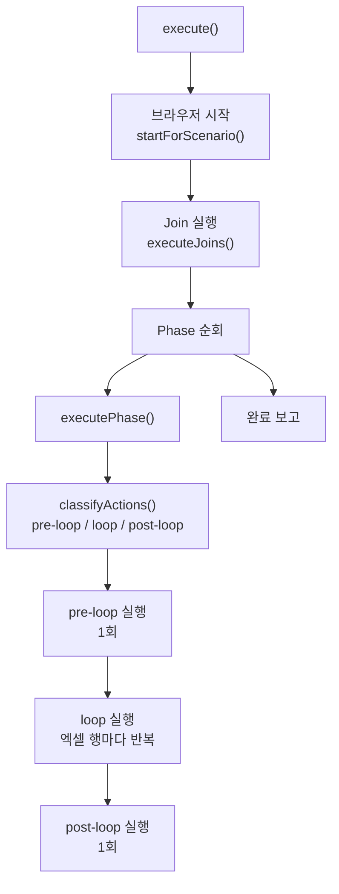

# 시나리오 배치 실행 엔진: selector fallback과 excel loop

## 개요

XGEN 2.0의 시나리오 녹화 시스템은 AI Agent 또는 사용자가 브라우저를 조작하는 과정을 녹화한다. 녹화된 시나리오는 다시 재생(replay)할 수 있다. 그런데 단순 재생이 아니라, 엑셀 파일의 각 행마다 반복 실행하는 "배치 실행"이 필요했다.

예를 들어, 쇼핑몰 관리자가 "상품 등록" 시나리오를 한 번 녹화하면, 엑셀에 있는 100개 상품을 자동으로 등록할 수 있어야 한다. 로그인 → 상품 등록 페이지 이동은 한 번만, 상품명 입력 → 가격 입력 → 저장은 100번 반복한다.

이를 위해 `ScenarioExecutor`라는 실행 엔진을 설계했다. 1,089줄의 싱글톤 클래스로, selector fallback(대안 셀렉터), 3-Phase 액션 분류(pre-loop / loop / post-loop), 다중 값 해석(literal / credential / excel_column / variable), 그리고 멀티시트 엑셀 Join까지 처리한다.

## 아키텍처

### 3단계 파이프라인

시나리오 배치 실행은 설정 → 실행 → 모니터링의 3단계로 진행된다.

```mermaid
flowchart LR
    subgraph Setup[1 설정 단계]
        Modal[ExecuteScenarioModal]
        Excel[엑셀 파일 로드<br/>MinIO 또는 직접 업로드]
        Join[Join 설정<br/>inner/left/right/outer]
        Cred[Credential 입력<br/>로그인 정보 등]
    end

    subgraph Execute[2 실행 단계]
        Executor[ScenarioExecutor]
        Browser[브라우저 시작<br/>base_url 이동]
        Phase[Phase 순회<br/>pre-loop / loop / post-loop]
        Action[액션 실행<br/>selector fallback + retry]
    end

    subgraph Monitor[3 모니터링 단계]
        Status[ExecutionStatusPanel]
        Progress[Phase/Action/Row 진행률]
        Screenshot[스크린샷 미리보기]
        Control[일시정지/취소 컨트롤]
    end

    Setup --> Execute --> Monitor
```



### ScenarioExecutor 클래스

ScenarioExecutor는 싱글톤 패턴으로 설계했다. 브라우저 인스턴스를 하나만 유지하면서 여러 Phase를 순차적으로 실행한다.



```
# 커밋: feat: scenario playback engine -- batch execution, selector fallback, excel loop
# 날짜: 2026-02-10 01:53
```

## 핵심 구현

### Phase와 액션 분류: classifyActions

시나리오는 여러 Phase로 구성된다. 각 Phase 안에서 액션은 3가지로 분류된다.

| 분류 | 실행 횟수 | 예시 |
|------|-----------|------|
| pre-loop | 1회 | 로그인, 메뉴 클릭, 등록 페이지 이동 |
| loop | 엑셀 행 수만큼 | 상품명 입력, 가격 입력, 저장 버튼 클릭 |
| post-loop | 1회 | 최종 확인, 로그아웃 |

분류 기준은 각 액션의 `in_loop` 필드다. Agent가 시나리오를 빌드할 때 `autoMapExcelColumns`로 LLM이 자동 매핑하거나, 사용자가 UI에서 직접 설정한다.

```typescript
private classifyActions(actions: RecordedAction[]): {
    preLoopActions: RecordedAction[];
    loopActions: RecordedAction[];
    postLoopActions: RecordedAction[];
} {
    const lastLoopIndex = actions.reduce(
        (last, a, i) => (a.in_loop ? i : last), -1
    );

    if (lastLoopIndex === -1) {
        return { preLoopActions: actions, loopActions: [], postLoopActions: [] };
    }

    const firstLoopIndex = actions.findIndex(a => a.in_loop);
    const preLoopActions = actions.slice(0, firstLoopIndex);
    const loopActions = actions.slice(firstLoopIndex, lastLoopIndex + 1);
    const postLoopActions = actions.slice(lastLoopIndex + 1);

    return { preLoopActions, loopActions, postLoopActions };
}
```

핵심 설계 결정: `in_loop=true` 사이에 끼인 `in_loop=false` 액션도 loop에 포함한다. 예를 들어 "입력(in_loop) → 확인 클릭(not in_loop) → 다음 입력(in_loop)" 패턴에서, 확인 클릭은 매 행마다 반복해야 하기 때문이다.

### Phase 실행: executePhase

각 Phase는 루프 여부에 따라 분기된다.

```typescript
private async executePhase(
    phase: ScenarioPhase,
    phaseIndex: number,
    excelDataMap: Map<string, any[]>,
    joinedDataMap: Map<string, any[]>,
    credentials: Record<string, string>,
): Promise<void> {
    const hasExcelActions = phase.actions.some(
        a => a.value_type === 'excel_column'
    );
    const shouldLoop = phase.loop || hasExcelActions;

    if (shouldLoop) {
        await this.executePhaseWithLoop(
            phase, phaseIndex, excelDataMap, joinedDataMap, credentials
        );
    } else {
        // 루프 없이 전체 액션 순차 실행
        for (let i = 0; i < phase.actions.length; i++) {
            await this.executeAction(phase.actions[i], i, null, credentials);
        }
    }
}
```

`phase.loop`이 명시적으로 `true`이거나, 액션 중 하나라도 `value_type === 'excel_column'`이면 루프 모드로 전환한다. 후자는 사용자가 Phase 단위 루프 설정을 깜빡했을 때의 안전망이다.

### 루프 실행: executePhaseWithLoop

```typescript
private async executePhaseWithLoop(
    phase: ScenarioPhase,
    phaseIndex: number,
    excelDataMap: Map<string, any[]>,
    joinedDataMap: Map<string, any[]>,
    credentials: Record<string, string>,
): Promise<void> {
    const { preLoopActions, loopActions, postLoopActions } =
        this.classifyActions(phase.actions);

    // 엑셀 데이터 소스 결정
    const excelData = this.getExcelDataForPhaseAuto(
        phase, excelDataMap, joinedDataMap
    );

    // 1. pre-loop: 1회 실행
    for (let i = 0; i < preLoopActions.length; i++) {
        await this.executeAction(preLoopActions[i], i, null, credentials);
    }

    // 2. loop: 엑셀 행마다 반복
    for (let row = 0; row < excelData.length; row++) {
        const rowData = excelData[row];

        for (let i = 0; i < loopActions.length; i++) {
            await this.executeAction(
                loopActions[i], i, rowData, credentials
            );
        }
    }

    // 3. post-loop: 1회 실행
    for (let i = 0; i < postLoopActions.length; i++) {
        await this.executeAction(postLoopActions[i], i, null, credentials);
    }
}
```

### 엑셀 데이터 소스 결정: loop_source

Phase의 `loop_source` 필드가 어떤 엑셀 데이터를 사용할지 결정한다. 4가지 형식을 지원한다.

| loop_source 형식 | 해석 |
|------------------|------|
| `excel:alias` | 해당 alias의 엑셀 파일 전체 데이터 |
| `excel:alias.sheet` | 해당 alias의 특정 시트 |
| `joined:name` | Join 결과 데이터 |
| `excel_data` (레거시) | 기본 엑셀 데이터 (하위 호환) |

```typescript
private getExcelDataForPhaseAuto(
    phase: ScenarioPhase,
    excelDataMap: Map<string, any[]>,
    joinedDataMap: Map<string, any[]>,
): any[] {
    const src = phase.loop_source;

    if (src?.startsWith('joined:')) {
        const joinName = src.slice(7);
        return joinedDataMap.get(joinName) || [];
    }

    if (src?.startsWith('excel:')) {
        const ref = src.slice(6); // "alias" or "alias.sheet"
        return excelDataMap.get(ref) || [];
    }

    // 기본: 첫 번째 엑셀 데이터
    const firstKey = excelDataMap.keys().next().value;
    return firstKey ? excelDataMap.get(firstKey) || [] : [];
}
```

## Selector Fallback

### 문제: 셀렉터 불안정성

녹화 시점과 재생 시점의 DOM이 다를 수 있다. 동적으로 생성되는 ID, CSS Module의 해시 클래스명, 렌더링 순서에 따라 달라지는 nth-child 등이 원인이다.

### selector_alternatives

녹화 시 각 액션에는 기본 셀렉터 외에 대안 셀렉터 배열이 저장된다. 타입별로 data-testid, id, aria-label, name, CSS path 등 여러 방식으로 수집되며, 각각 confidence(0.0~1.0) 점수가 부여된다.

```typescript
interface SelectorCandidate {
    selector: string;
    type: 'css' | 'testid' | 'aria' | 'text' | 'id' | 'name';
    confidence: number;
}
```

### fallback 로직

`executeAction`에서 기본 셀렉터가 실패하면 대안을 순회한다.

```typescript
private async executeAction(
    action: RecordedAction,
    index: number,
    rowData: Record<string, any> | null,
    credentials: Record<string, string>,
): Promise<void> {
    let effectiveSelector = action.selector;

    // 1단계: 기본 셀렉터로 시도
    try {
        await this.page.waitForSelector(effectiveSelector, { timeout: 5000 });
    } catch {
        // 2단계: selector_alternatives에서 fallback
        if (action.selector_alternatives?.length) {
            const alternatives = action.selector_alternatives
                .filter(alt => alt.type !== 'text')
                .sort((a, b) => b.confidence - a.confidence);

            for (const alt of alternatives) {
                try {
                    await this.page.waitForSelector(alt.selector, {
                        timeout: 3000
                    });
                    effectiveSelector = alt.selector;
                    break;
                } catch {
                    continue;
                }
            }
        }
    }

    // 3단계: effectiveSelector로 실제 액션 실행
    await this.executeSingleAction(action, effectiveSelector, rowData, credentials);
}
```

```
# 커밋: feat: scenario playback engine -- batch execution, selector fallback, excel loop
# 날짜: 2026-02-10 01:53
```

핵심 설계 결정:

- **text 타입 제외**: `text` 셀렉터는 페이지 텍스트 내용에 의존하므로, 언어 변경이나 텍스트 수정에 취약하다. fallback 후보에서 제외했다.
- **confidence 내림차순**: data-testid(confidence 0.95)가 nth-child(confidence 0.3)보다 먼저 시도된다.
- **타임아웃 차등**: 기본 셀렉터는 5초, 대안은 3초. 대안은 빠르게 실패해야 다음 후보로 넘어간다.
- **원래 셀렉터 폴백**: 모든 대안이 실패하면 원래 셀렉터로 다시 시도한다. DOM 로딩 타이밍 문제로 처음 시도 때 실패했지만 시간이 지나면 나타나는 경우가 있다.

### selector_alternatives 타입 정규화

녹화 시 수집되는 셀렉터 타입 중 `testid`와 `aria`는 Pydantic 백엔드 모델에서 유효하지 않았다. 저장 시 `css`로 정규화하는 처리를 추가했다.

```
# 커밋: fix: selector_alternatives type 'testid'/'aria' -> 'css' (Pydantic 유효성 검증 오류 수정)
# 날짜: 2026-02-09 16:21
```

## 값 해석: resolveValue

### 4가지 value_type

액션의 `value` 필드는 `value_type`에 따라 다르게 해석된다.

```typescript
private resolveValue(
    action: RecordedAction,
    rowData: Record<string, any> | null,
    credentials: Record<string, string>,
): string {
    switch (action.value_type) {
        case 'literal':
        case 'fixed':
            return action.value || '';

        case 'credential':
            return credentials[action.value_key || ''] || action.value || '';

        case 'excel_column': {
            const key = action.value_key || '';
            // 1-depth: "column"
            if (!key.includes('.')) {
                return rowData?.[key] ?? action.value ?? '';
            }
            // 2-depth: "alias.column"
            const parts = key.split('.');
            if (parts.length === 2) {
                return rowData?.[parts[1]] ?? action.value ?? '';
            }
            // 3-depth: "alias.sheet.column" → 크로스 참조
            return rowData?.[parts[2]] ?? action.value ?? '';
        }

        case 'variable':
            return this.variables[action.value_key || ''] || action.value || '';

        default:
            return action.value || '';
    }
}
```

| value_type | value_key 예시 | 해석 |
|------------|---------------|------|
| `literal` | (없음) | `action.value` 그대로 사용 |
| `credential` | `password` | `credentials['password']` 참조 |
| `excel_column` | `상품명` | 현재 행의 `상품명` 컬럼 값 |
| `excel_column` | `products.상품명` | products alias의 `상품명` 컬럼 |
| `excel_column` | `products.Sheet1.상품명` | 크로스 참조 (공통 키로 매칭) |
| `variable` | `last_order_id` | 런타임 변수 참조 |

3-depth 크로스 참조는 멀티시트 엑셀에서 시트 간 데이터를 참조할 때 사용한다. 예를 들어 "주문" 시트의 "상품코드"로 "상품" 시트의 "상품명"을 가져오는 경우다.

## Join 처리

### 프론트엔드 Join

엑셀 파일이 여러 개이거나 멀티시트일 때, 시트 간 데이터를 결합해야 하는 경우가 있다. SQL의 JOIN과 같은 개념을 프론트엔드에서 구현했다.

```typescript
interface JoinConfig {
    name: string;           // Join 결과 이름 (loop_source에서 참조)
    left_source: string;    // "alias" 또는 "alias.sheet"
    right_source: string;
    join_key: string;       // 조인 키 컬럼명
    join_type: 'inner' | 'left' | 'right' | 'outer';
}
```


4가지 Join 타입을 모두 지원한다.

```typescript
private executeJoins(
    joinConfigs: JoinConfig[],
    excelDataMap: Map<string, any[]>,
): Map<string, any[]> {
    const joinedDataMap = new Map<string, any[]>();

    for (const config of joinConfigs) {
        const leftData = this.resolveJoinSource(config.left_source, excelDataMap);
        const rightData = this.resolveJoinSource(config.right_source, excelDataMap);
        const key = config.join_key;

        let result: any[];
        switch (config.join_type) {
            case 'inner':
                result = leftData.filter(l =>
                    rightData.some(r => r[key] === l[key])
                ).map(l => ({
                    ...l,
                    ...rightData.find(r => r[key] === l[key]),
                }));
                break;
            case 'left':
                result = leftData.map(l => ({
                    ...l,
                    ...(rightData.find(r => r[key] === l[key]) || {}),
                }));
                break;
            // right, outer 생략
        }

        joinedDataMap.set(config.name, result);
    }

    return joinedDataMap;
}
```

```
# 커밋: feat: Add join configuration support and multi-sheet Excel handling
# 날짜: 2026-02-09 17:14
```

### 멀티시트 자동 분리

엑셀 파일에 여러 시트가 있고, 시트 이름이 시나리오의 alias와 매칭되면 자동으로 분리한다.

```typescript
const tryAutoSplitBySheetAlias = (
    sheetNames: string[],
    requiredAliases: string[],
) => {
    const matches = requiredAliases.filter(alias =>
        sheetNames.includes(alias)
    );
    if (matches.length === requiredAliases.length) {
        // 모든 alias에 대응하는 시트가 있으면 자동 분리
        return matches.map(alias => ({
            alias,
            sheetName: alias,
        }));
    }
    return null;
};
```

## Agent 모드 엑셀 매핑

### 4단계 변환 파이프라인

Tauri 데스크톱 앱에서는 AI Agent가 브라우저를 조작하며 시나리오를 빌드한다. 이 시나리오를 엑셀 루프용으로 변환하는 4단계 파이프라인이 있다.


### cleanupActions: 7개 규칙

Agent가 생성한 액션에는 탐색용 snapshot, 실패한 클릭, 중복 navigate 등 재생에 불필요한 것들이 섞여 있다. `cleanupActions`는 7개 규칙으로 이를 정리한다.

```typescript
const cleanupActions = useCallback(() => {
    setActions(prev => {
        const cleaned: Partial<RecordedAction>[] = [];
        for (let i = 0; i < prev.length; i++) {
            const action = prev[i];

            // 0. 탐색 전용 액션 제거
            const exploratoryTypes = [
                'snapshot', 'screenshot', 'focused_snapshot',
                'tab_list', 'hover'
            ];
            if (exploratoryTypes.includes(action.type as string)) continue;

            // 0.5. 짧은 wait 제거 (1초 이하)
            if (action.type === 'wait' && action.value &&
                parseInt(action.value) <= 1000) continue;

            // 1. 연속 중복 navigate 제거 (마지막만 유지)
            if (action.type === 'navigate' && i + 1 < prev.length &&
                prev[i + 1].type === 'navigate') continue;

            // 2. 연속 동일 click 제거
            if (action.type === 'click' && i + 1 < prev.length &&
                prev[i + 1].type === 'click' &&
                action.selector === prev[i + 1].selector) continue;

            // 3. 빈 type 제거
            if (action.type === 'type' && !action.value) continue;

            // 4. 같은 필드에 연속 type → 마지막만 유지
            if (action.type === 'type' && i + 1 < prev.length &&
                prev[i + 1].type === 'type' &&
                action.selector === prev[i + 1].selector) continue;

            // 5. Escape 키 제거
            if (action.type === 'press_key' &&
                action.value === 'Escape') continue;

            cleaned.push(action);
        }
        return cleaned;
    });
}, []);
```

```
# 커밋: feat: 엑셀 루프 변환 + 시나리오 검증 강화
# 날짜: 2026-02-09 08:30
```

### autoMapExcelColumns: LLM 자동 매핑

엑셀 컬럼과 시나리오 액션을 LLM에게 보내서, 어떤 액션이 엑셀 데이터로 치환되어야 하는지 자동으로 매핑한다.

```typescript
const autoMapExcelColumns = useCallback(async () => {
    const actionsSummary = actions.map((a, i) => {
        const parts = [`${i + 1}. [${a.type}]`];
        if (a.selector) parts.push(`selector="${a.selector}"`);
        if (a.value) parts.push(`value="${a.value}"`);
        return parts.join(' ');
    }).join('\n');

    const mapPrompt = `아래 시나리오 액션 목록과 엑셀 컬럼 정보를 보고,
어떤 액션이 엑셀 데이터로 치환되어야 하는지 매핑해주세요.

## 현재 액션 목록
${actionsSummary}

## 엑셀 컬럼
${excelMapping.columns.join(', ')}

## 샘플 데이터
${sampleStr}

## 규칙
1. type/fill 액션 중 엑셀 컬럼 값으로 치환해야 하는 것을 찾으세요
2. 로그인, 네비게이션 등은 in_loop=false
3. 데이터 입력 구간은 in_loop=true (클릭, Enter 포함)

## 응답 형식 (JSON만)
{"mappings": [{"index": 4, "value_type": "excel_column",
  "value_key": "자재코드", "in_loop": true}]}`;

    const response = await callLLM([{ role: 'user', content: mapPrompt }]);
    const parsed = JSON.parse(jsonStr.trim());

    const mappings = parsed.mappings.map((m: any) => ({
        index: (m.index || 1) - 1, // 1-based → 0-based
        value_type: m.value_type || 'literal',
        value_key: m.value_key,
        in_loop: !!m.in_loop,
    }));

    setExcelMapping(prev => ({ ...prev, mappings }));
}, [actions, excelMapping.columns]);
```

```
# 커밋: feat: Agent Excel Controller -- 엑셀 루프 자동 매핑 + 스토리지 연동
# 날짜: 2026-02-09 13:05
```

LLM은 액션의 `selector`(예: "상품코드 입력란")와 `value`(예: "A001"), 엑셀 컬럼명(예: "자재코드"), 샘플 데이터(예: `{"자재코드": "B002", "수량": 10}`)를 비교하여 매핑을 결정한다. `value`가 샘플 데이터의 값과 유사하거나, `selector`의 의미가 컬럼명과 대응하면 `excel_column`으로 매핑한다.

### applyExcelMapping

매핑 결과를 액션에 적용하는 함수다. 각 액션의 `value_type`, `value_key`, `in_loop` 필드를 업데이트한다.

```typescript
const applyExcelMapping = useCallback(() => {
    const { mappings } = excelMapping;
    const mappingMap = new Map(mappings.map(m => [m.index, m]));

    setActions(prev => prev.map((action, idx) => {
        const mapping = mappingMap.get(idx);
        if (!mapping) return action;
        return {
            ...action,
            value_type: mapping.value_type,
            ...(mapping.value_key ? { value_key: mapping.value_key } : {}),
            in_loop: mapping.in_loop,
        };
    }));

    const appliedCount = mappings.filter(m => m.value_type === 'excel_column').length;
    const loopCount = mappings.filter(m => m.in_loop).length;
    // 시스템 메시지: "Excel 매핑 적용: N개 액션에 컬럼 매핑, M개 액션 반복 설정"
}, [excelMapping]);
```

## 트러블슈팅

### 중복 navigate 방지

시나리오에 navigate 액션이 있고, 해당 URL이 이미 현재 페이지와 같은 경우 불필요한 새로고침이 발생했다. 이로 인해 페이지의 입력 상태가 초기화되는 문제가 있었다.

```
# 커밋: fix: Playback 중복 navigate 방지 -- 불필요한 새로고침 제거
# 날짜: 2026-02-10 00:01
```

### 액션 간 안정화 대기

빠른 연속 실행 시 이전 액션의 DOM 변경이 완료되기 전에 다음 액션이 시작되는 문제가 있었다. 각 액션 실행 후 짧은 안정화 대기를 추가했다.

```
# 커밋: fix: Playback 속도 조절 -- 액션 간 안정화 대기 추가
# 날짜: 2026-02-09 23:58
```

### in_loop 필드 누락

Agent 모드에서 생성한 액션에 `in_loop` 필드가 없으면 Pydantic 백엔드가 유효성 검증 에러를 발생시켰다. 저장 전에 기본값을 설정하는 sanitize 로직을 추가했다.

```
# 커밋: fix: add missing in_loop field and sanitize actions for backend pydantic validation
# 날짜: 2026-02-08 12:31
```

## 결과 및 회고

### ScenarioExecutor 메서드 맵

| 메서드 | 줄 수 | 역할 |
|--------|-------|------|
| `execute()` | 진입점 | 브라우저 시작, Join, Phase 순회, 완료 보고 |
| `executePhase()` | Phase 단위 | 루프 여부 판단 후 분기 |
| `executePhaseWithLoop()` | 루프 실행 | 3분류 + 행별 반복 |
| `classifyActions()` | 분류 | pre-loop / loop / post-loop |
| `executeAction()` | 액션 실행 | selector fallback + retry |
| `executeSingleAction()` | 타입별 실행 | click/type/navigate/select 등 |
| `resolveValue()` | 값 해석 | literal/credential/excel_column/variable |
| `getExcelDataForPhaseAuto()` | 데이터 소스 | loop_source 해석 |
| `executeJoins()` | Join | inner/left/right/outer |

### 설계 원칙

**"녹화와 재생의 비대칭성을 인정하라"**: 녹화할 때는 한 번의 조작이지만, 재생할 때는 100번 반복해야 한다. 이 비대칭성을 `in_loop` 플래그와 `value_type`으로 명시적으로 표현한다. 암묵적인 추론에 의존하지 않는다.

**"셀렉터 하나에 목숨을 걸지 마라"**: 웹 페이지의 DOM은 살아있는 유기체다. 오늘 동작하는 셀렉터가 내일 실패할 수 있다. `selector_alternatives`로 여러 관문을 두어, 하나가 실패해도 다른 것으로 대체할 수 있게 한다. confidence 순으로 시도하여 가장 안정적인 것부터 검증한다.

**"LLM에게 구조화된 판단을 맡겨라"**: 어떤 액션이 반복 구간인지, 어떤 입력이 엑셀 컬럼과 대응하는지는 규칙 기반으로 판단하기 어렵다. LLM에게 액션 목록, 엑셀 컬럼, 샘플 데이터를 함께 보여주고 JSON으로 응답받는 것이 가장 정확하고 유연하다.
