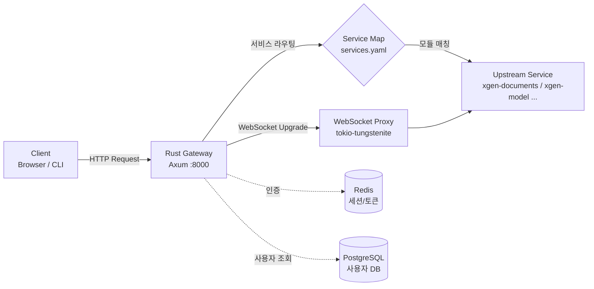

# 2GB 파일 업로드를 위한 프록시 body size 설정

> 2025.11 | Rust, Axum, reqwest, tokio-tungstenite

## 개요

XGEN 2.0은 AI 워크플로우 플랫폼이다. 사용자가 ML 모델 파일, 대용량 데이터셋, PDF/문서 묶음 등을 웹 UI에서 직접 업로드해야 하는 상황이 빈번하다. 특히 파인튜닝된 LLM 모델 파일은 수백 MB에서 수 GB까지 커지는데, 프론트엔드에서 이걸 업스트림 서비스(xgen-documents, xgen-model 등)까지 전달하려면 중간에 있는 API Gateway가 대용량 body를 수용해야 한다.

XGEN 2.0의 API Gateway는 Rust + Axum 기반 자체 구현이다. Nginx 같은 리버스 프록시를 앞에 두지 않고 Gateway가 직접 프록시 역할을 한다. 이 구조에서 파일 업로드 제한은 Gateway 코드에서 직접 제어해야 한다.

문제는 초기 구현에서 body size 제한이 10MB로 설정되어 있었다는 것이다. 10MB면 일반 API 요청에는 충분하지만, ML 모델 파일이나 대규모 데이터셋 업로드에는 턱없이 부족했다. 413 Payload Too Large 에러가 반복적으로 발생했고, 이를 해결하기 위해 프록시 아키텍처 전반을 점검하게 되었다.

## 문제 상황

### 413 에러의 원인

Axum의 `body::to_bytes` 함수는 두 번째 인자로 최대 바이트 수를 받는다. 이 값을 초과하는 body가 들어오면 에러를 반환하고, Gateway는 이를 500 Internal Server Error로 처리했다.

```rust
// 초기 설정: 10MB 제한
const MAX_BODY_BYTES: usize = 10 * 1024 * 1024; // 10MB 안전 한도

let body_bytes = match axum::body::to_bytes(req.into_body(), MAX_BODY_BYTES).await {
    Ok(b) => b,
    Err(e) => {
        tracing::error!(event = "proxy_read_body_failed", error = %e, ...);
        return json_error(StatusCode::INTERNAL_SERVER_ERROR, "Failed to read body");
    }
};
```

프론트엔드에서 50MB짜리 데이터셋 CSV를 업로드하면, Gateway에서 body를 읽다가 10MB 시점에서 끊겨버린다. 에러 로그에는 `proxy_read_body_failed`만 찍히고, 사용자는 "업로드 실패"라는 모호한 메시지만 받았다.

### Nginx를 쓰지 않는 구조의 특성

일반적인 웹 서비스라면 Nginx에서 `client_max_body_size`를 올리면 끝이다. 하지만 XGEN 2.0은 K3s 환경에서 Istio Ingress Gateway를 통해 트래픽을 받고, 그 뒤에 바로 Rust Gateway가 위치하는 구조였다.

```
Client → Istio Ingress → Rust Gateway → 업스트림 서비스
```

Nginx가 없으니 `client_max_body_size` 같은 설정으로 해결할 수가 없다. Gateway 코드에서 직접 body size 제한을 조정해야 했다. 이건 단점이기도 하지만 장점이기도 하다. 설정 파일 하나 바꾸는 게 아니라 코드 레벨에서 정밀하게 제어할 수 있다.

### 발생한 시나리오들

body size 제한이 문제가 된 구체적인 케이스들이다.

1. **ML 모델 업로드**: 파인튜닝된 LoRA 어댑터 파일(safetensors)이 수십~수백 MB
2. **데이터셋 업로드**: CSV, JSON Lines 포맷의 학습 데이터셋이 수백 MB
3. **문서 일괄 업로드**: RAG 파이프라인에 넣을 PDF 묶음이 100MB 이상
4. **HuggingFace 모델 다운로드 프록시**: 모델 레포지토리 파일이 GB 단위

## 설계

### 전체 아키텍처

Gateway의 프록시 처리 흐름은 다음과 같다.



요청이 들어오면 Gateway는 다음 순서로 처리한다.

1. URL 경로에서 서비스 모듈 이름 추출 (`/api/proxy/{service}/{tail}`)
2. `services.yaml`에 정의된 매핑으로 업스트림 호스트 결정
3. JWT 토큰 검증 후 `x-user-id`, `x-user-name` 헤더 주입
4. WebSocket 업그레이드 요청이면 WS 프록시로 위임
5. 일반 HTTP면 body를 읽어서 reqwest로 업스트림에 전달
6. 업스트림 응답을 스트리밍으로 클라이언트에 반환

### 서비스 매핑 구조

`services.yaml`이 모듈 이름과 업스트림 호스트를 매핑한다.

```yaml
services:
  xgen-core:
    host: http://xgen-core:8000
    modules:
      - admin
      - auth
      - config
      - llm
      - session-station

  retrieval-service:
    host: http://xgen-documents:8000
    modules:
      - retrieval
      - documents
      - folder
      - embedding
      - data-processor
      - storage

  workflow-service:
    host: http://xgen-workflow:8000
    modules:
      - workflow
      - interaction
      - editor
      - node
      - tools
      - prompt
      - mcp

  xgen-model:
    host: http://xgen-model:8000
    modules:
      - vllm
      - model
```

프론트엔드가 `/api/proxy/documents/upload`로 요청하면, Gateway는 `documents` 모듈을 `retrieval-service`에 매핑하여 `http://xgen-documents:8000/upload`로 프록시한다. 파일 업로드가 이 경로를 타기 때문에, body size 제한은 프록시 레이어에서 통합 관리해야 했다.

### body 처리 전략 선택

대용량 body를 처리하는 방법은 크게 두 가지다.

**방법 1: 전체 body를 메모리에 로드 (to_bytes)**
- 구현이 단순하다
- body 크기만큼 메모리를 점유한다
- 업스트림 전송 전에 전체 body가 준비되어야 한다

**방법 2: 스트리밍 파이프 (body stream을 업스트림에 직접 전달)**
- 메모리 사용량이 최소화된다
- 구현이 복잡하다 (Content-Length 전파, 에러 핸들링 등)
- reqwest의 `Body::wrap_stream`으로 가능하지만, 헤더 조작과 조합이 까다롭다

현 시점에서는 방법 1을 선택했다. 이유는 다음과 같다.

- Gateway가 단일 인스턴스로 운영되고, 동시 대용량 업로드가 드물다
- 서버 메모리가 128GB라 2GB body를 수 건 동시에 처리해도 여유가 있다
- 스트리밍 방식은 `Content-Length` 전파, 청크 인코딩 호환, 에러 시 재시도 등 고려사항이 많아 우선순위를 뒤로 미뤘다

실용적인 판단이었다. 메모리가 충분한 단일 서버 환경에서 코드 복잡도를 낮추는 게 유지보수에 더 유리하다.

## 구현

### MAX_BODY_BYTES 상향

핵심 변경은 한 줄이다.

```rust
// 커밋: feat: Increase maximum body size limit for proxy requests to 2GB
// 날짜: 2025-11-13
const MAX_BODY_BYTES: usize = 2 * 1024 * 1024 * 1024; // 2GB 안전 한도
```

기존 10MB에서 2GB로 200배 올렸다. 2GB로 정한 이유는 HuggingFace에서 제공하는 개별 모델 파일의 최대 크기가 보통 2GB 미만이기 때문이다. Git LFS의 기본 제한도 2GB이고, 대부분의 파인튜닝 결과물도 이 범위 안에 들어온다.

### body 수집과 업스트림 전송

전체 프록시 흐름에서 body 처리 부분이다.

```rust
pub async fn proxy_stub(
    State(state): State<AppState>,
    Path((service, tail)): Path<(String, String)>,
    ws: Option<WebSocketUpgrade>,
    req: Request<axum::body::Body>,
) -> Response {
    let start = std::time::Instant::now();

    // 서비스 URL 결정
    let base = match get_service_base_url(&service) {
        Some(u) => u,
        None => return json_error(StatusCode::BAD_GATEWAY, "Unknown service"),
    };

    // JWT 기반 사용자 헤더 추출
    let mut tmp_headers = HeaderMap::new();
    inject_user_headers_from_auth(req.headers(), &mut tmp_headers, &state.redis_client).await;

    // 업스트림 URL 구성 (쿼리 파라미터 보존)
    let uri = req.uri().clone();
    let query = /* 쿼리 파라미터 파싱 및 재구성 */;
    let upstream = format!("{}/{}{}", base.trim_end_matches('/'), tail.trim_start_matches('/'), query);

    // body를 bytes로 수집 (최대 2GB)
    let body_bytes = match axum::body::to_bytes(req.into_body(), MAX_BODY_BYTES).await {
        Ok(b) => b,
        Err(e) => {
            tracing::error!(
                event = "proxy_read_body_failed",
                error = %e,
                %service,
                upstream = %upstream,
                "Failed to read request body"
            );
            return json_error(StatusCode::INTERNAL_SERVER_ERROR, "Failed to read body");
        }
    };

    // reqwest로 업스트림에 전달
    if !body_bytes.is_empty() {
        request_builder = request_builder.body(body_bytes.to_vec());
    }

    let resp = request_builder.send().await;
    // ...
}
```

`axum::body::to_bytes`가 핵심이다. 이 함수는 HTTP body 스트림을 끝까지 읽어서 `Bytes` 타입으로 반환한다. 두 번째 인자 `MAX_BODY_BYTES`가 제한이며, 이 크기를 초과하면 에러를 반환한다.

`body_bytes.to_vec()`로 변환해서 reqwest의 body로 넘긴다. 여기서 메모리 복사가 한 번 더 일어나는데, 2GB body라면 잠시 4GB 가까이 메모리를 점유할 수 있다. 이 부분은 후술할 트러블슈팅 섹션에서 다룬다.

### 응답 스트리밍

요청 body는 전체를 메모리에 올리지만, 응답은 스트리밍으로 처리한다. 업스트림이 대용량 응답(파일 다운로드 등)을 내려줄 때 메모리를 절약하기 위해서다.

```rust
// 성공 응답은 스트리밍으로 전달
let stream = resp
    .bytes_stream()
    .map(|chunk| chunk.map_err(|e| {
        std::io::Error::new(std::io::ErrorKind::Other, e.to_string())
    }));
let body = Body::from_stream(stream);
let mut resp_axum = Response::new(body);
*resp_axum.status_mut() = status;
```

`resp.bytes_stream()`은 reqwest의 `Response`에서 body를 청크 단위로 읽는 스트림을 반환한다. 이걸 Axum의 `Body::from_stream`으로 감싸서 클라이언트에 그대로 흘려보낸다. 업스트림에서 1GB 파일을 내려줘도 Gateway 메모리에는 청크 버퍼 크기(보통 8KB~64KB)만 점유한다.

다만 에러 응답(4xx, 5xx)은 스트리밍이 아니라 전체를 읽어서 로깅한다. 디버깅을 위해 에러 body의 일부(최대 2KB)를 로그에 남기는 구조다.

```rust
if status.is_client_error() || status.is_server_error() {
    let bytes = resp.bytes().await?;
    let snippet_len = std::cmp::min(bytes.len(), 2048);
    let snippet = String::from_utf8_lossy(&bytes[..snippet_len]).to_string();
    tracing::warn!(
        event = "proxy_upstream_error",
        resp_snippet = %snippet,
        "Upstream returned error status"
    );
    // ...
}
```

## 헤더 전파

프록시에서 body만큼 중요한 것이 헤더 전파다. 클라이언트가 보낸 헤더를 업스트림에 올바르게 전달하지 않으면, 인증 실패, Content-Type 불일치, CORS 에러 등이 발생한다.

### 사용자 인증 헤더 주입

Gateway는 JWT 토큰을 검증한 뒤, 업스트림이 필요로 하는 사용자 정보를 헤더로 주입한다.

```rust
pub async fn inject_user_headers_from_auth(
    headers: &HeaderMap,
    out_headers: &mut HeaderMap,
    redis_client: &RedisClient,
) {
    if let Some(token_val) = headers.get("authorization").and_then(|v| v.to_str().ok()) {
        let token = token_val.strip_prefix("Bearer ").unwrap_or(token_val);
        let keys = JwtKeys::from_env();
        if let Some(c) = verify_token(&keys, token) {
            // refresh token은 API 요청에 사용 불가
            if c.r#type.as_deref() == Some("refresh") {
                return;
            }

            // Redis에서 최신 사용자 정보 조회 (토큰 해시 기반)
            if let Ok(mut con) = redis_client.get_multiplexed_async_connection().await {
                let token_hash = hash_token(token);
                let user_info_key = format!("user_info:{}:{}", &c.sub, &token_hash);
                if let Ok(Some(user_info_str)) = con.get::<_, Option<String>>(&user_info_key).await {
                    // Redis 데이터로 헤더 설정
                    let _ = set_user_headers(out_headers, &user_id, username, is_admin);
                    return;
                }
            }
            // Redis에 없으면 JWT claims로 폴백
            let _ = set_user_headers(out_headers, &c.sub, &c.username, c.is_admin);
        }
    }
}
```

이 함수는 두 단계로 동작한다.

1. **Redis 우선**: 로그인 시 Redis에 저장된 최신 사용자 정보를 토큰 해시 키로 조회한다. 사용자 이름이나 권한이 변경되었을 때 토큰을 재발급하지 않아도 최신 정보가 업스트림에 전달된다.
2. **JWT 폴백**: Redis 연결 실패나 데이터 미존재 시 JWT claims에 포함된 정보를 사용한다.

결과적으로 업스트림 서비스는 `x-user-id`, `x-user-name`, `x-user-admin` 헤더만 보면 된다. 인증 로직을 Gateway에 집중시켜 업스트림 서비스의 구현 부담을 줄였다.

### X-Forwarded-Proto 감지

프록시 환경에서 원본 프로토콜(HTTP vs HTTPS)을 업스트림에 알려주는 것이 중요하다. 업스트림이 리다이렉트 URL이나 콜백 URL을 생성할 때 프로토콜을 알아야 올바른 URL을 만들 수 있기 때문이다.

```rust
// 커밋: feat: Enhance proxy header propagation with protocol detection
// 날짜: 2025-11-07

fn detect_forwarded_proto(headers: &HeaderMap) -> &'static str {
    fn normalize(value: &str) -> Option<&'static str> {
        let trimmed = value.trim_matches(|c: char| c == '"' || c == '\'' || c.is_ascii_whitespace());
        if trimmed.eq_ignore_ascii_case("https") {
            Some("https")
        } else if trimmed.eq_ignore_ascii_case("http") {
            Some("http")
        } else {
            None
        }
    }

    // 1. X-Forwarded-Proto (가장 표준적)
    if let Some(value) = headers.get("x-forwarded-proto").and_then(|v| v.to_str().ok()) {
        if let Some(first) = value.split(',').next() {
            if let Some(proto) = normalize(first) {
                return proto;
            }
        }
    }

    // 2. Forwarded 헤더 (RFC 7239)
    if let Some(value) = headers.get("forwarded").and_then(|v| v.to_str().ok()) {
        for entry in value.split(',') {
            for part in entry.split(';') {
                if let Some((key, val)) = part.trim().split_once('=') {
                    if key.trim().eq_ignore_ascii_case("proto") {
                        if let Some(proto) = normalize(val) {
                            return proto;
                        }
                    }
                }
            }
        }
    }

    // 3. CloudFront-Forwarded-Proto (AWS 환경)
    if let Some(value) = headers.get("cloudfront-forwarded-proto").and_then(|v| v.to_str().ok()) {
        if let Some(proto) = normalize(value) {
            return proto;
        }
    }

    // 4. X-Forwarded-SSL / Front-End-Https (레거시)
    let ssl_on = |name: &str| {
        headers.get(name)
            .and_then(|v| v.to_str().ok())
            .map(|v| v.eq_ignore_ascii_case("on"))
            .unwrap_or(false)
    };
    if ssl_on("x-forwarded-ssl") || ssl_on("front-end-https") {
        return "https";
    }

    "http"
}
```

이 함수는 4가지 소스를 우선순위 순으로 확인한다. XGEN은 K3s + Istio 환경이라 보통 `X-Forwarded-Proto`가 들어오지만, AWS CloudFront 뒤에 배포되는 경우도 대비했다. 초기에는 프로토콜을 `"http"`로 하드코딩했다가 HTTPS 환경에서 CORS 이슈가 발생해서 이 감지 로직을 추가했다.

### X-Forwarded-Origin 구성

프로토콜 감지와 함께 `X-Forwarded-Origin`도 구성한다. 업스트림이 CORS 응답 헤더를 동적으로 생성할 때 사용한다.

```rust
// X-Forwarded-Origin: 우선 Origin 헤더 사용, 없으면 proto+host 구성
if let Some(origin) = incoming.get("origin").and_then(|v| v.to_str().ok()) {
    builder = builder.header("x-forwarded-origin", origin);
} else if let Some(host) = host_header {
    let forwarded_origin = format!("{forwarded_proto}://{host}");
    builder = builder.header("x-forwarded-origin", forwarded_origin);
}
```

### Hop-by-Hop 헤더 필터링

프록시는 hop-by-hop 헤더를 전파하면 안 된다. HTTP 스펙에 따라 `Connection`, `Keep-Alive`, `Transfer-Encoding` 등은 인접 노드 간에만 유효한 헤더다.

```rust
fn is_hop_by_hop(name: &HeaderName) -> bool {
    matches!(name.as_str().to_ascii_lowercase().as_str(),
        "connection" | "keep-alive" | "proxy-authenticate" | "proxy-authorization" |
        "te" | "trailers" | "transfer-encoding" | "upgrade")
}
```

요청 전파와 응답 복사 모두에서 이 함수로 필터링한다. `Transfer-Encoding`을 그대로 전파하면 청크 인코딩이 이중으로 적용되는 문제가 생기기 때문에 반드시 필터링해야 한다.

### 헤더 전파 전체 흐름

`propagate_headers_to_upstream` 함수가 위의 모든 로직을 통합한다.

```rust
fn propagate_headers_to_upstream(
    incoming: &HeaderMap,
    mut builder: reqwest::RequestBuilder,
    user_headers: &HeaderMap,
) -> reqwest::RequestBuilder {
    // 1. 원본 헤더 복사 (host, hop-by-hop 제외)
    for (name, value) in incoming.iter() {
        if name.as_str().eq_ignore_ascii_case("host") || is_hop_by_hop(name) { continue; }
        if let Ok(vstr) = value.to_str() {
            builder = builder.header(name, vstr);
        }
    }

    // 2. X-Forwarded-Host
    if let Some(host) = host_header {
        builder = builder.header("x-forwarded-host", host);
    }

    // 3. X-Forwarded-Proto (프로토콜 감지)
    let forwarded_proto = detect_forwarded_proto(incoming);
    builder = builder.header("x-forwarded-proto", forwarded_proto);

    // 4. X-Forwarded-Origin
    // ...

    // 5. X-Request-ID 보장 (없으면 UUID 생성)
    if incoming.get("x-request-id").is_none() {
        builder = builder.header("x-request-id", Uuid::new_v4().to_string());
    }

    // 6. 권장 전파 헤더 명시적 보강
    for key in ["authorization", "x-user-id", "accept-version",
                "x-feature-toggle", "traceparent", "tracestate"] {
        if let Some(val) = incoming.get(key).and_then(|v| v.to_str().ok()) {
            builder = builder.header(key, val);
        }
    }

    // 7. JWT 기반 사용자 헤더 주입 (x-user-id, x-user-name, x-user-admin)
    for (k, v) in user_headers.iter() {
        if let Ok(vs) = v.to_str() {
            builder = builder.header(k, vs);
        }
    }

    builder
}
```

특이한 점은 `traceparent`와 `tracestate`도 전파한다는 것이다. OpenTelemetry 기반 분산 트레이싱을 위해 W3C Trace Context 헤더를 업스트림까지 전달한다. 이렇게 하면 Gateway를 거친 요청도 전체 트레이스에서 추적할 수 있다.

## WebSocket 프록시

파일 업로드는 HTTP 프록시의 영역이지만, XGEN에서는 WebSocket도 같은 Gateway를 통과한다. AI 워크플로우 실행 중 실시간 스트리밍 결과를 받거나, 챗봇 대화 시 LLM 응답을 토큰 단위로 스트리밍할 때 WebSocket을 사용하기 때문이다.

### HTTP에서 WS로 업그레이드 감지

Axum은 `WebSocketUpgrade` 추출자를 통해 WebSocket 업그레이드 요청을 감지한다.

```rust
pub async fn proxy_stub(
    State(state): State<AppState>,
    Path((service, tail)): Path<(String, String)>,
    ws: Option<WebSocketUpgrade>,  // None이면 일반 HTTP
    req: Request<axum::body::Body>,
) -> Response {
    // ...
    if let Some(ws) = ws {
        let ws_upstream = upstream.clone();
        let mut ws_headers = tmp_headers.clone();

        // Authorization 헤더도 WebSocket에 전달
        if let Some(auth) = req.headers().get("authorization") {
            ws_headers.insert(HeaderName::from_static("authorization"), auth.clone());
        }

        return ws.on_upgrade(move |socket| {
            crate::routes::ws_proxy::proxy_websocket(socket, ws_upstream, ws_headers)
        });
    }
    // 일반 HTTP 프록시 계속...
}
```

`Option<WebSocketUpgrade>`를 사용해서 일반 HTTP와 WebSocket 요청을 같은 핸들러에서 분기한다. 코드가 간결해지는 Axum의 장점이다.

### 양방향 메시지 전달

WebSocket 프록시는 클라이언트 소켓과 업스트림 소켓을 연결해서 양방향으로 메시지를 전달한다.

```rust
pub async fn proxy_websocket(
    client_socket: WebSocket,
    upstream_url: String,
    headers: HeaderMap,
) {
    // HTTP URL을 WS URL로 변환
    let ws_url = upstream_url
        .replacen("http://", "ws://", 1)
        .replacen("https://", "wss://", 1);

    // 업스트림 WebSocket 핸드셰이크 헤더 수동 설정
    let ws_key = tungstenite::handshake::client::generate_key();
    let mut request_builder = tungstenite::http::Request::builder()
        .uri(&ws_url)
        .header("Host", &host)
        .header("Connection", "Upgrade")
        .header("Upgrade", "websocket")
        .header("Sec-WebSocket-Version", "13")
        .header("Sec-WebSocket-Key", &ws_key);

    // 인증 헤더 추가
    for (name, value) in headers.iter() {
        if let Ok(v_str) = value.to_str() {
            request_builder = request_builder.header(name.as_str(), v_str);
        }
    }

    let (upstream_ws, _) = tokio_tungstenite::connect_async(request).await?;

    let (mut client_tx, mut client_rx) = client_socket.split();
    let (mut upstream_tx, mut upstream_rx) = upstream_ws.split();

    // 양방향 포워딩
    let client_to_upstream = async {
        while let Some(Ok(msg)) = client_rx.next().await {
            if let Some(tung_msg) = axum_to_tungstenite(msg) {
                if upstream_tx.send(tung_msg).await.is_err() { break; }
            }
        }
    };

    let upstream_to_client = async {
        while let Some(Ok(msg)) = upstream_rx.next().await {
            if let Some(axum_msg) = tungstenite_to_axum(msg) {
                if client_tx.send(axum_msg).await.is_err() { break; }
            }
        }
    };

    // 한쪽이 끊기면 양쪽 모두 종료
    tokio::select! {
        _ = client_to_upstream => {}
        _ = upstream_to_client => {}
    }
}
```

주목할 점이 있다. Axum의 WebSocket 메시지 타입(`axum::extract::ws::Message`)과 tokio-tungstenite의 메시지 타입(`tungstenite::Message`)이 다르다. `axum_to_tungstenite`와 `tungstenite_to_axum` 변환 함수가 이 차이를 처리한다. Text, Binary, Ping, Pong, Close 메시지를 각각 매핑하고, tungstenite의 `Frame` 타입(raw frame)은 건너뛴다.

`tokio::select!`로 양방향 태스크를 동시에 실행하고, 한쪽이 종료되면 자동으로 다른 쪽도 종료된다. 클라이언트가 브라우저 탭을 닫으면 `client_rx`가 끊기고, 업스트림 서비스가 종료되면 `upstream_rx`가 끊기는 식이다.

### WebSocket 헤더 전파의 함정

일반 HTTP 프록시와 달리 WebSocket 핸드셰이크에서는 `http::Request<()>` 빌더를 직접 구성해야 한다. `tokio_tungstenite::connect_async`에 `http::Request`를 넘기면 tungstenite가 WebSocket 핸드셰이크 헤더를 자동으로 추가하지 않는다.

그래서 `Connection: Upgrade`, `Upgrade: websocket`, `Sec-WebSocket-Version: 13`, `Sec-WebSocket-Key`를 수동으로 설정해야 한다. 이걸 빠뜨리면 업스트림이 WebSocket 핸드셰이크를 거부한다. 초기 구현에서 `Sec-WebSocket-Key` 없이 연결을 시도해서 400 에러가 나는 문제를 겪었다.

## 트러블슈팅

### 메모리 사용량 이슈

2GB body를 `to_bytes`로 전부 읽으면, 그 시점에 메모리에 2GB가 올라간다. 여기서 `body_bytes.to_vec()`로 reqwest body에 넘기면 복사본이 하나 더 생긴다. 이론상 최대 4GB 가까이 메모리를 잠시 점유할 수 있다.

```
요청 수신 → to_bytes(2GB) → 메모리 2GB 점유
                ↓
          to_vec() → 메모리 +2GB (총 ~4GB)
                ↓
          send() 완료 → body_bytes drop → 2GB 해제
                ↓
          resp 수신 → to_vec drop → 0GB
```

현재 서버가 128GB RAM이라 단일 요청으로는 문제가 없지만, 동시에 여러 사용자가 대용량 파일을 업로드하면 메모리 압박이 올 수 있다. 실제 운영에서는 동시 대용량 업로드가 2~3건 이상 겹친 적이 없어서 문제가 발생하지 않았다.

근본적인 해결책은 body를 스트리밍으로 전달하는 것이다. reqwest의 `Body::wrap_stream`을 사용하면 Axum의 body stream을 그대로 업스트림에 파이프할 수 있다.

```rust
// 향후 개선 방향 (스트리밍 body 전달)
let body_stream = req.into_body().into_data_stream();
let reqwest_body = reqwest::Body::wrap_stream(body_stream);
request_builder = request_builder.body(reqwest_body);
```

이렇게 하면 메모리에 올라가는 건 청크 버퍼뿐이라 수 KB에서 수십 KB 수준으로 줄어든다. 다만 `Content-Length`를 업스트림에 정확하게 전달해야 하고, 스트림 도중 에러가 발생했을 때의 처리가 복잡해진다. 현재 코드의 안정성을 우선하여 추후 마이그레이션할 계획이다.

### 타임아웃 설정

2GB 파일을 업로드하면 시간이 오래 걸린다. 네트워크 환경에 따라 다르지만, 내부 네트워크(K3s Pod 간 통신)에서도 1~2분이 걸릴 수 있다.

초기 타임아웃 설정이 10초였다. 대용량 파일 업로드는 당연히 타임아웃에 걸렸다.

```rust
// 커밋: timeout
// 날짜: 2025-10-30

// 변경 전
.unwrap_or(10_000);  // 10초

// 변경 후
.unwrap_or(300_000); // 300초 (5분)
```

`config.rs`에서 `TIMEOUT_MS` 환경변수의 기본값을 10초에서 300초(5분)로 올렸다. 이 타임아웃은 reqwest 클라이언트에 적용되며, 업스트림 요청의 전체 시간(연결 + 전송 + 응답 대기)을 제한한다.

```rust
// main.rs
let client = reqwest::ClientBuilder::new()
    .timeout(Duration::from_millis(config.timeout_ms))
    .build()?;
```

300초면 2GB 파일을 내부 네트워크에서 업로드하기에 충분하다. K3s Pod 간 통신 속도가 보통 수백 Mbps라 2GB 전송에 30~60초면 된다. 5분이면 느린 경우까지 커버한다.

다만 이 타임아웃은 전역 설정이라 모든 프록시 요청에 적용된다. 단순 API 호출에도 5분 타임아웃이 걸리는데, 이건 업스트림 서비스가 빠르게 응답하면 문제가 없다. 하지만 업스트림이 멈춘 경우 5분간 커넥션이 열려 있게 된다. 향후에는 업로드 엔드포인트별로 타임아웃을 분리하는 것을 고려할 수 있다.

### Content-Type 보존 문제

파일 업로드에서 `Content-Type: multipart/form-data; boundary=...` 헤더가 정확하게 업스트림에 전달되어야 한다. 프록시가 이 헤더를 누락하거나 변조하면 업스트림이 multipart 파싱에 실패한다.

`propagate_headers_to_upstream` 함수에서 `Host`와 hop-by-hop 헤더만 제외하고 나머지를 모두 전파하기 때문에, `Content-Type`은 자연스럽게 보존된다. 하지만 초기에 `Content-Length`가 원본 요청의 값으로 전달되는 이슈가 있었다. Gateway가 body를 한 번 읽고 다시 보내기 때문에 Content-Length가 달라질 수 있다. reqwest가 body를 설정할 때 자동으로 Content-Length를 계산하므로, 원본 Content-Length를 제거하고 reqwest에 맡기는 것이 올바른 방식이다.

### 에러 응답 로깅 전략

대용량 파일 업로드가 실패했을 때, 원인을 파악하기 위한 로깅이 중요하다. Gateway에서 수집하는 정보는 다음과 같다.

```rust
tracing::error!(
    event = "proxy_upstream_request_failed",
    error = %e,
    %service,
    upstream = %upstream,
    method = %method_str,
    request_id = %request_id,
    duration_ms = start.elapsed().as_millis() as u128,
    req_body_bytes = req_body_size,
    "Upstream request failed"
);
```

- `request_id`: 요청 추적용 UUID (클라이언트가 안 보내면 Gateway가 생성)
- `duration_ms`: 요청 시작부터 실패까지 경과 시간
- `req_body_bytes`: body 크기 (업로드 파일 크기 추정)
- `service`, `upstream`: 대상 서비스와 URL

JSON 포맷으로 출력하도록 tracing-subscriber를 설정했기 때문에, 이 로그를 Grafana Loki나 Elasticsearch로 수집해서 검색할 수 있다.

## 타임라인

전체 구현 과정을 커밋 순서대로 정리하면 다음과 같다.

| 날짜 | 커밋 | 내용 |
|------|------|------|
| 2025-10-28 | (초기 구현) | 프록시 기본 구조, MAX_BODY_BYTES = 10MB |
| 2025-10-29 | `inject_user_headers` | Redis 기반 사용자 정보 조회 + JWT 폴백 |
| 2025-10-30 | `timeout` | 타임아웃 10초 → 300초 상향 |
| 2025-10-31 | `Refactor user header` | 사용자 헤더 처리 리팩토링 |
| 2025-11-07 | `Enhance proxy header propagation` | X-Forwarded-Proto 감지, X-Forwarded-Origin 구성 |
| 2025-11-12 | `password hashing` | 인증 플로우 강화 (sha2 의존성 추가) |
| 2025-11-13 | `Increase maximum body size` | MAX_BODY_BYTES 10MB → 2GB 상향 |

10MB → 2GB 변경 자체는 한 줄 수정이지만, 그에 앞서 타임아웃 조정, 헤더 전파 개선, 인증 플로우 강화가 선행되었다. body size만 올리면 대용량 파일이 물리적으로 통과하지만, 타임아웃에 걸리거나 인증 헤더가 누락되면 의미가 없기 때문이다.

## 결과

2GB body size 상향 후, 다음과 같은 작업이 Gateway를 통해 정상적으로 수행되었다.

- **600MB safetensors 모델 업로드**: xgen-model 서비스로 전달, 약 15초 소요
- **200MB CSV 데이터셋 업로드**: xgen-documents의 data-processor로 전달, 약 8초 소요
- **150MB PDF 묶음 업로드**: xgen-documents의 retrieval 서비스로 전달, RAG 인덱싱까지 자동 진행
- **WebSocket 실시간 스트리밍**: 워크플로우 실행 중 LLM 토큰 스트리밍, 업로드와 무관하게 정상 동작

### 향후 개선 방향

현재 구조의 한계와 개선 계획이다.

**1. 스트리밍 body 전달**: `to_bytes` 대신 `Body::wrap_stream`으로 요청 body를 스트리밍 파이프. 메모리 사용량을 MB 단위에서 KB 단위로 줄일 수 있다.

**2. 엔드포인트별 타임아웃**: 업로드 경로(`/documents/upload`, `/model/upload`)에만 긴 타임아웃을 적용하고, 일반 API에는 짧은 타임아웃을 유지.

**3. 업로드 진행률 보고**: Gateway가 body를 읽는 동안 수신된 바이트 수를 추적해서 프론트엔드에 진행률을 알려주는 WebSocket 채널 추가.

**4. 파일 크기 사전 검증**: `Content-Length` 헤더를 먼저 확인해서 `MAX_BODY_BYTES`를 초과하면 body를 읽기 전에 413 응답을 반환. 불필요한 네트워크 전송을 방지한다.

현 시점에서 2GB 제한은 운영에 충분하다. 그보다 큰 파일(전체 LLM 모델 등)은 MinIO에 직접 업로드하고 URL로 참조하는 방식을 사용한다. Gateway를 거치는 업로드는 사용자가 웹 UI에서 직접 첨부하는 파일에 한정되므로, 2GB면 실용적인 상한선이다.
