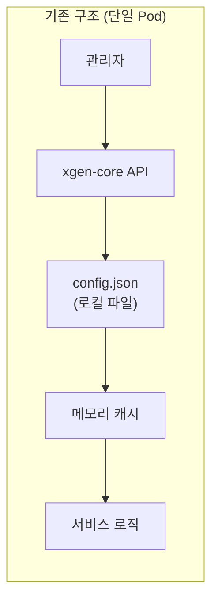
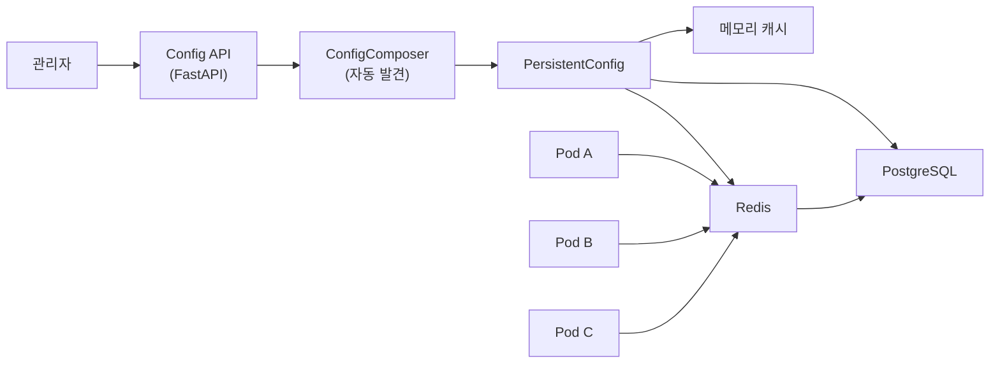
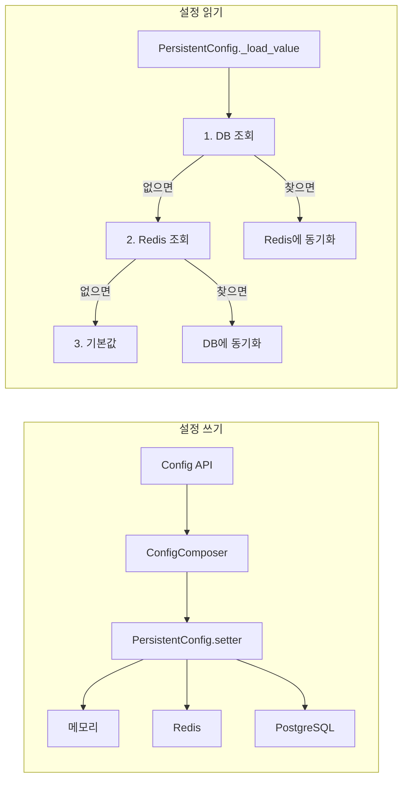
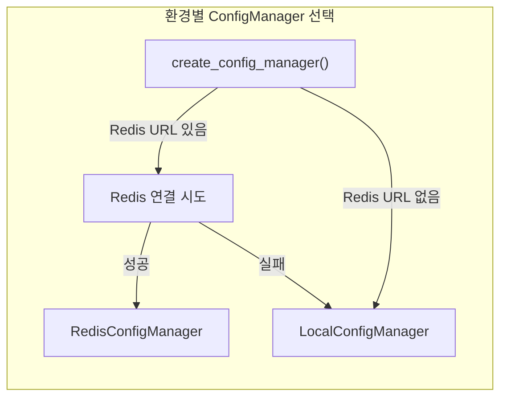

# LocalConfigManager 분산 환경 전환: 파일에서 API 기반으로

XGEN 2.0은 K3s 클러스터 위에서 여러 Pod로 분산 운영된다. 그런데 설정 관리만은 여전히 단일 서버 시절의 방식을 쓰고 있었다. `config.json` 파일 하나에 모든 설정을 넣고, 서버가 시작할 때 이 파일을 읽어서 메모리에 올리는 방식이었다. Pod가 하나일 때는 문제가 없었다. 그런데 xgen-core를 2개 이상의 Pod로 스케일 아웃하면서 설정 불일치가 발생하기 시작했다.

```
# 커밋: feat: LocalConfigManager 분산 환경 지원 (파일 fallback 제거)
# 날짜: 2026-02-04

# 커밋: feat: Enhance configuration management with Redis and local fallback
# 날짜: 2026-01-06

# 커밋: feat: Implement configuration management API with PII handling
# 날짜: 2026-01-06
```

Pod A에서 관리자가 LLM 모델 설정을 변경하면 Pod A의 `config.json`만 갱신된다. Pod B는 여전히 이전 설정으로 동작한다. K8s 환경에서 어떤 Pod로 요청이 라우팅될지 알 수 없으니, 관리자가 바꾼 설정이 적용되는 것과 안 되는 것이 랜덤으로 갈렸다. 이 글에서는 이 문제를 Redis + DB 기반 분산 설정 시스템으로 해결한 과정을 정리한다.

## 기존 구조: config.json 파일 기반

XGEN 1.0부터 내려온 설정 관리 구조는 단순했다.

```python
# 기존 방식: constants.py
import json
from pathlib import Path

CONFIG_PATH = Path("data/config.json")

def load_config():
    with open(CONFIG_PATH) as f:
        return json.load(f)

def save_config(config: dict):
    with open(CONFIG_PATH, "w") as f:
        json.dump(config, f, indent=2)
```

서버 시작 시 `config.json`을 읽어서 전역 변수에 올리고, 설정이 바뀌면 파일에 다시 쓰는 방식이었다. 이 구조의 문제는 크게 세 가지였다.

**첫째, Pod 간 설정 불일치.** K8s에서는 각 Pod가 자체 파일시스템을 갖는다. PersistentVolumeClaim(PVC)으로 볼륨을 공유할 수 있지만, ReadWriteMany를 지원하는 스토리지 클래스가 필요하고, 파일 잠금(locking) 문제도 따라온다. 무엇보다 설정 파일 하나 공유하자고 NFS 같은 공유 스토리지를 도입하는 것은 과한 선택이다.

**둘째, 원자적 업데이트 불가.** 파일 기반에서는 설정을 바꾸는 동안 다른 프로세스가 같은 파일을 읽을 수 있다. 쓰기 도중 읽으면 깨진 JSON을 만날 수 있다. 로컬 파일 잠금으로 해결할 수 있지만, 분산 환경에서는 통하지 않는다.

**셋째, 롤백이 어려움.** 파일을 덮어쓰면 이전 상태가 사라진다. git으로 `config.json`을 추적하는 것도 방법이지만, 런타임에 변경되는 설정을 git으로 관리하는 것은 현실적이지 않다.



이 구조는 단일 서버에서는 잘 동작했다. 문제는 K8s로 전환하면서 드러났다.

## 새 아키텍처: 3계층 설정 시스템

파일 기반 설정을 완전히 걷어내고, DB + Redis + 메모리 3계층 구조로 교체했다. 핵심 설계 원칙은 다음과 같다.

- **DB가 진실의 원천(Source of Truth)이다.** PostgreSQL에 설정값을 저장하고, 모든 Pod가 같은 DB를 바라본다.
- **Redis는 캐시 겸 알림 채널이다.** DB를 매번 조회하면 느리니까, Redis에 설정값을 캐시한다. Pod 간 설정 변경 전파도 Redis를 통한다.
- **메모리는 최종 캐시이다.** 프로세스 내에서 반복 조회되는 설정은 메모리에 올려두고, Redis/DB 장애 시에도 마지막으로 읽은 값을 사용할 수 있다.



설정을 업데이트하면 메모리, Redis, DB 세 곳에 동시에 기록된다. 읽을 때는 DB를 먼저 확인하고, 없으면 Redis, 그것마저 없으면 기본값을 쓴다. 어느 계층이 죽어도 나머지로 대체 가능한 구조다.

## PersistentConfig: 설정 로드 우선순위

설정 시스템의 핵심은 `PersistentConfig` 클래스다. 환경변수처럼 이름(`env_name`)과 기본값(`env_value`)을 갖지만, 값을 읽을 때 DB, Redis, 기본값 순서로 탐색한다.

```python
class PersistentConfig:
    def __init__(
        self,
        env_name: str,
        config_path: str,
        env_value: Any,
        redis_manager=None,
        db_manager=None,
    ):
        self.env_name = env_name
        self.config_path = config_path
        self.env_value = env_value
        self.redis_manager = redis_manager
        self.db_manager = db_manager
        self._value = self._load_value()

    def _load_value(self) -> Any:
        """DB -> Redis -> 기본값 순서로 설정 값 로드"""
        # 1. DB에서 먼저 확인
        if _is_db_available(self.db_manager):
            db_value = get_db_config(self.db_manager, self.config_path)
            if db_value is not None:
                # 정규화 적용 (다중 이스케이프된 값 복구)
                db_value = normalize_config_value(db_value, expected_type)
                # DB 값을 Redis에도 동기화
                self.redis_manager.set_config(...)
                return db_value

        # 2. Redis에서 확인
        redis_value = self.redis_manager.get_config_value(self.env_name)
        if redis_value is not None:
            # Redis 값을 DB에도 저장
            return redis_value

        # 3. 기본값 사용 및 Redis/DB에 저장
        self.redis_manager.set_config(...)
        return self.env_value
```

DB를 최우선으로 확인하는 이유가 있다. Redis는 메모리 기반이라 재시작하면 데이터가 날아간다(AOF/RDB 백업을 해도 완벽하지 않다). DB에 저장된 값이 가장 안정적이다.

### 양방향 동기화

주목할 점은 DB에서 값을 찾으면 Redis에도 동기화하고, Redis에서 값을 찾으면 DB에도 저장한다는 것이다. 이렇게 하면 어느 한 쪽이 죽었다 복구되더라도 자동으로 최신 값으로 동기화된다.

```python
# DB에서 찾으면 → Redis에 동기화
if db_value is not None:
    self.redis_manager.set_config(
        config_path=self.config_path,
        config_value=db_value,
        data_type=type(db_value).__name__,
        env_name=self.env_name,
    )
    return db_value

# Redis에서 찾으면 → DB에 동기화
if redis_value is not None:
    if _is_db_available(self.db_manager):
        set_db_config(self.db_manager, self.config_path, redis_value)
    return redis_value
```

이 동기화가 중요한 이유는 Redis 재시작 시나리오 때문이다. K8s에서 Redis Pod가 재시작되면 캐시가 전부 날아간다. 이때 각 Pod가 설정을 조회하면 DB에서 값을 가져와서 Redis에 다시 채워넣는다. 별도의 워밍업 스크립트 없이도 자연스럽게 캐시가 복구된다.

### 값 쓰기: 3계층 동시 저장

설정을 업데이트할 때는 메모리, Redis, DB 세 곳에 동시에 써야 한다. 한 곳이라도 빠지면 불일치가 발생한다.

```python
@property
def value(self):
    return self._value

@value.setter
def value(self, new_value):
    self._value = new_value
    # Redis에 저장
    self.redis_manager.set_config(
        config_path=self.config_path,
        config_value=new_value,
        data_type=type(new_value).__name__,
        env_name=self.env_name,
    )
    # DB에 저장
    if _is_db_available(self.db_manager):
        set_db_config(self.db_manager, self.config_path, new_value)
```

Python property로 구현해서 `config.value = "new_value"` 처럼 일반 변수 대입처럼 쓸 수 있다. 내부적으로는 Redis와 DB에 동시에 반영된다. 호출하는 쪽에서 저장 로직을 신경 쓸 필요가 없다.

## ConfigComposer: 설정 자동 발견 시스템

XGEN 2.0에는 설정 항목이 200개가 넘는다. LLM 모델 경로, 임베딩 서버 URL, 벡터DB 주소, 워크플로우 타임아웃, API 키 등이 각기 다른 모듈에 흩어져 있다. 이것을 한 파일에 전부 때려넣으면 관리가 불가능하다. 그래서 카테고리별로 설정 파일을 분리하고, 자동으로 발견하는 `ConfigComposer`를 만들었다.

### sub_config 디렉토리 구조

```
config/sub_config/
    app_config.py           # 앱 기본 설정 (서버 이름, 포트 등)
    embedding_config.py     # 임베딩 모델, 배치 사이즈
    llm_config.py          # LLM 모델 경로, 타임아웃
    openai_config.py       # OpenAI API 키, 엔드포인트
    vectordb_config.py     # Qdrant 주소, 컬렉션 설정
    workflow_config.py     # 워크플로우 실행 제한
    rag_config.py          # RAG 파라미터
    auth_config.py         # 인증 관련 설정
    ui_config.py           # UI 커스터마이징
    ... (20+ config files)
```

각 설정 파일은 `BaseConfig`를 상속받아 해당 카테고리의 설정 항목을 `PersistentConfig`로 정의한다.

```python
class EmbeddingConfig(BaseConfig):
    category = "embedding"

    def __init__(self, redis_manager, db_manager):
        self.EMBEDDING_MODEL = PersistentConfig(
            env_name="EMBEDDING_MODEL",
            config_path="embedding.model",
            env_value="BAAI/bge-m3",
            redis_manager=redis_manager,
            db_manager=db_manager,
        )
        self.EMBEDDING_BATCH_SIZE = PersistentConfig(
            env_name="EMBEDDING_BATCH_SIZE",
            config_path="embedding.batch_size",
            env_value=2048,
            redis_manager=redis_manager,
            db_manager=db_manager,
        )
        self.EMBEDDING_ENGINE = PersistentConfig(
            env_name="EMBEDDING_ENGINE",
            config_path="embedding.engine",
            env_value="openai",
            redis_manager=redis_manager,
            db_manager=db_manager,
        )
```

이 패턴의 장점은 새 설정을 추가할 때 `sub_config/` 디렉토리에 파일만 넣으면 된다는 것이다. `ConfigComposer`가 자동으로 발견해서 등록한다.

### 자동 발견 메커니즘

```python
class ConfigComposer:
    def __init__(self, redis_manager, db_manager):
        self.redis_manager = redis_manager
        self.db_manager = db_manager
        self.config_categories = {}
        self.all_configs = {}
        self._auto_discover_configs()

    def _auto_discover_configs(self):
        """sub_config/ 디렉토리에서 *_config.py 파일 자동 발견"""
        config_dir = Path(__file__).parent / "sub_config"
        for file_path in config_dir.glob("*_config.py"):
            module_name = file_path.stem
            module = importlib.import_module(
                f"config.sub_config.{module_name}"
            )
            # 모듈에서 BaseConfig 하위 클래스 찾기
            for name, cls in inspect.getmembers(module, inspect.isclass):
                if issubclass(cls, BaseConfig) and cls is not BaseConfig:
                    instance = cls(self.redis_manager, self.db_manager)
                    category = getattr(cls, "category", module_name)
                    self.config_categories[category] = instance
                    # 개별 설정 항목도 flat하게 등록
                    for attr_name in dir(instance):
                        attr = getattr(instance, attr_name)
                        if isinstance(attr, PersistentConfig):
                            self.all_configs[attr.env_name] = attr
```

`importlib.import_module`로 동적 임포트하고, `inspect.getmembers`로 `BaseConfig` 하위 클래스를 찾는다. 이 방식은 설정 파일을 추가할 때 `ConfigComposer` 코드를 수정할 필요가 없다는 점에서 Open/Closed Principle을 따른다.

발견된 설정은 두 가지 방법으로 접근할 수 있다.

```python
# 카테고리별 접근
composer.config_categories["embedding"].EMBEDDING_MODEL.value

# flat 접근 (env_name으로)
composer.all_configs["EMBEDDING_MODEL"].value
```

### 설정 업데이트 API

`ConfigComposer`는 설정 업데이트 시 3계층 동시 저장을 보장한다.

```python
def update_config(self, config_name: str, new_value: Any, category: str = None):
    """설정 업데이트: 메모리 + Redis + DB 동시 저장"""
    config = self.all_configs.get(config_name)
    if config is None:
        raise KeyError(f"Unknown config: {config_name}")

    # PersistentConfig의 setter가 Redis/DB 동기화를 처리
    config.value = new_value

def get_config(self, config_name: str) -> Any:
    """설정 조회"""
    config = self.all_configs.get(config_name)
    if config is None:
        raise KeyError(f"Unknown config: {config_name}")
    return config.value
```

### Redis 동기화 상태 점검

Redis가 재시작되면 캐시가 비어있다. `ensure_redis_sync`는 이를 감지하고 메모리에 있는 현재 설정값을 Redis에 다시 채워넣는다.

```python
def ensure_redis_sync(self):
    """Redis 동기화 상태 점검 - Redis 초기화 대비 안전장치"""
    for env_name, config in self.all_configs.items():
        redis_value = self.redis_manager.get_config_value(env_name)
        if redis_value is None and config._value is not None:
            # Redis에 없지만 메모리에 있음 = Redis가 초기화됨
            self.redis_manager.set_config(
                config_path=config.config_path,
                config_value=config._value,
                data_type=type(config._value).__name__,
                env_name=env_name,
            )
```

이 메서드는 주기적으로 호출되거나, API 요청 시 미들웨어에서 체크하는 방식으로 쓴다. Redis가 살아있으면 빠르게 통과하고, 재시작된 경우에만 동기화를 수행한다.

## LocalConfigManager: Redis 없는 환경 대응

XGEN은 K8s 클러스터뿐만 아니라 로컬 개발 환경, Docker Compose 단독 배포, 심지어 Tauri 데스크톱 앱에서도 돌아간다. 모든 환경에 Redis가 있는 것은 아니다. Tauri 앱은 사용자 PC에서 돌아가는데, 거기에 Redis를 설치하라고 할 수는 없다.

그래서 Redis 없이도 동작하는 `LocalConfigManager`를 만들었다. 인터페이스는 `RedisConfigManager`와 동일하지만, 내부적으로는 메모리 딕셔너리와 DB만 사용한다.

### 팩토리 패턴

```python
def create_config_manager(redis_url: str = None, db_manager=None):
    """팩토리 함수: Redis 가용 시 RedisConfigManager, 아니면 LocalConfigManager"""
    if redis_url:
        try:
            manager = RedisConfigManager(redis_url=redis_url)
            # 연결 테스트: ping 보내서 실제 연결 확인
            manager.client.ping()
            log.info(f"Redis 연결 성공: {redis_url}")
            return manager
        except Exception as e:
            log.warning(f"Redis 연결 실패, LocalConfigManager로 전환: {e}")

    log.info("LocalConfigManager 사용 (Redis 없음)")
    return LocalConfigManager(db_manager=db_manager)
```

이 팩토리 함수가 중요한 이유는, 호출하는 쪽에서 어떤 매니저가 반환되는지 신경 쓰지 않아도 된다는 점이다. `set_config`, `get_config_value` 같은 인터페이스가 동일하니까 나머지 코드는 변경 없이 동작한다.

Redis URL이 주어졌어도 실제 연결이 안 되면 `LocalConfigManager`로 자동 전환한다. 이 fallback 로직 덕분에 Redis가 잠시 죽어도 서비스가 중단되지 않는다.

### LocalConfigManager 구현

```python
class LocalConfigManager:
    """메모리 + DB 기반 설정 관리 (Redis 없는 환경용)"""

    def __init__(self, db_manager=None):
        self._memory_store: Dict[str, str] = {}
        self._category_index: Dict[str, set] = {}
        self.db_manager = db_manager

    def get_config_value(self, env_name: str) -> Optional[str]:
        """메모리 -> DB -> None 순서로 조회"""
        # 1. 메모리에서 먼저 확인
        if env_name in self._memory_store:
            return self._memory_store[env_name]

        # 2. DB에서 확인
        if _is_db_available(self.db_manager):
            db_value = get_db_config(self.db_manager, env_name)
            if db_value is not None:
                self._memory_store[env_name] = db_value
                return db_value

        return None

    def set_config(
        self,
        config_path: str,
        config_value: Any,
        data_type: str,
        env_name: str,
        category: str = None,
    ):
        """메모리 저장 + DB 동시 저장"""
        # 직렬화
        serialized = serialize_config_value(config_value)

        # 메모리에 저장
        self._memory_store[env_name] = serialized

        # 카테고리 인덱스 관리
        if category:
            if category not in self._category_index:
                self._category_index[category] = set()
            self._category_index[category].add(env_name)

        # DB에 저장
        if _is_db_available(self.db_manager):
            set_db_config(self.db_manager, config_path, serialized)

    def get_configs_by_category(self, category: str) -> Dict[str, str]:
        """카테고리별 설정 일괄 조회"""
        result = {}
        env_names = self._category_index.get(category, set())
        for env_name in env_names:
            value = self.get_config_value(env_name)
            if value is not None:
                result[env_name] = value
        return result

    def delete_config(self, env_name: str):
        """설정 삭제"""
        self._memory_store.pop(env_name, None)
        # 카테고리 인덱스에서도 제거
        for category_set in self._category_index.values():
            category_set.discard(env_name)
```

`_memory_store`는 단순한 딕셔너리다. Redis처럼 TTL이나 eviction 정책은 없다. 대신 프로세스가 살아있는 동안 모든 설정을 메모리에 유지한다. 설정 항목이 200개 정도면 메모리 사용량이 미미하다.

`_category_index`는 Redis의 SET 자료구조를 흉내 낸 것이다. `RedisConfigManager`에서 카테고리별 설정 목록을 Redis SET으로 관리하는데, `LocalConfigManager`에서는 Python `set`으로 대체했다.

## RedisConfigManager: 분산 환경의 핵심

`RedisConfigManager`는 Redis를 사용하여 여러 Pod 간 설정을 공유하는 핵심 컴포넌트다.

### Redis 키 설계

```python
class RedisConfigManager:
    PREFIX = "xgen:config:"
    CATEGORY_PREFIX = "xgen:config:category:"

    def __init__(self, redis_url: str, db_manager=None):
        self.client = redis.Redis.from_url(redis_url, decode_responses=True)
        self.db_manager = db_manager
```

설정값은 `xgen:config:{env_name}` 키에 저장하고, 카테고리 인덱스는 `xgen:config:category:{category}` 키에 Redis SET으로 관리한다. 프리픽스를 붙이는 이유는 Redis가 다른 용도(세션 저장, SSE 상태 공유 등)로도 쓰이기 때문이다. 네임스페이스 충돌을 방지한다.

### CRUD 구현

```python
def set_config(
    self,
    config_path: str,
    config_value: Any,
    data_type: str,
    env_name: str,
    category: str = None,
):
    """Redis에 설정 저장 + 카테고리 인덱스 관리"""
    key = f"{self.PREFIX}{env_name}"
    serialized = serialize_config_value(config_value)

    # Redis에 저장 (파이프라인으로 원자적 실행)
    pipe = self.client.pipeline()
    pipe.set(key, serialized)

    # 카테고리 인덱스 갱신
    if category:
        category_key = f"{self.CATEGORY_PREFIX}{category}"
        pipe.sadd(category_key, env_name)

    pipe.execute()

    # DB에도 동시 저장 (가용 시)
    if _is_db_available(self.db_manager):
        set_db_config(self.db_manager, config_path, serialized)

def get_config_value(self, env_name: str) -> Optional[str]:
    """Redis에서 설정값 조회"""
    key = f"{self.PREFIX}{env_name}"
    return self.client.get(key)

def get_configs_by_category(self, category: str) -> Dict[str, str]:
    """카테고리별 설정 일괄 조회"""
    category_key = f"{self.CATEGORY_PREFIX}{category}"
    env_names = self.client.smembers(category_key)

    if not env_names:
        return {}

    # 파이프라인으로 한 번에 조회
    pipe = self.client.pipeline()
    for env_name in env_names:
        pipe.get(f"{self.PREFIX}{env_name}")
    values = pipe.execute()

    return {
        name: value
        for name, value in zip(env_names, values)
        if value is not None
    }
```

파이프라인(`pipeline`)을 적극 사용한다. `set_config`에서 값 저장과 카테고리 인덱스 갱신을 하나의 파이프라인으로 묶어서 원자적으로 실행한다. `get_configs_by_category`에서는 여러 키를 한 번에 조회한다. N번 왕복 대신 2번(SMEMBERS + GET 파이프라인)으로 줄인다.

### DB 동시 저장

`RedisConfigManager`에서도 DB에 동시 저장한다. Redis만 쓰면 Redis 재시작 시 데이터가 날아가기 때문이다. DB 저장은 best-effort다. DB가 안 되더라도 Redis 저장은 성공해야 한다.

```python
# DB 저장은 try-except로 감싸서 실패해도 Redis 저장에 영향 없음
try:
    if _is_db_available(self.db_manager):
        set_db_config(self.db_manager, config_path, serialized)
except Exception as e:
    log.warning(f"DB 설정 저장 실패 (Redis에는 저장됨): {e}")
```

이 설계가 의미하는 바는, Redis가 주 저장소이고 DB가 백업이라는 것이다. 읽을 때는 DB를 먼저 보지만(데이터 신뢰성), 쓸 때는 Redis를 먼저 쓴다(속도). 약간 비대칭적이지만 실용적인 선택이다.

## DB 계층: AppDatabaseManager

설정값을 DB에 저장하기 위해 `AppDatabaseManager`에 CRUD 메서드를 추가했다.

```
# 커밋: feat: Add CRUD methods for table-based operations in AppDatabaseManager
# 날짜: 2026-01-08
```

```python
class AppDatabaseManager:
    """PostgreSQL 기반 설정 저장소"""

    def __init__(self, db_url: str):
        self.engine = create_engine(db_url)
        self.Session = sessionmaker(bind=self.engine)

    def get_config(self, config_path: str) -> Optional[str]:
        """config 테이블에서 설정값 조회"""
        with self.Session() as session:
            result = session.execute(
                text("SELECT value FROM app_config WHERE path = :path"),
                {"path": config_path},
            )
            row = result.fetchone()
            return row[0] if row else None

    def set_config(self, config_path: str, value: str):
        """config 테이블에 설정값 저장 (upsert)"""
        with self.Session() as session:
            session.execute(
                text("""
                    INSERT INTO app_config (path, value, updated_at)
                    VALUES (:path, :value, NOW())
                    ON CONFLICT (path)
                    DO UPDATE SET value = :value, updated_at = NOW()
                """),
                {"path": config_path, "value": value},
            )
            session.commit()
```

`ON CONFLICT ... DO UPDATE` (upsert)를 사용해서 이미 있는 키면 업데이트하고, 없으면 삽입한다. 별도의 존재 여부 체크 없이 한 쿼리로 처리한다.

`_is_db_available` 헬퍼는 DB 매니저가 None인지, 연결이 살아있는지를 빠르게 체크한다.

```python
def _is_db_available(db_manager) -> bool:
    """DB 매니저가 사용 가능한지 확인"""
    if db_manager is None:
        return False
    try:
        # 가벼운 쿼리로 연결 확인
        db_manager.health_check()
        return True
    except Exception:
        return False
```

Tauri 데스크톱 앱처럼 DB 없이 동작하는 환경에서는 `db_manager`가 `None`이고, 이 함수가 `False`를 반환해서 DB 관련 로직을 모두 건너뛴다.

## 설정값 정규화: 다중 이스케이프 문제

```
# 커밋: feat: Implement config serialization and cleanup migration for escaping issues
# 날짜: 2026-01-14
```

`config.json`에서 Redis/DB로 마이그레이션하면서 예상치 못한 문제가 발생했다. JSON 파일에 저장된 문자열 값 중 일부가 이미 이스케이프되어 있었는데, 이것을 다시 JSON으로 직렬화하면서 이중, 삼중 이스케이프가 발생한 것이다.

```python
# 원래 의도한 값
"https://example.com/api"

# config.json에 저장된 상태 (1차 이스케이프)
"\"https://example.com/api\""

# Redis에 저장하면서 다시 직렬화 (2차 이스케이프)
"\\\"https://example.com/api\\\""

# DB에 저장하면서 또 직렬화 (3차 이스케이프)
"\\\\\\\"https://example.com/api\\\\\\\""
```

관리자가 설정 UI에서 URL을 보면 `\\\"https://...\\\"` 같은 깨진 값이 표시됐다. 이 문제를 해결하기 위해 `normalize_config_value` 함수를 만들었다.

```python
def normalize_config_value(value: str, expected_type: type = str) -> Any:
    """다중 이스케이프된 설정값을 정규화"""
    if not isinstance(value, str):
        return value

    original = value
    max_iterations = 5  # 무한 루프 방지

    for _ in range(max_iterations):
        # 앞뒤 따옴표 제거
        if value.startswith('"') and value.endswith('"'):
            try:
                unquoted = json.loads(value)
                if isinstance(unquoted, str):
                    value = unquoted
                    continue
            except json.JSONDecodeError:
                break

        # 이스케이프된 따옴표 복원
        if '\\"' in value:
            value = value.replace('\\"', '"')
            continue

        # 이스케이프된 백슬래시 복원
        if '\\\\' in value:
            value = value.replace('\\\\', '\\')
            continue

        break

    # 타입 변환
    if expected_type == bool:
        return value.lower() in ("true", "1", "yes")
    elif expected_type == int:
        return int(value)
    elif expected_type == float:
        return float(value)

    return value
```

반복문으로 최대 5회까지 이스케이프를 벗겨낸다. `json.loads`로 JSON 문자열 파싱을 시도하고, 성공하면 벗겨진 값으로 교체한다. 5회 제한은 무한 루프 방지용이다. 실제로 3회 이상 이스케이프된 경우는 거의 없었지만, 안전장치로 넣었다.

### 직렬화 일관성

마이그레이션 후 새로 저장되는 값에 같은 문제가 발생하지 않도록 `serialize_config_value`를 도입했다.

```python
def serialize_config_value(value: Any) -> str:
    """설정값을 저장 가능한 문자열로 직렬화"""
    if isinstance(value, str):
        # 문자열은 그대로 저장 (json.dumps 하지 않음)
        return value
    elif isinstance(value, bool):
        return str(value).lower()
    elif isinstance(value, (int, float)):
        return str(value)
    elif isinstance(value, (dict, list)):
        return json.dumps(value, ensure_ascii=False)
    else:
        return str(value)
```

핵심은 문자열 타입을 `json.dumps`로 감싸지 않는 것이다. `json.dumps("hello")`는 `'"hello"'` (따옴표 포함)를 반환하는데, 이것이 이중 이스케이프의 시작이었다. 문자열은 그대로, dict/list만 JSON 직렬화한다. 이 규칙을 일관되게 적용해서 이스케이프 문제를 근본적으로 차단했다.

### 마이그레이션 정리 스크립트

기존에 이미 깨진 값들은 마이그레이션 스크립트로 일괄 정리했다.

```python
def cleanup_escaped_configs(db_manager, redis_manager):
    """DB와 Redis에 저장된 다중 이스케이프 값 일괄 정리"""
    with db_manager.Session() as session:
        configs = session.execute(
            text("SELECT path, value FROM app_config")
        ).fetchall()

    cleaned = 0
    for path, value in configs:
        normalized = normalize_config_value(value)
        if normalized != value:
            # 정규화된 값으로 업데이트
            db_manager.set_config(path, normalized)
            redis_manager.set_config(
                config_path=path,
                config_value=normalized,
                data_type="str",
                env_name=path,
            )
            cleaned += 1

    log.info(f"이스케이프 정리 완료: {cleaned}/{len(configs)}개 수정")
```

이 스크립트를 서버 시작 시 한 번 실행해서 기존 데이터를 전부 정리했다. 이후에는 `serialize_config_value`가 올바른 형식으로 저장하니까 같은 문제가 재발하지 않는다.

## 설정 관리 API

관리자가 웹 UI에서 설정을 조회하고 변경할 수 있도록 FastAPI 엔드포인트를 추가했다.

```
# 커밋: feat: Implement configuration management API with PII handling
# 날짜: 2026-01-06
```

```python
@router.get("/configs")
async def list_configs(category: str = None):
    """전체 설정 조회 (카테고리 필터 가능)"""
    composer = get_config_composer()

    if category:
        configs = composer.config_categories.get(category)
        if not configs:
            raise HTTPException(404, f"Category not found: {category}")
        return {
            "category": category,
            "configs": _serialize_category(configs),
        }

    # 전체 카테고리 반환
    return {
        "categories": {
            cat: _serialize_category(cfg)
            for cat, cfg in composer.config_categories.items()
        }
    }

@router.put("/configs/{config_name}")
async def update_config(config_name: str, body: ConfigUpdateRequest):
    """설정값 업데이트"""
    composer = get_config_composer()
    try:
        old_value = composer.get_config(config_name)
        composer.update_config(config_name, body.value)
        return {
            "config_name": config_name,
            "old_value": _mask_pii(old_value),
            "new_value": _mask_pii(body.value),
        }
    except KeyError:
        raise HTTPException(404, f"Config not found: {config_name}")
```

### PII 마스킹

API 응답에서 민감한 설정값(API 키, 비밀번호 등)은 마스킹 처리한다.

```python
PII_PATTERNS = [
    "api_key", "password", "secret", "token",
    "private_key", "credential",
]

def _mask_pii(value: Any) -> Any:
    """민감한 값 마스킹"""
    if not isinstance(value, str):
        return value
    if len(value) <= 8:
        return "****"
    return value[:4] + "****" + value[-4:]

def _serialize_category(config_instance) -> dict:
    """카테고리 설정을 JSON 직렬화, PII 마스킹 적용"""
    result = {}
    for attr_name in dir(config_instance):
        attr = getattr(config_instance, attr_name)
        if isinstance(attr, PersistentConfig):
            is_pii = any(p in attr.env_name.lower() for p in PII_PATTERNS)
            result[attr.env_name] = {
                "value": _mask_pii(attr.value) if is_pii else attr.value,
                "config_path": attr.config_path,
                "is_sensitive": is_pii,
            }
    return result
```

`OPENAI_API_KEY` 같은 설정은 `sk-ab****ef12` 형태로 앞 4자리와 뒤 4자리만 노출한다. 관리자가 값이 설정되어 있는지는 확인할 수 있지만, 전체 키를 API 응답으로 노출하지는 않는다. 업데이트 시에도 이전 값과 새 값을 마스킹해서 감사 로그에 남긴다.

## 트러블슈팅: 마이그레이션 과정

### config.json에서 Redis/DB로 초기 마이그레이션

기존 `config.json`을 읽어서 Redis와 DB에 옮기는 마이그레이션 스크립트를 작성했다.

```python
def migrate_from_json(json_path: str, composer: ConfigComposer):
    """config.json -> Redis + DB 마이그레이션"""
    with open(json_path) as f:
        old_config = json.load(f)

    migrated = 0
    skipped = 0

    for key, value in _flatten_dict(old_config).items():
        # env_name으로 매핑
        config = composer.all_configs.get(key)
        if config is None:
            log.warning(f"매핑 안 됨 (건너뜀): {key}")
            skipped += 1
            continue

        # 기존 값과 다를 때만 업데이트
        if config.value != value:
            composer.update_config(key, value)
            migrated += 1

    log.info(
        f"마이그레이션 완료: {migrated}개 마이그레이션, "
        f"{skipped}개 건너뜀"
    )
```

`_flatten_dict`는 중첩된 JSON 구조를 `embedding.model`, `llm.timeout` 같은 dot-notation 키로 평탄화한다.

### 이스케이프 폭탄

마이그레이션 직후 관리자 UI에서 설정을 보니 URL 값들이 전부 깨져 있었다. `config.json`에 있던 값 중 일부가 이미 JSON 이스케이프된 상태였는데, 마이그레이션 스크립트가 이를 모르고 `json.dumps`로 다시 감쌌다.

```
# 원래 config.json의 값
"models": {
    "default_url": "\"http://localhost:8000/v1\""
}

# 마이그레이션 후 Redis에 저장된 값
"\\\"http://localhost:8000/v1\\\""
```

이때 `normalize_config_value`를 급하게 만들었다. 마이그레이션 스크립트에서 값을 저장하기 전에 정규화를 거치도록 수정했다.

```python
# 수정된 마이그레이션 로직
for key, value in _flatten_dict(old_config).items():
    # 정규화 먼저 적용
    normalized = normalize_config_value(value)
    composer.update_config(key, normalized)
```

### Redis 재시작 후 설정 유실

테스트 중 Redis Pod를 재시작했더니 모든 설정이 날아갔다. Redis 데이터 영속화(AOF)를 설정하지 않은 상태였다. DB에 백업이 있으니 서비스가 멈추지는 않았지만, Redis가 비어있는 동안 모든 설정 조회가 DB로 가면서 응답 시간이 느려졌다.

해결 방법은 두 가지를 적용했다.

1. Redis AOF 영속화 활성화: `--appendonly yes` 옵션 추가 (이미 Docker Compose에 있었지만 K8s 배포에서 빠져있었다)
2. `ensure_redis_sync` 호출: 서버 시작 시 메모리 캐시 → Redis 동기화 수행

```yaml
# k3s Redis StatefulSet에 AOF 활성화
command:
  - redis-server
  - --appendonly yes
  - --requirepass $(REDIS_PASSWORD)
  - --maxmemory 2gb
  - --maxmemory-policy allkeys-lru
```

### 파일 fallback 제거

```
# 커밋: feat: LocalConfigManager 분산 환경 지원 (파일 fallback 제거)
# 날짜: 2026-02-04
```

초기에는 "혹시 모를" 안전장치로 `config.json` 파일 읽기를 유지했다. Redis와 DB 모두에서 값을 못 찾으면 `config.json`에서 읽는 최후의 fallback이었다. 그런데 이 fallback이 오히려 문제를 만들었다.

Pod A에서 설정을 변경하면 Redis/DB에 반영되지만, Pod B의 로컬 `config.json`은 여전히 옛 값이다. Pod B에서 Redis 조회가 실패하면(네트워크 일시 장애 등) 파일 fallback이 작동해서 옛 값을 반환한다. 결과적으로 "설정을 바꿨는데 가끔 안 바뀜" 현상이 발생했다.

해결은 간단했다. 파일 fallback을 완전히 제거했다. Redis/DB에서 못 찾으면 코드에 정의된 기본값(`env_value`)을 쓴다. 기본값은 코드에 하드코딩되어 있으니 모든 Pod에서 동일하다. `config.json` 파일 자체를 삭제하고 관련 코드를 전부 걷어냈다.

```python
# 제거 전
def _load_value(self):
    # DB -> Redis -> config.json -> 기본값
    ...
    json_value = self._read_from_json(self.config_path)
    if json_value is not None:
        return json_value
    return self.env_value

# 제거 후
def _load_value(self):
    # DB -> Redis -> 기본값 (파일 참조 없음)
    ...
    return self.env_value
```

## 전체 흐름 다이어그램

최종적으로 설정의 읽기/쓰기 흐름은 다음과 같다.





## 결과

이 전환으로 달성한 것은 세 가지다.

**첫째, Pod 간 설정 일관성 확보.** 3개의 xgen-core Pod가 모두 같은 Redis/DB를 바라보기 때문에 어느 Pod에서 설정을 바꿔도 즉시 전체에 반영된다. 설정 변경 후 "어떤 요청은 되고 어떤 건 안 되는" 현상이 사라졌다.

**둘째, 환경 무관한 설정 관리.** `create_config_manager` 팩토리 덕분에 K8s(Redis 있음), Docker Compose(Redis 있음/없음), Tauri 데스크톱(Redis 없음) 환경에서 동일한 코드가 동작한다. 환경에 따라 분기하는 if-else가 애플리케이션 코드에 없다.

**셋째, 설정 추가의 용이함.** 새 설정이 필요하면 `sub_config/` 디렉토리에 `BaseConfig` 하위 클래스를 만들기만 하면 된다. `ConfigComposer`가 자동으로 발견하고, API에서도 바로 노출된다. 지난 한 달간 10개 이상의 설정 파일을 추가했는데, `ConfigComposer` 코드는 한 줄도 수정하지 않았다.

파일 기반 설정에서 분산 설정으로 전환하는 것은 결국 "단일 서버 가정"을 버리는 과정이다. config.json은 "이 서버에만 이 파일이 있다"는 가정 위에 있고, Redis + DB는 "여러 프로세스가 같은 상태를 공유한다"는 가정 위에 있다. K8s로 전환하면서 이 가정을 바꿔야 했고, PersistentConfig + ConfigComposer + LocalConfigManager 조합으로 구현했다. 설정 관리 하나 바꾸는 데 커밋이 5개나 들었지만, 분산 환경에서의 설정 불일치는 디버깅이 극도로 어려운 문제이기 때문에 이 투자는 충분히 가치가 있었다.
