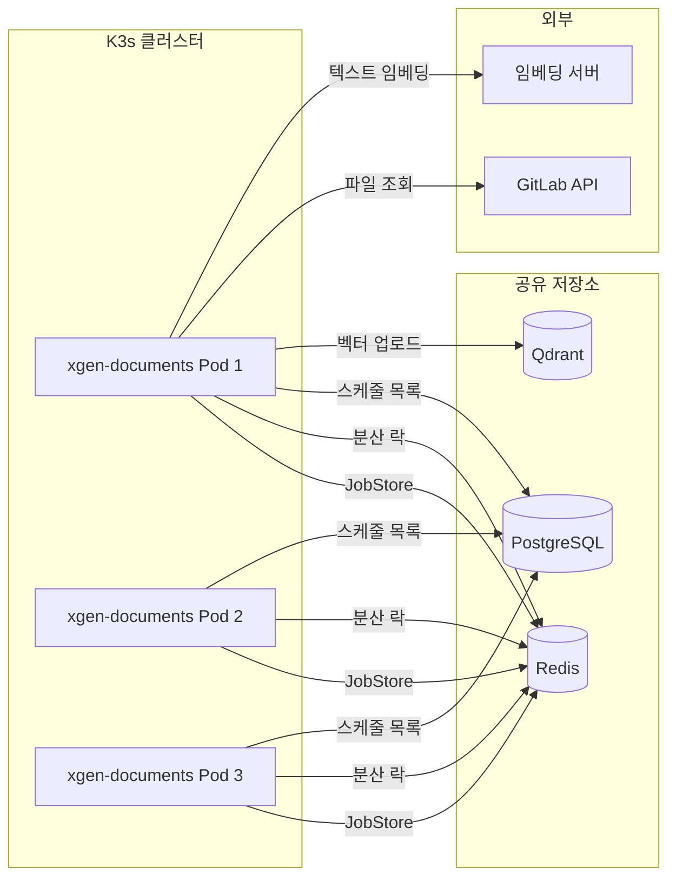
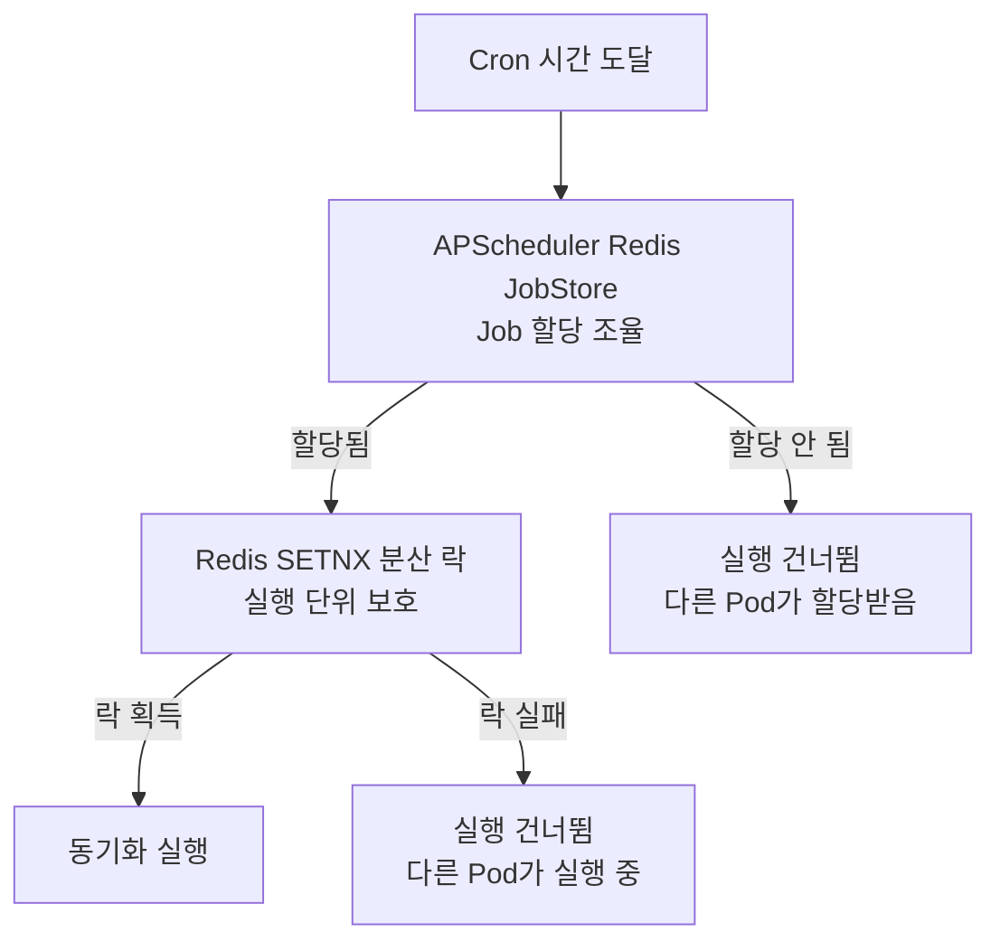
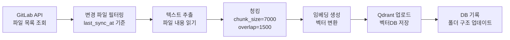
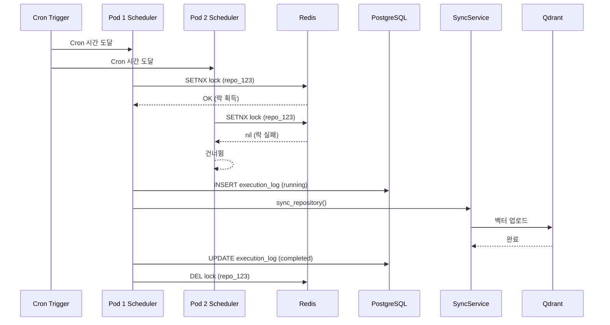

## 배경: 코드 레포지토리를 벡터DB에 자동 동기화해야 한다

XGEN 2.0은 RAG(Retrieval Augmented Generation) 기반 AI 플랫폼이다. 사용자가 GitLab 레포지토리를 등록하면, 해당 레포지토리의 소스코드를 벡터DB(Qdrant)에 자동으로 인덱싱해서 코드 검색과 질의응답에 활용한다. 여기서 "자동"이 핵심이다. 레포지토리는 매일 변경되고, 사용자가 수동으로 "지금 동기화해줘"라고 할 수는 있지만, 그건 현실적이지 않다. Cron 기반 스케줄러가 주기적으로 레포지토리를 동기화해야 한다.

xgen-documents 서비스가 이 역할을 담당한다. 문서 처리, 임베딩, 벡터DB 업로드를 담당하는 Python(FastAPI) 기반 마이크로서비스다. 초기에는 단일 Pod로 운영했기 때문에 APScheduler의 기본 Memory JobStore로 충분했다. 스케줄러가 하나뿐이니 중복 실행 문제가 없었다.

문제는 K3s(Kubernetes) 환경에서 서비스를 멀티 Pod로 스케일 아웃하면서 시작됐다.

## 문제: 멀티 Pod에서 스케줄러가 동시에 실행된다

단일 Pod 환경에서는 RepositoryScheduler가 하나뿐이다. APScheduler가 메모리에 스케줄을 관리하고, 지정된 Cron 시간에 맞춰 동기화를 실행한다. 간단하다.

그런데 xgen-documents를 2~3개 Pod로 늘리면 각 Pod마다 독립적인 APScheduler 인스턴스가 생긴다. 각 인스턴스는 서로의 존재를 모른다. DB에서 활성 스케줄 목록을 읽어서 각자 Cron Job을 등록한다. 결과적으로 동일한 레포지토리 동기화가 Pod 수만큼 중복 실행된다.

구체적으로 어떤 문제가 발생하는지 정리하면 다음과 같다.

### 중복 실행의 피해

1. **벡터DB 중복 데이터**: 같은 파일이 여러 번 임베딩되어 Qdrant에 중복 포인트가 쌓인다. 검색 결과에서 동일한 코드 스니펫이 여러 번 나온다.
2. **GitLab API 부하**: 레포지토리 파일 목록 조회, 파일 내용 다운로드가 Pod 수만큼 배로 늘어난다. GitLab Rate Limit에 걸릴 수 있다.
3. **임베딩 서버 부하**: 텍스트를 벡터로 변환하는 임베딩 요청이 중복된다. GPU 리소스를 불필요하게 소모한다.
4. **실행 히스토리 오염**: 같은 시각에 같은 레포지토리의 실행 로그가 여러 개 생긴다. 어떤 게 정상이고 어떤 게 중복인지 구분이 안 된다.

### 해결 방향

이 문제를 해결하려면 두 가지 메커니즘이 필요하다.

1. **스케줄 상태 공유**: 여러 Pod가 동일한 스케줄 정보를 공유해서, 하나의 Pod만 Job을 실행한다.
2. **실행 단위 락**: 실제 동기화 실행 시 분산 락을 걸어서, 다른 Pod가 동시에 같은 작업을 실행하지 못하게 한다.

APScheduler 자체가 Redis JobStore를 지원하고, Redis의 SETNX 명령으로 분산 락을 구현할 수 있다. 기존 인프라에 Redis가 이미 있으니 추가 의존성 없이 해결할 수 있었다.

## 전체 아키텍처



핵심 포인트는 Redis가 두 가지 역할을 한다는 것이다. APScheduler의 JobStore로서 스케줄 메타데이터를 저장하고, 동시에 분산 락의 중재자 역할을 한다. PostgreSQL은 스케줄 설정(Cron 표현식, 활성 상태 등)과 실행 히스토리를 저장한다.

## RepositoryScheduler 클래스 설계

```python
# # 커밋: feat: 레포지토리 스케줄러 분산 환경 지원 (Redis 기반)
# # 날짜: 2026-02-04

class RepositoryScheduler:
    def __init__(self, sync_service, db_client, redis_url=None):
        self.sync_service = sync_service
        self.db_client = db_client
        self._redis_url = redis_url
        self._redis_client = None  # 분산 모드용
        self._scheduler = None

    def _is_distributed(self) -> bool:
        return self._redis_client is not None
```

생성자에서 `redis_url`을 선택적 파라미터로 받는다. Redis URL이 주어지면 분산 모드, 없으면 단일 Pod 모드다. `_is_distributed()` 메서드로 현재 모드를 판별한다. 이 설계는 개발 환경(단일 Pod)과 운영 환경(멀티 Pod)을 동일한 코드로 처리하기 위한 것이다.

### 싱글턴 초기화

```python
# # 커밋: feat: Initialize and manage RAG Service as a singleton in the application
# # 날짜: 2026-01-15
```

RepositoryScheduler는 애플리케이션 라이프사이클에서 싱글턴으로 관리된다. FastAPI의 lifespan 이벤트에서 생성하고, 종료 시 정리한다. APScheduler 인스턴스가 여러 개 생기면 의미가 없기 때문이다. 하나의 Pod 안에서는 반드시 하나의 스케줄러만 동작해야 한다.

## APScheduler 설정: 스케줄러 시작

```python
def start(self):
    if self._is_distributed():
        # Redis JobStore 사용: 중복 실행 방지
        from apscheduler.jobstores.redis import RedisJobStore
        jobstore = RedisJobStore(host=..., port=..., db=...)
        self._scheduler = AsyncIOScheduler(jobstores={"default": jobstore})
    else:
        # Memory JobStore (단일 Pod)
        self._scheduler = AsyncIOScheduler()

    self._scheduler.start()
    self._load_schedules_from_db()
```

`start()` 메서드에서 분산 모드 여부에 따라 JobStore를 결정한다.

### Memory JobStore vs Redis JobStore

**Memory JobStore**는 APScheduler의 기본 저장소다. 모든 스케줄 정보가 Python 프로세스 메모리에만 존재한다. 프로세스가 종료되면 스케줄도 사라진다. 단일 Pod 환경에서는 `_load_schedules_from_db()`가 시작 시 DB에서 스케줄을 다시 로드하니 문제없다.

**Redis JobStore**는 스케줄 메타데이터를 Redis에 저장한다. 여러 Pod의 APScheduler 인스턴스가 같은 Redis를 바라보면, 하나의 Job은 하나의 인스턴스만 실행한다. APScheduler가 내부적으로 Redis의 원자적 연산을 사용해서 Job 할당을 조율한다.

Redis JobStore를 쓰면 APScheduler 레벨에서 "누가 이 Job을 실행할 것인가"가 자동으로 조율된다. 그런데 이것만으로는 완벽하지 않다. APScheduler의 Redis JobStore는 스케줄 등록/해제는 공유하지만, 실제 Job 실행이 길어지는 경우(레포지토리 동기화는 수분~수십 분 걸릴 수 있다)에 대한 보호가 부족하다. 그래서 실행 단위에서 별도의 분산 락이 필요하다.

### CronTrigger 기반 스케줄 등록

```python
def add_schedule(self, repository_id, cron_expression, collection_name):
    """CronTrigger 기반 스케줄 추가"""
    trigger = CronTrigger.from_crontab(cron_expression)
    self._scheduler.add_job(
        self._execute_sync,
        trigger=trigger,
        id=f"repo_sync_{repository_id}",
        args=[repository_id, collection_name],
        coalesce=True,           # 밀린 작업 1번만 실행
        max_instances=1,          # 동시 실행 방지
        misfire_grace_time=300,   # 5분 유예
        replace_existing=True,
    )
```

각 파라미터가 분산 환경에서 왜 중요한지 하나씩 설명한다.

**`id=f"repo_sync_{repository_id}"`**: Job ID를 레포지토리 ID 기반으로 유니크하게 설정한다. Redis JobStore에서 같은 ID의 Job은 하나만 존재한다. 여러 Pod가 같은 ID로 `add_job`을 호출하면 `replace_existing=True` 덕분에 에러 없이 덮어쓴다.

**`coalesce=True`**: 스케줄러가 잠시 멈췄다가 재시작되면 "밀린" 실행이 여러 개 쌓일 수 있다. 예를 들어 매시 정각 실행인데 2시간 동안 스케줄러가 죽어있었으면, 다시 살아났을 때 밀린 2번의 실행을 모두 하는 게 아니라 1번만 실행한다. 레포지토리 동기화는 최신 상태만 반영하면 되니 과거 밀린 실행을 모두 할 필요가 없다.

**`max_instances=1`**: 같은 Job이 동시에 여러 인스턴스 실행되는 것을 방지한다. 이전 동기화가 아직 끝나지 않았는데 다음 Cron 시간이 되면 새 실행이 시작되지 않는다. 이것은 APScheduler 레벨의 보호이고, 분산 환경에서는 Redis 분산 락이 추가 보호 역할을 한다.

**`misfire_grace_time=300`**: 스케줄된 시간에서 300초(5분)까지 지연된 실행은 허용한다. 5분을 넘기면 그 실행은 건너뛴다. Pod 재시작이나 네트워크 지연으로 몇 초~몇 분 늦어지는 것은 허용하되, 너무 오래된 실행은 무시하는 전략이다.

**`replace_existing=True`**: 이미 같은 ID의 Job이 있으면 에러 대신 덮어쓴다. 멀티 Pod 환경에서 각 Pod가 시작 시 `_load_schedules_from_db()`를 호출해서 같은 Job을 등록하려 할 때 충돌을 방지한다.

## 분산 락: Redis SETNX 기반

APScheduler Redis JobStore가 스케줄 조율을 하지만, 실제 동기화 실행의 원자성을 보장하려면 별도의 분산 락이 필요하다.

```python
async def _execute_sync(self, repository_id, collection_name):
    """실제 동기화 실행 (분산 락 포함)"""
    if self._is_distributed():
        lock_key = f"xgen_documents:scheduler_lock:repo_sync_{repository_id}"
        # SETNX 기반 분산 락: 30분 TTL
        acquired = self._redis_client.set(
            lock_key,
            os.environ.get("POD_NAME", "unknown"),
            nx=True,
            ex=1800
        )
        if not acquired:
            logger.info(f"Sync for repo {repository_id} already running on another pod")
            return

    try:
        # 동기화 히스토리 DB 기록 (시작)
        log_id = await self._create_execution_log(repository_id, "running")

        # 실제 동기화 실행
        result = await self.sync_service.sync_repository(repository_id, collection_name)

        # 히스토리 DB 기록 (완료)
        await self._update_execution_log(log_id, "completed", result)
    except Exception as e:
        await self._update_execution_log(log_id, "failed", error=str(e))
    finally:
        if self._is_distributed():
            self._redis_client.delete(lock_key)
```

### SETNX(SET if Not eXists) 동작 원리

`redis.set(key, value, nx=True, ex=1800)`은 Redis의 `SET key value NX EX 1800` 명령과 동일하다.

- **NX**: 키가 존재하지 않을 때만 설정한다. 이미 키가 있으면 `None`을 반환한다.
- **EX 1800**: 키의 TTL을 1800초(30분)로 설정한다.

이 두 옵션이 원자적으로 실행되는 것이 분산 락의 핵심이다. 여러 Pod가 동시에 `SET ... NX`를 실행해도 Redis는 단일 스레드 모델이라 하나만 성공한다.

### lock_key 네이밍

```
xgen_documents:scheduler_lock:repo_sync_{repository_id}
```

네임스페이스를 포함한 키 구조를 사용한다. `xgen_documents`는 서비스 이름, `scheduler_lock`은 용도, `repo_sync_{repository_id}`는 대상이다. Redis에 다른 서비스의 키와 충돌하지 않도록 서비스 이름을 접두어로 붙인다.

### POD_NAME으로 lock owner 식별

```python
os.environ.get("POD_NAME", "unknown")
```

Kubernetes Downward API로 주입된 `POD_NAME` 환경변수를 락 값으로 사용한다. Redis에서 `GET lock_key`를 조회하면 어떤 Pod가 현재 락을 잡고 있는지 알 수 있다. 디버깅 시 "Pod A가 락을 잡고 있어서 Pod B가 건너뛰었다"는 것을 로그와 Redis 조회로 확인할 수 있다.

```yaml
# K3s Deployment에서 POD_NAME 주입
containers:
- name: xgen-documents
  env:
  - name: POD_NAME
    valueFrom:
      fieldRef:
        fieldPath: metadata.name
```

### 30분 TTL의 의미: 안전장치

TTL 1800초(30분)는 "정상적인 동기화는 30분 안에 끝난다"는 가정에 기반한다. 실제로 대부분의 레포지토리 동기화는 5~10분 내에 완료된다.

TTL이 없으면 어떻게 될까? Pod가 동기화 중간에 죽으면 `finally` 블록의 `redis.delete(lock_key)`가 실행되지 않는다. 락 키가 Redis에 영원히 남아서 해당 레포지토리의 동기화가 영구 차단된다. TTL은 이런 상황의 안전장치다.

```
시나리오: Pod 크래시 시 락 처리
1. Pod A가 repo_123 동기화 시작 → 락 획득 (TTL 30분)
2. Pod A가 10분 후 OOM으로 죽음 → finally 실행 안 됨
3. 락이 Redis에 남아있음 (남은 TTL: 20분)
4. Pod B가 repo_123 동기화 시도 → 락 획득 실패 → 건너뜀
5. 20분 후 TTL 만료 → 락 자동 해제
6. 다음 Cron 시간에 Pod B가 repo_123 동기화 → 락 획득 성공
```

30분이라는 수치는 보수적으로 잡은 것이다. 너무 짧으면 정상 동기화 중에 TTL이 만료되어 다른 Pod가 중복 실행할 수 있다. 너무 길면 Pod 크래시 후 복구까지 불필요하게 대기한다. 실측 기반으로 최대 동기화 시간의 2~3배를 TTL로 설정했다.

### 이중 보호 전략

분산 환경에서의 보호 메커니즘을 정리하면 두 계층이다.



**1계층 (APScheduler Redis JobStore)**: Cron 시간이 되면 APScheduler가 여러 Pod 중 하나에만 Job을 할당한다. 대부분의 경우 이것만으로 충분하다.

**2계층 (Redis SETNX 분산 락)**: 1계층을 통과했더라도 실제 실행 전에 분산 락을 한 번 더 확인한다. APScheduler의 JobStore 조율이 네트워크 지연이나 타이밍 이슈로 완벽하지 않을 수 있다. 또한, 사용자가 API를 통해 수동 동기화를 트리거하는 경우도 같은 락으로 보호된다.

## DB에서 스케줄 로드

```python
def _load_schedules_from_db(self):
    """DB에서 활성 스케줄 목록 로드 -> 스케줄러에 등록"""
    schedules = self.db_client.find_records(
        "schedule_sessions",
        {"is_active": True}
    )
    for schedule in schedules:
        self.add_schedule(
            schedule.repository_id,
            schedule.cron_expression,
            ...
        )
```

Pod가 시작될 때마다 PostgreSQL에서 활성 스케줄 목록을 읽어서 APScheduler에 등록한다. 이 과정이 모든 Pod에서 실행되지만, Redis JobStore 덕분에 실제 Job 실행은 하나의 Pod에서만 일어난다.

### DB 모델: ScheduleSession

```python
class ScheduleSession(BaseModel):
    id: int
    repository_id: int
    cron_expression: str    # "0 */6 * * *" (6시간마다)
    is_active: bool
    last_sync_at: Optional[datetime]
    created_at: datetime
```

`cron_expression`은 표준 5필드 Cron 형식이다. 사용자가 프론트엔드에서 "6시간마다", "매일 새벽 3시" 같은 옵션을 선택하면 해당하는 Cron 표현식으로 변환된다. `is_active` 플래그로 스케줄을 비활성화하면, `_load_schedules_from_db()`에서 제외된다.

`last_sync_at`은 마지막 동기화 시각이다. 동기화 서비스가 이 값을 기준으로 "이전 동기화 이후 변경된 파일"만 필터링한다. 전체 레포지토리를 매번 처음부터 인덱싱하는 것은 비효율적이니, 증분 동기화를 위한 기준점 역할을 한다.

## 동기화 파이프라인

스케줄러가 트리거하는 실제 동기화 과정은 다단계 파이프라인이다.



```python
class RepositorySyncService:
    async def sync_repository(self, repository_id, collection_name):
        # 1. GitLab API로 레포지토리 파일 목록 조회
        # 2. 변경된 파일만 필터링 (last_sync_at 기준)
        # 3. 파일 내용 추출 -> 청킹 (chunk_size=7000, overlap=1500)
        # 4. 임베딩 생성
        # 5. Qdrant 벡터DB에 업로드
        # 6. DB에 폴더 구조 레코드 생성
```

### 청킹 파라미터

`chunk_size=7000, overlap=1500`은 코드 파일에 최적화된 값이다. 일반 문서(1000~2000 토큰)보다 훨씬 큰 청크를 사용하는데, 코드는 문맥(함수 전체, 클래스 정의 등)이 중요하기 때문이다. 짧게 자르면 함수의 앞부분과 뒷부분이 다른 청크에 들어가서 검색 품질이 떨어진다.

`overlap=1500`은 이전 청크의 끝부분 1500자를 다음 청크의 시작에 포함한다. 청크 경계에 걸린 코드 블록이 최소한 하나의 청크에서는 완전한 형태로 포함되도록 보장한다.

### 증분 동기화

`last_sync_at` 기준으로 변경된 파일만 처리하는 증분 동기화 방식이다. GitLab API의 파일 목록에서 `last_modified` 시간을 비교해서 변경된 파일만 추출한다. 대규모 레포지토리(수천 개 파일)에서 매번 전체를 인덱싱하면 수십 분이 걸리지만, 증분 동기화는 변경된 몇 개 파일만 처리하면 되니 대부분 1~2분 내에 완료된다.

## 실행 히스토리: DB 기록

```python
class ScheduleExecutionLog(BaseModel):
    id: int
    schedule_session_id: int
    status: str  # "running" | "completed" | "failed"
    started_at: datetime
    completed_at: Optional[datetime]
    duration_seconds: Optional[float]
    files_processed: int
    error_message: Optional[str]
```

동기화 실행마다 DB에 이력을 남긴다. `_execute_sync()` 메서드의 흐름을 보면 세 단계로 기록한다.

### 시작 기록

```python
log_id = await self._create_execution_log(repository_id, "running")
```

동기화가 시작되면 `status="running"`으로 레코드를 생성한다. `started_at`에 현재 시각이 기록된다. 이 시점에서 프론트엔드는 해당 레포지토리가 "동기화 중"임을 사용자에게 표시할 수 있다.

### 완료 기록

```python
await self._update_execution_log(log_id, "completed", result)
```

동기화가 성공하면 `status="completed"`, `completed_at`, `duration_seconds`, `files_processed`를 업데이트한다. `duration_seconds`는 시작부터 완료까지의 소요 시간이다. `files_processed`는 실제로 처리된 파일 수다. 이 데이터로 "평균 동기화 시간"이나 "처리량 추이" 같은 지표를 만들 수 있다.

### 실패 기록

```python
except Exception as e:
    await self._update_execution_log(log_id, "failed", error=str(e))
```

예외 발생 시 `status="failed"`와 `error_message`를 기록한다. GitLab API 응답 에러, 임베딩 서버 타임아웃, Qdrant 연결 실패 등 다양한 원인이 있을 수 있다. 에러 메시지가 DB에 남아있으면 프론트엔드에서 사용자에게 "마지막 동기화가 실패했다. 원인: GitLab API 401 Unauthorized"처럼 구체적인 정보를 제공할 수 있다.

### 히스토리 활용

실행 히스토리가 쌓이면 다음과 같은 분석이 가능하다.

- 특정 레포지토리의 동기화 성공률
- 평균 동기화 소요 시간 (TTL 값 조정의 근거)
- 실패 패턴 (특정 시간대에 집중되는지, 특정 레포지토리에서만 발생하는지)
- 처리 파일 수 추이 (레포지토리 규모 변화 추적)

## 트러블슈팅

### 락 해제 실패 시 시나리오

가장 우려되는 시나리오는 Pod가 `_execute_sync` 실행 중에 갑자기 죽는 것이다. Kubernetes에서 Pod가 죽는 이유는 다양하다.

- OOM(Out of Memory): 대규모 레포지토리 동기화 중 메모리 초과
- Node 장애: 물리 서버 문제로 해당 Node의 모든 Pod가 죽음
- Rolling Update: 새 버전 배포 시 기존 Pod 종료

```python
finally:
    if self._is_distributed():
        self._redis_client.delete(lock_key)
```

`finally` 블록이 있지만, `SIGKILL`(강제 종료)에는 Python의 `finally`가 실행되지 않는다. K8s에서 `terminationGracePeriodSeconds` 내에 종료되지 않으면 SIGKILL이 날아간다.

이때 TTL이 안전장치로 작동한다. 30분 TTL이 만료되면 락이 자동 해제되어 다음 Cron 시간에 다른 Pod가 동기화를 이어받는다. 30분 동안은 해당 레포지토리의 동기화가 블록되지만, "영원히 블록"되는 것보다는 훨씬 낫다.

### 동시 실행 방지가 실패하는 경우

이론적으로 Redis SETNX 기반 분산 락이 실패할 수 있는 경우가 있다.

**시나리오 1: Redis 자체 장애**
Redis가 다운되면 SETNX 명령이 실패한다. 이 경우 `_execute_sync`에서 예외가 발생하고, 동기화가 아예 실행되지 않는다. 중복 실행보다는 미실행이 낫다. 다음 Cron 시간에 Redis가 복구되면 정상 동작한다.

**시나리오 2: TTL 만료 후 중복**
동기화가 30분을 초과하면 TTL이 만료되어 락이 해제된다. 이때 다른 Pod가 같은 레포지토리의 동기화를 시작할 수 있다. 대응 방안은 두 가지다.

첫째, TTL을 더 길게 잡는다. 하지만 크래시 복구 시간도 함께 늘어난다.
둘째, 실행 중인 작업이 주기적으로 TTL을 연장한다(watchdog 패턴).

```python
# watchdog 패턴 (추후 적용 가능)
async def _extend_lock_ttl(self, lock_key, interval=600):
    """10분마다 TTL을 30분으로 재설정"""
    while True:
        await asyncio.sleep(interval)
        self._redis_client.expire(lock_key, 1800)
```

현재는 대부분의 레포지토리 동기화가 10분 내에 완료되므로 30분 TTL로 충분하다. 대규모 레포지토리(수만 개 파일)가 등록되면 watchdog 패턴을 도입할 계획이다.

### 스케줄러 재시작 시 Job 중복 등록

모든 Pod가 시작 시 `_load_schedules_from_db()`를 호출한다. Redis JobStore에 이미 같은 ID의 Job이 있는데 또 `add_job`을 호출하면 어떻게 될까?

`replace_existing=True` 옵션 덕분에 에러 없이 덮어쓴다. Cron 표현식이 변경됐을 수도 있으니 최신 DB 값으로 교체하는 것이 올바른 동작이다. 만약 `replace_existing=False`(기본값)였다면 `ConflictingIdError`가 발생한다.

### Memory 모드에서 Redis 모드로 전환

개발 환경(Memory)에서 운영 환경(Redis)으로 전환하는 것은 환경변수 하나로 제어된다. `REDIS_URL`이 설정되면 Redis 모드, 없으면 Memory 모드다.

```python
# 환경변수 기반 모드 결정
redis_url = os.environ.get("REDIS_URL")
scheduler = RepositoryScheduler(
    sync_service=sync_service,
    db_client=db_client,
    redis_url=redis_url
)
```

로컬 개발 시에는 Redis 없이도 스케줄러가 정상 동작한다. CI/CD 파이프라인에서 테스트할 때도 Redis 의존성 없이 단위 테스트를 실행할 수 있다. 운영 환경에서만 `REDIS_URL`을 K8s ConfigMap이나 Secret으로 주입한다.

## 실행 흐름 시퀀스

전체 흐름을 시간 순서대로 정리한다.



Pod 1과 Pod 2가 거의 동시에 Cron 시간에 도달한다. 둘 다 Redis에 SETNX를 시도하지만, Redis의 단일 스레드 특성상 하나만 성공한다. 성공한 Pod가 동기화를 실행하고, 실패한 Pod는 즉시 반환한다. 동기화가 완료되면 락을 해제하고, DB에 실행 히스토리를 기록한다.

## 단일 Pod에서 분산 환경으로의 전환 체크리스트

단일 Pod 환경에서 멀티 Pod 환경으로 전환할 때 확인해야 할 항목을 정리한다. 이 프로젝트에서 실제로 겪었던 것들이다.

### 인프라 설정

1. **Redis 접근 가능 여부**: xgen-documents Pod에서 Redis에 네트워크 접근이 가능한지 확인. K3s 네임스페이스 간 통신이 차단되어 있으면 NetworkPolicy를 수정해야 한다.
2. **REDIS_URL 환경변수**: K8s Deployment에 환경변수 추가. `redis://:<password>@redis.xgen-system.svc.cluster.local:6379/1` 형식.
3. **POD_NAME 환경변수**: Kubernetes Downward API로 Pod 이름 주입. 디버깅에 필수.

### 코드 수준

1. **APScheduler Redis 의존성**: `pip install apscheduler[redis]` 또는 `redis` 패키지가 requirements에 포함되어 있는지 확인.
2. **JobStore 분기 로직**: `_is_distributed()` 기반으로 Memory/Redis 자동 선택.
3. **분산 락 구현**: `_execute_sync()`에서 SETNX + TTL.
4. **lock owner 식별**: POD_NAME 기록으로 디버깅 가능하게.
5. **TTL 값 결정**: 최대 동기화 시간의 2~3배.

### 운영 모니터링

1. **실행 히스토리 대시보드**: 프론트엔드에서 스케줄 실행 내역 조회 가능.
2. **락 상태 조회**: `redis-cli KEYS xgen_documents:scheduler_lock:*`로 현재 활성 락 확인.
3. **수동 락 해제**: 비상 시 `redis-cli DEL xgen_documents:scheduler_lock:repo_sync_{id}`로 강제 해제.

## 결과

분산 환경 전환 후 xgen-documents를 3개 Pod로 운영하면서도 스케줄러 중복 실행 문제가 발생하지 않았다.

- **Redis JobStore**: APScheduler 레벨에서 Job 할당 조율
- **SETNX 분산 락**: 실행 단위에서 원자적 보호, 30분 TTL로 크래시 복구
- **coalesce + max_instances**: 밀린 작업과 동시 실행 방지
- **실행 히스토리**: 성공/실패/소요시간 DB 기록으로 운영 가시성 확보
- **환경변수 기반 모드 전환**: `REDIS_URL` 유무로 단일/분산 모드 자동 선택

단일 Pod에서 멀티 Pod로 전환하면서 가장 중요했던 것은 "기존 단일 Pod 동작을 깨뜨리지 않으면서 분산 지원을 추가한다"는 원칙이었다. `_is_distributed()` 분기 하나로 두 모드를 지원하고, 개발 환경에서는 Redis 없이도 동작하고, 운영 환경에서는 Redis가 있으면 자동으로 분산 모드로 전환된다. 이 패턴은 xgen-documents 외에 다른 서비스(xgen-core, xgen-workflow)에서도 재사용 가능하다.
