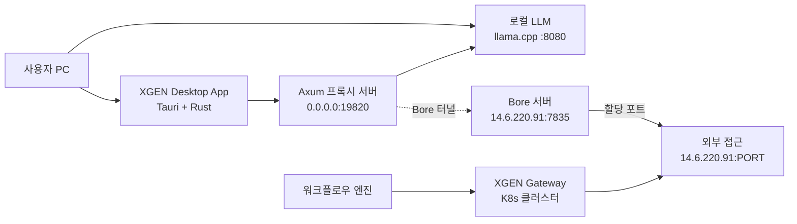
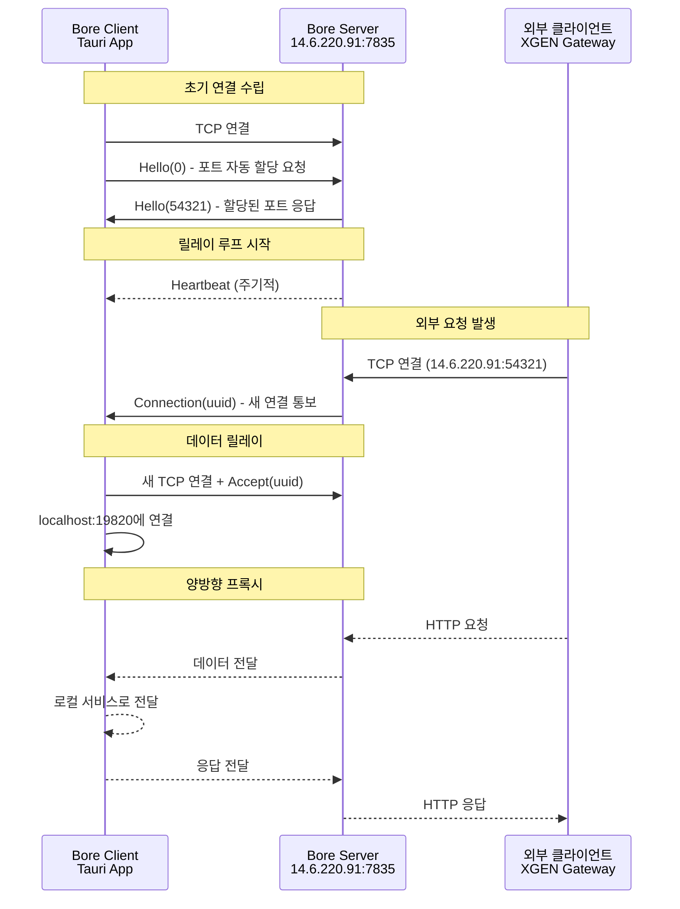

# Bore 프로토콜로 터널 통신 구현하기

## 왜 터널이 필요한가

XGEN 데스크톱 앱은 사용자 PC에서 로컬 LLM을 실행한다. llama.cpp, vLLM 같은 추론 서버를 띄우면 `localhost:8080` 같은 로컬 주소로 접근할 수 있다. 사용자 혼자 쓸 때는 문제가 없지만, XGEN 플랫폼의 워크플로우 엔진이나 다른 서비스에서 이 로컬 LLM에 접근해야 하는 상황이 발생했다.

문제는 XGEN Gateway(`xgen-backend-gateway`)가 K8s 클러스터에 배포되어 있다는 점이다. K8s 파드에서 사용자 PC의 `localhost:8080`에 접근할 수 있는 방법은 없다. 사용자의 PC는 NAT 뒤에 있고, 방화벽이 들어오는 연결을 차단한다. 외부에서 로컬 서비스에 접근하려면 터널링이 필수다.

ngrok이나 bore 같은 기존 터널링 솔루션이 있었다. ngrok은 계정 등록과 authtoken이 필요하고, 무료 플랜의 제약도 있다. bore는 오픈소스이고 자체 서버를 운영할 수 있어서 제약이 없지만, CLI 바이너리를 Tauri 앱에 포함시켜야 한다. Tauri의 sidecar 기능으로 외부 바이너리를 실행할 수는 있지만, 크로스 플랫폼(Linux, macOS, Windows)에서 각 OS별 bore 바이너리를 관리하는 건 번거로운 일이다.

그래서 bore 프로토콜을 직접 구현하기로 했다. bore의 프로토콜은 null-terminated JSON over TCP라는 단순한 구조여서 구현 복잡도가 낮았고, Rust 코드로 작성하면 Tauri 앱에 네이티브로 통합할 수 있다. 외부 바이너리 의존성 없이, 에러 핸들링도 Rust의 `Result` 타입으로 일관되게 처리할 수 있다.

## 전체 아키텍처



데이터 흐름을 정리하면 다음과 같다.

1. 사용자 PC에서 로컬 LLM(llama.cpp)이 `localhost:8080`에서 실행된다
2. Tauri 앱 내부의 Axum 프록시 서버가 `0.0.0.0:19820`에서 시작된다
3. 프록시 서버는 들어오는 요청을 `localhost:8080`으로 전달한다
4. Bore 터널이 프록시 서버(19820)를 자체 bore 서버(`14.6.220.91`)의 임의 포트로 노출한다
5. K8s의 XGEN Gateway가 bore 서버의 할당된 포트로 요청을 보내면, 터널을 통해 사용자 PC의 로컬 LLM에 도달한다

로컬 LLM을 직접 터널링하지 않고 중간에 Axum 프록시를 끼운 이유가 있다. 프록시 서버가 요청 검증(localhost URL만 허용), 선택적 API 키 인증, CORS 헤더 추가를 담당한다. 또한 프록시 서버의 포트(19820)를 고정해두면, 로컬 LLM의 포트가 바뀌더라도 터널을 재연결할 필요 없이 프록시 설정만 변경하면 된다.

## Bore 프로토콜 구조

bore 프로토콜은 TCP 소켓 위에서 동작하는 단순한 JSON 기반 프로토콜이다. 메시지 하나는 JSON 문자열 뒤에 null 바이트(`\0`)가 붙는 형식이다.

```
{"Hello":0}\0
```

클라이언트가 서버에 보내는 메시지와 서버가 클라이언트에 보내는 메시지가 각각 정의되어 있다.

### 메시지 타입

클라이언트 메시지 (ClientMessage):

| 메시지 | 형식 | 용도 |
|--------|------|------|
| `Authenticate` | `{"Authenticate":"hmac_string"}` | 인증 시크릿 전송 |
| `Hello` | `{"Hello":0}` | 포트 요청 (0 = 자동 할당) |
| `Accept` | `{"Accept":"uuid"}` | 연결 수락 |

서버 메시지 (ServerMessage):

| 메시지 | 형식 | 용도 |
|--------|------|------|
| `Challenge` | `{"Challenge":"uuid"}` | 인증 챌린지 |
| `Hello` | `{"Hello":12345}` | 할당된 포트 응답 |
| `Heartbeat` | `"Heartbeat"` | 연결 유지 |
| `Connection` | `{"Connection":"uuid"}` | 새 연결 알림 |
| `Error` | `{"Error":"msg"}` | 에러 |

### 핸드셰이크 시퀀스



핵심은 두 종류의 TCP 연결이 있다는 것이다. 하나는 **컨트롤 연결**으로, 클라이언트가 서버에 최초 접속하여 포트를 할당받고, 이후 `Heartbeat`와 `Connection` 메시지를 주고받는다. 다른 하나는 **데이터 연결**으로, 외부 클라이언트가 접속할 때마다 생성되는 별도의 TCP 소켓이다. 데이터 연결에서는 `Accept` 메시지를 보낸 뒤, 바로 양방향 프록시가 시작된다.

## 메시지 타입 정의

Rust의 enum을 사용하면 bore 프로토콜의 메시지 타입을 타입 안전하게 정의할 수 있다. serde의 자동 직렬화 덕분에 JSON 파싱 코드를 별도로 작성할 필요가 없다.

```rust
use serde::{Deserialize, Serialize};
use uuid::Uuid;

/// bore 클라이언트 메시지 (서버로 보내는 메시지)
#[derive(Debug, Serialize, Deserialize)]
pub enum ClientMessage {
    /// 인증 응답
    Authenticate(String),
    /// 초기 연결 요청 (포트 번호, 0 = 자동 할당)
    Hello(u16),
    /// 연결 수락
    Accept(Uuid),
}

/// bore 서버 메시지 (서버에서 받는 메시지)
#[derive(Debug, Serialize, Deserialize)]
pub enum ServerMessage {
    /// 인증 챌린지
    Challenge(Uuid),
    /// Hello 응답 (할당된 포트)
    Hello(u16),
    /// 하트비트
    Heartbeat,
    /// 새 연결 요청
    Connection(Uuid),
    /// 에러
    Error(String),
}
```

serde가 Rust enum을 JSON으로 직렬화할 때 기본적으로 externally tagged 방식을 사용한다. `ClientMessage::Hello(0)`은 `{"Hello":0}`으로, `ServerMessage::Connection(uuid)`는 `{"Connection":"550e8400-..."}`으로 변환된다. bore 서버가 보내는 JSON 형식과 정확히 일치한다.

`Heartbeat`처럼 데이터가 없는 variant는 `"Heartbeat"`라는 문자열로 직렬화된다. 이 점이 처음에 파싱 에러를 일으킨 부분인데, 뒤에서 자세히 다룬다.

## 메시지 송수신 구현

bore 프로토콜의 메시지 프레이밍은 null 바이트(`\0`)를 구분자로 사용한다. 이것이 length-prefixed 방식과 다른 점이다.

```rust
use tokio::io::{AsyncBufReadExt, AsyncWriteExt, BufReader};
use tokio::net::TcpStream;

/// null-terminated JSON 메시지 전송
async fn send_message<T: Serialize>(stream: &mut TcpStream, msg: &T) -> Result<(), String> {
    let json = serde_json::to_string(msg)
        .map_err(|e| format!("Failed to serialize: {}", e))?;

    // JSON + null terminator
    let mut bytes = json.into_bytes();
    bytes.push(0);

    stream.write_all(&bytes).await
        .map_err(|e| format!("Failed to send: {}", e))?;
    stream.flush().await
        .map_err(|e| format!("Failed to flush: {}", e))?;

    Ok(())
}

/// null-terminated JSON 메시지 수신
async fn recv_message<T: for<'de> Deserialize<'de>>(
    reader: &mut BufReader<tokio::net::tcp::OwnedReadHalf>,
) -> Result<T, String> {
    let mut buf = Vec::new();

    // null 문자까지 읽기
    reader.read_until(0, &mut buf).await
        .map_err(|e| format!("Failed to read: {}", e))?;

    // null 문자 제거
    if buf.last() == Some(&0) {
        buf.pop();
    }

    if buf.is_empty() {
        return Err("Empty message received".to_string());
    }

    serde_json::from_slice(&buf)
        .map_err(|e| format!("Failed to parse JSON: {} (raw: {:?})",
            e, String::from_utf8_lossy(&buf)))
}
```

`send_message`는 제네릭 타입 `T`를 JSON으로 직렬화한 뒤 null 바이트를 붙여서 전송한다. `recv_message`는 `BufReader::read_until(0, ...)`을 사용하여 null 바이트가 나올 때까지 읽는다. `read_until`은 구분자를 포함해서 버퍼에 넣으므로, 마지막 null 바이트를 제거한 뒤 JSON 파싱을 수행한다.

`recv_message`의 에러 메시지에 `raw` 값을 포함시킨 것은 디버깅을 위해서다. bore 서버가 보내는 메시지 형식이 예상과 다를 때, 실제로 어떤 바이트가 왔는지 확인할 수 있다. 실제로 이 로그가 첫 번째 구현의 버그를 잡는 데 결정적이었다.

수신 시 `BufReader`를 사용하는 이유가 있다. `TcpStream`을 직접 사용하면 1바이트씩 읽어야 null 바이트를 감지할 수 있는데, 이는 시스템 콜이 메시지 길이만큼 발생한다는 뜻이다. `BufReader`는 내부 버퍼(기본 8KB)로 한 번에 읽어서 null 바이트를 찾으므로 시스템 콜 횟수가 크게 줄어든다.

## 터널 시작: 핸드셰이크

`TunnelManager::start` 메서드가 터널 연결의 전체 흐름을 담당한다. bore 서버에 TCP 연결을 맺고, `Hello` 메시지를 보내서 포트를 할당받은 뒤, 릴레이 루프를 시작한다.

```rust
pub struct TunnelManager {
    tunnel: Arc<RwLock<Option<ActiveTunnel>>>,
    status: Arc<RwLock<TunnelStatus>>,
    server_host: String,
    server_port: u16,
}

/// 활성 터널 정보
struct ActiveTunnel {
    public_url: String,
    local_port: u16,
    shutdown_tx: tokio::sync::oneshot::Sender<()>,
}
```

`TunnelManager`는 현재 활성 터널 정보와 상태를 `Arc<RwLock<...>>`으로 관리한다. Tauri 앱의 여러 커맨드에서 동시에 접근할 수 있으므로 동시성 제어가 필요하다. `shutdown_tx`는 `oneshot::Sender`로, 터널을 중지할 때 릴레이 루프에 시그널을 보내는 역할이다.

```rust
pub async fn start(&self, local_port: u16) -> Result<String, String> {
    // 이미 연결된 경우
    {
        let tunnel = self.tunnel.read().await;
        if let Some(active) = tunnel.as_ref() {
            if active.local_port == local_port {
                log::info!("Tunnel already connected: {}", active.public_url);
                return Ok(active.public_url.clone());
            }
        }
    }

    // 기존 터널 중지
    self.stop().await;

    log::info!(
        "Starting bore tunnel: localhost:{} -> {}:{}",
        local_port, self.server_host, self.server_port
    );

    // bore 서버에 연결
    let server_addr = format!("{}:{}", self.server_host, self.server_port);
    let mut stream = TcpStream::connect(&server_addr)
        .await
        .map_err(|e| format!("Failed to connect to tunnel server: {}", e))?;

    // Hello 메시지 전송 (포트 0 = 자동 할당)
    let hello = ClientMessage::Hello(0);
    Self::send_message(&mut stream, &hello).await?;

    log::info!("Sent Hello message, waiting for response...");

    // 스트림 분리
    let (read_half, write_half) = stream.into_split();
    let mut reader = BufReader::new(read_half);

    // 서버 응답 읽기
    let response: ServerMessage = Self::recv_message(&mut reader).await?;

    let assigned_port = match response {
        ServerMessage::Hello(port) => {
            log::info!("Server assigned port: {}", port);
            port
        }
        ServerMessage::Error(msg) => {
            return Err(format!("Server error: {}", msg));
        }
        other => {
            return Err(format!("Unexpected response: {:?}", other));
        }
    };

    let public_url = format!("http://{}:{}", self.server_host, assigned_port);
    log::info!("Tunnel established: {} -> localhost:{}", public_url, local_port);

    // 릴레이 태스크 시작
    let (shutdown_tx, shutdown_rx) = tokio::sync::oneshot::channel();
    let server_host = self.server_host.clone();
    let server_port = self.server_port;

    tokio::spawn(async move {
        Self::relay_loop(
            reader, write_half, local_port,
            server_host, server_port, assigned_port,
            shutdown_rx,
        ).await;
    });

    // 상태 업데이트
    {
        let mut tunnel = self.tunnel.write().await;
        *tunnel = Some(ActiveTunnel {
            public_url: public_url.clone(),
            local_port,
            shutdown_tx,
        });
    }

    {
        let mut status = self.status.write().await;
        status.connected = true;
        status.public_url = Some(public_url.clone());
        status.local_port = Some(local_port);
        status.error = None;
    }

    Ok(public_url)
}
```

`Hello(0)`에서 `0`은 "서버가 알아서 포트를 할당해달라"는 뜻이다. 특정 포트를 고정하고 싶으면 원하는 포트 번호를 넣으면 되지만, 포트 충돌을 피하기 위해 자동 할당을 사용했다.

TCP 스트림을 `into_split()`으로 읽기/쓰기 반쪽으로 분리하는 부분이 중요하다. 릴레이 루프에서 서버의 메시지를 읽으면서 동시에 새 데이터 연결에서 쓰기가 필요하기 때문이다. tokio의 `TcpStream::into_split()`은 `Arc`와 `Mutex` 없이도 안전하게 소유권을 분리해준다.

릴레이 루프는 별도의 tokio 태스크로 스폰된다. `start` 메서드는 public URL을 반환하고 즉시 리턴하며, 릴레이 루프는 백그라운드에서 계속 실행된다.

## 릴레이 루프와 연결 처리

핸드셰이크가 완료되면 릴레이 루프가 시작된다. 이 루프는 bore 서버에서 오는 메시지를 계속 대기하다가, `Connection` 메시지가 오면 새 데이터 연결을 생성한다.

```rust
async fn relay_loop(
    mut reader: BufReader<tokio::net::tcp::OwnedReadHalf>,
    mut _write_half: tokio::net::tcp::OwnedWriteHalf,
    local_port: u16,
    server_host: String,
    server_port: u16,
    assigned_port: u16,
    mut shutdown_rx: tokio::sync::oneshot::Receiver<()>,
) {
    log::info!("Tunnel relay loop started");

    loop {
        tokio::select! {
            _ = &mut shutdown_rx => {
                log::info!("Tunnel relay shutdown requested");
                break;
            }
            result = Self::recv_message::<ServerMessage>(&mut reader) => {
                match result {
                    Ok(msg) => {
                        if let Err(e) = Self::handle_server_message(
                            msg, local_port,
                            &server_host, server_port, assigned_port,
                        ).await {
                            log::error!("Error handling message: {}", e);
                        }
                    }
                    Err(e) => {
                        log::error!("Tunnel relay error: {}", e);
                        break;
                    }
                }
            }
        }
    }

    log::info!("Tunnel relay loop ended");
}
```

`tokio::select!`로 두 가지 이벤트를 동시에 대기한다. 하나는 shutdown 시그널이고, 다른 하나는 서버 메시지 수신이다. shutdown 시그널이 오면 루프를 빠져나가고, 서버 메시지가 오면 `handle_server_message`에서 처리한다. 서버와의 연결이 끊어져 `recv_message`가 에러를 반환하면 역시 루프를 종료한다.

```rust
async fn handle_server_message(
    msg: ServerMessage,
    local_port: u16,
    server_host: &str,
    server_port: u16,
    assigned_port: u16,
) -> Result<(), String> {
    match msg {
        ServerMessage::Connection(uuid) => {
            log::info!("New connection request: {}", uuid);

            let server_addr = format!("{}:{}", server_host, server_port);

            tokio::spawn(async move {
                if let Err(e) = Self::handle_connection(
                    uuid, local_port, &server_addr, assigned_port,
                ).await {
                    log::error!("Connection {} failed: {}", uuid, e);
                }
            });
        }
        ServerMessage::Heartbeat => {
            log::debug!("Received heartbeat");
        }
        ServerMessage::Error(msg) => {
            log::error!("Server error: {}", msg);
            return Err(msg);
        }
        other => {
            log::warn!("Unexpected message: {:?}", other);
        }
    }

    Ok(())
}
```

`Connection` 메시지를 받으면 새 tokio 태스크를 스폰하여 처리한다. 각 연결을 별도 태스크에서 처리하므로, 하나의 연결이 느려도 다른 연결에 영향을 주지 않는다. bore 서버의 `Heartbeat`는 수신만 하고 별도 응답을 보내지 않는다. bore 프로토콜에서 하트비트 응답은 요구되지 않기 때문이다.

## 데이터 연결: Accept와 양방향 프록시

외부 클라이언트가 bore 서버의 할당된 포트에 접속하면, bore 서버는 컨트롤 연결을 통해 `Connection(uuid)` 메시지를 보낸다. 클라이언트는 이 uuid를 사용해 새 TCP 연결을 생성하고, `Accept` 메시지로 응답한 뒤, 로컬 서비스와 양방향 프록시를 시작한다.

```rust
async fn handle_connection(
    uuid: Uuid,
    local_port: u16,
    server_addr: &str,
    _assigned_port: u16,
) -> Result<(), String> {
    // 서버에 새 TCP 연결 (Accept용)
    let mut server_stream = TcpStream::connect(server_addr)
        .await
        .map_err(|e| format!("Failed to connect for accept: {}", e))?;

    // Accept 메시지 전송
    let accept = ClientMessage::Accept(uuid);
    Self::send_message(&mut server_stream, &accept).await?;

    log::debug!("Sent Accept for connection {}", uuid);

    // 로컬 서비스에 연결
    let local_addr = format!("127.0.0.1:{}", local_port);
    let local_stream = TcpStream::connect(&local_addr)
        .await
        .map_err(|e| format!("Failed to connect to local service: {}", e))?;

    log::debug!("Connected to local service for {}", uuid);

    // 양방향 프록시
    let (mut server_read, mut server_write) = server_stream.into_split();
    let (mut local_read, mut local_write) = local_stream.into_split();

    let s2l = tokio::spawn(async move {
        tokio::io::copy(&mut server_read, &mut local_write).await
    });

    let l2s = tokio::spawn(async move {
        tokio::io::copy(&mut local_read, &mut server_write).await
    });

    // 하나가 끝나면 둘 다 종료
    tokio::select! {
        r = s2l => {
            if let Err(e) = r {
                log::debug!("Server->Local copy ended: {}", e);
            }
        }
        r = l2s => {
            if let Err(e) = r {
                log::debug!("Local->Server copy ended: {}", e);
            }
        }
    }

    log::debug!("Connection {} finished", uuid);
    Ok(())
}
```

핵심은 `Accept` 메시지를 보내는 데 **새 TCP 연결**을 사용한다는 점이다. 기존 컨트롤 연결이 아니라 별도의 연결을 bore 서버에 맺고, 그 연결에서 `Accept(uuid)`를 전송한다. bore 서버는 이 uuid를 보고 외부 클라이언트의 연결과 매칭한 뒤, 이 TCP 소켓을 직접 양방향 파이프로 연결한다.

`Accept` 이후에는 bore 프로토콜의 JSON 메시지가 아니라 raw TCP 데이터가 흐른다. 외부 클라이언트가 보내는 HTTP 요청 바이트가 그대로 서버 소켓에서 나오고, `tokio::io::copy`가 이를 로컬 서비스 소켓에 복사한다. 반대 방향도 마찬가지다.

`tokio::select!`로 양방향 중 하나가 끝나면 전체 연결을 종료한다. HTTP 응답이 완료되어 서버 쪽이 먼저 닫히든, 로컬 서비스가 먼저 닫히든, 어느 한쪽이 끝나면 나머지도 정리된다.

## 프록시 서버: Axum 기반 로컬 HTTP 프록시

로컬 LLM을 bore 터널에 직접 연결하지 않고, 중간에 Axum 프록시 서버를 배치했다. 이 프록시 서버는 보안 검증, CORS 헤더 추가, 엔드포인트 동적 변경 등을 담당한다.

```rust
use axum::{
    body::Body,
    extract::{Path, State},
    http::{header, Method, Request, StatusCode},
    response::{IntoResponse, Response},
    routing::{any, get},
    Router,
};
use tower_http::cors::{Any, CorsLayer};

#[derive(Clone)]
pub struct ProxyServerState {
    pub local_llm_endpoint: Arc<RwLock<Option<String>>>,
    pub api_key: Arc<RwLock<Option<String>>>,
}
```

프록시 서버의 상태는 두 가지다. `local_llm_endpoint`는 요청을 전달할 로컬 LLM의 주소(예: `http://127.0.0.1:8080`)이고, `api_key`는 선택적 인증을 위한 API 키다. 둘 다 `Arc<RwLock<...>>`으로 감싸서 런타임에 변경할 수 있도록 했다.

```rust
pub async fn start(&mut self, port: u16) -> Result<u16, String> {
    let state = self.state.clone();
    let (shutdown_tx, shutdown_rx) = tokio::sync::oneshot::channel::<()>();

    // CORS 설정
    let cors = CorsLayer::new()
        .allow_origin(Any)
        .allow_methods([
            Method::GET, Method::POST, Method::PUT,
            Method::DELETE, Method::OPTIONS,
        ])
        .allow_headers(Any);

    // 라우터 설정
    let app = Router::new()
        .route("/health", get(health_check))
        .route("/v1/{*path}", any(proxy_handler))
        .route("/{*path}", any(proxy_handler))
        .layer(cors)
        .with_state(state);

    // 서버 바인딩
    let addr = std::net::SocketAddr::from(([0, 0, 0, 0], port));
    let listener = tokio::net::TcpListener::bind(addr).await
        .map_err(|e| format!("Failed to bind to port {}: {}", port, e))?;

    let actual_port = listener.local_addr()
        .map_err(|e| format!("Failed to get local address: {}", e))?
        .port();

    // 서버 실행 (백그라운드)
    tokio::spawn(async move {
        axum::serve(listener, app)
            .with_graceful_shutdown(async {
                shutdown_rx.await.ok();
            })
            .await
            .ok();
    });

    self.shutdown_tx = Some(shutdown_tx);
    self.port = Some(actual_port);

    Ok(actual_port)
}
```

`0.0.0.0`에 바인딩하는 이유는 bore 터널이 외부에서 들어오는 연결을 로컬 포트로 전달하기 때문이다. `127.0.0.1`에 바인딩하면 bore 터널이 연결할 수 없다. `with_graceful_shutdown`으로 shutdown 시그널을 받으면 열린 연결을 정리한 뒤 종료한다.

라우트 설정에서 `/v1/{*path}`와 `/{*path}` 두 가지를 등록했다. OpenAI 호환 API는 `/v1/chat/completions` 같은 경로를 사용하므로 `/v1/` 접두사를 잡아내고, 나머지 경로도 모두 프록시한다. axum 0.8에서는 와일드카드 경로에 `{*path}` 문법을 사용한다.

### 프록시 핸들러

```rust
async fn proxy_handler(
    State(state): State<ProxyServerState>,
    Path(path): Path<String>,
    req: Request<Body>,
) -> Response {
    // 로컬 LLM 엔드포인트 확인
    let endpoint = {
        let guard = state.local_llm_endpoint.read().await;
        guard.clone()
    };

    let endpoint = match endpoint {
        Some(ep) => ep,
        None => {
            return (StatusCode::SERVICE_UNAVAILABLE,
                "Local LLM endpoint not configured").into_response();
        }
    };

    // API 키 검증 (설정된 경우)
    let expected_key = {
        let guard = state.api_key.read().await;
        guard.clone()
    };

    if let Some(expected) = expected_key {
        let auth_header = req.headers()
            .get(header::AUTHORIZATION)
            .and_then(|v| v.to_str().ok())
            .unwrap_or("");

        let provided_key = auth_header
            .strip_prefix("Bearer ")
            .unwrap_or(auth_header);

        if provided_key != expected {
            return (StatusCode::UNAUTHORIZED, "Invalid API key").into_response();
        }
    }

    // 대상 URL 구성
    let target_url = format!("{}/{}", endpoint.trim_end_matches('/'), path);

    // 요청 전달 (reqwest)
    let client = reqwest::Client::new();
    let method = req.method().clone();

    let mut request_builder = match method {
        Method::GET => client.get(&target_url),
        Method::POST => client.post(&target_url),
        Method::PUT => client.put(&target_url),
        Method::DELETE => client.delete(&target_url),
        Method::PATCH => client.patch(&target_url),
        _ => {
            return (StatusCode::METHOD_NOT_ALLOWED,
                "Method not allowed").into_response();
        }
    };

    // 헤더 복사 (Host, Connection 제외)
    for (name, value) in req.headers().iter() {
        if name != header::HOST && name != header::CONNECTION {
            if let Ok(v) = value.to_str() {
                request_builder = request_builder.header(name.as_str(), v);
            }
        }
    }

    // Body 전달
    let body_bytes = match axum::body::to_bytes(req.into_body(), usize::MAX).await {
        Ok(bytes) => bytes,
        Err(e) => {
            return (StatusCode::BAD_REQUEST,
                "Failed to read request body").into_response();
        }
    };

    if !body_bytes.is_empty() {
        request_builder = request_builder.body(body_bytes.to_vec());
    }

    // 실행 및 스트리밍 응답 전달
    match request_builder.send().await {
        Ok(resp) => {
            let status = StatusCode::from_u16(resp.status().as_u16())
                .unwrap_or(StatusCode::INTERNAL_SERVER_ERROR);

            let content_type = resp.headers()
                .get(header::CONTENT_TYPE)
                .and_then(|v| v.to_str().ok())
                .unwrap_or("application/json")
                .to_string();

            let body_stream = resp.bytes_stream();

            Response::builder()
                .status(status)
                .header(header::CONTENT_TYPE, content_type)
                .header(header::ACCESS_CONTROL_ALLOW_ORIGIN, "*")
                .body(Body::from_stream(body_stream))
                .unwrap_or_else(|_| {
                    (StatusCode::INTERNAL_SERVER_ERROR,
                        "Failed to build response").into_response()
                })
        }
        Err(e) => {
            (StatusCode::BAD_GATEWAY,
                format!("Failed to connect to local LLM: {}", e)).into_response()
        }
    }
}
```

프록시 핸들러에서 주목할 부분은 스트리밍 응답 처리다. `resp.bytes_stream()`으로 reqwest의 응답을 스트림으로 받아서 `Body::from_stream()`으로 axum의 응답 바디에 연결한다. LLM 추론 서버는 SSE(Server-Sent Events)로 토큰을 하나씩 스트리밍하는데, 이 프록시가 버퍼링 없이 바이트를 그대로 전달하므로 스트리밍 응답이 끊기지 않는다.

`Host`와 `Connection` 헤더를 제외하고 나머지 헤더를 모두 복사한다. `Host` 헤더는 프록시 대상의 주소와 달라서 제거하고, `Connection` 헤더는 hop-by-hop 헤더여서 프록시에서 전달하면 안 된다.

## Tauri IPC 커맨드 통합

프록시 서버와 bore 터널을 Tauri의 IPC 시스템에 통합하는 부분이다. `ProxyServerManager`가 프록시 서버와 터널 매니저를 하나로 묶어 관리한다.

```rust
pub struct ProxyServerManager {
    server: Mutex<ProxyServer>,
    tunnel: TunnelManager,
}

impl ProxyServerManager {
    pub fn new() -> Self {
        Self {
            server: Mutex::new(ProxyServer::new()),
            tunnel: TunnelManager::new(),
        }
    }

    pub async fn auto_start_with_tunnel(
        &self, endpoint: String, port: u16,
    ) -> std::result::Result<String, String> {
        // 프록시 서버 시작
        let actual_port = self.auto_start(endpoint, port).await?;
        // bore 터널 시작
        let public_url = self.tunnel.start(actual_port).await?;
        Ok(public_url)
    }
}
```

Tauri 커맨드에서는 `start_tunnel`이 프록시 서버와 bore 터널을 순차적으로 시작한다.

```rust
#[tauri::command]
pub async fn start_tunnel(
    app: AppHandle,
    local_llm_endpoint: String,
) -> Result<TunnelStatus, String> {
    let manager = app.state::<ProxyServerManager>();

    // 프록시 서버 시작 또는 재사용
    let proxy_port: u16;
    {
        let mut server = manager.server.lock().await;
        server.set_local_llm_endpoint(Some(local_llm_endpoint.clone())).await;

        if server.is_running() {
            proxy_port = server.get_port().unwrap_or(19820);
        } else {
            proxy_port = server.start(19820).await
                .map_err(|e| AppError::Unknown(e))?;
        }
    }

    // bore 터널 시작
    let tunnel_status = manager.tunnel().get_status().await;
    let mut public_url = tunnel_status.public_url.clone();
    let mut tunnel_connected = tunnel_status.connected;

    if !tunnel_connected {
        match manager.tunnel().start(proxy_port).await {
            Ok(url) => {
                public_url = Some(url);
                tunnel_connected = true;
            }
            Err(e) => {
                return Err(AppError::Unknown(
                    format!("Failed to start tunnel: {}", e)));
            }
        }
    }

    Ok(TunnelStatus {
        proxy_running: true,
        proxy_port: Some(proxy_port),
        tunnel_connected,
        public_url,
        display_url: Some(local_llm_endpoint),
    })
}
```

프론트엔드에서 `invoke('start_tunnel', { localLlmEndpoint: 'http://localhost:8080' })`을 호출하면, 프록시 서버가 19820 포트에서 시작되고, bore 터널이 이 포트를 외부에 노출하고, public URL이 반환된다. 프론트엔드는 이 URL을 XGEN Gateway에 등록하면 된다.

`stop_tunnel`은 역순으로 bore 터널을 먼저 중지하고, 프록시 서버를 중지한다.

```rust
#[tauri::command]
pub async fn stop_tunnel(app: AppHandle) -> Result<TunnelStatus, String> {
    let manager = app.state::<ProxyServerManager>();

    // bore 터널 먼저 중지
    manager.tunnel().stop().await;

    // 프록시 서버 중지
    {
        let mut server = manager.server.lock().await;
        server.stop();
    }

    Ok(TunnelStatus {
        proxy_running: false,
        proxy_port: None,
        tunnel_connected: false,
        public_url: None,
        display_url: None,
    })
}
```

## 의존성 구성

bore 프로토콜을 직접 구현했기 때문에 외부 bore 크레이트 의존성이 없다. Cargo.toml에 명시적으로 주석을 달았다.

```toml
# === HTTP Server (for local LLM proxy) ===
axum = "0.8"
tower = "0.5"
tower-http = { version = "0.6", features = ["cors"] }

# === Tunnel (bore - self-hosted) ===
# No external dependency needed - implemented in tunnel.rs
```

프록시 서버를 위해 axum, tower, tower-http를 추가했고, bore 터널은 이미 Tauri 앱이 의존하고 있는 tokio, serde_json, uuid 크레이트만으로 구현했다. 추가 의존성 없이 약 300줄의 Rust 코드로 완전한 bore 클라이언트를 만든 셈이다.

## 시행착오: length-prefixed에서 null-terminated로

첫 번째 커밋에서는 bore 프로토콜의 메시지 프레이밍을 잘못 이해했다.

```
# 커밋: Add proxy/tunnel features and update app configuration
# 날짜: 2026-01-10 19:42
```

초기 구현에서는 메시지 앞에 8바이트(u64 big-endian) 길이 접두사를 붙이는 length-prefixed 방식을 사용했다.

```rust
// 첫 번째 구현 (잘못된 방식)
let hello = serde_json::json!({
    "Hello": { "port": 0 }
});
let hello_bytes = serde_json::to_vec(&hello)?;

// 길이 prefix (u64 big-endian)
stream.write_all(&(hello_bytes.len() as u64).to_be_bytes()).await?;
stream.write_all(&hello_bytes).await?;

// 서버 응답 읽기
let mut len_buf = [0u8; 8];
stream.read_exact(&mut len_buf).await?;
let len = u64::from_be_bytes(len_buf) as usize;

let mut response_buf = vec![0u8; len];
stream.read_exact(&mut response_buf).await?;
```

이 방식으로 bore 서버에 연결하면, 서버가 보내는 첫 바이트를 8바이트 길이 값으로 해석하게 된다. 실제로는 `{"Hello":54321}\0` 같은 JSON이 오는데, `{` 문자(0x7B)를 u64의 첫 바이트로 읽으니 엉뚱한 길이값이 나오고, 그 길이만큼 읽으려다 타임아웃이 발생했다.

또 하나의 문제는 JSON 메시지 형식이었다. `{"Hello": {"port": 0}}`이 아니라 `{"Hello":0}`이 bore 프로토콜의 올바른 형식이다. bore는 serde의 기본 enum 직렬화 형식을 사용한다. 이것을 Rust enum으로 정의하면 serde가 알아서 올바른 형식으로 직렬화/역직렬화한다.

```
# 커밋: Implement bore protocol for tunnel communication
# 날짜: 2026-01-10 19:59
```

17분 만에 문제를 파악하고 수정했다. bore의 소스코드를 직접 읽어서 null-terminated 프레이밍과 serde enum 형식을 확인한 뒤, `ClientMessage`/`ServerMessage` enum을 정의하고 `send_message`/`recv_message`를 null-terminated 방식으로 재구현했다. `AsyncReadExt`에서 `AsyncBufReadExt`로 전환하고, `read_until(0, ...)`을 사용하는 것이 핵심 변경이었다.

```
# 커밋: feat: improve tunnel URL display - show user input instead of tunnel IP
# 날짜: 2026-01-10 20:44
```

세 번째 커밋은 UX 개선이다. 터널이 연결되면 `http://14.6.220.91:54321` 같은 bore 서버 IP가 표시되는데, 사용자 입장에서는 자신이 입력한 `http://localhost:8080`이 어디로 터널링되고 있는지 알기 어려웠다. `TunnelStatus`에 `display_url` 필드를 추가하여, bore 서버의 public URL과 별도로 사용자가 입력한 원본 로컬 URL을 함께 표시하도록 변경했다.

1시간 만에 전체 구현이 완료되었다. 프로토콜이 단순한 덕분에 빠르게 진행할 수 있었다.

## 보안 고려사항

터널은 로컬 서비스를 외부에 노출하므로 보안에 신경을 써야 했다.

첫째, 프록시 서버의 `is_localhost_url` 검증이다. 프록시 대상으로 localhost 주소만 허용한다.

```rust
fn is_localhost_url(url: &str) -> bool {
    let url_lower = url.to_lowercase();
    url_lower.starts_with("http://localhost")
        || url_lower.starts_with("https://localhost")
        || url_lower.starts_with("http://127.0.0.1")
        || url_lower.starts_with("https://127.0.0.1")
        || url_lower.starts_with("http://0.0.0.0")
        || url_lower.starts_with("https://0.0.0.0")
        || url_lower.starts_with("http://[::1]")
        || url_lower.starts_with("https://[::1]")
}
```

만약 이 검증이 없으면, 악의적인 Gateway가 프록시 서버에 `http://internal-server:3306` 같은 요청을 보내서 내부 네트워크의 다른 서비스에 접근할 수 있다. SSRF(Server-Side Request Forgery) 방지를 위해 localhost 주소만 허용한다.

둘째, 선택적 API 키 인증이다. `ProxyServerState`에 `api_key`를 설정하면, 모든 요청에 `Authorization: Bearer <key>` 헤더가 있어야 프록시가 동작한다. bore 터널은 누구나 접근할 수 있으므로, 이 인증이 무단 접근을 차단하는 역할을 한다.

셋째, bore 서버 자체를 자체 호스팅한다. 공개 bore 서버(`bore.pub`)를 사용하지 않고 `14.6.220.91:7835`에 직접 bore 서버를 운영한다. 터널 트래픽이 외부 서버를 경유하지 않으므로 데이터 유출 위험이 줄어든다.

## 왜 bore를 직접 구현했나

bore CLI 바이너리를 Tauri sidecar로 실행하는 방법이 가장 간단한 대안이었다. Tauri의 `tauri-plugin-shell`은 외부 바이너리를 앱과 함께 번들링하고 실행하는 기능을 제공한다. 하지만 이 방식에는 몇 가지 문제가 있다.

첫째, 크로스 플랫폼 바이너리 관리다. Linux, macOS, Windows 각각에 맞는 bore 바이너리를 빌드하고, Tauri 빌드 설정에 포함시켜야 한다. 아키텍처(x86_64, aarch64)까지 고려하면 최소 6개의 바이너리를 관리해야 한다.

둘째, 프로세스 관리 복잡도다. sidecar로 실행한 외부 프로세스는 crash 감지, 재시작, graceful shutdown을 별도로 구현해야 한다. Rust 코드로 내장하면 tokio의 비동기 태스크와 oneshot 채널로 깔끔하게 처리된다.

셋째, 에러 핸들링의 일관성이다. 외부 바이너리는 에러를 stderr로 출력하므로, 파싱해서 구조화된 에러로 변환하는 과정이 필요하다. Rust 코드면 `Result` 타입으로 바로 처리할 수 있다.

bore 프로토콜 자체의 복잡도를 보면, 메시지 타입은 `ClientMessage` 3개, `ServerMessage` 5개뿐이고, 프레이밍은 null-terminated JSON이라는 가장 단순한 형태다. serde의 enum 직렬화가 bore 프로토콜의 JSON 형식과 정확히 일치하므로 별도의 파싱 코드도 필요 없다. 전체 구현이 `tunnel.rs` 300줄, `proxy_server.rs` 230줄 정도로 끝났다. 외부 의존성 관리 비용 대비 직접 구현 비용이 충분히 낮았다.

## 결과

bore 프로토콜 직접 구현으로 얻은 것을 정리하면 다음과 같다.

외부 바이너리 의존성 제거: Tauri 앱에 bore CLI를 번들링할 필요 없이, Rust 코드로 네이티브 통합했다. 빌드 스크립트가 단순해지고, 앱 크기도 줄었다.

단일 커맨드로 터널 시작: 프론트엔드에서 `start_tunnel`을 호출하면 프록시 서버 시작, bore 터널 연결, public URL 반환까지 한 번에 처리된다. 사용자는 로컬 LLM 주소만 입력하면 된다.

스트리밍 지원: Axum 프록시가 LLM의 SSE 스트리밍 응답을 버퍼링 없이 전달하므로, 터널을 통해서도 실시간 토큰 스트리밍이 가능하다.

graceful shutdown: oneshot 채널 기반의 shutdown 시그널로 릴레이 루프, 프록시 서버, 열린 TCP 연결을 순차적으로 정리한다.

1시간이라는 짧은 시간 안에 구현을 완료할 수 있었던 건, bore 프로토콜이 의도적으로 단순하게 설계되었기 때문이다. null-terminated JSON이라는 프레이밍은 구현이 쉽고 디버깅도 쉽다. tcpdump로 패킷을 잡으면 JSON 텍스트가 그대로 보인다. 복잡한 바이너리 프로토콜이었다면 이 속도로 구현할 수 없었을 것이다.
