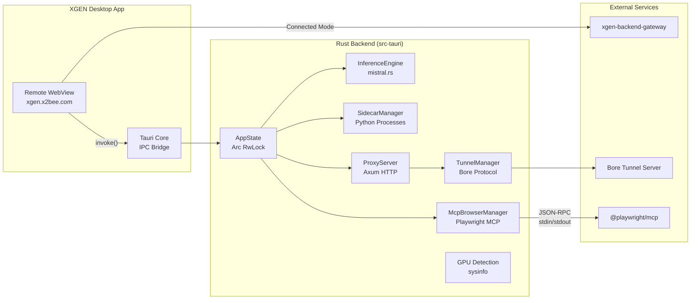

# Tauri 2.0으로 AI 데스크톱 앱 만들기

## 개요

XGEN 2.0은 AI 워크플로우 에디터, 모델 서빙, RAG, 브라우저 자동화를 하나의 플랫폼에 통합하는 AI 에이전트 플랫폼이다. 이미 xgen-frontend(Next.js)와 xgen-backend-gateway(Rust) 기반의 웹 버전이 운영 중이었지만, 데스크톱 네이티브 앱이 필요한 상황이 왔다.

이유는 세 가지였다. 첫째, 로컬 GPU에서 직접 LLM 추론을 돌려야 했다. 서버에 올려둔 모델만 쓰는 것이 아니라 사용자의 로컬 머신에서 GGUF 모델을 로딩해서 추론하는 "Standalone 모드"가 필요했다. 둘째, Playwright 기반 브라우저 자동화를 네이티브 프로세스로 구동해야 했다. 웹 브라우저 안에서 다른 브라우저를 자동화하는 것은 보안 샌드박스 한계가 있다. 셋째, Python sidecar(xgen-workflow, xgen-embedding)를 데스크톱 앱에서 직접 실행하고 관리해야 했다.

Electron을 쓸 수도 있었지만 Tauri 2.0을 선택했다. 가장 큰 이유는 Rust 백엔드와의 네이티브 통합이다. mistral.rs(Rust LLM 추론 엔진)를 Cargo 의존성으로 직접 가져와서 앱 프로세스 안에서 LLM을 돌릴 수 있었다. Electron이었다면 별도 프로세스를 띄우고 IPC로 통신해야 했을 것이다. 바이너리 크기도 압도적으로 작다. Electron은 Chromium을 통째로 번들하므로 최소 150MB인 반면, Tauri는 시스템 WebView를 사용하므로 Rust 바이너리만 번들하면 된다. 메모리 사용량도 Electron 대비 3분의 1 수준이다.

```
# 커밋: feat: initialize Next.js project with Tailwind CSS and global styles
# 날짜: 2025-06-11 01:05
```

프로젝트 초기 커밋은 2025년 6월 11일에 시작되었다. 처음에는 프론트엔드를 로컬에 내장하는 방식으로 출발했으나, 이후 Remote WebView 아키텍처로 전환되었다. 이 글에서는 최종 아키텍처를 중심으로 설명한다.

---

## 전체 아키텍처

XGEN 데스크톱 앱은 크게 세 계층으로 구성된다. Tauri Rust 백엔드, Remote WebView(xgen.x2bee.com), 그리고 빌드/패치 시스템이다.



핵심 설계 결정은 **Remote WebView** 방식이다. `tauri.conf.json`의 `frontendDist`와 `devUrl`을 모두 `https://xgen.x2bee.com`으로 지정했다. 프론트엔드를 앱 안에 번들하지 않고, 이미 배포된 웹 프론트엔드를 WebView로 로드한다. 프론트엔드 업데이트가 있을 때 앱 바이너리를 다시 배포할 필요가 없다는 장점이 있다.

```json
{
  "productName": "XGEN",
  "version": "0.1.0",
  "build": {
    "frontendDist": "https://xgen.x2bee.com",
    "devUrl": "https://xgen.x2bee.com",
    "beforeDevCommand": "",
    "beforeBuildCommand": ""
  }
}
```

---

## 프로젝트 구조

```
xgen-app/
├── src-tauri/                  # Tauri Rust 백엔드
│   ├── Cargo.toml              # 의존성 정의
│   ├── tauri.conf.json         # Remote WebView URL, 앱 설정
│   ├── capabilities/
│   │   └── default.json        # 권한 설정 (shell, fs, http 등)
│   └── src/
│       ├── lib.rs              # 앱 초기화, 시스템 트레이, IPC 등록
│       ├── main.rs             # 진입점
│       ├── error.rs            # 에러 타입 (thiserror)
│       ├── tunnel.rs           # Bore 터널 클라이언트
│       ├── proxy_server.rs     # Axum LLM 프록시 서버
│       ├── commands/           # IPC 커맨드 모듈
│       │   ├── gpu.rs          # 하드웨어 정보
│       │   ├── llm.rs          # 모델 로딩, 추론, 스트리밍
│       │   ├── mcp.rs          # MCP 서버 설정
│       │   ├── mcp_browser.rs  # Playwright 브라우저 제어
│       │   ├── mode.rs         # Standalone/Connected 모드
│       │   ├── model.rs        # 모델 파일 관리
│       │   ├── proxy.rs        # LLM 프록시 + 터널
│       │   ├── settings.rs     # 영구 설정
│       │   └── sidecar.rs      # Python sidecar 관리
│       ├── services/           # 핵심 비즈니스 로직
│       │   ├── inference.rs    # mistral.rs 래퍼
│       │   ├── model_manager.rs
│       │   ├── mcp_manager.rs
│       │   ├── mcp_browser_manager.rs
│       │   └── sidecar_manager.rs
│       ├── state/
│       │   └── app_state.rs    # 글로벌 상태
│       └── gpu/
│           └── detection.rs    # 시스템 정보 수집
├── patches/                    # xgen-frontend 커스텀 오버레이
│   ├── api/core/               # API 추상화 (Tauri/Web 분기)
│   ├── mcp/                    # Playwright MCP 클라이언트
│   ├── agent/                  # AI Agent 도구 생태계
│   └── scenario-recorder/      # 시나리오 녹화/재생
├── scripts/
│   ├── build.sh                # Rust 빌드 + URL 치환
│   └── sync-frontend.sh        # xgen-frontend 동기화 + 패치
└── Dockerfile                  # 웹 배포용 (Docker)
```

---

## Rust 의존성 스택

Cargo.toml이 이 앱의 기술적 야심을 잘 보여준다.

```toml
[dependencies]
# Tauri 2.8.5 — 시스템 트레이 지원
tauri = { version = "2.8.5", features = ["tray-icon"] }
tauri-plugin-shell = "2"
tauri-plugin-fs = "2"
tauri-plugin-dialog = "2"
tauri-plugin-http = "2.5.5"
tauri-plugin-log = "2"

# LLM 추론 — mistral.rs (Git 의존)
mistralrs = { git = "https://github.com/EricLBuehler/mistral.rs", package = "mistralrs" }
mistralrs-mcp = { git = "https://github.com/EricLBuehler/mistral.rs", package = "mistralrs-mcp" }

# HTTP 서버 — 로컬 LLM 프록시
axum = "0.8"
tower-http = { version = "0.6", features = ["cors"] }

# 시스템 정보
sysinfo = "0.32"

# SQLite (로컬 데이터)
rusqlite = { version = "0.32", features = ["bundled"] }

[features]
default = []
cuda = ["mistralrs/cuda"]
metal = ["mistralrs/metal"]
```

주목할 점이 몇 가지 있다.

**mistral.rs를 Git 의존성으로 가져온다.** crates.io에 게시된 버전이 아니라 GitHub 최신 코드를 직접 참조한다. mistral.rs는 빠르게 발전하는 라이브러리이므로, 최신 GGUF 모델 지원과 GPU 최적화를 바로 쓸 수 있어야 했다. `mistralrs-mcp`도 함께 가져와서 MCP(Model Context Protocol) 도구 통합을 지원한다.

**Feature flags로 GPU 지원을 분리했다.** `cuda`와 `metal` 피처를 각각 NVIDIA와 Apple Silicon 환경에서 활성화할 수 있다. 기본 빌드는 CPU만 사용하므로 어떤 환경에서든 빌드가 가능하다.

**Axum 0.8을 내장 HTTP 서버로 사용한다.** 데스크톱 앱 안에서 HTTP 서버를 돌리는 것이 의아할 수 있지만, 이는 로컬 LLM을 외부 서비스(xgen-backend-gateway)에서 접근 가능하게 만드는 프록시 역할을 한다. Bore 터널과 결합하면 NAT 뒤에 있는 사용자의 로컬 LLM을 팀원들과 공유할 수 있다.

---

## 앱 초기화와 시스템 트레이

`lib.rs`의 `run()` 함수가 앱의 진입점이다. 이 함수에서 Tauri 플러그인 등록, 상태 관리, 시스템 트레이, IPC 커맨드 등록, 자동 시작 로직을 모두 처리한다.

### 상태 초기화와 플러그인 등록

```rust
pub fn run() {
    // .env 파일 로딩 (실행 파일 디렉토리 → Resources → CWD 순)
    let exe_dir = std::env::current_exe()
        .ok()
        .and_then(|p| p.parent().map(|d| d.to_path_buf()));
    // ... .env 탐색 로직 ...

    let app_state = Arc::new(AppState::new());
    let proxy_manager = ProxyServerManager::new();

    tauri::Builder::default()
        .manage(app_state)
        .manage(proxy_manager)
        .plugin(tauri_plugin_shell::init())
        .plugin(tauri_plugin_fs::init())
        .plugin(tauri_plugin_dialog::init())
        .plugin(tauri_plugin_http::init())
        // ...
}
```

`.env` 파일 로딩 순서가 세심하다. macOS `.app` 번들에서 실행될 때는 `Contents/MacOS/` 디렉토리에서 먼저 찾고, 없으면 `Contents/Resources/`를 시도하며, 최종적으로 현재 작업 디렉토리에서 `dotenvy::dotenv()`으로 폴백한다. 개발 모드와 프로덕션 빌드 모두 대응하기 위한 설계다.

### 시스템 트레이

데스크톱 앱답게 시스템 트레이를 지원한다. "열기"와 "종료" 두 가지 메뉴를 제공하며, 트레이 아이콘 좌클릭으로 앱 창을 복원할 수 있다.

```rust
let show_i = MenuItem::with_id(app, "show", "열기", true, None::<&str>)?;
let quit_i = MenuItem::with_id(app, "quit", "종료", true, None::<&str>)?;
let menu = Menu::with_items(app, &[&show_i, &quit_i])?;

let _tray = TrayIconBuilder::new()
    .icon(app.default_window_icon().unwrap().clone())
    .tooltip("XGEN")
    .menu(&menu)
    .show_menu_on_left_click(false)
    .on_menu_event(|app, event| match event.id().as_ref() {
        "show" => {
            if let Some(w) = app.get_webview_window("main") {
                let _ = w.show();
                let _ = w.unminimize();
                let _ = w.set_focus();
            }
        }
        "quit" => {
            app.exit(0);
        }
        _ => {}
    })
    .on_tray_icon_event(|tray, event| {
        if let TrayIconEvent::Click {
            button: MouseButton::Left,
            button_state: MouseButtonState::Up,
            ..
        } = event
        {
            let app = tray.app_handle();
            if let Some(w) = app.get_webview_window("main") {
                let _ = w.show();
                let _ = w.unminimize();
                let _ = w.set_focus();
            }
        }
    })
    .build(app)?;
```

창 닫기(X 버튼) 클릭 시에도 앱을 종료하지 않고 트레이로 숨긴다. 이 동작은 `run()` 끝부분의 `.run()` 콜백에서 처리한다.

```rust
.run(|app, event| {
    if let tauri::RunEvent::WindowEvent {
        label,
        event: tauri::WindowEvent::CloseRequested { api, .. },
        ..
    } = &event
    {
        if label == "main" {
            api.prevent_close();
            if let Some(w) = app.get_webview_window("main") {
                let _ = w.hide();
            }
        }
    }
});
```

`api.prevent_close()`로 실제 종료를 막고, `w.hide()`로 창만 숨긴다. 로컬 LLM이 로드된 상태에서 실수로 앱을 종료하면 모델을 다시 로딩해야 하므로, 이 동작이 사용자 경험에 중요하다.

```
# 커밋: feat: 시스템 트레이 지원 — 닫기 시 트레이로 최소화
# 날짜: 2026-02-09 15:33
```

---

## 글로벌 상태 관리 (AppState)

`AppState`는 앱 전체에서 공유되는 글로벌 상태 객체다. Tauri의 `.manage()`로 등록하고, 각 IPC 커맨드에서 `State<'_, Arc<AppState>>`로 주입받아 사용한다.

```rust
pub struct AppState {
    pub system_info: Arc<RwLock<Option<SystemInfo>>>,
    pub model_manager: Arc<RwLock<ModelManager>>,
    pub inference_engine: Arc<RwLock<InferenceEngine>>,
    pub mcp_config: Arc<RwLock<McpConfigManager>>,
    pub sidecar_manager: Arc<RwLock<SidecarManager>>,
    pub mcp_browser: Arc<RwLock<McpBrowserManager>>,
    pub app_mode: Arc<RwLock<AppMode>>,
    pub gateway_url: Arc<RwLock<Option<String>>>,
}
```

모든 필드가 `Arc<RwLock<T>>`로 감싸져 있다. Tauri 커맨드는 비동기로 실행되므로, 여러 커맨드가 동시에 상태에 접근할 수 있어야 한다. `RwLock`은 읽기는 동시에, 쓰기는 배타적으로 허용하므로 대부분의 시나리오에서 성능이 좋다.

`AppMode` enum은 세 가지 운영 모드를 정의한다.

```rust
#[derive(Debug, Clone, Default, serde::Serialize, serde::Deserialize)]
#[serde(tag = "type")]
pub enum AppMode {
    #[default]
    Standalone,
    Service { service_url: String },
    Connected { server_url: String },
}
```

- **Standalone**: 완전 오프라인. 로컬에서 mistral.rs로 LLM 추론을 수행한다.
- **Service**: Python sidecar(xgen-workflow)를 내장 실행하여 워크플로우 엔진을 로컬에서 돌린다.
- **Connected**: 외부 xgen-backend-gateway에 연결한다. 웹 버전과 동일하게 서버 리소스를 사용한다.

앱 시작 시 `auto_init_app_mode()`에서 모드를 자동으로 결정한다. 환경변수(`XGEN_APP_MODE`) > 저장된 설정(`settings.json`) > 기본값(Connected) 순으로 우선순위가 적용된다.

---

## IPC 커맨드 아키텍처

Tauri의 핵심은 프론트엔드에서 `invoke('command_name', args)`를 호출하면 Rust 함수가 실행되는 IPC 구조다. 이 앱에서 등록하는 커맨드는 40개 이상이며, 8개 모듈로 분류된다.

```rust
.invoke_handler(tauri::generate_handler![
    // 하드웨어 정보
    commands::get_hardware_info,
    // 모델 관리
    commands::list_models,
    commands::download_model,
    commands::delete_model,
    commands::get_models_dir,
    // LLM 추론 (mistral.rs)
    commands::load_model,
    commands::get_model_status,
    commands::generate,
    commands::generate_sync,
    commands::stop_generation,
    commands::embed_text,
    commands::unload_model,
    // MCP 설정
    commands::list_mcp_servers,
    commands::add_mcp_server,
    commands::remove_mcp_server,
    // 모드 전환
    commands::set_app_mode,
    commands::get_app_mode,
    // Sidecar 관리
    commands::start_sidecar,
    commands::stop_sidecar,
    commands::get_sidecar_status,
    // 프록시 + 터널
    commands::start_proxy_server,
    commands::start_tunnel,
    commands::stop_tunnel,
    // Playwright 브라우저
    commands::mcp_browser_start,
    commands::mcp_browser_call_tool,
    commands::mcp_browser_stop,
    // ... 등
])
```

### LLM 추론 커맨드

가장 중요한 커맨드는 `generate`다. 스트리밍 방식으로 동작하며, Tauri 이벤트 시스템을 사용해 토큰 단위로 프론트엔드에 전달한다.

```rust
#[tauri::command]
pub async fn generate(
    app: AppHandle,
    state: State<'_, Arc<AppState>>,
    prompt: String,
    system_prompt: Option<String>,
    max_tokens: Option<usize>,
    // ...
) -> Result<()> {
    let engine = state.inference_engine.read().await;

    let request = GenerateRequest {
        prompt,
        system_prompt,
        max_tokens: max_tokens.unwrap_or(512),
        stream: true,
        ..Default::default()
    };

    let app_handle = app.clone();

    let response = engine
        .generate_stream_with_callback(request, move |token| {
            if let Err(e) = app_handle.emit("llm:token", &token) {
                log::error!("Failed to emit token: {}", e);
            }
        })
        .await?;

    app.emit("llm:done", serde_json::json!({
        "prompt_tokens": response.prompt_tokens,
        "completion_tokens": response.completion_tokens,
        "tokens_per_second": response.tokens_per_second,
    }))?;

    Ok(())
}
```

`generate_stream_with_callback`은 mistral.rs의 네이티브 스트리밍 API를 래핑한다. 각 토큰이 생성될 때마다 클로저가 호출되고, `app_handle.emit("llm:token", &token)`으로 프론트엔드에 실시간 전달한다. 프론트엔드에서는 `listen("llm:token", callback)`으로 구독하면 된다.

---

## mistral.rs 기반 추론 엔진

`InferenceEngine`이 LLM 추론의 핵심이다. GGUF 모델 로딩, GPU 자동 감지, 스트리밍 토큰 생성, MCP 도구 통합을 담당한다.

```rust
pub struct InferenceEngine {
    model: Option<MistralModel>,
    config: Option<ModelConfig>,
    status: ModelStatus,
    cancel_flag: Arc<RwLock<bool>>,
    mcp_client: Option<McpClient>,
    mcp_tool_count: usize,
}
```

### 모델 로딩

```rust
pub async fn load_model(&mut self, config: ModelConfig) -> Result<ModelStatus> {
    let model_path = std::path::Path::new(&config.model_path);
    if !model_path.exists() {
        return Err(AppError::Model(format!("Model file not found: {}", config.model_path)));
    }

    let filename = model_path.file_name()
        .and_then(|n| n.to_str())
        .ok_or_else(|| AppError::Model("Invalid model path".to_string()))?;

    // mistral.rs가 자동으로 최적의 디바이스 선택
    let device = best_device(false)
        .map_err(|e| AppError::Inference(e.to_string()))?;

    let mut builder = GgufModelBuilder::new(&config.model_id, vec![filename.to_string()])
        .with_logging();

    if let Some(ref tok_id) = config.tokenizer_id {
        builder = builder.with_tok_model_id(tok_id);
    }

    if config.paged_attention {
        builder = builder.with_paged_attn(|| {
            PagedAttentionMetaBuilder::default().build()
        }).map_err(|e| AppError::Model(e.to_string()))?;
    }

    let model = builder.build().await
        .map_err(|e| AppError::Model(format!("Failed to load model: {}", e)))?;

    self.model = Some(model);
    Ok(self.status.clone())
}
```

`best_device(false)` 호출 한 줄로 GPU 디바이스가 자동 감지된다. CUDA가 있으면 CUDA를, Metal이 있으면 Metal을, 아무것도 없으면 CPU를 선택한다. 개발자가 직접 디바이스 매핑을 관리할 필요가 없다는 것이 mistral.rs의 핵심 장점이다.

### MCP 도구 통합

MCP(Model Context Protocol) 도구를 모델에 직접 바인딩할 수도 있다. `load_model_with_mcp`는 MCP 서버들을 초기화하고, 각 서버가 제공하는 도구를 모델의 콜백으로 등록한다.

```rust
pub async fn load_model_with_mcp(
    &mut self,
    config: ModelConfig,
    mcp_config: McpClientConfig,
) -> Result<ModelStatus> {
    // MCP 클라이언트 초기화
    let mut mcp_client = McpClient::new(mcp_config);
    mcp_client.initialize().await
        .map_err(|e| AppError::Mcp(format!("Failed to initialize MCP client: {}", e)))?;

    // MCP 도구 콜백 가져오기
    let tool_callbacks = mcp_client.get_tool_callbacks_with_tools();
    log::info!("Registered {} MCP tools", tool_callbacks.len());

    let mut builder = GgufModelBuilder::new(&config.model_id, vec![filename.to_string()])
        .with_logging();

    // 각 MCP 도구를 모델 빌더에 등록
    for (name, callback_with_tool) in tool_callbacks {
        builder = builder.with_tool_callback_and_tool(
            name.clone(),
            callback_with_tool.callback.clone(),
            callback_with_tool.tool.clone(),
        );
    }

    let model = builder.build().await?;
    // ...
}
```

모델이 추론 중에 도구를 호출해야 한다고 판단하면, mistral.rs가 자동으로 해당 MCP 도구의 콜백을 실행하고 결과를 컨텍스트에 주입한다. Function calling이 로컬 LLM에서도 동작하는 것이다.

---

## Playwright MCP 브라우저 자동화

`McpBrowserManager`는 `@playwright/mcp` NPM 패키지를 서브프로세스로 실행하고, JSON-RPC over stdin/stdout으로 통신한다. 웹 브라우저 자동화를 네이티브 프로세스 수준에서 구현한 것이다.

```rust
pub async fn start(&mut self, options: Option<McpBrowserStartOptions>)
    -> Result<McpBrowserStatus, String>
{
    let mut args: Vec<String> = vec![
        "@playwright/mcp@latest".to_string(),
        "--no-sandbox".to_string(),
    ];

    if connect_mode {
        args.push("--cdp-endpoint".to_string());
        args.push(cdp_url.clone());
    }

    let npx_path = resolve_npx_path();
    let enriched_path = build_enriched_path(&npx_path);

    let mut child = Command::new(&npx_path)
        .args(&args)
        .env("PATH", &enriched_path)
        .stdin(std::process::Stdio::piped())
        .stdout(std::process::Stdio::piped())
        .stderr(std::process::Stdio::piped())
        .spawn()
        .map_err(|e| format!("Failed to spawn npx @playwright/mcp: {}", e))?;

    // JSON-RPC initialize 요청 전송
    let init_request = serde_json::json!({
        "jsonrpc": "2.0",
        "id": init_id,
        "method": "initialize",
        "params": {
            "protocolVersion": "2024-11-05",
            "capabilities": {},
            "clientInfo": { "name": "xgen-desktop", "version": "1.0.0" }
        }
    });

    stdin.write_all(format!("{}\n", serde_json::to_string(&init_request).unwrap()).as_bytes()).await?;
    // ...
}
```

MCP 도구 호출은 `call_tool` 메서드로 수행한다. 내부적으로 요청 ID를 발급하고, oneshot 채널을 통해 응답을 비동기로 대기한다.

```rust
async fn send_tool_call(
    stdin: &mut tokio::process::ChildStdin,
    request_id_counter: &AtomicU64,
    pending: &Arc<Mutex<HashMap<u64, PendingRequest>>>,
    tool_name: &str,
    args: serde_json::Value,
) -> Result<serde_json::Value, String> {
    let request_id = request_id_counter.fetch_add(1, Ordering::SeqCst) + 1;

    let (tx, rx) = oneshot::channel();
    {
        let mut pending_map = pending.lock().await;
        pending_map.insert(request_id, PendingRequest { sender: tx });
    }

    let rpc_request = serde_json::json!({
        "jsonrpc": "2.0",
        "id": request_id,
        "method": "tools/call",
        "params": { "name": tool_name, "arguments": args }
    });

    // 60초 타임아웃으로 응답 대기
    let result = tokio::time::timeout(
        std::time::Duration::from_secs(60), rx
    ).await?;
    // ...
}
```

`AtomicU64`로 요청 ID를 관리하고, `HashMap<u64, PendingRequest>`로 요청-응답을 매칭한다. stdout 리더 태스크가 백그라운드에서 JSON 라인을 파싱하며, 응답의 `id` 필드로 해당 요청의 oneshot sender를 찾아 결과를 전달한다.

---

## Sidecar 프로세스 관리

Python 서비스(xgen-workflow, xgen-embedding)를 데스크톱 앱의 하위 프로세스로 실행한다. `SidecarManager`가 프로세스 생명주기를 관리한다.

```rust
pub struct SidecarManager {
    processes: HashMap<String, CommandChild>,
    configs: HashMap<String, SidecarConfig>,
}
```

기본 설정으로 두 개의 sidecar가 등록되어 있다.

```rust
fn register_default_configs(&mut self) {
    self.configs.insert("xgen-workflow".to_string(), SidecarConfig {
        name: "xgen-workflow".to_string(),
        binary_name: "xgen-workflow".to_string(),
        port: 8001,
        auto_start: true,
        // ...
    });

    self.configs.insert("xgen-embedding".to_string(), SidecarConfig {
        name: "xgen-embedding".to_string(),
        binary_name: "xgen-embedding".to_string(),
        port: 8002,
        auto_start: true,
        // ...
    });
}
```

`auto_start: true`로 설정된 sidecar는 앱 시작 시 자동으로 실행된다. `lib.rs`의 `setup` 훅에서 비동기 태스크로 구동한다.

```rust
tauri::async_runtime::spawn(async move {
    let mut manager = state.sidecar_manager.write().await;
    let results = manager.start_auto_start_sidecars(&app_handle).await;

    let success_count = results.iter().filter(|r| r.is_ok()).count();
    log::info!("{}/{} sidecars started successfully", success_count, results.len());
});
```

Tauri의 `tauri_plugin_shell`을 사용해 sidecar 바이너리를 실행한다. stdout/stderr는 별도 태스크에서 읽어서 로깅한다. 종료 이벤트도 감지하여 상태를 갱신한다.

```
# 커밋: feat: Add sidecar auto-start for xgen-workflow and xgen-embedding
# 날짜: 2026-01-06 09:28
```

---

## 로컬 LLM 프록시와 Bore 터널

데스크톱 앱에서 로컬로 돌리는 LLM을 외부 서비스에서 접근하게 하려면 두 가지가 필요하다. HTTP 프록시 서버와 NAT 터널링이다.

### Axum 프록시 서버

```rust
pub async fn start(&mut self, port: u16) -> Result<u16, String> {
    let cors = CorsLayer::new()
        .allow_origin(Any)
        .allow_methods([Method::GET, Method::POST, Method::PUT, Method::DELETE, Method::OPTIONS])
        .allow_headers(Any);

    let app = Router::new()
        .route("/health", get(health_check))
        .route("/v1/{*path}", any(proxy_handler))
        .route("/{*path}", any(proxy_handler))
        .layer(cors)
        .with_state(state);

    let listener = tokio::net::TcpListener::bind(addr).await?;
    tokio::spawn(async move {
        axum::serve(listener, app)
            .with_graceful_shutdown(async { shutdown_rx.await.ok(); })
            .await.ok();
    });
    // ...
}
```

`proxy_handler`는 들어오는 요청을 로컬 LLM 엔드포인트(예: `http://127.0.0.1:8080`)로 투명하게 프록시한다. API 키 인증과 스트리밍 응답 전달을 모두 지원한다.

### Bore 터널 구현

`tunnel.rs`는 bore 프로토콜을 직접 구현한 터널 클라이언트다. bore는 ngrok의 오픈소스 대안으로, 자체 서버를 운영할 수 있다. 프로토콜은 null-terminated JSON 메시지를 사용한다.

```rust
// bore 클라이언트 메시지
#[derive(Debug, Serialize, Deserialize)]
pub enum ClientMessage {
    Authenticate(String),
    Hello(u16),       // 포트 요청 (0 = 자동 할당)
    Accept(Uuid),     // 연결 수락
}

// bore 서버 메시지
#[derive(Debug, Serialize, Deserialize)]
pub enum ServerMessage {
    Challenge(Uuid),
    Hello(u16),       // 할당된 포트
    Heartbeat,
    Connection(Uuid), // 새 연결 요청
    Error(String),
}
```

터널 연결 과정은 다음과 같다.

1. bore 서버(`14.6.220.91:7835`)에 TCP 연결
2. `Hello(0)` 메시지 전송 (포트 자동 할당 요청)
3. 서버가 `Hello(port)` 응답 (할당된 공개 포트)
4. 릴레이 루프 시작: `Connection(uuid)` 수신 시 새 TCP 연결로 `Accept(uuid)` 전송 후 양방향 프록시

```rust
async fn handle_connection(
    uuid: Uuid,
    local_port: u16,
    server_addr: &str,
    _assigned_port: u16,
) -> Result<(), String> {
    // 서버에 새 연결 (Accept용)
    let mut server_stream = TcpStream::connect(server_addr).await?;
    Self::send_message(&mut server_stream, &ClientMessage::Accept(uuid)).await?;

    // 로컬 서비스에 연결
    let local_stream = TcpStream::connect(format!("127.0.0.1:{}", local_port)).await?;

    // 양방향 프록시 (tokio::io::copy)
    let (mut server_read, mut server_write) = server_stream.into_split();
    let (mut local_read, mut local_write) = local_stream.into_split();

    tokio::select! {
        _ = tokio::io::copy(&mut server_read, &mut local_write) => {}
        _ = tokio::io::copy(&mut local_read, &mut server_write) => {}
    }
    Ok(())
}
```

이 구현 덕분에 NAT 뒤에 있는 개발자가 로컬에서 돌리는 LLM을 `http://14.6.220.91:{port}/v1/chat/completions` 형태로 팀원들과 공유할 수 있다.

---

## 패치 시스템: xgen-frontend 커스터마이징

웹 프론트엔드(xgen-frontend)와 데스크톱 앱은 동일한 UI를 공유하지만, 데스크톱 전용 기능이 있다. 이를 위해 **패치 오버레이** 시스템을 구현했다.

`sync-frontend.sh` 스크립트가 xgen-frontend를 클론한 뒤, `patches/` 디렉토리의 파일을 덮어쓰는 방식이다.

```bash
# xgen-frontend 클론
git clone --depth 1 --branch "$BRANCH" "$FRONTEND_REPO" "$FRONTEND_DIR"

# 1. mode-select 페이지 제거
rm -rf "$FRONTEND_DIR/src/app/mode-select"

# 2. API Core Foundation 파일 오버레이
for PATCH_FILE in \
    "api/core/platform.ts" \
    "api/core/ApiClient.interface.ts" \
    "api/core/TauriApiClient.ts" \
    "api/core/WebApiClient.ts" \
    "api/core/createApiClient.ts"; do
    cp "$PATCHES_DIR/$PATCH_FILE" "$FRONTEND_DIR/src/app/_common/$PATCH_FILE"
done

# 3. MCP 브라우저 클라이언트 오버레이
for PATCH_FILE in \
    "mcp/clients/TauriMCPClient.ts" \
    "mcp/clients/ApiRouteMCPClient.ts" \
    "mcp/BrowserManager.ts"; do
    cp "$PATCHES_DIR/$PATCH_FILE" "$FRONTEND_DIR/src/lib/$PATCH_FILE"
done

# 4. Agent 도구 생태계 패치
# 5. 시나리오 레코더 패치
# 6. Tauri 플러그인 의존성 설치
npm install --save @tauri-apps/plugin-shell @tauri-apps/plugin-fs @tauri-apps/plugin-dialog
```

패치 파일의 구성은 다음과 같다.

| 패치 카테고리 | 파일 수 | 역할 |
|---|---|---|
| api/core/ | 7개 | API 추상화 (Tauri IPC / Web HTTP 자동 분기) |
| mcp/ | 5개 | Playwright MCP 클라이언트 (Tauri용/API Route용) |
| agent/ | 12개 | AI Agent 도구 (Exec, FS, Browser) + 채팅 UI |
| scenario-recorder/ | 6개 | 시나리오 녹화/재생 (Tauri MCP 모드) |

### API 추상화 레이어

가장 핵심적인 패치는 API 클라이언트 추상화다. 동일한 프론트엔드 코드가 웹과 데스크톱 양쪽에서 동작해야 하므로, 실행 환경에 따라 통신 방식을 자동으로 분기한다.

```typescript
// platform.ts — 환경 감지
export function isTauri(): boolean {
  if (typeof window === 'undefined') return false;
  return typeof (window as any).__TAURI_INTERNALS__ !== 'undefined';
}

// createApiClient.ts — 팩토리 패턴
export async function createApiClient(): Promise<IApiClient> {
  if (isServer()) {
    const { WebApiClient } = await import('./WebApiClient');
    return new WebApiClient();
  }

  if (isTauri()) {
    const { invoke } = await import('@tauri-apps/api/core');
    const modeInfo = await invoke<{ mode: string }>('get_app_mode');

    if (modeInfo.mode === 'connected') {
      // Connected 모드: 웹과 동일한 HTTP 통신
      const { WebApiClient } = await import('./WebApiClient');
      return new WebApiClient();
    }

    // Standalone 모드: Tauri IPC 기반
    const { TauriApiClient } = await import('./TauriApiClient');
    const client = new TauriApiClient();
    await client.initialize();
    return client;
  }

  // 웹 환경
  const { WebApiClient } = await import('./WebApiClient');
  return new WebApiClient();
}
```

`window.__TAURI_INTERNALS__`의 존재 여부로 Tauri 환경을 감지하고, 추가로 `invoke('get_app_mode')`를 호출해서 Connected 모드인지 Standalone인지 판단한다. Connected 모드면 웹과 동일하게 HTTP를 쓰고, Standalone이면 Tauri IPC로 Rust 백엔드와 직접 통신한다. 프론트엔드 컴포넌트는 이 분기를 전혀 알 필요 없이 `createApiClient()`만 호출하면 된다.

---

## 빌드 시스템

`build.sh`가 빌드 전체 과정을 관리한다. Remote WebView 아키텍처이므로 프론트엔드 빌드가 불필요하다는 것이 핵심이다. Rust 바이너리만 빌드하면 된다.

```bash
# 기본 URL (환경변수 오버라이드 가능)
TAURI_DEV_URL="${TAURI_DEV_URL:-https://xgen.x2bee.com}"

# tauri.conf.json URL 치환
if [ "$TAURI_DEV_URL" != "$DEFAULT_URL" ]; then
    cp "$TAURI_CONF" "$TAURI_CONF_BACKUP"
    sed -i.tmp "s|$DEFAULT_URL|$TAURI_DEV_URL|g" "$TAURI_CONF"
fi

# 빌드 후 원본 복원 (trap)
trap restore_config EXIT

# cargo 또는 cargo.exe 감지 (WSL 환경 대응)
if command -v cargo &>/dev/null; then
    CARGO_CMD="cargo"
elif command -v cargo.exe &>/dev/null; then
    CARGO_CMD="cargo.exe"
else
    print_error "cargo를 찾을 수 없습니다."
    exit 1
fi

$CARGO_CMD tauri build
```

`TAURI_DEV_URL` 환경변수로 Remote WebView URL을 오버라이드할 수 있다. 개발 환경에서는 `localhost:3000`으로, 스테이징에서는 별도 URL로 지정하는 식이다. `trap restore_config EXIT`로 빌드가 끝나면(성공/실패 모두) 원본 `tauri.conf.json`을 복원한다. Git에 변경된 설정 파일이 커밋되는 것을 방지하기 위한 안전장치다.

```
# 커밋: fix: Support cargo command detection in build script
# 날짜: 2026-02-12 11:43

# 커밋: feat: use TAURI_DEV_URL env var for Remote WebView URL
# 날짜: 2026-02-07 23:25
```

빌드 결과물은 플랫폼별로 다르다.

- **Linux**: deb, rpm 패키지
- **macOS**: .app 번들, DMG 이미지
- **Windows**: .exe 설치 파일

macOS 빌드 시에는 번들 내부에 프론트엔드 에셋이 포함되지 않았는지 자동 검증한다. Remote WebView 모드이므로 리소스 파일 수가 2개 이하여야 정상이다.

---

## 에러 핸들링

통합 에러 타입을 `thiserror`로 정의했다. Tauri IPC를 통해 프론트엔드에 에러를 전달하려면 `Serialize`가 필요하므로, 수동으로 `serde::Serialize`를 구현했다.

```rust
#[derive(Error, Debug)]
pub enum AppError {
    #[error("GPU error: {0}")]
    Gpu(String),
    #[error("Model error: {0}")]
    Model(String),
    #[error("Inference error: {0}")]
    Inference(String),
    #[error("MCP error: {0}")]
    Mcp(String),
    #[error("Workflow error: {0}")]
    Workflow(String),
    #[error("IO error: {0}")]
    Io(#[from] std::io::Error),
    #[error("Network error: {0}")]
    Network(#[from] reqwest::Error),
    #[error("Tauri error: {0}")]
    Tauri(String),
    // ...
}

impl serde::Serialize for AppError {
    fn serialize<S>(&self, serializer: S) -> std::result::Result<S::Ok, S::Error>
    where S: serde::Serializer,
    {
        serializer.serialize_str(&self.to_string())
    }
}
```

`thiserror`의 `#[from]` 매크로로 `std::io::Error`, `serde_json::Error`, `reqwest::Error`를 자동 변환한다. Tauri 커맨드 함수의 반환 타입을 `Result<T, AppError>`로 통일하면, 에러 발생 시 자동으로 에러 메시지가 프론트엔드에 문자열로 전달된다.

---

## 권한 관리 (Capabilities)

Tauri 2.0의 보안 모델은 capability 기반이다. `capabilities/default.json`에서 WebView가 사용할 수 있는 플러그인과 권한을 선언한다.

```json
{
  "identifier": "default",
  "windows": ["main"],
  "remote": {
    "urls": ["https://localhost", "http://localhost:*"]
  },
  "permissions": [
    "core:default",
    "shell:allow-open",
    "shell:allow-execute",
    "shell:allow-spawn",
    "shell:allow-kill",
    "fs:allow-read-text-file",
    "fs:allow-write-text-file",
    "fs:allow-mkdir",
    "dialog:allow-open",
    "dialog:allow-save",
    {
      "identifier": "http:allow-fetch",
      "allow": [
        { "url": "http://**" },
        { "url": "https://**" }
      ]
    }
  ]
}
```

`shell:allow-execute`와 `shell:allow-spawn`은 sidecar 프로세스 실행에 필요하다. `fs:allow-*`는 모델 파일 관리와 설정 저장에 사용된다. `http:allow-fetch`의 와일드카드 패턴(`http://**`, `https://**`)은 프론트엔드에서 임의의 API 서버에 요청을 보내야 하므로 열어둔 것이다.

`remote.urls`에는 Remote WebView로 로드되는 URL 패턴을 지정한다. `build.sh`에서 `$TAURI_REMOTE_DOMAIN`을 환경변수로 치환하여 빌드 시점에 실제 도메인이 입력된다.

---

## 트러블슈팅

### macOS에서 npx 경로 문제

macOS의 `.app` 번들로 실행되는 GUI 앱은 사용자의 셸 PATH를 상속받지 않는다. 즉 터미널에서는 잘 되는 `npx` 명령이 앱 안에서는 "command not found"로 실패한다.

이를 해결하기 위해 `resolve_npx_path()` 함수를 구현했다. Homebrew(Apple Silicon/Intel), nvm, fnm, Volta, asdf, n 등 주요 Node.js 매니저의 설치 경로를 모두 탐색한다.

```rust
fn resolve_npx_path() -> String {
    // 1. 현재 PATH에서 which npx 시도
    if let Ok(output) = std::process::Command::new("which").arg("npx").output() {
        if output.status.success() {
            let path = String::from_utf8_lossy(&output.stdout).trim().to_string();
            if !path.is_empty() { return path; }
        }
    }

    // 2. 주요 설치 경로 탐색
    let home = std::env::var("HOME").unwrap_or_default();
    let candidates: Vec<PathBuf> = vec![
        PathBuf::from("/opt/homebrew/bin/npx"),          // Homebrew (Apple Silicon)
        PathBuf::from("/usr/local/bin/npx"),              // Homebrew (Intel)
        PathBuf::from(format!("{}/.nvm/versions/node", home)),
        PathBuf::from(format!("{}/.local/share/fnm/aliases/default/bin/npx", home)),
        PathBuf::from(format!("{}/.volta/bin/npx", home)),
        PathBuf::from("/usr/local/n/bin/npx"),
        PathBuf::from(format!("{}/.asdf/shims/npx", home)),
    ];

    for candidate in &candidates {
        // nvm은 버전 디렉토리를 스캔해서 최신 버전 사용
        if candidate.to_string_lossy().ends_with("versions/node") {
            if let Ok(entries) = std::fs::read_dir(candidate) {
                let mut versions: Vec<PathBuf> = entries
                    .filter_map(|e| e.ok())
                    .map(|e| e.path())
                    .filter(|p| p.is_dir())
                    .collect();
                versions.sort();
                if let Some(latest) = versions.last() {
                    let npx = latest.join("bin/npx");
                    if npx.exists() { return npx.to_string_lossy().to_string(); }
                }
            }
        }
        if candidate.exists() { return candidate.to_string_lossy().to_string(); }
    }

    "npx".to_string() // 폴백
}
```

추가로 `build_enriched_path()` 함수로 서브프로세스의 PATH를 보강한다. npx가 실행될 때 `node`도 같은 PATH에 있어야 하기 때문이다.

```
# 커밋: feat: Agent 데이터 자동화 + macOS 빌드 안정성 개선
# 날짜: 2026-02-11 08:30
```

### WSL 환경에서 cargo 감지

WSL(Windows Subsystem for Linux)에서는 Windows의 `cargo.exe`를 사용해야 하는 경우가 있다. 빌드 스크립트에서 `cargo` → `cargo.exe` 순으로 탐색하도록 처리했다.

```bash
if command -v cargo &>/dev/null; then
    CARGO_CMD="cargo"
elif command -v cargo.exe &>/dev/null; then
    CARGO_CMD="cargo.exe"
else
    print_error "cargo를 찾을 수 없습니다."
    exit 1
fi
```

```
# 커밋: fix: Support cargo command detection in build script
# 날짜: 2026-02-12 11:43
```

### Remote WebView 모드 전환

초기에는 프론트엔드를 앱에 내장하는 방식이었다. 하지만 프론트엔드 업데이트마다 앱을 재빌드해야 하는 문제가 있었다. 특히 xgen-frontend는 활발히 개발 중이어서 하루에도 여러 번 배포가 일어났다.

Remote WebView로 전환하면서 `tauri.conf.json`에서 `frontendDist`를 로컬 경로 대신 URL로 지정했다. `beforeBuildCommand`와 `beforeDevCommand`도 비워서 프론트엔드 빌드 과정을 완전히 제거했다.

```
# 커밋: feat: refactor to Remote WebView architecture
# 날짜: 2026-02-07 21:52

# 커밋: feat: auto-init app mode, remove mode-select, fix Connected mode auth
# 날짜: 2026-02-07 01:47
```

다만 Remote WebView 모드에서는 권한 설정이 까다롭다. `capabilities/default.json`의 `remote.urls`에 허용할 도메인을 정확히 지정해야 하고, 빌드 시점에 환경변수로 치환해야 한다. 이 과정에서 도메인이 누락되면 WebView에서 Tauri IPC 호출이 차단된다.

---

## Docker 배포 (웹 버전)

데스크톱 앱 외에도 동일한 프론트엔드를 Docker로 배포할 수 있다. `Dockerfile`에서 xgen-frontend를 클론 → 빌드 → Next.js standalone 모드로 서빙한다.

```dockerfile
FROM node:20-alpine AS builder
WORKDIR /app

ARG FRONTEND_REPO=http://gitlab.x2bee.com/.../xgen-frontend.git
RUN git clone --depth 1 --branch ${FRONTEND_BRANCH} ${FRONTEND_REPO} frontend

WORKDIR /app/frontend
RUN npm ci --legacy-peer-deps --prefer-offline
RUN npm run build

FROM node:20-alpine AS runner
COPY --from=builder /app/frontend/.next/standalone ./
COPY --from=builder /app/frontend/.next/static ./.next/static

USER nextjs
EXPOSE 3000
CMD ["node", "server.js"]
```

멀티스테이지 빌드로 빌드 의존성(git, python3, make, g++)과 런타임을 분리했다. 최종 이미지에는 Node.js와 빌드된 Next.js standalone 서버만 포함된다.

---

## 커밋 타임라인

이 프로젝트의 주요 커밋을 시간순으로 정리하면 아키텍처의 진화를 볼 수 있다.

```
# 커밋: feat: initialize Next.js project with Tailwind CSS and global styles
# 날짜: 2025-06-11 01:05
→ 프로젝트 시작, 프론트엔드 내장 방식

# 커밋: feat: replace NodeEditor with Canvas component and remove related styles
# 날짜: 2025-06-11 04:21
→ 워크플로우 에디터 UI 교체

# 커밋: Add API abstraction layer and integrate LLM inference engine
# 날짜: 2026-01-04 09:46
→ mistral.rs 통합, API 추상화 레이어 도입

# 커밋: Update tauri configuration to specify build targets for Linux packages (deb and rpm)
# 날짜: 2026-01-04 17:15
→ Linux 패키지 빌드 설정

# 커밋: feat: Add sidecar auto-start for xgen-workflow and xgen-embedding
# 날짜: 2026-01-06 09:28
→ Python sidecar 자동 시작

# 커밋: Implement bore protocol for tunnel communication
# 날짜: 2026-01-10 19:59
→ Bore 터널 프로토콜 자체 구현

# 커밋: feat: refactor to Remote WebView architecture
# 날짜: 2026-02-07 21:52
→ 내장 프론트엔드 → Remote WebView 전환

# 커밋: feat: Agent Tool Ecosystem + patches 전체 정리
# 날짜: 2026-02-08 03:54
→ Agent 도구 생태계 (Exec, FS, Browser) 패치 시스템

# 커밋: feat: 시스템 트레이 지원 — 닫기 시 트레이로 최소화
# 날짜: 2026-02-09 15:33
→ 시스템 트레이 구현

# 커밋: fix: Support cargo command detection in build script
# 날짜: 2026-02-12 11:43
→ WSL 빌드 지원
```

6개월 만에 단순한 Next.js 앱에서 로컬 LLM 추론 + MCP 브라우저 자동화 + 터널링 + 패치 시스템을 갖춘 풀스택 데스크톱 앱으로 발전했다.

---

## 회고

Tauri 2.0으로 AI 데스크톱 앱을 만들면서 얻은 교훈 몇 가지를 정리한다.

**Rust 생태계의 장점이 크다.** mistral.rs를 Cargo 의존성 한 줄로 추가하면 GGUF 모델 로딩, GPU 자동 감지, 스트리밍 추론이 모두 해결된다. Electron에서 별도 프로세스를 관리하고 IPC로 통신하는 것과 비교하면 개발 경험이 완전히 다르다. Axum으로 앱 안에 HTTP 서버를 내장하는 것도 Rust라서 자연스러운 선택이었다.

**Remote WebView는 양날의 검이다.** 프론트엔드 업데이트를 즉시 반영할 수 있다는 장점이 있지만, 오프라인에서는 앱이 동작하지 않는다. 향후 프론트엔드를 로컬 번들과 Remote 모드를 모두 지원하는 하이브리드 방식으로 개선할 계획이다.

**패치 오버레이 시스템은 유지보수가 어렵다.** xgen-frontend가 변경될 때마다 패치 파일도 업데이트해야 한다. 이상적으로는 프론트엔드 자체에 Tauri 분기 로직을 내장하는 것이 낫다. 하지만 웹 전용 프론트엔드에 데스크톱 전용 코드를 넣는 것은 팀 정책상 어려웠기 때문에, 패치 방식이 현실적인 타협이었다.

**macOS 빌드가 가장 까다롭다.** GUI 앱의 PATH 격리, 코드 서명, 번들 구조 등 macOS 특유의 이슈가 많았다. `resolve_npx_path()`처럼 여러 Node.js 매니저를 탐색하는 코드가 필요한 이유다.

현재 Phase 2로 `lancedb` 벡터 DB 통합과 `dotext` 문서 처리를 계획하고 있다. Cargo.toml에 주석으로 남겨둔 의존성이 활성화되면, 데스크톱 앱에서 완전한 로컬 RAG 파이프라인이 가능해진다.
