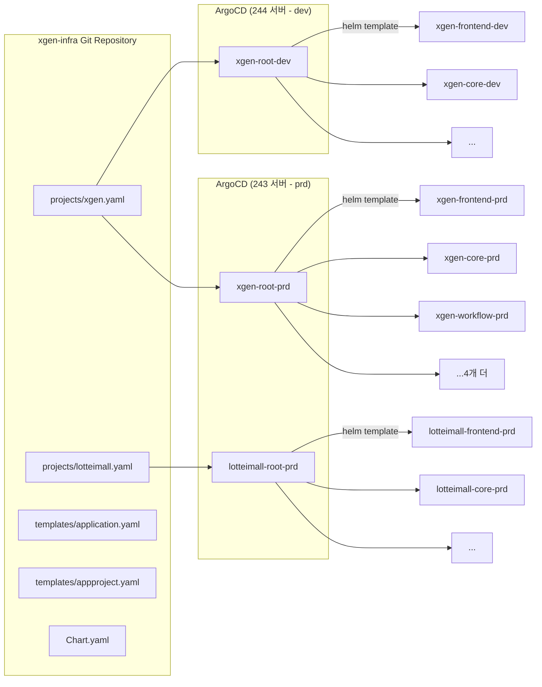
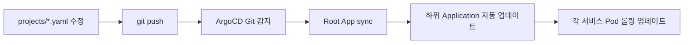

# ArgoCD 멀티 고객사 배포 아키텍처 — ApplicationSet 시행착오와 단일 진입점 설계

## 배경

XGEN 2.0은 AI Agent 플랫폼이다. 처음에는 자사 개발 서버(244) 하나에만 배포했지만, 고객사가 늘어나면서 상황이 달라졌다. 롯데이마트 운영 서버(243), 제주 환경, 추후 다른 고객사까지 — 동일한 7개 마이크로서비스(frontend, gateway, core, workflow, documents, mcp-station, model)를 고객사별로 다른 도메인, 다른 리소스, 다른 서비스 구성으로 배포해야 했다.

기존 구조는 이랬다:

- ArgoCD Application yaml을 서비스마다 수동으로 만들어 관리
- `values.yaml`에 도메인, 리소스, 환경변수가 하드코딩
- 고객사 추가 시 yaml 수십 개를 복사-수정해야 하는 상황

이 구조를 3일간 대폭 리팩토링했다. ApplicationSet을 도입했다가 한계를 확인하고, 최종적으로 **projects/*.yaml 단일 진입점 구조**로 안착한 과정을 기록한다.

## 최종 아키텍처



핵심은 **고객사별 yaml 파일 하나(projects/*.yaml)가 해당 고객사의 모든 배포 설정을 담는다**는 것이다. 서비스 목록, 도메인, 리소스, 환경변수, 인프라 주소 — 전부 이 파일 하나에 있다.

## 시행착오 타임라인

이 구조에 도달하기까지 3일간의 커밋 히스토리를 시간순으로 정리한다.

### Phase 1: project.yaml 도입 + 하드코딩 제거

```
# 커밋: refactor: 프로젝트 설정 통합 (project.yaml 도입, 하드코딩 제거)
# 날짜: 2026-02-16 02:22
```

첫 번째로 한 작업은 Jenkins 파이프라인과 Helm 차트에 흩어져 있던 하드코딩을 한 곳으로 모은 것이다.

변경 전에는 `build.groovy`에 GitLab URL, Docker Registry 주소, 네임스페이스 등이 직접 박혀 있었다:

```groovy
// 변경 전: build.groovy
def GITLAB_URL = "https://gitlab.x2bee.com"
def NEXUS_REGISTRY = "localhost:30500"
def NAMESPACE = "xgen"
```

이걸 `k3s/jenkins/config/project.yaml`로 분리했다:

```yaml
# k3s/jenkins/config/project.yaml
project:
  name: "xgen"
  platform: "xgen-platform"
  group: "xgen2.0"
  infraRepo: "xgen-infra"

gitlab:
  url: "https://gitlab.x2bee.com"
  credentialId: "gitlab-credentials"

registry:
  nexus:
    host: "localhost:30500"
    credentialId: "nexus-credentials"

kubernetes:
  namespace: "xgen"
  secrets:
    name: "xgen-secrets"
    imagePull: "registry-credentials"

sites:
  - main
  - lotteimall
```

동시에 서비스 정의도 별도 파일로 분리했다:

```yaml
# k3s/jenkins/config/services.yaml
services:
  xgen-frontend:
    repo: "xgen-frontend"
    dockerfile: "dockerfiles/xgen-frontend/Dockerfile.local"
    port: 3000
    healthCheck: "/"

  xgen-backend-gateway:
    repo: "xgen-backend-gateway"
    dockerfile: "dockerfiles/xgen-backend-gateway/Dockerfile"
    port: 8080
    healthCheck: "/health"

  xgen-core:
    repo: "xgen-core"
    dockerfile: "dockerfiles/xgen-python/Dockerfile.local"
    port: 8000
    healthCheck: "/health"
  # ... 이하 동일 패턴
```

이 시점에서 다른 고객사에 배포할 때 바꿔야 할 값이 `project.yaml` 한 곳에 모이기 시작했다.

### Phase 2: ApplicationSet 도입 시도 — 그리고 제거

```
# 커밋: feat: ApplicationSet으로 고객사별 root app 자동 생성 도입
# 날짜: 2026-02-17 02:00
```

고객사가 늘어날 때마다 Root Application yaml을 수동으로 만드는 게 번거로워서, ArgoCD ApplicationSet을 도입했다. 아이디어는 이랬다:

```yaml
# applicationset-customer-roots.yaml (삭제된 파일)
apiVersion: argoproj.io/v1alpha1
kind: ApplicationSet
metadata:
  name: xgen-customer-roots
  namespace: argocd
spec:
  generators:
    - list:
        elements:
          - customer: xgen
            env: prd
            valuesFile: projects/xgen.yaml
          - customer: xgen
            env: dev
            valuesFile: projects/xgen.yaml
          - customer: lotteimall
            env: prd
            valuesFile: projects/lotteimall.yaml
  template:
    metadata:
      name: "{{customer}}-root-{{env}}"
    spec:
      source:
        helm:
          valueFiles:
            - "{{valuesFile}}"
          parameters:
            - name: env
              value: "{{env}}"
```

`projects/` 디렉토리에 고객사별 yaml을 추가하고, ApplicationSet의 `elements`에 한 줄만 넣으면 자동으로 Root App이 생성되는 구조였다.

**그런데 문제가 있었다.**

1. **destination.server 분리가 안 된다** — prd는 243 서버의 ArgoCD에서, dev는 244 서버의 ArgoCD에서 각각 관리한다. 그런데 ApplicationSet은 한 ArgoCD 인스턴스에서 여러 서버를 관리하는 걸 전제로 설계되어 있다. 서버별로 다른 ArgoCD를 쓰는 우리 구조와 맞지 않았다.

2. **sync 정책 차이** — prd는 수동 sync, dev는 자동 sync를 적용하고 싶었는데, ApplicationSet의 template에서 이걸 분기하기가 깔끔하지 않았다.

3. **디버깅이 어렵다** — ApplicationSet이 생성한 Application에 문제가 생기면, ApplicationSet 자체를 수정해야 한다. 개별 Application yaml이면 해당 파일만 보면 되는데, 추상화 레이어가 하나 더 생기면서 오히려 복잡해졌다.

결국 같은 날 ApplicationSet을 삭제하고 개별 Root Application yaml로 돌아갔다:

```
# 커밋: refactor: ApplicationSet 제거, 서버별 root Application yaml로 전환
# 날짜: 2026-02-17 02:41
```

### Phase 3: App of Apps + Helm 아키텍처

```
# 커밋: refactor: Jenkins/ArgoCD 디렉토리 구조 개편
# 날짜: 2026-02-16 18:31
```

ApplicationSet 대신 선택한 건 **Helm 기반 App of Apps 패턴**이다. ArgoCD 차트를 하나 만들고, `projects/*.yaml`을 values 파일로 넘기면 해당 고객사의 모든 Application이 자동 생성되는 구조다.

```yaml
# k3s/argocd/Chart.yaml
apiVersion: v2
name: argocd-root-app
description: ArgoCD App of Apps - 프로젝트별 Application 자동 생성
version: 1.0.0
```

핵심 템플릿은 `templates/application.yaml`이다. 선택된 환경(env)의 서비스 목록을 순회하며 Application을 생성한다:

```yaml
# k3s/argocd/templates/application.yaml (핵심 부분)
{{- $env := .Values.env }}
{{- $envConfig := index .Values.environments $env }}
{{- $dest := index .Values.destinations $env }}

{{- range $envConfig.services }}
apiVersion: argoproj.io/v1alpha1
kind: Application
metadata:
  name: {{ .name }}-{{ $env }}
  namespace: argocd
  labels:
    app.kubernetes.io/part-of: {{ $.Values.project.name }}
    environment: {{ $env }}
spec:
  project: {{ $.Values.project.name }}
  source:
    repoURL: {{ $.Values.source.repoURL }}
    targetRevision: {{ $.Values.source.targetRevision }}
    path: k3s/helm-chart
    helm:
      valueFiles:
        - values.yaml
        - values/{{ .name }}.yaml
      parameters:
        - name: global.namespace
          value: {{ $.Values.project.namespace }}
        - name: global.env
          value: {{ $env }}
        {{- if .hasDomain }}
        - name: service.domain
          value: {{ $dest.domain | quote }}
        {{- end }}
        {{- if .replicas }}
        - name: service.replicas
          value: {{ .replicas | quote }}
        {{- end }}
        # ... 리소스, autoscaling, 환경변수 등
  destination:
    server: {{ $dest.server }}
    namespace: {{ $.Values.project.namespace }}
{{- end }}
```

AppProject도 함께 자동 생성된다:

```yaml
# k3s/argocd/templates/appproject.yaml
apiVersion: argoproj.io/v1alpha1
kind: AppProject
metadata:
  name: {{ .Values.project.name }}
  namespace: argocd
spec:
  description: {{ .Values.project.description }}
  sourceRepos:
    - {{ include "root.sourceRepoWildcard" . }}
  destinations:
    {{- range $envName, $dest := .Values.destinations }}
    - namespace: {{ $.Values.project.namespace }}
      server: {{ $dest.server }}
    - namespace: {{ $.Values.project.namespace }}-*
      server: {{ $dest.server }}
    {{- end }}
  clusterResourceWhitelist:
    - group: ''
      kind: Namespace
    - group: rbac.authorization.k8s.io
      kind: ClusterRole
    - group: rbac.authorization.k8s.io
      kind: ClusterRoleBinding
  namespaceResourceWhitelist:
    - group: '*'
      kind: '*'
```

### Phase 4: projects/*.yaml 단일 진입점 완성

```
# 커밋: refactor: projects/*.yaml 단일 진입점 구조로 Helm 아키텍처 개선
# 날짜: 2026-02-17 22:43
```

이 커밋이 최종 구조를 완성한 핵심 리팩토링이다. 프로젝트별 yaml 파일 하나가 모든 배포 설정의 **단일 소스 오브 트루스(Single Source of Truth)**가 되도록 설계했다.

```yaml
# k3s/argocd/projects/xgen.yaml
project:
  name: xgen
  description: "xgen2.0 Platform"
  namespace: xgen

source:
  repoURL: https://gitlab.x2bee.com/xgen2.0/xgen-infra.git
  targetRevision: main

# 환경별 배포 대상 클러스터 + 도메인
destinations:
  prd:
    server: https://kubernetes.default.svc
    domain: "jeju-xgen.x2bee.com"
  dev:
    server: https://kubernetes.default.svc
    domain: "xgen.x2bee.com"

# 이미지 레지스트리 사이트 경로
site: main

# 프로젝트 공통 환경변수 (모든 서비스 ConfigMap에 일괄 주입)
vars:
  APP_SITE: "xgen-x2bee-com"

# 인프라 주소 오버라이드 (비워두면 기본값 사용)
infra: {}

# 환경별 서비스 목록 + 리소스/replicas
environments:
  prd:
    services:
      - name: xgen-frontend
        hasDomain: true
        replicas: 2
        autoscaling: { minReplicas: 2, maxReplicas: 4 }
        resources:
          requests: { memory: "512Mi", cpu: "200m" }
          limits:   { memory: "2Gi",   cpu: "1000m" }

      - name: xgen-core
        replicas: 2
        autoscaling: { minReplicas: 2, maxReplicas: 4 }
        resources:
          requests: { memory: "512Mi", cpu: "200m" }
          limits:   { memory: "4Gi",  cpu: "1000m" }

      - name: xgen-workflow
        replicas: 2
        autoscaling: { minReplicas: 2, maxReplicas: 4 }
        resources:
          requests: { memory: "1Gi",  cpu: "200m" }
          limits:   { memory: "8Gi",  cpu: "1000m" }

      - name: xgen-model
        replicas: 1
        autoscaling: { enabled: false }
        resources:
          requests: { memory: "8Gi",  cpu: "2000m" }
          limits:   { memory: "24Gi", cpu: "8000m" }
      # ... 나머지 서비스

  dev:
    services:
      - name: xgen-frontend
        hasDomain: true
        replicas: 1
        autoscaling: { minReplicas: 1 }
      # ... dev는 리소스 기본값 사용

# 추가 앱 (observability 등)
extraApps:
  - name: observability
    path: k3s/observability
    namespace: observability
    server: https://kubernetes.default.svc
```

같은 구조로 롯데이마트 전용 설정도 만들었다:

```yaml
# k3s/argocd/projects/lotteimall.yaml
project:
  name: lotteimall
  description: "롯데이마트 AI Agent Platform"
  namespace: lotteimall

destinations:
  prd:
    server: https://kubernetes.default.svc
    domain: "agent.lotteimall.com"
  dev:
    server: https://kubernetes.default.svc
    domain: "agent-dev.lotteimall.com"

site: lotteimall

vars:
  APP_SITE: "agent-lotteimall-com"

# 외부 인프라 사용 시 오버라이드 가능
infra: {}
# infra:
#   postgres:
#     host: "external-db.lotteimall.com"

environments:
  prd:
    services:
      - name: xgen-frontend
        hasDomain: true
        replicas: 2
        resources:
          requests: { memory: "256Mi", cpu: "100m" }
          limits:   { memory: "1Gi",   cpu: "500m" }
      # ... 롯데이마트 스펙에 맞는 리소스 설정
```

이 구조의 장점은 명확하다:

- **새 고객사 추가**: `projects/newcustomer.yaml` 하나 만들고, Root App yaml 하나 등록하면 끝
- **서비스 추가/제거**: yaml의 `environments.prd.services` 배열에서 추가/삭제
- **리소스 조정**: yaml 수정 후 `git push` → ArgoCD sync
- **환경별 차이**: prd와 dev를 같은 파일에서 관리하되 서비스 목록과 리소스가 다름

### Phase 5: Root Application — 서버별 독립 관리

ApplicationSet을 버리고 선택한 건 **서버별 Root Application yaml을 수동으로 한 번만 등록하는 방식**이다:

```yaml
# k3s/argocd/root-apps/xgen-root-prd.yaml
# 243 서버에서 최초 1회: kubectl apply -f k3s/argocd/root-apps/xgen-root-prd.yaml
apiVersion: argoproj.io/v1alpha1
kind: Application
metadata:
  name: xgen-root-prd
  namespace: argocd
spec:
  project: default
  source:
    repoURL: https://gitlab.x2bee.com/xgen2.0/xgen-infra.git
    targetRevision: main
    path: k3s/argocd
    helm:
      valueFiles:
        - projects/xgen.yaml
      parameters:
        - name: env
          value: prd
  destination:
    server: https://kubernetes.default.svc
    namespace: argocd
  syncPolicy:
    syncOptions:
      - CreateNamespace=true
```

```yaml
# k3s/argocd/root-apps/xgen-root-dev.yaml
# 244 서버에서 최초 1회 등록
apiVersion: argoproj.io/v1alpha1
kind: Application
metadata:
  name: xgen-root-dev
  namespace: argocd
spec:
  project: default
  source:
    repoURL: https://gitlab.x2bee.com/xgen2.0/xgen-infra.git
    targetRevision: main
    path: k3s/argocd
    helm:
      valueFiles:
        - projects/xgen.yaml
      parameters:
        - name: env
          value: dev
  destination:
    server: https://kubernetes.default.svc
    namespace: argocd
```

Root App은 고객사 x 환경당 1개씩 만들어진다. 최초 1회 `kubectl apply`로 등록하면, 이후부터는 `projects/*.yaml` 수정 + git push만으로 모든 하위 Application이 자동 업데이트된다.

## 최종 디렉토리 구조

```
k3s/argocd/
  Chart.yaml                    # Helm 차트 정의
  templates/
    application.yaml            # 서비스별 Application 자동 생성
    appproject.yaml             # AppProject 자동 생성
    _helpers.tpl                # 헬퍼 함수
  projects/
    xgen.yaml                   # x2bee(xgen) 전체 설정
    lotteimall.yaml             # 롯데이마트 전체 설정
  root-apps/
    xgen-root-prd.yaml          # 243 서버 등록용
    xgen-root-dev.yaml          # 244 서버 등록용
    lotteimall-root-prd.yaml    # 롯데이마트 prd 등록용

k3s/jenkins/
  config/
    project.yaml                # Jenkins 빌드 공통 설정
    services.yaml               # 서비스 정의 (repo, dockerfile, port)
    environments.yaml           # 환경별 서버/ArgoCD 설정
```

## 배포 흐름

### 새 고객사 추가

1. `projects/newcustomer.yaml` 생성 (xgen.yaml 복사 후 도메인, 리소스, 사이트 수정)
2. `root-apps/newcustomer-root-prd.yaml` 생성 (env, valuesFile만 변경)
3. 고객사 서버에서 `kubectl apply -f root-apps/newcustomer-root-prd.yaml`
4. ArgoCD가 Git 감지 → 7개 서비스 Application 자동 생성

### 일상적인 배포 변경



### 환경별 도메인/리소스 설정

Helm 템플릿이 `env` 파라미터에 따라 `destinations`와 `environments`에서 값을 가져온다:

```
helm template root-app ./k3s/argocd \
  -f ./k3s/argocd/projects/xgen.yaml \
  --set env=prd
```

이러면 `destinations.prd.domain`과 `environments.prd.services`가 사용된다. `env=dev`로 바꾸면 dev 설정이 적용된다. 같은 차트, 같은 프로젝트 yaml, 다른 `env` 값.

## ApplicationSet vs 개별 Root App: 선택 기준

| 기준 | ApplicationSet | 개별 Root App |
|------|---------------|--------------|
| ArgoCD 인스턴스 | 하나에서 다수 클러스터 관리 | 서버별 독립 ArgoCD |
| sync 정책 분기 | 템플릿에서 조건부 처리 필요 | 파일별 독립 설정 |
| 디버깅 | 추상화 레이어 추가 | 직관적 |
| 고객사 추가 시 | elements에 항목 추가 | yaml 파일 1개 추가 |
| 우리 선택 | 부적합 | 채택 |

우리 환경에서 ApplicationSet이 안 맞았던 핵심 이유는 **prd와 dev가 물리적으로 다른 서버의 ArgoCD**에서 관리된다는 점이다. ApplicationSet은 단일 ArgoCD가 여러 클러스터를 제어하는 구조에 최적화되어 있다. 서버별로 ArgoCD가 분리된 환경에서는 오히려 개별 Application이 더 깔끔하다.

## Helm 하드코딩 제거 전략

프로젝트 설정을 3계층으로 분리한 것이 하드코딩 제거의 핵심이었다:

```
1. project.yaml  — 프로젝트 전역 (이름, GitLab, 레지스트리)
2. services.yaml — 서비스 정의 (repo, dockerfile, port)
3. environments.yaml — 환경별 차이 (서버 IP, ArgoCD 주소)
```

Jenkins 파이프라인에서는 이 파일들을 YAML 파서로 읽어 사용한다:

```groovy
// build.groovy
def projectConfig = readYaml file: 'k3s/jenkins/config/project.yaml'
def servicesConfig = readYaml file: 'k3s/jenkins/config/services.yaml'
def envConfig = readYaml file: 'k3s/jenkins/config/environments.yaml'

def gitlabUrl = projectConfig.gitlab.url
def namespace = projectConfig.project.name
def services = servicesConfig.services
```

ArgoCD 쪽은 `projects/*.yaml` 하나가 전부를 담당하므로, Jenkins와 ArgoCD의 설정이 분리되면서도 일관성을 유지한다.

## HPA Autoscaling 파라미터 방어 로직

```
# 커밋: fix: autoscaling 파라미터 값 있을 때만 주입 (maxReplicas 0 방지)
# 날짜: 2026-02-18
```

운영 중 발견한 엣지 케이스가 있다. `projects/*.yaml`에서 autoscaling을 비활성화한 서비스(예: xgen-model)의 경우, maxReplicas 값이 없거나 0으로 들어가면서 HPA가 이상 동작했다.

Helm 템플릿에서 이를 방어하는 로직을 추가했다:

```yaml
# application.yaml 템플릿 (autoscaling 부분)
{{- if and .autoscaling (ne (default true .autoscaling.enabled) false) }}
  {{- if .autoscaling.minReplicas }}
  - name: service.autoscaling.minReplicas
    value: {{ .autoscaling.minReplicas | quote }}
  {{- end }}
  {{- if .autoscaling.maxReplicas }}
  - name: service.autoscaling.maxReplicas
    value: {{ .autoscaling.maxReplicas | quote }}
  {{- end }}
{{- end }}
```

`autoscaling.enabled: false`인 서비스는 autoscaling 파라미터 자체를 주입하지 않는다. xgen-model처럼 GPU 서비스는 항상 replicas 1로 고정해야 하는데, HPA가 개입하면 문제가 된다.

## 운영 리소스 튜닝

```
# 커밋: fix: prd 리소스/replicas 실사용량 기반으로 조정
# 날짜: 2026-02-18
```

롯데 운영 서버(16코어 16GB x 2대)에 실제 배포하면서 리소스를 조정했다. `projects/*.yaml` 구조 덕분에 한 파일에서 모든 서비스의 리소스를 한눈에 보고 조정할 수 있었다:

| 서비스 | requests (mem/cpu) | limits (mem/cpu) | replicas | autoscaling |
|--------|-------------------|-----------------|----------|-------------|
| frontend | 512Mi / 200m | 2Gi / 1000m | 2 | 2-4 |
| gateway | 512Mi / 200m | 2Gi / 1000m | 2 | 2-4 |
| core | 512Mi / 200m | 4Gi / 1000m | 2 | 2-4 |
| workflow | 1Gi / 200m | 8Gi / 1000m | 2 | 2-4 |
| documents | 1Gi / 500m | 16Gi / 4000m | 2 | 2-4 |
| mcp-station | 512Mi / 200m | 2Gi / 1000m | 2 | 2-4 |
| model | 8Gi / 2000m | 24Gi / 8000m | 1 | 비활성화 |

xgen-model만 autoscaling을 끈 이유는 GPU 바인딩 때문이다. 나머지 서비스는 minReplicas 2, maxReplicas 4로 설정하되 실사용량을 모니터링하면서 점진적으로 조정하고 있다.

## 회고

3일간의 리팩토링에서 배운 것:

**ApplicationSet은 만능이 아니다.** 공식 문서만 보면 여러 환경/클러스터를 하나의 선언으로 관리할 수 있어 보이지만, ArgoCD 인스턴스가 분리된 환경에서는 오히려 복잡성만 더했다. 도입하기 전에 자기 환경의 ArgoCD 토폴로지를 먼저 확인해야 한다.

**단일 진입점의 가치.** `projects/*.yaml` 한 파일을 열면 해당 고객사의 배포 현황이 전부 보인다. 도메인, 서비스 목록, 리소스, 환경변수, 인프라 주소. 이전에는 이 정보가 values.yaml, ApplicationSet, 개별 Application yaml, ConfigMap 등에 흩어져 있었다.

**Helm 템플릿의 유연성.** App of Apps를 Helm으로 구현하면, 조건부 로직(`if`), 반복(`range`), 기본값(`default`) 등을 자유롭게 쓸 수 있다. kustomize나 ApplicationSet의 제약에서 벗어나는 동시에, values 파일만 바꾸면 되는 깔끔한 인터페이스를 제공한다.
