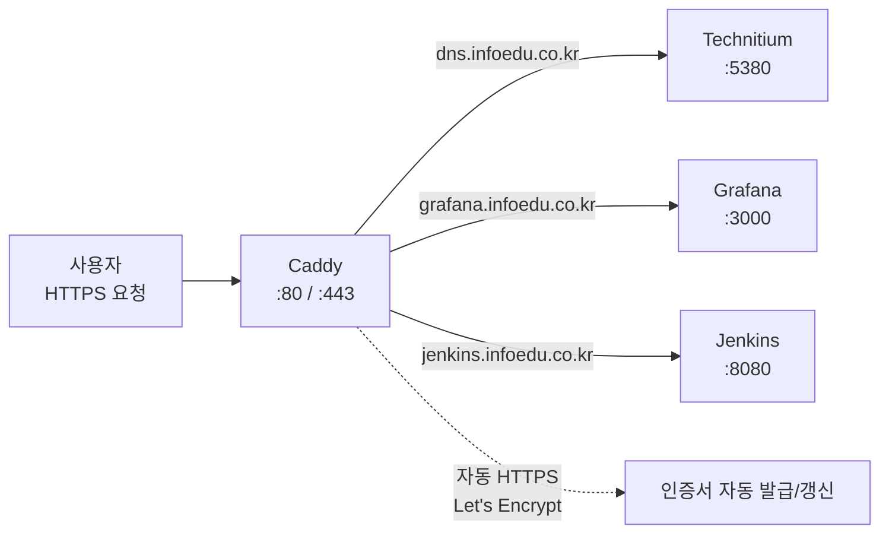
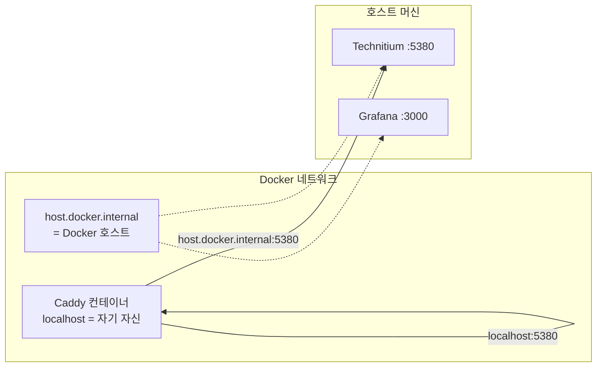
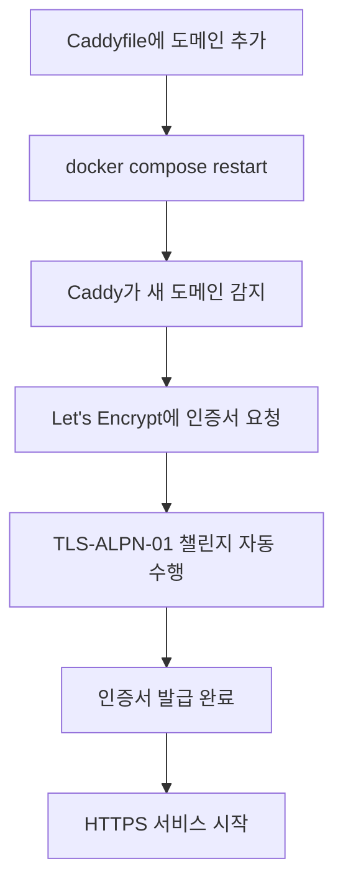
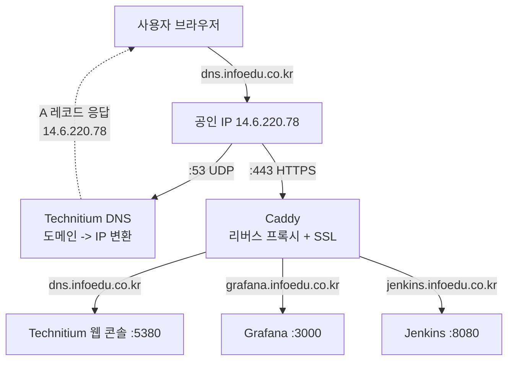

## 개요

홈서버(14.6.220.78)에서 Technitium DNS(5380), Grafana(3000), Jenkins(8080) 등 여러 서비스를 운영하고 있다. 각 서비스에 접속하려면 `http://14.6.220.78:5380` 같은 형태로 IP와 포트 번호를 직접 입력해야 했다.

문제는 세 가지다.

- 포트 번호를 외워야 한다
- HTTPS가 적용되지 않아 브라우저에서 "안전하지 않음" 경고가 뜬다
- 서비스마다 SSL 인증서를 따로 설정해야 한다

이 문제를 해결하기 위해 리버스 프록시를 도입했다. 여러 선택지 중 **Caddy**를 골랐다. 이유는 단순하다. 3줄 설정으로 도메인 기반 라우팅 + 자동 HTTPS가 된다.

바로 직전에 [dongtan.infoedu.co.kr에 nginx + certbot으로 HTTPS를 적용](./Docker-nginx-HTTPS-적용기-snap-Docker-교체부터-Lets-Encrypt-자동-갱신까지.md)했었다. snap Docker 교체, certbot 설치, 인증서 발급, nginx 설정, 크론 자동 갱신까지 꽤 긴 과정이었다. Caddy는 이 전체 과정을 자동으로 처리한다.

---

## 리버스 프록시란

### 도입 전 — 포트 번호로 접속

```
사용자 -> http://14.6.220.78:5380   -> Technitium DNS
사용자 -> http://14.6.220.78:3000   -> Grafana
사용자 -> http://14.6.220.78:8080   -> Jenkins
```

사용자가 IP와 포트를 직접 알아야 하고, 모든 통신이 평문 HTTP다.

### 도입 후 — 도메인으로 접속

```
사용자 -> https://dns.infoedu.co.kr      -+
사용자 -> https://grafana.infoedu.co.kr   -+-> Caddy (:443) -> 각 서비스 포트로 분배
사용자 -> https://jenkins.infoedu.co.kr   -+
```

Caddy가 HTTPS를 종단(SSL Termination)하고, **Host 헤더의 도메인 이름**을 보고 어느 서비스로 보낼지 판단한다.



리버스 프록시의 핵심 역할:

- **도메인 기반 라우팅**: 하나의 공인 IP에서 도메인별로 다른 서비스에 연결
- **SSL Termination**: 외부와의 HTTPS 암호화를 프록시가 담당, 내부는 HTTP 평문
- **단일 진입점**: 모든 트래픽이 80/443으로 들어와 프록시가 분배

---

## 왜 Caddy인가 — Nginx와의 비교

리버스 프록시로 가장 널리 쓰이는 것은 Nginx다. 홈서버 환경에서 Caddy와 Nginx를 비교하면 차이가 명확하다.

### 같은 작업, 다른 설정량

**Caddy — 3줄**:

```
dns.infoedu.co.kr {
    reverse_proxy host.docker.internal:5380
}
```

이것으로 끝이다. HTTPS, 인증서 발급, HTTP->HTTPS 리다이렉트, 인증서 갱신이 전부 자동이다.

**Nginx — 20줄 이상 + certbot 별도 설치**:

```nginx
server {
    listen 80;
    server_name dns.infoedu.co.kr;
    return 301 https://$host$request_uri;
}
server {
    listen 443 ssl;
    server_name dns.infoedu.co.kr;
    ssl_certificate /etc/letsencrypt/live/dns.infoedu.co.kr/fullchain.pem;
    ssl_certificate_key /etc/letsencrypt/live/dns.infoedu.co.kr/privkey.pem;
    location / {
        proxy_pass http://localhost:5380;
        proxy_set_header Host $host;
        proxy_set_header X-Real-IP $remote_addr;
        proxy_set_header X-Forwarded-For $proxy_add_x_forwarded_for;
        proxy_set_header X-Forwarded-Proto $scheme;
    }
}
```

이것만으로는 안 된다. certbot 설치, 인증서 발급 명령어 실행, 크론탭에 자동 갱신 등록까지 별도로 해야 한다. [실제로 dongtan.infoedu.co.kr에 이 과정을 거쳤다](./Docker-nginx-HTTPS-적용기-snap-Docker-교체부터-Lets-Encrypt-자동-갱신까지.md).

### 비교 정리

| 항목 | Caddy | Nginx |
|------|-------|-------|
| SSL 인증서 발급 | 자동 (Let's Encrypt 내장) | 수동 (certbot 별도 설치) |
| 인증서 갱신 | 자동 (만료 30일 전) | 크론탭 설정 필요 |
| HTTP->HTTPS 리다이렉트 | 자동 | 수동 설정 (return 301) |
| 설정 복잡도 | 서비스당 3줄 | 서비스당 20줄+ |
| 성능 | 충분 | 약간 더 높음 |
| 생태계/레퍼런스 | 상대적 작음 | 방대함 |
| 세밀한 제어 | 제한적 | 매우 유연 |

**결론**: 소규모 홈서버 인프라에서는 Caddy가 압도적으로 관리가 편하다. 대규모 트래픽이나 세밀한 로드밸런싱이 필요한 프로덕션 환경에서는 Nginx가 적합하다. 나중에 전환이 필요해지면 역할이 같으므로 Caddy를 내리고 Nginx를 올리면 된다.

---

## Docker Compose로 배포

### 디렉토리 구조

```
/home/son/caddy/
├── docker-compose.yml    # Caddy 컨테이너 정의
└── Caddyfile             # 프록시 규칙 (도메인 -> 포트 매핑)
```

### docker-compose.yml

```yaml
services:
  caddy:
    image: caddy:latest
    container_name: caddy
    restart: unless-stopped
    ports:
      - "80:80"       # HTTP (HTTPS 리다이렉트용)
      - "443:443"     # HTTPS
    volumes:
      - ./Caddyfile:/etc/caddy/Caddyfile:ro
      - caddy-data:/data
      - caddy-config:/config
    extra_hosts:
      - "host.docker.internal:host-gateway"

volumes:
  caddy-data:
    name: caddy-data
  caddy-config:
    name: caddy-config
```

각 설정의 의미:

- **`./Caddyfile:/etc/caddy/Caddyfile:ro`**: 호스트의 Caddyfile을 컨테이너에 읽기 전용으로 마운트한다. 설정 파일을 호스트에서 직접 편집할 수 있다.
- **`caddy-data`**: SSL 인증서, ACME 계정 정보가 저장된다. 이 볼륨을 삭제하면 인증서가 날아가고 재발급이 필요하다.
- **`caddy-config`**: Caddy가 내부적으로 사용하는 자동 저장 설정이다.
- **`extra_hosts: host.docker.internal:host-gateway`**: 핵심 설정이다. Docker 컨테이너 안에서 `host.docker.internal`이라는 호스트명으로 Docker 호스트(서버)에 접근할 수 있게 한다. Caddy 컨테이너가 호스트에서 직접 돌아가는 서비스(Technitium, Grafana 등)에 프록시할 때 필요하다.

### Caddyfile

```
dns.infoedu.co.kr {
    reverse_proxy host.docker.internal:5380
}
```

이것이 전부다. `dns.infoedu.co.kr`로 들어오는 HTTPS 요청을 호스트의 5380 포트(Technitium 웹 콘솔)로 전달한다.

Caddy는 이 설정만으로 다음을 자동으로 수행한다:

1. Let's Encrypt에 ACME 계정 등록
2. `dns.infoedu.co.kr`에 대한 TLS 인증서 발급 요청
3. TLS-ALPN-01 챌린지로 도메인 소유권 검증
4. 인증서 발급 및 적용
5. HTTP(80) -> HTTPS(443) 자동 리다이렉트 활성화
6. 만료 전 자동 갱신

---

## 인증서 자동 발급 과정 — TLS-ALPN-01 챌린지

Caddy는 기본적으로 **TLS-ALPN-01** 챌린지를 사용한다. [이전 글](./Docker-nginx-HTTPS-적용기-snap-Docker-교체부터-Lets-Encrypt-자동-갱신까지.md)에서 certbot이 사용한 HTTP-01 챌린지와 다른 방식이다.

### 챌린지 방식 비교

| 방식 | 사용 포트 | 동작 | 서비스 중단 |
|------|-----------|------|------------|
| HTTP-01 | 80 | HTTP로 토큰 파일 확인 | 포트 80 점유 필요 |
| TLS-ALPN-01 | 443 | TLS 핸드셰이크에 특수 인증서 삽입 | 불필요 |
| DNS-01 | 없음 | DNS TXT 레코드 확인 | 불필요 |

TLS-ALPN-01의 장점은 포트 443만 있으면 되고, 서비스를 중단할 필요가 없다는 것이다. Caddy가 TLS 핸드셰이크 과정에서 Let's Encrypt에 자신이 도메인을 제어하고 있음을 증명한다.

### 실제 로그에서 확인

Caddy를 처음 시작하면 로그에서 전체 과정을 볼 수 있다.

```json
// 1. TLS 자동 관리 시작
{"msg":"enabling automatic TLS certificate management",
 "domains":["dns.infoedu.co.kr"]}

// 2. 인증서 획득 프로세스 시작
{"msg":"obtaining certificate","identifier":"dns.infoedu.co.kr"}

// 3. ACME 계정 생성 (최초 1회)
{"msg":"new ACME account registered","status":"valid"}

// 4. TLS-ALPN-01 챌린지 수행
{"msg":"trying to solve challenge",
 "identifier":"dns.infoedu.co.kr",
 "challenge_type":"tls-alpn-01"}

// 5. Let's Encrypt의 여러 지역에서 검증 요청
{"msg":"served key authentication certificate",
 "challenge":"tls-alpn-01","remote":"23.178.112.107:54597"}
{"msg":"served key authentication certificate",
 "challenge":"tls-alpn-01","remote":"13.214.177.20:32702"}
{"msg":"served key authentication certificate",
 "challenge":"tls-alpn-01","remote":"13.58.84.56:29152"}

// 6. 검증 성공 및 인증서 발급
{"msg":"authorization finalized",
 "identifier":"dns.infoedu.co.kr","authz_status":"valid"}
{"msg":"certificate obtained successfully",
 "identifier":"dns.infoedu.co.kr"}
```

전체 과정이 Caddy 시작 후 약 10초 만에 완료되었다. certbot처럼 별도 명령을 실행할 필요 없이, 컨테이너를 올리는 것만으로 HTTPS가 적용된다.

---

## host.docker.internal의 역할

Caddyfile에서 `host.docker.internal:5380`이라고 썼다. 이것은 Docker가 제공하는 특수 호스트명으로, 컨테이너 안에서 호스트 머신의 네트워크에 접근할 때 사용한다.

### 왜 localhost가 안 되는가



Caddy 컨테이너 안에서 `localhost`는 컨테이너 자신을 가리킨다. Technitium은 호스트에서 돌아가고 있으므로 `localhost:5380`으로는 접근할 수 없다.

`docker-compose.yml`의 `extra_hosts` 설정이 이 문제를 해결한다:

```yaml
extra_hosts:
  - "host.docker.internal:host-gateway"
```

`host-gateway`는 Docker가 자동으로 호스트 머신의 게이트웨이 IP(보통 172.17.0.1)로 해석한다. 이렇게 하면 컨테이너 안에서 `host.docker.internal`로 호스트의 모든 포트에 접근할 수 있다.

> 대상 서비스도 Docker 컨테이너라면 같은 Docker 네트워크에 넣고 컨테이너 이름으로 접근하는 것이 더 깔끔하다. `host.docker.internal`은 호스트에서 직접 돌아가는 서비스에 접근할 때 유용하다.

---

## 서비스 추가 방법

새 서비스를 도메인으로 노출하는 과정은 세 단계다.

### 1단계: DNS A 레코드 등록

[Technitium 웹 콘솔](./Technitium-DNS-홈서버-자체-DNS-구축과-운영기.md)에서 새 서브도메인의 A 레코드를 추가한다.

```
grafana.infoedu.co.kr -> 14.6.220.78
```

또는 Technitium HTTP API로:

```bash
TOKEN=$(curl -s "http://localhost:5380/api/user/login?user=admin&pass=비밀번호" \
  | python3 -c "import sys,json; print(json.load(sys.stdin)['token'])")

curl -s "http://localhost:5380/api/zones/records/add?\
token=$TOKEN&domain=grafana.infoedu.co.kr&zone=infoedu.co.kr\
&type=A&ipAddress=14.6.220.78&ttl=300"
```

### 2단계: Caddyfile에 블록 추가

```
# 기존
dns.infoedu.co.kr {
    reverse_proxy host.docker.internal:5380
}

# 추가
grafana.infoedu.co.kr {
    reverse_proxy host.docker.internal:3000
}

jenkins.infoedu.co.kr {
    reverse_proxy host.docker.internal:8080
}
```

서비스 하나당 3줄이다. 도메인과 포트만 바꾸면 된다.

### 3단계: Caddy 재시작

```bash
cd /home/son/caddy && docker compose restart
```

재시작하면 Caddy가 새 도메인을 감지하고, 각 도메인에 대해 자동으로 SSL 인증서를 발급한다. 서비스를 3개 추가하면 인증서도 3개 자동 발급된다.



---

## 전체 아키텍처 — Technitium + Caddy

Caddy를 도입하면서 홈서버의 네트워크 아키텍처가 정리되었다. DNS와 리버스 프록시가 하나의 흐름으로 연결된다.



1. 사용자가 `dns.infoedu.co.kr`을 브라우저에 입력한다
2. DNS 리졸버가 Technitium(53번 포트)에 질의하여 IP(14.6.220.78)를 얻는다
3. 브라우저가 해당 IP의 443번 포트(Caddy)에 HTTPS로 접속한다
4. Caddy가 Host 헤더를 보고 적절한 서비스(Technitium 웹 콘솔 5380)로 프록시한다

Technitium은 DNS 질의(53번)를 처리하고, Caddy는 웹 트래픽(80/443번)을 처리한다. 각자 역할이 명확하다.

---

## 포트 충돌 주의

Caddy는 포트 80과 443을 독점한다. 이 포트를 사용하는 다른 서비스가 있으면 충돌이 발생한다.

현재 홈서버에서 포트 443을 사용할 수 있는 서비스:

- **Caddy**: 리버스 프록시 + HTTPS (현재 사용)
- **Technitium**: DoH(DNS-over-HTTPS)도 443을 사용하려고 함
- **K3s Istio Gateway**: Kubernetes 서비스도 443을 쓸 수 있음

Technitium의 docker-compose.yml에서 443 포트를 열어두었는데, Caddy가 443을 먼저 점유하면 Technitium DoH는 사용할 수 없다. 이 경우 두 가지 방법이 있다:

1. **Caddy를 통해 DoH를 프록시**: Caddy가 특정 경로(`/dns-query`)를 Technitium DoH 포트로 전달
2. **Technitium DoH 포트 변경**: 443 대신 다른 포트(예: 8443)를 사용

현재는 Caddy가 443을 점유하고 있고, Technitium DoH는 비활성 상태다.

---

## SSL 인증서 관리

### Caddy가 자동으로 처리하는 것

- Let's Encrypt 계정 등록 (최초 1회)
- 도메인별 인증서 발급
- 만료 30일 전 자동 갱신
- HTTP -> HTTPS 리다이렉트
- OCSP 스테이플링 (인증서 유효성 확인 최적화)

certbot + 크론탭으로 직접 관리하던 것을 전부 Caddy가 대신한다.

### 인증서 발급이 실패하는 경우

**DNS A 레코드 미등록 또는 전파 미완료**

Caddy가 인증서를 요청하면 Let's Encrypt가 해당 도메인의 IP로 접속한다. DNS에 A 레코드가 없거나 전파가 안 됐으면 실패한다.

```bash
# 확인
dig @8.8.8.8 새도메인.infoedu.co.kr A +short
```

**포트 80 또는 443이 막혀 있음**

방화벽이나 라우터에서 80/443 포트가 열려있어야 한다. TLS-ALPN-01은 443을 사용하고, 폴백으로 HTTP-01(80)을 시도한다.

**네임서버 충돌**

`.kr` 레지스트리에 NS가 여러 개 등록되어 있으면 일부 DNS에서 응답 불일치가 발생한다. [이 문제의 상세한 분석](./DNS-도메인-SSL-인증서-네임서버-충돌로-Lets-Encrypt-발급-실패한-이야기.md)은 별도 글에서 다뤘다.

**Let's Encrypt 레이트 리밋**

`caddy-data` 볼륨을 삭제하면 인증서가 날아간다. 재발급은 자동이지만, 같은 도메인에 대해 짧은 시간에 너무 많이 발급을 시도하면 Let's Encrypt의 [레이트 리밋](https://letsencrypt.org/docs/rate-limits/)에 걸릴 수 있다. `caddy-data` 볼륨은 함부로 삭제하지 않는다.

---

## Nginx에서 Caddy로 전환한 이유 — 실제 경험

[dongtan.infoedu.co.kr에 nginx + certbot으로 HTTPS를 적용](./Docker-nginx-HTTPS-적용기-snap-Docker-교체부터-Lets-Encrypt-자동-갱신까지.md)하면서 거친 과정은 다음과 같다:

1. snap Docker에서 apt Docker로 교체
2. certbot 설치
3. 웹 컨테이너 중단 (포트 80 해제)
4. certbot certonly --standalone 실행
5. 인증서 파일을 프로젝트 디렉토리로 복사
6. nginx 설정 파일에 SSL 블록 작성
7. Dockerfile 헬스체크 수정 (HTTP -> HTTPS)
8. docker-compose에 443 포트와 볼륨 추가
9. 크론탭에 갱신 스크립트 등록

Caddy로 같은 작업을 하면:

1. Caddyfile에 3줄 작성
2. docker compose up -d

이 차이가 Caddy를 선택한 이유다. dongtan.infoedu.co.kr은 이미 nginx로 구성했으니 그대로 두고, 홈서버(14.6.220.78)의 서비스들은 Caddy로 통합했다.

---

## 운영 명령어

```bash
# 시작
cd /home/son/caddy && docker compose up -d

# 중지
cd /home/son/caddy && docker compose down

# 재시작 (Caddyfile 변경 후)
cd /home/son/caddy && docker compose restart

# 로그 확인
docker logs -f caddy

# 인증서 발급 로그 확인
docker logs caddy 2>&1 | grep "certificate obtained"

# 설정 검증
docker exec caddy caddy validate --config /etc/caddy/Caddyfile
```

---

## 정리

Caddy 리버스 프록시를 도입하면서 홈서버 인프라의 마지막 퍼즐이 맞춰졌다.

| 구성 요소 | 역할 | 글 |
|-----------|------|-----|
| Technitium DNS | 도메인 -> IP 변환 | [자체 DNS 구축과 운영기](./Technitium-DNS-홈서버-자체-DNS-구축과-운영기.md) |
| Caddy | 리버스 프록시 + 자동 HTTPS | 이 글 |
| SSH 보안 | 서버 접근 제어 | [SSH 보안 강화](./홈서버-SSH-보안-강화-키-인증-fail2ban-포트-우회.md) |

DNS(Technitium)가 도메인을 IP로 변환하고, 리버스 프록시(Caddy)가 도메인별로 서비스를 분배하며 HTTPS를 자동으로 처리한다. 서비스를 추가할 때마다 Technitium에 A 레코드 한 줄, Caddyfile에 블록 3줄을 추가하면 끝이다.

Nginx 대비 Caddy의 트레이드오프는 명확하다. 세밀한 제어와 성능 최적화가 필요하면 Nginx, 간편한 설정과 자동 HTTPS가 우선이면 Caddy다. 홈서버 규모에서는 Caddy의 간편함이 훨씬 가치 있었다.
