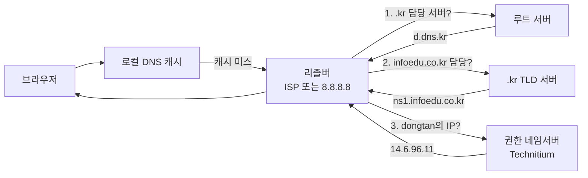
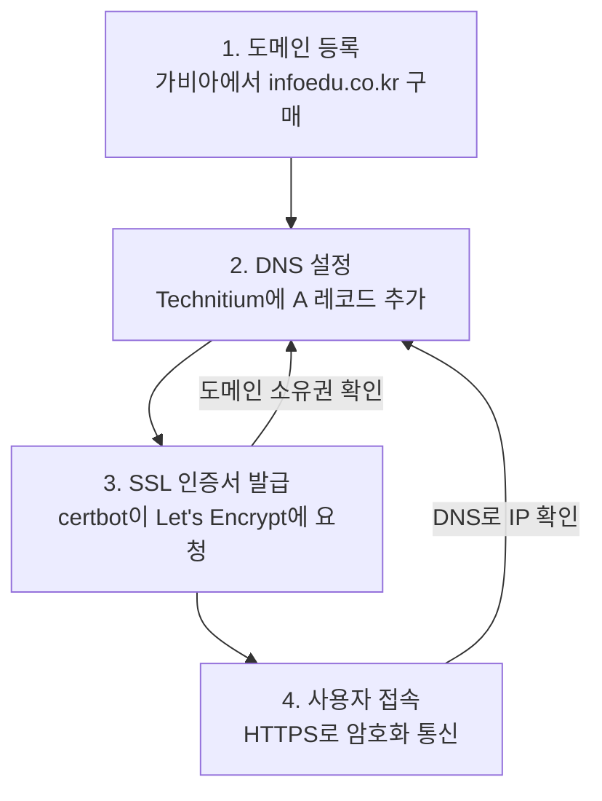
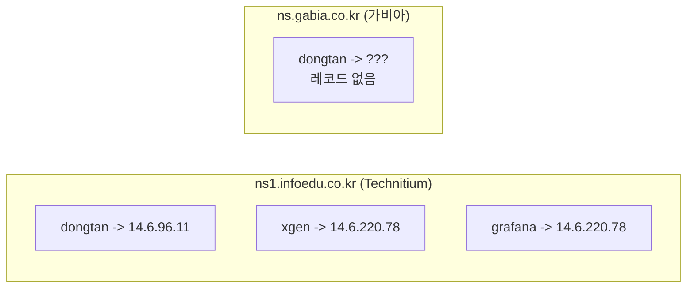
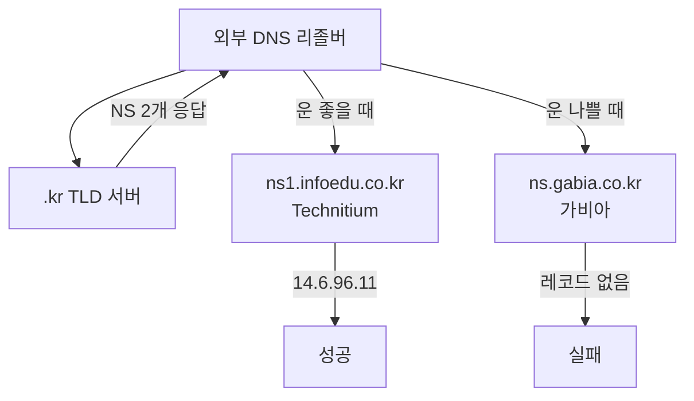

## 개요

`dongtan.infoedu.co.kr`에 A 레코드를 추가하고 Let's Encrypt 인증서를 발급하려 했다. 그런데 `dig @8.8.8.8`로 조회하면 응답이 없고, `dig @9.9.9.9`로는 정상 응답이 온다. 되다 안되다를 반복하니 인증서 발급도 실패했다.

원인은 `.kr` 레지스트리에 네임서버가 2개(Technitium + 가비아) 등록되어 있었고, 두 서버가 서로 다른 레코드를 가지고 있었기 때문이다.

이 글에서는 DNS, 도메인, SSL 인증서의 기본 개념을 먼저 정리하고, 실제로 겪은 네임서버 충돌 문제의 원인과 해결 과정을 기록한다.

---

## 도메인의 구조

IP 주소는 사람이 외우기 어렵다. `14.6.220.78`보다 `infoedu.co.kr`이 기억하기 쉽다. 도메인은 IP 주소에 붙인 이름이다.

도메인은 오른쪽에서 왼쪽으로 읽는 계층 구조를 가진다.

```
dongtan.infoedu.co.kr.
   |       |     |  |
   |       |     |  +-- 루트(.)           모든 도메인의 최상위 (보통 생략)
   |       |     +----- TLD(kr)           국가 최상위 도메인
   |       +----------- SLD(co)           2차 도메인 (co = 기업용)
   |       +----------- 등록 도메인(infoedu) 가비아에서 구매한 이름
   +------------------- 서브도메인(dongtan)  자유롭게 만드는 하위 이름
```

| 단계 | 예시 | 관리 주체 |
|------|------|-----------|
| 루트(.) | `.` | ICANN (전 세계 13개 루트 서버) |
| TLD | `.kr` | KRNIC (한국인터넷진흥원) |
| 등록 도메인 | `infoedu.co.kr` | 가비아 (도메인 등록 대행) |
| 서브도메인 | `dongtan.infoedu.co.kr` | 우리 (DNS 서버에서 자유롭게 추가) |

핵심은 **도메인을 산다 = 등록 도메인의 사용권을 산다**는 것이다. 서브도메인은 무제한으로 만들 수 있다.

---

## DNS 조회 과정

DNS(Domain Name System)는 도메인 이름을 IP 주소로 변환하는 시스템이다. 브라우저에 `dongtan.infoedu.co.kr`을 입력하면 다음과 같은 과정이 진행된다.



1. 루트 서버에 `.kr` 담당 서버를 질문한다
2. `.kr` TLD 서버에 `infoedu.co.kr` 담당 네임서버를 질문한다
3. 권한 네임서버(Technitium)에 `dongtan.infoedu.co.kr`의 IP를 질문한다
4. 브라우저가 받은 IP(`14.6.96.11`)로 접속한다

### DNS 레코드 종류

DNS는 단순히 "도메인 -> IP" 변환만 하지 않는다. 다양한 종류의 정보를 저장한다.

| 레코드 타입 | 용도 | 예시 |
|------------|------|------|
| **A** | 도메인 -> IPv4 주소 | `infoedu.co.kr -> 14.6.220.78` |
| **AAAA** | 도메인 -> IPv6 주소 | `infoedu.co.kr -> 2001:db8::1` |
| **CNAME** | 도메인 -> 다른 도메인 (별칭) | `www.infoedu.co.kr -> infoedu.co.kr` |
| **NS** | 이 도메인의 네임서버 | `infoedu.co.kr -> ns1.infoedu.co.kr` |
| **MX** | 메일 서버 | `infoedu.co.kr -> mail.infoedu.co.kr` |
| **TXT** | 텍스트 정보 (인증 등) | SPF, DKIM, 도메인 소유 확인 |
| **SOA** | Zone 관리 정보 | 시리얼 번호, 갱신 주기 등 |

### TTL (Time To Live)

```
dongtan.infoedu.co.kr    A    14.6.96.11    TTL=300
```

TTL은 "이 응답을 몇 초 동안 캐시해도 되는지"를 의미한다. TTL=300이면 5분간 캐시하고, 5분 후에 다시 질문한다.

- TTL이 짧으면: IP 변경이 빨리 반영되지만, DNS 서버 부하가 증가한다
- TTL이 길면: 캐시 효율이 좋지만, IP 변경 반영이 느리다

### 네임서버(NS)의 역할

네임서버는 도메인의 DNS 레코드를 실제로 보관하는 서버다. `infoedu.co.kr`의 정보가 어디에 있는지는 `.kr` 레지스트리에 NS 레코드로 등록되어 있다.

```
"infoedu.co.kr의 정보는 어디에 있어?"
  -> 레지스트리(.kr)에 NS 레코드로 등록됨
  -> ns1.infoedu.co.kr (Technitium 서버)
  -> 여기에 A, CNAME, MX 등 모든 레코드가 저장됨
```

도메인을 가비아에서 사면 기본 네임서버는 `ns.gabia.co.kr`이다. 자체 DNS(Technitium)를 운영하면 네임서버를 `ns1.infoedu.co.kr`로 변경해야 한다.

---

## SSL/TLS 인증서

### HTTP vs HTTPS

```
[HTTP]  브라우저 ---- 평문 데이터 ------> 서버
        누구나 중간에서 내용을 볼 수 있음

[HTTPS] 브라우저 ---- 암호화된 데이터 ---> 서버
        중간에서 가로채도 내용을 알 수 없음
```

HTTPS = HTTP + SSL/TLS 인증서다. SSL/TLS 인증서는 두 가지 역할을 한다.

1. **암호화**: 브라우저-서버 간 통신을 암호화
2. **신원 확인**: "이 서버가 진짜 dongtan.infoedu.co.kr 맞아?"를 보증

최신 브라우저는 HTTP 사이트에 경고를 띄우고, 일부 기능(카메라, 위치 등)을 차단한다.

### Let's Encrypt

SSL 인증서는 원래 유료다 (연간 수만~수십만 원). Let's Encrypt는 무료 인증서를 자동 발급해주는 비영리 CA(인증 기관)다.

| 항목 | 상용 인증서 | Let's Encrypt |
|------|-----------|---------------|
| 가격 | 유료 (연 5~50만원) | 무료 |
| 유효 기간 | 1~2년 | 90일 (자동 갱신) |
| 발급 방식 | 수동 신청 | 자동 (certbot 등) |
| 신뢰도 | 동일 | 동일 |

---

## DNS, 도메인, SSL 인증서의 관계

세 가지가 어떻게 연결되는지 전체 흐름으로 보면 이렇다.



**도메인 없이 DNS가 없고, DNS 없이 인증서 발급이 안 되고, 인증서 없이 HTTPS가 안 된다.** 세 가지는 체인처럼 연결되어 있다.

### Let's Encrypt의 도메인 소유권 확인 방식

인증서를 아무나 발급받으면 안 되므로, "이 도메인이 진짜 네 거야?"를 확인하는 과정이 있다.

**HTTP-01 챌린지** (가장 일반적):

```
1. Let's Encrypt -> certbot: "이 토큰을 웹서버에 올려봐"
2. certbot이 http://dongtan.infoedu.co.kr/.well-known/acme-challenge/토큰 에 파일 생성
3. Let's Encrypt가 해당 URL에 접속해서 토큰 확인
4. 확인 성공 -> 인증서 발급
```

**DNS-01 챌린지** (와일드카드 인증서용):

```
1. Let's Encrypt -> certbot: "이 값을 DNS TXT 레코드에 추가해봐"
2. certbot이 _acme-challenge.dongtan.infoedu.co.kr TXT 레코드 추가
3. Let's Encrypt가 DNS 조회로 TXT 값 확인
4. 확인 성공 -> 인증서 발급
```

두 방식 모두 DNS가 정상 작동해야 성공한다. HTTP-01도 결국 도메인으로 접속하므로 DNS 조회가 선행되어야 한다.

---

## 실제 겪은 문제 — 네임서버 충돌

### 상황

`dongtan.infoedu.co.kr` A 레코드를 Technitium DNS에 추가했다. 일부 DNS(Quad9)에서는 정상 응답하는데, 다른 DNS(Google)에서는 응답이 없다. 결과적으로 Let's Encrypt 인증서 발급이 실패했다.

### 원인 분석

`.kr` 레지스트리(KRNIC)에 등록된 `infoedu.co.kr`의 네임서버를 확인했다.

```
infoedu.co.kr    NS    ns1.infoedu.co.kr   <- Technitium (자체 서버)
infoedu.co.kr    NS    ns.gabia.co.kr      <- 가비아 DNS
```

두 네임서버가 서로 다른 정보를 가지고 있었다.



Technitium에는 `dongtan.infoedu.co.kr`의 A 레코드가 있지만, 가비아에는 추가하지 않았으므로 레코드가 없다.

### 왜 되다 안되다 하는가

외부 DNS 서버(Google, Cloudflare 등)가 `dongtan.infoedu.co.kr`을 조회할 때, `.kr` 서버가 네임서버 2개를 알려주면 **랜덤으로 하나를 골라서 질문**한다.



동전 던지기와 같다. 50% 확률로 되고, 50% 확률로 안 된다.

### Let's Encrypt 발급 실패 과정

Let's Encrypt는 인증서를 발급하기 전에 도메인 소유권을 확인한다. 이때 DNS 조회를 하는데, 가비아 쪽으로 쿼리가 가면 레코드가 없으니 검증이 실패한다.

```
Let's Encrypt: "dongtan.infoedu.co.kr 확인할게"
    |
    +-- 1차 시도 -> Technitium -> 확인됨
    +-- 2차 시도 -> 가비아     -> 없음
    |
    +-- "DNS 응답이 일관성 없으니 인증서 발급 거부"
```

### 실제 확인 결과

```bash
# Quad9 (Technitium 쪽으로 질문됨) -> 성공
$ dig @9.9.9.9 dongtan.infoedu.co.kr A +short
14.6.96.11

# Google (가비아 쪽으로 질문됨) -> 실패
$ dig @8.8.8.8 dongtan.infoedu.co.kr A +short
(응답 없음)
```

`+trace` 옵션으로 경로를 추적하면 가비아로 빠지는 것을 확인할 수 있다.

```bash
$ dig @8.8.8.8 dongtan.infoedu.co.kr A +trace
# ...
infoedu.co.kr.   86400  IN  NS  ns1.infoedu.co.kr.
infoedu.co.kr.   86400  IN  NS  ns.gabia.co.kr.     <- 여기로 감
# ...
infoedu.co.kr.   86400  IN  SOA  ns.gabia.co.kr. ... <- 가비아가 응답 (레코드 없음)
```

---

## 해결

### 방법 1: 가비아에서 네임서버를 Technitium만 남기기 (채택)

가비아 도메인 관리에서 네임서버 설정을 변경했다.

```
변경 전:
  1차 네임서버: ns1.infoedu.co.kr
  2차 네임서버: ns.gabia.co.kr     <- 제거

변경 후:
  1차 네임서버: ns1.infoedu.co.kr  <- Technitium만 사용
```

모든 DNS 쿼리가 Technitium으로만 가므로 일관된 응답이 보장된다.

### 방법 2: 가비아 DNS에도 같은 레코드 추가 (비추천)

가비아 DNS 관리에서도 `dongtan.infoedu.co.kr -> 14.6.96.11`을 추가하는 방법이다. 하지만 레코드를 추가할 때마다 양쪽 다 관리해야 하므로 번거롭고 실수의 여지가 크다.

---

## 정리

| 항목 | 내용 |
|------|------|
| 문제 | 네임서버 2개가 서로 다른 정보를 가지고 있음 |
| 증상 | DNS 조회가 되다 안되다 함 (랜덤) |
| 원인 | `.kr` 레지스트리에 NS가 2개 등록 (Technitium + 가비아) |
| 영향 | Let's Encrypt 인증서 발급 실패 |
| 해결 | 네임서버를 Technitium 하나로 통일 |

네임서버가 여러 개일 때는 모든 네임서버가 동일한 레코드를 가지고 있어야 한다. 하나의 도메인을 두 곳에서 관리하면 반드시 불일치가 생긴다. 자체 DNS를 운영한다면 레지스트리의 NS를 자체 서버로 통일하는 것이 정답이다.

자체 DNS 운영 시 체크리스트:

- 레지스트리(가비아 등)의 네임서버 설정이 자체 DNS만 가리키는지 확인
- `dig @8.8.8.8 도메인 +trace`로 외부에서 어느 NS로 가는지 확인
- 새 레코드 추가 후 Google(8.8.8.8), Cloudflare(1.1.1.1), Quad9(9.9.9.9) 세 곳에서 모두 조회 테스트
- Let's Encrypt 발급 전 DNS 전파 완료 확인
