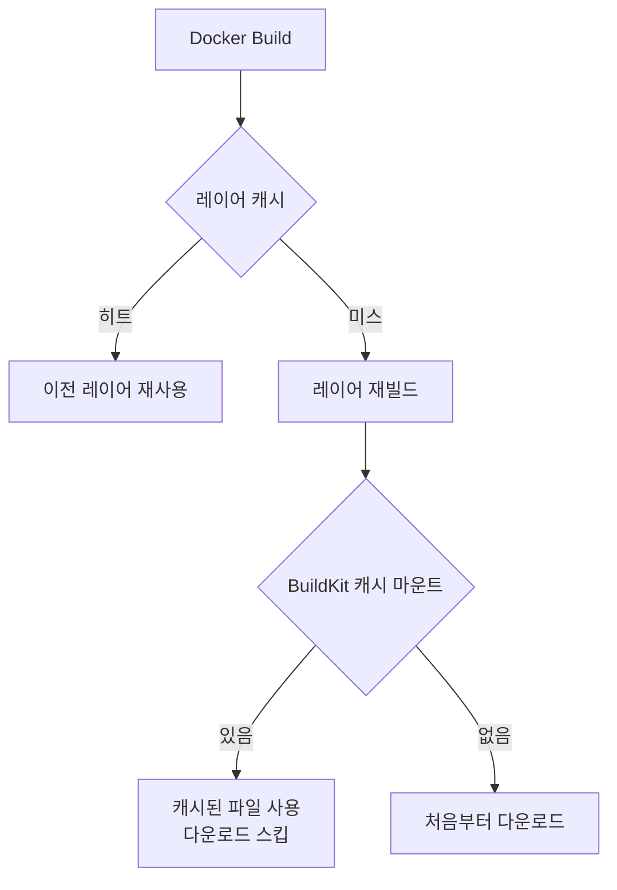

## 배경

Jenkins에서 Docker 이미지를 빌드할 때 캐시를 활용하면 빌드 속도가 크게 빨라진다. 그런데 프로덕션 배포에서 캐시된 레이어가 문제를 일으킨 적이 있었다. 패키지가 업데이트됐는데 캐시 때문에 이전 버전이 그대로 포함된 이미지가 배포되거나, 캐시가 corrupted되어 이상한 빌드 오류가 발생하는 경우였다.

반대로 캐시를 완전히 끄면 매번 패키지를 처음부터 다운로드해야 해서 xgen-model 같은 PyTorch 이미지는 빌드에 20분 이상 걸렸다.

캐시를 유연하게 제어하는 전략이 필요했다.

## BuildKit 활성화

먼저 BuildKit을 활성화한다. Docker 23.0부터는 기본값이지만, CI 환경에서는 명시적으로 설정하는 편이 안전하다.

```bash
# # 커밋: DOCKER_BUILDKIT=1 명시 설정 (BuildKit 캐시 마운트 활용)
# # 날짜: 2024-09-01
export DOCKER_BUILDKIT=1
docker build -t registry.x2bee.com/xgen-model:latest .
```

BuildKit의 장점:
- 병렬 빌드 (의존성 없는 레이어 동시 실행)
- `--mount=type=cache` (패키지 캐시 레이어 외부 보관)
- 빌드 로그 개선

## Jenkinsfile에 NO_CACHE 파라미터 추가

Jenkins 파이프라인에 `NO_CACHE` boolean 파라미터를 추가해서 필요할 때 선택적으로 캐시를 무시할 수 있게 했다.

```groovy
// Jenkinsfile
// # 커밋: Jenkins NO_CACHE 파라미터 추가 (선택적 캐시 무시)
// # 날짜: 2024-09-01
pipeline {
    parameters {
        booleanParam(
            name: 'NO_CACHE',
            defaultValue: false,
            description: 'Docker 빌드 캐시 무시 (패키지 업데이트 강제 적용)'
        )
    }

    stages {
        stage('Build') {
            steps {
                container('docker') {
                    script {
                        def noCache = params.NO_CACHE ? "--no-cache" : ""

                        sh """
                            DOCKER_BUILDKIT=1 docker build ${noCache} \
                                -t ${REGISTRY}/${SERVICE_NAME}:${IMAGE_TAG} \
                                -f Dockerfile .
                        """
                    }
                }
            }
        }
    }
}
```

기본값은 `false` — 캐시 사용. 패키지 버전 업그레이드나 캐시 의심 상황에서만 `NO_CACHE=true`로 빌드한다.

## docker builder prune 자동화

`--no-cache` 옵션을 써도 Docker builder의 내부 캐시가 남아있으면 다음 빌드에 다시 사용된다. 완전히 초기화하려면 builder prune이 필요하다.

```groovy
// # 커밋: NO_CACHE=true 시 docker builder prune -af 실행 추가
// # 날짜: 2024-09-02
stage('Build') {
    steps {
        container('docker') {
            script {
                if (params.NO_CACHE) {
                    sh "docker builder prune -af"
                }

                def noCache = params.NO_CACHE ? "--no-cache" : ""

                sh """
                    DOCKER_BUILDKIT=1 docker build ${noCache} \
                        -t ${REGISTRY}/${SERVICE_NAME}:${IMAGE_TAG} \
                        -f Dockerfile .
                """
            }
        }
    }
}
```

`docker builder prune -af`:
- `-a`: 사용 중인 캐시도 포함해서 모두 삭제
- `-f`: 확인 프롬프트 없이 강제 실행

BuildKit 캐시가 완전히 초기화되어 다음 빌드는 처음부터 시작한다.

## BuildKit 캐시 마운트 (mount=type=cache)

반대로 캐시를 더 잘 활용하는 방법도 있다. BuildKit의 `--mount=type=cache`는 레이어 캐시와 별개로 빌드 시간 캐시를 유지한다.

### Python 패키지 캐시

```dockerfile
# Dockerfile (xgen-core, xgen-workflow)
FROM python:3.11-slim

WORKDIR /app

# pip 캐시를 BuildKit 캐시 볼륨에 보관
RUN --mount=type=cache,target=/root/.cache/pip \
    pip install --upgrade pip

COPY requirements.txt .

RUN --mount=type=cache,target=/root/.cache/pip \
    pip install -r requirements.txt

COPY . .
CMD ["uvicorn", "main:app", "--host", "0.0.0.0"]
```

`/root/.cache/pip`를 캐시 마운트로 지정하면, requirements.txt가 변경되어도 pip가 이미 다운로드한 패키지를 재사용한다. 레이어 캐시는 무효화되지만 pip 다운로드 캐시는 유지된다.

### Node.js 패키지 캐시

```dockerfile
# Dockerfile (xgen-frontend)
FROM node:20-slim

WORKDIR /app

COPY package.json package-lock.json ./

# npm 캐시를 BuildKit 캐시 볼륨에 보관
RUN --mount=type=cache,target=/root/.npm \
    npm ci --prefer-offline

COPY . .
RUN npm run build
```

`npm ci --prefer-offline`과 캐시 마운트를 조합하면 npm이 이미 다운로드된 패키지를 오프라인으로 설치한다.

### Rust 의존성 캐시

```dockerfile
# Dockerfile (xgen-backend-gateway)
FROM rust:1.76 as builder

WORKDIR /app

COPY Cargo.toml Cargo.lock ./

# 의존성만 먼저 빌드 (소스코드 변경과 분리)
RUN --mount=type=cache,target=/usr/local/cargo/registry \
    --mount=type=cache,target=/app/target \
    cargo fetch

COPY src/ ./src/

RUN --mount=type=cache,target=/usr/local/cargo/registry \
    --mount=type=cache,target=/app/target \
    cargo build --release
```

Rust는 의존성 컴파일이 오래 걸리는 언어다. `cargo/registry`와 `target` 디렉토리를 캐시 마운트로 유지하면 소스코드만 변경될 때 재컴파일 범위가 최소화된다.

## 레이어 캐시 vs 빌드 캐시 차이



`--no-cache`는 레이어 캐시를 무시한다. 레이어를 다시 실행하더라도 `--mount=type=cache`로 지정된 빌드 캐시(pip, npm, cargo)는 별도로 유지된다.

즉, `--no-cache` + `--mount=type=cache` 조합을 쓰면:
- Dockerfile의 모든 레이어를 다시 실행 (최신 패키지 목록 반영)
- 하지만 이미 다운로드된 패키지 파일은 재사용 (다운로드 시간 절약)

이것이 가장 이상적인 CI 빌드 전략이다.

## 캐시 corrupted 대응

BuildKit 캐시가 손상된 경우 증상은 다양하다.

```bash
# 증상 1: 이전에 잘 되던 빌드가 이유 없이 실패
# error: failed to solve: failed to read dockerfile

# 증상 2: 레이어 해시 불일치
# error: failed to compute cache key

# 증상 3: 패키지 설치 시 checksum 오류
# ERROR: RECORD file has an SHA256 mismatch
```

이런 경우 `docker builder prune -af`로 전체 캐시를 초기화하면 대부분 해결된다. Jenkins 파이프라인에서 자동화했으니 `NO_CACHE=true`로 실행하면 된다.

## 결과

- `NO_CACHE` 파라미터로 캐시/비캐시 선택적 제어
- `docker builder prune -af`로 캐시 완전 초기화 자동화
- `--mount=type=cache`로 패키지 다운로드 캐시 유지
- xgen-model (PyTorch) 빌드: --no-cache에서도 패키지 캐시로 8분 → 12분 수준 유지

캐시는 편리하지만 신뢰할 수 없는 순간이 반드시 온다. 캐시를 끄는 탈출구를 항상 만들어두는 것이 CI 파이프라인의 기본이다.
