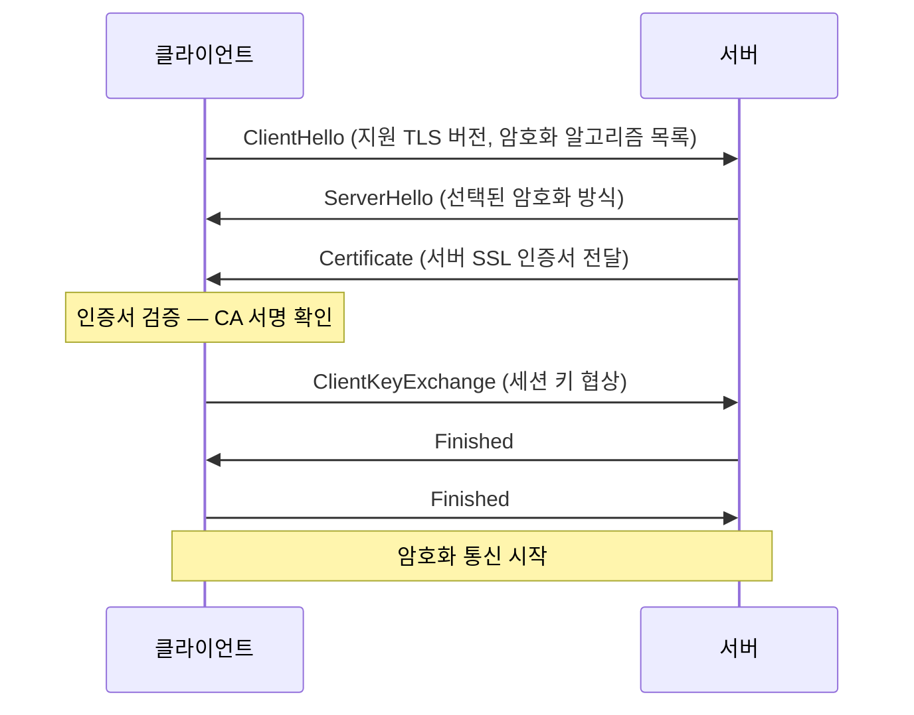
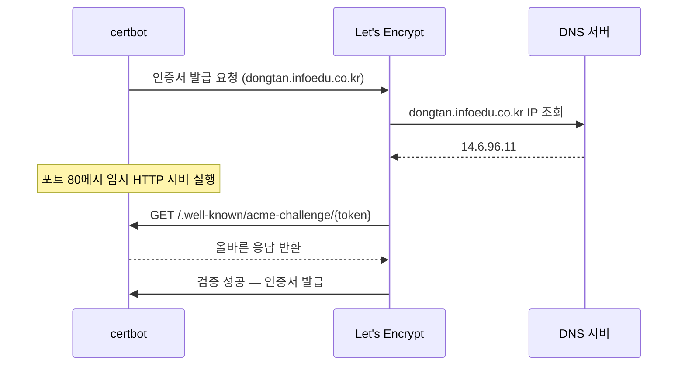

## 개요

`dongtan.infoedu.co.kr`에 HTTPS를 적용해야 했다. 서버 환경은 Ubuntu 24.04, Docker 컨테이너로 nginx를 운영 중이었고, Let's Encrypt 무료 인증서를 사용하기로 했다.

그런데 첫 번째 벽은 예상치 못한 곳에서 나타났다. 이 서버의 Docker가 snap으로 설치되어 있었고, snap의 샌드박스가 `/etc/letsencrypt` 경로의 볼륨 마운트를 차단했다. 인증서 파일이 컨테이너 안에서 빈 디렉토리로 보이는 현상이 발생한 것이다.

결국 snap Docker를 완전히 제거하고 apt Docker로 교체하는 것부터 시작해야 했다.

이 글에서는 단순한 명령어 나열이 아니라, 각 단계에서 **왜 이렇게 해야 하는지**를 함께 설명한다.

핵심 아키텍처 결정:

- certbot은 **호스트(서버)에 직접 설치**
- 인증서 파일은 **프로젝트 내 디렉토리에 복사**해서 Docker 볼륨으로 마운트
- nginx는 **Docker 컨테이너** 안에서 SSL Termination 담당

---

## 배경 지식

### HTTPS와 TLS

HTTP는 데이터를 평문(plain text)으로 전송한다. 중간에 누군가 패킷을 가로채면 그대로 읽힌다.
**HTTPS = HTTP + TLS(Transport Layer Security)**로, 데이터를 암호화해서 전송한다.

TLS 연결이 맺어지는 과정(TLS Handshake)은 다음과 같다.



### SSL 인증서란

인증서는 **"이 서버가 진짜 dongtan.infoedu.co.kr이다"**를 제3자(CA, Certificate Authority)가 보증하는 디지털 문서다.

인증서에 포함된 정보:

- 도메인 이름
- 인증서 유효기간
- 서버의 공개 키(Public Key)
- CA의 디지털 서명

브라우저는 내장된 신뢰할 수 있는 CA 목록을 가지고 있다. 인증서의 서명이 이 목록에 있는 CA에 의해 서명됐다면 자물쇠 아이콘을 표시한다.

### Let's Encrypt

전통적으로 SSL 인증서는 연간 수만 원에서 수십만 원의 비용이 발생했다.
**Let's Encrypt**는 인터넷 보안 향상을 목적으로 설립된 비영리 CA로, 무료로 인증서를 발급한다.

특징:

- 무료
- 자동화 가능 (ACME 프로토콜)
- 유효기간 90일 (짧게 해서 자동 갱신을 강제 — 보안성 향상)
- 와일드카드 인증서도 지원 (DNS Challenge 필요)

---

## 사전 조건

- DNS A 레코드 등록 완료: `dongtan.infoedu.co.kr -> 공인 IP 14.6.96.11`
- 라우터 포트포워딩: `80 -> 서버:80`, `443 -> 서버:443`
- Ubuntu 24.04 서버

DNS 전파 확인:

```bash
# 여러 DNS 서버에서 확인 (Google, Cloudflare, Quad9)
dig dongtan.infoedu.co.kr A +short @8.8.8.8
dig dongtan.infoedu.co.kr A +short @1.1.1.1
dig dongtan.infoedu.co.kr A +short @9.9.9.9
```

모두 동일한 IP를 반환해야 Let's Encrypt 인증이 통과된다. Let's Encrypt는 자체 DNS 리졸버를 사용하므로, 특정 DNS 서버에서만 보인다면 인증 실패할 수 있다.

---

## snap Docker에서 apt Docker로 교체

### snap Docker의 문제

이 서버에는 Docker가 Ubuntu의 snap 패키지 매니저를 통해 설치되어 있었다.

**snap이란?** Canonical(Ubuntu 제조사)이 만든 범용 패키지 포맷으로, 앱과 의존성을 하나의 패키지에 담고 **샌드박스**로 격리한다. 앱이 접근할 수 있는 파일시스템 경로를 엄격히 제한한다.

snap Docker가 볼륨으로 마운트할 수 있는 경로:

- `/home/`
- `/media/`
- `/mnt/`
- `/tmp/`
- snap 자체 데이터 디렉토리

`/etc/letsencrypt`는 이 목록에 없기 때문에, 인증서를 Docker 컨테이너에 마운트하려 해도 컨테이너 안에서는 빈 디렉토리로 보인다.

또한 snap Docker는 데이터를 `/var/snap/docker/common/var-lib-docker`에 저장하므로, Docker Root Dir가 표준 경로(`/var/lib/docker`)와 다르다.

```bash
# snap Docker 확인
docker info | grep "Docker Root Dir"
# -> Docker Root Dir: /var/snap/docker/common/var-lib-docker  <- 비표준 경로
```

이 문제를 해결하는 가장 확실한 방법은 snap Docker를 제거하고 apt(공식 저장소)로 재설치하는 것이다.

### 교체 절차

```bash
# 1. 실행 중인 컨테이너 전체 중지 및 네트워크 정리
docker compose -f infrastructure/docker/docker-compose.prod.yml --env-file .env down

# 2. snap Docker 완전 제거 (--purge: 설정 파일까지 삭제)
sudo snap remove docker --purge
```

> **데이터 주의:** snap Docker를 제거하면 해당 Docker가 관리하던 볼륨(postgres, redis 데이터)이 함께 삭제된다. 운영 중인 서비스라면 반드시 DB 백업 후 진행해야 한다.

```bash
# 3. Docker 공식 GPG 키 등록
#    apt는 패키지 무결성 검증을 위해 저장소의 서명 키를 사전 등록한다
sudo install -m 0755 -d /etc/apt/keyrings
curl -fsSL https://download.docker.com/linux/ubuntu/gpg | \
  sudo gpg --dearmor -o /etc/apt/keyrings/docker.gpg
sudo chmod a+r /etc/apt/keyrings/docker.gpg

# 4. Docker 공식 apt 저장소 추가
echo "deb [arch=$(dpkg --print-architecture) signed-by=/etc/apt/keyrings/docker.gpg] \
  https://download.docker.com/linux/ubuntu \
  $(. /etc/os-release && echo "$VERSION_CODENAME") stable" | \
  sudo tee /etc/apt/sources.list.d/docker.list > /dev/null

# 5. Docker CE 설치
#    - docker-ce: Docker 엔진 (Community Edition)
#    - docker-ce-cli: CLI 도구
#    - containerd.io: 컨테이너 런타임
#    - docker-buildx-plugin: 멀티 플랫폼 빌드 플러그인
#    - docker-compose-plugin: compose 명령어 (docker compose)
sudo apt-get update
sudo apt-get install -y \
  docker-ce docker-ce-cli containerd.io \
  docker-buildx-plugin docker-compose-plugin

# 6. 현재 유저를 docker 그룹에 추가
#    docker.sock은 root 또는 docker 그룹만 접근 가능하다
#    그룹 추가 없이는 매번 sudo가 필요하다
sudo usermod -aG docker $USER

# 7. docker.socket systemd 유닛 시작
#    apt Docker는 systemd socket activation 방식을 사용한다
#    docker.socket 유닛이 /run/docker.sock 파일을 생성하고,
#    첫 연결이 들어오면 docker.service(데몬)를 자동으로 시작한다
sudo systemctl stop docker.socket docker.service
sudo systemctl start docker.socket
```

> **`usermod` 후 그룹 반영:**
> 리눅스에서 그룹 변경은 새 로그인 세션부터 적용된다.
> 현재 터미널에서 즉시 적용하려면: `newgrp docker`

### 설치 확인

```bash
docker --version
# -> Docker version 29.2.1

docker compose version
# -> Docker Compose version v5.0.2

docker info | grep "Docker Root Dir"
# -> Docker Root Dir: /var/lib/docker  <- 표준 경로 확인
```

---

## Let's Encrypt 인증서 발급

### ACME 프로토콜과 도메인 소유권 인증

Let's Encrypt가 인증서를 발급하기 전에 **"이 도메인을 실제로 제어하고 있는가"**를 검증한다. 이 과정을 ACME(Automated Certificate Management Environment) 프로토콜이라고 한다.

검증 방식(Challenge)에는 세 가지가 있다.

- **HTTP-01 (standalone)**: certbot이 포트 80에서 임시 웹서버를 실행하고, Let's Encrypt가 특정 URL로 HTTP 요청해서 확인한다. 가장 간단하지만 포트 80이 비어있어야 한다.
- **HTTP-01 (webroot)**: 기존 웹서버가 실행된 상태에서 특정 디렉토리에 파일을 생성한다. 서버 중단이 불필요하지만 웹서버 설정이 필요하다.
- **DNS-01**: DNS TXT 레코드에 특정 값을 등록한다. 포트가 불필요하고 와일드카드를 지원하지만 DNS API 연동이 필요하다.

이 설정에서는 **HTTP-01 standalone** 방식을 사용했다. 가장 단순하지만 web 컨테이너를 잠깐 내려야 한다.



### certbot 설치 및 인증서 발급

```bash
sudo apt-get install -y certbot
```

certbot은 ACME 클라이언트로, Let's Encrypt와의 통신, 도메인 검증, 인증서 발급/갱신을 자동으로 처리한다.

```bash
# web 컨테이너 중단 (포트 80 해제 필수)
docker stop dongtan-web

# 인증서 발급
sudo certbot certonly \
  --standalone \
  -d dongtan.infoedu.co.kr \
  --non-interactive \
  --agree-tos \
  --email your@email.com
```

내부 동작:

1. certbot이 포트 80에서 임시 HTTP 서버를 실행한다
2. Let's Encrypt 서버가 `http://dongtan.infoedu.co.kr/.well-known/acme-challenge/{token}`으로 요청한다
3. certbot이 올바른 응답을 반환한다
4. 검증 성공 시 인증서가 발급된다

### 발급된 파일 구조

```
/etc/letsencrypt/
├── live/
│   └── dongtan.infoedu.co.kr/
│       ├── fullchain.pem  -> ../../archive/.../fullchain1.pem  (symlink)
│       ├── privkey.pem    -> ../../archive/.../privkey1.pem    (symlink)
│       ├── cert.pem       -> ../../archive/.../cert1.pem       (symlink)
│       └── chain.pem      -> ../../archive/.../chain1.pem      (symlink)
└── archive/
    └── dongtan.infoedu.co.kr/
        ├── fullchain1.pem  <- 실제 파일 (갱신 시 fullchain2.pem, 3.pem 추가됨)
        └── privkey1.pem    <- 실제 파일
```

`live/` 디렉토리의 파일들은 **심볼릭 링크(symlink)**다. `archive/`의 실제 파일을 가리키며, 갱신 시 링크만 업데이트된다.

각 파일의 역할:

- `fullchain.pem`: 서버 인증서 + 중간 CA 인증서 체인 (nginx에서 이것을 사용)
- `privkey.pem`: 서버의 개인 키 (절대 외부 노출 금지)
- `cert.pem`: 서버 인증서만 (체인 없음)
- `chain.pem`: 중간 CA 인증서만

> **트러블슈팅 — NXDOMAIN 오류:**
> Let's Encrypt는 여러 지역의 DNS 리졸버를 사용한다.
> 로컬에서는 DNS가 보여도 일부 리졸버에서 아직 전파가 안 됐다면 실패한다.
> `dig 도메인 A +short @9.9.9.9` 등 여러 DNS로 확인 후 모두 정상이면 재시도한다.

---

## 인증서를 Docker 마운트 가능한 경로로 복사

### 왜 직접 /etc/letsencrypt를 마운트하면 안 되는가

두 가지 문제가 있다.

**문제 1: 디렉토리 권한**

```bash
ls -la /etc/letsencrypt/
# drwx------  archive   <- root만 접근 가능
# drwx------  live      <- root만 접근 가능
```

`archive/`와 `live/` 디렉토리가 `drwx------`(root only)다.
Docker 컨테이너 내부의 nginx는 `live/` 안의 symlink가 가리키는 `archive/` 파일을 따라갈 때 권한 오류가 발생한다.

**문제 2: symlink와 볼륨 마운트**

Docker 볼륨으로 `/etc/letsencrypt`를 마운트하면 디렉토리 구조는 들어오지만, symlink의 대상(`../../archive/...`)은 마운트된 경로 내에 있어 따라갈 수 있다. 하지만 권한 문제로 인해 실제 파일 읽기가 실패한다.

**해결책: 실제 파일을 접근 가능한 경로로 복사**

```bash
# 인증서 저장 디렉토리 생성
mkdir -p infrastructure/certs

# symlink가 아닌 실제 파일(archive/)에서 직접 복사
sudo cp /etc/letsencrypt/archive/dongtan.infoedu.co.kr/fullchain1.pem \
  infrastructure/certs/fullchain.pem
sudo cp /etc/letsencrypt/archive/dongtan.infoedu.co.kr/privkey1.pem \
  infrastructure/certs/privkey.pem

# 현재 유저 소유로 변경
sudo chown $USER:$USER infrastructure/certs/*.pem

ls -la infrastructure/certs/
# -rw-r--r-- fullchain.pem
# -rw------- privkey.pem
```

**반드시 .gitignore에 추가:**

```bash
echo "infrastructure/certs/" >> .gitignore
```

개인 키(privkey.pem)가 git에 올라가면 심각한 보안 사고다. 절대 커밋하면 안 된다.

---

## nginx SSL Termination 설정

### SSL Termination이란

클라이언트와의 TLS 암호화/복호화를 nginx가 담당하고, 내부 서비스(Node.js server)와는 평문 HTTP로 통신하는 구조다.

```mermaid
flowchart LR
    A[클라이언트] -->|HTTPS 443 암호화| B[nginx 컨테이너]
    B -->|HTTP 평문| C[server:3001<br/>Node.js]
    B -->|정적 파일 서빙| D[/usr/share/nginx/html]
```

내부 네트워크(Docker 네트워크)는 이미 격리되어 있으므로 평문 통신이 안전하다.
모든 암호화 부담을 nginx 한 곳에서 처리하므로 관리가 단순하다.

### nginx 설정 파일

```nginx
# HTTP -> HTTPS 강제 리다이렉트
server {
    listen 80;
    server_name dongtan.infoedu.co.kr;
    return 301 https://$host$request_uri;
    # 301: 영구 리다이렉트 (브라우저가 캐시)
    # 302를 쓰면 임시 리다이렉트로 매번 체크
}

# HTTPS 메인 서버
server {
    listen 443 ssl;
    server_name dongtan.infoedu.co.kr;
    root /usr/share/nginx/html;
    index index.html;

    # 인증서 경로 (Docker 볼륨으로 마운트된 경로)
    ssl_certificate     /etc/nginx/certs/fullchain.pem;
    ssl_certificate_key /etc/nginx/certs/privkey.pem;

    # TLS 버전: 1.2와 1.3만 허용 (1.0, 1.1은 취약점으로 폐기됨)
    ssl_protocols       TLSv1.2 TLSv1.3;

    # 암호화 알고리즘: 강력한 것만 사용, 익명/MD5 제외
    ssl_ciphers         HIGH:!aNULL:!MD5;

    # 서버가 선호하는 알고리즘을 우선 사용 (클라이언트 선호 무시)
    ssl_prefer_server_ciphers on;

    # HSTS: 브라우저에게 "이 사이트는 앞으로 1년간 항상 HTTPS만 사용"을 알림
    # 한번 설정되면 브라우저가 HTTP 요청 자체를 HTTPS로 바꿔서 보냄
    add_header Strict-Transport-Security "max-age=31536000; includeSubDomains" always;

    # ... 나머지 설정 (gzip, 캐시, API 프록시, SPA fallback) ...
}
```

### HSTS(HTTP Strict Transport Security)

HSTS는 브라우저가 해당 도메인에 대해 앞으로 HTTP 요청을 보내지 않도록 강제하는 헤더다.
중간자 공격(MITM)에서 HTTP로 다운그레이드하는 SSLstrip 공격을 방지한다.

- `max-age=31536000`: 1년(초 단위)
- `includeSubDomains`: 서브도메인에도 적용

> **주의:** HSTS를 설정하면 되돌리기 어렵다. 1년간 해당 도메인으로의 HTTP 접속이 브라우저 레벨에서 차단된다. 도메인을 바꾸거나 HTTPS를 유지할 자신이 없다면 `max-age`를 짧게 시작하는 것이 안전하다.

---

## Docker Compose 및 Dockerfile 업데이트

### docker-compose.prod.yml

```yaml
web:
  ports:
    - '80:80'    # HTTP (HTTPS 리다이렉트용)
    - '443:443'  # HTTPS
  volumes:
    # 호스트의 infrastructure/certs/ -> 컨테이너의 /etc/nginx/certs/ (읽기 전용)
    # 경로는 docker-compose.yml 위치 기준 상대경로
    - ../../infrastructure/certs:/etc/nginx/certs:ro
```

`:ro`(read-only) 옵션으로 컨테이너가 인증서 파일을 수정하지 못하게 한다.

### Dockerfile.web

```dockerfile
EXPOSE 80 443  # 443 포트 추가

# 헬스체크 변경: HTTP -> HTTPS
# HTTP(80)는 이제 301 리다이렉트를 반환하므로
# wget은 301을 오류로 간주해 exit 1 -> 컨테이너가 unhealthy 판정
# --no-check-certificate: 자기 자신에게 요청 시 인증서의 도메인이
#       127.0.0.1과 맞지 않아 검증 실패 -> 검증 스킵 옵션 사용
HEALTHCHECK --interval=30s --timeout=5s --retries=3 \
  CMD wget -qO- --no-check-certificate https://127.0.0.1/ || exit 1
```

헬스체크를 HTTP에서 HTTPS로 변경한 이유가 중요하다. HTTP(80)는 이제 301을 반환하므로, `wget`이 이를 오류로 판단해서 컨테이너가 unhealthy 상태에 빠진다. `--no-check-certificate`는 localhost에서 자기 자신에게 요청할 때 인증서의 도메인(dongtan.infoedu.co.kr)과 요청 주소(127.0.0.1)가 불일치하는 문제를 우회하기 위한 옵션이다.

---

## 재배포 및 접속 확인

```bash
make deploy
```

`make deploy`는 내부적으로 다음을 실행한다:

```bash
docker compose -f infrastructure/docker/docker-compose.prod.yml \
  --env-file .env up --build -d
```

### 접속 확인

```bash
# HTTP -> 301 리다이렉트 확인
curl -s -o /dev/null -w "%{http_code}" http://dongtan.infoedu.co.kr/
# -> 301

# HTTPS -> 200 확인
curl -s -o /dev/null -w "%{http_code}" https://dongtan.infoedu.co.kr/
# -> 200

# 컨테이너 상태
docker ps --format "table {{.Names}}\t{{.Status}}"
# dongtan-web        Up 1 minute (healthy)
# dongtan-server     Up 1 minute (healthy)
# dongtan-postgres   Up 1 minute (healthy)
# dongtan-redis      Up 1 minute (healthy)
```

---

## 인증서 자동 갱신

### 왜 90일인가

Let's Encrypt가 유효기간을 90일로 짧게 설정한 이유:

- 개인 키가 유출되더라도 피해 기간을 최소화
- 자동화를 강제해서 인증서 관리 부담을 낮춤
- 잘못된 인증서 발급 시 빠르게 교체 가능

권장 갱신 주기는 만료 30일 전이다. certbot 기본값도 30일 전에 갱신을 시도한다.

### 갱신 스크립트

```bash
#!/bin/bash
DOMAIN="dongtan.infoedu.co.kr"
CERTS_DIR="/home/son/project/dongtan-master-guide/infrastructure/certs"

# 1. web 컨테이너 중단 (포트 80 해제 - standalone 방식 요건)
docker stop dongtan-web 2>/dev/null || true

# 2. 인증서 갱신 시도
#    certbot은 만료 30일 이상 남은 경우 갱신하지 않음 (멱등성 보장)
certbot renew --standalone --non-interactive 2>&1

# 3. 갱신된 최신 인증서를 certs/ 폴더로 복사
#    갱신할 때마다 fullchain2.pem, fullchain3.pem ... 이 생성됨
#    ls -t 로 가장 최신 파일을 선택
LATEST=$(ls -t /etc/letsencrypt/archive/${DOMAIN}/fullchain*.pem | head -1)
PRIVKEY=$(ls -t /etc/letsencrypt/archive/${DOMAIN}/privkey*.pem | head -1)

cp "$LATEST" "${CERTS_DIR}/fullchain.pem"
cp "$PRIVKEY" "${CERTS_DIR}/privkey.pem"
chown son:son "${CERTS_DIR}"/*.pem

# 4. web 컨테이너 재시작
#    nginx가 시작 시 인증서를 로드하므로 재시작만으로 새 인증서 적용
docker start dongtan-web

echo "$(date): 인증서 갱신 완료" >> /var/log/certbot-renew.log
```

### 크론 등록

```bash
sudo crontab -e
```

```cron
# 매월 1일, 15일 새벽 3시에 갱신 시도
# (90일 유효기간 중 30일 전 갱신 기준으로 넉넉히 설정)
0 3 1,15 * * /home/son/project/dongtan-master-guide/infrastructure/scripts/renew-certs.sh
```

크론 형식: `분 시 일 월 요일 명령어`

```bash
# 등록 확인
sudo crontab -l | grep renew

# 갱신 로그 확인
cat /var/log/certbot-renew.log
```

---

## 최종 아키텍처

```mermaid
flowchart TB
    A[사용자 브라우저] -->|HTTPS 443/TLS| B[공인 IP 14.6.96.11]
    B -->|포트포워딩<br/>80->80, 443->443| C[서버 192.168.219.110]

    C --> D[dongtan-web<br/>nginx:alpine]
    C --> E[dongtan-server<br/>Node.js :3001]
    C --> F[dongtan-postgres<br/>PostgreSQL]
    C --> G[dongtan-redis<br/>Redis]

    D -->|SSL Termination<br/>정적 파일 서빙| H[/usr/share/nginx/html]
    D -->|/api/* 프록시<br/>HTTP 평문| E
    E --> F
    E --> G

    I[infrastructure/certs/<br/>fullchain.pem + privkey.pem] -.->|볼륨 마운트 :ro| D
```

인증서 만료: **2026-05-22** (크론 자동 갱신 설정 완료)

---

## 트러블슈팅 모음

### certbot NXDOMAIN 오류

DNS 전파가 완료되지 않은 상태에서 발급을 시도하면 발생한다. `dig 도메인 @8.8.8.8`, `@1.1.1.1`, `@9.9.9.9`로 전파 확인 후 재시도한다.

### nginx "cannot load certificate: No such file"

snap Docker의 샌드박스가 `/etc/letsencrypt` 마운트를 차단하거나, symlink + 권한 문제로 파일을 읽지 못하는 경우다. apt Docker로 교체한 뒤 `archive/`의 실제 파일을 `infrastructure/certs/`로 복사해서 해결한다.

### 컨테이너 볼륨이 비어있음

snap Docker의 파일시스템 샌드박스가 원인이다. apt Docker로 교체하면 `Docker Root Dir: /var/lib/docker`로 정상화된다.

### 헬스체크 실패 (unknown process exited with code 1)

HTTP 헬스체크 시 301 리다이렉트가 반환되어 `wget`이 실패로 판단한다. `https://127.0.0.1/`로 변경하고 `--no-check-certificate` 옵션을 추가한다.

### docker.sock 없음

snap 제거 후 `docker.socket` systemd 유닛이 시작되지 않은 상태다. `sudo systemctl stop docker.socket docker.service && sudo systemctl start docker.socket`으로 해결한다.

### 브라우저에서 NET::ERR_CERT_AUTHORITY_INVALID

자체 서명 인증서이거나 인증서 체인이 불완전한 경우다. nginx에서 `cert.pem`이 아닌 `fullchain.pem`(체인 포함)을 사용하고 있는지 확인한다.

### 갱신 후에도 이전 인증서 사용

nginx가 인증서를 시작 시점에 로드하고 캐시하기 때문이다. `docker restart dongtan-web` 또는 갱신 스크립트에 컨테이너 재시작이 포함되어 있는지 확인한다.
