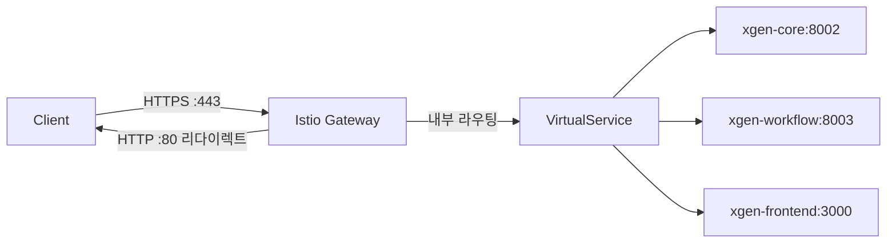
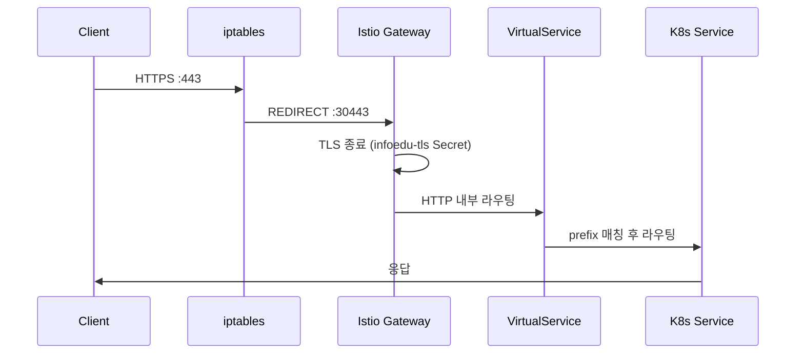

## 배경

cert-manager로 Let's Encrypt 인증서를 발급받았다면, 이제 Istio Gateway에 TLS를 연결할 차례다. Istio Gateway는 Kubernetes의 Ingress보다 훨씬 유연한 트래픽 제어가 가능하지만, TLS 설정이 직관적이지 않아 삽질이 많았다.

## Gateway 리소스 구조

Istio의 트래픽 흐름은 `Gateway → VirtualService → Service → Pod` 순서다.



Gateway는 외부 트래픽의 진입점이고, VirtualService는 Host/Path 기반 라우팅 규칙이다.

## Gateway HTTPS 설정

```yaml
# gateway.yaml
# # 커밋: Istio Gateway HTTPS 서버 설정 추가 (TLS credentialName)
# # 날짜: 2024-08-15
apiVersion: networking.istio.io/v1beta1
kind: Gateway
metadata:
  name: xgen-gateway
  namespace: istio-system
spec:
  selector:
    istio: ingressgateway
  servers:
  - port:
      number: 443
      name: https
      protocol: HTTPS
    tls:
      mode: SIMPLE
      credentialName: infoedu-tls
    hosts:
    - "xgen.infoedu.co.kr"
    - "api.infoedu.co.kr"
    - "infoedu.co.kr"
  - port:
      number: 80
      name: http
      protocol: HTTP
    hosts:
    - "*"
    tls:
      httpsRedirect: true
```

핵심 설정은 두 가지다.

**`credentialName: infoedu-tls`**: cert-manager가 `istio-system` 네임스페이스에 생성한 Secret 이름이다. Istio IngressGateway는 이 Secret에서 TLS 키/인증서를 자동으로 읽는다. Istio가 Secret을 감시하다가 인증서가 갱신되면 자동으로 새 인증서를 적용한다 — 재시작 없이.

**`httpsRedirect: true`**: 80번 포트로 들어오는 모든 요청을 301 redirect로 443으로 보낸다.

## TLS 모드

Istio Gateway의 `tls.mode`는 여러 값을 지원한다.

| 모드 | 설명 |
|------|------|
| SIMPLE | Gateway가 TLS 종료. 내부는 평문 HTTP |
| PASSTHROUGH | TLS를 그대로 통과시켜 백엔드가 처리 |
| MUTUAL | mTLS (클라이언트 인증서도 요구) |
| AUTO_PASSTHROUGH | SNI 기반 자동 패스스루 |

XGEN 2.0에서는 `SIMPLE`을 사용했다. Gateway에서 TLS를 종료하면 내부 서비스 간 통신은 HTTP로 단순하게 유지할 수 있다.

## VirtualService 라우팅

```yaml
# virtualservice.yaml
# # 커밋: xgen VirtualService 경로별 서비스 라우팅 설정
# # 날짜: 2024-08-16
apiVersion: networking.istio.io/v1beta1
kind: VirtualService
metadata:
  name: xgen-vs
  namespace: xgen
spec:
  hosts:
  - "xgen.infoedu.co.kr"
  gateways:
  - istio-system/xgen-gateway
  http:
  - match:
    - uri:
        prefix: "/api/"
    route:
    - destination:
        host: xgen-core
        port:
          number: 8002
  - match:
    - uri:
        prefix: "/workflow/"
    route:
    - destination:
        host: xgen-workflow
        port:
          number: 8003
  - match:
    - uri:
        prefix: "/"
    route:
    - destination:
        host: xgen-frontend
        port:
          number: 3000
```

`gateways: istio-system/xgen-gateway`처럼 네임스페이스/이름 형태로 Gateway를 참조한다.

## 삽질: credentialName 네임스페이스 문제

가장 오래 걸린 문제다. cert-manager로 인증서를 처음 발급할 때 `namespace: xgen`으로 Certificate를 생성했다. Secret도 `xgen` 네임스페이스에 만들어졌다.

Istio Gateway의 `credentialName`은 `istio-system` 네임스페이스의 Secret만 참조할 수 있다. 다른 네임스페이스의 Secret은 인식하지 못한다.

```bash
# 에러 메시지
# Fetching secret infoedu-tls failed: secret not found
# (secret이 xgen 네임스페이스에 있어서 istio-system에서 못 찾음)
```

해결책은 Certificate 리소스를 `istio-system` 네임스페이스에 생성하는 것이다.

```yaml
# # 커밋: Certificate 네임스페이스를 istio-system으로 이동
# # 날짜: 2024-08-14
apiVersion: cert-manager.io/v1
kind: Certificate
metadata:
  name: infoedu-tls
  namespace: istio-system  # 반드시 istio-system
spec:
  secretName: infoedu-tls
  # ...
```

이후 Istio Gateway가 `infoedu-tls` Secret을 정상 인식했다.

## 삽질: HTTP→HTTPS 리다이렉트 루프

`httpsRedirect: true` 설정 후 일부 클라이언트에서 리다이렉트 루프가 발생했다. 원인은 iptables 설정과 Istio의 이중 처리였다.

```
클라이언트 → :80 → iptables → :30080 (Istio HTTP 포트)
Istio → 301 redirect to https://
클라이언트 → :443 → iptables → :30443 (Istio HTTPS 포트)
정상 처리
```

이 흐름은 맞다. 그런데 리버스 프록시(nginx)를 앞에 두고 `X-Forwarded-Proto: http`가 전달될 경우 Istio가 이를 HTTP 요청으로 판단해 다시 리다이렉트하는 루프가 생길 수 있다.

XGEN 2.0에서는 nginx 프록시 없이 iptables → Istio 직접 연결이라 이 문제는 없었지만, 프록시를 사이에 끼울 때는 `X-Forwarded-Proto` 헤더를 올바르게 설정해야 한다.

## 삽질: Istio IngressGateway SDS 동기화 지연

cert-manager가 인증서를 발급해도 Istio가 즉시 적용하지 않는 경우가 있다. Istio는 SDS(Secret Discovery Service)를 통해 인증서를 동적으로 로드하는데, 초기 발급 시 SDS 동기화에 몇 초에서 수십 초 지연이 있을 수 있다.

```bash
# Istio IngressGateway 로그에서 SDS 상태 확인
kubectl logs -n istio-system \
    $(kubectl get pods -n istio-system -l app=istio-ingressgateway -o name) \
    | grep -i "sds\|credential\|tls"
```

`credential infoedu-tls successfully fetched` 로그가 나오면 정상이다. 이 로그가 없으면 Certificate/Secret 상태를 다시 확인해야 한다.

## 인증서 자동 갱신 확인

Istio + cert-manager 조합의 가장 큰 장점은 갱신 시 무중단이라는 점이다.

cert-manager가 새 인증서를 발급해 Secret을 업데이트하면, Istio IngressGateway의 SDS가 변경을 감지하고 자동으로 새 인증서를 로드한다. Gateway Pod 재시작이 불필요하다.

```bash
# 인증서 갱신 이벤트 확인
kubectl get events -n istio-system --field-selector reason=Issued

# 현재 적용된 인증서 만료일 확인 (curl로)
echo | openssl s_client -connect xgen.infoedu.co.kr:443 2>/dev/null \
    | openssl x509 -noout -dates
```

## Istio Gateway 전체 트래픽 흐름



## 결과

- Istio Gateway에서 TLS 종료 성공
- cert-manager Secret 자동 갱신 → Istio SDS 자동 반영 (무중단)
- HTTP→HTTPS 301 리다이렉트 정상 동작
- credentialName은 반드시 `istio-system` 네임스페이스의 Secret을 참조해야 함

Kubernetes에서 TLS를 제대로 이해하려면 cert-manager, Istio Gateway, SDS, Secret 네임스페이스 관계를 모두 파악해야 한다. 이 레이어가 어긋나면 디버깅이 매우 어렵다.
