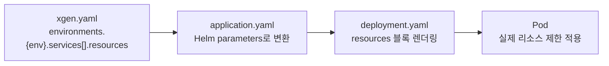

# K3s 리소스 튜닝 실전 가이드 — OOMKilled와 CPU Throttling 해결기

## 개요

Kubernetes에서 리소스 설정은 "한 번 하고 끝"이 아니다. 서비스가 진화하면 워크로드도 변한다. 새 기능이 추가되고, 트래픽 패턴이 바뀌고, 데이터 규모가 커지면서 초기에 잡아둔 리소스 설정이 맞지 않게 된다.

XGEN 플랫폼은 6개의 마이크로서비스로 구성된 AI Agent 플랫폼이다. K3s 위에서 운영하며, Helm chart로 배포하고, ArgoCD로 GitOps 관리한다. 2월 넷째 주, 3일 동안 집중적으로 리소스 튜닝을 진행했다. 그 과정에서 OOMKilled, CPU throttling, 과할당 낭비를 모두 경험했고, 서비스별 최적 프로파일을 찾아갔다.

이 글에서는 이론이 아닌 **실전 튜닝 과정**을 다룬다. 어떤 증상이 나타났고, 어떤 숫자를 어떻게 바꿨고, 그 결과가 어땠는지를 구체적으로 정리한다.

---

## 배경: 리소스 설정이 적용되는 구조

XGEN 인프라에서 리소스 설정은 단일 파일 `xgen.yaml`에서 모든 환경의 서비스별 리소스를 선언하고, ArgoCD Application 템플릿이 이를 Helm 파라미터로 주입하는 구조다.



`xgen.yaml`에서 서비스별 리소스를 이렇게 정의한다.

```yaml
environments:
  prd:
    services:
      - name: xgen-core
        resources:
          requests:
            memory: "1Gi"
            cpu: "200m"
          limits:
            memory: "4Gi"
            cpu: "1000m"
```

이 값이 ArgoCD를 통해 Helm 파라미터로 넘어가고, deployment 템플릿의 `resources` 블록에 렌더링된다. 환경(prd/dev)별로 다른 값을 쓸 수 있고, 명시하지 않으면 Helm chart의 기본값(256Mi/100m, 1Gi/500m)이 적용된다.

---

## requests vs limits: 빠른 복습

튜닝 과정을 이해하려면 requests와 limits의 차이를 명확히 알아야 한다.

- **requests**: 스케줄러가 Pod를 노드에 배치할 때 "이만큼은 보장해줘"라는 예약값이다. requests 합산이 노드 용량을 초과하면 Pod가 Pending 상태로 남는다.
- **limits**: 컨테이너가 실제로 사용할 수 있는 상한값이다. 메모리가 limits를 초과하면 **OOMKilled**, CPU가 limits를 초과하면 **throttling**이 발생한다.

| | requests 부족 | limits 부족 |
|---|---|---|
| **메모리** | 다른 Pod에 밀려서 eviction | OOMKilled (강제 종료) |
| **CPU** | 경합 시 CPU 시간 부족 | throttling (강제 감속) |

메모리는 비압축성(incompressible) 리소스다. 초과하면 프로세스를 죽이는 것 외에 방법이 없다. CPU는 압축성(compressible) 리소스라 초과해도 속도가 느려질 뿐 죽지는 않는다. 하지만 throttling이 걸리면 API 응답 시간이 수 배로 늘어나서 사실상 장애와 다름없다.

---

## 서비스 프로파일 분류

튜닝 전에 먼저 6개 서비스의 워크로드 특성을 분류했다. 서비스마다 리소스 사용 패턴이 완전히 다르기 때문이다.

### 경량 서비스: 안정적이고 예측 가능

**xgen-frontend** (Next.js): SSR 렌더링. 메모리 사용량이 200~400Mi로 안정적이다. CPU도 요청 처리 시에만 잠깐 쓰고 유휴 시간이 길다.

**xgen-backend-gateway** (Rust): API 라우팅 + JWT 검증. Rust 특유의 극단적 메모리 효율로 3~4Mi만 사용한다. CPU도 미미하다. 사실상 리소스를 거의 먹지 않는다.

**xgen-mcp-station** (Python): MCP 프로토콜 중계. 연결 유지 위주라 메모리/CPU 모두 낮다.

### 중량 서비스: 변동폭이 크고 예측 어려움

**xgen-core** (Python/FastAPI): 인증 관리, 설정 관리, DB/Redis 접근. 평상시 300~500Mi지만, 인증 프로필 처리나 대량 설정 로드 시 일시적으로 1~2Gi까지 올라간다.

**xgen-workflow** (Python/FastAPI): AI 워크플로우 실행 엔진. 워크플로우 복잡도에 따라 메모리 사용량이 1.8~3.2Gi로 크게 변동한다. CPU도 임베딩 처리, 도구 호출 병렬 실행 시 높은 부하가 걸린다.

**xgen-documents** (Python/FastAPI): 문서 업로드, 파싱, 청킹, 임베딩. 대량 문서 업로드 시 메모리가 급격히 치솟는다. PDF 파싱과 텍스트 청킹이 메모리 집약적이고, 임베딩 배치 처리가 CPU 집약적이다.

### 별도 관리

**xgen-model** (Python): LLM/임베딩 모델 서빙. GPU를 사용하며 메모리 요구량이 8~24Gi로 다른 서비스와 차원이 다르다. HPA 대상이 아니고 단일 Pod로 운영한다.

이 분류가 리소스 설정의 기준이 된다. 경량 서비스는 작게, 중량 서비스는 크게 — 이 단순한 원칙이지만, 구체적인 숫자를 찾는 것은 쉽지 않았다.

---

## 튜닝 타임라인: 3일간의 기록

### Day 1 (2/24): dev 환경에서 문제 발견

#### xgen-documents 대량 문서 업로드 타임아웃

dev 환경에서 100개 이상의 문서를 한 번에 업로드하면 타임아웃이 발생했다. Pod 로그에는 별다른 에러가 없었지만, `kubectl top pods`로 확인하니 메모리 사용량이 급격히 올라가면서 처리 속도가 크게 떨어지고 있었다.

당시 dev 환경 xgen-documents의 리소스 설정은 이랬다.

```yaml
# 변경 전
resources:
  requests:
    memory: "1Gi"
    cpu: "100m"
  limits:
    memory: "4Gi"
    cpu: "500m"
```

requests.memory 1Gi는 스케줄러에게 "1Gi만 예약해줘"라는 의미다. 하지만 실제 대량 문서 처리 시 메모리가 3~4Gi까지 올라가니, 노드의 다른 Pod들과 메모리 경합이 발생한 것이다.

1차 수정에서 2Gi로 올렸지만 여전히 부족했다. 결국 4Gi까지 올리고, limits도 8Gi로, CPU도 함께 상향했다.

```yaml
# 1차 수정 (2Gi) → 2차 수정 (최종)
resources:
  requests:
    memory: "4Gi"
    cpu: "200m"
  limits:
    memory: "8Gi"
    cpu: "1000m"
```

#### xgen-workflow도 동일 스펙으로 상향

xgen-workflow도 워크플로우 실행 시 documents와 비슷한 수준의 메모리를 사용한다. 내부적으로 문서 파이프라인을 호출하고, 검색 결과를 메모리에 캐싱하기 때문이다. 같은 스펙으로 맞췄다.

#### xgen-frontend 리소스 설정 누락 발견

dev 환경의 xgen-frontend에는 리소스 설정이 아예 없었다. Helm chart 기본값(256Mi/100m)이 적용되고 있었는데, Next.js SSR이 실제로 300~400Mi를 사용하니 request보다 많이 쓰고 있었다. 당장 문제는 없지만, 노드 리소스가 부족해지면 먼저 eviction 대상이 될 수 있었다. 512Mi로 명시적으로 설정했다.

### Day 2 (2/26): prd 전면 튜닝

dev에서의 경험을 바탕으로 prd 환경을 전면 재조정했다. 이번에는 Grafana 모니터링 데이터를 기반으로 했다.

#### 모니터링 기반 의사결정

`kubectl top pods`와 Grafana의 컨테이너 메트릭을 2주간 관찰한 결과를 정리했다.

| 서비스 | 실 사용 메모리 | 실 사용 CPU | 기존 requests | 기존 limits |
|---|---|---|---|---|
| xgen-frontend | 200~400Mi | 50~200m | 512Mi / 200m | 2Gi / 1000m |
| xgen-backend-gateway | 3~4Mi | 10~50m | 512Mi / 200m | 2Gi / 1000m |
| xgen-core | 300~1.5Gi | 100~400m | 512Mi / 200m | 4Gi / 1000m |
| xgen-workflow | 1.8~3.2Gi | 200~800m | 1Gi / 200m | 8Gi / 1000m |
| xgen-documents | 500Mi~4Gi | 300~1500m | 1Gi / 500m | 16Gi / 4000m |
| xgen-mcp-station | 100~200Mi | 30~100m | 512Mi / 200m | 2Gi / 1000m |

문제가 바로 보인다.

- **frontend, gateway, mcp-station**: requests가 실 사용량보다 크다. 과할당이다. 특히 gateway는 requests 512Mi인데 실제 4Mi밖에 안 쓴다. 128배 과할당.
- **workflow**: requests 1Gi인데 실제 1.8~3.2Gi를 쓴다. 심각한 과소설정.
- **documents**: limits 16Gi인데 피크 4Gi를 넘지 않는다. limits 과할당. 반면 requests 1Gi는 부족.

#### 튜닝 원칙

이 데이터를 기반으로 다음 원칙을 세웠다.

1. **requests는 평균 사용량의 80~100%로 설정한다.** 스케줄러가 현실적인 용량 계획을 할 수 있도록.
2. **limits는 피크 사용량의 1.5~2배로 설정한다.** 일시적 스파이크를 허용하되, 무한정 쓰지 못하게.
3. **경량 서비스는 과감하게 줄인다.** 어차피 300Mi도 안 쓰는 서비스에 2Gi limits는 낭비다.
4. **중량 서비스는 requests를 충분히 확보한다.** 스케줄러에게 거짓말하면 결국 경합과 eviction으로 돌아온다.

#### 변경 내역

```yaml
# 경량 서비스 (frontend, gateway, mcp-station): 일괄 하향
resources:
  requests:
    memory: "256Mi"    # 512Mi → 256Mi
    cpu: "100m"        # 200m → 100m
  limits:
    memory: "1Gi"      # 2Gi → 1Gi
    cpu: "500m"        # 1000m → 500m
```

```yaml
# xgen-core: limits만 하향
resources:
  requests:
    memory: "512Mi"    # 유지
    cpu: "200m"        # 유지
  limits:
    memory: "2Gi"      # 4Gi → 2Gi (실 피크 1.5Gi 기준)
    cpu: "1000m"       # 유지
```

```yaml
# xgen-workflow: requests 대폭 상향
resources:
  requests:
    memory: "4Gi"      # 1Gi → 4Gi
    cpu: "200m"        # 유지
  limits:
    memory: "8Gi"      # 유지
    cpu: "1000m"       # 유지
```

```yaml
# xgen-documents: requests 상향 + limits 하향
resources:
  requests:
    memory: "4Gi"      # 1Gi → 4Gi
    cpu: "500m"        # 유지
  limits:
    memory: "8Gi"      # 16Gi → 8Gi
    cpu: "2000m"       # 4000m → 2000m
```

경량 서비스 3개를 줄이고 중량 서비스 2개를 올렸으니, 클러스터 전체 예약량은 비슷하면서도 실제 필요한 곳에 리소스가 배분되었다.

### Day 3 (2/27): prd에서 역풍을 맞다

Day 2의 튜닝을 적용하고 하루가 지났다. 두 가지 문제가 터졌다.

#### OOMKilled: xgen-core

아침에 알림이 왔다. xgen-core Pod가 OOMKilled로 재시작된 것이다.

```
kubectl describe pod xgen-core-xxx
...
Last State:  Terminated
  Reason:    OOMKilled
  Exit Code: 137
```

원인은 Day 2에서 xgen-core의 limits.memory를 4Gi에서 2Gi로 줄인 것이다. 평소 피크가 1.5Gi라서 2Gi면 충분할 거라 판단했지만, 인증 프로필 일괄 갱신 + 대량 설정 로드가 동시에 발생하면 2Gi를 초과하는 경우가 있었다.

```yaml
# Day 2에서 2Gi로 줄였다가 → Day 3에서 다시 복구
resources:
  requests:
    memory: "1Gi"      # 512Mi → 1Gi (상향)
  limits:
    memory: "4Gi"      # 2Gi → 4Gi (원복)
```

requests도 512Mi에서 1Gi로 올렸다. OOMKilled가 발생했다는 것은 평소에도 메모리를 상당히 쓰고 있다는 의미이므로, 스케줄러에게 더 많은 예약을 요청하는 게 맞다.

**교훈**: limits를 줄일 때는 **일반적인 피크**가 아니라 **최대 피크**를 기준으로 해야 한다. Grafana 2주 데이터에서 최대값이 1.5Gi였지만, 특정 조합의 워크로드에서는 그 이상이 될 수 있었다. 관찰 기간이 짧으면 극단값을 놓칠 수 있다.

#### CPU Throttling: xgen-workflow, xgen-documents

OOMKilled를 수정하고 나니, 이번에는 workflow와 documents에서 워크플로우 실행과 문서 처리 속도가 눈에 띄게 느려진 것이 보고되었다.

Pod 내부에서 확인해보니 CPU throttling이 걸리고 있었다.

```bash
# 컨테이너 cgroup에서 throttling 확인
kubectl exec -it xgen-workflow-xxx -- cat /sys/fs/cgroup/cpu/cpu.stat
# nr_throttled 15234  ← throttling 발생 횟수
# throttled_time 892341000  ← 총 throttling 시간 (ns)
```

limits.cpu가 1000m(1코어)인데, 임베딩 처리나 워크플로우 병렬 실행 시 1코어 이상을 사용하려 하니 throttling이 걸린 것이다. Day 2에서 CPU limits를 건드리지 않았지만, 서비스 기능이 추가되면서 CPU 요구량이 올라간 상태였다.

```yaml
# workflow + documents 모두 동일하게 적용
resources:
  requests:
    cpu: "500m"        # 200m → 500m
  limits:
    cpu: "2000m"       # 1000m → 2000m
```

CPU를 2배로 올렸더니 throttling이 사라지고 처리 속도가 정상으로 돌아왔다.

---

## 최종 리소스 설정

3일간의 튜닝을 거친 최종 설정이다.

### PRD 환경

| 서비스 | requests | limits | HPA | 특성 |
|---|---|---|---|---|
| **xgen-frontend** | 256Mi / 100m | 1Gi / 500m | 2-4 | 경량, SSR |
| **xgen-backend-gateway** | 256Mi / 100m | 1Gi / 500m | 2-4 | 극경량, Rust |
| **xgen-core** | 1Gi / 200m | 4Gi / 1000m | 2-4 | 중량, 변동폭 큼 |
| **xgen-workflow** | 4Gi / 500m | 8Gi / 2000m | 2-4 | 중량, CPU 집약 |
| **xgen-documents** | 4Gi / 500m | 8Gi / 2000m | 2-4 | 중량, 메모리 스파이크 |
| **xgen-mcp-station** | 256Mi / 100m | 1Gi / 500m | 2-4 | 경량 |
| **xgen-model** | 8Gi / 2000m | 24Gi / 8000m | 1 (고정) | GPU, 특수 |

### DEV 환경

| 서비스 | requests | limits | HPA |
|---|---|---|---|
| **xgen-frontend** | 512Mi / 100m | 1Gi / 500m | 1-4 |
| **xgen-backend-gateway** | 256Mi / 100m | 1Gi / 500m | 1-4 |
| **xgen-core** | 1Gi / 100m | 4Gi / 500m | 1-4 |
| **xgen-workflow** | 4Gi / 500m | 8Gi / 2000m | 1-6 |
| **xgen-documents** | 4Gi / 500m | 8Gi / 2000m | 1-6 |
| **xgen-mcp-station** | 256Mi / 100m | 1Gi / 500m | 1-4 |

dev 환경은 prd와 거의 동일한 리소스를 할당하되, replicas 최소값이 1이다. 리소스 설정 자체를 다르게 하면 dev에서는 잘 되다가 prd에서 터지는 일이 생긴다. "dev에서 재현 안 됨"이라는 최악의 상황을 방지하기 위해 리소스 스펙은 가급적 맞춘다.

dev에서 다른 점은 workflow와 documents의 maxReplicas를 6으로 올린 것이다. 개발 중 대량 데이터 테스트가 빈번하기 때문이다.

---

## 튜닝에서 배운 것들

### 1. requests/limits 비율 패턴

튜닝 결과를 보면 서비스 유형별로 requests/limits 비율 패턴이 나온다.

**경량 서비스** (frontend, gateway, mcp-station):
- 메모리 requests:limits = 1:4 (256Mi:1Gi)
- 실 사용량이 안정적이어서 limits에 도달할 일이 거의 없다
- 넉넉하게 잡아도 실제로 쓰지 않으니 낭비가 적다

**중량 서비스** (workflow, documents):
- 메모리 requests:limits = 1:2 (4Gi:8Gi)
- requests를 높게 잡아서 스케줄러에게 충분한 예약을 요청한다
- limits가 requests의 2배니까 버스트 여유가 있지만, 무한정은 아니다

**변동 서비스** (core):
- 메모리 requests:limits = 1:4 (1Gi:4Gi)
- 평소에는 경량이지만 간헐적으로 치솟으므로 limits를 넉넉하게 유지한다

### 2. 과할당은 보이지 않는 비용이다

xgen-backend-gateway의 requests가 512Mi였을 때 무슨 일이 벌어지는지 생각해보자. Rust로 작성되어 실제로 4Mi만 사용하는데, 스케줄러는 "이 Pod에 512Mi를 예약해야 한다"고 판단한다. 2개 replicas면 1Gi가 예약되지만 실제 사용은 8Mi다. 나머지 1016Mi는 다른 Pod가 쓸 수 있었던 메모리다.

작은 클러스터에서는 이 과할당이 누적되면 "노드 용량이 부족하다"는 착각을 하게 된다. 실제로는 메모리가 남아도는데 requests 합산이 노드 용량을 초과해서 새 Pod가 Pending 상태로 남는다.

### 3. limits 하향은 신중하게

Day 2에서 xgen-core의 limits를 4Gi에서 2Gi로 줄였다가 Day 3에 OOMKilled가 발생했다. 2주간의 모니터링 데이터를 봤지만, 특정 워크로드 조합에서 발생하는 극단값을 놓쳤다.

limits를 줄이는 것은 **안전장치를 줄이는 것**이다. requests를 줄이는 것(스케줄러 예약량 조정)과는 질적으로 다르다. requests를 줄이면 최악의 경우 경합이 생기지만, limits를 줄이면 최악의 경우 **Pod가 죽는다**.

권장하는 접근:
- **requests 조정은 적극적으로**: 실 사용량 기반으로 과감하게 줄여도 된다
- **limits 하향은 보수적으로**: 관찰된 최대값에 최소 2배 여유를 두자
- **limits 상향은 필요할 때만**: 무한정 올리면 한 Pod가 노드 전체 리소스를 독점할 수 있다

### 4. 점진적 튜닝이 답이다

이번 튜닝의 타임라인을 보면 패턴이 있다.

```
Day 1: dev에서 개별 서비스 문제 발견 → 해당 서비스만 조정
Day 2: dev 경험 + 모니터링 데이터 기반으로 prd 전면 튜닝
Day 3: prd에서 역풍 → 문제가 된 서비스만 재조정
```

한 번에 완벽한 설정을 찾으려 하지 않았다. dev에서 먼저 실험하고, prd에 적용하고, 문제가 생기면 빠르게 수정했다. GitOps 환경에서는 `xgen.yaml` 한 줄 바꾸고 push하면 ArgoCD가 자동으로 적용하므로 이런 반복 튜닝이 쉽다.

### 5. CPU throttling은 OOMKilled보다 발견이 늦다

OOMKilled는 Pod가 재시작되니까 알림이 바로 온다. 하지만 CPU throttling은 Pod가 살아 있으면서 느려지기만 한다. "요즘 좀 느린 것 같은데?"라는 체감이 돼서야 발견되는 경우가 많다.

CPU throttling을 확인하는 방법:

```bash
# 방법 1: cgroup 직접 확인
kubectl exec -it {pod} -- cat /sys/fs/cgroup/cpu/cpu.stat
# nr_throttled: throttling 발생 횟수
# throttled_time: 총 throttling 시간 (나노초)

# 방법 2: Prometheus 메트릭
# container_cpu_cfs_throttled_periods_total
# container_cpu_cfs_throttled_seconds_total
```

`nr_throttled` 값이 계속 증가하고 있으면 CPU limits가 부족한 것이다. 이 메트릭을 Grafana 대시보드에 추가해두면 throttling을 조기에 발견할 수 있다.

---

## QoS Class와 eviction 우선순위

리소스 설정은 Kubernetes의 QoS(Quality of Service) Class에도 영향을 미친다.

| QoS Class | 조건 | eviction 우선순위 |
|---|---|---|
| **Guaranteed** | 모든 컨테이너에서 requests = limits | 가장 마지막에 제거 |
| **Burstable** | requests < limits | 중간 |
| **BestEffort** | requests도 limits도 없음 | 가장 먼저 제거 |

XGEN 서비스들은 전부 requests < limits이므로 **Burstable** Class다. 이것은 의도적인 선택이다.

Guaranteed로 만들려면 requests = limits로 설정해야 하는데, 그러면 버스트(일시적 초과 사용)가 불가능하다. xgen-workflow가 평소 2Gi를 쓰다가 복잡한 워크플로우에서 6Gi까지 올라가야 할 때, Guaranteed라면 2Gi에서 OOMKilled가 난다.

Burstable은 평소에는 requests만큼만 보장받고, 여유가 있으면 limits까지 쓸 수 있다. 변동폭이 큰 AI 워크로드에서는 이 유연성이 필요하다.

---

## 노드 용량 계획

마지막으로, 서비스별 리소스 설정이 노드 수준에서 어떻게 합산되는지 확인해야 한다.

### prd 환경 requests 합산 (최소 replicas 기준)

```
xgen-frontend     × 2 =   512Mi /  200m
xgen-gateway      × 2 =   512Mi /  200m
xgen-core         × 2 =     2Gi /  400m
xgen-workflow     × 2 =     8Gi / 1000m
xgen-documents    × 2 =     8Gi / 1000m
xgen-mcp-station  × 2 =   512Mi /  200m
xgen-model        × 1 =     8Gi / 2000m
─────────────────────────────────────────
합계                   ≈  27.5Gi / 5000m
```

27.5Gi 메모리와 5코어가 최소 예약량이다. 여기에 K3s 시스템 컴포넌트(kubelet, kube-proxy, containerd), Istio sidecar, ArgoCD, 모니터링 스택 등의 오버헤드를 고려하면 최소 40Gi 이상의 메모리를 가진 노드가 필요하다.

HPA가 최대 replicas까지 스케일아웃하면 이 숫자가 늘어난다. 최대 시나리오까지 계산해서 노드 용량에 여유가 있는지 확인하는 것이 중요하다. 노드 메모리가 부족하면 Pod가 Pending 상태로 남고, HPA가 아무리 스케일아웃하려 해도 실제로 Pod를 띄울 수 없다.

---

## 결과 및 회고

3일간의 튜닝 결과를 요약하면:

**해결된 문제**:
- xgen-documents 대량 업로드 타임아웃 해결 (메모리 1Gi → 4Gi)
- xgen-core OOMKilled 해결 (limits 2Gi → 4Gi 복구)
- xgen-workflow, xgen-documents CPU throttling 해결 (CPU 1000m → 2000m)
- 경량 서비스 과할당 제거 (gateway requests 512Mi → 256Mi)

**핵심 교훈**:
- 모니터링 데이터 없이 리소스 설정하면 과할당 아니면 부족, 둘 중 하나다
- limits 하향은 OOMKilled 위험이 있으니 보수적으로 접근해야 한다
- CPU throttling은 Pod가 살아 있어서 발견이 늦다. cgroup 메트릭을 모니터링에 포함시키자
- dev와 prd의 리소스 스펙은 가급적 일치시키자. "dev에서 재현 안 됨"을 예방한다

리소스 튜닝은 일회성 작업이 아니다. 서비스에 기능이 추가되고, 데이터 규모가 커지고, 트래픽 패턴이 바뀔 때마다 다시 확인해야 한다. 다만, 이번에 서비스별 프로파일과 튜닝 원칙을 정립해뒀으니 다음번에는 훨씬 빠르게 대응할 수 있을 것이다.
