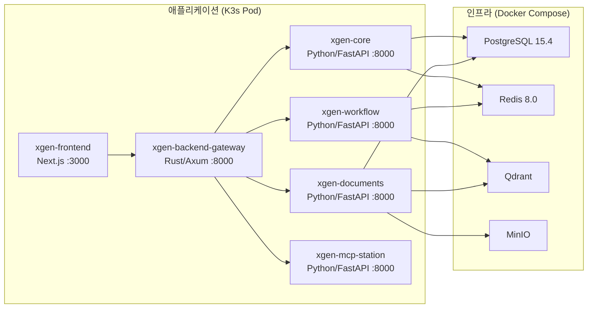
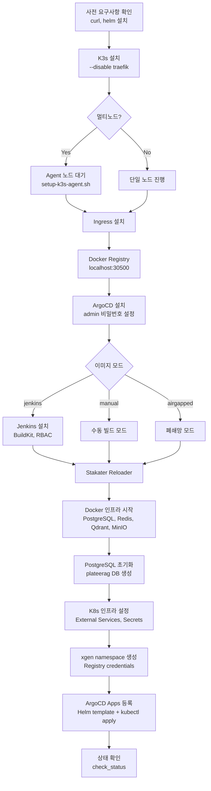

# K3s 위에 AI 플랫폼 올리기: 인프라 설계부터 배포까지

> 2025.12 ~ 2026.02 | K3s, Helm, ArgoCD, Docker Compose, Jenkins, Istio

## 개요

XGEN 2.0은 LLM 서빙, 워크플로우 엔진, 문서 처리, 브라우저 자동화 등 6개 마이크로서비스로 구성된 AI 플랫폼이다. 초기에는 Docker Compose 하나로 모든 서비스를 관리했지만, 서비스가 늘어나면서 한계가 뚜렷해졌다.

- 서비스 하나가 OOM으로 죽으면 수동으로 재시작해야 한다
- 스케일링이 불가능하다 (문서 임베딩 처리 시 CPU 100%가 지속)
- 설정 변경 시 전체 스택을 내렸다 올려야 한다
- 롯데홈쇼핑 같은 고객사 폐쇄망에는 배포 방법 자체가 없다

이 글은 Docker Compose 단일 서버 운영에서 K3s 클러스터 + Helm + ArgoCD 기반 GitOps 운영으로 전환한 전체 과정을 다룬다. 기존에 작성한 [XGEN 2.0 인프라: K8s + ArgoCD 운영 배포](./XGEN-2.0-인프라-K8s-ArgoCD-운영-배포.md)가 모니터링과 CI/CD 파이프라인에 초점을 맞췄다면, 이 글은 인프라 아키텍처 설계 자체 — 디렉토리 구조, Helm 차트 설계, 인프라/앱 분리 전략, 자동화 스크립트 — 에 집중한다.

## 아키텍처 전체 그림

### 서비스 구성

XGEN 2.0은 6개의 애플리케이션 서비스와 4개의 인프라 서비스로 구성된다.



핵심 설계 결정: **애플리케이션은 K3s에, 인프라 서비스는 Docker Compose에 남겨둔다.** PostgreSQL, Redis, Qdrant, MinIO 같은 스테이트풀 서비스를 K8s 위에 올리면 PV 관리, 백업, 장애 복구가 복잡해진다. 단일 서버에서 운영하는 현실을 고려해 인프라는 Docker Compose로 유지하고, K3s의 External Service로 연결하는 하이브리드 구조를 선택했다.

### 배포 모드 3가지

개발, 테스트, 운영 환경별로 다른 배포 모드를 지원한다.

| 모드 | 인프라 | 앱 | 용도 |
|------|--------|-----|------|
| 개발 모드 | Docker Compose | Docker Compose (hot-reload) | 로컬 개발 |
| 빌드 모드 | Docker Compose | Docker Compose (이미지 빌드) | 통합 테스트 |
| K3s 모드 | Docker Compose | K3s Pod (Helm + ArgoCD) | 운영 배포 |

## 디렉토리 구조 설계

인프라 코드를 어떻게 정리하느냐가 유지보수성을 좌우한다. 초기에는 `docker/infra`, `docker/deploy` 같은 모호한 이름을 썼다가 혼란이 생겨서, 2026-01-17에 전면 재편성했다.

```
# 커밋: 디렉토리명 변경: infra→infra-only, deploy→full-stack (직관성 개선)
# 날짜: 2026-01-17 19:17
```

최종적으로 2026-02-09에 확정된 구조:

```
xgen-infra/
├── dockerfiles/                    # Dockerfile (모든 서비스 공용)
│   ├── xgen-python/               # Python 서비스 공용 (core, workflow, documents)
│   │   ├── Dockerfile             # 표준 빌드
│   │   ├── Dockerfile.git         # GitLab clone 빌드 (Jenkins용)
│   │   └── Dockerfile.local       # 로컬 소스 빌드 (개발용)
│   ├── xgen-frontend/             # Next.js 프론트엔드
│   ├── xgen-backend-gateway/      # Rust API Gateway
│   └── xgen-mcp-station/          # MCP 브라우저 자동화
│
├── compose/                        # Docker Compose 배포
│   ├── full-stack/                 # 전체 스택 (인프라 + 앱 6개)
│   │   ├── docker-compose.yml     # 빌드 모드
│   │   ├── docker-compose.dev.yml # 개발 모드 (hot-reload)
│   │   └── .env.dev / .env.prod
│   └── k3s-infra/                  # K3s용 인프라 전용
│       └── docker-compose.yml     # PostgreSQL, Redis, Qdrant, MinIO
│
├── k3s/                            # Kubernetes 운영 배포
│   ├── helm-chart/                 # 범용 Helm Chart (모든 서비스 공용)
│   │   ├── values.yaml            # 전역 기본값
│   │   └── values/                # 서비스별 오버라이드
│   ├── argocd/                     # ArgoCD App of Apps
│   │   └── projects/              # 프로젝트별 서비스 목록
│   ├── jenkins/                    # Jenkins 빌드 파이프라인
│   ├── observability/              # Prometheus, Grafana, Loki, Tempo
│   └── scripts/                    # 설치 자동화 스크립트
│       ├── setup-k3s.sh           # 원클릭 설치
│       ├── init-config.sh         # 환경 초기화
│       └── setup-k3s-agent.sh     # 멀티노드 Agent 추가
│
└── istio-install/                  # Istio 설치 파일
```

```
# 커밋: refactor: 디렉토리 구조 재편성 (dockerfiles/compose/k3s 분리)
# 날짜: 2026-02-09 02:30
```

이 구조의 핵심 원칙:

- **관심사 분리**: Dockerfile, Compose, K8s 매니페스트가 각각 독립 디렉토리
- **Dockerfile 재사용**: `xgen-python/Dockerfile` 하나로 core, workflow, documents, mcp-station 네 서비스를 빌드
- **환경별 분기**: compose/full-stack(개발/테스트)과 compose/k3s-infra(운영) 명확히 구분

## Docker Compose에서 K3s로: 전환 과정

### XGEN 1.0: Docker Compose 시대

XGEN 1.0(프로젝트 ID 813)은 순수 Docker Compose 기반이었다. 서비스가 추가될 때마다 docker-compose.yaml에 블록 하나를 붙이는 방식이었다.

```
# 커밋: feat: Add Data Processor Service to Docker configuration
# 날짜: 2025-10-31 13:54

# 커밋: feat: Add vLLM Ray Serve Service to Docker configuration
# 날짜: 2025-11-04 15:01

# 커밋: refactor: Replace vLLM Ray Serve with FastAPI Service
# 날짜: 2025-11-05 09:08
```

서비스가 10개를 넘어가면서 문제가 생겼다. `docker compose up -d`로 전체를 올리면 의존성 순서 문제, 메모리 경합, 로그 혼재가 일어났다. 특히 문서 임베딩이나 LLM 서빙처럼 무거운 서비스가 다른 서비스의 메모리를 잡아먹는 상황이 반복되었다.

### XGEN 2.0: K3s 전환 결정

2026-01-13, XGEN 2.0 인프라 프로젝트를 새로 생성했다.

```
# 커밋: Initial xgen2.0 infrastructure setup
# 날짜: 2026-01-13 10:12
```

K3s를 선택한 이유는 간단했다.

1. **경량**: 바이너리 하나로 설치 가능. EKS나 full K8s 대비 메모리 오버헤드가 작다
2. **단일 서버 호환**: 노드 1대로도 의미 있는 K8s 환경이 된다
3. **표준 K8s API**: Helm, ArgoCD, Istio 등 에코시스템 그대로 사용 가능
4. **폐쇄망 지원**: 에어갭 설치가 비교적 간단하다

### 인프라/앱 분리: 하이브리드 아키텍처

K3s에 앱만 올리고 인프라(DB, 캐시, 벡터DB)는 Docker Compose로 유지하기로 했다. 이 결정의 근거:

```yaml
# compose/k3s-infra/docker-compose.yml
services:
  postgresql:
    image: postgres:15.4
    container_name: postgresql
    volumes:
      - postgre-data:/var/lib/postgresql/data
      - ./init-scripts:/docker-entrypoint-initdb.d
    ports:
      - "${POSTGRES_PORT}:5432"
    healthcheck:
      test: ["CMD-SHELL", "pg_isready -U ${POSTGRES_USER} -d ${POSTGRES_DB}"]
    restart: unless-stopped

  redis:
    image: redis:8.0-alpine
    command: >
      redis-server
      --requirepass ${REDIS_PASSWORD}
      --appendonly yes
      --maxmemory 2gb
      --maxmemory-policy allkeys-lru
    restart: unless-stopped

  qdrant:
    image: qdrant/qdrant:latest
    ports:
      - "${QDRANT_HTTP_PORT}:6333"
      - "${QDRANT_GRPC_PORT}:6334"
    restart: unless-stopped

  minio:
    image: minio/minio:latest
    command: server /data --console-address ":9001"
    restart: unless-stopped
```

K8s에 Stateful 서비스를 올리면 PersistentVolume 관리, 스냅샷 백업, 장애 시 데이터 마이그레이션 등이 필요하다. 단일 서버 환경에서 이런 복잡도를 감수할 이유가 없었다. Docker Compose로 띄운 인프라를 K3s 내부에서 접근하려면 External Service를 등록하면 된다.

```yaml
# k3s/cluster/k8s/infra/external-services.yaml
apiVersion: v1
kind: Service
metadata:
  name: postgresql
  namespace: xgen-system
spec:
  type: ExternalName
  externalName: host.k3s.internal  # K3s가 호스트를 자동 등록
---
apiVersion: v1
kind: Endpoints
metadata:
  name: postgresql
  namespace: xgen-system
subsets:
  - addresses:
      - ip: __HOST_IP__  # setup-k3s.sh에서 sed로 치환
    ports:
      - port: 5432
```

이렇게 하면 K3s Pod에서 `postgresql.xgen-system.svc.cluster.local:5432`로 접근할 수 있다. 실제 트래픽은 호스트의 Docker 컨테이너로 간다.

## Helm Chart 설계: 범용 서비스 차트

### 하나의 차트로 6개 서비스 배포

서비스마다 별도 Helm Chart를 만들면 유지보수 비용이 기하급수적으로 늘어난다. XGEN의 모든 서비스는 구조가 비슷하다 (HTTP 서버 + ConfigMap + HPA). 그래서 범용 차트 하나를 만들고, 서비스별 values 파일로 차이점만 오버라이드하는 구조를 택했다.

```yaml
# k3s/helm-chart/values.yaml (전역 기본값)
global:
  platform: "xgen-platform"
  registry:
    host: "localhost:30500"
    project: "xgen"
    site: ""
  infra:
    namespace: "xgen-system"
    postgres:
      host: "postgresql.xgen-system.svc.cluster.local"
    redis:
      host: "redis.xgen-system.svc.cluster.local"
    qdrant:
      host: "qdrant.xgen-system.svc.cluster.local"
    minio:
      endpoint: "http://minio.xgen-system.svc.cluster.local:9000"

# 기본 리소스
resources:
  requests:
    memory: "256Mi"
    cpu: "100m"
  limits:
    memory: "1Gi"
    cpu: "500m"

# 기본 오토스케일링
autoscaling:
  enabled: true
  minReplicas: 2
  maxReplicas: 4

# 기본 헬스체크
healthCheck:
  type: http
  path: /health
  livenessProbe:
    initialDelaySeconds: 30
    periodSeconds: 10
    timeoutSeconds: 5
    failureThreshold: 6
```

핵심은 `global.infra` 섹션이다. PostgreSQL, Redis, Qdrant, MinIO 호스트 주소를 전역으로 정의해두면, 서비스별 values에서 중복 선언할 필요가 없다. Helm의 `_helpers.tpl`에서 이 값을 ConfigMap에 자동 주입한다.

### 서비스별 오버라이드

각 서비스는 `values/{서비스명}.yaml`에서 자기 고유 설정만 선언한다.

```yaml
# k3s/helm-chart/values/xgen-documents.yaml
serviceName: xgen-documents

resources:
  requests:
    memory: "2Gi"
    cpu: "500m"
  limits:
    memory: "8Gi"
    cpu: "2000m"

# 문서 임베딩 처리 중 CPU 부하가 높아 health check 타임아웃 발생 가능
healthCheck:
  type: http
  path: /health
  livenessProbe:
    initialDelaySeconds: 60
    periodSeconds: 15
    timeoutSeconds: 10
    failureThreshold: 6

config:
  REDIS_PASSWORD: "redis_secure_password123!"
  CORE_SERVICE_BASE_URL: "http://xgen-core:8000"
  MINIO_DATA_ACCESS_KEY: "minio"
  MINIO_DATA_SECRET_KEY: "minio123"

environments:
  prd:
    resources:
      requests:
        memory: "3Gi"
      limits:
        memory: "8Gi"
    autoscaling:
      enabled: true
      minReplicas: 2
      maxReplicas: 3
```

xgen-documents는 메모리를 8Gi까지 쓸 수 있도록 했다. 문서 임베딩 처리 시 CPU 부하가 높아서 liveness probe가 타임아웃되는 문제가 있었는데, `initialDelaySeconds: 60`, `timeoutSeconds: 10`으로 여유를 줘서 불필요한 Pod 재시작을 방지했다.

```
# 커밋: xgen-documents: 메모리 8Gi로 증가, HPA 추가 (1-4 replicas, 80% threshold)
# 날짜: 2026-01-17 00:12
```

### 환경별 설정 분기 (dev/stg/prd)

처음에는 Kustomize의 overlay 구조를 사용했다. base/overlay/dev, base/overlay/prod 식으로 디렉토리를 나눴는데, 서비스 6개 x 환경 3개 = 18개 디렉토리가 필요해서 관리가 힘들었다. Helm values에 `environments` 키를 두고 `_helpers.tpl`에서 분기하는 방식으로 전환했다.

```
# 커밋: Kustomize에서 Helm으로 전환
# 날짜: 2026-01-28 21:25
```

```yaml
# k3s/helm-chart/values/xgen-frontend.yaml
serviceName: xgen-frontend
port: 3000

ingress:
  enabled: true
  hosts:
    - xgen.x2bee.com
  # SSE 스트리밍 경로는 Istio 라우팅 우회 → Next.js 직접 처리
  frontendRoutes:
    - /api/workflow/execute/based_id/stream
    - /api/workflow/execute/deploy/stream
  routes:
    - prefix: /api/
      service: xgen-backend-gateway
      port: 8000

environments:
  dev:
    ingress:
      hosts:
        - xgen.infoedu.co.kr
  stg:
    ingress:
      hosts:
        - jeju-xgen.infoedu.co.kr
  prd:
    resources:
      limits:
        memory: "4Gi"
        cpu: "1000m"
    autoscaling:
      enabled: false
    replicas: 3
```

ArgoCD에서 `--set env=prd`를 주면 Helm 차트가 `environments.prd` 아래의 값을 자동으로 병합한다. 하나의 values 파일 안에서 환경별 차이를 관리할 수 있어 Kustomize 대비 파일 수가 크게 줄었다.

## ArgoCD App of Apps 구조

### 프로젝트 단위 관리

ArgoCD에 서비스를 하나씩 등록하면 관리가 번거롭다. XGEN은 "App of Apps" 패턴을 써서 프로젝트 단위로 서비스를 묶는다.

```yaml
# k3s/argocd/projects/xgen.yaml
project:
  name: xgen
  description: "xgen2.0 Platform"
  namespace: xgen

source:
  repoURL: https://gitlab.x2bee.com/xgen2.0/xgen-infra.git
  targetRevision: main

env: dev
domain: ""
site: main

services:
  - name: xgen-frontend
    valuesFile: xgen-frontend.yaml
    hasDomain: true
  - name: xgen-backend-gateway
    valuesFile: xgen-backend-gateway.yaml
  - name: xgen-core
    valuesFile: xgen-core.yaml
  - name: xgen-workflow
    valuesFile: xgen-workflow.yaml
  - name: xgen-documents
    valuesFile: xgen-documents.yaml
  - name: xgen-mcp-station
    valuesFile: xgen-mcp-station.yaml

extraApps:
  - name: observability
    path: k3s/observability
    namespace: observability
```

`helm template`으로 이 파일을 렌더링하면 6개 서비스 + Observability 스택에 대한 ArgoCD Application 리소스가 한 번에 생성된다.

```bash
helm template root-app k3s/argocd \
  -f k3s/argocd/projects/xgen.yaml \
  --set env=prd --set domain=xgen.infoedu.co.kr \
  | kubectl apply -f -
```

### ApplicationSet에서 개별 Application으로

처음에는 ApplicationSet을 사용했다. 서비스 목록을 generators로 순회하며 Application을 자동 생성하는 방식이다.

```
# 커밋: ApplicationSet으로 ArgoCD 앱 통합 (6개 -> 1개)
# 날짜: 2026-01-17 01:07
```

하지만 운영하면서 문제가 생겼다. ApplicationSet은 모든 서비스를 동일한 sync 정책으로 관리한다. 특정 서비스만 sync하거나, 환경별로 다른 브랜치를 가리키는 것이 어려웠다. 결국 Helm 템플릿에서 서비스별 개별 Application을 생성하는 방식으로 전환했다.

```
# 커밋: refactor: ApplicationSet 제거, 서버별 root Application yaml로 전환
# 날짜: 2026-02-18 02:41
```

## 원클릭 설치: setup-k3s.sh

### 설계 목표

XGEN 인프라를 새 서버에 배포할 때 README의 50단계를 따라하는 것이 아니라, 스크립트 하나로 끝내고 싶었다.

```bash
# 환경 초기화 (도메인, GitLab 토큰, 배포 환경 등 설정)
./k3s/scripts/init-config.sh

# 전체 설치 (K3s + Traefik/Istio + Registry + ArgoCD + Jenkins + 인프라 + 앱)
sudo ./k3s/scripts/setup-k3s.sh all
```

```
# 커밋: setup-k3s.sh 완전 자동화 완료
# 날짜: 2026-01-18 17:02
```

### 설치 흐름

`setup-k3s.sh all` 실행 시의 설치 순서:



### 멱등성 보장

스크립트의 모든 설치 함수는 이미 설치된 경우를 감지하고 건너뛴다:

```bash
install_k3s() {
    if command -v kubectl &> /dev/null && kubectl get nodes &> /dev/null; then
        if [[ "${FORCE:-}" != "true" ]]; then
            warn "k3s가 이미 설치되어 있습니다. (재설치: FORCE=true)"
            kubectl get nodes
            return
        fi
    fi
    # ...
}
```

재설치가 필요하면 `FORCE=true`를 붙이면 된다. 이 패턴 덕분에 스크립트를 여러 번 실행해도 안전하다.

### 모듈별 실행

전체 설치 외에 개별 컴포넌트만 설치/업데이트할 수 있다:

```bash
sudo ./k3s/scripts/setup-k3s.sh k3s        # K3s만
sudo ./k3s/scripts/setup-k3s.sh istio       # Istio만
sudo ./k3s/scripts/setup-k3s.sh docker      # DB/Redis 시작
sudo ./k3s/scripts/setup-k3s.sh apps        # ArgoCD Apps만
sudo ./k3s/scripts/setup-k3s.sh build       # 이미지 수동 빌드
sudo ./k3s/scripts/setup-k3s.sh status      # 전체 상태 확인
```

### 이미지 Registry 자동 선택

ArgoCD Apps를 등록할 때, 이미지가 어디 있는지 자동으로 감지한다:

```bash
# 1단계: 로컬 Registry 확인
if check_registry_images "localhost:${PORT_REGISTRY}"; then
    image_registry="localhost:${PORT_REGISTRY}"
# 2단계: Nexus Registry 확인
elif check_registry_images "$nexus_registry"; then
    image_registry="$nexus_registry"
else
    error "로컬 Registry와 Nexus 모두에 이미지가 없습니다."
fi
```

개발 서버에서는 로컬 Registry(localhost:30500)를, Nexus가 구성된 환경에서는 Nexus를, 어디에도 이미지가 없으면 빌드를 먼저 하라고 안내한다.

## Ingress 전환: Traefik에서 Istio로

K3s는 기본으로 Traefik을 내장하지만, XGEN에서는 설치 시 `--disable traefik`으로 비활성화한다. 그리고 `.env`의 `INGRESS_TYPE` 값에 따라 Traefik 또는 Istio를 선택한다.

초기에는 Traefik을 썼다가 SSE 스트리밍 이슈로 Istio로 전환했다.

```
# 커밋: infra: Traefik에서 Istio Service Mesh로 전환
# 날짜: 2026-01-28 00:34
```

Istio로 전환하면서 생긴 가장 까다로운 문제는 SSE(Server-Sent Events) 버퍼링이었다. Istio의 Envoy 프록시가 SSE 응답을 버퍼링해서 클라이언트에 실시간으로 전달되지 않았다. 해결책으로 워크플로우 실행 스트리밍 경로는 Istio를 우회해서 Next.js API Route로 직접 가도록 설정했다.

```yaml
# xgen-frontend values에서 SSE 경로를 frontendRoutes로 분리
ingress:
  frontendRoutes:
    - /api/workflow/execute/based_id/stream
    - /api/workflow/execute/deploy/stream
  routes:
    - prefix: /api/
      service: xgen-backend-gateway
      port: 8000
```

`/api/` 경로는 기본적으로 backend-gateway로 라우팅되지만, SSE 스트리밍이 필요한 경로만 frontend Pod로 직접 보낸다. Istio VirtualService의 매치 순서를 조절해서 구현했다.

## 폐쇄망 배포 지원

롯데홈쇼핑 같은 고객사는 외부 네트워크 접근이 불가능하다. Docker Hub에서 이미지를 pull할 수도, GitLab에서 코드를 clone할 수도 없다. 이를 위해 세 가지 이미지 모드를 지원한다.

```
# 커밋: XGEN 2.0 폐쇄망 배포 지원 추가
# 날짜: 2026-01-17 16:03
```

**Jenkins 모드** (기본): GitLab에서 clone → Docker 빌드 → Registry push
**Manual 모드**: 스크립트가 직접 clone, build, push
**Airgapped 모드**: 외부에서 이미지를 tar.bz2로 export → 서버에 복사 → import

```bash
# 외부 네트워크 환경에서 이미지 추출
./k3s/scripts/image-export.sh -s main --all

# 파일을 폐쇄망 서버로 전송
scp xgen-*.tar.bz2 server:/sw/workspace/image/

# 폐쇄망 서버에서 이미지 로드
sudo ./k3s/scripts/setup-k3s.sh load-images
```

`load-and-rollout.sh`가 tar 파일을 docker load하고, 로컬 Registry에 push한 뒤, K3s에 rollout restart를 트리거한다.

## 멀티노드 클러스터 지원

단일 노드에서 시작했지만, 운영 환경에서는 2대 이상의 노드가 필요했다. PRD 환경(롯데 운영 서버: 16코어 16GB x 2대)에 맞춰 멀티노드 설정을 추가했다.

```
# 커밋: feat: k3s Agent 노드 추가 스크립트 및 멀티노드 배포 가이드
# 날짜: 2026-02-16 21:45
```

마스터에서 전체 설치를 진행하면 Agent 노드 추가 단계에서 대기한다:

```
[STEP] Agent 노드 추가 단계
현재 노드 수: 1대
멀티노드 구성을 원하면 지금 Agent 서버에서 스크립트를 실행하세요.

Agent 서버에서 실행:
  sudo ./k3s/scripts/setup-k3s-agent.sh --master 14.6.220.78 --token '...'

Agent 노드 추가를 기다릴까요? (y/n, 기본: n):
```

Agent 노드가 Ready 상태가 되면 자동으로 다음 단계로 진행한다.

Pod 분산 배포를 위해 `topologySpreadConstraints`를 Helm 차트에 기본 적용했다:

```
# 커밋: feat: Pod 노드 분산 설정 추가 (topologySpreadConstraints)
# 날짜: 2026-02-01 23:37
```

nodeSelector가 없으면 자동으로 Pod를 노드에 균등 분산한다. GPU가 필요한 xgen-model 같은 서비스는 nodeSelector로 GPU 노드에만 배포한다.

## 트러블슈팅 타임라인

### OOMKilled 연쇄 발생 (2026-01-17)

xgen-workflow가 반복적으로 OOMKilled 상태에 빠졌다. 워크플로우 실행 중 메모리 사용량이 1Gi 제한을 넘긴 것이었다.

```
# 커밋: xgen-workflow 메모리 limit 2Gi로 증가 (OOMKilled 해결)
# 날짜: 2026-01-16 23:49
```

이후 전체 서비스의 메모리 설정을 실사용량 기반으로 재조정했다. xgen-documents는 문서 임베딩 처리 특성상 메모리를 8Gi까지 허용해야 했다.

### Kustomize에서 Helm으로 전환 (2026-01-28)

Kustomize overlay 구조가 서비스 6개 x 환경 3개로 불어나면서, 간단한 설정 변경에도 여러 파일을 수정해야 했다. Helm의 values hierarchy가 이 문제를 깔끔하게 해결했다.

```
# 커밋: Kustomize에서 Helm으로 전환
# 날짜: 2026-01-28 21:25

# 커밋: refactor: helm/charts/xgen-service/ -> helm-chart/ 경로 단순화
# 날짜: 2026-01-28 22:08

# 커밋: refactor: 환경별 values를 단일 파일로 통합
# 날짜: 2026-01-29 00:26
```

전환 과정에서 `NEXT_PUBLIC_API_URL`을 환경변수에서 제거하고 Istio 라우팅으로 대체한 것도 중요한 변경이었다. 프론트엔드가 백엔드 URL을 하드코딩하지 않아도 되니, 환경별 빌드를 분리할 필요가 없어졌다.

### project.yaml 도입 (2026-02-16)

처음에는 서비스 목록, GitLab URL, 이미지 경로 등이 여러 파일에 하드코딩되어 있었다. 새 서비스를 추가하려면 setup-k3s.sh, ArgoCD 설정, Jenkins 설정을 모두 수정해야 했다.

```
# 커밋: refactor: 프로젝트 설정 통합 (project.yaml 도입, 하드코딩 제거)
# 날짜: 2026-02-16 02:22
```

`argocd/projects/xgen.yaml` 하나만 수정하면 ArgoCD, setup-k3s.sh, Jenkins가 모두 이 파일을 참조한다. 다른 고객사(예: 롯데)에 배포할 때는 `projects/lotteimall.yaml`을 만들면 된다.

### PRD 리소스 실사용량 기반 조정 (2026-02-18)

초기에는 "넉넉하게" 리소스를 배정했는데, 실제 운영 데이터를 보니 과다 배정이 심했다. Grafana 메트릭을 기반으로 실사용량에 맞게 조정했다.

```
# 커밋: fix: prd 리소스/replicas 실사용량 기반으로 조정
# 날짜: 2026-02-18 03:09
```

## 결과 및 회고

### 달성한 것

**배포 자동화**: 새 서버에 `init-config.sh` + `setup-k3s.sh all`로 전체 플랫폼 배포 가능. 수동 작업 50단계 → 2단계로 축소.

**환경 통합**: 개발(Docker Compose) → 운영(K3s) 전환이 동일한 Dockerfile과 설정으로 가능. "내 로컬에서는 되는데" 문제가 사라졌다.

**자동 복구**: HPA로 부하에 따른 스케일링, liveness/readiness probe로 비정상 Pod 자동 재시작, Reloader로 ConfigMap 변경 시 자동 롤아웃.

**폐쇄망 대응**: 이미지 export/import 파이프라인으로 인터넷 없는 환경에서도 배포 가능.

### 아키텍처 결정의 회고

**인프라/앱 분리**: 맞는 선택이었다. PostgreSQL을 K8s StatefulSet으로 올렸다면 백업/복구 시나리오만 해도 일주일은 더 걸렸을 것이다. 물론 멀티노드에서 인프라 가용성이 떨어지는 트레이드오프가 있다.

**Kustomize → Helm 전환**: 초기 비용은 있었지만, 장기적으로 values hierarchy 하나로 환경/서비스를 관리하는 것이 Kustomize overlay보다 간결했다.

**단일 Helm 차트**: 서비스 간 구조가 비슷하기 때문에 가능한 전략이다. 서비스마다 구조가 크게 다르면 (예: gRPC vs REST, StatefulSet vs Deployment) 차트를 분리해야 할 수도 있다.

**setup-k3s.sh 올인원 스크립트**: 500줄이 넘어가면서 가독성이 떨어지기 시작했다. 하지만 "스크립트 하나로 끝"이라는 사용자 경험을 지키기 위해 분리하지 않았다. 함수 단위로 모듈화되어 있어서 유지보수는 가능한 수준이다.
