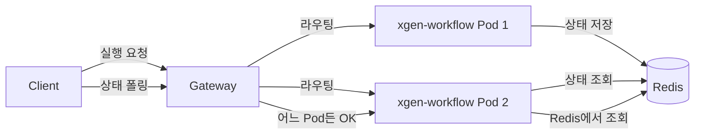

## 배경

XGEN 2.0 xgen-workflow 서비스는 워크플로우 실행 상태를 메모리에 유지한다. Pod가 한 개라면 문제없지만, 스케일 아웃으로 Pod를 여러 개 띄우면 클라이언트가 어느 Pod와 통신하느냐에 따라 상태가 다를 수 있다.

예를 들어, Pod A에서 시작한 워크플로우 실행 상태가 Pod B에는 없다. 클라이언트가 진행 중인 워크플로우 상태를 폴링할 때 Pod B로 라우팅되면 "실행 정보 없음" 에러가 반환된다.

이 문제를 해결하려면 세션 스티키니스(sticky session)나 분산 상태 저장소(Redis)가 필요하다. 단기적으로는 Istio의 sticky session을 활용하고, 이를 위해 Pod의 IP 정보가 서비스 계층에 필요했다.

## Kubernetes Downward API

Downward API는 Kubernetes가 Pod 자신의 정보를 컨테이너에 환경변수나 볼륨 파일로 제공하는 기능이다. 컨테이너가 자신이 어느 Pod인지, IP가 무엇인지 알 수 있다.

제공 가능한 정보:
- `metadata.name` → Pod 이름
- `metadata.namespace` → 네임스페이스
- `metadata.labels` → Pod 레이블
- `status.podIP` → Pod IP
- `status.hostIP` → 노드 IP
- `requests.cpu/memory` → 리소스 요청량
- `limits.cpu/memory` → 리소스 제한

## Downward API 환경변수 설정

```yaml
# xgen-workflow deployment.yaml
# # 커밋: Downward API로 POD_NAME, POD_IP 환경변수 주입
# # 날짜: 2024-10-12
containers:
- name: xgen-workflow
  image: registry.x2bee.com/xgen-workflow:latest
  env:
  - name: POD_NAME
    valueFrom:
      fieldRef:
        fieldPath: metadata.name
  - name: POD_IP
    valueFrom:
      fieldRef:
        fieldPath: status.podIP
  - name: POD_NAMESPACE
    valueFrom:
      fieldRef:
        fieldPath: metadata.namespace
```

`fieldRef.fieldPath`가 Downward API의 핵심이다. 실행 중인 Pod의 메타데이터를 Kubernetes API에서 가져와 환경변수로 설정한다.

## 서비스에서 활용

```python
# xgen-workflow/main.py
import os

POD_NAME = os.environ.get("POD_NAME", "unknown")
POD_IP = os.environ.get("POD_IP", "localhost")

@app.get("/info")
async def pod_info():
    """현재 응답하는 Pod 정보 반환 (디버깅용)"""
    return {
        "pod_name": POD_NAME,
        "pod_ip": POD_IP,
    }

@app.post("/workflow/execute")
async def execute_workflow(request: WorkflowRequest):
    execution_id = str(uuid4())

    # 실행 상태에 Pod 정보 포함
    execution_state = {
        "execution_id": execution_id,
        "pod_name": POD_NAME,
        "pod_ip": POD_IP,
        "status": "running",
        "started_at": datetime.now().isoformat(),
    }

    # 메모리 저장 (해당 Pod에서만 유효)
    execution_store[execution_id] = execution_state

    return {"execution_id": execution_id, "pod_ip": POD_IP}
```

클라이언트가 `execute` 응답에서 `pod_ip`를 받으면, 이후 폴링 요청을 같은 Pod로 보낼 수 있다.

## Istio를 활용한 Sticky Session

Istio DestinationRule로 세션 스티키니스를 구현할 수 있다.

```yaml
# destinationrule-workflow.yaml
# # 커밋: xgen-workflow Istio DestinationRule sticky session 추가
# # 날짜: 2024-10-14
apiVersion: networking.istio.io/v1beta1
kind: DestinationRule
metadata:
  name: xgen-workflow-dr
  namespace: xgen
spec:
  host: xgen-workflow
  trafficPolicy:
    loadBalancer:
      consistentHash:
        httpHeaderName: "X-Execution-Pod"
```

클라이언트가 `X-Execution-Pod: POD_IP` 헤더를 보내면, Istio가 해시 기반으로 항상 동일한 Pod로 라우팅한다.

```python
# 클라이언트 폴링 코드 (xgen-frontend)
async def poll_execution_status(execution_id: str, pod_ip: str):
    headers = {"X-Execution-Pod": pod_ip}

    async with httpx.AsyncClient() as client:
        response = await client.get(
            f"/workflow/status/{execution_id}",
            headers=headers
        )
    return response.json()
```

## 분산 추적에 활용

Pod 정보는 로그와 분산 추적에서도 유용하다.

```python
# 로그에 Pod 정보 포함
import logging
import json

class PodContextFilter(logging.Filter):
    def filter(self, record):
        record.pod_name = POD_NAME
        record.pod_ip = POD_IP
        return True

logger = logging.getLogger(__name__)
logger.addFilter(PodContextFilter())

# 로그 포맷
logging.basicConfig(
    format='%(asctime)s [%(pod_name)s/%(pod_ip)s] %(levelname)s: %(message)s'
)
```

이렇게 하면 여러 Pod에서 나오는 로그를 Loki/ELK에서 집계할 때 어느 Pod에서 발생한 로그인지 식별할 수 있다.

## Downward API 볼륨 방식

환경변수 대신 파일로 받는 방법도 있다.

```yaml
volumes:
- name: pod-info
  downwardAPI:
    items:
    - path: "pod-name"
      fieldRef:
        fieldPath: metadata.name
    - path: "pod-ip"
      fieldRef:
        fieldPath: status.podIP
    - path: "labels"
      fieldRef:
        fieldPath: metadata.labels

containers:
- name: xgen-workflow
  volumeMounts:
  - name: pod-info
    mountPath: /etc/pod-info
```

`/etc/pod-info/pod-name`, `/etc/pod-info/pod-ip` 파일이 생성된다. 파일 방식은 레이블처럼 가변적인 데이터에 유리하다. 환경변수는 Pod 시작 시점 값이 고정되지만, 파일은 레이블이 변경될 때 자동으로 업데이트된다.

## 멀티 Pod 상태 공유의 근본적 해결

Downward API + sticky session은 임시방편이다. 근본적인 해결책은 상태를 외부 저장소에 관리하는 것이다.



XGEN 2.0에서는 단기적으로 Downward API + sticky session을 적용하고, 장기적으로 워크플로우 실행 상태를 Redis로 이전하는 계획을 세웠다. 임시 해결책이지만 실제 운영에서 충분히 동작했다.

## 결과

- POD_NAME, POD_IP 환경변수로 Pod 자기인식 구현
- Istio sticky session으로 멀티 Pod에서 세션 연속성 보장
- 로그/분산추적에 Pod 컨텍스트 포함
- Downward API는 추가 사이드카나 API 호출 없이 K8s 내장 기능만으로 구현

Kubernetes를 쓰면서 Pod가 자신의 신원을 알아야 할 때가 생각보다 많다. Downward API는 이런 상황을 우아하게 해결하는 내장 메커니즘이다.
