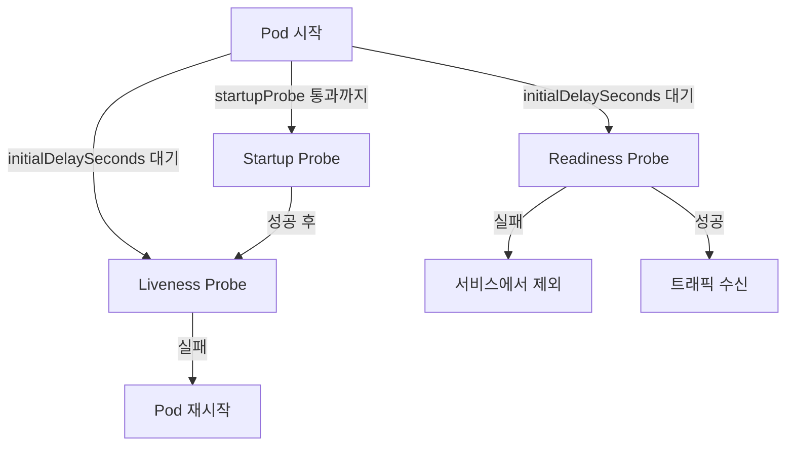

## 배경

XGEN 2.0 서비스 중 AI 모델을 로드하는 서비스(xgen-model, xgen-documents)는 시작하는 데 시간이 오래 걸린다. xgen-documents는 문서 처리를 위해 임베딩 모델을 로드하는데, 모델 파일 크기가 수백 MB라 초기 로딩에 60초 이상 걸렸다.

Kubernetes의 기본 Health Probe 설정은 이런 서비스를 위한 것이 아니다. 기본값으로 두면 서비스가 완전히 뜨기 전에 Kubernetes가 "죽었다"고 판단해서 Pod를 재시작한다. 재시작 → 다시 모델 로드 → 또 타임아웃 → 무한루프.

## Health Probe 종류

Kubernetes의 세 가지 Probe 타입이다.



**Liveness Probe**: 서비스가 살아있는지 확인. 실패 시 Pod 재시작.
**Readiness Probe**: 트래픽을 받을 준비가 됐는지 확인. 실패 시 Service 엔드포인트에서 제외.
**Startup Probe**: 초기 기동 완료까지 Liveness/Readiness를 대기시킴. 느린 시작 서비스용.

## 기본값의 문제

Helm chart에서 Probe를 설정하지 않으면 Kubernetes 기본값이 적용된다.

| 파라미터 | 기본값 |
|---------|--------|
| initialDelaySeconds | 0 |
| periodSeconds | 10 |
| timeoutSeconds | 1 |
| failureThreshold | 3 |
| successThreshold | 1 |

`failureThreshold: 3`, `periodSeconds: 10`이면 30초 후에 Pod가 재시작된다. xgen-documents는 시작에 60초가 걸리니 기본값으로는 절대 뜰 수가 없다.

## xgen-documents Probe 설정

```yaml
# xgen-documents deployment.yaml
# # 커밋: xgen-documents health probe 타임아웃 조정 (모델 로딩 60초 이상)
# # 날짜: 2024-10-15
containers:
- name: xgen-documents
  image: registry.x2bee.com/xgen-documents:latest
  ports:
  - containerPort: 8004

  livenessProbe:
    httpGet:
      path: /health
      port: 8004
    initialDelaySeconds: 60
    periodSeconds: 15
    timeoutSeconds: 10
    failureThreshold: 5
    successThreshold: 1

  readinessProbe:
    httpGet:
      path: /ready
      port: 8004
    initialDelaySeconds: 60
    periodSeconds: 10
    timeoutSeconds: 10
    failureThreshold: 3
    successThreshold: 1
```

**`initialDelaySeconds: 60`**: Pod 시작 후 60초간 Probe를 실행하지 않는다. 모델 로딩 시간을 확보한다.

**`timeoutSeconds: 10`**: Probe HTTP 요청의 응답 대기 시간. `/health` 엔드포인트가 모델 상태를 확인하는 로직이 있으면 응답에 시간이 걸릴 수 있다.

**`failureThreshold: 5`**: 5번 연속 실패해야 비로소 Pod를 재시작한다. 일시적인 응답 지연에 여유를 준다.

## xgen-core Probe 설정

xgen-core는 FastAPI 기반 핵심 서비스다. 모델을 직접 로드하지는 않지만 DB 커넥션 풀 초기화가 완료될 때까지 준비 상태가 아니다.

```yaml
# xgen-core deployment.yaml
# # 커밋: xgen-core health probe initialDelaySeconds 90초로 증가
# # 날짜: 2024-10-16
livenessProbe:
  httpGet:
    path: /health
    port: 8002
  initialDelaySeconds: 90
  periodSeconds: 20
  timeoutSeconds: 10
  failureThreshold: 3

readinessProbe:
  httpGet:
    path: /health/ready
    port: 8002
  initialDelaySeconds: 90
  periodSeconds: 10
  timeoutSeconds: 5
  failureThreshold: 5
```

처음에는 `initialDelaySeconds: 60`으로 설정했는데 배포 후 가끔 재시작이 발생했다. DB 연결 설정이 느린 환경에서 90초까지 늘려야 안정화됐다.

## /health와 /ready 엔드포인트 구분

Probe 엔드포인트를 두 개로 나누는 패턴이다.

```python
# FastAPI health endpoints
from fastapi import FastAPI, HTTPException

app = FastAPI()

@app.get("/health")
async def health_check():
    """Liveness Probe: 프로세스가 살아있는지만 확인"""
    return {"status": "ok"}

@app.get("/health/ready")
async def readiness_check():
    """Readiness Probe: 트래픽을 받을 준비가 됐는지 확인"""
    checks = {}

    # DB 연결 확인
    try:
        await db.execute("SELECT 1")
        checks["db"] = "ok"
    except Exception as e:
        checks["db"] = f"error: {e}"

    # 모델 로드 상태 확인
    if not model_loaded:
        checks["model"] = "loading"
        raise HTTPException(status_code=503, detail=checks)

    checks["model"] = "ok"
    return {"status": "ready", "checks": checks}
```

Liveness Probe는 프로세스가 살아있기만 하면 통과한다. 죽어있거나 데드락 상태일 때만 재시작을 원하기 때문이다.

Readiness Probe는 실제로 트래픽을 받을 수 있는지 확인한다. DB가 끊기거나 모델이 아직 로드 중이면 503을 반환해서 Service 엔드포인트에서 제외된다.

## Startup Probe 활용

Kubernetes 1.18부터 도입된 Startup Probe를 쓰면 더 우아하게 처리할 수 있다.

```yaml
# Startup Probe를 써서 초기 기동 완료까지 대기
startupProbe:
  httpGet:
    path: /health
    port: 8004
  initialDelaySeconds: 10
  periodSeconds: 10
  failureThreshold: 30   # 최대 300초(30 * 10) 대기
  timeoutSeconds: 5

# Startup Probe가 성공하면 아래 Probe가 활성화됨
livenessProbe:
  httpGet:
    path: /health
    port: 8004
  periodSeconds: 15
  timeoutSeconds: 5
  failureThreshold: 3
```

`startupProbe.failureThreshold: 30`으로 설정하면 최대 300초(30 × 10초) 동안 서비스가 뜨기를 기다린다. 기동 완료 후 Startup Probe가 성공하면 이후부터 일반 Liveness Probe가 적용된다.

`initialDelaySeconds`를 크게 잡는 것보다 Startup Probe를 쓰는 것이 더 유연하다. 서비스가 빨리 뜨면 빠르게 Ready 상태가 되고, 느리게 뜨면 최대 시간까지 기다린다.

## Probe 설정 템플릿

xgen2.0-infra에서 서비스별 Helm values에 공통 템플릿을 사용했다.

```yaml
# charts/xgen-service/values.yaml
probes:
  enabled: true
  liveness:
    path: /health
    initialDelaySeconds: 30
    periodSeconds: 15
    timeoutSeconds: 5
    failureThreshold: 3
  readiness:
    path: /health
    initialDelaySeconds: 30
    periodSeconds: 10
    timeoutSeconds: 5
    failureThreshold: 5
```

각 서비스 values-override.yaml에서 필요한 값만 덮어쓴다.

```yaml
# xgen-documents/values-override.yaml
probes:
  liveness:
    initialDelaySeconds: 60
    timeoutSeconds: 10
    failureThreshold: 5
  readiness:
    initialDelaySeconds: 60
    timeoutSeconds: 10
```

## 결과

- xgen-documents: 무한 재시작 → 안정적 기동 성공
- xgen-core: 가끔 발생하던 재시작 완전 해소
- Liveness/Readiness 분리로 DB 장애 시 Pod 재시작 없이 트래픽만 차단
- Startup Probe 도입으로 기동 시간이 가변적인 서비스에 유연하게 대응

Health Probe는 설정하는 데 5분이 안 걸리지만, 올바르게 설정하지 않으면 서비스가 재시작 루프에 빠지는 가장 흔한 K8s 초보 실수 중 하나다.
