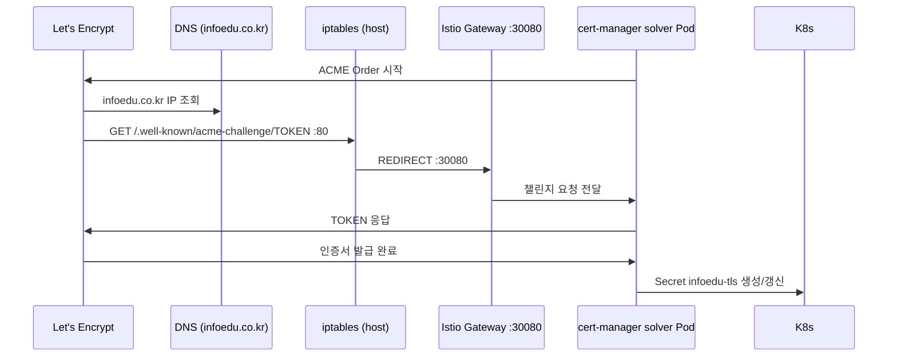

## 배경

XGEN 2.0을 외부에 공개하면서 HTTPS가 필수가 됐다. 온프레미스 K3s 환경이라 퍼블릭 클라우드의 Managed TLS 서비스를 쓸 수 없고, 직접 Let's Encrypt 인증서를 발급받아야 한다.

단순히 certbot으로 발급하면 90일마다 수동 갱신이 필요하다. cert-manager를 Kubernetes에 설치하면 인증서 발급부터 갱신까지 자동화된다.

## 환경

- K3s v1.28 (단일 노드, 온프레미스)
- Istio 1.19 (Gateway/VirtualService)
- cert-manager v1.13
- 도메인: infoedu.co.kr (외부 DNS 설정 완료)
- 서버 공인 IP: 외부에서 접근 가능

## cert-manager 설치

Helm으로 설치한다.

```bash
helm repo add jetstack https://charts.jetstack.io
helm repo update

helm install cert-manager jetstack/cert-manager \
    --namespace cert-manager \
    --create-namespace \
    --set installCRDs=true \
    --version v1.13.0
```

CRD를 같이 설치해야 `ClusterIssuer`, `Certificate` 리소스를 사용할 수 있다.

## ClusterIssuer 설정

Let's Encrypt ACME HTTP01 challenge를 사용한다. HTTP01은 도메인의 `/.well-known/acme-challenge/` 경로에 임시 파일을 올려서 도메인 소유권을 증명하는 방식이다.

```yaml
# cluster-issuer.yaml
# # 커밋: cert-manager ClusterIssuer 추가 (Let's Encrypt HTTP01)
# # 날짜: 2024-08-12
apiVersion: cert-manager.io/v1
kind: ClusterIssuer
metadata:
  name: letsencrypt-prod
spec:
  acme:
    server: https://acme-v02.api.letsencrypt.org/directory
    email: admin@x2bee.com
    privateKeySecretRef:
      name: letsencrypt-prod-key
    solvers:
    - http01:
        ingress:
          class: istio
```

`class: istio`가 중요하다. K3s는 기본적으로 Traefik을 Ingress Controller로 사용하지만, XGEN 2.0은 Istio를 쓴다. solver가 Istio Ingress를 통해 ACME 챌린지 요청을 처리하도록 설정해야 한다.

## Certificate 리소스

```yaml
# certificate.yaml
# # 커밋: infoedu.co.kr TLS 인증서 Certificate 리소스 생성
# # 날짜: 2024-08-13
apiVersion: cert-manager.io/v1
kind: Certificate
metadata:
  name: infoedu-tls
  namespace: istio-system
spec:
  secretName: infoedu-tls
  issuerRef:
    name: letsencrypt-prod
    kind: ClusterIssuer
  dnsNames:
  - infoedu.co.kr
  - "*.infoedu.co.kr"
  - xgen.infoedu.co.kr
```

`namespace: istio-system`에 생성해야 한다. Istio Gateway가 이 네임스페이스의 Secret을 참조하기 때문이다. 인증서 Secret이 다른 네임스페이스에 있으면 Gateway에서 찾지 못한다.

`secretName: infoedu-tls`로 생성된 Secret에 TLS 키가 저장되고, Istio Gateway의 `credentialName`에서 이 이름을 참조한다.

## iptables 포트 포워딩

Let's Encrypt ACME 챌린지는 80번 포트로 들어온다. 그런데 K3s의 Istio IngressGateway는 NodePort로 운영 중이라 80/443이 아닌 30080/30443 같은 포트를 사용한다.

외부에서 80포트로 오는 요청을 K3s NodePort로 전달해야 했다.

```bash
# # 커밋: iptables PREROUTING으로 80/443 -> K3s NodePort 포워딩 설정
# # 날짜: 2024-08-11

# 80 -> 30080
iptables -t nat -A PREROUTING -p tcp --dport 80 -j REDIRECT --to-port 30080

# 443 -> 30443
iptables -t nat -A PREROUTING -p tcp --dport 443 -j REDIRECT --to-port 30443
```

이 규칙을 `/etc/rc.local`에 등록해서 서버 재시작 후에도 유지되게 했다.

```bash
#!/bin/bash
iptables -t nat -A PREROUTING -p tcp --dport 80 -j REDIRECT --to-port 30080
iptables -t nat -A PREROUTING -p tcp --dport 443 -j REDIRECT --to-port 30443
exit 0
```

## ACME 챌린지 동작 흐름



## 삽질: Wildcard 인증서와 DNS01

처음에는 `*.infoedu.co.kr` 와일드카드 인증서를 HTTP01로 발급하려다 실패했다. Let's Encrypt는 와일드카드 인증서를 **DNS01 챌린지**로만 발급한다.

DNS01 챌린지는 도메인의 TXT 레코드에 값을 쓰는 방식인데, 자동화하려면 DNS 제공사의 API가 필요하다. 온프레미스 환경에서 사용 중인 Technitium DNS는 cert-manager의 공식 DNS webhook이 없었다.

결국 와일드카드를 포기하고 각 서브도메인을 명시적으로 나열하는 방식으로 전환했다.

```yaml
dnsNames:
- infoedu.co.kr
- xgen.infoedu.co.kr
- api.infoedu.co.kr
```

HTTP01 방식이라 각 도메인별로 챌린지를 처리해야 하지만, cert-manager가 자동으로 처리한다.

## 삽질: Technitium DNS 포트 충돌

Technitium DNS 서버를 호스트에서 직접 운영 중이었는데, DNS 서버가 53번 포트뿐만 아니라 80번 포트도 Web UI로 점유하고 있었다.

iptables PREROUTING으로 80 → 30080 포워딩을 했더니 Technitium DNS Web UI도 K3s로 포워딩됐다. Technitium DNS Web UI 포트를 8053으로 변경해서 해결했다.

```bash
# Technitium DNS Web UI 포트 변경
# /etc/dns/dns.json
{
  "WebService": {
    "HttpPort": 8053,
    "EnableHttps": false
  }
}
```

## 인증서 상태 확인

```bash
# Certificate 상태 확인
kubectl get certificate -n istio-system
# NAME          READY   SECRET        AGE
# infoedu-tls   True    infoedu-tls   7d

# 인증서 상세 정보
kubectl describe certificate infoedu-tls -n istio-system

# Secret에서 인증서 만료일 확인
kubectl get secret infoedu-tls -n istio-system -o jsonpath='{.data.tls\.crt}' \
    | base64 -d | openssl x509 -noout -dates
```

cert-manager는 인증서 만료 30일 전에 자동 갱신을 시작한다. 갱신도 HTTP01 챌린지를 자동으로 수행하므로 별도 작업이 필요 없다.

## 결과

- Let's Encrypt 인증서 자동 발급/갱신 완료
- 90일 갱신 걱정 없음
- 와일드카드 대신 도메인 명시로 HTTP01 챌린지 유지
- iptables PREROUTING으로 NodePort 환경에서도 80/443 정상 동작

온프레미스 K3s에서 TLS 자동화는 퍼블릭 클라우드보다 손이 많이 가지만, 한 번 설정해두면 cert-manager가 모든 갱신을 알아서 처리한다.
