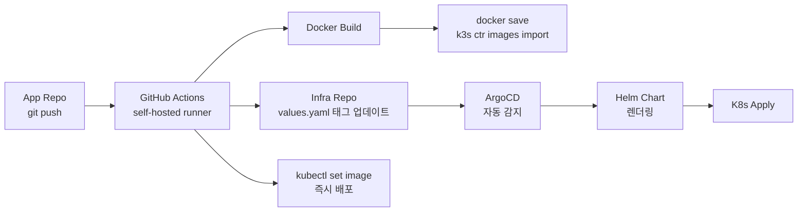
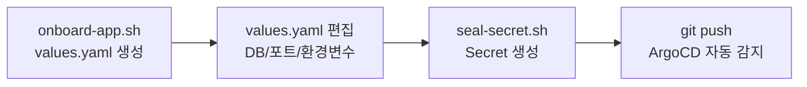

# Reusable GitHub Actions와 Helm으로 K3s 범용 배포 플랫폼 구축하기

## 개요

개인 프로젝트 두 개를 K3s 단일 노드 서버에서 운영하고 있었다.

| 프로젝트 | 서버 스택 | 클라이언트 스택 | DB | 도메인 |
|----------|-----------|----------------|-----|--------|
| dongtan-master-guide | Node.js | React + Nginx | PostgreSQL + Redis | dongtan.infoedu.co.kr |
| alls-sticker-mall | Node.js/Express | Next.js SSR | MongoDB | alls-kr.shop |

두 프로젝트 모두 GitHub에서 관리하고, 각 레포에 deploy.yml과 K8s 매니페스트를 갖고 있었다. 문제는 **거의 동일한 배포 파이프라인이 각 레포에 50줄씩 복붙**되어 있었다는 점이다.

deploy.yml을 수정할 때마다 두 레포 모두 고쳐야 했고, 새 프로젝트를 추가하려면 동일한 작업을 처음부터 반복해야 했다. K8s 매니페스트도 각 레포의 `k8s/` 디렉토리에 산재해 있어서, 인프라 설정의 단일 진실 공급원(single source of truth)이 없었다.

회사에서는 Jenkins + GitLab CI/CD + ArgoCD 조합으로 6개 마이크로서비스를 배포하는 파이프라인을 이미 운영하고 있었다. 그 경험을 살려 개인 프로젝트도 제대로 된 배포 플랫폼을 구축하기로 했다. 다만 회사 환경과 달리 몇 가지 제약이 있었다.

- **레지스트리가 없다.** Harbor나 ECR 같은 컨테이너 레지스트리를 운영하지 않는다.
- **K3s 단일 노드.** 멀티 노드 클러스터가 아니라 서버 한 대다.
- **Jenkins 없이 GitHub Actions만 사용.** Self-hosted runner를 K3s 서버에서 직접 실행한다.

이 글에서는 Reusable GitHub Actions Workflow + 범용 Helm Chart + ArgoCD ApplicationSet으로 "새 프로젝트 추가 = values.yaml 하나 작성"인 범용 배포 플랫폼을 구축한 과정을 정리한다.


## 아키텍처

전체 배포 흐름은 다음과 같다.



핵심은 **Hybrid GitOps** 방식이다. ArgoCD GitOps만으로는 이미지가 노드에 로드된 후 태그 변경을 감지하는 데 지연이 있다. `kubectl set image`로 즉시 배포한 뒤, ArgoCD가 뒤이어 Git 상태와 동기화하는 구조를 채택했다.

디렉토리 구조는 아래와 같다.

```
infra/
├── .github/workflows/
│   ├── build-and-push.yml          # Reusable workflow (workflow_call)
│   └── validate-chart.yml          # Helm lint + template CI
├── charts/web-app/                 # 범용 Helm chart
│   ├── Chart.yaml
│   ├── values.yaml
│   ├── values.schema.json          # JSON Schema 입력값 검증
│   └── templates/
│       ├── _helpers.tpl
│       ├── deployment-server.yaml
│       ├── deployment-client.yaml
│       ├── service-*.yaml
│       ├── ingress.yaml
│       └── databases/
│           ├── postgresql.yaml
│           ├── mongodb.yaml
│           └── redis.yaml
├── apps/                           # 프로젝트별 values override
│   ├── dongtan/values.yaml
│   ├── alls/values.yaml
│   └── _template/values.yaml      # 온보딩 템플릿
├── cluster/                        # 클러스터 공유 리소스
│   ├── argocd/applicationset.yaml  # Git Generator
│   ├── cert-manager/
│   └── traefik/
└── scripts/
    ├── bootstrap.sh                # 클러스터 초기 셋업
    ├── onboard-app.sh              # 새 앱 스캐폴딩
    └── seal-secret.sh
```


## Reusable GitHub Actions Workflow

### 왜 Reusable Workflow인가

GitHub Actions의 `workflow_call` 트리거를 사용하면, 하나의 workflow를 여러 레포에서 호출할 수 있다. 각 앱 레포에서는 호출만 하면 되므로, 배포 로직의 중복이 완전히 제거된다.

기존에 각 레포에 50줄씩 있던 deploy.yml이 10줄로 줄어든다.

```yaml
# 앱 레포의 deploy.yml -- 이게 전부다
jobs:
  deploy:
    uses: SonAIengine/infra/.github/workflows/build-and-push.yml@main
    with:
      app-name: dongtan
      namespace: dongtan
      components: >-
        [{"name":"server","dockerfile":"./Dockerfile","context":"."},
         {"name":"web","dockerfile":"./client/Dockerfile","context":"./client"}]
    secrets:
      GH_PAT: ${{ secrets.GH_PAT }}
```

### workflow_call 인터페이스 설계

Reusable workflow의 인터페이스는 4개 inputs과 1개 secret으로 구성했다.

```yaml
on:
  workflow_call:
    inputs:
      app-name:        # "dongtan" / "alls" -- apps/<name> 디렉토리와 매칭
        required: true
        type: string
      namespace:        # K8s 네임스페이스
        required: true
        type: string
      components:       # JSON 배열: [{"name":"server","dockerfile":"...","context":"..."}]
        required: true
        type: string
      infra-repo:       # 기본값: "SonAIengine/infra"
        required: false
        type: string
        default: "SonAIengine/infra"
    secrets:
      GH_PAT:           # infra repo push용 GitHub PAT
        required: true
```

`components`를 JSON 배열로 받는 것이 이 설계의 핵심이다. 프로젝트마다 빌드해야 할 컴포넌트가 다르기 때문이다. dongtan은 server + web 2개, alls도 server + client 2개인데, 각각의 Dockerfile 경로와 빌드 컨텍스트가 다르다. JSON 배열로 받으면 workflow 코드를 변경하지 않고도 컴포넌트 수와 구성을 자유롭게 바꿀 수 있다.

### 실행 흐름 상세

workflow의 실행 흐름은 6단계로 구성된다.

**1단계: 앱 레포 체크아웃 + SHORT_SHA 생성**

```yaml
- name: Checkout app repo
  uses: actions/checkout@v4

- name: Set short SHA
  run: echo "SHORT_SHA=$(echo ${{ github.sha }} | cut -c1-7)" >> $GITHUB_ENV
```

커밋 SHA의 앞 7자리를 이미지 태그로 사용한다. `latest` 대신 커밋 해시를 태그로 쓰면 어떤 커밋이 배포되었는지 추적할 수 있다.

**2단계: Docker Build + K3s 직접 로드**

```bash
echo "$COMPONENTS" | jq -c '.[]' | while read -r component; do
    NAME=$(echo "$component" | jq -r '.name')
    DOCKERFILE=$(echo "$component" | jq -r '.dockerfile')
    CONTEXT=$(echo "$component" | jq -r '.context')
    IMAGE="${{ inputs.app-name }}-${NAME}"

    docker build \
      -t "${IMAGE}:${{ env.SHORT_SHA }}" \
      -t "${IMAGE}:latest" \
      -f "${DOCKERFILE}" "${CONTEXT}"

    # 레지스트리 없이 K3s에 직접 로드
    docker save "${IMAGE}:${{ env.SHORT_SHA }}" | sudo k3s ctr images import -
done
```

`docker save | k3s ctr images import`가 레지스트리 없는 환경의 핵심이다. Docker 이미지를 tar로 내보낸 후, K3s의 containerd에 직접 임포트한다. 이 방식은 단일 노드에서만 동작한다. 멀티 노드 클러스터라면 각 노드에 이미지를 배포해야 하므로 레지스트리가 필수다.

**3단계: Infra 레포 태그 업데이트**

```bash
git clone "https://x-access-token:${{ secrets.GH_PAT }}@github.com/${{ inputs.infra-repo }}.git" /tmp/infra-update
cd /tmp/infra-update

VALUES_FILE="apps/${{ inputs.app-name }}/values.yaml"

echo "$COMPONENTS" | jq -c '.[]' | while read -r component; do
    NAME=$(echo "$component" | jq -r '.name')
    IMAGE="${{ inputs.app-name }}-${NAME}"

    # repository 라인 다음의 tag 라인을 업데이트
    sed -i "/repository: docker.io\/library\/${IMAGE}/{n;s/tag: .*/tag: \"${{ env.SHORT_SHA }}\"/}" "$VALUES_FILE"
done

git commit -m "deploy(${{ inputs.app-name }}): update image tags to ${{ env.SHORT_SHA }}"
git push
```

ArgoCD GitOps의 핵심 동작이다. infra 레포의 `apps/<name>/values.yaml`에서 이미지 태그를 업데이트하면, ArgoCD가 변경을 감지하여 Helm chart를 다시 렌더링한다.

`GH_PAT`(Personal Access Token)이 필요한 이유는 GitHub Actions의 기본 `GITHUB_TOKEN`으로는 다른 레포에 push할 수 없기 때문이다. 앱 레포의 workflow가 infra 레포에 push하는 크로스 레포 작업이므로 PAT가 필수다.

**4단계: 즉시 배포**

```bash
echo "$COMPONENTS" | jq -c '.[]' | while read -r component; do
    NAME=$(echo "$component" | jq -r '.name')
    DEPLOY_NAME=$(echo "$component" | jq -r '.deploymentName // .name')
    IMAGE="${{ inputs.app-name }}-${NAME}"

    kubectl set image "deployment/${DEPLOY_NAME}" \
      "${DEPLOY_NAME}=docker.io/library/${IMAGE}:${{ env.SHORT_SHA }}" \
      -n "${{ inputs.namespace }}"

    kubectl rollout status "deployment/${DEPLOY_NAME}" \
      -n "${{ inputs.namespace }}" --timeout=180s
done
```

ArgoCD sync를 기다리지 않고 `kubectl set image`로 즉시 배포한다. `rollout status`로 롤아웃 완료까지 대기하면서, 실패하면 workflow가 자동으로 실패 처리된다.

이 **Hybrid GitOps** 방식을 채택한 이유가 있다. ArgoCD의 polling 주기(기본 3분)를 기다리면 배포가 느려진다. `kubectl set image`로 먼저 배포하고, ArgoCD가 다음 sync에서 Git 상태와 클러스터 상태가 이미 일치함을 확인하는 구조다.

**5~6단계: 검증 + 정리**

```yaml
- name: Verify deployment
  run: kubectl get pods -n "${{ inputs.namespace }}"

- name: Cleanup old Docker images
  if: always()
  run: docker image prune -af --filter "until=24h" || true
```

24시간 이상 된 미사용 이미지를 정리한다. `if: always()`로 배포 실패 시에도 정리가 실행되게 했다.


## 레지스트리 없는 K3s 배포 전략

### 왜 레지스트리를 안 쓰는가

개인 서버에서 Harbor 같은 레지스트리를 운영하면 추가 리소스(CPU, 메모리, 스토리지)가 필요하다. Docker Hub는 rate limit이 있고, GHCR은 private 이미지에 요금이 발생한다. 단일 노드에서는 `docker save | k3s ctr images import`로 충분하다.

### 이미지 태그 전략

```
docker.io/library/dongtan-server:a1b2c3d
docker.io/library/dongtan-web:a1b2c3d
docker.io/library/alls-server:a1b2c3d
docker.io/library/alls-client:a1b2c3d
```

패턴은 `{app-name}-{component}:{SHORT_SHA}`다. `docker.io/library/` prefix는 K3s containerd가 정규화된 이미지 이름을 요구하기 때문에 붙인다. `imagePullPolicy: IfNotPresent`로 설정하면 이미 로드된 이미지를 pull 시도하지 않는다.

`latest` 태그도 함께 붙이지만, 실제 배포에는 사용하지 않는다. 개발 중 수동으로 `kubectl run`할 때 편의를 위한 것이다.


## 범용 Helm Chart 설계

### 설계 원칙

회사 프로젝트(XGEN)에서도 단일 Helm Chart로 6개 마이크로서비스를 배포하는 구조를 운영하고 있다. 그 경험에서 배운 원칙을 적용했다.

1. **하나의 차트로 server + client + database 전체를 관리한다.** 서비스별로 차트를 나누면 의존 관계 관리가 복잡해진다.
2. **values.yaml만 다르면 어떤 웹앱이든 배포할 수 있어야 한다.** React SPA든 Next.js SSR이든, PostgreSQL이든 MongoDB든.
3. **조건부 리소스 생성.** `enabled: true/false`로 필요한 컴포넌트만 활성화한다.

### server/client 구조

values.yaml의 최상위 구조는 `server`, `client`, `databases`, `ingress` 4개 섹션으로 나뉜다.

```yaml
server:
  enabled: true
  name: server          # Deployment/Service 이름
  image:
    repository: ""
    tag: latest
  port: 3001
  env: []               # 직접 env 주입
  envFrom: []           # secretRef/configMapRef
  healthCheck:
    enabled: true
    path: /api/v1/health
  resources:
    requests: { cpu: "500m", memory: "1Gi" }
    limits: { cpu: "4", memory: "4Gi" }

client:
  enabled: true
  name: web
  image:
    repository: ""
    tag: latest
  port: 80
  configMap:            # 선택적: nginx 설정 주입
    enabled: false
    data: {}
```

dongtan(React SPA)은 클라이언트가 Nginx에서 정적 파일을 서빙하므로 `client.configMap.enabled: true`로 nginx 설정을 주입한다. alls(Next.js SSR)는 자체 서버가 있으므로 `client.configMap.enabled: false`다. 이 차이를 하나의 차트 내에서 조건부로 처리한다.

### 데이터베이스 선택 패턴

```yaml
databases:
  postgresql:
    enabled: false          # dongtan: true
    image: postgres:16-alpine
    storage: 20Gi
    secretName: ""
    secretKeys:
      user: DB_USER
      password: DB_PASSWORD
      database: DB_NAME

  mongodb:
    enabled: false          # alls: true
    image: mongo:7
    storage: 20Gi
    initDatabase: ""        # alls: "sticker-mall"

  redis:
    enabled: false          # dongtan: true
    image: redis:7-alpine
    storage: 5Gi
```

dongtan은 `postgresql.enabled: true` + `redis.enabled: true`, alls는 `mongodb.enabled: true`만 활성화한다. 각 DB의 StatefulSet, Service, PVC가 `enabled` 플래그에 따라 조건부로 생성된다.

Secret은 차트에서 생성하지 않고 `secretName`으로 외부 참조한다. DB 비밀번호를 Helm values에 넣으면 Git에 커밋되므로, `kubectl create secret`으로 미리 생성해둔 Secret을 참조하는 방식을 택했다.

### Ingress의 component 해석 패턴

Ingress 설정에서 `component` 필드가 이 차트의 핵심 설계 포인트다.

```yaml
# dongtan -- 단순: 모든 트래픽을 client로
ingress:
  rules:
    - host: dongtan.infoedu.co.kr
      paths:
        - path: /
          component: client     # -> web:80

# alls -- 복잡: 경로별 라우팅
ingress:
  rules:
    - host: alls-kr.shop
      paths:
        - path: /socket.io
          component: server     # -> alls-server:5001
        - path: /api
          component: server
        - path: /uploads
          component: server
        - path: /
          component: client     # -> alls-client:3051
```

`component: server`라고 쓰면, `_helpers.tpl`의 헬퍼 함수가 `server.name`과 `server.port`를 자동으로 해석한다.

```go
{{- define "web-app.serviceName" -}}
{{- if eq .component "server" }}
{{- .Values.server.name }}
{{- else if eq .component "client" }}
{{- .Values.client.name }}
{{- else }}
{{- .component }}
{{- end }}
{{- end }}

{{- define "web-app.servicePort" -}}
{{- if eq .component "server" }}
{{- .Values.server.port }}
{{- else if eq .component "client" }}
{{- .Values.client.port }}
{{- else }}
{{- .port | default 80 }}
{{- end }}
{{- end }}
```

Ingress 템플릿에서 이 헬퍼를 호출한다.

```yaml
paths:
  {{- range .paths }}
  - path: {{ .path }}
    pathType: {{ .pathType | default "Prefix" }}
    backend:
      service:
        name: {{ include "web-app.serviceName" (dict "component" .component "Values" $.Values) }}
        port:
          number: {{ include "web-app.servicePort" (dict "component" .component "Values" $.Values) | int }}
  {{- end }}
```

이렇게 하면 values.yaml에서 `server.name`이나 `server.port`를 변경해도, Ingress 라우팅이 자동으로 따라온다. alls의 server가 `alls-server:5001`이고 dongtan의 server가 `server:3001`인 차이를 한 곳에서 관리할 수 있다.

### values.schema.json — 입력값 검증

Helm 3.5부터 `values.schema.json`으로 values 파일의 유효성을 검증할 수 있다. `helm install` 또는 `helm template` 시점에 스키마 위반이 잡힌다.

```json
{
  "properties": {
    "server": {
      "properties": {
        "image": {
          "properties": {
            "repository": { "type": "string" },
            "tag": { "type": "string" },
            "pullPolicy": { "type": "string", "enum": ["Always", "IfNotPresent", "Never"] }
          },
          "required": ["repository", "tag"]
        },
        "port": { "type": "integer", "minimum": 1, "maximum": 65535 }
      }
    },
    "databases": {
      "properties": {
        "postgresql": {
          "properties": {
            "storage": { "type": "string", "pattern": "^[0-9]+[KMGT]i$" }
          }
        }
      }
    },
    "ingress": {
      "properties": {
        "rules": {
          "items": {
            "properties": {
              "paths": {
                "items": {
                  "properties": {
                    "component": { "type": "string", "enum": ["server", "client"] }
                  },
                  "required": ["path", "component"]
                }
              }
            },
            "required": ["host", "paths"]
          }
        }
      }
    }
  }
}
```

`storage`의 패턴이 `^[0-9]+[KMGT]i$`인 것에 주목하자. `20Gi`는 통과하지만 `20GB`는 실패한다. Kubernetes가 요구하는 형식을 스키마 수준에서 강제한다.

`component`를 `enum: ["server", "client"]`로 제한한 것도 의도적이다. 오타로 `"sevrer"`를 쓰면 Ingress가 존재하지 않는 서비스를 가리키게 되는데, 스키마가 이를 차트 설치 시점에 잡아준다.


## ArgoCD ApplicationSet: Git Generator 자동 발견

### 디렉토리 기반 앱 자동 등록

ArgoCD ApplicationSet의 Git Generator를 사용하면, `apps/` 하위 디렉토리를 자동으로 스캔하여 각 폴더를 ArgoCD Application으로 생성한다.

```yaml
apiVersion: argoproj.io/v1alpha1
kind: ApplicationSet
metadata:
  name: web-apps
  namespace: argocd
spec:
  goTemplate: true
  goTemplateOptions: ["missingkey=error"]
  generators:
    - git:
        repoURL: https://github.com/SonAIengine/infra.git
        revision: HEAD
        directories:
          - path: apps/*
          - path: apps/_template
            exclude: true         # 온보딩 템플릿은 제외
  template:
    metadata:
      name: "{{ .path.basename }}"
    spec:
      source:
        repoURL: https://github.com/SonAIengine/infra.git
        path: charts/web-app
        helm:
          valueFiles:
            - "../../apps/{{ .path.basename }}/values.yaml"
      destination:
        server: https://kubernetes.default.svc
        namespace: "{{ .path.basename }}"
      syncPolicy:
        automated:
          prune: true        # Git에서 삭제되면 K8s에서도 삭제
          selfHeal: true     # 수동 변경 자동 복구
        syncOptions:
          - CreateNamespace=true
          - ApplyOutOfSyncOnly=true
```

이 구조에서 **새 프로젝트 추가는 `apps/<name>/values.yaml` 하나 추가하고 push하면 끝**이다. ArgoCD가 자동으로 감지하여 Application을 생성하고, Helm chart를 렌더링하여 배포한다.

`goTemplateOptions: ["missingkey=error"]`는 템플릿에서 존재하지 않는 키를 참조하면 에러를 발생시킨다. 기본값인 `missingkey=zero`는 빈 문자열을 반환하므로, 잘못된 설정이 무시되는 문제가 있었다.

`ApplyOutOfSyncOnly=true`는 변경된 리소스만 적용한다. 모든 리소스를 매번 재적용하면 불필요한 롤아웃이 발생할 수 있다.

### 회사 XGEN과의 차이

회사(XGEN)에서는 ApplicationSet 대신 프로젝트별 Application YAML을 직접 관리한다. 이유는 사이트마다 ArgoCD 프로젝트 분리, 네임스페이스 매핑, 접근 제어 정책이 달라서 자동 생성이 어렵기 때문이다.

개인 프로젝트는 제약이 적으므로 Git Generator가 적합했다. `apps/` 아래 디렉토리만 추가하면 ApplicationSet이 자동으로 처리하는 구조가 관리 부담을 크게 줄여준다.


## 앱 온보딩 자동화

### _template + onboard-app.sh

새 프로젝트를 추가할 때의 마찰을 최소화하기 위해, 온보딩 스크립트를 만들었다.

```bash
#!/bin/bash
set -euo pipefail

APP_NAME="$1"
DOMAIN="$2"
TEMPLATE="${APPS_DIR}/_template/values.yaml"
TARGET_DIR="${APPS_DIR}/${APP_NAME}"

mkdir -p "${TARGET_DIR}"
sed \
  -e "s/<app-name>/${APP_NAME}/g" \
  -e "s/<your-domain.com>/${DOMAIN}/g" \
  "${TEMPLATE}" > "${TARGET_DIR}/values.yaml"

echo "Done! Next steps:"
echo "  1. Edit ${TARGET_DIR}/values.yaml"
echo "  2. Create secrets: ./scripts/seal-secret.sh ${APP_NAME} ..."
echo "  3. Commit and push -- ArgoCD will auto-detect"
```

`_template/values.yaml`은 플레이스홀더가 포함된 기본 values 파일이다. `onboard-app.sh my-blog my-blog.example.com`을 실행하면 `apps/my-blog/values.yaml`이 생성되고, `<app-name>`과 `<your-domain.com>`이 실제 값으로 치환된다.

### 새 프로젝트 온보딩 절차

전체 온보딩은 4단계다.



1. `./scripts/onboard-app.sh my-app my-app.example.com` -- 스캐폴딩
2. `apps/my-app/values.yaml` 편집 -- 이미지, 포트, DB, 환경변수 설정
3. `./scripts/seal-secret.sh my-app my-app-secret --from-literal KEY=VALUE` -- Secret 생성
4. commit & push -- ArgoCD ApplicationSet이 자동 감지하여 배포

앱 레포에서는 `.github/workflows/deploy.yml` 10줄만 추가하면 CI/CD가 완성된다.

### bootstrap.sh — 클러스터 초기 셋업

새 서버에 K3s를 설치한 후 한 번만 실행하는 스크립트다.

```bash
# 1. cert-manager 설치 (Let's Encrypt TLS)
helm install cert-manager jetstack/cert-manager \
  --namespace cert-manager --create-namespace \
  --set crds.enabled=true --wait

# 2. ClusterIssuer 적용 (ACME HTTP-01)
kubectl apply -f cluster/cert-manager/cluster-issuer.yaml

# 3. Traefik 보안 헤더 Middleware
kubectl apply -f cluster/traefik/default-headers.yaml

# 4. ArgoCD 설치 + ApplicationSet 적용
helm install argocd argo/argo-cd \
  --namespace argocd --create-namespace --wait
kubectl apply -f cluster/argocd/projects.yaml
kubectl apply -f cluster/argocd/applicationset.yaml
```

4단계로 cert-manager, Traefik middleware, ArgoCD, ApplicationSet을 순서대로 설치한다. 멱등성을 보장하기 위해 각 단계에서 네임스페이스 존재 여부를 확인하고, 이미 설치되어 있으면 건너뛴다.


## Helm Chart CI: validate-chart.yml

### PR/Push 시 자동 검증

Helm chart나 values 파일이 변경될 때마다 자동으로 lint와 template 렌더링을 수행한다.

```yaml
on:
  push:
    branches: [main]
    paths: ["charts/**", "apps/**"]
  pull_request:
    branches: [main]
    paths: ["charts/**", "apps/**"]

jobs:
  lint:
    runs-on: ubuntu-latest
    steps:
      - uses: actions/checkout@v4
      - uses: azure/setup-helm@v4
      - run: helm lint charts/web-app
      - run: helm lint charts/web-app -f apps/dongtan/values.yaml
      - run: helm lint charts/web-app -f apps/alls/values.yaml

  template:
    runs-on: ubuntu-latest
    strategy:
      matrix:
        app: [dongtan, alls]
    steps:
      - uses: actions/checkout@v4
      - uses: azure/setup-helm@v4
      - run: |
          helm template ${{ matrix.app }} charts/web-app \
            -f apps/${{ matrix.app }}/values.yaml \
            --output-dir /tmp/rendered/${{ matrix.app }}
      - uses: actions/upload-artifact@v4
        with:
          name: manifests-${{ matrix.app }}
          path: /tmp/rendered/${{ matrix.app }}
```

lint 작업은 기본값과 각 앱의 values로 3번 실행한다. template 작업은 `matrix` 전략으로 dongtan과 alls를 병렬 렌더링하고, 결과를 artifact로 업로드한다. PR 리뷰 시 렌더링된 매니페스트를 다운로드해서 실제 생성될 리소스를 확인할 수 있다.

이 CI에서 `values.schema.json` 검증도 함께 수행된다. `helm template`는 schema 위반 시 에러를 발생시키므로, 잘못된 값이 main 브랜치에 들어가는 것을 방지한다.


## 두 프로젝트의 values 비교

dongtan과 alls가 하나의 차트를 어떻게 다르게 사용하는지 비교하면, 이 범용 차트의 유연성을 이해할 수 있다.

| 항목 | dongtan | alls |
|------|---------|------|
| 서버 포트 | 3001 | 5001 |
| 클라이언트 | React SPA + Nginx (port 80) | Next.js SSR (port 3051) |
| Nginx ConfigMap | `enabled: true` (SPA 라우팅 + API 프록시) | `enabled: false` (자체 서버) |
| DB | PostgreSQL + Redis | MongoDB |
| Ingress 라우팅 | `/` -> client | `/socket.io,/api,/uploads` -> server, `/` -> client |
| 추가 PVC | 없음 | `uploads-data: 10Gi` |
| 서버 리소스 | 500m~4 CPU, 1~4Gi | 250m~2 CPU, 512Mi~2Gi |

dongtan의 client ConfigMap에는 nginx 설정이 들어간다. React SPA의 `try_files $uri /index.html`과 `/api/` 프록시 설정이다.

```yaml
client:
  configMap:
    enabled: true
    name: web-nginx-config
    mountPath: /etc/nginx/conf.d/default.conf
    subPath: default.conf
    data:
      default.conf: |-
        server {
            listen 80;
            root /usr/share/nginx/html;

            location /api/ {
                proxy_pass http://server:3001;
            }

            location / {
                try_files $uri $uri/ /index.html;
            }
        }
```

alls는 Next.js가 자체 HTTP 서버를 포함하므로 nginx가 필요 없다. `configMap.enabled: false`만 설정하면 ConfigMap 리소스 자체가 생성되지 않는다.

alls는 파일 업로드 기능이 있어서 추가 PVC가 필요하다.

```yaml
persistence:
  volumes:
    - name: uploads-data
      size: 10Gi
      storageClass: local-path
      accessMode: ReadWriteOnce

server:
  volumeMounts:
    - name: uploads-storage
      mountPath: /app/uploads
  volumes:
    - name: uploads-storage
      persistentVolumeClaim:
        claimName: uploads-data
```

이런 차이들이 모두 values.yaml 수준에서 해결된다. 차트 템플릿은 하나도 건드릴 필요가 없다.


## 트러블슈팅

### self-hosted runner에서 sudo 권한

`k3s ctr images import`는 sudo가 필요하다. GitHub Actions의 self-hosted runner가 sudo 없이 실행되면 이미지 로드가 실패한다.

runner 사용자를 sudoers에 추가하되, 패스워드 없이 특정 명령만 허용하도록 설정했다.

```
son ALL=(ALL) NOPASSWD: /usr/local/bin/k3s
```

### sed 치환 시 YAML 구조 의존

infra 레포의 values.yaml에서 이미지 태그를 업데이트할 때 `sed`를 사용한다. 문제는 YAML 파일의 들여쓰기와 라인 순서에 의존한다는 것이다.

```bash
# repository 라인 바로 다음 줄의 tag을 치환
sed -i "/repository: docker.io\/library\/${IMAGE}/{n;s/tag: .*/tag: \"${{ env.SHORT_SHA }}\"/}" "$VALUES_FILE"
```

`repository` 라인과 `tag` 라인 사이에 다른 필드가 끼어들면 치환이 실패한다. 이 문제를 방지하기 위해 values.yaml에서 `image` 블록의 필드 순서를 `repository -> tag -> pullPolicy`로 고정하는 규칙을 세웠다.

더 안전한 방법은 `yq`를 사용하는 것이다. 하지만 self-hosted runner에 yq를 추가 설치해야 하고, 현재 구조에서 sed가 문제없이 동작하므로 당장은 sed로 유지했다.

### ArgoCD와 kubectl set image 충돌 가능성

Hybrid GitOps 방식에서 `kubectl set image`가 먼저 적용되고 ArgoCD sync가 뒤따른다. 만약 sync 직전에 values.yaml이 다른 변경으로 업데이트되면, ArgoCD가 `kubectl set image`로 배포된 버전을 되돌릴 수 있다.

현실적으로 개인 프로젝트 2개에서 동시 배포가 발생할 확률은 낮지만, 구조적 위험은 인지하고 있다. workflow에서 infra 레포 push와 `kubectl set image`를 동일한 SHA로 실행하므로, ArgoCD가 sync하더라도 같은 이미지 태그가 적용된다.

### paths 필터링으로 불필요한 CI 방지

validate-chart.yml에서 `paths` 필터를 설정하지 않으면, README 수정 같은 무관한 변경에도 Helm lint가 실행된다.

```yaml
on:
  push:
    paths:
      - "charts/**"
      - "apps/**"
```

`charts/**`와 `apps/**`만 감시하여, 인프라 코드 변경 시에만 CI가 동작하도록 제한했다.


## Jenkins vs GitHub Actions: 전환 회고

회사에서는 Jenkins로 6개 서비스를 빌드하는 파이프라인을 운영하고 있다. 개인 프로젝트를 GitHub Actions로 구축하면서 느낀 차이점을 정리한다.

| 항목 | Jenkins (회사 XGEN) | GitHub Actions (개인 infra) |
|------|---------------------|---------------------------|
| 파이프라인 정의 | Groovy DSL (build.groovy) | YAML (workflow_call) |
| 재사용 단위 | Shared Library / JCasC | Reusable Workflow |
| 설정 분리 | 3파일 분리 (services.yaml, build.groovy, Jenkinsfile) | inputs + values.yaml |
| 빌드 트리거 | Webhook + 파라미터 (SITE, SERVICE, NO_CACHE) | push event + workflow_call inputs |
| 레지스트리 | Harbor (private registry) | 없음 (docker save + ctr import) |
| 러너 | Jenkins agent (K8s Pod) | self-hosted runner (호스트 직접) |
| 멀티사이트 | SITE 파라미터로 분기 | app-name 파라미터로 분기 |

가장 큰 차이는 **인프라 오버헤드**다. Jenkins는 자체 서버(또는 K8s Pod)로 운영해야 하고, JCasC, 플러그인 관리, 보안 패치 등 관리 비용이 있다. GitHub Actions self-hosted runner는 systemd 서비스 하나면 된다.

반면 Jenkins는 **빌드 파라미터의 유연성**이 높다. UI에서 파라미터를 변경해서 재빌드하거나, 조건부 스테이지를 구성하기 쉽다. GitHub Actions는 workflow_dispatch의 inputs가 비슷한 역할을 하지만, 실행 중 파라미터를 동적으로 변경하는 것은 어렵다.

개인 프로젝트 규모에서는 GitHub Actions가 압도적으로 관리가 편하다. 레포와 CI가 같은 플랫폼에 있고, Reusable Workflow로 로직을 중앙 집중할 수 있으며, 별도 서버 관리가 불필요하다.


## 결과 및 회고

### 정량적 변화

| 항목 | 이전 | 이후 |
|------|------|------|
| 앱 레포 deploy.yml | ~50줄 (복붙) | 10줄 (workflow_call) |
| K8s 매니페스트 위치 | 각 레포 `k8s/` 폴더 | `infra/charts/web-app` (단일) |
| 새 프로젝트 온보딩 | 수동 매니페스트 작성 | `onboard-app.sh` + values.yaml |
| 인프라 설정 관리 | 분산 (각 레포) | 중앙 (infra 레포) |

### 설계 결정 회고

**Reusable Workflow의 components JSON 배열 패턴이 잘 동작했다.** 프로젝트마다 빌드 컴포넌트가 달라도 workflow 코드를 수정할 필요가 없다. 새 컴포넌트를 추가하려면 JSON 배열에 항목 하나만 추가하면 된다.

**범용 Helm Chart의 `enabled` 패턴은 XGEN에서 검증된 방식이다.** 하지만 프로젝트 수가 늘어나면 values.yaml의 조건 분기가 복잡해질 수 있다. 현재 2개 프로젝트에서는 문제없지만, 5개 이상이면 차트를 분리하는 것이 나을 수 있다.

**Hybrid GitOps(kubectl set image + ArgoCD)는 현실적인 타협이다.** 순수 GitOps를 추구한다면 `kubectl set image`를 제거하고 ArgoCD의 webhook으로 즉시 sync를 트리거해야 한다. 하지만 ArgoCD webhook 설정의 복잡성 대비 `kubectl set image`의 단순함이 더 가치 있다고 판단했다.

**레지스트리 없는 배포는 단일 노드의 특권이다.** 이 구조는 확장성이 없다. 노드를 추가하는 순간 레지스트리가 필요하다. 하지만 개인 서버 한 대에서 운영하는 한, 레지스트리 오버헤드를 피하는 것이 합리적이다.

아직 구현하지 못한 것들도 있다. Slack/Telegram 배포 알림, 롤백 자동화, Staging/Production 환경 분리가 남아 있다. 프로젝트가 더 추가되면 이 플랫폼 위에 점진적으로 기능을 얹을 계획이다.
