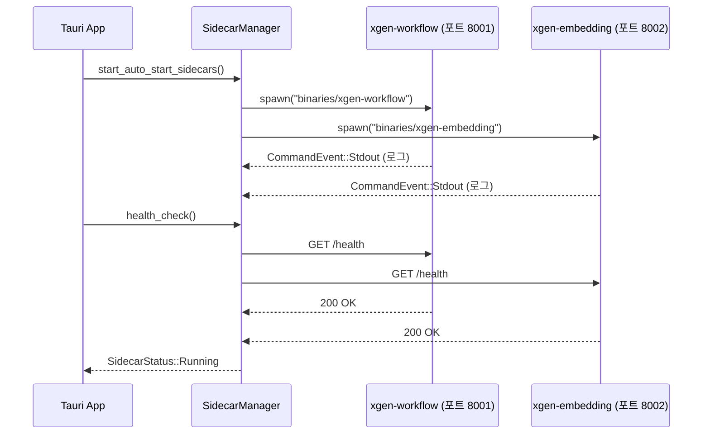

## 배경

xgen-app의 Standalone 모드에서는 LLM 추론, 문서 임베딩, 워크플로우 실행 등 여러 Python 서비스가 필요하다. 데스크톱 앱을 실행할 때마다 사용자가 직접 터미널에서 각 서비스를 시작하는 건 말이 안 된다.

Tauri에는 sidecar라는 개념이 있다. 앱 번들 안에 다른 실행 파일을 포함하고, 앱이 시작할 때 자동으로 실행하고 종료할 때 자동으로 종료하는 패턴이다. xgen-workflow와 xgen-embedding을 sidecar로 등록해서 앱과 함께 자동 시작되도록 구현했다.

## Sidecar 아키텍처



## tauri.conf.json 설정

sidecar 바이너리를 번들에 포함하려면 `externalBin` 설정이 필요하다.

```json
{
  "bundle": {
    "active": true,
    "targets": ["deb", "rpm"],
    "externalBin": [
      "binaries/xgen-workflow",
      "binaries/xgen-embedding"
    ]
  }
}
```

`externalBin`에 등록된 파일은 빌드 시 `src-tauri/binaries/` 디렉토리에서 찾는다. Tauri는 현재 빌드 대상 플랫폼의 triple을 접미사로 붙인 파일을 찾는다.

```
src-tauri/binaries/
├── xgen-workflow-x86_64-unknown-linux-gnu
├── xgen-embedding-x86_64-unknown-linux-gnu
├── xgen-workflow-aarch64-apple-darwin
└── xgen-embedding-aarch64-apple-darwin
```

각 플랫폼 바이너리를 미리 빌드해서 이 디렉토리에 넣어두면 된다. Python 서비스는 PyInstaller로 단일 실행 파일로 패키징했다.

## capabilities 권한 설정

sidecar 실행은 Tauri의 ACL(Access Control List)에 명시적으로 허용해야 한다.

```json
// src-tauri/capabilities/default.json
{
  "identifier": "default",
  "description": "Default capabilities",
  "windows": ["main"],
  "permissions": [
    "core:default",
    "shell:allow-spawn",
    "shell:allow-kill",
    {
      "identifier": "shell:allow-execute",
      "allow": [
        {
          "name": "binaries/xgen-workflow",
          "sidecar": true,
          "args": true
        },
        {
          "name": "binaries/xgen-embedding",
          "sidecar": true,
          "args": true
        }
      ]
    }
  ]
}
```

`sidecar: true`가 핵심이다. 이 플래그가 없으면 `shell:allow-execute`가 일반 외부 프로그램 실행 권한으로 처리되고, sidecar 번들 경로를 찾지 못한다.

## SidecarManager 구현

### 데이터 구조

```rust
// src-tauri/src/sidecar_manager.rs

#[derive(Debug, Clone)]
pub struct SidecarConfig {
    pub name: String,
    pub binary_name: String,   // binaries/ 하위 파일명
    pub port: u16,
    pub env: HashMap<String, String>,
    pub auto_start: bool,
}

#[derive(Debug, Clone, PartialEq)]
pub enum SidecarStatus {
    Running,
    Stopped,
    Failed(String),
    Starting,
}

pub struct SidecarManager {
    configs: HashMap<String, SidecarConfig>,
    processes: HashMap<String, Child>,  // 실행 중인 프로세스 핸들
    statuses: HashMap<String, SidecarStatus>,
}
```

### 기본 설정 등록

```rust
impl SidecarManager {
    pub fn new() -> Self {
        let mut manager = Self {
            configs: HashMap::new(),
            processes: HashMap::new(),
            statuses: HashMap::new(),
        };
        manager.register_default_configs();
        manager
    }

    fn register_default_configs(&mut self) {
        // xgen-workflow: RAG, 워크플로우 실행 엔진
        self.configs.insert(
            "xgen-workflow".to_string(),
            SidecarConfig {
                name: "xgen-workflow".to_string(),
                binary_name: "xgen-workflow".to_string(),
                port: 8001,
                env: [
                    ("APP_PORT", "8001"),
                    ("APP_HOST", "127.0.0.1"),
                    ("APP_ENV", "production"),
                ]
                .iter()
                .map(|(k, v)| (k.to_string(), v.to_string()))
                .collect(),
                auto_start: true,
            },
        );

        // xgen-embedding: 임베딩 전용 서버
        self.configs.insert(
            "xgen-embedding".to_string(),
            SidecarConfig {
                name: "xgen-embedding".to_string(),
                binary_name: "xgen-embedding".to_string(),
                port: 8002,
                env: [
                    ("APP_PORT", "8002"),
                    ("APP_HOST", "127.0.0.1"),
                ]
                .iter()
                .map(|(k, v)| (k.to_string(), v.to_string()))
                .collect(),
                auto_start: true,
            },
        );
    }
}
```

### sidecar 실행

```rust
pub async fn start_sidecar(
    &mut self,
    app_handle: &tauri::AppHandle,
    name: &str,
) -> Result<SidecarStatus, String> {
    let config = self.configs.get(name)
        .ok_or_else(|| format!("Unknown sidecar: {}", name))?
        .clone();

    self.statuses.insert(name.to_string(), SidecarStatus::Starting);

    let sidecar_name = format!("binaries/{}", config.binary_name);

    // 환경변수와 함께 sidecar 실행
    let (mut rx, child) = app_handle
        .shell()
        .sidecar(&sidecar_name)
        .map_err(|e| e.to_string())?
        .envs(config.env.clone())
        .spawn()
        .map_err(|e| e.to_string())?;

    let sidecar_name_clone = name.to_string();

    // 비동기로 stdout/stderr 수집
    tokio::spawn(async move {
        while let Some(event) = rx.recv().await {
            match event {
                CommandEvent::Stdout(data) => {
                    let line = String::from_utf8_lossy(&data);
                    tracing::info!("[{}] {}", sidecar_name_clone, line.trim());
                }
                CommandEvent::Stderr(data) => {
                    let line = String::from_utf8_lossy(&data);
                    tracing::warn!("[{}] {}", sidecar_name_clone, line.trim());
                }
                CommandEvent::Terminated(payload) => {
                    tracing::info!(
                        "[{}] terminated (exit code: {:?})",
                        sidecar_name_clone,
                        payload.code
                    );
                    break;
                }
                _ => {}
            }
        }
    });

    self.processes.insert(name.to_string(), child);
    self.statuses.insert(name.to_string(), SidecarStatus::Running);

    Ok(SidecarStatus::Running)
}
```

`app_handle.shell().sidecar()`는 `tauri-plugin-shell`이 제공하는 API다. 일반 `Command::new()`와 달리 번들된 바이너리 경로를 자동으로 찾아준다.

`rx`는 `CommandEvent` 스트림이다. `Stdout`, `Stderr`, `Terminated` 세 가지 이벤트가 온다. 이 스트림을 별도 tokio task에서 처리하면 메인 로직을 블로킹하지 않고 로그를 수집할 수 있다.

### 헬스체크

서비스가 실제로 준비됐는지 확인하는 헬스체크 로직이다.

```rust
async fn check_health(&self, url: &str) -> bool {
    let client = reqwest::Client::builder()
        .timeout(Duration::from_secs(2))
        .build()
        .unwrap();

    // 여러 엔드포인트 순서대로 시도
    for endpoint in &["/health", "/docs", "/"] {
        let full_url = format!("{}{}", url, endpoint);
        match client.get(&full_url).send().await {
            Ok(resp) => {
                let status = resp.status().as_u16();
                if status < 400 || status == 307 {
                    return true;
                }
            }
            Err(_) => continue,
        }
    }
    false
}

pub async fn wait_for_ready(
    &self,
    name: &str,
    timeout_secs: u64,
) -> Result<(), String> {
    let config = self.configs.get(name).ok_or("Unknown sidecar")?;
    let url = format!("http://127.0.0.1:{}", config.port);

    let deadline = Instant::now() + Duration::from_secs(timeout_secs);

    while Instant::now() < deadline {
        if self.check_health(&url).await {
            return Ok(());
        }
        tokio::time::sleep(Duration::from_millis(500)).await;
    }

    Err(format!(
        "{} did not become ready within {}s",
        name, timeout_secs
    ))
}
```

`/health`가 없는 서비스는 `/docs`(FastAPI 기본), `/`(루트)로 대체 확인한다. 307 리다이렉트도 서비스가 살아있다는 신호로 처리했다.

### auto_start 일괄 시작

```rust
pub async fn start_auto_start_sidecars(
    &mut self,
    app_handle: &tauri::AppHandle,
) -> Vec<(String, Result<SidecarStatus, String>)> {
    let auto_start_names: Vec<String> = self
        .configs
        .values()
        .filter(|c| c.auto_start)
        .map(|c| c.name.clone())
        .collect();

    let mut results = Vec::new();

    for name in auto_start_names {
        let result = self.start_sidecar(app_handle, &name).await;
        results.push((name, result));
    }

    results
}
```

## 앱 초기화에 연결

```rust
// src-tauri/src/lib.rs
pub fn run() {
    let app_state = Arc::new(AppState {
        sidecar_manager: RwLock::new(SidecarManager::new()),
        // ...
    });

    tauri::Builder::default()
        .plugin(tauri_plugin_shell::init())
        .manage(app_state.clone())
        .setup(|app| {
            let app_handle = app.handle().clone();
            let state = app.state::<Arc<AppState>>().inner().clone();

            // 비동기 백그라운드에서 사이드카 시작
            tauri::async_runtime::spawn(async move {
                let mut manager = state.sidecar_manager.write().await;
                let results = manager.start_auto_start_sidecars(&app_handle).await;

                for (name, result) in &results {
                    match result {
                        Ok(status) => tracing::info!("{}: {:?}", name, status),
                        Err(e) => tracing::error!("{} failed: {}", name, e),
                    }
                }

                // 서비스 준비 대기 (최대 30초)
                for (name, Ok(_)) in results.iter().filter(|(_, r)| r.is_ok()) {
                    if let Err(e) = manager.wait_for_ready(name, 30).await {
                        tracing::warn!("{}", e);
                    }
                }
            });

            // 시스템 트레이 설정
            TrayIconBuilder::new()
                .icon(app.default_window_icon().unwrap().clone())
                .on_tray_icon_event(|tray, event| {
                    if let TrayIconEvent::Click {
                        button: MouseButton::Left,
                        ..
                    } = event
                    {
                        if let Some(window) = tray.app_handle().get_webview_window("main") {
                            let _ = window.show();
                            let _ = window.set_focus();
                        }
                    }
                })
                .build(app)?;

            Ok(())
        })
        .run(tauri::generate_context!())
        .expect("error while running tauri application");
}
```

`.setup()` 핸들러에서 `tauri::async_runtime::spawn`으로 사이드카 시작을 비동기 처리한다. 사이드카 초기화가 완료될 때까지 앱 창 표시를 기다리지 않기 때문에 앱이 즉시 열린다. 백그라운드에서 서비스가 준비되는 동안 로딩 상태를 UI에 표시한다.

## 앱 종료 시 자동 정리

Tauri는 앱이 종료될 때 sidecar 프로세스를 자동으로 종료한다. `tauri-plugin-shell`이 프로세스 핸들을 관리하고, 앱 종료 이벤트에서 연결된 자식 프로세스를 clean up한다.

명시적으로 종료 처리가 필요하면:

```rust
pub fn stop_sidecar(&mut self, name: &str) -> Result<(), String> {
    if let Some(mut child) = self.processes.remove(name) {
        child.kill().map_err(|e| e.to_string())?;
        self.statuses.insert(name.to_string(), SidecarStatus::Stopped);
    }
    Ok(())
}
```

## AppMode와의 연동

앱 모드에 따라 사이드카 시작 여부를 결정한다.

```rust
pub enum AppMode {
    Standalone,                          // mistral.rs 직접 실행
    Service { service_url: String },     // sidecar Python 서비스
    Connected { server_url: String },    // 외부 서버 연결
}
```

- **Service 모드**: `auto_start: true`인 사이드카 모두 자동 시작
- **Connected 모드**: 사이드카 시작 안 함, 외부 서버만 사용
- **Standalone 모드**: mistral.rs만 Rust 코드에서 직접 초기화

모드 전환은 앱 설정에서 할 수 있고, 전환 시 실행 중인 사이드카를 정리하고 새 모드에 맞는 서비스를 시작한다.

## 결과

- Tauri sidecar로 Python 서비스 자동 시작/종료 구현
- `CommandEvent` 스트림으로 사이드카 로그 실시간 수집
- 헬스체크로 서비스 준비 상태 확인 후 UI 활성화
- capabilities ACL로 sidecar 실행 권한 명시적 제어

데스크톱 앱 관점에서 가장 중요한 UX는 "앱을 열면 바로 동작한다"는 것이다. 사이드카 패턴이 이 경험을 제공한다. 사용자가 별도의 서버 프로세스를 의식할 필요 없이 앱 하나로 모든 기능이 동작한다.
