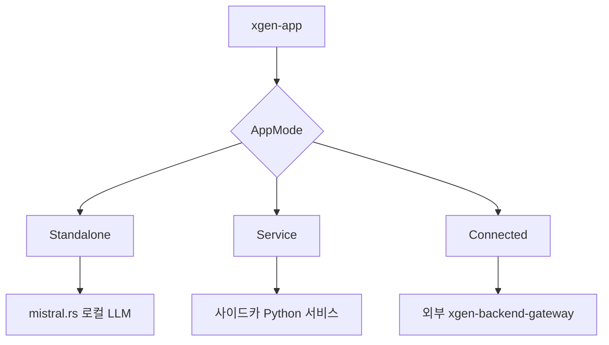

## 배경

XGEN 2.0을 롯데홈쇼핑에 납품하면서 웹 서비스 외에 데스크톱 앱 형태의 클라이언트도 필요했다. Tauri 2.0으로 개발한 xgen-app을 Linux 서버에 설치 가능한 패키지로 배포해야 했다.

Tauri는 기본적으로 `targets: "all"`로 설정하면 현재 운영체제에서 지원하는 모든 패키지 형식을 빌드한다. macOS에서 빌드하면 `.app`과 `.dmg`만 나오고, Linux에서 빌드하면 `.deb`와 `.rpm`이 나온다.

문제는 CI 환경이 macOS 기반이었고, 여기서 `targets: "all"`로 빌드하면 Linux 패키지가 나오지 않는다. 명시적으로 `["deb", "rpm"]`을 지정해야 했다. 또한 xgen-app은 일반적인 Tauri 앱과 다르게 프론트엔드를 로컬에서 서빙하지 않고 외부 서버에 있는 웹앱을 WebView로 로드하는 구조였다.

## Tauri 앱 구조

xgen-app은 두 가지 모드로 동작한다.



- **Standalone**: 앱 내에 mistral.rs를 내장해서 로컬 LLM을 직접 실행
- **Service**: xgen-workflow 등 Python 서비스를 사이드카로 자동 시작
- **Connected**: 외부 XGEN 서버(K3s 클러스터)에 WebView로 접속

롯데홈쇼핑 납품용은 Connected 모드다. 앱을 설치하면 WebView가 열리고, 내부 네트워크에 있는 `https://jeju-xgen.x2bee.com`을 직접 로드한다.

## tauri.conf.json 설정

### 핵심 변경: targets

```json
{
  "bundle": {
    "active": true,
    "targets": ["deb", "rpm"],
    "resources": [".env"],
    "icon": [
      "icons/32x32.png",
      "icons/128x128.png",
      "icons/128x128@2x.png",
      "icons/icon.icns",
      "icons/icon.ico"
    ]
  }
}
```

`"targets": "all"` 대신 `["deb", "rpm"]`으로 명시했다. 이렇게 하면 어떤 OS에서 빌드하든 지정된 형식만 생성한다.

macOS에서 deb 빌드를 시도하면 당연히 실패한다. `targets: "all"`은 빌드 환경에 따라 결과가 달라지므로 Linux 패키지가 필요하다면 명시적으로 지정하거나 Linux CI 환경에서 빌드해야 한다.

### Remote WebView 설정

일반적인 Tauri 앱은 `frontendDist`가 번들된 HTML 파일을 가리킨다. xgen-app은 외부 URL을 가리킨다.

```json
{
  "build": {
    "frontendDist": "https://xgen.x2bee.com",
    "devUrl": "https://xgen.x2bee.com",
    "beforeDevCommand": "",
    "beforeBuildCommand": ""
  }
}
```

`beforeDevCommand`와 `beforeBuildCommand`가 비어있다. 로컬 Next.js 서버를 띄울 필요가 없기 때문이다. `tauri dev`를 실행하면 곧바로 외부 URL을 WebView로 로드한다.

이 구조의 장점은 프론트엔드 업데이트가 데스크톱 앱 배포 없이 서버 배포만으로 반영된다는 점이다. 앱은 WebView 컨테이너 역할만 한다.

### CSP 비활성화

```json
{
  "app": {
    "windows": [
      {
        "title": "XGEN",
        "width": 1280,
        "height": 800
      }
    ],
    "security": {
      "csp": null
    }
  }
}
```

외부 URL을 로드할 때 Tauri의 기본 CSP(Content Security Policy)가 외부 도메인을 차단할 수 있다. 내부 서비스라 CSP를 비활성화했다. 공개 서비스였다면 허용할 도메인을 명시했을 것이다.

## Cargo.toml 의존성

```toml
[package]
name = "app"
edition = "2021"
rust-version = "1.77.2"

[dependencies]
tauri = { version = "2.8.5", features = ["tray-icon"] }
tauri-plugin-shell = "2"
tauri-plugin-http = "2.5.5"
tokio = { version = "1", features = ["full"] }
axum = "0.8"
dotenvy = "0.15"
rusqlite = { version = "0.32", features = ["bundled"] }

# LLM (Standalone 모드용)
mistralrs = { git = "https://github.com/EricLBuehler/mistral.rs" }

[features]
cuda = ["mistralrs/cuda"]
metal = ["mistralrs/metal"]
```

`tray-icon` 피처는 시스템 트레이 아이콘을 위해 필요하다. 앱을 닫아도 트레이에 남아있고, 클릭하면 창이 다시 열린다.

`mistralrs`는 로컬 LLM 실행을 위한 의존성이다. Connected 모드에서는 사용하지 않지만 같은 바이너리에 포함되어 있다. `cuda`와 `metal` feature flag로 GPU 가속을 선택적으로 활성화한다.

## 빌드 명령

```bash
# Linux deb/rpm 패키지 빌드
cargo tauri build

# 빌드 결과물
target/release/bundle/
├── deb/
│   └── app_0.1.0_amd64.deb
└── rpm/
    └── app-0.1.0-1.x86_64.rpm
```

### deb 패키지 설치

```bash
sudo dpkg -i app_0.1.0_amd64.deb

# 설치 후 실행
xgen
# 또는 애플리케이션 메뉴에서 XGEN 실행
```

### rpm 패키지 설치

```bash
sudo rpm -i app-0.1.0-1.x86_64.rpm
# 또는
sudo dnf install app-0.1.0-1.x86_64.rpm
```

## 삽질: 쿠키 vs localStorage

Release 빌드에서 인증 토큰 저장이 제대로 동작하지 않았다.

개발 환경에서는 `http://localhost:3000`으로 접속하니까 쿠키가 정상적으로 동작했다. 하지만 Tauri 앱으로 패키징하면 프로토콜이 `tauri://localhost`로 바뀐다. 이 경우 일부 쿠키 설정(SameSite, Secure 등)이 브라우저와 다르게 동작한다.

외부 URL(`https://xgen.x2bee.com`)을 로드하는 Connected 모드에서는 도메인이 일치해서 쿠키가 동작했지만, 로컬 번들 모드에서는 `document.cookie` 접근이 제한됐다.

결국 localStorage를 1차 저장소로 쓰고, 쿠키가 동작하면 추가로 동기화하는 방식을 택했다.

## 삽질: tauri-plugin-http 버전 불일치

```
Error: plugin `http` not found in capabilities
```

`package.json`의 `@tauri-apps/plugin-http` 버전과 `Cargo.toml`의 `tauri-plugin-http` 버전이 정확히 맞아야 한다.

```json
// package.json
"@tauri-apps/plugin-http": "^2.5.5"
```

```toml
# Cargo.toml
tauri-plugin-http = "2.5.5"
```

마이너 버전까지 맞추지 않으면 capabilities 파일에서 플러그인을 찾지 못하는 오류가 난다. Tauri 2.0은 JS/Rust 플러그인 버전 쌍이 맞아야 한다.

## resources에 .env 포함

```json
"resources": [".env"]
```

앱 번들에 `.env` 파일을 포함시켰다. 접속할 서버 URL, 기본 설정값 등을 `.env`로 관리하고 앱 설치 시 함께 배포한다.

Rust에서는 `dotenvy` 크레이트로 이 파일을 읽는다.

```rust
// src-tauri/src/main.rs
fn main() {
    // 실행 파일 옆에 있는 .env 로드
    let exe_dir = std::env::current_exe()
        .unwrap()
        .parent()
        .unwrap()
        .to_path_buf();
    dotenvy::from_path(exe_dir.join(".env")).ok();

    // 이후 std::env::var("SERVER_URL") 등으로 접근
}
```

## 결과

- `targets: ["deb", "rpm"]` 명시로 Linux 패키지 빌드 환경 독립성 확보
- Remote WebView 구조로 프론트엔드 업데이트가 앱 재배포 없이 반영
- `.env` 번들로 서버 URL 등 환경별 설정을 패키지에 포함
- `tray-icon`으로 백그라운드 실행 UX 구현

Tauri는 Electron보다 훨씬 작은 바이너리를 만들지만, 플러그인 버전 관리나 WebView 동작 방식에서 브라우저와 미묘하게 다른 부분이 있어서 이 차이를 파악하는 데 시간이 걸렸다.
