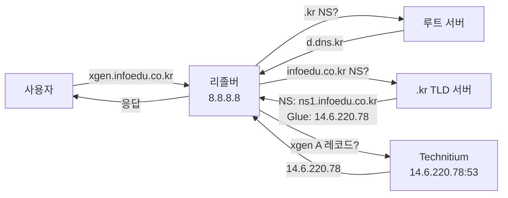
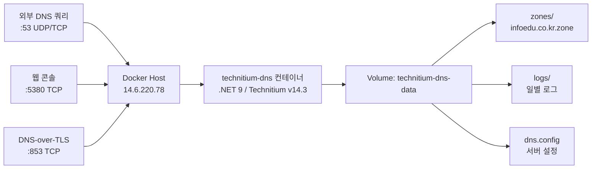
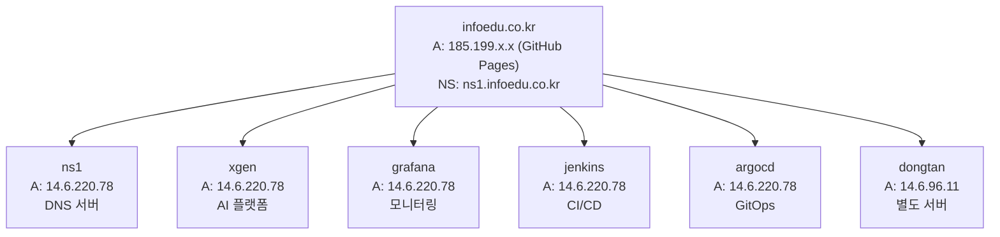

## 개요

홈서버(14.6.220.78)에서 K3s 기반 서비스를 운영하고 있다. xgen, grafana, jenkins, argocd 등 서브도메인이 하나둘 늘어나면서, 매번 가비아 웹 콘솔에 들어가 A 레코드를 수동으로 추가하는 것이 비효율적으로 느껴졌다.

더 큰 문제는 자동화가 불가능하다는 점이었다. Let's Encrypt 와일드카드 인증서를 발급하려면 DNS-01 Challenge가 필요한데, 가비아는 DNS API를 제공하지 않는다. certbot이 TXT 레코드를 자동으로 추가/삭제할 수 없으니 매번 수동으로 처리해야 한다.

결국 자체 DNS 서버를 구축하기로 했다. 여러 선택지 중 **Technitium DNS Server**를 골랐고, 2026-02-01에 Docker로 배포해서 현재 20일 이상 무장애로 운영 중이다.

> DNS 기초 개념(도메인 구조, 레코드 종류, TTL, DNS 조회 과정)은 [이전 글](./DNS-도메인-SSL-인증서-네임서버-충돌로-Lets-Encrypt-발급-실패한-이야기.md)에서 다뤘다. 이 글은 Technitium DNS 서버의 구축, Zone 설계, 실제 운영에 집중한다.

---

## 왜 자체 DNS인가

### 가비아 DNS의 한계

가비아에서 도메인을 구매하면 기본 네임서버(`ns.gabia.co.kr`)가 설정된다. 안정적이고 무료지만 몇 가지 한계가 있다.

- **API 없음**: 레코드 추가/수정/삭제가 웹 콘솔에서만 가능하다. 자동화 스크립트를 짤 수 없다.
- **DNS-01 Challenge 불가**: Let's Encrypt 와일드카드 인증서 발급 시 certbot이 TXT 레코드를 자동으로 조작해야 하는데, API가 없으니 불가능하다.
- **반영 지연**: 웹 콘솔에서 레코드를 변경해도 실제 반영까지 시간이 걸린다.
- **세부 설정 부족**: TTL 커스터마이징, 조건부 응답, 쿼리 로그 등 고급 기능을 사용할 수 없다.

### 자체 DNS의 장단점

자체 DNS를 운영하면 도메인의 생명줄을 직접 관리하게 된다.

장점:

- 레코드 즉시 반영 (웹 콘솔에서 저장하면 바로 적용)
- HTTP API 제공 (certbot DNS-01 자동화 가능)
- 쿼리 로그, 통계, 블록리스트 등 부가 기능
- DNS를 직접 운영하면서 배우는 것 자체가 가치

단점:

- **서버 다운 = DNS 다운**: 홈서버가 꺼지면 도메인 전체가 먹통이 된다
- 보안 관리 책임 (DNS 서버는 공격 대상이 될 수 있다)
- 네트워크 장애 시 외부에서 도메인 접근 불가

홈서버 환경에서 자체 DNS가 합리적인 조건은 명확하다. 서브도메인을 자주 추가하고, DNS 자동화가 필요하며, 서버 가용성을 직접 관리할 의지가 있을 때다.

### Technitium을 선택한 이유

자체 DNS 서버로 고려한 선택지는 네 가지였다.

- **BIND9**: DNS의 레퍼런스 구현. 가장 오래되고 안정적이지만, 설정 파일(named.conf)이 복잡하고 웹 UI가 없다.
- **CoreDNS**: Kubernetes 내부 DNS로 널리 쓰인다. 경량이지만 권한 DNS 서버 용도로는 플러그인 구성이 번거롭다.
- **PowerDNS**: 기업 환경에서 많이 쓴다. 기능이 풍부하지만 구성 요소가 여러 개(Authoritative + Recursor)로 나뉘어 있다.
- **Technitium DNS Server**: .NET 기반, Docker 이미지 제공, 웹 관리 콘솔 내장, HTTP API, DoT/DoH 기본 지원.

Technitium을 선택한 결정적 이유는 **Docker 한 줄 배포 + 웹 콘솔**이다. BIND9처럼 zone 파일을 텍스트로 편집할 필요 없이, 브라우저에서 레코드를 추가하고 바로 반영된다. HTTP API도 기본 제공되어 certbot 연동도 가능하다.

---

## 아키텍처

외부에서 `xgen.infoedu.co.kr`에 접속하면 다음과 같은 DNS 조회 흐름을 거친다.



실제 `dig +trace` 결과로 확인하면:

```bash
$ dig @8.8.8.8 infoedu.co.kr NS +trace
# ...
# .kr TLD 서버가 NS 2개를 응답한다
infoedu.co.kr.  86400  IN  NS  ns1.infoedu.co.kr.
infoedu.co.kr.  86400  IN  NS  ns.gabia.co.kr.
# ...
# Technitium(14.6.220.78)이 최종 응답
infoedu.co.kr.  14400  IN  NS  ns1.infoedu.co.kr.
;; Received 76 bytes from 14.6.220.78#53(ns1.infoedu.co.kr) in 0 ms
```

여기서 핵심은 **Glue Record**다.

### Glue Record란

`ns1.infoedu.co.kr`은 `infoedu.co.kr`의 서브도메인이다. 그런데 `infoedu.co.kr`의 네임서버가 `ns1.infoedu.co.kr`이라면, 리졸버 입장에서는 닭-달걀 문제에 빠진다.

```
"infoedu.co.kr의 IP를 알려면 ns1.infoedu.co.kr에 물어봐야 하는데,
 ns1.infoedu.co.kr의 IP를 알려면 infoedu.co.kr의 NS를 찾아야 하고..."
```

이 순환을 끊는 것이 Glue Record다. 도메인 레지스트라(가비아)에서 NS를 등록할 때, 해당 NS의 IP도 함께 등록한다. `.kr` TLD 서버는 NS 응답을 보낼 때 Additional Section에 이 IP를 포함시켜 리졸버가 바로 Technitium에 접속할 수 있게 한다.

```
.kr TLD 응답:
  ANSWER:     infoedu.co.kr  NS  ns1.infoedu.co.kr
  ADDITIONAL: ns1.infoedu.co.kr  A  14.6.220.78  <- Glue Record
```

---

## Docker Compose로 배포

Technitium의 가장 큰 장점 중 하나는 Docker 이미지가 공식으로 제공된다는 점이다. docker-compose.yml 하나로 배포가 끝난다.



### docker-compose.yml

```yaml
services:
  technitium-dns:
    image: technitium/dns-server:latest
    container_name: technitium-dns
    hostname: ns1.infoedu.co.kr
    restart: unless-stopped
    ports:
      - "53:53/udp"       # DNS 쿼리 (UDP, 표준)
      - "53:53/tcp"       # DNS 쿼리 (TCP, 큰 응답용)
      - "5380:5380/tcp"   # 웹 관리 콘솔
      - "443:443/tcp"     # DNS-over-HTTPS (DoH)
      - "853:853/tcp"     # DNS-over-TLS (DoT)
    volumes:
      - technitium-data:/etc/dns
    environment:
      - DNS_SERVER_DOMAIN=ns1.infoedu.co.kr
      - DNS_SERVER_ADMIN_PASSWORD=초기비밀번호
      - DNS_SERVER_PREFER_IPV6=false
      - DNS_SERVER_LOG_USING_LOCAL_TIME=true
    sysctls:
      - net.ipv4.ip_local_port_range=1024 65000

volumes:
  technitium-data:
    name: technitium-dns-data
```

각 설정의 의미:

- **`hostname: ns1.infoedu.co.kr`**: 컨테이너의 호스트명. Technitium이 SOA 레코드의 Primary NS로 사용한다.
- **포트 53 (UDP/TCP)**: 표준 DNS 포트. UDP가 기본이고, 응답이 512바이트를 초과하면 TCP로 재시도한다.
- **포트 5380**: Technitium 웹 관리 콘솔. Zone 관리, 로그 조회, 설정 변경 등을 브라우저에서 할 수 있다.
- **포트 853 (DoT)**: DNS-over-TLS. DNS 쿼리 자체를 TLS로 암호화한다. TLS 인증서 설정이 필요하다.
- **포트 443 (DoH)**: DNS-over-HTTPS. HTTPS를 통해 DNS 쿼리를 보낸다. 역시 TLS 인증서가 필요하다.
- **`DNS_SERVER_DOMAIN`**: Technitium이 내부적으로 사용하는 서버 식별자. SOA의 MNAME 필드에 반영된다.
- **`DNS_SERVER_PREFER_IPV6=false`**: IPv6 우선 사용을 비활성화한다. 홈서버 환경에서 IPv6가 불안정할 수 있기 때문이다.
- **`DNS_SERVER_LOG_USING_LOCAL_TIME=true`**: 로그를 UTC 대신 서버 로컬 시간으로 기록한다.
- **`sysctls: net.ipv4.ip_local_port_range`**: Technitium이 재귀 쿼리(외부 DNS에 질의)할 때 사용하는 임시 포트(ephemeral port) 범위를 확대한다. 기본값(32768~60999)보다 넓게 잡아 포트 고갈을 방지한다.
- **Named Volume `technitium-dns-data`**: Zone 데이터, 로그, 설정 파일이 저장된다. 컨테이너를 재생성해도 데이터가 유지된다.

### 초기 구동

```bash
docker compose up -d
```

구동 후 브라우저에서 `http://서버IP:5380`으로 접속하면 웹 콘솔이 열린다. 초기 비밀번호를 즉시 변경하고, Zone 설정을 시작한다.

### 데이터 구조

Technitium의 데이터는 Named Volume에 저장된다. 실제 경로는 `/var/lib/docker/volumes/technitium-dns-data/_data/`다.

```
technitium-dns-data/
├── zones/
│   └── infoedu.co.kr.zone     <- Primary Zone (바이너리 형식)
├── logs/
│   ├── 2026-02-01.log         <- 일별 로그 (텍스트)
│   ├── 2026-02-07.log
│   └── ...
├── stats/                      <- 시간별 쿼리 통계
├── dns.config                  <- DNS 서버 설정 (바이너리)
├── auth.config                 <- 인증 설정
├── cache.bin                   <- DNS 캐시
└── apps/                       <- 플러그인
```

Zone 파일이 BIND의 텍스트 형식이 아니라 바이너리라는 점이 특이하다. 직접 편집하는 대신 웹 콘솔이나 API로 조작하는 설계다. 백업은 웹 콘솔의 Settings > Backup 기능이나 Docker Volume 자체를 백업하면 된다.

---

## Zone 설계 -- infoedu.co.kr

Technitium 웹 콘솔에서 `infoedu.co.kr`을 Primary Zone으로 생성하고, 아래 레코드들을 등록했다.



### 전체 레코드

```bash
$ dig @14.6.220.78 infoedu.co.kr ANY +noall +answer
infoedu.co.kr.      600    IN  A    185.199.108.153
infoedu.co.kr.      600    IN  A    185.199.109.153
infoedu.co.kr.      600    IN  A    185.199.110.153
infoedu.co.kr.      600    IN  A    185.199.111.153
infoedu.co.kr.      14400  IN  NS   ns1.infoedu.co.kr.
infoedu.co.kr.      900    IN  SOA  ns1.infoedu.co.kr. hostadmin.infoedu.co.kr. 14 900 300 604800 900
```

서브도메인별 A 레코드:

| 서브도메인 | IP | 용도 |
|-----------|-----|------|
| (루트) `infoedu.co.kr` | 185.199.108~111.153 | GitHub Pages 블로그 |
| `ns1` | 14.6.220.78 | Technitium DNS 서버 자체 |
| `xgen` | 14.6.220.78 | XGEN 2.0 AI 에이전트 플랫폼 |
| `grafana` | 14.6.220.78 | Grafana 모니터링 대시보드 |
| `jenkins` | 14.6.220.78 | Jenkins CI/CD |
| `argocd` | 14.6.220.78 | ArgoCD GitOps |
| `dongtan` | 14.6.96.11 | 동탄 서버 (별도 네트워크) |

### 서브도메인 전략

구조를 보면 대부분의 서브도메인이 동일한 IP(14.6.220.78)를 가리킨다. 하나의 공인 IP에 여러 서비스가 올라가 있고, K3s 위의 Istio Ingress Gateway가 Host 헤더를 보고 각 서비스로 트래픽을 분기한다.

```
xgen.infoedu.co.kr    ->  14.6.220.78:443  ->  Istio Gateway  ->  xgen-frontend Pod
grafana.infoedu.co.kr ->  14.6.220.78:443  ->  Istio Gateway  ->  grafana Pod
jenkins.infoedu.co.kr ->  14.6.220.78:443  ->  Istio Gateway  ->  jenkins Pod
```

`dongtan.infoedu.co.kr`만 다른 IP(14.6.96.11)를 가리킨다. 물리적으로 다른 위치에 있는 서버다. 자체 DNS의 장점이 여기서 드러난다. 어떤 IP든 자유롭게 레코드를 추가할 수 있다.

루트 도메인(`infoedu.co.kr`)은 GitHub Pages IP 4개를 A 레코드로 등록했다. 블로그(MkDocs Material)가 GitHub Pages에 배포되어 있기 때문이다.

### SOA 레코드 설계

```
ns1.infoedu.co.kr. hostadmin.infoedu.co.kr. 14 900 300 604800 900
```

| 필드 | 값 | 의미 |
|------|-----|------|
| MNAME | ns1.infoedu.co.kr | Primary 네임서버 |
| RNAME | hostadmin.infoedu.co.kr | 관리자 이메일 (hostadmin@infoedu.co.kr) |
| Serial | 14 | Zone 수정 횟수 (현재 14번째) |
| Refresh | 900 (15분) | Secondary NS가 Primary에 변경 확인하는 주기 |
| Retry | 300 (5분) | Refresh 실패 시 재시도 간격 |
| Expire | 604800 (7일) | Secondary가 Primary에 연결 못하면 Zone 폐기 |
| Minimum TTL | 900 (15분) | Negative 캐시 TTL (존재하지 않는 레코드의 캐시 시간) |

### TTL 전략

| 레코드 | TTL | 이유 |
|--------|-----|------|
| A 레코드 | 600 (10분) | IP 변경 시 빠른 반영. 홈서버는 IP가 바뀔 수 있다 |
| NS 레코드 | 14400 (4시간) | NS는 자주 변경되지 않으므로 길게 설정 |
| SOA | 900 (15분) | Zone 메타데이터, 적당한 캐시 |

A 레코드 TTL을 10분으로 짧게 잡은 이유가 있다. 홈서버 환경에서는 ISP가 공인 IP를 변경할 수 있고, 서버를 다른 네트워크로 이전할 수도 있다. TTL이 짧으면 IP 변경 후 10분 이내에 전 세계 DNS 캐시가 갱신된다.

---

## 가비아에서 Technitium으로 -- 네임서버 전환 과정

Technitium 서버를 띄웠다고 끝이 아니다. 외부에서 `infoedu.co.kr`을 조회할 때 이 서버로 질의가 오도록 **레지스트리에 NS를 등록**해야 한다.

### 전환 절차

1. **Technitium에 Zone 생성**: 웹 콘솔에서 `infoedu.co.kr` Primary Zone을 만들고, 모든 레코드(A, NS, SOA 등)를 등록한다.

2. **가비아에서 네임서버 변경**: 도메인 관리 > 네임서버 설정에서 자체 NS를 추가한다.
   ```
   1차 네임서버: ns1.infoedu.co.kr
   호스트 IP: 14.6.220.78        <- Glue Record
   ```

3. **Glue Record 등록**: 가비아 UI에서 네임서버를 등록할 때, 해당 NS가 자기 도메인의 서브도메인이면 IP 입력란이 나타난다. 여기에 14.6.220.78을 입력하면 `.kr` TLD에 Glue Record가 등록된다.

4. **전파 확인**: 변경 후 수 시간 내에 전파된다. 여러 DNS 서버에서 확인한다.
   ```bash
   dig @8.8.8.8 infoedu.co.kr NS +short
   dig @1.1.1.1 infoedu.co.kr NS +short
   dig @9.9.9.9 infoedu.co.kr NS +short
   ```

### 현재 상태 -- 이중 등록

솔직한 현재 상태를 기록한다. `.kr` TLD에 NS가 2개 등록되어 있다.

```
infoedu.co.kr.  86400  IN  NS  ns1.infoedu.co.kr.   <- Technitium
infoedu.co.kr.  86400  IN  NS  ns.gabia.co.kr.      <- 가비아
```

이 이중 등록 상태는 문제를 일으킬 수 있다. 리졸버가 랜덤으로 네임서버를 선택하는데, Technitium에만 있는 레코드를 조회할 때 가비아로 질의가 가면 응답이 없다. 이 문제의 상세한 분석은 [네임서버 충돌로 Let's Encrypt 발급이 실패한 이야기](./DNS-도메인-SSL-인증서-네임서버-충돌로-Lets-Encrypt-발급-실패한-이야기.md)에서 다뤘다.

최종 목표는 가비아 NS를 제거하고 Technitium 단독으로 전환하는 것이다. 현재는 가비아 DNS에도 주요 레코드를 동일하게 등록해서 양쪽 모두 정상 응답하도록 유지하고 있다.

---

## 트러블슈팅

### PTR 역조회 실패 -- Docker 내부 IP

Technitium 로그에서 주기적으로 다음 에러가 발생한다.

```
DNS Server failed to resolve the request
  '1.0.22.172.in-addr.arpa. PTR IN'.
DnsClientNoResponseException: no response from name servers
  [blackhole-2.iana.org (192.175.48.42),
   blackhole-1.iana.org (192.175.48.6)]
  at delegation 22.172.in-addr.arpa.
```

원인은 Docker 내부 네트워크다. Technitium 컨테이너가 Docker bridge 네트워크(172.22.0.x)에 연결되어 있고, 접속자의 PTR(역방향 DNS) 조회를 시도한다. 그런데 172.16.0.0/12는 RFC 1918 사설 IP 대역이라 공개 DNS에서 역조회가 불가능하다. IANA의 blackhole 서버로 리다이렉트되어 타임아웃이 발생한다.

운영 영향은 없다. 에러 로그가 쌓이지만 DNS 서비스 자체에는 영향이 없다. 깔끔하게 처리하려면 Technitium에서 사설 대역용 Reverse Zone을 추가하거나, PTR 조회를 비활성화하면 된다.

### 포트 53 충돌 -- systemd-resolved

Ubuntu에서 자체 DNS 서버를 구축할 때 거의 반드시 만나는 문제다. `systemd-resolved`가 127.0.0.53:53을 점유하고 있어서 Technitium이 0.0.0.0:53에 바인딩할 때 충돌이 발생할 수 있다.

확인 방법:

```bash
sudo lsof -i :53
# 또는
sudo ss -tlnp | grep :53
```

`systemd-resolved`가 53번 포트를 잡고 있다면, 두 가지 해결 방법이 있다.

**방법 1: DNSStubListener 비활성화** (권장)

```bash
sudo mkdir -p /etc/systemd/resolved.conf.d/
cat << 'EOF' | sudo tee /etc/systemd/resolved.conf.d/disable-stub.conf
[Resolve]
DNSStubListener=no
EOF
sudo systemctl restart systemd-resolved
```

이렇게 하면 `systemd-resolved`는 동작하지만 53번 포트 리스닝을 중단한다. `/etc/resolv.conf`를 Technitium(127.0.0.1)을 가리키도록 수정하면 서버 자체의 DNS 조회도 Technitium을 통하게 된다.

**방법 2: systemd-resolved 완전 비활성화**

```bash
sudo systemctl disable --now systemd-resolved
```

이 경우 `/etc/resolv.conf`를 직접 관리해야 한다.

### 네임서버 이중 등록

`.kr` TLD에 NS가 2개(Technitium + 가비아) 등록되어 50% 확률로 다른 서버에 쿼리가 가는 문제. 상세 분석과 해결은 [별도 글](./DNS-도메인-SSL-인증서-네임서버-충돌로-Lets-Encrypt-발급-실패한-이야기.md)에 기록했다.

### 웹 콘솔 token 오류

```
DnsWebServiceException: Parameter 'token' missing.
```

브라우저가 이전 세션의 API 토큰 없이 요청을 보내는 경우 발생한다. 브라우저 새로고침 후 재로그인하면 해소된다. 실질적 문제는 아니다.

---

## 운영 현황

### 20일 운영 타임라인

Technitium 로그를 기반으로 주요 이벤트를 정리했다.

```
2026-02-01  초기 구축
            - Docker Compose로 배포
            - infoedu.co.kr Primary Zone 생성
            - 기존 레코드(infoedu.co.kr, ns1, xgen, grafana, jenkins, argocd) 등록
            - 관리자 비밀번호 변경

2026-02-07  컨테이너 재생성 (이미지 업데이트)

2026-02-08  안정 운영 진입

2026-02-21  dongtan.infoedu.co.kr A 레코드 추가 (14.6.96.11)
            - 동탄 서버 HTTPS 적용을 위한 DNS 등록
            - 관리자 비밀번호 재변경
```

SOA Serial이 14인 것으로 보아, 20일간 14번의 Zone 수정이 있었다. 평균 이틀에 한 번꼴이다.

### 자동 복구

`restart: unless-stopped` 정책으로 Docker 데몬이 재시작되거나 서버가 재부팅되면 자동으로 컨테이너가 올라온다. Named Volume 덕분에 Zone 데이터와 설정도 그대로 유지된다.

실제로 5일 이상 연속 가동 중이고(`Up 5 days`), 그 전에도 서버 재부팅 후 자동 복구가 정상 동작했다.

### 간단 모니터링

별도 모니터링 도구 없이도 `dig`로 상태를 확인할 수 있다.

```bash
# 로컬에서 응답 확인
dig @127.0.0.1 xgen.infoedu.co.kr A +short
# 14.6.220.78

# 외부에서 응답 확인 (Technitium을 거치는지)
dig @8.8.8.8 xgen.infoedu.co.kr A +short +trace
```

웹 콘솔(5380 포트)의 Dashboard에서 쿼리 통계, 캐시 상태, 상위 질의 도메인 등을 실시간으로 확인할 수 있다.

---

## 향후 계획

### 가비아 NS 완전 제거

현재 `.kr` TLD에 가비아 NS가 함께 등록되어 있다. 모든 레코드를 양쪽에 동기화한 상태지만, 장기적으로 Technitium 단독 NS로 전환해야 한다. 관리 포인트를 하나로 줄이는 것이 목표다.

### DoT/DoH 활성화

Docker Compose에 포트 853(DoT)과 443(DoH)이 이미 열려있지만, TLS 인증서를 설정하지 않아 실제로는 사용할 수 없는 상태다. Let's Encrypt 인증서를 발급받아 Technitium에 적용하면 암호화된 DNS 쿼리를 지원할 수 있다.

### DNS-01 Challenge 자동화

Technitium은 HTTP API를 제공한다. certbot의 DNS-01 플러그인과 연동하면 와일드카드 인증서(`*.infoedu.co.kr`) 자동 발급이 가능해진다. 이것이 자체 DNS를 구축한 가장 큰 동기 중 하나다.

```
certbot → Technitium API → TXT 레코드 자동 추가
→ Let's Encrypt 검증 → 인증서 발급
→ Technitium API → TXT 레코드 자동 삭제
```

### DNSSEC 적용

DNSSEC(DNS Security Extensions)은 DNS 응답에 디지털 서명을 추가하여 변조를 방지한다. Technitium이 DNSSEC 서명을 지원하므로, Zone에 대한 서명 키를 생성하고 `.kr` 레지스트리에 DS 레코드를 등록하면 적용할 수 있다.

### 세컨더리 NS 추가

현재 NS가 `ns1.infoedu.co.kr` 하나뿐이다. 이 서버가 다운되면 DNS 전체가 먹통이 된다. 가용성을 높이려면 물리적으로 다른 위치에 세컨더리 NS를 두는 것이 좋다. 클라우드 VM(Oracle Cloud 무료 티어 등)에 Technitium을 하나 더 띄우고 Secondary Zone으로 동기화하는 방안을 검토 중이다.

---

## 정리

자체 DNS는 "서버 운영자의 근본 인프라"다. 도메인의 생명줄을 직접 관리한다는 의미이고, 그만큼 책임도 따른다.

Technitium DNS Server는 홈서버 환경에서 자체 DNS를 운영하기에 적합한 선택이었다. Docker 한 줄 배포, 웹 콘솔, HTTP API, DoT/DoH 기본 지원이라는 장점이 BIND9의 복잡한 설정 파일 편집을 대체한다.

20일간 운영하면서 확인한 체크리스트:

- Glue Record 등록 확인 (자기 도메인 안의 NS는 반드시 Glue 필요)
- NS 이중 등록 방지 (양쪽 NS의 레코드가 반드시 동일해야 함)
- 포트 53 충돌 확인 (`systemd-resolved`의 DNSStubListener)
- PTR 역조회 에러 대응 (Docker 사설 IP 대역)
- `restart: unless-stopped`로 자동 복구 보장
- **서버 가용성 = DNS 가용성**이라는 인식

관련 글:

- [DNS, 도메인, SSL 인증서 -- 네임서버 충돌로 Let's Encrypt 발급이 실패한 이야기](./DNS-도메인-SSL-인증서-네임서버-충돌로-Lets-Encrypt-발급-실패한-이야기.md)
- [Docker + nginx HTTPS 적용기 -- snap Docker 교체부터 Let's Encrypt 자동 갱신까지](./Docker-nginx-HTTPS-적용기-snap-Docker-교체부터-Lets-Encrypt-자동-갱신까지.md)
- [홈서버 SSH 보안 강화 -- 키 인증, fail2ban, 포트 우회](./홈서버-SSH-보안-강화-키-인증-fail2ban-포트-우회.md)
