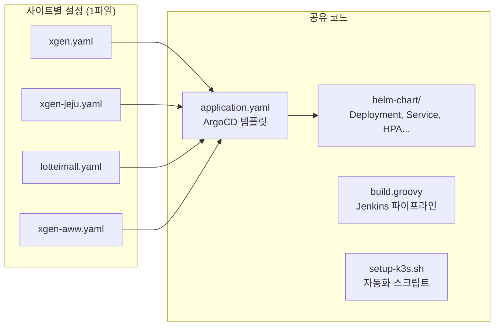

# XGEN 멀티사이트 배포 자동화 — 하나의 코드베이스로 N개 고객사 운영하기

## 개요

XGEN 플랫폼은 처음에 하나의 서버, 하나의 환경(dev/prd)만 있었다. 그러다 고객사가 늘기 시작했다. 제주 서버에 독립 배포가 필요해졌고, 롯데이마트에 전용 환경을 구축해야 했고, AWS EKS에 새 고객사를 올려야 했다.

문제는 인프라 코드를 복사해서 각 사이트마다 별도로 관리하기 시작하면 걷잡을 수 없이 발산한다는 것이다. Helm 차트를 고치면 4군데를 다 고쳐야 하고, 새 서비스를 추가하면 4개의 설정 파일을 맞춰야 한다.

이 글에서는 **하나의 인프라 코드베이스**로 4개 사이트를 운영하는 멀티사이트 배포 아키텍처를 설계하고 자동화한 과정을 정리한다.

---

## 현재 운영 중인 사이트

| 사이트 | 인프라 | 도메인 | 특이사항 |
|---|---|---|---|
| **xgen** (본사) | 온프레미스 K3s | xgen.x2bee.com | GPU 서버, 모델 서빙 포함 |
| **xgen-jeju** (제주) | 온프레미스 K3s | IP 직접 접속 | 도메인 없음, 모델 서빙 제외 |
| **lotteimall** (롯데이마트) | 온프레미스 K3s | agent.lotteimall.com | 독립 네임스페이스 |
| **xgen-aww** (AWS) | AWS EKS | xgen.lamitie.kr | S3 스토리지, 외부 DB |

4개 사이트가 공유하는 것: Helm 차트, ArgoCD 템플릿, Jenkins 빌드 파이프라인, setup 스크립트

4개 사이트가 다른 것: 도메인, 이미지 레지스트리, 인프라 주소(DB/Redis/스토리지), 서비스 목록, 리소스 설정

---

## 아키텍처: "사이트별 YAML 한 장"

핵심 설계 원칙은 **사이트별 차이점을 단일 YAML 파일에 집중시키는 것**이다.



각 사이트의 YAML 파일(`projects/{사이트}.yaml`)이 해당 사이트의 모든 설정을 담고 있다. ArgoCD 템플릿은 이 YAML을 values로 읽어서 서비스별 Application을 생성하고, Helm 차트는 그 Application이 가리키는 공통 템플릿으로 실제 K8s 리소스를 렌더링한다.

### 사이트 YAML의 구조

```yaml
# projects/xgen-jeju.yaml (예시)
project:
  name: xgen
  namespace: xgen
  repoURL: https://gitlab.x2bee.com/xgen2.0/xgen-infra.git

site: main                    # 이미지 레지스트리 경로 세그먼트

destinations:
  prd:
    server: https://kubernetes.default.svc
    domain: "*"               # 도메인 없음 (IP 직접 접속)

vars:                         # 사이트 공통 환경변수
  APP_SITE: "xgen-jeju"

environments:
  prd:
    services:                 # 이 사이트에 배포할 서비스 목록
      - name: xgen-frontend
        hasDomain: true
        resources:
          requests: { memory: "256Mi", cpu: "100m" }
          limits: { memory: "1Gi", cpu: "500m" }
      - name: xgen-backend-gateway
      - name: xgen-core
      - name: xgen-workflow
      - name: xgen-documents
      - name: xgen-mcp-station
      # xgen-model 없음 — GPU가 없는 서버
```

이 파일 하나로 결정되는 것들:

1. **어떤 서비스를 배포할지** — `environments.{env}.services[]`
2. **어떤 도메인을 쓸지** — `destinations.{env}.domain`
3. **어떤 환경변수를 주입할지** — `vars`
4. **인프라 주소는 뭔지** — `infra` (DB, Redis, MinIO 등)
5. **리소스는 얼마나 줄지** — 서비스별 `resources`
6. **이미지 레지스트리는 어디인지** — `site`, `registryHost`

---

## 사이트별 차이점 설계

### 도메인

사이트마다 도메인 설정이 다르다.

```yaml
# xgen (본사): 서브도메인
destinations:
  prd: { domain: "jeju-xgen.x2bee.com" }
  dev: { domain: "xgen.x2bee.com" }

# xgen-jeju: 도메인 없음
destinations:
  prd: { domain: "*" }

# lotteimall: 고객사 도메인
destinations:
  prd: { domain: "agent.lotteimall.com" }

# xgen-aww: AWS 도메인
destinations:
  aww: { domain: "xgen.lamitie.kr" }
```

`hasDomain: true`인 서비스(주로 xgen-frontend)에만 도메인이 적용된다. ArgoCD 템플릿에서 이 조건을 처리한다.

```go
{{- if and .hasDomain $domain }}
- name: domain
  value: {{ $domain | quote }}
{{- end }}
```

### 이미지 레지스트리

온프레미스 사이트들은 사내 Nexus(`docker.x2bee.com`)를 공유하지만, AWS 환경은 별도의 Nexus가 필요하다. AWS VPC 안에서 사내 Nexus에 접근할 수 없기 때문이다.

이미지 경로는 `{registryHost}/{project}/{site}/{service}:{tag}` 형식이다.

| 사이트 | registryHost | site | 이미지 경로 예시 |
|---|---|---|---|
| xgen | docker.x2bee.com | main | `docker.x2bee.com/xgen/main/xgen-core:latest-amd64` |
| lotteimall | docker.x2bee.com | lotteimall | `docker.x2bee.com/xgen/lotteimall/xgen-core:latest-amd64` |
| xgen-aww | 10.100.1.65:5000 | aww | `10.100.1.65:5000/xgen/aww/xgen-core:latest-amd64` |

`site`는 Git 브랜치명과 동일하다. 각 고객사는 전용 브랜치에서 소스를 관리하고, 빌드된 이미지는 해당 site 경로에 저장된다. `registryHost`가 지정되면 Helm 파라미터로 오버라이드한다.

```go
{{- if $.Values.registryHost }}
- name: global.registry.host
  value: {{ $.Values.registryHost | quote }}
{{- end }}
```

### 인프라 주소

온프레미스 사이트는 K8s 내부 DNS를 사용하고, AWS는 외부 VM의 IP를 직접 지정한다.

```yaml
# 온프레미스 (기본값 — 생략 가능)
# postgresql.xgen-system.svc.cluster.local:5432
# redis.xgen-system.svc.cluster.local:6379

# AWS (명시적 지정)
infra:
  postgres: { host: "10.100.1.70" }
  redis:    { host: "10.100.1.70" }
  qdrant:   { host: "10.100.1.70" }
  minio:    { endpoint: "https://s3.ap-northeast-2.amazonaws.com" }
```

Helm 차트의 `_helpers.tpl`이 `infra` 블록을 `POSTGRES_HOST`, `REDIS_HOST`, `MINIO_ENDPOINT` 등의 환경변수로 변환하여 ConfigMap에 주입한다. 애플리케이션 코드는 환경변수만 읽으면 되므로, 인프라가 K8s 내부 서비스인지 외부 VM인지 AWS 매니지드 서비스인지 알 필요가 없다.

### 서비스 목록

사이트마다 배포하는 서비스가 다를 수 있다.

| 서비스 | xgen | xgen-jeju | lotteimall | xgen-aww |
|---|---|---|---|---|
| xgen-frontend | O | O | O | O |
| xgen-backend-gateway | O | O | O | O |
| xgen-core | O | O | O | O |
| xgen-workflow | O | O | O | O |
| xgen-documents | O | O | O | O |
| xgen-mcp-station | O | O | O | O |
| **xgen-model** | **O** | X | X | X |

xgen-model은 LLM/임베딩 모델 서빙 서비스로 GPU가 필요하다. 본사 서버에만 GPU가 있으므로 나머지 사이트에서는 서비스 목록에서 제외한다. 프로젝트 YAML의 `services[]` 배열에서 빼면 ArgoCD Application 자체가 생성되지 않는다.

---

## Jenkins 빌드: SITE 파라미터

Jenkins 빌드 파이프라인은 `SITE` 파라미터 하나로 멀티사이트를 처리한다.

```groovy
choice(
    name: 'SITE',
    choices: ['main', 'lotteimall', 'aww'],
    description: '배포 대상 사이트'
)
```

`SITE`는 두 가지 역할을 한다.

1. **Git 브랜치명**: `SITE=aww`이면 `aww` 브랜치를 checkout한다. 각 고객사는 전용 브랜치에서 소스 커스터마이징을 관리한다.
2. **이미지 경로 세그먼트**: 빌드된 이미지가 `{registry}/xgen/{SITE}/{service}:{tag}`에 push된다.

사이트별로 다른 레지스트리를 사용해야 할 때는 `siteRegistries` 설정으로 오버라이드한다.

```yaml
# project.yaml (Jenkins용)
siteRegistries:
  aww:
    host: "43.202.115.195:5000"
    credentialId: "aww-nexus-credentials"
```

빌드 파이프라인에서 이 맵을 확인하고, 해당 사이트의 레지스트리와 인증 정보를 사용한다.

```groovy
def siteReg = projectConfig.siteRegistries?.get(params.SITE)
if (siteReg) {
    env.NEXUS_REGISTRY = siteReg.host
    env.NEXUS_CRED = siteReg.credentialId
} else {
    env.NEXUS_REGISTRY = projectConfig.registry.nexus.host
}
```

`build-all.groovy`는 전체 서비스를 병렬로 빌드하는 메타 파이프라인이다. 개별 서비스 Job을 트리거하면서 동일한 SITE를 전달한다.

```groovy
builds[svc] = {
    build job: svc,
        parameters: [
            string(name: 'SITE', value: params.SITE),
            // ...
        ]
}
parallel builds
```

하나의 Jenkins에서 "main 빌드" → "aww 빌드"를 SITE만 바꿔서 실행할 수 있다. 파이프라인 코드는 동일하다.

---

## setup-k3s.sh: 새 서버 자동 셋업

새 고객사 서버에 XGEN을 배포할 때 `setup-k3s.sh` 스크립트를 실행한다. K3s 설치부터 ArgoCD 배포, 서비스 배포까지 한 번에 처리하는 자동화 스크립트다.

멀티사이트 지원을 위해 `ARGOCD_PROJECT` 변수를 도입했다.

### 프로젝트 선택

스크립트 시작 시 `init-config.sh`에서 배포할 프로젝트를 선택한다.

```bash
# init-config.sh
ARGOCD_PROJECT=${project_name}  # xgen, xgen-jeju, xgen-aww, lotteimall
```

선택한 프로젝트에 따라 동작이 달라진다.

### 서비스 목록 동적 추출

프로젝트 YAML에서 서비스 목록을 동적으로 추출한다.

```bash
get_project_services() {
    local project_name="${1:-${ARGOCD_PROJECT:-xgen}}"
    local deploy_env="${DEPLOY_ENV:-prd}"
    local project_file="$PROJECT_ROOT/k3s/argocd/projects/${project_name}.yaml"
    # project_file에서 environments.{deploy_env}.services[].name 추출
}
```

xgen-jeju를 선택하면 xgen-model이 목록에서 빠지고, lotteimall을 선택하면 lotteimall 전용 설정이 적용된다. 서비스 목록이 프로젝트 YAML에서 나오기 때문에 스크립트를 수정할 필요가 없다.

### Root App 파일명 동적 결정

ArgoCD Root Application의 파일명도 프로젝트에 따라 달라진다.

```bash
if [[ "$_argocd_proj" == "xgen" ]]; then
    _root_app_name="xgen-root-${deploy_env}"
else
    _root_app_name="xgen-root-${_argocd_proj#xgen-}"
fi
```

- `xgen` → `xgen-root-dev` 또는 `xgen-root-prd`
- `xgen-jeju` → `xgen-root-jeju`
- `xgen-aww` → `xgen-root-aww`

이 Root App이 ArgoCD에 등록되면, 해당 프로젝트 YAML을 values로 읽어서 서비스별 Application을 자동 생성한다.

### 사이트 전용 프로젝트 기본값

xgen 본사가 아닌 사이트는 기본 환경이 prd다. dev/prd를 모두 운영하지 않기 때문이다.

```bash
if [[ "${project_name:-xgen}" != "xgen" ]]; then
    _default_env="3"           # 3 = prd
    _default_label="prd (사이트 전용 프로젝트 기본값)"
fi
```

---

## Istio Gateway 동적 생성

Helm 차트의 `ingress.yaml` 템플릿은 사이트별 설정에 따라 Istio Gateway와 VirtualService를 동적으로 생성하거나 스킵한다.

### 도메인이 없으면 생성하지 않음

xgen-jeju처럼 `domain: "*"`인 경우, 초기에는 Gateway를 생성했다가 문제가 됐다. IP로 직접 접속하는 환경에서는 Istio 없이 NodePort나 LoadBalancer로 충분하다.

도메인이 빈 문자열이거나 설정되지 않은 경우 Gateway/VirtualService 자체를 생성하지 않도록 조건을 추가했다.

```go
{{- $hosts := fromYamlArray (include "xgen-service.ingressHosts" .) }}
{{- if $hosts }}
  ... Gateway + VirtualService 생성 ...
{{- end }}
```

### 공유 Gateway 지원

AWS EKS에는 이미 `istio-system/istio-gateway`라는 공유 Gateway가 있었다. `*.lamitie.kr` 와일드카드 인증서가 설정된 Gateway다. 서비스별로 새 Gateway를 만들면 인증서 충돌이 발생한다.

`sharedGateway` 설정으로 기존 Gateway를 참조하도록 했다.

```yaml
# xgen-aww.yaml
sharedGateway: "istio-system/istio-gateway"
```

이 값이 있으면 Gateway 리소스 생성을 스킵하고, VirtualService의 gateways 참조만 설정한다.

```go
gateways:
  {{- if $sharedGw }}
  - {{ $sharedGw }}
  {{- else }}
  - {{ include "xgen-service.name" . }}-gateway
  {{- end }}
```

---

## MinIO에서 S3로: 코드 변경 없이 전환

온프레미스 사이트는 MinIO를 파일 스토리지로 사용한다. AWS 사이트는 S3를 사용해야 한다. 다행히 MinIO Python SDK는 S3 호환 API를 지원하므로, 환경변수만 바꾸면 코드 수정 없이 전환할 수 있다.

### 환경변수 설계

스토리지 관련 환경변수의 우선순위 체계를 설계했다.

```
global.config 기본값 (MINIO_DATA_ACCESS_KEY=minio, MINIO_SECURE=false)
  < 서비스별 config (values/xgen-documents.yaml)
    < 환경별 config (environments.{env}.config)
      < projects/*.yaml의 vars (ConfigMap에 직접 주입)
        < xgen-secrets (Secret — 최우선)
```

온프레미스 기본값:

```yaml
global:
  config:
    MINIO_DATA_ACCESS_KEY: "minio"
    MINIO_DATA_SECRET_KEY: "minio123"
    MINIO_DOCUMENT_BUCKET: "documents"
    MINIO_SECURE: "false"
```

AWS에서 `vars`로 덮어쓴다:

```yaml
# xgen-aww.yaml
vars:
  MINIO_DOCUMENT_BUCKET: "xgen-aww"
  MINIO_FILE_STORAGE_BUCKET: "xgen-aww"
  MINIO_SECURE: "true"

infra:
  minio:
    endpoint: "https://s3.ap-northeast-2.amazonaws.com"
```

인증 정보(`MINIO_DATA_ACCESS_KEY`/`MINIO_DATA_SECRET_KEY`)는 K8s Secret으로 관리하여 ConfigMap보다 우선 적용된다. 값은 AWS IAM 키와 동일하게 설정한다.

### xgen-documents 하드코딩 제거

전환 과정에서 가장 먼저 해야 했던 것은 xgen-documents의 MinIO 하드코딩을 제거하는 것이었다.

```yaml
# Before: 온프레미스 MinIO 직접 하드코딩
command:
  - /bin/sh
  - -c
  - |
    sed -i 's/MINIO_DATA_ACCESS_KEY=.*/MINIO_DATA_ACCESS_KEY=minio/' /app/.env
    sed -i 's|MINIO_ENDPOINT=.*|MINIO_ENDPOINT=http://minio.xgen-system:9000|' /app/.env
    exec python main.py

# After: 환경변수에서 주입
command:
  - /bin/sh
  - -c
  - |
    sed -i "s|MINIO_ENDPOINT=.*|MINIO_ENDPOINT=${MINIO_ENDPOINT}|" /app/.env
    sed -i "s/MINIO_DATA_ACCESS_KEY=.*/MINIO_DATA_ACCESS_KEY=${MINIO_DATA_ACCESS_KEY}/" /app/.env
    sed -i "s/MINIO_SECURE=.*/MINIO_SECURE=${MINIO_SECURE}/" /app/.env
    exec python main.py
```

xgen-documents는 `.env` 파일 기반 설정을 사용하기 때문에, 컨테이너 시작 시 `sed`로 K8s 환경변수를 `.env`에 주입하는 방식이다. 하드코딩된 값을 환경변수 참조로 바꾸면, 같은 이미지가 온프레미스 MinIO와 AWS S3 양쪽에서 동작한다.

---

## 트러블슈팅

### YAML 별칭 파싱 버그: `*`가 와일드카드가 아닌 별칭으로 해석

**증상**: xgen-jeju 배포 시 Istio Gateway의 hosts 필드에서 `yaml: unknown anchor '*'` 에러 발생.

**원인**: YAML 문법에서 `*`는 앵커 별칭(alias)이다. `hosts: [*]`라고 쓰면 YAML 파서가 `*`를 앵커 참조로 해석하려다 실패한다.

**해결**: Helm 템플릿에서 hosts 값을 `quote`로 감쌌다.

```go
# Before
servers:
  - hosts:
    - {{ . }}

# After
servers:
  - hosts:
    - {{ . | quote }}
```

`{{ . | quote }}`는 `"*"`를 생성하여 문자열 리터럴로 처리된다.

### 이미지 존재 확인 실패: services.yaml에 없는 서비스

**증상**: xgen-jeju 배포 시 `check_registry_images()` 함수가 xgen-model 이미지를 Nexus에서 찾으려다 실패. xgen-model은 jeju에 배포하지 않는 서비스인데 이미지 체크 대상에 포함됐다.

**원인**: `check_registry_images()`가 프로젝트 YAML의 서비스 목록을 참조하는데, xgen-jeju.yaml에 xgen-model이 남아 있었다. GPU가 없어서 배포하지 않을 서비스였는데 서비스 목록에서 빼지 않은 것이다.

**해결**: xgen-jeju.yaml에서 xgen-model을 제거했다. 서비스 목록에서 빼는 것이 정석적인 해결이다. 스크립트에서 예외 처리를 추가하는 것보다 데이터를 정확하게 유지하는 것이 낫다.

### S3 인증 실패: 환경변수명 불일치

**증상**: xgen-aww에서 문서 업로드 시 S3 인증 실패(403 Access Denied).

**원인**: K8s Secret에 `AWS_ACCESS_KEY_ID`/`AWS_SECRET_ACCESS_KEY`를 설정했지만, xgen-documents가 참조하는 환경변수명은 `MINIO_DATA_ACCESS_KEY`/`MINIO_DATA_SECRET_KEY`였다. ConfigMap의 기본값(`minio`/`minio123`)이 적용되어 S3 인증에 실패한 것이다.

**해결**: Secret에 `MINIO_DATA_ACCESS_KEY`/`MINIO_DATA_SECRET_KEY` 키로 AWS IAM 키 값을 추가했다. 변수명이 `MINIO_*`인 것은 기존 코드 호환성 때문이다. 애플리케이션 코드는 `MINIO_DATA_ACCESS_KEY`만 알고 있으므로, Secret 키를 코드에 맞췄다.

### ArgoCD sync 미적용: ConfigMap이 초기 상태 그대로

**증상**: S3 환경변수를 `xgen-aww.yaml`에 추가했는데, Pod에 반영되지 않았다. `kubectl exec`로 확인하니 ConfigMap이 온프레미스 기본값 그대로였다.

**원인**: `xgen-aww.yaml`을 git push했지만, AWS EKS의 ArgoCD가 auto-sync가 아닌 manual sync 모드였다. ConfigMap 변경사항이 아직 적용되지 않은 상태에서 Pod가 기존 ConfigMap을 마운트하고 있었다.

**해결**: ArgoCD에서 수동 sync를 실행하고, Pod를 순차 재시작했다. 이 경험 후 AWW 환경도 auto-sync를 활성화했다.

---

## 새 사이트 추가 절차

이 아키텍처에서 새 고객사를 추가하는 절차는 다음과 같다.

### 1단계: 프로젝트 YAML 생성

기존 사이트의 YAML을 복사해서 수정한다.

```bash
cp k3s/argocd/projects/xgen.yaml k3s/argocd/projects/new-client.yaml
```

수정할 항목:
- `project.name`, `project.namespace`
- `destinations.{env}.domain`
- `site`, `registryHost` (필요 시)
- `infra` (외부 DB/Redis 사용 시)
- `vars` (사이트별 환경변수)
- `environments.{env}.services[]` (불필요한 서비스 제거)

### 2단계: Root App 생성

```yaml
# k3s/argocd/root-apps/xgen-root-new-client.yaml
spec:
  source:
    path: k3s/argocd
    helm:
      valueFiles:
        - projects/new-client.yaml
      parameters:
        - name: env
          value: prd
```

### 3단계: Jenkins 사이트 추가

`build.groovy`의 SITE choices에 추가하고, 필요하면 `siteRegistries`에 레지스트리 정보를 추가한다.

### 4단계: 서버 셋업

새 서버에서 `setup-k3s.sh`를 실행하고 프로젝트를 선택한다.

이 4단계 중 코드를 수정하는 곳은 없다. YAML 파일 생성과 설정 추가만으로 새 사이트가 동작한다.

---

## 결과 및 회고

멀티사이트 아키텍처를 도입한 후 변화를 정리하면:

**배포 속도**: 새 사이트 추가에 걸리는 시간이 대폭 줄었다. 이전에는 인프라 코드를 복사하고 수정하고 테스트하는 데 며칠이 걸렸지만, 이제는 프로젝트 YAML 하나 만들고 setup 스크립트를 실행하면 된다.

**유지보수 비용**: Helm 차트를 수정하면 모든 사이트에 동시에 반영된다. "이 사이트는 고쳤는데 저 사이트는 안 고쳤다"가 발생하지 않는다.

**환경 일관성**: 모든 사이트가 같은 템플릿을 사용하므로, 한 사이트에서 발견된 문제의 수정이 자동으로 다른 사이트에도 적용된다.

설계에서 가장 중요했던 결정은 **"코드를 복사하지 않고 데이터로 분기한다"**는 원칙이었다. Helm 차트를 사이트별로 fork하고 싶은 유혹이 있었지만, 하나의 차트에 조건부 로직을 넣는 쪽을 선택했다. 조건부 로직이 복잡해지는 단점이 있지만, 코드 중복의 유지보수 비용에 비하면 훨씬 낫다.

아직 개선이 필요한 부분도 있다. 현재 사이트별 소스 커스터마이징을 Git 브랜치로 관리하는데, 브랜치가 많아지면 main의 변경사항을 각 브랜치에 머지하는 부담이 커진다. 장기적으로는 feature flag나 런타임 설정 기반으로 커스터마이징을 관리하는 방향을 검토하고 있다.
