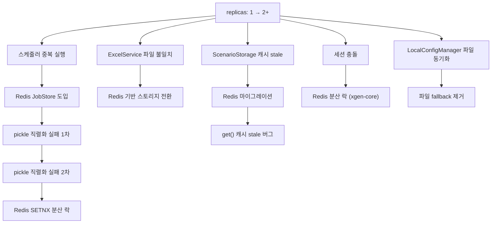

# XGEN 멀티파드 분산 환경 마이그레이션 — Redis 분산 락과 직렬화 삽질기

## 배경

XGEN 2.0의 서비스들(xgen-workflow, xgen-core)은 처음에 단일 파드로 운영했다. replicas: 1이면 별문제가 없다. 스케줄러는 메모리에, 시나리오 스토리지는 파일에, 세션은 로컬 캐시에 두면 됐다.

그런데 운영 환경(prd)에서 replicas를 2 이상으로 올리는 순간 온갖 문제가 터졌다:

- 스케줄된 워크플로우가 **2개 파드에서 동시 실행**
- ExcelService가 읽은 파일이 **다른 파드에서 안 보이는** 문제
- ScenarioStorageService가 **stale 캐시**를 반환
- APScheduler Redis JobStore에서 **pickle 직렬화 오류**
- 동시 로그인으로 인한 **세션 충돌**

2026년 2월 4일부터 13일까지 약 10일간 이 문제들을 하나씩 해결한 과정을 기록한다.

## 문제 전체 맵



## 1. 스케줄러 분산 환경 지원

### 문제: 동일 워크플로우 2번 실행

```
# 커밋: feat: 스케줄러 분산 환경 지원 (Redis 기반)
# 날짜: 2026-02-04
```

XGEN의 워크플로우 스케줄러는 APScheduler를 사용한다. 단일 파드에서는 `MemoryJobStore`로 충분했다. 그런데 replicas: 2가 되면, 각 파드의 APScheduler가 독립적으로 동작하면서 **같은 스케줄을 2번 실행**하는 문제가 발생했다.

### 해결: Redis JobStore + 분산 락 이중 방어

듀얼 모드로 설계했다. 환경변수 `REDIS_HOST`가 있으면 분산 모드, 없으면 단독 모드:

```python
# service/schedule/scheduler_service.py

# Redis JobStore (분산 모드용) - 조건부 import
try:
    from apscheduler.jobstores.redis import RedisJobStore
    import redis.asyncio as aioredis
    REDIS_AVAILABLE = True
except ImportError:
    REDIS_AVAILABLE = False

REDIS_KEY_PREFIX = "xgen:scheduler"

def _is_distributed_mode() -> bool:
    """환경변수 REDIS_HOST 유무로 분산 모드 자동 판별"""
    return REDIS_AVAILABLE and _get_redis_config() is not None
```

분산 모드에서는 Redis JobStore를 사용하되, 그것만으로는 부족해서 **SETNX 기반 분산 락**도 추가했다:

```python
class WorkflowSchedulerService:
    def __init__(self):
        self._distributed_mode = _is_distributed_mode()

        if self._distributed_mode and redis_config:
            # Redis JobStore: 모든 파드가 같은 job 저장소 공유
            jobstores = {
                'default': RedisJobStore(
                    host=redis_config["host"],
                    port=redis_config["port"],
                    password=redis_config["password"],
                    db=redis_config["db"],
                    jobs_key=f'{REDIS_KEY_PREFIX}:jobs',
                    run_times_key=f'{REDIS_KEY_PREFIX}:run_times',
                )
            }
            # 분산 락용 Redis 클라이언트
            self._redis_client = aioredis.Redis(
                host=redis_config["host"],
                port=redis_config["port"],
                password=redis_config["password"],
                db=redis_config["db"],
                decode_responses=True,
            )
        else:
            jobstores = {'default': MemoryJobStore()}
            self._redis_client = None

        self._scheduler = AsyncIOScheduler(
            jobstores=jobstores,
            job_defaults={'max_instances': 1},  # 동시 실행 방지
        )
```

Redis JobStore가 중복 job 등록은 막아주지만, 실행 시점의 중복까지 완벽하게 방어하지는 못한다. 그래서 워크플로우 실행 직전에 SETNX 락을 건다:

```python
async def _execute_with_lock(self, session_id: str, ...):
    """분산 락을 사용한 워크플로우 실행"""
    if self._distributed_mode and self._redis_client:
        lock_key = f"{REDIS_KEY_PREFIX}:lock:{session_id}"

        # SETNX: key가 없을 때만 설정 (원자적 연산)
        lock_acquired = await self._redis_client.set(
            lock_key, "1",
            nx=True,   # key가 없을 때만 설정
            ex=600,    # 10분 만료 (안전장치)
        )

        if not lock_acquired:
            self.logger.info(
                f"다른 Pod에서 실행 중, 스킵: session={session_id}"
            )
            return

        try:
            await self._do_execute(session_id, ...)
        finally:
            await self._redis_client.delete(lock_key)
    else:
        # 단독 모드: 락 없이 바로 실행
        await self._do_execute(session_id, ...)
```

이 이중 방어 구조로 스케줄러 중복 실행 문제를 해결했다.

## 2. APScheduler pickle 직렬화 삽질

### 1차 실패: 클로저 함수는 pickle이 안 된다

```
# 커밋: fix: 스케줄러 pickle 직렬화 오류 수정 (Redis JobStore 호환)
# 날짜: 2026-02-04
```

Redis JobStore를 도입하자마자 터진 에러:

```
PicklingError: Can't pickle <function create_workflow_executor_for_scheduler.
<locals>.executor at 0x7f...>: it's not found as ...
```

APScheduler는 job을 Redis에 저장할 때 **pickle로 직렬화**한다. 그런데 기존 코드에서 워크플로우 실행 함수를 클로저로 만들고 있었다:

```python
# 변경 전: 클로저 (pickle 불가)
def create_workflow_executor_for_scheduler(db_manager):
    async def executor(request_data, user_id):
        return await execute_workflow_for_schedule(
            request_data, user_id, db_manager
        )
    return executor  # 내부 함수 반환 → pickle 실패
```

클로저는 외부 변수(`db_manager`)를 캡처하기 때문에 pickle이 모듈 레벨에서 함수를 찾을 수 없어 직렬화에 실패한다.

해결책은 **모듈 레벨 함수 + 글로벌 변수**로 전환하는 것이다:

```python
# 변경 후: 모듈 레벨 함수 (pickle 가능)
_scheduler_db_manager = None

def set_scheduler_db_manager(db_manager):
    global _scheduler_db_manager
    _scheduler_db_manager = db_manager

def get_scheduler_db_manager():
    return _scheduler_db_manager

async def scheduled_workflow_executor(request_data, user_id):
    """모듈 레벨 함수 — pickle 직렬화 가능"""
    db_manager = get_scheduler_db_manager()
    return await execute_workflow_for_schedule(
        request_data, user_id, db_manager
    )

def create_workflow_executor_for_scheduler(db_manager):
    set_scheduler_db_manager(db_manager)  # 글로벌에 저장
    return scheduled_workflow_executor     # 모듈 레벨 함수 반환
```

### 2차 실패: 인스턴스 메서드도 pickle이 안 된다

```
# 커밋: fix: APScheduler Redis JobStore pickle 직렬화 오류 수정
# 날짜: 2026-02-04
```

1차 수정 후에도 같은 에러가 다른 곳에서 터졌다. 이번에는 스케줄러 서비스의 인스턴스 메서드가 문제였다:

```python
# 문제 코드: 인스턴스 메서드를 APScheduler에 등록
self._scheduler.add_job(
    self._execute_workflow,  # bound method → self 전체를 pickle 시도
    trigger=trigger,
    id=job_id,
    ...
)
```

`self._execute_workflow`는 bound method다. pickle이 이 함수를 직렬화하려면 `self` 객체 전체를 직렬화해야 하는데, `self`에는 Redis 클라이언트, APScheduler 인스턴스 등 **pickle이 불가능한 객체들**이 들어 있다.

해결: 스케줄러에 등록하는 함수를 모듈 레벨 래퍼로 분리하고, 세션 ID만 인자로 넘겨서 실행 시점에 서비스 인스턴스를 찾도록 변경했다:

```python
# 모듈 레벨 래퍼 함수
async def _scheduled_job_wrapper(session_id: str, user_id: int, ...):
    """
    APScheduler가 호출하는 진입점.
    모듈 레벨 함수이므로 pickle 가능.
    실행 시점에 서비스 인스턴스를 가져와서 실제 로직 수행.
    """
    service = WorkflowSchedulerService.get_instance()
    await service._execute_with_lock(session_id, user_id, ...)

# job 등록 시
self._scheduler.add_job(
    _scheduled_job_wrapper,  # 모듈 레벨 함수
    trigger=trigger,
    id=job_id,
    kwargs={
        "session_id": session_id,
        "user_id": user_id,
    },
)
```

핵심 교훈: **APScheduler + Redis JobStore 조합에서는 job 함수가 반드시 모듈 레벨이어야 한다.** 클로저도, 인스턴스 메서드도 pickle이 안 된다. 함수에 필요한 컨텍스트는 인자(primitive)로 넘기고, 실행 시점에 재구성해야 한다.

## 3. ScenarioStorageService Redis 마이그레이션

### 문제: 파일 기반 스토리지의 파드 격리

```
# 커밋: feat: migrate ScenarioStorageService to Redis for multi-pod consistency
# 날짜: 2026-02-04
```

ScenarioStorageService는 워크플로우 실행 중 생성된 시나리오 데이터를 저장하는 서비스다. 원래는 로컬 파일 시스템에 JSON으로 저장했다. 단일 파드에서는 문제없지만, 멀티 파드에서는 **파드 A에서 저장한 시나리오를 파드 B에서 읽을 수 없다.**

해결은 Redis로 전환하는 것이다. 하지만 Redis가 없는 로컬 개발 환경도 지원해야 하므로 **듀얼 백엔드** 구조로 설계했다:

```python
class ScenarioStorageService:
    """시나리오 스토리지 — Redis 우선, 파일 fallback"""

    def __init__(self):
        self._redis = RedisClient.get_instance()
        self._use_redis = self._redis.is_connected

    def save(self, session_id: str, scenario_data: dict) -> bool:
        if self._use_redis:
            key = f"scenario:{session_id}"
            return self._redis.set(key, scenario_data, ttl=86400)
        else:
            return self._save_to_file(session_id, scenario_data)

    def get(self, session_id: str) -> Optional[dict]:
        if self._use_redis:
            key = f"scenario:{session_id}"
            return self._redis.get(key)
        else:
            return self._load_from_file(session_id)
```

### stale 캐시 버그

```
# 커밋: fix: ScenarioStorageService.get() 캐시 stale 버그 수정
# 날짜: 2026-02-05
```

Redis 전환 직후 미묘한 버그가 발생했다. `get()`이 업데이트된 값이 아닌 이전 값을 반환하는 현상이다.

원인은 메모리 캐시 레이어에 있었다. 성능 최적화를 위해 `get()`에 인메모리 캐시를 두고 있었는데, Redis에 값을 쓴 뒤 이 캐시를 무효화하지 않았다:

```python
# 버그 코드
class ScenarioStorageService:
    def __init__(self):
        self._cache = {}  # 인메모리 캐시

    def get(self, session_id: str):
        # 캐시에 있으면 바로 반환 (Redis 값 변경을 모름)
        if session_id in self._cache:
            return self._cache[session_id]

        data = self._redis.get(f"scenario:{session_id}")
        if data:
            self._cache[session_id] = data
        return data

    def save(self, session_id: str, data: dict):
        self._redis.set(f"scenario:{session_id}", data)
        # 캐시 무효화 누락!
```

수정은 간단했다. `save()` 시 캐시를 무효화하는 것이다:

```python
def save(self, session_id: str, data: dict):
    self._redis.set(f"scenario:{session_id}", data)
    self._cache.pop(session_id, None)  # 캐시 무효화
```

하지만 이것만으로는 부족하다. **파드 A에서 save → 파드 B의 캐시는 여전히 stale**이다. 결국 멀티 파드 환경에서 인메모리 캐시 자체가 위험하다고 판단하고, 분산 환경에서는 캐시를 비활성화했다:

```python
def __init__(self):
    self._redis = RedisClient.get_instance()
    self._use_redis = self._redis.is_connected
    # 분산 환경에서는 인메모리 캐시 비활성화
    self._enable_cache = not self._use_redis
```

## 4. ExcelService 멀티파드 대응

```
# 커밋: fix: ExcelService 멀티파드 환경 Redis 연동
# 날짜: 2026-02-04
```

ExcelService는 워크플로우에서 엑셀 파일을 읽고 쓰는 서비스다. 엑셀 루프 자동화(반복 실행) 시 현재 행 인덱스, 처리 상태 등을 추적해야 한다. 단일 파드에서는 딕셔너리에 저장했지만 멀티 파드에서는 당연히 공유가 안 된다.

ExcelService도 ScenarioStorageService와 같은 패턴으로 Redis에 상태를 저장하도록 변경했다:

```python
class ExcelService:
    def __init__(self):
        self._redis = RedisClient.get_instance()

    def save_loop_state(self, session_id: str, state: dict):
        """엑셀 루프 상태 Redis 저장"""
        key = f"excel:loop:{session_id}"
        self._redis.set(key, state, ttl=3600)

    def get_loop_state(self, session_id: str) -> Optional[dict]:
        """엑셀 루프 상태 조회"""
        key = f"excel:loop:{session_id}"
        return self._redis.get(key)
```

## 5. 세션 충돌 방지 — Redis 분산 락 (xgen-core)

```
# 커밋: fix: get_auth_context() Redis 분산 락: 동시 로그인으로 인한 세션 충돌 방지
# 날짜: 2026-02-13
```

xgen-core의 인증 프로필 시스템에서 발견된 문제다. 인증 프로필(`AuthProfile`)은 외부 서비스에 로그인해서 토큰을 획득하고, 이 토큰을 워크플로우 실행 시 자동으로 주입하는 기능이다.

멀티 파드 환경에서 두 파드가 **동시에 같은 인증 프로필로 로그인을 시도**하면 문제가 생긴다. 외부 서비스가 이전 세션을 무효화하거나, 두 파드가 서로 다른 토큰을 갖게 되는 것이다.

해결: Redis 분산 락으로 **동시 로그인 자체를 차단**했다:

```python
# service/auth/auth_service.py

async def get_auth_context(
    self,
    profile_id: int,
    user_id: int,
    force_refresh: bool = False,
) -> dict:
    """인증 컨텍스트 획득 (분산 환경 안전)"""
    lock_key = f"auth:lock:{profile_id}:{user_id}"
    cache_key = f"auth:context:{profile_id}:{user_id}"

    # 1. 캐시에서 먼저 확인 (락 없이)
    if not force_refresh:
        cached = await self._redis.get(cache_key)
        if cached:
            return cached

    # 2. 분산 락 획득 (5초 대기, 30초 만료)
    lock = self._redis.lock(lock_key, timeout=30)
    acquired = await lock.acquire(blocking_timeout=5)

    if not acquired:
        # 다른 파드가 로그인 중 — 잠시 후 캐시에서 가져오기
        await asyncio.sleep(2)
        cached = await self._redis.get(cache_key)
        if cached:
            return cached
        raise AuthError("인증 프로필 락 획득 실패")

    try:
        # 3. 락 획득 후 다시 캐시 확인 (다른 파드가 이미 갱신했을 수 있음)
        cached = await self._redis.get(cache_key)
        if cached and not force_refresh:
            return cached

        # 4. 실제 로그인 수행
        context = await self._perform_login(profile_id, user_id)

        # 5. 캐시에 저장 (TTL = 프로필의 ttl 설정)
        profile = await self._get_profile(profile_id)
        await self._redis.set(
            cache_key, context,
            ttl=profile.ttl - profile.refresh_before_expire
        )
        return context
    finally:
        await lock.release()
```

이 패턴은 **Double-Checked Locking**의 분산 버전이다:

1. 락 없이 캐시 확인 (빠른 경로)
2. 캐시 miss → 분산 락 획득
3. 락 획득 후 다시 캐시 확인 (다른 파드가 갱신했을 수 있으므로)
4. 여전히 miss → 실제 로그인 수행 + 캐시 저장

## 6. LocalConfigManager 분산 환경 지원

```
# 커밋: feat: LocalConfigManager 분산 환경 지원 (파일 fallback 제거)
# 날짜: 2026-02-04
```

xgen-core의 LocalConfigManager는 앱 설정(시나리오 설정, 사이트 설정 등)을 관리하는 서비스였다. 원래는 **파일에 저장 + 메모리 캐시**하는 구조였는데, 멀티 파드에서는 파드 A에서 설정을 변경해도 파드 B에 반영이 안 된다.

해결 방향은 명확했다. DB(PostgreSQL)를 primary storage로 하고, 파일 fallback을 제거했다:

```python
class LocalConfigManager:
    def __init__(self, db_manager):
        self._db = db_manager
        # 파일 경로 관련 코드 제거

    async def get_config(self, key: str) -> Optional[dict]:
        """DB에서 설정 조회 (파일 fallback 없음)"""
        return await self._db.get_config(key)

    async def save_config(self, key: str, value: dict):
        """DB에 설정 저장"""
        await self._db.upsert_config(key, value)
```

## 7. xgen-session-station 통합

```
# 커밋: feat: xgen-session-station을 xgen-core에 통합
# 날짜: 2026-02-10
```

xgen-session-station은 원래 독립 서비스였다. 인증 프로필 관리, 외부 서비스 로그인, 토큰 갱신을 담당했다. 그런데 분산 환경으로 전환하면서, 이 서비스를 독립으로 둘 이유가 없어졌다.

- session-station의 기능은 전부 Redis 기반으로 동작
- xgen-core와 밀접하게 연동되어 별도 서비스로 분리할 필요 없음
- 서비스 하나 줄이면 배포/운영 복잡도 감소

session-station의 라우터, 서비스, DB 모델을 xgen-core로 옮기고, 기존 서비스를 제거했다. 게이트웨이의 라우팅도 변경했다:

```python
# xgen-backend-gateway: middleware/auth_interceptor.py

# 변경 전
SESSION_STATION_BASE_URL = os.environ.get(
    "SESSION_STATION_BASE_URL",
    "http://xgen-session-station:8000"
)

# 변경 후
SESSION_STATION_BASE_URL = os.environ.get(
    "SESSION_STATION_BASE_URL",
    "http://xgen-core:8000"  # xgen-core에 통합됨
)
```

## Redis 클라이언트 설계

모든 서비스에서 공통으로 사용하는 Redis 클라이언트는 싱글톤 패턴으로 구현했다:

```python
class RedisClient:
    """
    싱글톤 Redis 클라이언트.
    REDIS_HOST 환경변수가 있으면 연결, 없으면 graceful degradation.
    """
    _instance: Optional['RedisClient'] = None
    _initialized: bool = False

    def __new__(cls, *args, **kwargs):
        if cls._instance is None:
            cls._instance = super().__new__(cls)
        return cls._instance

    def __init__(self, key_prefix: str = "workflow_executor"):
        if RedisClient._initialized:
            return

        self._host = os.getenv('REDIS_HOST', 'redis')
        self._port = int(os.getenv('REDIS_PORT', '6379'))
        self._password = os.getenv('REDIS_PASSWORD', '')
        self._key_prefix = key_prefix
        self._connection_available = False

        self._connect()
        RedisClient._initialized = True

    def _make_key(self, *parts: str) -> str:
        """키 생성 (prefix 포함)"""
        return f"{self._key_prefix}:{':'.join(parts)}"

    def set(self, key: str, value: Any, ttl: Optional[int] = None) -> bool:
        if not self._connection_available:
            return False
        full_key = self._make_key(key)
        data = json.dumps(value) if not isinstance(value, str) else value
        if ttl:
            self._redis_client.setex(full_key, ttl, data)
        else:
            self._redis_client.set(full_key, data)
        return True

    def get(self, key: str, default: Any = None) -> Any:
        if not self._connection_available:
            return default
        full_key = self._make_key(key)
        data = self._redis_client.get(full_key)
        if data is None:
            return default
        try:
            return json.loads(data)
        except json.JSONDecodeError:
            return data
```

핵심 설계 원칙:

- **Graceful degradation**: Redis 연결이 안 되면 에러 대신 기본값 반환. 로컬 개발 환경에서 Redis 없이도 동작
- **Key prefix**: 서비스별 prefix로 키 충돌 방지 (`workflow_executor:scenario:session123`)
- **자동 JSON 직렬화**: dict를 넘기면 자동으로 JSON으로 저장/복원

## 회고

10일간의 마이그레이션에서 배운 것을 정리한다.

**pickle 직렬화는 생각보다 제약이 크다.** APScheduler + Redis JobStore 조합에서 job 함수는 반드시 모듈 레벨이어야 한다. 클로저, 인스턴스 메서드, 람다 — 전부 안 된다. 이건 APScheduler 공식 문서에도 잘 안 나와 있어서, 실제로 배포해보고 나서야 알게 되는 경우가 많다.

**인메모리 캐시는 분산 환경의 적이다.** 단일 파드에서는 성능 최적화지만, 멀티 파드에서는 stale 데이터의 원인이 된다. 분산 환경으로 전환할 때 가장 먼저 해야 할 것은 코드베이스에서 인메모리 캐시(딕셔너리, 글로벌 변수)를 전부 찾아서 제거하거나 Redis로 옮기는 것이다.

**듀얼 모드 설계가 현실적이다.** 모든 환경에 Redis가 있지는 않다. 로컬 개발 환경에서는 Redis 없이 파일/메모리로 동작하고, K8s 환경에서는 자동으로 Redis를 사용하는 듀얼 모드가 개발 생산성과 운영 안정성을 동시에 만족시킨다.

**서비스 통합은 분산 환경에서 더 가치 있다.** xgen-session-station을 xgen-core에 통합한 건, 서비스 수를 줄여서 배포 복잡도를 낮추는 효과가 있었다. 마이크로서비스라고 무조건 쪼개는 것보다, 기능적 응집도가 높은 것끼리 합치는 게 운영에 유리한 경우도 있다.
